[TOC]

# P10 4: classification <!--视频，难  69‘-->

**Classification(分类)，找一个function ,输入object x，输出样本属于哪一类** 

## 应用场景

- 金融风控(二分类):  输入某一个人的收入年龄等，输出是否要贷款
- 医疗诊断(多分类): 根据症状,年龄,性别,病史等分析生的是哪种病
- 手写文字识别:输入手写的文字,输出写的是什么字
- 人脸识别:输入一个人脸,输出这个人是谁

## 例子：输入某一只宝可梦的数据，输出宝可梦的种类

宝可梦共有18种属性

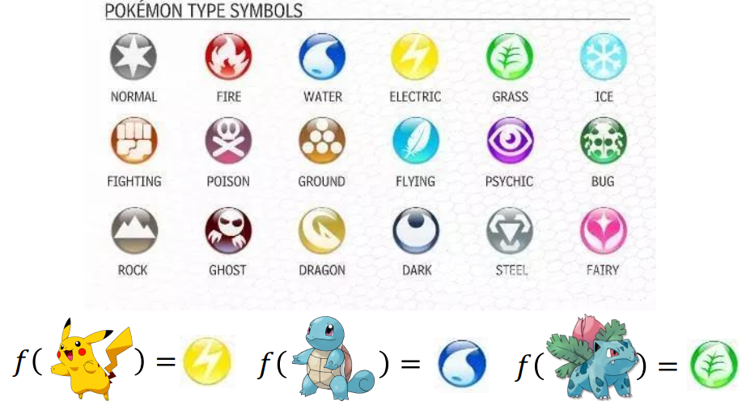

### 首先要把宝可梦数值化

1. 可输入的数据有total(多强 )，HP(生命值)，Attack(攻击力)，Defense(防御力)，SP Atk(特殊攻击力)，SP Def(特殊攻击的防御力)，Speed(速度)
2. 一只皮卡丘可以用一个7维的 vector 来描述它  X = [320,35,55,40,50,50,90]
3. 把这7个特征输进一个function, 这个function告诉我们这个宝可梦是哪种宝可梦

### 如何做分类

1. 要先收集data,编号400以下的当作 training data,编号400以上的当作testing data，data是一些input和output的pair:

   1. $$
      (x^1,\hat{y^1}),(x^2,\hat{y^2}) .......(x^3,\hat{y^3}),
      $$

2. 尝试用线性回归硬解分类问题

   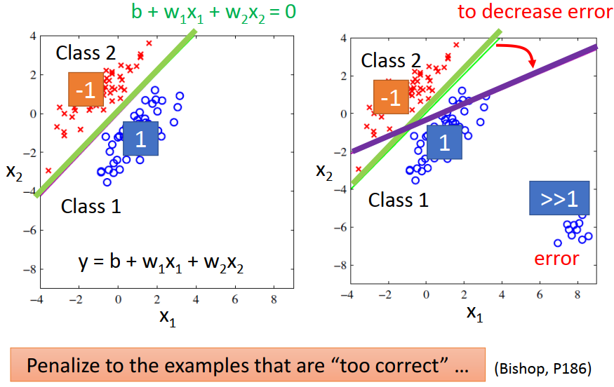

   1. 以二分类为例,class1标为1,class2标为-1,预测靠近1则为class1,靠近-1则为class2
   2. 对于蓝色的点我们希望它越接近1越好,红色的点希望越接近-1越好
   3. 对于左边的图,用 Regression 可以找到分界线(绿色的线)
   4. 但当蓝色的点分布为右图,用绿色的线作为model右下角的点会远远大于1,但我们希望蓝色的点越接近1越好(太小或者太大都不行),用 Regression 我们可以得到紫色的线
   5. Regression定义function 好坏的方式对Classification不适用,**regression会惩罚那些太正确的点(右下角)**
   6. 当多分类如1、2、3类时，**用Regression 使1和3人为上距离变远**，不符合原始分类假设

### 理想的方案

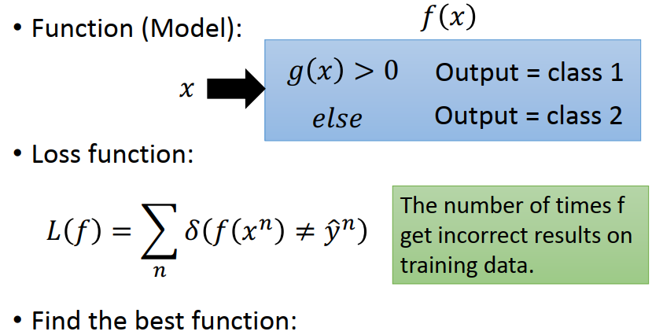

1. 找到某个function f(x),内建一个g(x)，当g(x)>0时，f(x)输出为class1，不然输出class2
2. Loss function 统计的是预测错误的次数
   1. 如果预测的output不一样的话,就输出1,否则就是0
3. Find the best function: e.g Perceptron(感知机), SVM  

### 概率模型，几率问题

#### 有两个盒子

box1和box2里面有不同数量的蓝球和绿球，从某一个盒子里面随机抽取一个球，球是蓝色的，球来自box1和box2的几率分别是多少

1. 从box1抽一个球的几率是P(B1) = 2/3,从box2抽一个球的几率是P(B2) = 1/3
2. box1里面蓝球占 P(Blue|B1) = 4/5，绿球占 P(Green|B1) = 1/5
3. box2里面蓝球占 P(Blue|B2) = 2/5，绿球占 P(Green|B2) = 3/5
4. 蓝球来自box1的概率就为  *formula 1*

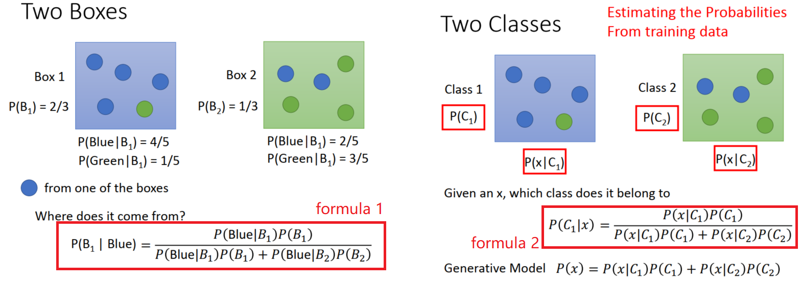

#### 两个类别： class1和class2

有一个要分类的对象x,它从某一个class里面sample出来的几率是多少呢

1. 从class1里面抽一个x出来的几率 ：P(C1)
2. 从class2里面抽一个x出来的几率 ：P(C2)
3. 从class1抽出我们现在在考虑的x的几率 ：P(x|C1)
   - class1里面包含几种样本，我们抽中*我们现在考虑的这种样本 x* 的概率
4. 从class2抽出我们现在在考虑的x的几率 ：P(x|C2)
5. 当给了我们一个x时，有了以上4个数值，就可以计算这个x属于class1的几率 : **P(C1|x)   *formula 2***

#### Generative(生成的) Model 

知道这个几率的话，问题就解决了，给我一只宝可梦x，**计算从哪一个class里面来的几率最大，几率最大的class就是正确答案。**要算出P(C1|x)，需要算P(C1)，P(C2)，P(x|C1)，P(x|C2)这四个值，这四个值需要从training data 估测出来。这一整套想法叫 Generative(生成的) Model

1. 有这个model的话可以 generate 一个x,**可以计算某一个x出现的几率**
2. 如果可以计算每一个x出现的几率，就知道x的distribution (分布)
3. 就可以用这个 distribution  sample x 出来

$$
P(x) = P(x|C_1) P(C_1)+ P(x|C_2) P(C_2)
$$

### 计算 x 的 distribution

#### Prior (先验）：计算P(C1) ，P(C2)

1. class1是water(水系的)宝可梦，class2是Normal(一般系的)宝可梦，其他先不考虑
2. 编号在400以下的 Water 和 Normal 作为training data,剩下的作为 testing data
3. Training data 里面有 79只 Water, 61只 Normal
4. 从class1 里面 sample 一只宝可梦的几率是 P(C1) = 79 / (79 + 61) =0.56 
5. 从class2 里面 sample 一只宝可梦的几率是 P(C2) = 61 / (79 + 61) =0.44

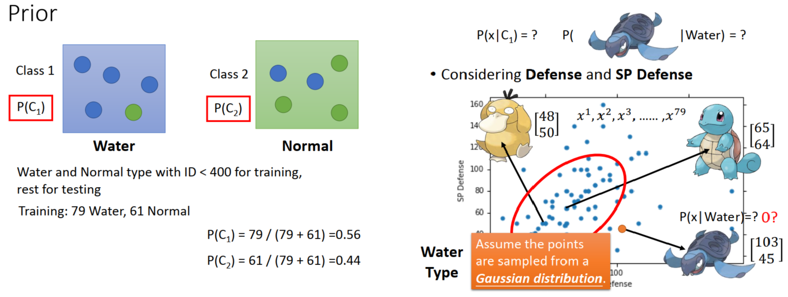

#### Probability from Class 

如果给我某一个class，某一只宝可梦是从这个class sample出来的几率，P(x|C1) =   ?

​	e.g.  从水系的宝可梦里面，挑一只宝可梦出来，是**海龟**的几率有多大

1. 每一只宝可梦都用一个 vector(向量)来表示, vector 里面的值就是他的各种特征值，每一个宝可梦都是用一堆**feature**来描述它
2. 把79只水系宝贝的 Defense 和 SP Defense  画出来，每一点代表一只宝可梦
3. 当给我们一个新的点，不在training data 里面，比如海龟 [103,45],从水系里面挑一只宝可梦，挑到海龟的几率，不是0

#### Gaussian distribution  高斯分布

可以想象这79只神奇宝贝只是冰山的一角，水系神奇宝贝的  Defense 和 SP Defense 是从 Gaussian distribution 里面sample 出来的。只是sample 了79个点以后得到了分布为图中所示，从 Gaussian distribution sample 出海龟的点的几率并不是0

假设这79个点是从 Gaussian distribution 里面sample 出来的，如果给我这79个点，我们怎么找到那一个 Gaussian distribution

1. input: vector x (某一只宝可梦的数值)
2. output: 这一只宝可梦 x 从这一个distribution里面被sample出来的几率(严格来说并不是真正的几率，是和几率成正比的)
3. 几率的分布由 mean **μ** (均值,分布的中心,是一个 vector ) 和 covariance matrix **Σ** (协方差,散的程度,是一个 matrix (矩阵) )决定
4. **把 μ 和  Σ  带入 Gaussian distribution function,就会有不同的形状**
5. 同样的x,如果有不同的  **μ** 和不同的  **Σ**  ，带进x，他们的output几率分布就会是不一样的
   1. 同样的 **Σ** ，不同的 **μ** ，代表几率分布最高点的地方不一样（左图）
   2. 同样的 **μ** ，不同的 **Σ**  ，代表几率分布最高点一样，分布散的程度不一样 （右图）

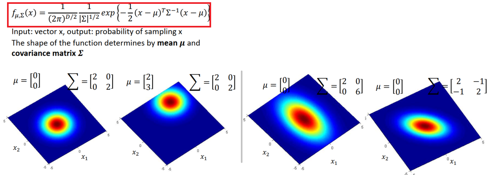

#### Maximum Likelihood  极大似然估计

假设有一个 Gaussian distribution 存在，从这个 Gaussian distribution 里面sample 79次以后，sample出这79个点。

1. 假设可以根据这79个点估测出 Gaussian distribution 的  μ 和  Σ 
2. 给我们一个新的点x(不在这79个sample 里面)，
3. 如果我们知道   μ 和  Σ 的话，就可以把 Gaussian distribution function 写出来
4. 把x带进去，经过一串计算，就可以算出某一个x,从这个 Gaussian distribution 里面被 sample 出来的几率
5. 如果x越接近中心点 μ，sample 出来的几率比较大；如果比较远，sample 出来的几率比较小

##### 如何找 μ 和  Σ（其实我们并没有计算 Maximum Likelihood，而是利用这个概念找到计算  μ 和  Σ 的方法）

这79个点可以从任何一个 Gaussian distribution 里面被 sample 出来,但是他们sample出这79个点的likelihood可能性不同

如果给定某个 Gaussian 的 μ 和  Σ，我们就能就计算出这个Gaussian 的 **likelihood**，也就是说给我们一个 Gaussian 的 μ 和  Σ，就可以算出这个高斯分布sample出这79个点的几率

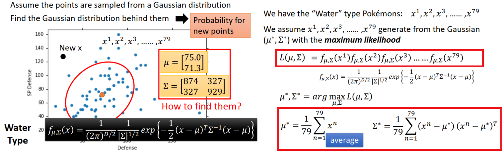

**Likelihood  的input就是  Gaussian 的 μ 和  Σ，把 μ 和  Σ 带到 Likelihood function 里面，会得到这一对 μ 和  Σ sample 出这79个点的几率有多大**

1. 因为这79个点是独立被sample出来的，这个Gaussian sample出这79个点的几率，就是这个Gaussian sample出*第一个点的几率* 乘上 *第二个点的几率*  乘上sample出 *第三个点的几率*，一直到 乘上sample出 *第79个点的几率*
2. 我们有79只水系神奇宝贝，他是从某一个Gaussian 被sample出来的
3. 找一个 Gaussian  ，**那一个Gaussian  sample出这79个点的几率最大，也就是 Likelihood  最大的Gaussian  **(μ *, Σ *)
4. 穷举所有的 μ 和  Σ，看哪一个可以让上面的 Likelihood 式子最大，就是我们认为最有可能产生这79个点的的 (μ *, Σ *)
5. **x的平均值得到的 μ * 可以让Likelihood 最大，进一步再通过公式算出  Σ ^*^**

**有了上面的公式就可以得到 water(水系的)宝可梦的 (μ^1^, Σ^1^)和Normal(一般系的)宝可梦的(μ^2^, Σ^2^)**

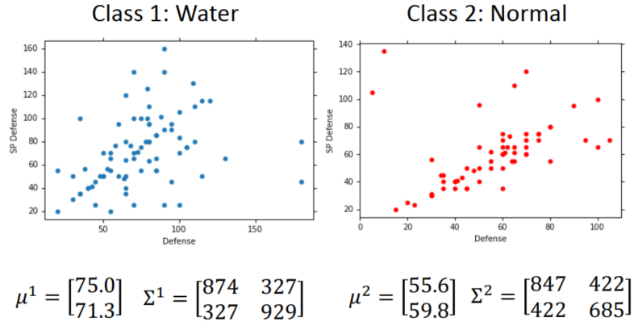

### classification  

我们得到了所有需要的数据，可以开始做分类了

1. 分类问题只要算得出P(C1|x)：给我一个x,他是从 C1来的几率，如果 P(C1|x) > 0.5,那么x就属于class1
2. P(C1)，P(C2)，P(x|C1)，P(x|C2)这四个值 都已经分别算出来了（左图）
3. 结果是右图，蓝色的点是water(水系的)宝可梦的分布，红色点是Normal(一般系的)宝可梦的分布
4. 右图左上角中的每一个点都可以算它是  C1的几率，几率用彩虹图表示，红色区域表示class1-water(水系的)宝可梦的几率比较大，蓝色区域水系神奇宝贝的几率比较小
5. 右图右上角中 P(C1|x) > 0.5 就是 class1（红色区间），P(C1|x) <0.5 就是class 2（蓝色区间）
6. 右图右下角为testing data (编号大于400) 的分布，正确率是47%
7. 因为实验中我们只用了两维，现在尝试用7维空间来计算 ，分别得出 (μ^1^, Σ^1^)和(μ^2^, Σ^2^)，正确率是64%，还是坏掉了

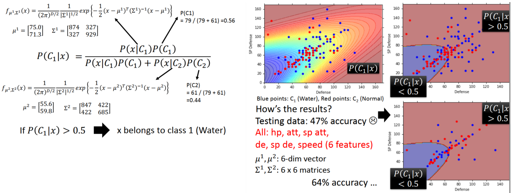

### Modifying Model  

#### 不同的class可以share同一个covariance matrix Σ

1. 其实variance是跟input的feature size的平方成正比的，所以当feature的数量很大的时候，Σ大小的增长是可以非常快的，
2. 在这种情况下，给不同的Gaussian以不同的covariance matrix，会造成model的参数太多，而参数多会导致该model的variance过大，出现overfitting的现象，
3. 因此对不同的class使用同一个covariance matrix，可以有效减少参数

#### 重新计算 μ 和  Σ

1. 现在我们有79只water(水系的)宝可梦，假设它们是从(μ^1, Σ)的Gaussian Generate 出来的
2. 另外61只Normal(一般系的)宝可梦，假设它们是从(μ^2, Σ)的Gaussian Generate 出来的
3. 计算 Maximum Likelihood ，就是所有140个样本根据其所属的 Gaussian 的几率连乘的积
4.  μ^1^和μ^2^算法和前面是一致的， Σ 就是 Σ^1^和 Σ^2^的加权和
5. 没有共用Σ之前,class1和class2的boundary 是一条曲线，共用Σ之后boundary 变成一条直线,这样的model也称之为 **linear model**
6. 考虑所有的 feature原来只有54%的正确率，**共用Σ得到73%的正确率**

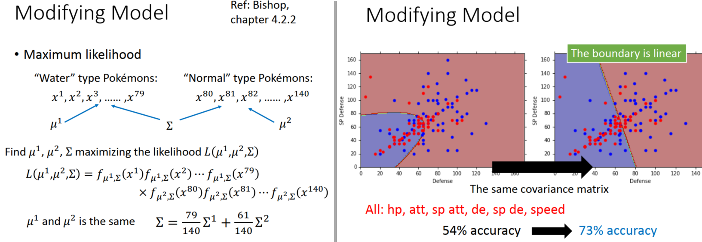

### 整体回顾一下几率模型 Three Steps  

1. 首先有一个model，这个model就是function set
   1. input一个x,可以计算出 P(C1)，P(C2)，P(x|C1)，P(x|C2)，这些就是model的参数
   2. 通过计算得到  P(C1|x)，如果 P(C1|x) > 0.5,那么x就属于class1，反之x就属于class2
2. evaluate function set 里面每一个 function 的好坏
   1. **我们得到的 (μ, Σ)来定义 Probability Distribution，产生我们training data 的 Likelihood  就是这组参数的好坏**
   2. 要做的就是找一个Probability Distribution，它可以最大化产生这些 data的 Likelihood  
3. 找出一组最好的参数：就是前面计算出的 (μ *, Σ *)

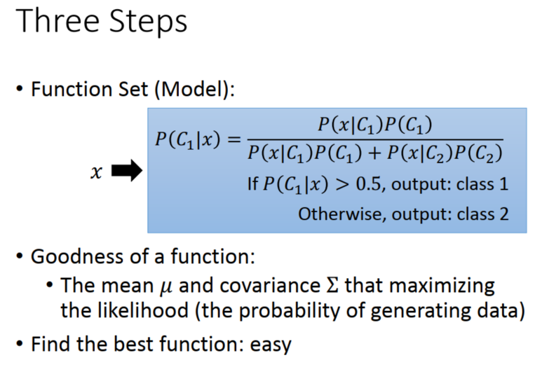

## Probability Distribution

可以自己选择哪一个几率模型是比较适合的

- 选择简单的几率模型，参数比较少，bias就大，variance就小
- 选择复杂的，bias就小，variance就大

### Naive Bayes Classifier(朴素贝叶斯分类法)

有一种常见的假设

1. 假设x 是有一组feature来描述它，假设每一个dimension 产生的几率是independent(独立的)
2. 所以x产生的几率可以拆解成x_1产生的几率P(x1|C1)乘上x_2产生的几率P(x2|C1)……乘上x_k产生的几率P(xk|C1)……一直到乘上x_K产生的几率P(xK|C1)
3. 可以说 x_1产生的几率P(x1|C1)，x_2产生的几率P(x2|C1)……x_k产生的几率P(xk|C1) 都是1维的 Gaussian ，如果这样假设的话，等于是说，原来那多维度的Gaussian，它的covariance matrix变成是diagonal(对角的)，在不是对角线的地方，值都是0，这样就可以更加减少需要的参数量，就可以得到一个更简单的model
4. 这样计算的结果是坏掉的，feature间的covariance  是必要的，比如战斗力和防御力是正相关的，
5. 也不一定要用 Gaussian ，**假设某一个feature 是 binary(二分类)，就可以说它是一个 Bernoulli(伯努利) distributions**
6. **假设所有的 feature都是都是  independent，用这种方法做分类叫做 Naive Bayes Classifier(朴素贝叶斯)**
   1. 如果假设不同的 dimension ，他们之间是independent是切合实际的，Naive Bayes Classifier可以提供很好的 Performance
   2. 如果这个假设不成立，Naive Bayes Classifier的 bias就会很大

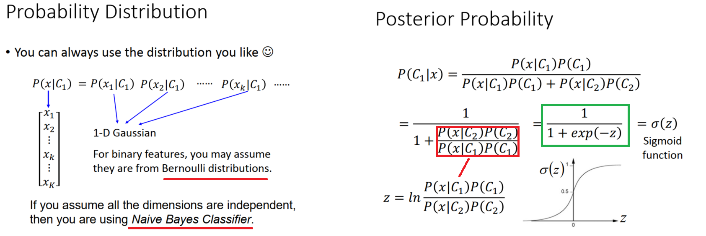

## 分析Posterior Probability 后验概率

1. 把 P(C1|x) 上下同除分子
2. 假设红框里的式子上下颠倒，取ln之后等于z
3. 就可以把 P(C1|x) 化简为绿色方框中的式子，也就是 Sigmoid函数，input是z
4. z趋近于无穷大的时候，output趋近于1;z趋近于负无穷大的时候，output趋近于0

### 分析 z 长什么样子（Warning of Math）

1. Posterior Probability   P(C1|x) 是一个 z 的 Sigmoid function 

2. 在 ln 里面相乘的部分变成相加

3. P(C1)/P(C2)可以得到 N1/N2

4. P(x|C1)/P(x|C2)

   1. 前面红色删除线中没有关系，且上下一致可消掉
   2. 绿色方框里面把它提出了
   3. 紫色方框里面相除变相减，exp和ln抵消，紫色方框前面无ln
   4. 紫色方框和绿色方框相乘变相加
   5. 把紫色方框里面的式子展开
   6. 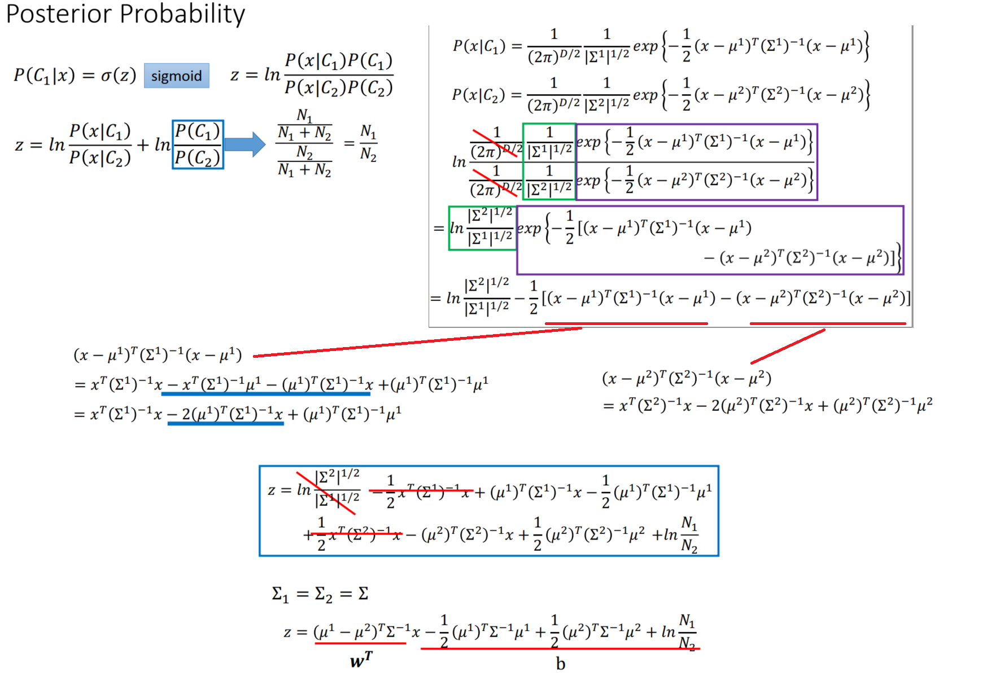

5. 一般会假设Σ=Σ1= Σ2

   1. 红色斜线部分为0可以消掉
   2. 红色横线在 Σ1= Σ2情况下相等，也可以消掉

6. 最后只剩下5项

   1. 把和x有关的两项提出来，系数可以得到一个vactor，假设是w^T
   2. 后面剩的三项其实都是数字，可以用b来表示

7. 所以 Posterior Probability 可以写成

   1. $$
      𝑃(𝐶_1|𝑥) = \sigma(z) = \sigma(w \cdot x + b)
      $$

8. 从上面的式子可以看出来为什么把 Σ1 和 Σ2 共用时，boundary 会是linear 

**在 generative model  里面，我们用某些方法去找到 N1,N2, 𝜇^1^, 𝜇^2^, Σ  ，就可以算出  𝑤 和 𝑏，带进式子 P(C1|x) ,就可以算几率**

*看到这个式子你可能会有一个直觉的想法，为什么要这么麻烦呢？我们的最终目标都是要找一个vector w和const b，我们何必先去搞个概率，算出一些μ 和  Σ什么的，然后再回过头来又去算w和b，这不是舍近求远吗？所以我们能不能直接把w和b找出来呢？这是下一章节的内容*

