[TOC]

# P11 5: Logistic Regression <!--69’-->

## 1. Step 1 : Function Set

我们要找的是一个几率 Pw,b(C1|x),Posterior Probability 

- 如果 Pw,b(C1|x) >0.5,output class 1；否则，output class 2
- 如果 Posterior Probability 想用 Gaussian  ,可以得到下式

$$
𝑃(𝐶_1|𝑥) = \sigma(z) = \sigma(w \cdot x + b)= \sigma(\sum_{i}w_ix_i+b)
$$

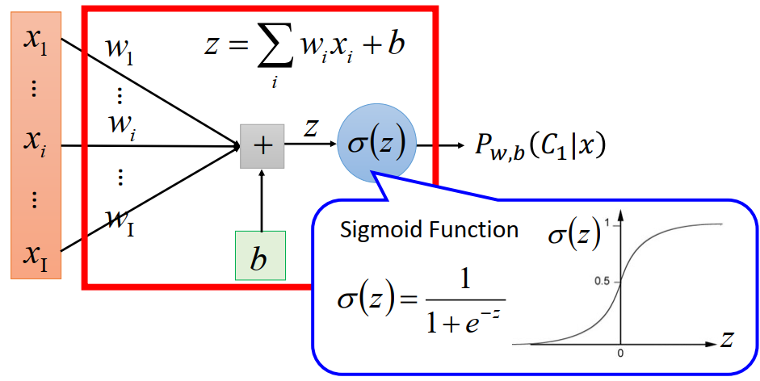

**function set** (现在的function set 受w(vector),b 控制,  可以选不同的w和b可以得到不同的function，所有w和b可以产生的function集合起来就是一个function set)。等式右面就是Posterior Probability,given x 属于 C1 的几率，用图像化来表示如上图，就是**Logistic Regression**
$$
f_{w,b} = P_{w,b}(C_1|x)
$$

1. function 里面有两组参数，一组是wi ,称之为weight，有一整排
2. 有一个constant b,称之为bias
3. 有一个*σ*(*z*)：sigmoid function
4. input 是 x1…… xi……xI
5. 把 x1…… xi……xI  分别乘上  w1…… wi……wI,然后再加上b,得到z,
6. z通过刚才的 sigmoid function *σ*(*z*)的 output的值就是几率 Pw,b(C1|x)

## 2. Step 2: Goodness of Function

有N笔 training data,每一笔training data 都要标出属于哪一个class ，比如 $ x^1 $属于class1， $ x^2 $属于class1……
$$
x^1~~~x^2~~~x^3……~~~x^N\\C^1~~~C^2~~~C3……~~~C^N
$$

1. 假设这笔 training data 是从function 所定义出来的Posterior Probability  $f_{w,b}(x) = P_{w,b}(C_1|x)$ 所产生的 

2. 给我们一个w和b,就决定了这个 Posterior Probability ，就可以计算某一组w和b产生N笔training data的几率

3. 计算几率就是：

   1. 假设  $ x^1 $属于class 1，根据w和b ,产生的几率就是$f_{w,b}(x^1)$,

   2. 假设  $ x^2 $属于class 1，根据w和b ,产生的几率就是$f_{w,b}(x^2)$,

   3. 假设  $ x^3 $属于class 2，根据w和b ,产生的几率就是$(1-f_{w,b}(x^3))$,

   4. ……以此类推,总的几率就是把所有的几率相乘

   5. $$
      𝐿(𝑤,𝑏) = 𝑓_{𝑤,𝑏}(𝑥^1)𝑓_{𝑤,𝑏}(𝑥^2)(1 − 𝑓_{𝑤,𝑏}(𝑥^3)) ⋯ 𝑓_{𝑤,𝑏}(𝑥^𝑁)
      $$

4. 最有可能的参数w和 b,就是那一个有最大的几率产生training data 的那一组$w^*$和 $b^*$,可以最大化几率的w和b

   1. $$
      𝑤^∗, 𝑏^∗ = \mathop {𝑎𝑟𝑔max}_{𝑤,𝑏}𝐿(𝑤,𝑏) = \mathop {𝑎𝑟𝑔min}_{𝑤,𝑏}-ln𝐿(𝑤,𝑏)
      $$

5. 数学转换,原来是找一组w和 b最大化 L(w,b),等于找一组w和 b 最小化 $- ln L(w,b)$，取$-ln$之后相乘变为相加

6. 无法summation over,因为对不同的x,如果它属于不同的class要用不同的方法来处理它，做一个符号上的转换

   1. 如果某一个x属于class 1，target $\hat{y}$为1，如果属于class 2，target $\hat{y}$就是0

   2. 就可以转换每一个 $f_{w,b}(x^N)$，使不同类别有同样的表达式,属于不同类别时会留下不同的表达式

   3. $$
      -lnf_{w,b}(x^n)\rightarrow−[\hat{y}^nlnf(x^n)+(1-\hat{y}^n)ln(1-f(x^n))]
      $$

   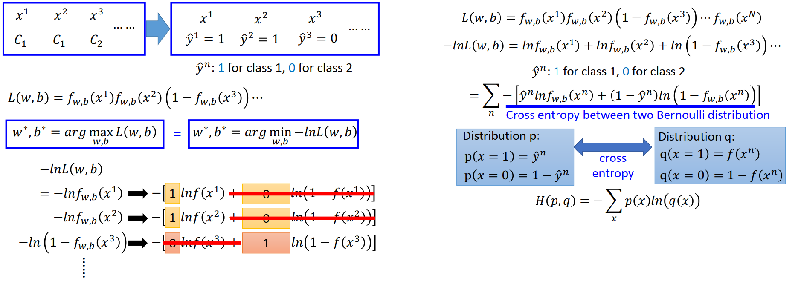

7. 就可以把我们要 minimize 的对象写成一个function，其实是两个**Bernoulli distribution**  的 Cross entropy (*交叉熵:含义是这两个distribution 有多接近，这两个distribution 一模一样的话Cross entropy为0 )*

8. 假设有两个distribution p 和 q，把这两个几率算Cross entropy  H(p,q)

## 3. Step 3: Find the best function  

计算minimize loss function，用 Gradient Descent 方法，举例计算$- ln L(w,b)$对某一个$w
$的这个vector里面某一个element $w_i$的微分

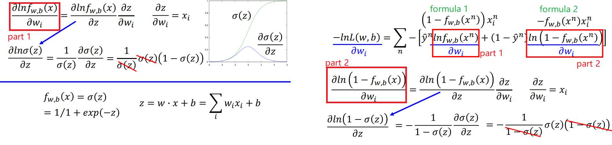

1. 计算 $- ln L(w,b) 对 w_i$的偏微分，只需要计算 part 1式对$w_i$的偏微分和 part 2式对$w_i$的偏微分
2. 计算 part 1 偏微分，$f_{w,b}(x) = \sigma(z)$ f 受到 z 这个 variable 影响，z= wx+b z由w,x,b产生
3. part 1式可以根据 z 拆解成两部分，化简带入$f_{w,b}(x) = \sigma(z)$ ，得到 formula 1
4. part 2式可以根据 z 拆解成两部分，化简带入$f_{w,b}(x) = \sigma(z)$ ，得到 formula 2
5. 将 formula 1和 formula 2 带入式子，$x_i^n$提出来，展开括号计算
6. 得到一个简单的式子
7. 用Gradient Descent 可以 updata wi，wi的updata取决于三件事
   1. learning rate (自己确定)
   2. $x_i$来自于 data
   3. $(\hat{y}^n-f_{w,b}(x^n))$ **代表f 的 output和理想的目标$\hat{y}^n$的差距有多大，离目标越远，updata 的量越大**

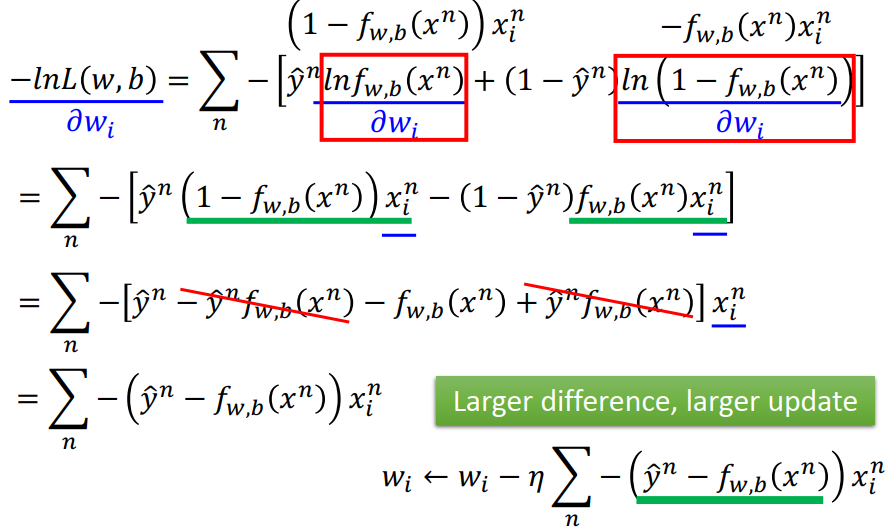

## 4.对比 Logistic Regression 和 linear Regression 

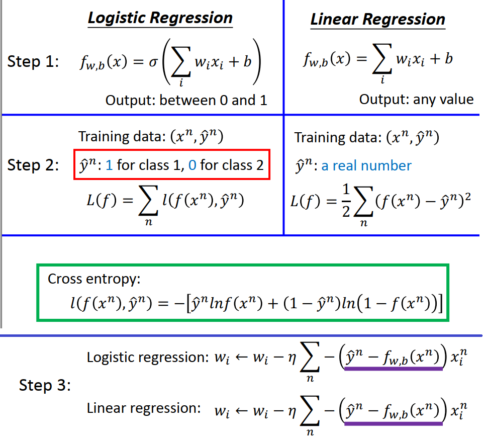

### step 1： Function Set

1. **Logistic Regression:** 
   1. 把每一个 feature乘上一个 w,summation起来，加上b,再通过 sigmoid function *σ*(*z*)，当作function的output
   2. output 由于通过sigmoid function，介于0到1 之间
2. **linear Regression** 
   1. 把 feature乘上 w，再加上b,
   2. output 可以是任何值

### step 2 ：Goodness of Function

1. **Logistic Regression:** 
   1. 有一堆training data  $({x^n},\hat{y}^n)$ 
   2. x属于class 1, $\hat{y}^n=1$ ，如果属于class 2， $\hat{y}^n=0$ ，
   3. 定义的 loss function ，要 minimize 的对象是所有的example的  Cross entropy 的总和
   4. 直观来讲，我们希望function的output和他的target，如果都看成是**Bernoulli distribution**，这两个distribution越接近越好
2. **linear Regression** 
   1. function的output$f(x^n)$和他的target $\hat{y}^n$ 差的平方，就是我们要 minimize  的对象
3. 为什么在 Logistic Regression 中不用和 linear Regression 一样的 square error？

### step 3 ： Find the best function

**Logistic Regression**和**linear Regression** 在做Gradient Descent时参数update的方式是一样的

1. **Logistic Regression:** target  $\hat{y}^n$ 只能是1或者0，f介于1和0之间
2. **linear Regression** ：线性回归中 y，f 可以是任何值

## 5. Logistic Regression + Square Error

为什么Logistic Regression不可以用Square Error

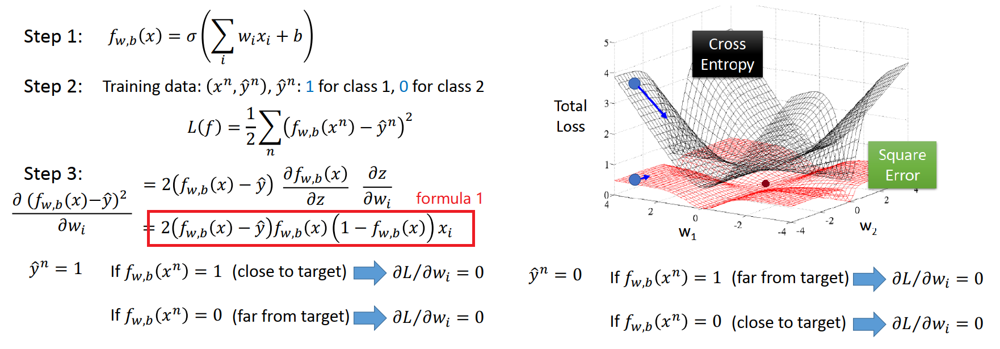

1. 假如使用Square Error作为loss function，同样用Gradient Descent去minimize 
2. 对loss function算微分得到  formula 1
   1. 假设 $\hat{y}^n$ =1，当$f_{w,b}(x^n)=1$时离目标很近,微分为0
   2. 假设 $\hat{y}^n$ =1，当$f_{w,b}(x^n)=0$时离目标非常远,微分为0
   3. 假设 $\hat{y}^n$ =0，当$f_{w,b}(x^n)=1$时离目标很远,微分为0
   4. 假设 $\hat{y}^n$ =0，当$f_{w,b}(x^n)=0$时离目标很近,微分为0
3. 把参数的变化对 total loss 作图，黑色的是 Cross entropy，红色的是Square Error
   1. Square Error在距离目标很近的地方(图中中心点)，微分值很小；距离目标很远的地方，微分值也很小，非常平坦，微分小update慢；无法知道微分小的时候是距目标近还是远，不容易得到好的结果
   2. Cross entropy距离目标越远，微分值越大，参数update越快

## 6. Discriminative vs Generative 判别模型和生成模型

Logistic Regression的方法为**Discriminative**的方法，用 Gaussian来描述这个Posterior Probability称之为为**Generative**的方法

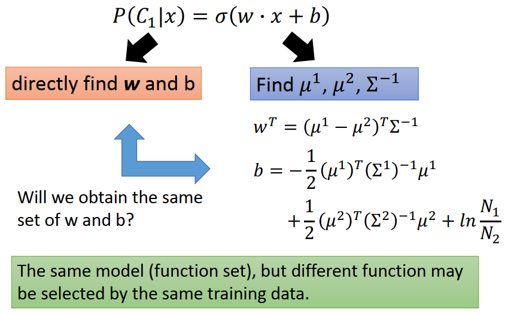

1. 他们的model function set 是一样的，无论是用Logistic Regression还是几率模型，只要在做几率模型的时候把covariance matrix Σ 设成是share的，他们的model是一模一样的*P*(*C*1∣*x*)=*σ*(*w*⋅*x*+*b*),可以找不同的w和b就得到不同的function
2. Logistic Regression没有用任何假设，直接把w,b找出来，用Gradient Descent方法
3. Generative model对 Probability distribution 有假设，假设是某种(高斯/伯努利/朴素贝叶斯) distribution,先算$\mu_1,\mu_2,\Sigma^{-1}$,然后算出w,b
4. 当我们用Logistic Regression或者Posterior Probability的Generative model，我们用来用一个model (function set),但是我们做了不同的假设，所以用同样的training data找出来的**参数不一样**
5. 通常情况 Discriminative model 比 Generative model 表现更好

### Discriminative vs Generative Example

有一个简单的分类问题，每一笔data由两个feature 来描述它.是一个二元分类的问题，有class1和class2

1. training data class 1 收集了一笔data(1,1);class 2 收集到12笔data，4笔(1,0),4笔(0,1),4笔(0,0)
2. testing data 一笔data(1,1)

#### Naive Bayes model

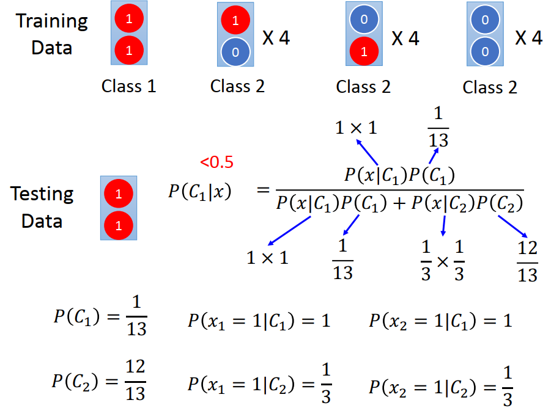

1. 假设所有的 feature 都是 independent $ 𝑃(𝑥|𝐶_𝑖 )=𝑃(𝑥_1|𝐶_𝑖)𝑃(𝑥_2 |𝐶_𝑖 )$
2. 统计所有我们需要的几率$P(C_1),𝑃(𝑥_1= 1|𝐶_1),𝑃(𝑥_2= 1|𝐶_1),P(C_2),𝑃(𝑥_1= 1|𝐶_2),𝑃(𝑥_2= 1|𝐶_2) $
3. 带入几率公式，计算testing data 属于class 1的几率
4. 结果$𝑃(C_1|x)<0.5$,机器会认为testing data 属于class 2 

因为在Naive Bayes里面假设feature 1和feature 2是independent 的，所以在class 2 里面有一定的几率feature 1=1，也有一定的几率feature 2=1，所以在Naive Bayes里面两个feature =1的几率就不是0，即使这种情况在 training data 里面没有出现过，加上class 2 本身的 ？比较大，综合得到 $𝑃(C_1|x)<0.5$

#### 如果用 Logistic Regression，可以轻易把testing data 分为class 1

#### 总结

如果我们用的是Generative model，里面有种种的假设，这是一个会**脑补的model**，会脑补没有发生过的状况，有可能做出不一样的判断，但是这个判断有时候不一定的错的，通常我们认为Discriminative model  比Generative model  好

Generative model 优势

1. Training data 很少时，需要靠几率模型脑补在training data没有观察到的事情
2. model 有noise时
3. Priors P(x|C) 和class-dependent probabilities P(C)可以分开计算，来自不同数据源（举语音辨识的例子）

## 7. Multi-class Classification (3 classes as example)多分类

### 现在要考虑多个class的情况，$C_1,C_2,C_3$,

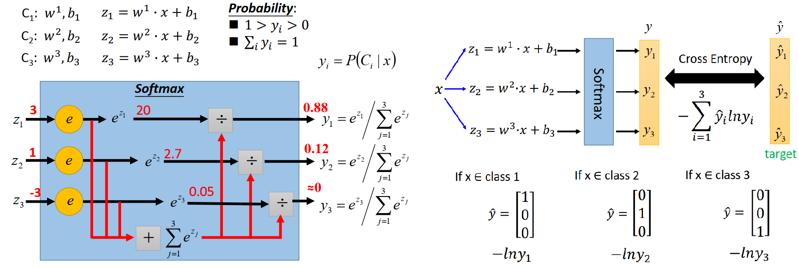

1. 每一个class都有两组参数${(w^1,b_1)},(w^2,b_2),(w^3,b_3),$
2. 接下来计算$z_1,z_2,z_3$
3. 有一个Softmax function，对$z_1,z_2,z_3$做normalization(标准化)
   1. 输入是$z_1,z_2,z_3$，取exponential(指数)
   2. exponential的值相加
   3. 做normalization
   4. 得到$y_1,y_2,y_3$,结果介于1～0且和为1，yi可以当成抽取x属于ci的概率,可以当作几率来看，$y_i=𝑃(C_i|x)$

#### 为什么是Softmax 

如果我们有3个class，$C_1,C_2,C_3$，假设他们是 Gaussian distribution,他们分别有三个mean，但是共用covariance matrix ,经过一番推倒$𝑃(C_i|x)$就是Softmax 这个function

Softmax会对大的值做强化，大的值和小的值之间的差距拉的更开

#### 如果只有两个class

我们用Logistic Regression，只有一个参数w。Softmax 只有$C_1,C_2$，得到的结果和Logistic Regression是一样的，Softmax 如果只有两个class reduce为 Logistic Regression，也就是 sigmoid function。

### Loss function

根据 Softmax 之后得到 $y_1,y_2,y_3$，target 为 $\hat{y}_1,\hat{y}_2,\hat{y}_3$，**计算model 的output和target之间的 Cross entropy** 
$$
Cross~~entropy 的定义~~~ -\sum_{i=1}^3\hat{y}_ilny_i
$$

1. 如果x属于class 1，$\hat{y}为(1，0，0)^{T}，Cross~~entropy=-lny_1$
2. 如果让$-lny_1$被minimize,也就是让$lny_1$被maxmize，也就是让 $y_1$被maxmize
3.  $y_1$就是 $𝑃(C_1|x)$，如果我们让 $y_1$被maxmize，我们做的事情就是在maxmize Likelihood ，**所以Cross entropy 就是maxmize Likelihood**
4. class2 和class3 也一样

## 8.Limitation of Logistic Regression

### e.g binary classification Problem

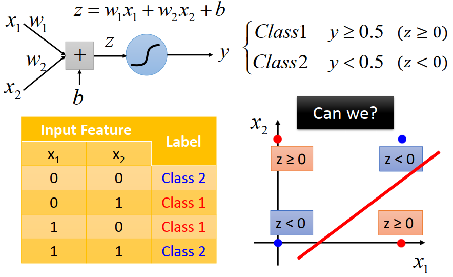

每一个object 有两个feature(x_1,x_2),如果x_1,x_2相同属于 class 2，如果x_1,x_2不相同属于 class 1。在二维平面上蓝色的点是class 2，红色的点是class 1，现在要用 Logistic Regression train model。

1. Logistic Regression 可以 input x_1和x_2,分别把他们乘w_1和w_2,加上b,得到z,z通过sigmoid function得到y
2. 如果y>=0.5(z>=0)就是class 1，y<0.5(z<0)就是class 2
3. 图中红色的点z>=0，蓝色的点z<0，如果不做转换无法把红色的点和蓝色的点用一条线分开

#### Feature transformation  

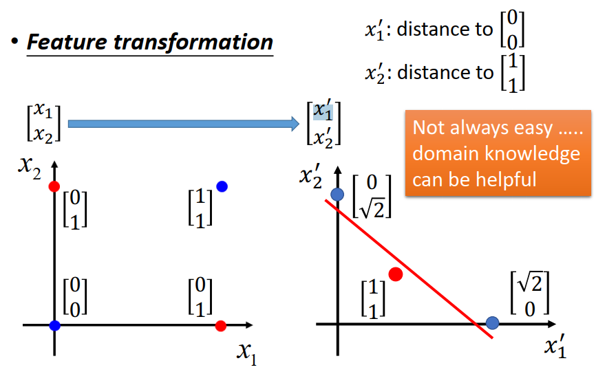

对原来的 Feature 做一下转换，转换成Logistic Regression可以处理的问题

1. 把$(x_1,x_2)$转成$(x^`_1,x^`_2)$
2. 新的 Feature 第一维$x^`_1$就是原来的 Feature 和(0,0)的距离
3. 新的 Feature 第二维$x^`_1$就是原来的 Feature 和(1,1)的距离
4. 这样就可以改变蓝色的点和红色的点在二维平面的位置，就可以画一条线把他们分开，可以使用Logistic Regression

### Feature transformation 可以看成是很多个Logistic Regression相叠的结果

1. 我们有$(x_1,x_2)$，做 transformation 以后变成$(x^`_1,x^`_2)$，
   1. 上面步骤看作是由另外两个Logistic Regression 做出来的
   2. 蓝色的 Logistic Regression，input$(x_1,x_2)$，output $x^`_1$
   3. 绿色的 Logistic Regression，input$(x_1,x_2)$，output $x^`_2$
2. 把$(x^`_1,x^`_2)$丢到 Logistic Regression(红色) 里面可以把两个class分开
3. 红色的 Logistic Regression 作用是 Classification 
4. 绿色的，蓝色的 Logistic Regression作用是 Feature transformation 

#### 举例说明 Feature transformation 确实可以用 Logistic Regression 来打分

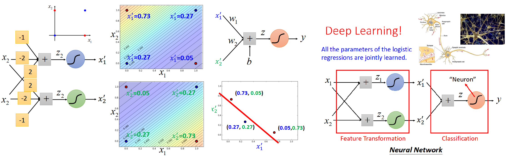

1. 上一个例子中如果如果只用一般的Logistic Regression无法分类
2. 现在有蓝色和绿色的Logistic Regression，他们的作用是 Feature transformation
3. 假设蓝色的Logistic Regression 参数是(-1,-1,2),上面的-1 是bias,就可以计算出平面上四个点的$x^`_1$
4. 假设绿色的Logistic Regression 参数是(2,-2,-1),上面的2 是bias,就可以计算出平面上四个点的$x^`_2$
5. 红色的点(0,1),(1,0)坐标变成(0.73,0.05),(0.05,0.73),蓝色的点(0,0),(1,1)坐标变成(0.27,0.27),(0.27,0.27)，在平面上可以画一条直线分开红色的点和蓝色的点
6. 红色的Logistic Regression吃的是$(x^`_1,x^`_2)$，可以画一条直线把红色的点和蓝色的点分开

虽然Logistic Regression没有办法做到太厉害的事，但是我们可以把Logistic Regression串接起来，一部分去做 Feature transformation ，再有一个做 Classification 。

怎么找蓝色和绿色 Logistic Regression的参数？当我们把所有的Logistic Regression串起来以后，每一个Logistic Regression的参数可以一起学，只要告诉他input和output，用 Gradient Descent 一次把所有的 Logistic Regression的参数都学出来

***给 Logistic Regression一个新的名字，把每一Logistic Regression叫一个 Neuron(好像人脑中的神经元)，当我们把很多Neuron串起来以后，就可以叫 Neuron Network，就是Deep Learning***

