[TOC]

# P 13 6 : brief introduction of Deep learning<!--简介 46’-->

## 1.Deep learning

have seen lots of exciting results  

Google 内部用到Deep Learning 的project数目逐年呈指数上升，在各种领域都有应用

回顾Deep learning 的历史

-  1958: Perceptron (linear model) 感知机(笑话：分辨卡车和坦克)
- 1969: Perceptron has limitation
-  1980s: Multi-layer perceptron
  - Do not have significant difference from DNN today
- 1986: Backpropagation 
  - Usually more than 3 hidden layers is not helpful
- 1989: 1 hidden layer is “good enough”, why deep?
- 2006: RBM initialization(breakthrough)(石头汤里的石头)
- 2009: GPU
- 2011: Start to be popular in speech recognition
- 2012: win ILSVRC image competition
- 2015.2: Image recognition surpassing human-level performance
- 2016.3: Alpha GO beats Lee Sedol
- 2016.10: Speech recognition system as good as humans  

## 2.Three Steps for Deep Learning

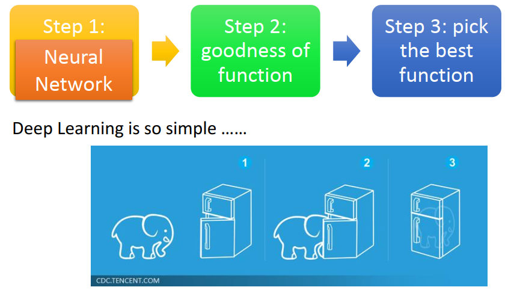

Deep Learning 和 Machine Learning 一样有三个Step(就好像说把大象放进冰箱分三步)

- step 1 : define a set of function --Neural Network
- Step 2: Goodness of Function
- Step 3 : Pick the Best Function

## 3.step 1 :Neural Network

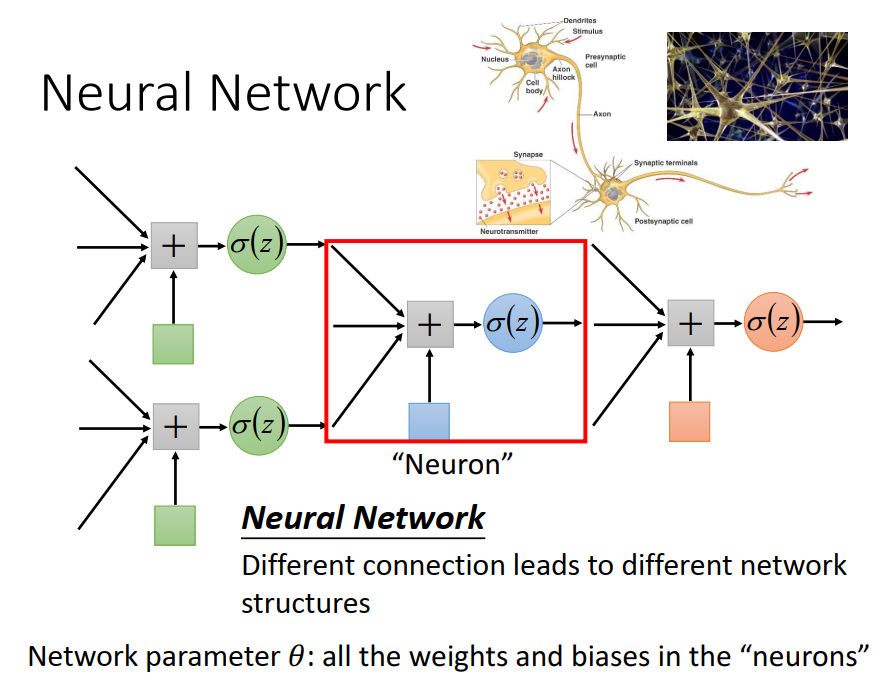

这个 Neural Network 是把 Logistic Regression 前后 contact 连在一起，把一个  Logistic Regression 称之为**Neuron**，整个称之为 Neural Network

用不同的方法来连接这些Neural Network，就得到不同的 structures。在Neural Network里面有一大堆的Logistic Regression，每个Logistic Regression都有自己的weights和biases，这些weights和biases集合起来就是这个Neural Network的parameter 𝜃  

### 3.1 Fully Connect Feedforward Network（最常见）

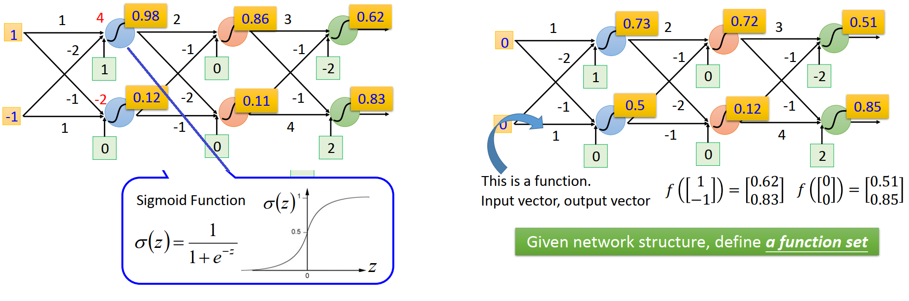

1. 把neuron排成一排一排的，每一个neuron都有一组 weight 和一组 bias ， weight 和 bias 是根据training data找出来的
2. 假设上面蓝色的 neuron weight 是1和-2，bias 是1；下面蓝色的 neuron weight 是-1和1，bias 是0，假设现在的输入是(1,-1),这两个蓝色 neuron 的 output 分别是：4经过sigmoid 变换得到0.98，-2经过sigmoid 变换得到0.12
3. 假设这个structure里面的每一个neuron 的 weight 和 bias 我们都知道，就可以反复进行刚才的运算
4. (1,-1)通过两个蓝色的 neuron 变成(0.98,0.12),再通过两个红色的 neuron 变成(0.86,0.11)，再通过两个绿色的 neuron 变成(0.62,0.83)。所以输入(1,-1)经过一系列很复杂的运算之后(0.62,0.83)
5. 如果输入(0,0)经过一番一模一样的运算得到(0.51,0.85)

**一个 Neural Network 可以把它看作一个function，如果一个Neural Network 里面的参数weight 和 bias我们都知道的话它就是一个 function ，它的 input 是一个 vector，output 是另外一个 vector**

如果今天还不知道参数，**只是定出network structure, 就是define 了一个 function set**。可以给这个 network 设不同的参数，他就变成不同的 function ，把这些可能的function 统统集合起来就得到了一个function set。所以一个 Neural Network 还没有learn 参数，只是把它架构架起来，把neuron 连接的图画出来时，就决定了function set。和之前做的都是一样的，做Logistic Recognition 和Linner Recognition 时，都是决定了一个function set，**Neural Network 只是换一个方式来决定 function set，并且这个 function set 比较大，包含了很多原来 Logistic Recognition 和Linner Recognition 没有办法包含的 function** 

### 3.2 In general Network 

1. 有好多排 neuron :Layer 1,Layer 2 …… Layer L
2. 每一排 neuron 里面 neuron 的数目可能很多，1000个/2000个……
3. 每一个球代表一个 neuron 
4. Layer 和 Layer 之间的 neuron 是两两互相连接的 ，Layer 1 的 neuron 的 output 会接给每一个 Layer 2 的 neuron ，**Layer 2 neuron 的 input 就是所有 Layer 1 的 output** ，因为 Layer 和 Layer 之间所有的 neuron 两两之间都有连接，所以叫 **Fully Connect Network**，
8. 因为传递的方向是从 Layer 1到Layer 2 ，Layer 2到Layer 3，由后往前传 所以叫 **Feedforward Network**
9. 整个 Network 需要一个input ，这个input 是一个 vector,对每一个layer 1的每一个neuron来说，它的input就是input layer的每一个dimension
10. 最后 layer L 的那些 neuron，它后面没有接其它东西了，所以它的output就是整个network的output，假设 layer L 有M个neuron，他的 output就是 y_1,y_2……y_M

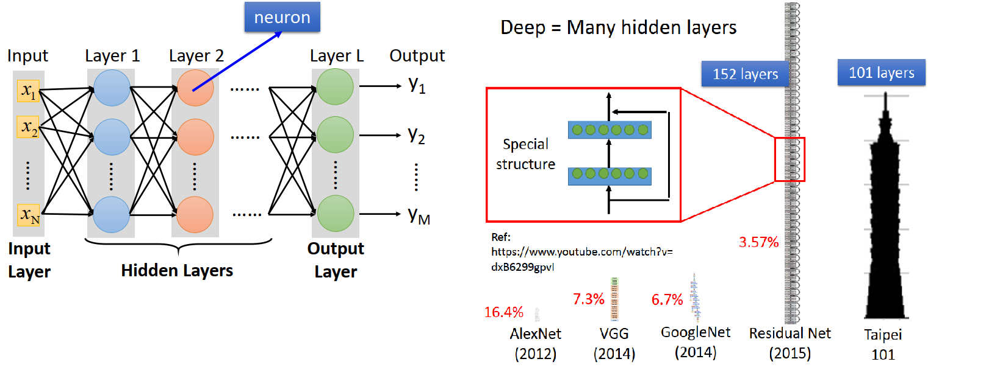

#### 3.2.1 这里每一个layer都是有名字的

- input的地方，叫做**input layer**，输入层(严格来说input layer其实不是一个layer，它跟其他layer不一样，不是由neuron所组成的)
- output的地方，叫做**output layer**，输出层
- 其余的地方，叫做**hidden layer**，隐藏层,

#### 3.2.2 所谓的Deep 就是有很多 hidden layer

现在基本上 Neural Network base 的方法大家都会说是 Deep Learning 的方法

*上图是一些model使用的hidden layers层数举例，你会发现使用了152个hidden layers的Residual Net，它识别图像的准确率比人类还要高当然它不是使用一般的Fully Connected Feedforward Network，它需要设计特殊的special structure才能训练这么深的network*

### 3.3 Matrix Operation

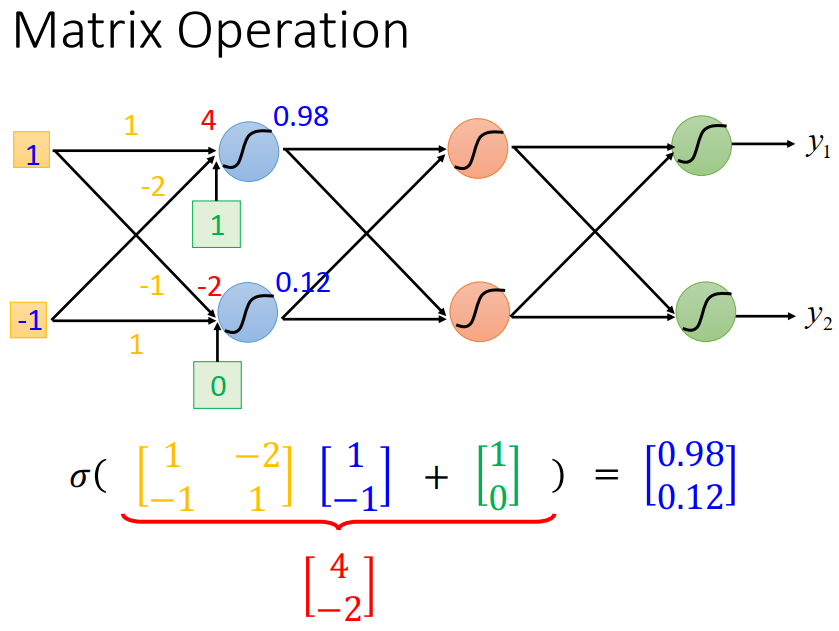

network的运作过程，我们通常会用Matrix Operation来表示，举刚才的例子

1. 假设第一个 layer 的两个neuron，它们的weight分别是(1 , − 2 ), (− 1 , 1 ),可以把(1 , −2 ), (−1 , 1 )排成一个Matrix $\left[ \begin{matrix} 1&-2\\-1&1\end{matrix} \right]$
3. 而我们input(− 1 , 1 )要做运算的时候，当成一个vector$\left[ \begin{matrix} 1\\-1\end{matrix} \right]$，排在$\left[ \begin{matrix} 1&-2\\-1&1\end{matrix} \right]$后面，当Matrix $\left[ \begin{matrix} 1&-2\\-1&1\end{matrix} \right]$和vector $\left[ \begin{matrix} 1\\-1\end{matrix} \right]$做运算的时候就等于做input和weight 的运算
4. 接下来有bias$\left[ \begin{matrix} 1\\0\end{matrix} \right]$，要在后面把bias排成一个vector，把这个vector加上去
5. 结果算出来就是$\left[ \begin{matrix} 4\\-2\end{matrix} \right]$，也就是经过activation function之前的值
6. 通过 sigmoid function,（**在Neural Network里面把这个 function称之为 activation function，不一定是 sigmoid function，已经都使用其他的 function**）得到$\left[ \begin{matrix} 0.98\\0.12\end{matrix} \right]$

**所以一个 Feedforward Neural Network，一个layer的运算从input vector $\left[ \begin{matrix} 1\\-1\end{matrix} \right]$乘一个weight 的 Matrix  $\left[ \begin{matrix} 1&-2\\-1&1\end{matrix} \right]$，加上一个bias vector $\left[ \begin{matrix} 1\\0\end{matrix} \right]$，再通过sigmoid function，得到结果 vector  $\left[ \begin{matrix} 0.98\\0.12\end{matrix} \right]$**

### 3.4 Neural Network

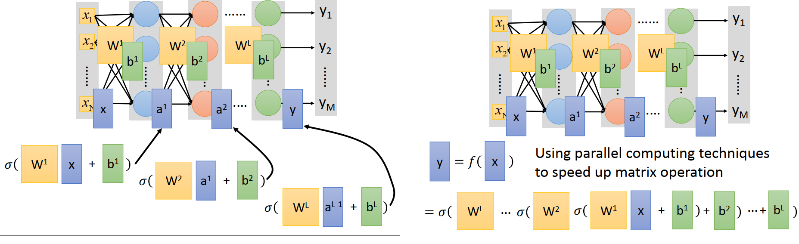

一个Neural Network

1. 假设第一个layer的 weight 全部集合起来当作一个Matrix W^1,bias全部集合起来当作 vector b^1,

2. 把第二个layer的weight 集合起来当作 W^2，bias集合起来当作 b^2

3. ……

4. 把第L个layer的weight 集合起来当作 W^L，bias集合起来当作 b^L

5. 今天给一个input 时候，把x_1,x_2……x_N接起来，变成x,

6. 计算output y

   1. 先计算 x乘上W^1,再加 b^1,通过activation function，算出第二排的 neuron 的output a^1
   2. 接下来做一样的运算，计算a^1 乘上W^2,再加 b^2,通过activation function，得到a^2
   3. 一层一层的做下去
   4. 到最后一层，把a^{L-1} 乘上W^L,再加 b^L,通过activation function，得到整个Network最终的output y

7. 所以整个Network的运算就是一连串的 Matrix 的 operation，input x 和 y 的关系就是
   $$
   y=f(x)=\sigma(W^L...\sigma(W^2\sigma(W^1x+b^1)+b^2)+b^3)
   $$

8. 所以一个Neural Network做的事情就是一连串的 vector 乘上 Matrix 再加上vector ，**就是一连串矩阵运算**

9. 把它写成矩阵运算的好处就是可以用GPU加速，GPU对matrix的运算是比CPU要来的快的，所以我们写neural network的时候，习惯把它写成matrix operation，然后call GPU来加速它

#### 3.4.1 Output Layer as Multi-Class Classifier  

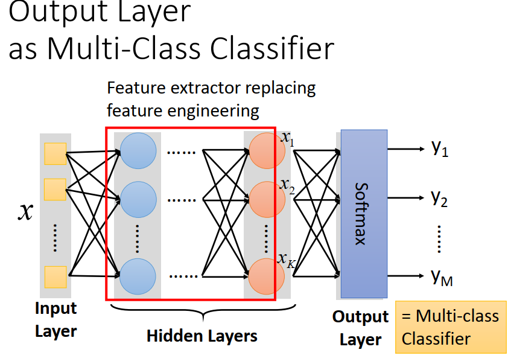

整个Neural Network

1. 可以把hidden layers这部分，看做是一个**feature extractor(特征提取器)**，这个feature extractor就replace了我们之前手动做feature engineering，feature transformation这些事情。把x input,通过很多很多 hidden layers，最后一个hidden layers的output,每一个 neuron 的output x^1 , x^2 , . . . , x^k想成是一组新的 feature 
2. output layer做的事情，就是一个**Multi-class classifier**，它是拿前一个 layer的output 当作 feature 。这个 **Multi-class classifier**用的 feature不是直接从 x抽出来的，是经过很多个 hidden layers 做很复杂的转换后，抽出一组特别好的 feature。这组好的feature 能够被 separable(**可分离的**),经过这一连串的转换以后，他们可以被用一个简单的 一个layer的 **Multi-class classifier**就把它分类好
3. Multi-class classifier要通过一个 softmax function ，因为我们把 output layer 也看成**Multi-class classifier**，所以我们最后一个 layer 也会加上 softmax 

### 3.5 Example Application  

input一张image，是一张手写数字，output说这个input image 对应的数字是什么

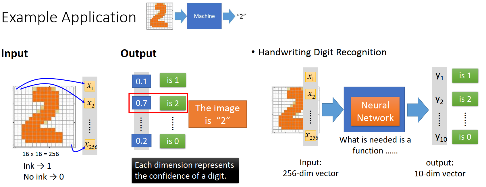

1. 问题里面 input是一张image，对于机器来说一张image就是一个vector ，假设这是一个解析度16*16的image，他有256个pixel，对machine 来说它就是一个256维的vector ，在这个image里面每一个pixel就对应到其中dimension，左x_2,上角这个 pixel就对应到x_1,第二个pixel就对应到x_2,右下角 pixel就对应到x_256，涂黑的地方对应1，没有的对应0。
2. 如果用 softmax ，Neural Network 的output 代表一个 Probability Distribution,假如output是10维的话，就可以把这个output 看成是对应到每一个数字的几率，y_1代表了input 这张image ，根据这个Neural Network 判断，他是属于1的几率；y_2代表input属于2的几率，y_10代表input属于0的几率.实际上让Network 帮你算一下 input一张image 属于每一个数字的几率是多少，假如属于数字2 的几率最大是0.7，那就是machine的output说这张image属于数字2
3. 在这个Application里面，要解这个手写数字辨识的问题，唯一需要的就是一个function，这个function的input是一个256的vector，output是一个10维的vector，这个function就是neural network(这里我们用简单的Feedforward network)
4. 丢到一个neural network里面，input 有256维是一张image，output设成10维，这10维里面每一个dimension都对应到一个数字，这个network 就代表了一个可以拿来做手写数字的function set，这个network 的structure 就define 了一个 function set，这个function set里的每一个function都可以拿来做手写数字识别，只是有些做出来结果比较好有些做出来比较差。接下来要做的事情是用gradient descent去找一组参数，挑一个最适合拿来做手写数字识别的function
5. 在这个process里面我们需要做一些design，对neural network来说，我们现在唯一的constraint(约束)只有input是256维，output是10维，**而中间要有几个hidden layer，每个layer要有几个neuron，是没有限制的，**都需要自己去设计，它们近乎是决定了function set长什么样子，如果决定了一个差的 function set，里面没有包含任何好的function，那之后找最好的function就好像大海捞针，结果针并不在海里。**决定一个好的function set （这个neural network 的structure ）其实很关键**
   1. Trial and Error + Intuition经验和直觉来决定层数和每层的neurons数，neural network structure 要长什么样子凭着直觉和多方面的尝试来想办法找一个最好的 neural network structure
   2. 找neural network structure 并没有那么容易，从非deep learning 方法到deep learning 方法，machine learning 没有变得简单，而是一个问题转化成另一个问题
   3. *本来不是deep 的model要得到好的结果往往需要做 feature transform，找一组好的 feature ，但是做deep learning 的时候往往不需要找一个好的 feature ，比如说做影像辨识的时候可以直接把 pixel 丢进去。但是今天 deep learning 制造了一个新的问题，需要去design neural network structure。deep learning是不是真的好用depend on 你觉得哪一个问题比较容易，语音辨识和影像辨识design neural network structure比feature engineering 容易* 
   4. 可以自动的学network structure
      1. E.g. Evolutionary Artificial Neural Networks
   5. 可以自己设计 network structure ，不要 Fully Connect,可以尝试特殊接法的CNN

## 4. Step 2 Goodness of Function

在 neural network 里面怎么决定一组参数的好坏，假设给定一组参数，做手写数字辨识有一张image 和他的label “1”，告诉我们target 是一个 10维的vector ，只有在第一维对应到数字1的地方他的值是1，其他都是0

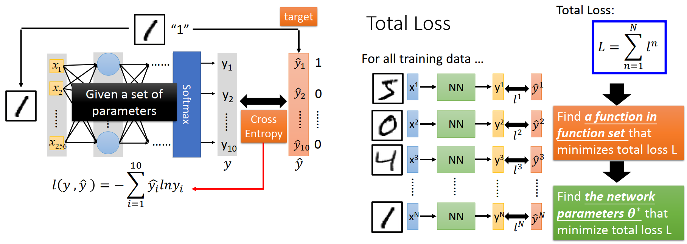

1. input 这张 image 的 pixel，通过这个 neural network 以后 得到一个output y, target 称之为 $\hat y$
2. 计算y和 $\hat y$的 Cross entropy,
3. 调整network参数让Cross entropy越小越好
4. **整个training data 里面有一大堆的data ,第一笔data 算出来的 Cross entropy 是 C^1,,第一笔data 算出来是 C^2……到第N笔data 算出来C^N,把所有 data 的Cross entropy sum 起来得到 Total Loss L**
5. 在 function set 里面，找一个  function 可以 minimize 这个 Total Loss 或者是找一组 network parameter $\theta^*$可以 minimize 这个 Total Loss 

## 5.Step 3 : Pick the Best Function

**用 Gradient Descent 找一个$\theta^*$ minimize 这个 Total Loss** ，和linner Regression 没有什么差别

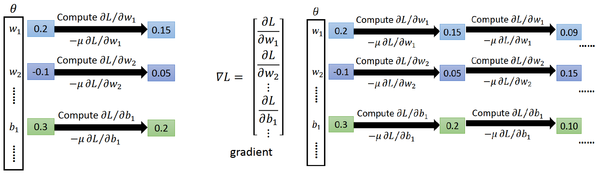

1. 𝜽里面是一大堆的参数，一大推的 weight w 和一大堆的bias b
2. random 每一个数字一个初始值
3. 计算一下他的Gradient，计算每一个参数对Total Loss 的偏微分，把这些偏微分全部集合起来叫做Gradient $\nabla L$
4. 有了这些偏微分以后，你就可以更新参数，把所有的参数都减掉learning rate μ 乘上偏微分的值，就得到一组新的参数
5. 这个process反复进行下去，有了新的参数再计算一下他的 Gradient，再根据 Gradient 再更新参数，就得到一组新的参数
6. 按照这个process继续下去，就可以找到一组好的参数，就做完 neural network 的training了

就算是最潮的 Alphago 也是用  Gradient Descent train 的

###  5.1 Back propagation 有效率算微分的方式

Backpropagation: an efficient way to compute 𝜕𝐿/𝜕𝑤 inneural network   

1. TensorFlow
2. PyTorch
3. Caffe
4. ……

## 6. 为什么我们要 Deep learning 

最后一个问题，为什么我们要deep learning？一个很直觉的答案是，越deep，performance就越好，

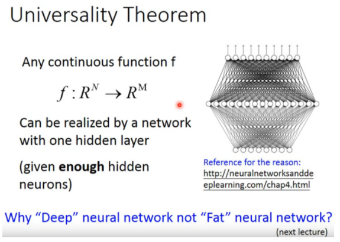

一个很早年的实验 word Error Rate (越小越好)(还有一张图在视频里)

1. 一个hidden layer ，每个 hidden layer 2K个neuron ,word Error Rate =24.2%
2. 越来越deep 以后 Performance Error Rate 越来越小

*但是，稍微有一点machine learning常识的人都不会觉得太surprise，因为本来model的parameter越多，它cover的function set就越大，它的bias就越小，如果今天你有足够多的training data去控制它的variance，一个比较复杂、参数比较多的model，它performance比较好，是很正常的，那变deep有什么特别了不起的地方？*

*甚至有一个理论是这样说的，任何连续的function，它input是一个N维的vector，output是一个M维的vector，它都可以用一个hidden layer的neural network来表示，只要你这个hidden layer的neuron够多，它可以表示成任何的function，既然一个hidden layer的neural network可以表示成任何的function，而我们在做machine learning的时候，需要的东西就只是一个function而已，那做deep有什么特殊的意义呢？*

*真的是这样吗？后面的章节会解释这件事情*

