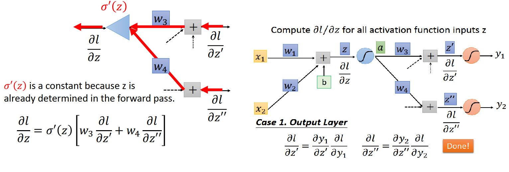

[TOC]

# P 14 7: Backpropagation  <!-- 20’-->

## 1. Chain Rule

### 1.1 case 1

$$
y = g(x)~~~z=h(y)\\\Delta x\rightarrow\Delta y\rightarrow \Delta z~~~~~~~\frac{dz}{dx}=\frac{dz}{dy}\frac{dy}{dx}
$$

1. 当把x 做一个变化的时候，透过g会影响y
2. 当把 y 有了变化的时候，透过h会影响z
3. 所以$\frac{dz}{dx}=\frac{dz}{dy}\frac{dy}{dx}$*(消掉$dy$,左式等于右式)*

### 1.2 case 2

1. 对s做一个变化，会分别透过 g 和 h 影响 x 和 y , x 和 y有了变化会合起来影响 z
2. 求$\frac{dz}{dx}$，按照 Chain Rule，s 有两条路径去影响 z,把这两条路径一路上的微分乘起来再相加，

## 2. Backpropagation

我们要 minimize 的 total loss L 其实式每一笔data 的loss l 的 summation，每一笔data从第一笔到第N笔，都有一个loss $l^n$,我们把所有的 $l^n$统统 summation起来得到 L。如果要计算某一个参数对L的偏微分，只要会计算某一个参数对每一个 $l^n$的偏微分，再把所有  $l^n$偏微分的值 summation起来，就可以得到 L 的偏微分。(所以本例中只计算 w对  $l^n$的偏微分)

### 2.1 一个简单 network 的第一个layer 的某一个 neuron 拿出来为例

这是第一个layer 的neuron ,input 是 x_1,x_2,weight 是 w_1,w_2,bias 是b,z=x_1w_1+x_2w_2+b,z之后还会发生很多运算，得到y_1,y_2。**假设要计算 w_1或w_2对某一笔data的loss l 的偏微分$\frac{\partial l}{\partial w}$**

1. 根据chain rule$\frac{\partial l}{\partial w}=\frac{\partial z}{\partial w}\frac{\partial l}{\partial z}$,因为一个w的值变一下就影响了z, z变了通过复杂的运算就影响了最后的output，output 影响。
2. 做 Backpropagation 时分成两个步骤，Forward pass 和 Backward pass。Forward pass里面计算 $\frac{\partial z}{\partial w}$，Backward pass里面计算 $\frac{\partial l}{\partial z}$

#### 2.1.1 Backpropagation - Forward pass $\frac{\partial z}{\partial w}$

1. $\frac{\partial z}{\partial w_1}=x_1~\frac{\partial z}{\partial w_2}=x_2$,x_1 和 x_2 就是连接到 w_1和 w_2 的 input
2. **可以发现计算某一个参数对 z 的偏微分，得到的就是这一个参数的 input** 
3. 比如右图第一个红圈中的参数  w =1的$\frac{\partial z}{\partial w}$等于w连接的input -1;第二个红圈中 w=-1对 橙色的neuron 的input z 做偏微分，得到的值就是 -1 前面连接的input值为0.12....

#### 2.1.2 Backpropagation - Backward pass $\frac{\partial l}{\partial z}$

##### 2.1.2.1 z是怎么影响 loss l 的呢

1. z 通过一个 activation function σ(z) 得到a，可以进一步拆解$\frac{\partial l}{\partial z}=\frac{\partial a}{\partial z}\frac{\partial l}{\partial a}$
2. $\frac{\partial a}{\partial z}$depend on function σ(z) 长什么样，选不同的 σ(z) 得到的微分值不一样,图中为 sigmoid function 的微分
3. $\frac{\partial l}{\partial a}$比较复杂，l后面还有很多计算，比如 a 会乘上w_3影响z ′，z ′最后会影响 l;a 乘上w_4影响 z'', z''最后会影响 l。a 会影响下一个layer 所有的neuron 的 input，根据 chain rule得到$\frac{\partial l}{\partial a}=\frac{\partial z'}{\partial a}\frac{\partial l}{\partial z'}+\frac{\partial z''}{\partial a}\frac{\partial l}{\partial z''}$，
4. 其中可以计算出$\frac{\partial z'}{\partial a}=w_3~~~\frac{\partial z''}{\partial a}=w_4$，假设 $\frac{\partial l }{\partial z'}~~~\frac{\partial l}{\partial z''}$已知

$$
可以得到 \frac{\partial l}{\partial z}=σ'(z) (w_3{\frac{\partial l}{\partial z'}}+w_4\frac{\partial l}{\partial z''})
$$

##### 2.1.2.2 可以把上式看成另外一种neuron，只是这个neuron 是线性的 （重要）

1. 这个 neuron 的input 就是 $\frac{\partial l}{\partial z'},\frac{\partial l}{\partial z''}$,
2. input 会分别乘上不同的weight w_3和w_4
3. activation function是 乘上σ‘(z) ，是线性的，最后得到 $\frac{\partial l}{\partial z}$

###### 2.1.2.2.1 case 1 .Output Layer

假如 z'和z'' 通过 activation function以后得到的是output ，也就是说  z'和z'' 是最后一个layer 的neuron 的 input，问题就解决了，如上图右式

###### 2.1.2.2.2 case 2 .Not Output Layer

如果不是最后一个layer 要继续算下去

1. z'影响 a',a'会影响下一个layer 的所有的neuron 。假设下一个layer右两个绿色的neuron，那么a'通过乘上w_5影响了z_a,a'通过乘上w_6影响了z_b
2. 所以现在我们只要知道  $\frac{\partial l}{\partial z_a},\frac{\partial l}{\partial z_b}$分别乘上w_5和w_6,再乘上 σ’(z‘)，就可以计算出  $\frac{\partial l}{\partial z'}$
3. 如果不知道 $\frac{\partial l}{\partial z_a},\frac{\partial l}{\partial z_b}$，就再往后算下一个layer，直到碰到network 的output，算出来以后再一路往input走，就可以把所有的 $\frac{\partial l}{\partial z}$算出来了

##### 2.1.2.2  反过来从output 地方开始算 $\frac{\partial l}{\partial z}$

这样子做听起来好像运算量很大，如果今天反过来从output 地方开始算 $\frac{\partial l}{\partial z}$，运算量和 Feedforward network 运算量一样

今天有6个neuron，假设要计算  $\frac{\partial l}{\partial z_1}$，要先计算$\frac{\partial l}{\partial z_3}$和$\frac{\partial l}{\partial z_4}$，要计算$\frac{\partial l}{\partial z_3}$要先计算 $\frac{\partial l}{\partial z_5}$和$\frac{\partial l}{\partial z_6}$，计算起来很麻烦。如果逆过来从z_5和z_6开始算，就比较简单。

1. 先算$\frac{\partial l}{\partial z_5}$和$\frac{\partial l}{\partial z_6}$，因为他们连接着output，可以根据case 1 算出这两个偏微分的值
2. 已知z_5和z_6对 l 的偏微分，就可以算出z_3 对 l 的偏微分，把他们丢进刚刚的op-amp就可以算出来
3. 接下来，再逆着回去算，就可以把所有的 $\frac{\partial l}{\partial z}$都求出来

## 3. Backpropagation Summer

1. 我们有 Forward pass 和 Backward pass
2. 在 Forward pass 里面我们要得到所有 neuron 的output，就是它连接的weight的$\frac{\partial z}{\partial w}$
3. Backward pass 的目标是算出$\frac{\partial l}{\partial z}$，先把整个 network 逆转，把所有的neuron 用 op-amp取代，
4. 把 $\frac{\partial z}{\partial w}$和 $\frac{\partial l}{\partial z}$相乘，就得到w对l 的偏微分  $\frac{\partial l}{\partial w}$,

*用这个方法轻易的把network 里面所有的参数的偏微分的值都算出来，就可以用 Gradient Descent 去做 updata*