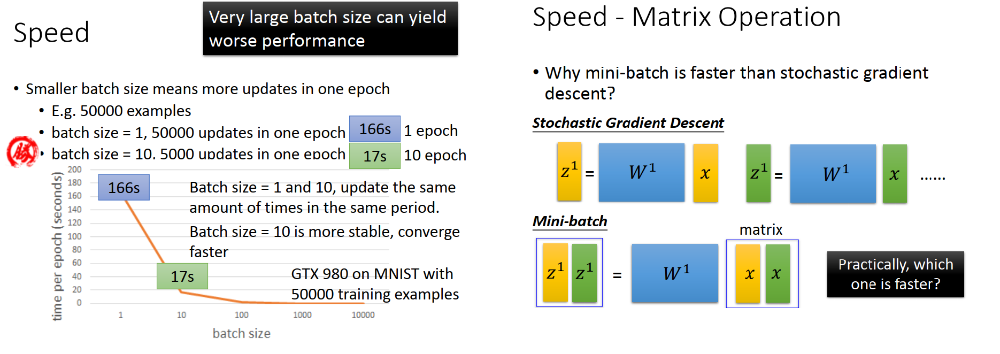

[TOC]


# P15 8-1: “Hello world” of deep learning  <!-- 30’-->

## Keras 相关介绍和资料

*为什么不学TensorFlow呢？其实，TensorFlow没有那么好用。tensorflow和另外一个功能相近的toolkit theano，它们是非常flexible的，可以把它想成是一个微分器，它完全可以做deep learning以外的事情，因为它的作用就是帮你算微分。拿到微分之后呢，你就可以去算gradient descent，而这么flexible的toolkit学起来是有一定的难度的，你没有办法在半个小时之内精通这个toolkit*

*但是另一个toolkit—Keras，你是可以在数十分钟内就熟悉并精通它的，然后用它来implement一个自己的DNN。Keras其实是tensorflow和theano的interface，所以用Keras就等于在用tensorflow，只是有人帮你把操纵tensorflow这件事情先帮你写好*

*Keras比较容易学习和使用的，并且它也有足够的弹性，多数你可以想到的network，在Keras里都有现成的function可以call；因为它背后就是tensorflow or theano，所以如果你想要精进自己的能力的话，你永远可以去改Keras背后的tensorflow的code，然后做更厉害的事情*

*而且，现在Keras已经成为了Tensorflow官方的API，它像搭积木一样简单*

*Keras 是牛角的意思*

*Documentation: http://keras.io/*

*Example: https://github.com/fchollet/keras/tree/master/examples* 

## 使用 Keras 心得  

叠积木

## “Hello world” -- Handwriting Digit Recognition

*使用的data —— MNIST Data: http://yann.lecun.com/exdb/mnist/*

*Keras provides MNIST  data sets loading function: http://keras.io/datasets/*


要 machine 做的事情，input 一个image，output这个image 是0~9的哪一个数字。input image的size 28x28 的 matrix

## Keras step1：define a function set

决定你的 neural network 要长什么样子


在keras 里面先宣告一个model

```python
model = sequential()
```

接下来决定你的 network 想要长什么样子，举例来说想要叠一个network，它有两个hidden layer，每个hidden layer都有500个neuron。

宣告model之后，model.add 可以加一个东西，我们要加一个 Fully Connect layer ,用 Dense 来表示。宣告 Dence的 input_dim 是 28*28，output_dim 是 500。也就是input 一个28X28的vector，这个vector 代表一个image，output 是500 就是说今天要有500个neuron

接下来要告诉 network 你的 Activation function 要用什么，直接写model.add(Activation('sigmoid')),本例种使用的是 sigmoid function 。在Keras里还可以选别的，比如**softplus、softsign、relu、tanh、hard_sigmoid、linear**等等。*如果你要加上自己的activation function，其实也蛮容易的，只要在Keras里面找到写activation function的地方，自己再加一个进去就好了*

```python
model.add(Dense(input_dim=28 * 28, output_dim=500))
model.add(Activation('sigmoid'))
# keras 2.0
model.add(Dense(input_dim=28 * 28, units=500, activation='relu'))
```

如果要再加一个layer，就一样写 model.add 一个Dense layer，output 是500 。不需要再给他input，因为下一个layer 的input就等于前一个layer的output 。不需要再 redefine input的 dimension 是多少，只要告诉它output 是500 个neuron 就好。Activation 一样用  sigmoid

```python
model.add(Dense(output_dim=500))
model.add(Activation('sigmoid'))
# keras 2.0
model.add(Dense(units=500, activation='sigmoid'))
```

最后，是做数字分类，有10个数字，所以output是10维。如果把output layer当做一个Multi-class classifier的话，那activation function就用softmax(这样可以让output每一维的几率之和为1，表现得更像一个概率分布)，当然你也可以选择别的

```python
model.add(Dense(output_dim=10))
model.add(Activation('softmax'))
# keras 2.0
model.add(Dense(units=10, activation='softmax'))
```

## Keras step2: Goodness of Function

evaluate一个function的好坏，用model.compile去定义你的loss 是什么


比如说你要用**cross entropy**的话，那你的 loss 就是 categorical_crossentropy(Keras里的写法),不同的场合，需要不同的loss function。

```python
model.compile(loss='categorical_crossentropy',
              optimizer='adam',
              metrics=['accuracy'])
# keras 2.0 同上
```

## Keras step3 ：Pick the Best Function

### Step 3.1：Configuration

在training之前，你要先下一些configuration告诉它training的时候，你打算要怎么做。

定义的第一个东西是**optimizer**，也就是说，你要用什么样的方式来找最好的function，虽然optimizer后面可以接不同的方式，但是这些不同的方式，其实都是gradient descent base 的方法，只是他们用的 learning rate 不同。有一些方法**machine会自动地，empirically(根据经验地)决定learning rate的值应该是多少**，所以这些方法是不需要给它learning rate的，Keras里面有诸如：**SGD(gradient descent)、RMSprop、Adagrad、Adadelta、Adam、Adamax、Nadam**之类的寻找最优参数的方法，它们都是gradient descent的方式


### Step 3.2: Find the optimal network parameters

决定好怎么做gradient descent之后，就是去跑gradient descent找最优参数了

```python
model.fit(x_train,y_train,batch_size=100,nb_epoch=20)# keras 2.0 同
```

这里使用的是`model.fit`方法，要给它4给input(假设我们给了10000张image作Training data)

1. 第一个input是Training data——`x_train`

   在这个case里，Training data就是一张一张的image，

   需要把它存放到numpy array里面。这个numpy array是two-dimension的matrix，第一个dimension代表你有多少个 example，如果你有10000个example，第一个dimension 就是 10000维；第二个dimension 就是看你的image有多少个pixel，第二个 dimension  就有多大，在这个case里面，有28x28 = 784 个pixel，所以第二个 dimension  就是784维

2. 第二个input是每一个Training data对应的label——`y_train`

   要告诉machine 现在Training data 里面每一张image是0~9哪一个数字

   同样也是two-dimension的numpy array，第一个dimension代表你有几个 training example，就有多少维；第二个dimension 就是10，因为现在的output就是10维，label有10个可能0~9，image 对应数字的维度就是1，其他是0，比如说image中是数字5对应 label 为[0,0,0,0,0,1,0,0,0,0]

3. 第三个input是`batch_size`，告诉Keras我们的batch要有多大

   在这个case里，batch_size=100，表示我们要把100个example放到一个batch里面，Keras会自动帮你随机的放，不需要自己去code

4. 第四个input是`nb_epoch`，每一个batch 看过一次叫做一个epoch

   在这个case里，nb_epoch=20，每一个batch 看过一次的process重复20次 。每看到一个batch就update一次参数，假设现在有100个batch，一个epoch就update 100次参数，20个epoch就是update 2000次参数

### Mini-batch


这里有一个秘密，就是我们在做deep learning的gradient descent的时候，并不会真的去minimize total loss。我们会把Training data分成一个一个的batch，比如说你的Training data一共有1w张image，每次**random**选100张image作为一个batch。怎么做呢

1. 像gradient descent一样，先**random** initialize network的参数
2. 随机选一个batch出来(我们选了第一个)，然后计算这个batch里面的所有element的total loss，L′ = l^1 + l^31 + . . .，接下来根据L′ 去update参数，也就是计算参数对L′ 的偏微分，然后update参数
3. 再随机选一个batch(选择第二个batch)，现在这个batch的total loss是L′′ = l^2 + l^16 + . . . ，接下来计算参数对L′’ 的偏微分，然后update参数
4. 反复做这个process，直到把所有的batch通通选过一次，所以假设你有100个batch的话，你就把这个参数update 100次，**把所有batch看过一次，就叫做一个epoch**
5. 重复以上的process，所以你在train network的时候，你会需要好几十个epoch，而不是只有一个epoch

### Speed 

如果 batch size =1，Mini-batch就equivalent(等于) stochastic gradient descent，好处是update速度比较快,但实际上我们必须用 Mini-batch

#### E.g. 有50000个examples

如果我们把batch size设置为1，也就是stochastic gradient descent，那在一个epoch里面，就会update 50000次参数；如果我们把batch size设置为10，在一个epoch里面，就会update 5000次参数

看上去stochastic gradient descent的速度貌似是比较快的，实际上，**当你batch size设置不一样的时候，一个epoch需要的时间是不一样的，**以GTX 980为例，以下是对总数为50000笔的Training data设置不同的batch size时，每一个epoch所需要花费的时间（如果batch size 设置 100，1000，10000，epoch会越来越快）

- case1：如果batch size设为1，也就是stochastic gradient descent，一个epoch要花费166秒，接近3分钟
- case2：如果batch size设为10，那一个epoch是17秒

发现batch size设1和设10，同样时间内update参数的次数几乎是一样的，其实会想要选batch size= 10，因为会比较稳定的

#### Speed - Matrix Operation （GPU）

上面例子的现象产生的原因是我们用了GPU，用了平行运算，所以batch size=10的时候，这10个example其实是同时运算的，所以你在一个batch里算10个example的时间跟算1个example的时间几乎可以是一样的

那你可能会问，既然batch size越大，它会越稳定，而且还可以平行运算，那为什么不把batch size变得超级大呢？这里有两个claim(声明)：

- 第一个claim就是，如果你把batch size开到很大，最终GPU会没有办法进行平行运算，它终究是有自己的极限的，也就是说它同时考虑10个example和1个example的时间是一样的，但当它考虑10000个example的时候，时间就不可能还是跟一个example一样，因为batch size考虑到**硬件限制**，是没有办法无穷尽地增长的
- 第二个claim是说，如果把batch size设的很大，在train gradient descent的时候，可能跑两下你的network就卡住了，就陷到saddle point或者local minima里面去了。因为在neural network的error surface上面，它并不是一个convex的optimization problem，实际上它会有很多的坑坑洞洞。如果你用的Full batch，就是完全顺着 total loss gradient 方向走，发现没走两步就卡住了（saddle point或是local minima）。stochastic 的好处是有随机性，每一次走的方向是随机的，如果走某一步陷到不是很深的 local minima 里面或者没有遇到特别麻烦的saddle point的时候，下一步加一点random 就可以跳出这个gradient接近于0的区域。所以没有这个随机性的话 train neural network，可能update两三次参数就会卡住，所以mini batch是需要的



##### GPU是如何平行加速的

整个network，不管是Forward pass还是Backward pass，都可以看做是一连串的矩阵运算的结果。

那今天我们就可以比较batch size等于1(stochastic gradient descent)和10(mini batch)的差别

- batch size=1，我们看第一个layer，input一个 x乘上w^1就得到 z^1,在Forward pass要做这个Matrix Operation（Backward pass 做类似的计算），这是第一笔data,做完这些 Matrix 计算 update 参数。接下来带第二笔绿色的 x进来，再乘w^1 得到z^1，update 参数
- 而mini batch，则是把同一个batch里面的input全部集合起来，每一个input 都是一个vector ，假设现在我们的batch size是2，那mini batch每一次运算的input就是把黄色的vector和绿色的vector拼接起来变成一个matrix，再把这个matrix乘上 w_1，你就可以直接得到z^1和 z^2

这两件事在理论上运算量是一样多的，但是在实际操作上，对GPU来说，在矩阵里面相乘的每一个element都是可以平行运算的，所以图中stochastic gradient descent运算的时间反而会变成下面mini batch使用GPU运算速度的两倍，这就是为什么我们要使用mini batch+GPU是可以加速的原因。

## Save and Load Models

Keras是可以帮你save和load model的，你可以把train好的model存起来，以后再用另外一个程式读出来，它也可以帮你做testing,有两个  testing case 

- case 1是**evaluation**，比如今天我有一组testing set，testing set的答案也是已知的，那Keras就可以帮你算现在的正确率有多少，这个`model.evaluate`函数有两个input，就是testing的image和testing的label

  ```python
  score = model.evaluate(x_test,y_test)
  print('Total loss on Testing Set:',score[0])
  print('Accuracy of Testing Set:',score[1])
  ```

- case 2是**prediction**，这个时候`model.predict`函数的input只有image data而没有任何的label data，output就直接是分类的结果，就是系统上线后，没有正确答案的，call predict进行预测

  ```python
  result = model.predict(x_test)
  ```

# P16 8-2: Keras 2.0  <!-- 10’-->

改版以后的 Keras ,在上面代码有标