[TOC]

# P18 9-1: Tips for Deep Learning <!-- 82' -->

## Recipe of Deep Learning

Deep Learning 和机器学习一样有三个步骤，做完这三个步骤就有一个Neural Network，但是不见得会得到好的结果。你 train 完一个 Neural Network 之后

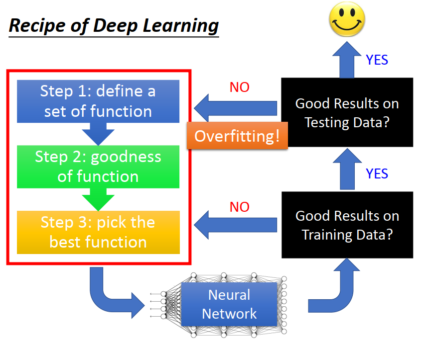

1. 检查这个Neural Network在 Training Set上得到的 performance 怎么样.
   1. 如果在Training Set结果不好，回头看三个步骤，看看哪一个步骤可以作出修改，使Neural Network 在 Training Set得到好得结果（*这里要注意，普通的机器学习方法比如LR，DT等可以轻易的把 training Set 训练好，Neural Network 则不容易得到好的结果）*
   2. 如果在Training Set得到好的结果，查看在Test Data上得到得结果如何,
      1. 如果在Training Set上得到好的结果，在Testing Set上没有得到好的结果，叫Overfitting
      2. **如果在Training Set上和Testing Set上都得到好的结果，就得到一个可以用的 Neural Network**

## Do not always blame overfitting

在Deep Learning得到不好的performance 并不总是Overfitting，可能本身就没train 好

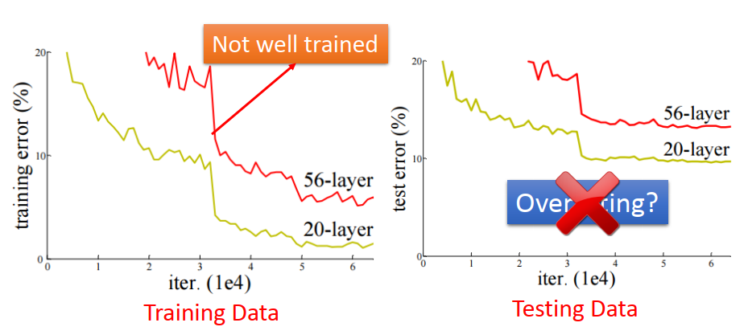

*先看右边testing data的图，横坐标是model做 gradient descent所update的次数，纵坐标则是error rate(越低说明model表现得越好)，黄线表示的是20层的neural network，红色表示56层的neural network。56层network的error rate比20层network的 error rate高，就会得到一个结论：56层的network参数太多了，这个是overfitting。但是，真的是这样子吗？*

*有检查过training set上的 performance吗？对这个实验来说，在 training set上得到的结果是左边 training data 的图，也就是说，在 training上20层的 network的 performance就比56层的 network好，**所以在 train 的时候就没有把56层的训练好，**所以apply在testing set 上才会没有用,比20层的 network 差，这不是overfitting。*

在train neural network 时候，有可能在train的时候就卡在了saddle point 或者local minimum等等的地方，你的training并不总能保证你找到 local minimum，不见得总是保证你得到好的结果。所以当我们 network train不好的时候，并不总是overfitting

文献上的方法，**有的是要提升training set上的performance，有的是要提升testing set上的performance，**要想一下自己遇到的问题，找对应的提升方法

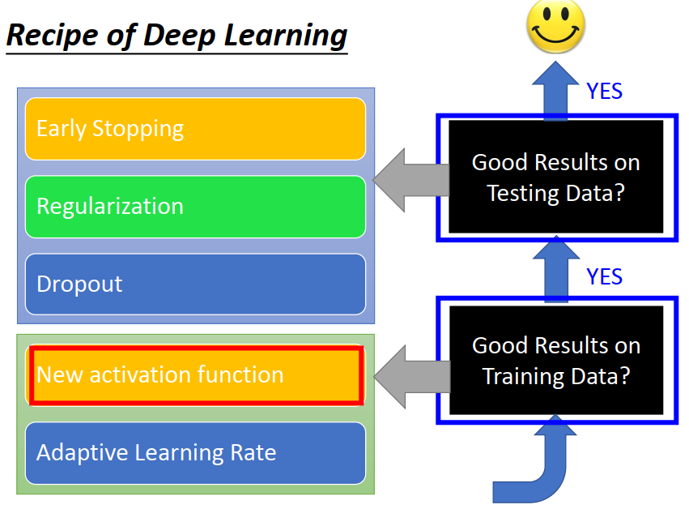

## new activation function（提升training set）

06年以前，如果把network叠很多层用sigmoid function，当layer 越来越多 performance 会越来越差,尤其是 network 有9层10层的时候，整个结果直接就坏掉了。在training的时候 network 叠的越深，并不保证 performance 会越好。

### vanishing Gradient problem

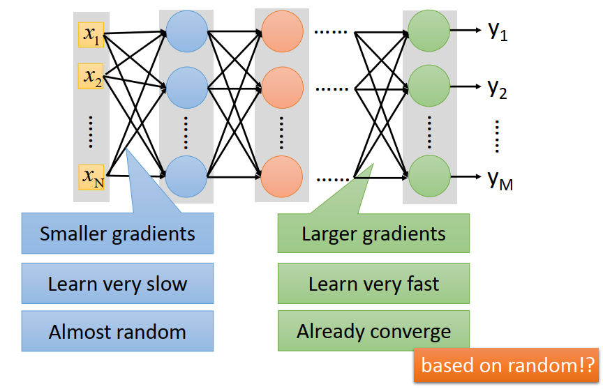

当你把network叠得很深的时候，会出现 vanishing Gradient。就是在接近 input layer 的那几层，他的gradient 的值是非常小的，而相对来说接近 output 的那几个layer，他的  gradient  是比较大的。

假如整个network的参数learning rate 都是一样的话，会发现靠近input的参数的学习速度是非常慢的，靠近output 那几层 的学习速度相对来说比前面那几层要快得多。会发现前面这几层几乎还没有更动他的参数的时候（几乎还是随机的时候），最后几层的参数就已经收敛(converge)了。整个training就停下来了，因为现在的Gradient 已经很小了**，但是不会得到好的结果，因为后面几个 layer 吃的input是前面几个layer的output，而前面这几个layer几乎是random的时候，后面这几个layer 虽然收敛了，但是他们是对 random input 收敛的，导致整体的performance 不好. **就像刚刚看到，在training的时候，Accuracy 几乎都没有变动，它已经停下来了，gradient descent已经没有办法让你的参数再被update，但是我们是卡在一个performance 很差的结果上面

#### 这个现象来自 sigmoid function

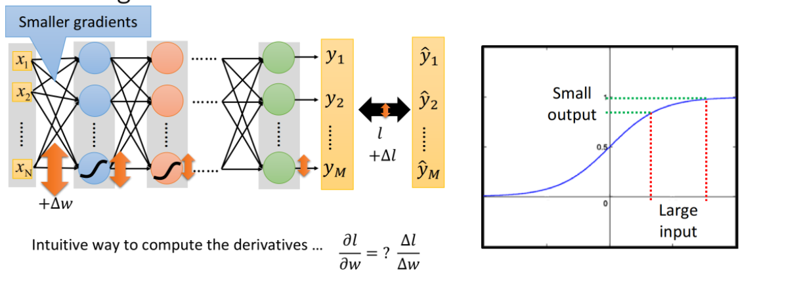

现在要知道为什么靠近input layer的参数的 gradient 特别小，就算一下他的 gradient 。想要算某一个参数对loss的偏微分，不需要使用Backpropagation，就把那个参数小小的变化一下，看看loss的变化有多大，就可以估测一下这个参数的微分。

把第一个layer 的某一个参数w拿出来做一下变动(+Δ w)，再看对loss有多大的影响,就可以估测一下这个参数对loss的微分的值

1. 比如最下面这个weight 接最下面这个 neuron，所以它会使最下面蓝色的 neuron的output 有变化
2. **但是这些 sigmoid function 会使变化被衰减（因为sigmoid function 是input 范围是正负无穷大之间，但是他会把正负无穷大的范围压到[0,1]之间）。**如果weight 有一个大的变化，activation function 的 input有一个大的变化，但是通过sigmoid function 以后，他的变化总是会衰减，**所以有一个比较大的input，但是他的output是会变小的**
3. 假设这个 Network非常深，有很多layer，每通过一个layer 以后，变化都会衰减一次。所以今天最下面这个蓝色的 neuron 他的output 有变化，它会使红色的neuron output有变化，但是红色 neuron output的变化又比蓝色neuron更少，因为他又通过了一次  sigmoid function，所以这个变化就越来越小
4. 所以w有一个变化，传到output时这个变化会非常非常小，造成在靠近input这些参数算出的Gradient非常小

既然我们知道input layer 的gradient 小，output layer 的gradient 大。 理论上我们可以设计dynamic的learning rate来solve这个problem（可以给不同的参数不同的learning rate）。确实这样可以这么做，而且这么做也有机会解决Gradient vanishing 这个问题，但是直接改activation function，把问题的元凶sigmoid 拿掉是比较干脆而且几乎都会work的方法 。

### ReLU  （Rectified Linear Unit）

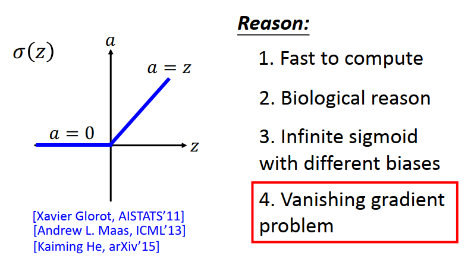

 **ReLU**  ： 在Input<0的时候,output=0; 在input>0的时候,output=input

**选择ReLU的理由如下：**

1. Fast to compute 计算快，比 sigmoid 快
2. Biological reason 生物学原因( Pengel的paper )
3. Infinite sigmoid with different biases 无限的sigmoid叠在一起
4. Vanishing gradient problem解决梯度消失问题

#### 假设有两层的network

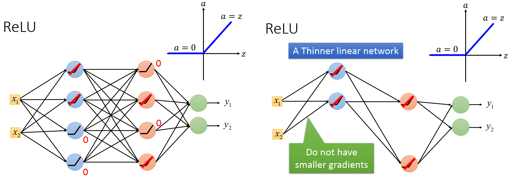

假设有两层的network，里面的activation function都是ReLU，ReLU function 分成两个operation region，一个operation region是input<0,output=0,一个operation region是input>0。假设今天的network 里面，我们给定一个input时候，这8个neuron有一些作用在input<0的 operation region，而有一些作用在input>0的 operation region

1. 对input >0 的那些 neuron 来说，他的input=output，他们就等同于是一个linear function 
2. input<0的neuron就可以视作不存在，

这样做之后整个network里面都是 linear neuron。**当使用ReLU时,input和output的关系其实是线性的，network会变成很瘦的线性的(Thinner linear )network 。**如果整个network是线性的，input layer的参数就不会有比output layer 还要小的参数。

#### 这个network不就变成线性的吗，线性不是很弱吗？实际上它只是在小范围内是线性的，在整体上还是非线性的。

1. input x_1,x_2,让右图中留下来的四个neuron 的operation region在大于0 的地方。
2. 当input x_1,x_2只有小小的变化的时候，这些 neuron 的Operation region(操作区域)不会改变.在Operation region没有改变的前提下，他是线性的
3. 但是只要你input变化够大，改变了neuron 的Operation region，它就不是线性的。

假设 x_1,x_2 是你的input ，只有在x_1,x_2 的附近（某一范围之内）是线性的。当超出某一范围，它就不是线性的，就进入了另外一个线性的 region。而这些线性的 region 他们的方向斜率等等是不一样的，所以整体来说整个function 仍然是非线性的（他们是在小范围之内是线性的）。

### ReLU-variant 变形 

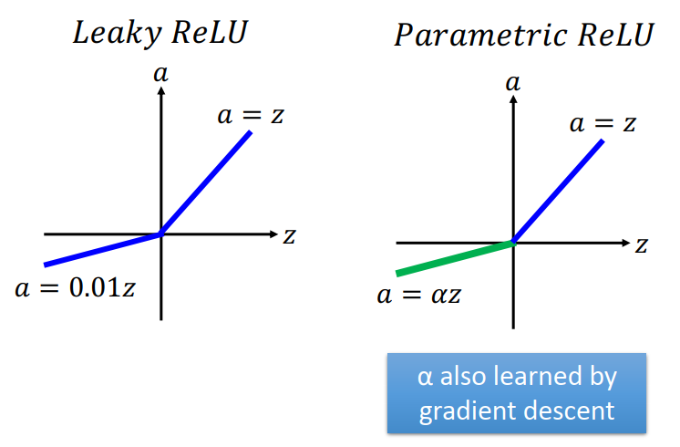

#### leaky ReLU 

input小于0时，output等于0.01乘以input ；input大于0时，output等于input 

#### Parametric ReLU

在input<0时，output=αz，α为network 的parameter，和Gradient descent一起learn出来，（甚至每个neural都可以有不同的α值）

#### Exponential Linear Unit(ELU),

右边是线性的，左边是非线性的

### Maxout

**让network自动去learn它的activation function**，这个方法叫Maxout network，ReLU是Maxout 的Special case。如果使用 Maxout network，machine 可以自己决定每一个neuron要什么样的 activation function

#### Maxout 如何运作

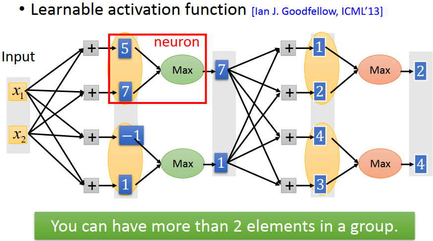

1. input x_1,x_2，
2. x_1,x_2分别乘上4组不同的weight，想象有四个neuron，得到4个neuron的input 5,7,-1,1。（在一般的network里面我们会把这四个input分别通过四个activation function得到 hidden layer的output ）
3. 在Maxout network 里面，把这些数值做分组(group),(几个output，**谁跟谁在一起是事先决定的**，如上图所示，事先决定好第一个数值和第二个数值一组，第三个数值和第四个数值一组)，
4. 决定好是一组以后，取max这个Operation ，5和7取max得到7，-1和1取max得到1.7和1就是第一个hidden layer 的output，
5. *所以今天用 Maxout network 的话，需要的参数比一般的network还要多。可以把每一个 max Operation 想成是一个neuron（红色方框）*。所以这个  Maxout network 他的第一个 hidden layer 有两个output。一般的 Neural network 要有两个output 只需要乘两组weight，但是在 Maxout network里面需要乘4组weight才能得到两个output
6. 每一个layer就做一样的事情，把7和1乘上4组weight得到4个不同的值，我们又事先决定好第一个output和第二个output是一组，第三个output和第四个output是一组，然后取 max的 operation 得到2和4
7. 如此运作。。。

**到底要有几个element（output）被放在一起，是事先决定的，是个参数要自己调**

#### Maxout如何产生不同的 activation function

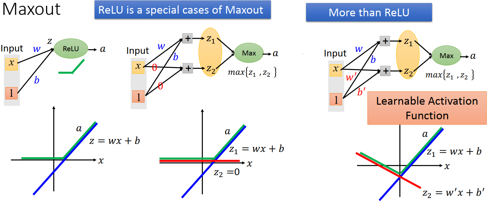

##### 先看一下 ReLU 

假设input只有一维x,把x乘上它对应的weight w 再加上bias ,通过 ReLU 这个 activation function就得到output。所以这个neuron 的input x 和output a的关系是

1. 首先算一下z,z=wx+b(如左下角)，
2. 如果横轴是x,纵轴是z，x和z的关系就是蓝色这条线,他们是线性的关系
3. 如果横轴是x,纵轴是a，先看a和z之间的关系，如果z>0,z=a,如果z<0,a=0,所以x和a的关系就是绿色这条线

##### Maxout可以做出和ReLU一样的x和a之间的关系

今天有一个Maxout network里面的neuron,他有一个max operation,input z_1,z_2看谁比较大谁就是output 的a。input一样假设只有一个值x，假设产生z1有关的参数是w和b,和z2有关的参数是0和0， 假设经过learning以后，Maxout learn出来的参数是z1=wx+b,z2=0x+0,它就会变成 ReLU

1. 看x和z_1的关系，x和z_1的关系是线性的，右下蓝色的直线会正好等于中下蓝色的直线，假设左面和中间的w和b相等。
2. z_2就是红色的线，永远都是0
3. 取max operation以后，就是在z_1和z_2里面选一个大的, 所以在z_1>0的region我们会选择大的也就是z_1,在z_1<0的region我们会选择大的也就是z_2

当我们Maxout network learn出来的参数是w,b,0,0的时候x和a 的关系，跟 ReLU x和a 的关系是一模一样的。所以给 Maxout 适当的参数，他就会变成ReLU。

##### Maxout 完全可以变成 ReLU 以外的  activation function

当z_2 的weight 不是0，0而是w',b',就可以变成别的  activation function

z_1和x的关系是蓝色的直线，假设z_2和x的关系是红色的直线，这时x和a的关系就变成左下绿色线的样子，变成另一个不是 ReLU 的  activation function。而因为这些参数是 Maxout  自动learn出来的，所以不是network可以自己决定他的  activation function 想要长什么样子，它根据data来自己learn出他的  activation function要长什么样子。

#### Maxout network 也没有办法learn 出所有可能的 activation function

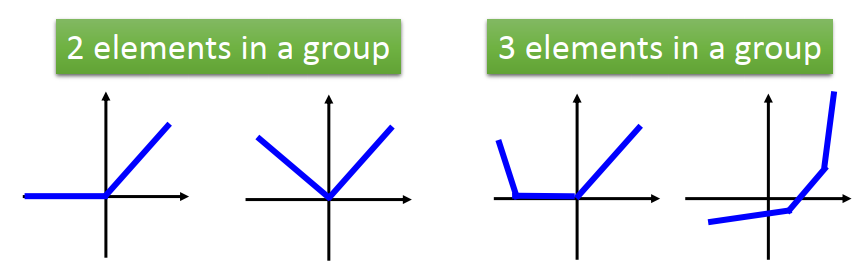

Maxout network 可以learn 出 piecewise linear activation function。（convex function 凸函数 ）

 piecewise linear activation function有几个piece depend on 今天是几个 element 放在group 里面。

1. 假设你是两个 element 放在一个 group 里面，可以有 ReLU 这个activation function，可以有取绝对值这个 activation function
2. 假设你是三个 element 放在一个 group 里面，activation function 就有三个线段

#### Maxout-Training

Maxout有一个max的 operation，没办法微分，有办法train吗？一个function 就算是没有办法在每一个input都可以微分，只要你可以算出参数的变化对loss的变化，就可以用gradient descent 来Optimizer这样的network。所以 Maxout network 是可以train 的。

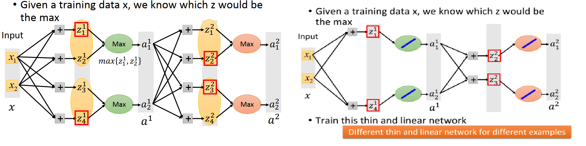

1. 假设给定一组 input x_1,x_2,
2. 假设$z_1^1,z_4^1,z_2^2,z_3^2$比较大，用红色方块框起来的output是大于跟他同一组的组员。
3. max 这个operation 想象成linear 的东西，比较小的组员想象成不存在，
4. 所以整个Maxout network，当给定input值的时候，它也是一个细长的linear function，
5. **做gradient descent 的时候，train 这个 linear function ，可以用Backpropagation来算linear function里面每一个参数的gradient，用gradient descent 方法来train这个Maxout network**
6. *没有被选上的output的参数没有办法被train到。实际上training data 里面有很多不同的input，每一次给他不同的input的时候会变成最大的element 是不一样的，不同的output会被接到 max 的operation。training data 里面有很多不同的training 的example，所以最后每一个z都有机会，所以连接到每一个z的参数最后都会被train 到，所以这不是一个issues。*

## Adaptive Learning Rate 

### Review-Adagrad:

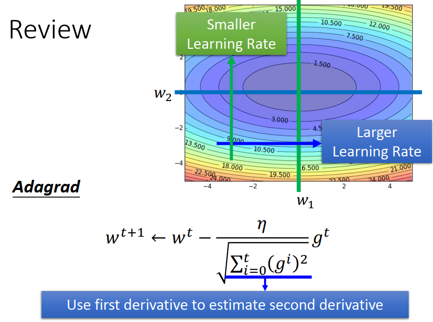

作业1要处理的问题是一个convex optimization problem，你的error surface 是一个碗的形状，Adagrad还是有帮助。Adagrad 用一次微分来估二次微分的值，但是这是在假设二次微分是很固定的情况.

*但实际上我们真正面对的问题是更加困难的,在做deep learning的时候，我们会定义一个loss function ，我们会找一组参数用gradient descent 去 minimize 这个 loss function，这个loss function 对这组参数来说是非常复杂的，而且参数是 high dimensional 空间里的参数是多维的，所以我们其实不知道参数对这个 error surface 的影响到底是怎么样的*

### RMSProp

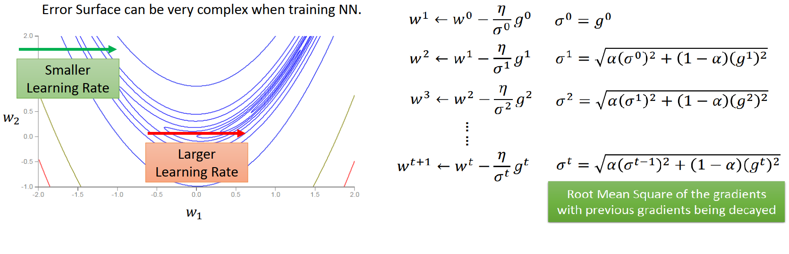

有可能遇到这样一种状况，如果我们考虑同一个参数w1,他的 error surface 我们假设如图所示，蓝色代表loss 比较低的地方，红色代表loss 比较高的地方。如果参数在横坐标方向上移动，在绿色箭头的地方可能需要比较小的learning rate，因为这边是一个陡峭的峡谷，才能够走到比较低的地方。如果在红色箭头的地方，在靠近月牙的中心的地方，这个地方 gradient 斜率波动是比较频繁的，这个时候虽然实在同样往右的方向，你可能会希望说步伐大一点。所以今天要好好的 train deep learning的话，你会需要比 Adam 稍微更复杂一点的方法，叫 RMSProp （来自*Hinten* 的deep learning 课程）

#### RMSProp 的计算方法(adgrade 的小小的变形)

之前我们做 adgrade 的时候，我们会除一个σ，这一项是 过去算出来的所有的 gradient 的平方和。RMSProp 它只做了小小的改动

1. 一开始 σ^0 等于第一次算出来的 gradient g^0^, σ^0^ =  g^0^   ，从w^0^ update 成 w^1^

2. 接下来在下一次 update 参数的时候，从w^1^ update 成 w^2^ 时，分母σ^1^ 变成新的 gradient  g^1^ 的平方乘上(1-α ),再加上 α 乘上σ^0^ 的平方，再开根号。**我们是把原来的分母这一项拿出来取平方以后乘上α ，再加上(1-α ) 乘上新的 gradient  g^1^ 的平方。**不像之前在 adgrade 是把所有的gradient 的平方加起来，现在在 RMSProp 里面我们会把新的 gradient 乘上一个weight (1-α ) ，再加上所有旧的 gradient 的平方和，再得到新的分母这一项

3. 所以计算 σ^2^ 也是一样，σ^2^ 就是前面分母σ^1^ 的平方乘上 α ，加上(1-α ) 乘上 gradient  g^2^ 的平方

4. 以此类推 。。。

5. 所以现在你要算 σ^t^ 的时候，σ^t^ 就是前一次分母σ^(t-1)^ 的平方乘上 α ，加上(1-α ) 乘上 gradient  g^t^ 的平方
   $$
   σ^t=\sqrt {α(σ^{t-1})^2+(1-α)(g^t)^2}
   $$
   

### Momentum

在train network的时候，可能会遇到 local minimum、saddle point这样子的问题，会导致还没有找到一个好的solution 你的training就停止了。

今天在这个optimization 的过程我们可以想象成是我们要minimize 的这个loss function就是一个山坡地形，参数就是一个球，从某个地方把球放下来他就一路滚滚滚滚滚，滚到某一个地方就停下了。

*这个球的运动和物理世界球的运动有很大的不同，在物理世界里面有一个很类似的地形，把球从左上角滚下来，gradient descent 时候参数走到  local minimum 就会停止，但是在真实的世界滚到 local minimum 因为有惯性的关系，他会继续往前走，能不能把惯性这个概念加到 gradient descent 里面去*

#### 惯性这个概念加到 gradient descent 里面去

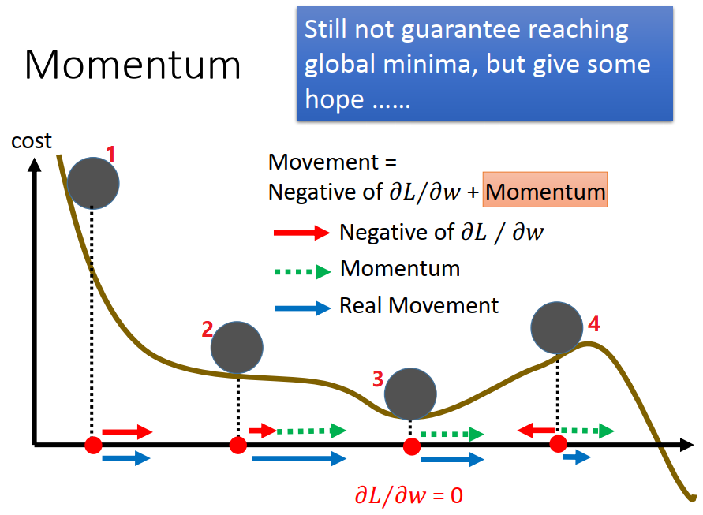

原来我们的参数移动只看 gradient 的方向，他和 gradient 走反方向。现在不止看gradient 方向，还看惯性（Momentum）给我们的方向，图中红色箭头代表 gradient 告诉我们要走的方向，绿色箭头代表惯性告诉我们要走的方向，蓝色箭头表示参考了gradient 的方向和惯性方向，这两者合起来之后我们真正让参数走的方向。

1. 一开始在位置1当作起始值，这个时候 gradient 很大，所以参数就很快的滚了下来，就会有很强的力量让参数往右走，这个时候因为是刚开始所以惯性是0 ，但是有很强的 gradient ，所以他往右走
2. 接下来参数走到位置2，这个时候 gradient 变得很弱，因为这个时候山坡的斜率变得很小，因为这个球是一路往右走过来的，所以这个时候的惯性是很强的，所以参数仍然会向右update
3. **如果参数走到位置3，他的 gradient 是0，如果是原来的 gradient descent 参数更新就停止了，无法再往右走，但是如果你有加上惯性的话，因为这个球一路由左往右走过来他已经累计了很多向右的惯性，所以他仍然要一路向右走。惯性告诉我们要向右走，gradient 告诉我们要停下来，所以继续向右走。**
4. 接下来就算这个球爬到山坡上，位置4，根据这个山坡的坡度告诉我们现在参数应该向左update了，但是惯性告诉我们应该继续向右走，如果今天这个惯性比 gradient 强的话，这个球就可以翻过这个比较低矮的丘陵，可以找到更好的地方。

当然这只是一个理想的状况，用 Momentum这个方法可能会比较好，但他并不保证deep 可以躲开local minimum，如果一个 local minimum 很深，仍然会陷在这个 local minimum里面

#### 实作怎么操作

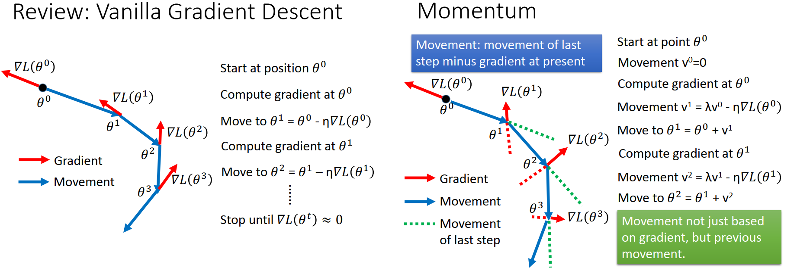

##### Review: Vanilla Gradient Descent  

先复习一样原来简单的 Gradient Descent 

1. 一开始我们从某一个参数θ^0^ 开始，算了一下 θ^0^ 的地方的Gradient ，Gradient 为红色箭头方向，我们走的是Gradient 的反方向，所以update参数的时候会走蓝色箭头的方向，你会乘一个learning rate，所以红色箭头长度和蓝色箭头长度不见得是一样的，depend on 你的learning rate 是有多大。
2. 参数跑到 θ^1^ 的地方，θ^1^ 的地方再算一次 Gradient 往红色箭头方向走，所以 θ 就往红色箭头反方向走
3. 再算一次 Gradient，再往反方向走。。。。

##### Momentum  

Momentum 每次移动的时候要考虑两件事情，第一件事情是 Gradient 的方向，第二件事情是所谓的惯性，这边的惯性就用前一次所移动的方向当作是惯性（考虑前一次就等于考虑了从整个运动初始的时候一直到现在的时间点）。

1. 从θ^0^ 开始，我们设一个值叫v^0^ ,v^0^ 就是我们走到 θ^0^ 的时候，前一次我们所走的方向是什么，v^0^ =0因为 θ^0^ 是起始的地方，之前我们没有做任何移动。
2. 计算 θ^0^ 的地方的Gradient ，θ^0^ 的Gradient 为红色箭头方向，我们移动的方向就是 ,$v^1=λv^0-η\nabla L(θ^0)$,因为前一次没有移动 v^0^ =0 ，所以就只考虑 Gradient 的方向，应该要走到 θ^1^ 的地方
3. 在θ^1^ 的地方再算一次 Gradient ，Gradient 往红色箭头方向走，但是我们现在已经有前一次移动的方向，是绿色的这一条线，所以i接下来在 θ^1^ 的地方要update 参数的时候走的方向是结合红色虚线（Gradient 乘上 learning rate ）和绿色虚线（v^1^  上一次走的方向），θ^1^ 的地方我们要走的方向 $v^2=λv^1-η\nabla L(θ^1)$，把红色虚线和绿色虚线加起来才是当你考虑 Momentum 的时候会走的方向，就是蓝色箭头的方向。
4. 这个步骤就会反复的继续下去，θ^2^ 的地方 Gradient 告诉我们走红色箭头的方向，前一次移动的方向告诉我们走绿色虚线，把红色虚线和绿色虚线加起来就是走蓝色箭头的方向
5. 这个process就会反复的继续下去，θ^3^ 同理，。。。。

###### 考虑前一次的移动方向其实就是考虑过去所有的移动方向

$$
\begin{array}\\
v^0 = 0\\
v^1=λv^0-η\nabla L(θ^0)\rightarrow v^1 = -η𝛻𝐿𝜃^0\\
v^2=λv^1-η\nabla L(θ^1)\rightarrow v^2 = -λη\nabla 𝐿𝜃^0 - η\nabla 𝐿𝜃^1
\end{array}
$$

1. v^0^ =0,v^0^ 带入v^1^ 的公式， v^1^ 等于负的 η乘上在 θ^0^ 所算出来的Gradient 
2. v^1^  带入v^2^ 的公式，v^1^ 就是 θ^0^ 的地方的Gradient ，所以 v^2^ 里面有 θ^0^ 的地方的Gradient 和θ^1^ 的地方的Gradient
3. 所以今天以此类推，如果你算v^3^ 的时候他就是过去所有的 Gradient 的总和。。。

**所以你今天在做 Momentum 的时候，虽然我们表面上看起来只有考虑前一次的movement ，但是过去所有的 Gradient 其实都会被考虑进来**

### Adam =RMSProp + Momentum

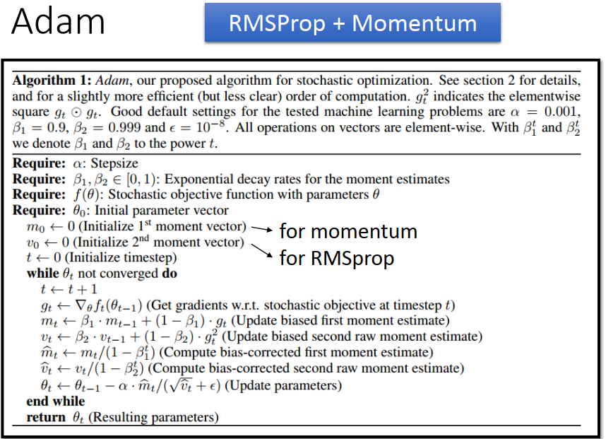

## overfitting 以后要做什么样的事情，让testing 上的正确率不会和 training 上差太多

## Early stopping

如果我们看 training 的 Epoch 和loss的关系（如图），在training set 只要你 learning rate 设的对，每次update 参数的时候，理论上你的loss应该要越来越小，直到没有办法下降(下面的线)卡到 saddle point 或者local minimum 的地方。

但是在testing set上，他的data可能会有不同的地方（不同的 distribution,不同的性质 ），所以随着你参数的变化 在 training set 的 error越来越小并不保证testing set 上的error 越来越小。所以通常看到的状况都是在 testing set 上的error越来越小，**但是到某一个地方以后随着你的epoch 在逐渐增加，testing set 的error其实是会慢慢增大的，**但是我们真正在意的的testing 的error并不在意training 的error。希望今天的 training 停在一个可能不是 training error 最小的地方，而是 testing error 最低的地方。问题是并不知道  testing error 是多少，testing set 用 validation set 来代替。

在training network 的时候，一边让network 在training set上的loss 越来越小,另一边每次过完一个 Epoch 要去算一下你的 validation set 的error，如果  validation set 的error 已经不再下降了，那就应该把 training process 停下来

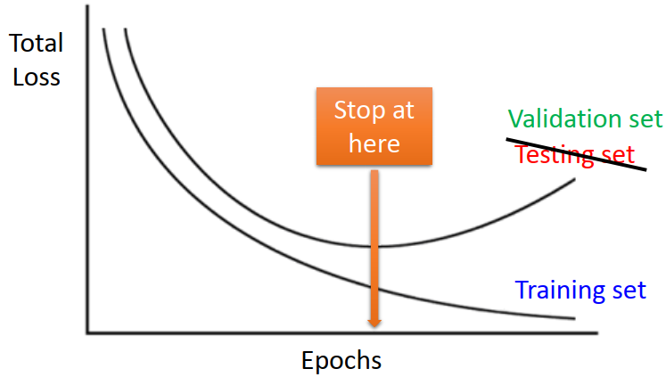

## Regularization

人脑会把没有用的神经连接 prune掉，下图分别描述了，刚出生的时候，婴儿的脑神经连接的很少；6岁的时候，脑神经的连接很复杂，小孩子脑神经的连接据说是成人的两倍，会记得很多有的没得东西；但是到14岁的时候，一些没有用得连接就逐渐的不见了。

其实在training neural network ，有加上 Regularization ，做的事情就好像是把没有用的连接 prune 掉一样

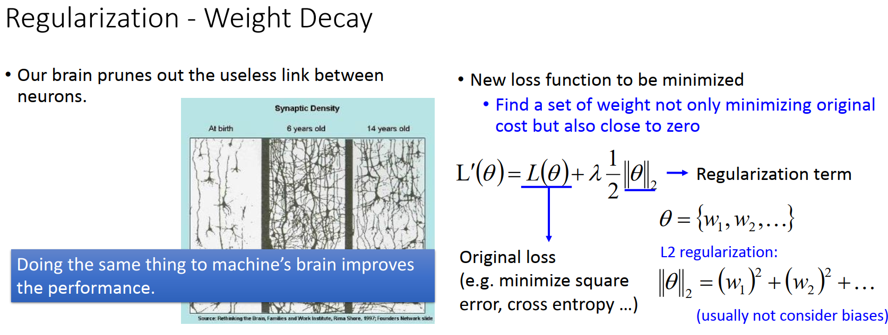

之前讲过加 regularization 就是希望我们的参数的 norm(正则化)越接近0 越好，我们不希望我们的参数太大，也就是说我们在做 regularization  的时候我们是修改了 cost function。

1. 原来的 cost function 考虑的是你要 minimize square error ，或者 minimize cross entorpy
2. 现在除了 minimize cross entorpy 以外，还有另外一项是参数的 norm ，用 L1或者 L2 都可以

### L2 Regularization

在  cost function 加一项  regularization  term，regularization  term 希望L2 的值越小越好，θ 就是network的参数所成的集合，L2 就是参数的平方和，neuron network 也不考虑bias。

**我们现在一方面希望  minimize 原来的 cross entorpy，一方面希望 minimize 参数的L2 norm(L2 regularization)**

1. L'(θ) 对w (某一个参数)做偏微分，得到 formula 1
2. update参数 ，把偏微分带进公式，合并w^t^ ,得到 formula 2
3. 在没有加 regularization  term 之前，我们update参数的时候就是  $w^t - η \frac{\partial L}{\partial w} $
4. 现在加上 regularization  term **不一样的就是 w^t^ 前面系数多了 (1- ηλ)**,通常会设计  (1- ηλ)，比如λ会设一个很小的值，比如0.0001。所以(1- ηλ)通常是小于1，但是接近1的值，比如0.99。所以每一次把w^t^ 在update之前都乘上(1- ηλ)，w^t^ 每次都会乘上小于1的值，所以参数每一次update的时候就会越来越小.(参数会都趋近0吗）
5. 但是并不会所有参数都变成0 ,因为还有 $η \frac{\partial L}{\partial w} $，最后 w^t^ 会因为 (1- ηλ)一直变小，**但是会有后面 $η \frac{\partial L}{\partial w} $这一项和前面变小这一项取得平衡，当取得平衡的时候learning 就会停止。**
6. 并不会所有参数都变成0，如果有某一个参数他的微分都是0(微分是0也就是这个参数对loss没有影响)，那这个参数就会越来越小，变成0。那些没有用的参数不会影响你的loss，最后都会变成0

因为现在这些参数每次都会乘上一个值让他越来越小，L2的Regularization 又叫做Weight Decay，就像人脑将没有用的神经元prune 掉一样。

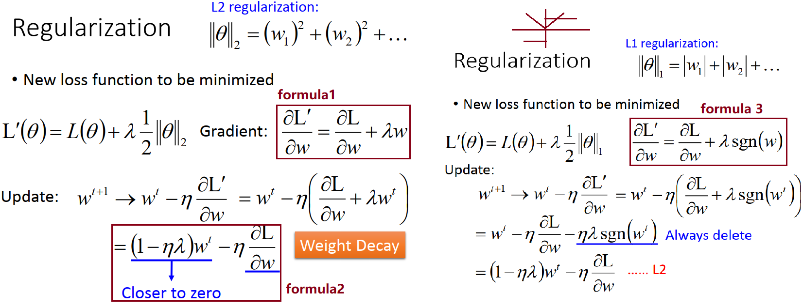

### L1 Regularization

L1 Regularization 和 L2 Regularization 会有微妙的不同。把  L2 Regularization换成  L1 Regularization ，微分这一项就会换。sgn(w)就是取w的正负号，如果w是正的，sgn(w)就是+1，如果w是负的，sgn(w)就是-1。如果我们把 θ的L1对 w 做微分的话我们得到的是他的方向。（w是正的微分出来就是+1，w是负的微分出来就是-1）

1. 做和L2 一样的事情，把把偏微分带进公式，变成3项
2. 前面两项和一般的偏微分一样的，加L1 以后多了  ηλsgn(w^t^),把参数往0的地方移动一个固定的距离
   1. 假如w是正的，那参数就减掉 ηλ，
   2. 假如w是负的，那参数就加上 ηλ

### L1 VS L2

L2、L1都可以让参数接近0，但是做法不同，效果不同

1. L2 是 w^t^ 乘上一个固定的小于1 的值，L2 对比较大的参数惩罚比较强，每乘一次固定的数值下降的比较多；参数比较小减少的量比较少。L2 得到的参数通常会聚集在接近0，但是不会真的很靠近0的地方，
2. L1 是减掉 一个固定的值，无论参数大或者小都一视同仁减一个数值。L1 的参数的差距拉的比较大，有一些参数值很大，有一些参数很接近0.

### Regularization 在deep learning 里面没有那么必要

Regularization 做deep learning 的帮助有限。SVM是要去解一个convex optimization problem，并不是用gradient descent 去 iterative updata 你的参数。只是把问题丢给 optimizer 直接就output给你一个结果。在做 SVM 的时候 Regularization  这件事情非常重要，even被写在 SVM optimization 程序里。但是我们做 neuron network，通常用 gradient descent做 minimize ，我们通常会 initialize 一个值，通常很接近0。从一个很接近0的值去做update，值本来靠近0 ，update以后慢慢变大（而Regularization  使参数接近0）。deep learning 的时候 Early Stopping （设小一点参数也会接近0）和 Regularization （参数越接近0越好）  的角色重叠，所有用 Early Stopping不太需要Regularization 

## Dropout-有 deep learning 特色的方法

### Dropout 运作方式

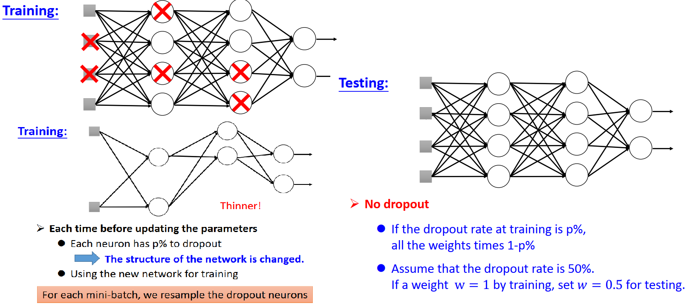

#### 在train network 的时候，

1. 每一次update参数之前，对network里面的每个 neuron (也可以对input layer(input dimensional)) 做 samply（抽样）。
2.  每个neuron 会有p%的几率会被 drop 掉，所以如果有一个 neuron 被抽到要被丢掉的话，就从整个 neural network 里面消失了，
3. 跟这些 neuron 相连的 weight 会失去作用就消失了。
4. 所以每做一次Dropout ，整个network的structure每次在updata参数之前都会改变，**变得更瘦**，因为有一些 neuron 被抽到就消失了

**每次在训练的时候都是用，已经把部分 neuron 丢掉的比较瘦长的 network 去做training**

注意：每一次updata参数之前（mini-bench），都要做dropout，**每一次drop的 neuron 都不一样**。我们通常都是从training set 里面 sample 一个 mini-bench，我们就update 一次参数。每次  sample 一个 mini-bench 出来都会做一次 dropout， 把部分的 neuron 给他丢掉

#### Testing时有两个重点

1. **Testing时没有dropout**，

2. **如果在training 时dropout rate =p%,training 上得到的 weight 在testing 时要乘上1-p%**

   e.g 假设 dropout rate = 50%，透过training 时 learn出来的weight 是1，在testing时weight 要变0.5

### Dropout 原理

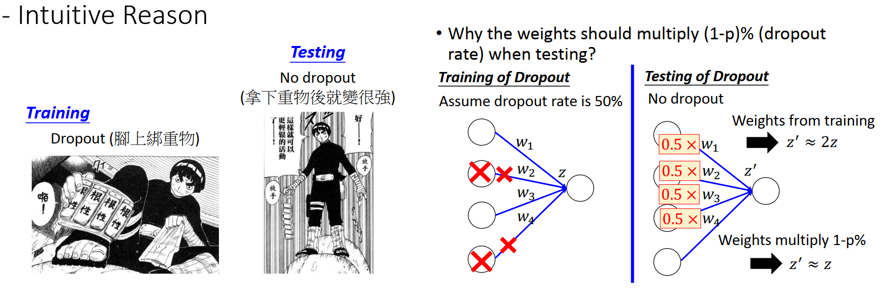

#### 为什么在训练的时候需要 dropout ，在testing 时不用 dropout ：

1. **可以把dropout 想成是一种严格的训练**。就像火影忍者中小李训练时要绑重物，打架时不用
2. 每一个neuron想成一个学生，final 的时候要一起teams up 做final project一样。teams up 时候有一些人会摆烂，就是他会dropout，每一个neuron知道说我的 partner 其实会摆烂。所以我应该要好好做，其实最后testing 的时候没有人会 摆烂，就做的特别好

#### 为什么要weight乘上 1-p%，为什么 training和testing 的weight 是不一样的呢

##### 直观解法

1. training的时候假设dropout rate是50 %，training 时总是会有一半的 neuron 是被丢掉的。
2. 假设在testing的时候时没有dropout，意思就是说没有任何 neuron 会被丢掉，
3. 我们今天在算一个 activation function 的 input的时候，算z的时候是把前面的 neuron 的output 乘上 w1,w2,w3,w4 这四组 weight 得到z,
4. 在testing时,前面的 neuron 的output 乘上 w1,w2,w3,w4 这四组 weight 得到z'
5. 会发现在training 时得到的z 和在testing 时得到的z',他们中间有一个很明显的差距

就期望上来说，假设 dropout rate是50 %， 在testing 时得到z‘比z 大两倍。**因为 training的时候有一半的 neuron 他的值会不见。所以z会变成z'的1/2，因为testing 时不会有 neuron 不见。这样变成 training 和 testing 的状况其实是不一致的，**

怎么把它变一致，把所有的 weight 都乘0.5，把这个差距转回来，把这个差距 normalize 回来。因为 dropout 的关系，所以z' 是z 的两倍，但我们把所有的 weight 都乘0.5，这样z'就会和z比较接近。这样training 和test 反而是match的。**所以我们今天在testing的时候，要把在 dropout learn到的weight，再乘上另外一个数值，反而是让 training和testing 时候的状况是一致的**。

#### Dropout is a kind of ensemble-- 正式的说法

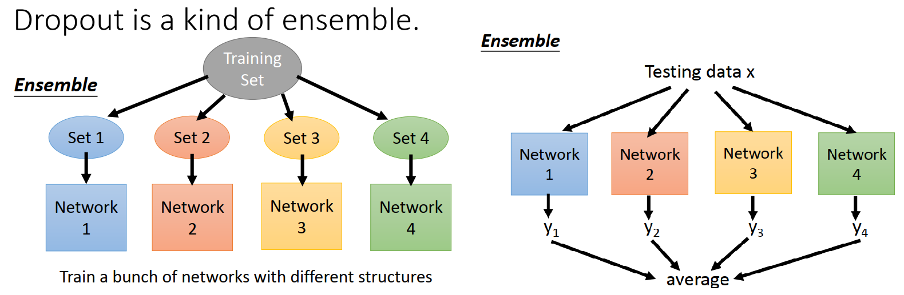

##### ensemble

1. 有一个 training set ，从  training set 里面做一下 sample，sample 出4 个 subset。把这4个 subset 分别去train 4个不同的 network，这些network 甚至可以用不同的structure
2. 我们之前在讲bias和variance时，一个model如果 variance 很大，每一次训练出来的结果会差很多，所以一个model 的参数很多，variance 很大, performance 会不好。这些 variance 很大的model 平均起来就会得到bias 很小的model （比如计算宝可梦的公式时的实验-- 五次式）
3. ensemble 运用的就是这个概念，单一一个 network 可能 variance 很大。我们 train 很多个network ，每个 network 用的 training data 都有点不同，network 的 structure 甚至可以不一样，很多个output 平均起来以后，就会得到好的结果
4. 当有4个network，testing 时，有一笔testing data进来，分别丢给每个network，把他平均起来，就得到最后的output

##### dropout是ensemble的方法的终极版本

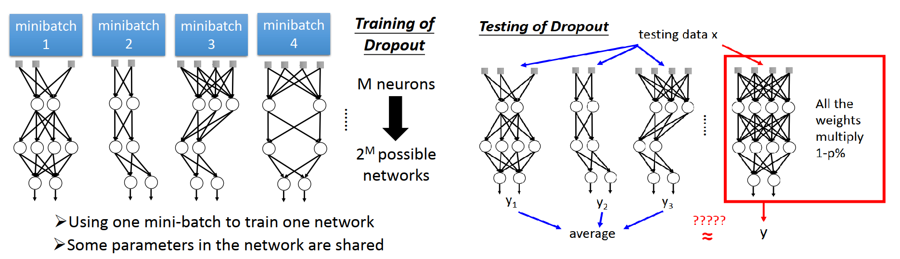

1. 在做dropout时，每次sample出一个minibatch，要做参数 update时，就会做一次dropout。我们用第一个 minibatch 里面的 data 去训练第一排形状的 network；用第二个 minibatch 里面的 data 去训练第二排形状的 network；我们用第三个 minibatch 里面的 data 去训练第三排形状的 network；用第四个 minibatch 里面的 data 去训练第四排形状的 network
2. 如果这个 network 里面有M个neurons，经过 dropout 以后，我们可以产生2^M^ 个不同可能的 network 。因为有 M 个 neuron，每个 neuron 可以选或者不选
3. 每个 network 都用一个 minibatch 里面的data 去 train，train 了一大把的network，就好像在做 ensemble 一样。如果一个network 只用一个 minibatch 里面的data 去train 会不会太少了呢？
4. 但是这些network 之间并不是独立的，**他的参数是共用的**，如果不同的 minibatch  会用到同样的 weight ，一个weight 被用到几次就训练几次，**一大堆 minibatch 合起来去训练参数，所以不用担心参数过少的问题。**
5. 真正神奇的地方在 testing，理论上按照ensemble方法，在testing 的时候，理想上 input 一笔 testing data,把这个 testing data 丢给所有可能的 network，每一个 network 都给我们一个output，把所有的output 平均起来才是最终的结果。我们有 M 个 neuron ，就有2^M^ 个可能的network，2^M^ 个network平均起来才是 ensemble 的做法
6. 但是在 dropout 时候不是这么做的，把所有的 weight 乘以 1-p%，然后把一个 testing data丢进去，这个output 和 average 的结果可以近似的

##### 举个例子				   

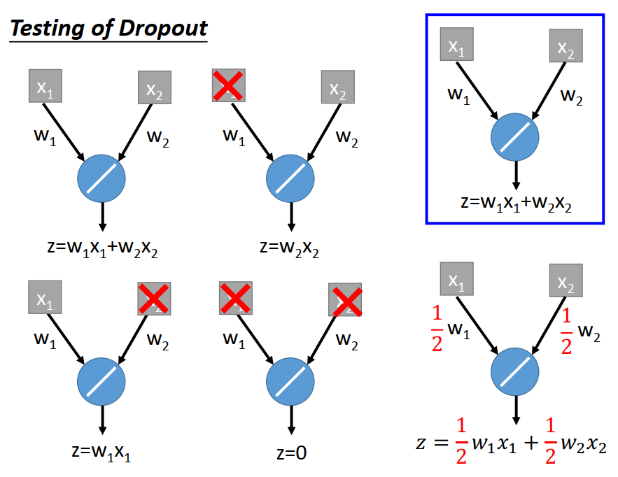

1. 假设这边有全世界最简单的network，input就是两个  dimension x_1和 x_2，省略掉 bias。使用 linner 的   activation function,output  z = w_1x_1+w_2x_2.假设这个 network 就是我们用 dropout 训练好的network。
2. 在testing 的时候,我们要穷举所有可能的 network structure(input 可以drop )，所以network 有四个(如图 一个是 x_1,x_2 都没有被 drop ；一个是 x_1 被 drop ；一个是 x_2 被 drop ；一个是  x_1,x_2 都被 drop )，这四件事情出现的几率是一样的
3. 接下来理论上就是丢一组data进去，然后算出四个结果，再把这四个结果平均起来  。把 x_1,x_2 丢进去，左上角这个 neuron output  是 w_1x_1+w_2x_2；右上角这个 network output  是 w_2x_2；左下角这个 network output  是 w_1x_1；右下角这个 network output  是 0。再把这四个结果平均起来 得到 1/2（w_1x_1+w_2x_2），要怎么样让右边上下两个公式相同呢，就是乘1/2就好了

以上可以看出 ensemble testing 时我们要穷举所有的network 这件事情可能是和weight 乘上  1-p% 可以 *相等的*

**有一个问题，**如果 activation function 使用 sigmoid function ，左边 ensemble 方法 和 右边乘上  1-p% 不相等。所以 **dropout  ensemble  =  weight 乘上  1-p%**  只有在network 是 liner才成立，network 是 unliner 时是 不成立。但是就算是 unliner 的activation function dropout 还是会work。

如果 一个  network 的 activation function 接近 liner，dropout 得到的结果就特别强（maxout network paper）

