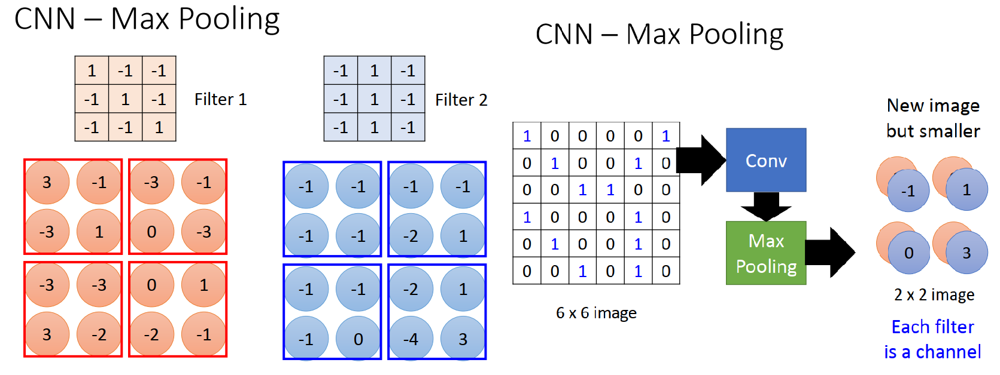
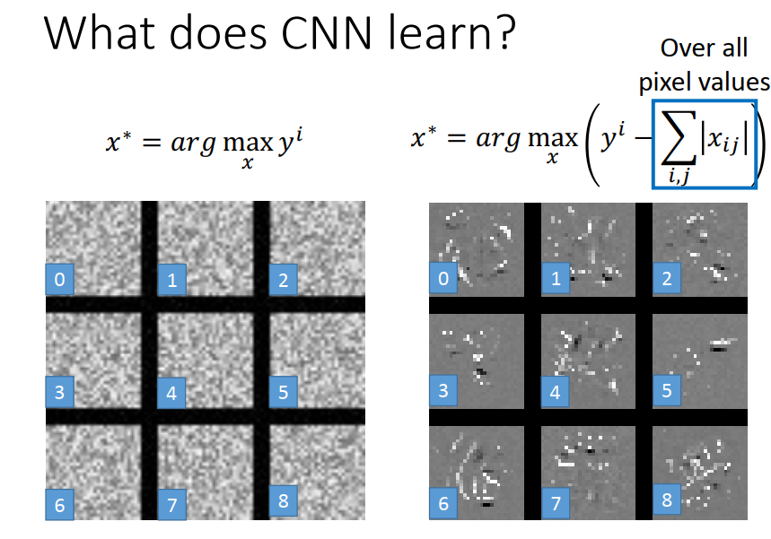

[TOC]


# P21 10: Convolutional Neural Network<!-- 83' -->

CNN是一个很好的例子告诉我们，network的架构我们是可以自己设计的。CNN 通常被用在影像上.

一个network 其实就是一个 function set,用一个 Fully Connect Network 就好像train了一个很大的  function set,要在里面找最好的function .**CNN就好像在一个很大的function base 里面只有少数function 是我们要考虑的**,其他的 function还未作就知道是坏的,直接不考虑那些坏的.这样learn时会得到比较好的performance , 比较不容易overfitting,variance 会比较小.

## CNN 是Fully Connect Network 的简化版

## CNN设计的 motivation (动机)--为什么设计CNN这样的network

CNN通常用在影像的辨识上面,也就是说给machine一张 image,当作是一个 matrice(矩阵)来看待,image用里面的 pixel 来描述. network就根据这个分类的问题决定image里面的object 是什么(鸟,狗,猫...)


用CNN的源起,**设计CNN的3个理由**

1. 我们今天可以用Fully Connect Network 来处理这个 input image,来得到这个output,但是这么做是没有效率的.因为在image 里面第一个hidden layer 那些 neuron 做的事情就是侦测一些比较简单的 pattern
   1. 举例来说在第一个 hidden layer 里面, 有某一个neuron 他的工作是, **侦测在image里面有没有鸟嘴这样的 pattern,**他看到鸟嘴的时候就会有一个很大的output,再由后面的后面的 neuron 去决定说image里面有没有一只鸟
   2. 但是真正鸟嘴这件事**不需要看整张image**, 对一个neuron 他只要看红色方框里很小的范围, 就可以知道这是不是一个鸟嘴. 通常第一个layer 的neuron 比侦测鸟嘴更简单, 看小区域里面有没有横线,直线...做这种很简单的事情不需要看整张image,**只需要看image 其中一个部分就好**
   3. 对这个neuron 来说并不需要把整张image 的pixel 通通丢给他,只需要把image 其中一个部分丢给他, 就可以做他需要做的事情
2. **同样的pattern 可能会出现在image 的不同地方,他们的形状是一样的,用同一个neuron ,同一组参数就可以侦测出来**
   1. 比如说出现在左上角的鸟嘴 和 出现在中间的鸟嘴, 其实形状是一样的,同一个neuron ,同一组参数就可以把它侦测出来, 
   2. 不需要有一个neuron 的工作是侦测左上角的鸟嘴, 有一个neuron 他的工作的侦测image中间的鸟嘴.这样设计你的network 的话,这两个neuron 他们做的事情是一样的,他们其中有一个是没有必要存在的,要用换老板的思维把其中一个冗员开除掉,减少network里面的neuron ,减少你的成本
3. **image 可以做 subsampling ,而不会改变image里面东西的形状,不会影像影像辨识的结果**
   1. 今天把这张图片纵轴奇数的做 subsampling ,把纵轴里面奇数的color 都拿掉,把偶数的row都拿掉,变成原来image大小的1/4,还是看得出来image里面是什么东西,


如果今天可以把影像变小的话,以上3个理由都是为了让network的参数变少

## CNN的架构


1. 先input 一张image,
2. 通过一个convolution 的layer; 通过Max Pooling的layer; 
3. 再通过 convolution 的layer; 再通过 Max Pooling 的layer
4. ...convolution 和 Max Pooling 可以反复的做,可以反复做数次
5. 最后再做flatten
6. 丢到 Feed forward network 
7. 最后得到辨识的结果

今天在这个 network 里面,  最后的 fully connected network  和中间的 convolution network , 这里面所有的参数都是都是 jointly (共同的) train.

 所以不是说我们先 train 了 convolution 才train了 fully connected network, 是这整套东西从input 到 output 就是一个很深的network,有很多个layer,**这些layer 里面所有的参数同时一起被找出来的**,都是一起被 jointly 找出来的

### 刚刚说影像辨识有三个 Property,

1. 第一个 Property 是有些pattern 是远比整张 image 小的,你只需要看小的范围就可以知道有没有pattern 的存在,这件事情会在 **convolution** 里面被考虑
2. 第二个 Property 是同样的 pattern 会出现在不同image 的不同地方,只需要用同一个neuron来侦测他,这件事情也是会被 **convolution** 这件事考虑
3. 第三个 Property 是可以做 subsampling 而不会影响影响辨识的结果,这件事会被**max pooling** 这个设计考虑

### CNN – Convolution

*先讲他是怎么做的,然后再讲其实这件事情是 fully connected network 的简化版*

#### Convolution 在操作上是怎么做的

1. input 一个 image, 是一个 **6x6 的image** ,上面每一个数值就代表一个 pixel 的值
2. 在 Convolution layer 里面,我们有一把 Filter ,每一个就是一个矩阵 (Matrix)
   1. 这些 **filter 里面的参数是学出来的**,就好像  fully connected layer 里面的 weight一样是被学出来的. 每一个 filter 是一个 Matrix ,这些 Matrix要填什么数值是被学出的,现在假设我们已经知道 Matrix 里面的数值,在知道这些数值的情况下,我们怎么使用这些 Filter 
   2. 实际是先决定有多少个filter，每个filter的大小长什么样子，参数是machine 自己根据training data找出来的
3. 假设所有filter的大小是3x3
   1. ( filter 的大小其实是自己设计的,几个 filter 也是你自己设计的,就好像 hidden layer 的size一样,这是一个要自己手调的一个参数)，
   2. 这些filter的size体现了**第一个Property**，也就是你要侦测的 pattern 其实比整张image还要小. 
   3. 假设今天的 filter 是 3x3 的filter ，意味着你认为在这些image里面这些pattern通常可以用3x3 的 filter 就把它抓出来,这些 pattern 的size是 小于 3x3 的


##### 举例来说我们现在有一个 filter (橘黄色的 filter ),filter 怎么和 image 做运作呢

1. 把filter放在image的左上角，filter的9个值和盖住的范围里面的9个值算Inner product(内积)，看看得到什么样的output. 这个case 里面第一个覆盖住的9个方框只有斜对角的地方是1,和 filter 相乘,得到结果是3,
2. 接下来移动filter的位置，移动的距离叫**stride**，如果你设 stride=1 ,就把左上角的 filter 向右移一格，再次计算覆盖住的9个格和 filter 的 Inner product (1x-1+1x-1+1x1),得到-1. 如果今天设 stride=2 的话 ,就是把它往右移两格,第二个得到的值就是(1x-1+1x-1+1x-1 = )-3

##### 整体操作

1. 一开始把 filter 放在最左上角得到一个值 3; stride=1,所以把 filter 向右移一格,得到值是-1; 再向右移一格,得到值是-3; 再向右移一格,得到值是-1.
2. 第一排扫完之后，接下来往下以一格,从第二行开始继续扫，得到的值是-3. 以此类推, 
3. 最后filter 会移到移到右下角,在右下角算出来的值是-1.

##### 你会发现这个 filter里面的值是斜对角的地方是1.

1. **所以这个 filter 他侦测的 pattern 就是, 在这个image 里面有没有斜对角是连续3个 1 的这种 pattern .**
2. 如果斜对角是连续3个1 的 pattern 的话, 这个image就会output 一个值比较大的value, 代表他 detect 到这个 pattern 
3. 所以你会发现在这个input 6x6 的 image 里面,左上角是 [1,1,1],左下角也有 [1,1,1]. 所以这个 filter 的作用就是 detect 连续 3个1 的存在. 把这个 filter 和image 做 operation 以后,发现左上角是3,左下角是3. 
4. 在整个Matrix里面,左上角和左下角的值特别大, 所以这个filter 就告诉我们在原来的image里面左上角和左下角有这样一个 pattern (蓝色的斜线)
5. **发现同样 pattern 出现在 image不同的位置都是由同一个 filter 所找到的,所以这就是 property 2,出现在不同位置的同一个 pattern 其实需要用同一组参数和同一个 filter 来寻找他**


##### filter2

还有第二个 filter (蓝色的 filter), 这个 蓝色的filter 也和现在input 这张image 去做 Convolution ,stride=1.

今天这个 Convolution 的 process 蓝色的 filter 和 红色的filter 是一模一样的, 但是红色的 filter 和 蓝色的filter 参数是不一样的,参数是学出来的.做完 Convolution operation 以后就会得到不一样的结果

1. 把 filter2 的9个值和蓝色框框里面九个值做Inner product 的话,得到-1,
2. 反复这个 process ,把蓝色框框再往右移一格,再算一个value; 再往右移一格,再算一个value...
3. 直到蓝色的框框被移到右下角就完成用蓝色的这个 filter2做 Convolution 这件事情

##### 经过fitter1，filter2 Convolution 以后得到的东西称之为 feature Map

可以把 feature Map 想象成另外一张image，这张image和原来的image 比起来有点不同的地方

1. 这张新的 image 可能是比原来的 image 要小，因为假如我们 filter 所考虑的范围最多只从 image 的左上角到右下角的话,你会发现得到新的image 会比原来输入的image要小一点. 因为 fitter 是3x3 的 fitter,6x6的image和3x3的fitter 做 Convolution operation 会得到 4x4的image(有100个filter就会得到100个image)
2. 第二个不同点,新的image 他的每一个pixel 有比较多的value 来描述他. 原来的 image (黑白的) 每一个pixel都只有一个数值来描述他，但是新的image里面每个位置会有两个数值来描述他, 每一个位置有几个数值,取决于有多少个filter，如果有500个filter，每个pixel就有500个value来描述，每个value都来自一个filter

##### 彩色的图片


刚刚举的例子输入的是一张黑白的图片,每一个 pixel 只用一个 value 来描述他

彩色的图片每个pixel都由**RGB三个数值来描述他**，每一个数值分别代表 **红色,绿色和蓝色** 的强度, 每一个数值称之为一个channel. 所以一个彩色的 image有三个channel

所以今天要做一个彩色的image ,有3个 channel 的 image ,做convolution唯一不同的地方是filter不一样. 原来filter是一个3x3 的matrix，**彩色的 图片的 filter是3x3x3的立方体，**前面两个3 代表的我们的 filter 有多大, 最后这个 3 可以想象成高,**就对应到我们有几个 channel** .如果我们有3个 channel ,那 filter 的高就是3, filter 1和 filter 2 都是一样, 由原来3x3=9个参数变为 3x3x3=27 个参数. *如果今天有人发明了新的彩色影像编码的方式,现在每一个pixel 不是用3个 channel 来表示而是用 100 个 channel 来表示,只需要把 filter 的高由3 改到 100*

##### 为什么convolution是fully connected network 的简化版


现在我们要做的是把 feature Map(绿色方框) 的output 想象成我们现在有一个 fully connected layer,把image 的 pixel 拉直丢进去,然后乘上这些weight ,就会得到另外一个 vector.

假设我们把绿色方框里面的output, 就想象成绿色长方形框里面的neuron的output ,就像是把  feature Map 拉直,就可以发现 convolution是fully connected network 的简化版

1. 做 convolution 的时候把 filter 放在左上角,把这9个值做 Inner product以后,得到一个 value 3,
2. 可以想象把6x6 的image 的36个pixel拉直排成一排,变成36 x1，
3. filter 1放在第一个位置(红色方框),得到3 这个value . 等同于我们现在有一个neuron . 这个 neuron只连接到这个 input 的36 个dimension 的第1维,第2维,第3维, 第7维,第8维,第9维,第13维,第14维,第15维. **这个 neuron 只连到了9个 pixel ,**原来一般的 fully connected layer每一个neuron 应该连到所有input pixel .我们现在做简化,现在这个 neuron 只会连到 9个 pixel .
4. 这个neuron 连到9个pixel的weight就是filter 1所代表的 matrix 里面的9个值(用同样的颜色代表weight (线条) 和 filter 1里面的weight (圈圈)是同一组weight  
5. **我们可以把convolution layer 和fully connected network扯上关系. 但是它不是fully connected network, 因为每一个neuron 只连接到部分的input,而不是全部的input, 这样做的好处是参数量变少,**
6. 我们在做 convolution时,把filter 放在左上角算出一个值以后, 接下来我们要把它稍微移动一点,算出下一个值,
7. 这件事如果把它和  fully connected 扯上关系,就像是我们有另外一个 neuron ,这个neuron 的output是-1,而这个 neuron 它连接的input 是 [2,3,4,8,9,10,14,15,16] 9个pixel 
8. **发现第二个 neuron  和第一个 neuron 他们的参数其实是一样的**,上面 neuron 9个weight 和下面 neuron 9个weight 数值是一样的(颜色是一样的). 因为在做 convolution 的时候是用**同一个 filter** 在这个image上面做移动.所以把他对应到 fully connected network 的话你会发现 对应到同一个 filter 的那些 neuron 参数是一样的,只是输入的input是不一样的,**所以最后得到的output 也是不一样的.** 
9. 但是这两个 neuron 参数是共用的,**参数共用的好处就是需要比原来更少的参数**,原来 fully connected layer每一个 neuron 的参数都是不一样的,每一个 neuron 的weight 都是不一样的,所以需要比较大量的参数,但是现在如果是一个 convolution 的layer,里面有很多的 neuron 他们的weight 是共用的

**weight 共用的好处就是,你在这个layer里面你的参数量就要比  fully connected layer少很多,所以我们说在做 convolution 的时候大幅的减少了我们所需的参数**

### CNN – Max Pooling



现在从 filter 1 得到一个Matrix(左边橙色),从 filter 2 得到一个Matrix(右边蓝色),Max Pooling做的事情就是把 Matrix 里面的 element group 起来

1. 比如我们可以把4个element 一组,把他们group 起来
2. 每一组里面选一个**最大的**，就叫Max pooling,
   1. 比如橙色矩阵左上角方框里面 3 最大,就把3留下了;右上角方框里面 0 最大,就把0留下了...
   2. 以此类推,对每一群都做一样的事情

我们最后要求CNN里面所有的参数,还是要用 gradient decent方法,还是要算个微分,**max 这个 operation 可以算微分吗?可以的,和以前的Maxout network  是一样的.**

也不一定要用 Max Pooling ,也可以用 **average Pooling** (每一个group 里面所有element 值平均起来当作output  ).不用纠结哪个强一点,可以两个都用.每个group 本来只选一个人当作代表,现在可以选两个数值当作代表,选最大的当作代表,选平均的当作代表,这样又做 Max Pooling,又做  average Pooling ,而且你永远可以选更多人当作代表

**完成 convolution => Max Pooling 之后，得到远比原来image小的新的image,新的image每一个pixel用几个数值代表就看convolution layer中有几个filter,这个新的image 就有多少个 channel **

### Convolution=>Max Pooling 可以反复做数次


1. 1个 convolution+ 1个Max Pooling 会给你一张 image
2. 把新的 image 再丢到 convolution +MaxPooling 的组合里面，就会得到一张更小的image,
3. convolution 本来就是要吃一张 image ,所以 今天红色框框里面的 convolution +MaxPooling  的output 是一张新的 image,对后面的 convolution 没有问题,就是吃一张image,然后再吐出另外一张新的image(2*2 的image 每个pixel 的深度depend on 有几个filter，50个filter就有50维,第二次做filter会考虑深度)

### Flatten

我们每一次做 convolution+ Max Pooling 都得到一张新的image, 如果觉得现在的image够小了，接下来要做的事情叫 flatten


1. 假如现在新的image 很小,他是一个2x2 的image,我们就可以放心的把它**拉直**,
2. 把 image 里面,每一个pixel，每一个channel的值统统拿出来拉成一个直的. 可以想象这个image 不能太大,如果image太大的话,拉直以后这个input 就是不得了的大. 但是我们经过几次  convolution+ Max Pooling 以后,最后一个 convolution+ Max Pooling 的 layer 的output image 已经很小了,把它拉直以后 vactor 也不会太长
3. 把它丢到fully connected network 里面,就结束了,fully connected network 就会给我们一个output. training 就是 gradient decent.

## CNN in keras

*讲的过程中 keras 改版为 keras 2.0, 后面视频 pyTorch 替换了 keras* 


如果我们要加一个 Convolution layer 的话,就用 add(Convolution2D),因为我们要input 一个image,所以我们Convolution是2D就好,可以做1D的 Convolution ,也可以做3D的 Convolution .

```python
model2.add(Convolution2D(25,3,3, input_shape=(28,28,1)) )
```

1. 后面的参数 (25,3,3) ,第一个数字是filter 的数,25个 filter,(3,3)意思是filter的大小是3x3,刚刚的例子我们有两个 filter,实际上我们需要更多的filter,我们做的task是 mnist 的task,需要25个 filter
2. input_shape 是我们input 的image 的size,现在要处理的是 mnist,input image的大小是28x28,channel 是1,因为他是黑白的 (彩色图片channel 是3)(旧版的keras 里面 input_shape 把channel 放在前面,把size放在后面)

做MaxPooling 的地方加MaxPooling2D,给他两个2 当作输入,就是把4个element放在一起取最大的那一个出来

```python
model2.add(MaxPooling2D(2,2))
```

接下来就是反复刚刚的步骤

1. input image 是 1x 28x 28
2. 经过刚才看到的Convolution,  model2.add(Convconolution2D(25,3,3, input_shape=(28,28,1)) ),变成 **25x26x26**.第一个25意思是有25个filter,现在channel 的数目是25. 后面26x26的意思是新的image的大小是26x26.因为filter 的size是3x3,把3x3 的 filter 和28x28 的image 做Convconolution 以后,有一些边边角角的地方不见了,所以新的image 的size是26x26
3. 接下来做maxpooling,这个maxpooling 是4个element 一组,选一个最大的,做完这件事以后就变成 13x13,
4. 接下来再做一次 Convconolution ,在做第二次Convconolution 的时候,现在的 filter 的数目是50,filter size 一样是3x3. 每一层 Convconolution 里的filter 的数目当然可以是不一样的,而且这些 filter 的参数都是不一样的.不要看这些 filter 都是3x3,以为他们就是一样的filter ,不一样的filter ,他们的参数是不一样的. filter 的数目是需要手调的(就像是做 Fully Connected network 时调每一个layer 的宽度是一样的 ). *原则上如果看文献,通常**CNN在 filter 数目的设计上都是靠近 input的地方 filter少,再来 filter 越来越多.** 是有道理的,如果每一层的CNN 他们的工作就是要 detect某一种pattern,比较靠近 input地方 detect 的是比较单纯的 pattern,接下来随着 layer越来越多,越上层的 filter它 detect 的是越抽象越复杂的 pattern.可以想象 basic东西是比较少的,而复杂的 intricate 的 pattern比较多.比如说在image里面最 basic 的 pattern就是几何图形,横线 直线 颜色是最 basic的pattern,复杂的 pattern几乎没有办法穷举 ,狗是一个pattern,猫是一个pattern.所以在设计 CNN 的时候通常 filter是由少到多.*  做完这件事以后,本来channel 是25,现在我们有50个 filter ,channel 变成50个,image size由13x13 变到11x11. **想一个问题在每一做 Convconolution 的时候,我们的 filter 的参数有多少.**
   1. 第一次做 Convconolution 的时候,每一个filer的大小有多少,有多少参数在一个 filter 里面呢? 这个答案很简单,因为这个filter size 就是3x3=9
   2. 第二次做 Convconolution ,filer 的 size 也是 3x3=9.但是参数不是9,因为虽然 filer size是3x3,但是channel 是 25,所以现在的 filter 是有高的**,filter 的高都是25**,size 是3x3,它是一个长方体,所以今天 **filer size 是 3x3x25 = 225**
5. 接下来做maxpooling,11x11 做完  maxpooling 以后变成 5x5,不是偶数如何把2x2 放在一起,keras里面多出来那一行就丢掉
6. 接下来做 flatten,flatten就是call一行??  ,这一行?? 就叫做flatten. flatten 的输入是50x5x5,有5x5 的 size 的image,每个pixel 的 channel 是50,它有 1250个数值
7. 丢到 Fully Connected Feedforward network 里面,就用一个hidden layer 就好了,这个  hidden layer 的 dimension是100, Activation 是relu,我们做 hand writing 的 classification,output一定是10维0~9,最后再加softmax

```python
# 网页种代码
import numpy as np
from keras.models import Sequential
from keras.layers import Convolution2D, MaxPooling2D, Flatten, Conv2D
from keras.layers.core import Dense, Dropout, Activation
from keras.optimizers import SGD, Adam
from keras.utils import np_utils
from keras.datasets import mnist

# categorical_crossentropy


def load_mnist_data(number):
    # the data, shuffled and  split between train and test sets
    (x_train, y_train), (x_test, y_test) = mnist.load_data()
    x_train = x_train[0:number]
    y_train = y_train[0:number]
    x_train = x_train.reshape(number, 784)
    x_test = x_test.reshape(10000, 784)
    x_train = x_train.astype('float32')
    x_test = x_test.astype('float32')
    # convert class vectors to binary class matrices
    y_train = np_utils.to_categorical(y_train, 10)
    y_test = np_utils.to_categorical(y_test, 10)
    x_train = x_train / 255
    x_test = x_test / 255

    return (x_train, y_train), (x_test, y_test)


if __name__ == '__main__':
    (x_train, y_train), (x_test, y_test) = load_mnist_data(10000)

    # do DNN
    model = Sequential()
    model.add(Dense(input_dim=28 * 28, units=500, activation='relu'))
    model.add(Dense(units=500, activation='relu'))
    model.add(Dense(units=500, activation='relu'))
    model.add(Dense(units=10, activation='softmax'))
    model.summary()

    model.compile(loss='categorical_crossentropy',
                  optimizer='adam', metrics=['accuracy'])

    model.fit(x_train, y_train, batch_size=100, epochs=20)

    result_train = model.evaluate(x_train, y_train)
    print('\nTrain Acc:\n', result_train[1])

    result_test = model.evaluate(x_test, y_test)
    print('\nTest Acc:\n', result_test[1])

    # do CNN
    x_train = x_train.reshape(x_train.shape[0], 1, 28, 28)
    x_test = x_test.reshape(x_test.shape[0], 1, 28, 28)

    model2 = Sequential()
    model2.add(Conv2D(25, (3, 3), input_shape=(
        1, 28, 28), data_format='channels_first'))
    model2.add(MaxPooling2D((2, 2)))
    model2.add(Conv2D(50, (3, 3)))
    model2.add(MaxPooling2D((2, 2)))
    model2.add(Flatten())
    model2.add(Dense(units=100, activation='relu'))
    model2.add(Dense(units=10, activation='softmax'))
    model2.summary()

    model2.compile(loss='categorical_crossentropy',
                   optimizer='adam', metrics=['accuracy'])

    model2.fit(x_train, y_train, batch_size=100, epochs=20)

    result_train = model2.evaluate(x_train, y_train)
    print('\nTrain CNN Acc:\n', result_train[1])
    result_test = model2.evaluate(x_test, y_test)
    print('\nTest CNN Acc:\n', result_test[1])
```

## What does machine learn?  

在做完 training 的时候,很多人会说做deep learning network 是个黑盒 ,不知道他在干什么.其实不完全是这样,当我们 train 完一个network 的时候,我们可以试着去分析他,分析我们所得到的结果,分析network 得到的结果,有什么重要的呢?为什么要知道 machine 为什么会得到好的结果呢,难道只看到得到高的正确率还不够吗.有时候machine 得到的结果:


举例做图片的辨识,给machine 看这个鞋子的图,如果他说球鞋,觉得它得到了正确的答案.但是如果他说得到了一只美洲狮,觉得机器是智障. 但是也许是你太shallow了,machine其实比你想得更多,它其实在鞋标制处有看到美洲狮.所以如果 machine 看到鞋子说是美洲狮,有可能是智障,有可能太厉害了,超越你的想象

所以我们train 完network 以后我们想要分析一下他的结果,怎么分析呢有很多不同的方式,以下只是举几个例子

### First Convolution Layer


假设我们train的是CNN，可以把第一个layer 的 filter拿出来看看,可以直接把filter 的参数拿出来,看看现在network 得到什么样的东西.  **左图分析的是 AlexNet 的 第一个layer,AlexNet 是做在彩色的图片上面,所以第一个layer 的 filter 是有深度的,**不像我们刚刚 在做mnist 的时候,第一个layer 是没有深度的,是黑白的. 

第一个layer的filter 很大,是11X11,如果把 AlexNet filter 都拿出来做 Regression 的话,你会发现这些 filter 是有一些道理的,比如说这边有一群 filter(中间部分的 filter), 他们的工作是侦测有没有某种 pattern; 下面这些 filter 他的工作就是侦测有没有某种颜色存在.

但通常只有第一个layer 的 filter 拿出来看他的参数,因为后面的 filter 拿他的参数出来看的时候,其实没有太大的意义. 因为第二个layer 那些 filter 他们input 就是第一个layer. 你要考虑第一个 layer 的output 你才可以知道第二个layer 在做的事情是什么. **不像第一个layer 直接filter 他的 input就是pixel** .你可以直接知道这些 filter 在做的事情是什么,但是如果是第二个layer 的话你就比较难知道他在做什么

### How about higher layers?

但是你可以别的方式来分析,举例来说我们现在可以把某个neuron拿出来，把某个filter在某个位置的output拿出来. **把每一张image都丢到CNN里面去，看这个neuron什么时候activated 最强，就知道这个neuron在做什么样的事情.**

右图来自CVPR paper, 这篇paper 里面做了一些分析,这些分析要看的是说某一个 neuron 对哪些 image 会特别 activated ,每个小图片左上角的值就是那一个neuron activated 的数值,白色的框框代表那个 neuron 能看到的区域.这个neuron 的filter size这么大,因为他是一个很 high level 的 filter , 每一个 high level 的 filter 看的就是其他 filter 的output ,把这一个 filter 他所管辖的范围统统拿出来的话其实通常是一个很大的范围.这是一个 deep 的 layer 的 filter 他的output,

1. 比如最上面的 filter ,他的工作是侦测人的上半身,
2. 第二个 filter 有时候他看到狗,有时候他看到 类似蜂窝砖 的物体,对 neuron 来说狗和  类似蜂窝砖 的物体 是一起的, neuron 的工作就是侦测这两种东西,猜测应该是狗的眼睛和鼻子合起来和有很多洞的东西很像
3. 第三个 filter  的工作是侦测花和 食物,只要是一团红色的东西,他就会被 activatIve 
4. 第四个filter 看的是数字
5. 第五个 filter 看的是类似房子的东西,但也包括 火车,看的是类似窗户的东西
6. 最后一个 filter 是侦测反光,各种反光

所以我们就可以知道 neuron 的工作,但是也有时候你拿一个  neuron  出来,也有其他分析的方法

### 其他分析的方法


我们刚刚已经train 了一个可以在minst 上侦测digit 的 network,如果我们现在想要分析第二个layer的 neuron ,第二个layer的 filter 他做的事情是什么的话,我们可以这么做

1. 假设我们现在要分析第k个filter, 第k个 filter 和 input image作用以后，得到11x11的 matrix，
2. **定义一个东西叫做 filter activation的程度(degrees)**,意思就是把filter所得到的matrix里面所有的数值都加起来,这个数值叫做 a^k^
3. 接下来找一张image x,x是一个28x28的matrix，**想要找一个 matrix x,这个x 丢到这个network 以后, 经过一番运算后，得到的a^k^的值是最大的.** 也就是说我们要解一个 optimization problem,要找一个x, 这个 x 可以让a^k^ 被 maximize,得到的答案叫做x* .
4. 这件事就是gradient decent ，我们本来用 gradient decent 是要解 minimize 一个objective function .现在我们要找一个参数x, 我们要找一个matrix x他可以 maximize 某一个 objective function ,也就是这边的a^k^, 只是反过来用gradient decent ,你只要能够计算微分,只要能够计算x_ij (x 是一个 matrix ,x_ij是x这个matrix里面的其中一个element,是第i个row,第j个 column 的数值),只要能够计算x_ij的数值对a^k^ (degree 的activation)的偏微分的话,就可以用  gradient decent 方法找一个x, 使  a^k^ 被 maximize 
5. 或者简单来说,我们之前是要调 network 里面的参数,让某一个loss function 的值最小,现在做的事情是把network的参数固定，**但是把input x 当作是参数**，然后我们要找一个x，他可以 maximize 某一个function

#### 如果这样做会得到什么样的结果呢-以下是实际的结果

用刚刚同样的network 架构learn 出来以后得到的结果,现在看到的结果是这样子,取前12个filter(实际上有50个filter) 所得到的  a^k^ (右图),这些图的意思是说,如果今天如果把第一排第一个 image 丢到这个network 里面,他可以让第一个 filter 的activated 最强,也就是说第一个 filter 看到第一张图的时候,他最兴奋. 第二个 filter 看到第二张图的时候是最兴奋的.

仔细看一下在这些图里面他都是有一个规律的图案,比如说第二行第二个图就是一些横线,第二行第三张图是一些斜线,第三行第一张图是一些比较垂直的线....也就是说这些 pattern 他们的工作就是 detect 某种简单的图案(这边指的线条是白色的).所以今天有某一个 filter(比如第二行第二个) ,他的工作就是detect 有没有这样子斜的笔画呢在input 图片里面,如果有看到这样子的笔画的话,他就会output 很大的数值,**所以这个 filter 的工作就是侦测这种由左向右的笔画...**所以我们就可以知道这些 filter 的作用像是在侦测笔画一样

#### 分析fully connective 部分

和刚刚分析 filter是一模一样的,我们就说能不能找到一张image，使得某一个 hidden layer 的neuron的output是maximize

1. 假设把这个hidden layer 里面的第j 个neuron的output拿出来设为a^j^ ,找一张image x可以让a^j^ 被 maximize
2. 得到的结果是什么样子呢,随便拿9个 neuron 出来,看看哪些image 可以让activated 的值最大
3. 得到的结果是如左图所示,看起来有点模糊,不过可以看到图片有一些类似笔画的东西,也就是某一些 neuron 看到第一行第二个的图形就会高兴,有些 neuron 看到第一行第三个的图形就会高兴,看起来都是一些类似笔画的东西,第六张图有点像3,第4 张图有点像千年眼,所以这些 neuron 是在侦测某种更复杂的图案,


#### 如果把最后一个layer的neuron 拿出来会得到什么样的结果呢

如果我们今天找一个x ,可以让 output 的第i维的值最大的化,我们是不是理论上应该要看到一个数字呢.因为我们知道output 是10维,每一维都代表了一个数字,代表了 0~9.理论上我们把对应到0 的那一维拿出来,我们找一个image ,他丢进去以后,output是0的那一维的值最大,也就是说一找张image,这个network 去做分类的时候,他最肯定这一张图片是0,我们不是应该就可以得到一张,看起来就像是我们所知道0 的样子的image.实际做了一下,得到的结果是右图所示.

第一个image,如果我们要让对应到0 的 dimension 的值最大的化,就用第一张图,要让1最大的话,就用第二张图...(会不会程序有bug)实际把这些image 真的丢到刚才train好的CNN里面，那个CNN有98% 的正确率,确实觉得第一张图片是0,第二张是1...而且他并不是很 confused 觉得第一张是0,所谓 confused意思是说那个network 的output 实际上是一个distribution,他给每一个 digit 一个confidence.他并不是觉得第一张有点像0,是0 的他给的0.11,其他数字的confidence是0.09这样子. 他是觉得这一张就是99.999% 就是0,是其他数字的几率confidence都是趋近于0,network就是这么想的.

其实这个并不是非常特别的事情,这件事情是蛮常见的,**network其实是很容易被欺骗的**,比如说拿那个image net,号称可以和人想提并论的network出来,然后给他看一只狗,他知道是狗,狗上面加一些奇怪的noise,他就发狂觉得是别的东西,所以这是一个蛮常见的现象,

这个结果其实蛮有趣的,往坏处想,你会觉得这个network 好像很弱,因为你可以轻易的骗过他,也许未来我们来拿这个deep learning 来做监视器,也许会有一些问题,因为他会轻易的被欺骗. 但是从另外一个角度来看,他显示了其实network 并没有只是单纯的把training data背而已,他其实是有举一反三的能力的,只不过其实举一反三的能力没有那么好,**或者是人类没法理解的方式来做举一反三这件事情,**

如果今天一个model他是把training data 里面的结果直接就背起来的话,那你给他一个奇怪的noise 的image,他应该告诉你说他和我现在training data里面的image都不像,但是他最后还是会output一个结果给你,但是他会觉得这个奇怪的image对每一个digit 的 confidence 都是低的,

但是如果你今天做的是deep learning 的话,就不一样了,deep learning 他是非常confidence 的说这些东西就是数字,用一个我们没有办法理解的方式去理解他所看到的东西,这其实显示了说他并完全只是把input 死背下来而已,并不完全把training data 看到的东西死背下来

#### regularization



我们也许可以把这个结果做的更好,我们应该给我们要找的image加一些constrain,我们知道左图看起来像是电视坏的的图案显然并不是image,我们可以给这个 image 下一些 constrain,告诉machine说什么样的x比较像CV(?),比如说我们在解这个argmax problem 的时候,我们可以加一个regularization的项,这个regularization的项是要告诉machine 说,我们今天要找的**一张图不止要让y最大,我们还要让每一个pixel的绝对值的和最小,**也就是这里加一个L1 的 regularization,这个结果就会希望说今天output的这些image,他里面不要整片都是白的,只要在必要的地方把白色涂上去就好,解的是加上regularization 得到的结果是右图,

从这个结果就可以看到一点点image的讯息,比如说第一个有点像0,第二个也许有点像1,第7个有点像6...有看到一些结果,虽然说没有很 perfect .老师有试不同的 initialization,(因为现在做的是 gradient decent,还是要有一个initializa x,然后再做gradient decent去找出最好的结果,所以很受初始的值的影响).如果试着做一些不同的initialization,比如说拿某一个真正的数字当作 initialization ,但是得到的结果仍然没有很好. 如果拿某一张数字做 initialization,就不会看到沙沙的结果,会看到看起来像是有笔画的样子,但是还是看不出来数字是什么,理论上如果再加一些 regularization ,比如说你希望output的白色是比较 smooth的,白色的点应该要接在一起,不要一点一点的分开的,最后应该是可以看到做出像数字的东西(要花很多时间).其实还有很多方法可以轻易的让你到以假乱真的数字或者以假乱真的图片(所以没细致花时间在这上面)

#### 在文献上有一些更复杂的分析


##### 方式1:

比如说刚才用刚才讲的一模一样的方法,如果不用我们今天拿来分析的network 是做mnist的network,所以他只能画黑白的数字的图片. 如果你拿来做 network 是可以辨识彩色的图片,比如拿这种去比那种 image net 的那些network 去做,就可以得到一些彩色的图片,右图是文献上找到的一些结果,要做的事情就是output就各种不同的class,猫呀,狗啊,花啊,草啊...

然后他就选某一class,找一个image要让那一个class的分数最高. 你看的出这些东西是什么吗,左上角有点像螺丝钉,实际上是哑铃;第二张图是茶杯,第三张图是大麦町狗,第四张图是甜椒,第五张图是柠檬,最后一张图是哈士奇

##### 方式 2:

另外一种分析方式是,之前我们说可以算微分，我们可以从微分的值看出今天的input 一张image的某一个pixel对那一个class是否重要，**如果微分的值大就代表很重要**

1. 比如今天有一张猴子的图,我们取其中一个pixel 出来,x_ij 这个pixel 出来，
2. 接下来再选一个class ,比如选第k个class y_k,假设这个image 丢到model 里面,model觉得他是第k 个class,
3. 然后再去**计算这一个x_ij对正确的class y_k微分的绝对值，如果这个值的很大，意味着说这个pixel对辨别是不是这个class 其实是很重要.**也就是说如果这个x_ij这个 pixel 对 y_k 微分值很大,意味着 x_ij这个 pixel 稍微变一下,machine 可能就认不出来他是哪一个class,他可能就认不出来他是第k个class,如果是这样子的话就代表这个  pixel 是很重要的,
4. 举例来说如果machine看猴子这一张图,他会觉得说白色的pixel 是很重要的,(上下两张图的大小是一样的),下面这张图的白色,就对应到这个微分的绝对值,所以越白就代表说machine 觉得 那一个 pixel 对判断这一张image的class 是越重要的
5. 显然现在machine 要辨别这张图里面有没有猴子,就是要看猴子坐的地方,而不是其他地方,
6. 你可能会觉得这个分析有意义吗,不看猴子的地方还可以看别地方吗,他可以看别的地方. 在文献上有人曾经用这样的分析,分析某个不是deep learning 的模型,他就发现模型对马的辨识正确率很高,但是如果你分析他是看哪一个pixel 才得到这张图片是马,你会发现说他看的都是左下角的字,因为图片里面往往下面都有一行字,那些马的图片都是从同一个网站上抓下来的,所以machine learn到的东西是抓那个网站的左下角网址,他从来都不知道马是长什么样子,所以分析这个也是重要的,

##### 方法 3


有另外一个简单的方法,看machine 是从image的哪一个地方决定他看到了什么,拿一个框框把image的其中一小部分遮起来，把image的其中一小部分拿掉,然后看说machine 现在对:

1. 假设第一张图是博美狗,把图上每一个不同的位置都分别用灰色的框框遮掉,看machine 在遮掉什么地方时，他辨识不出这是一只狗，下面的图是文献上的结果. 越偏蓝色代表machine 越无法辨识这是一只狗,所以你会发现当你把灰色的框框移到蓝色区域的位置的时候,machine 就会无法发现这是一只狗''这是合理的,因为蓝色区域是狗的脸,狗的脸遮住,machine就不知道他是什么了

2. 第二张图是一部车,这一题的正确答案是轮胎,那你要把右上角遮住,就是轮胎的部分遮住,machine 才会看不出来他是轮胎,如果你遮左边这些地方的话,machine 还是知道这是一个轮胎,

3. 在最右边这个图的例子,答案是一只狗,要让machine 遮住狗的脸,和狗的身体,并不是记得看到这些人所以有这只狗,而是真的知道要看到这个东西才知道是狗,所以遮住狗的区域就会辨识不出狗

## 应用

### Deep Dream

用刚刚做微分的想法，就可以做出Deep Dream 的效果


Deep Dream 是怎么做的呢

1. 找一张图片，图片里面的人是李老师，把图片丢到CNN里面，CNN的每一个filter就会得到output，比如某一个filter 的output  是3.9，另外一个filter output  是-1.5,又有一个filter output  是2.3
2. 接下来要做的事情是**强化，夸张化CNN所看到的东西，如果原来是是一个大的正值，就让他更大，如果原来是一个负值，就让他更负，**也就是你找到一张新的image，这个新的image 可以让某一个 filter本来是3.9变成4.5 ，某一个filter 本来是-1.5变成-3，把原来看到的东西都夸张化，看看machine 会看到什么，machine 看到的结果是右图所示
3. machine 看到在背后的草丛里面，有很多的啮兽，machine 有看到左上角是双头鱼，右边上边是一只奇怪的虫，下边中部是一只老鼠，右边中间是一只熊，可以看出熊的鼻子和耳朵,原来的石头就很像熊，machine 就看到一只熊伪装的石头

### Deep Style

同样的道理可以让machine 模仿名画的画风 deep style，让照片画一下呐喊的画风，下图是画出来的结果。


machine怎么做到这件事的呢，大概的做法是

1. 有一个现成的CNN，你把这张image　丢到现成的CNN里面，从CNN filter output 里面,在这篇paper 里面 proposed 某一些方法,说CNN某些output 代表 content (内容),CNN的另外一些output 代表 style(风格),
2. 接下来再去找另外一张image,这一张image 他的 filter output 从content 来说像左边,从style 来看像右边,
3. 然后就用 gradient decent方法找一张image,看起来从content 的部分像左边的image,style 像右边的image,找出来的结果就像下边的图

### 下围棋

CNN 现在有一个知名的应用就是拿来下围棋,“AlphaGo”里面有一个非常深的CNN,怎么来拿CNN来下围棋呢,我们知道下围棋的时候我们需要一个 Neural Network,input 是棋盘,output 就是棋盘上 19x 19 的位置,


1. 如果用 Fully connected feedforward network的话, 那就是把input棋盘描述成一个 vector,vector 的 dimension 就是19x19,把这个19x19 的 vector丢到network 里面去,希望network output 就会告诉你说下一步应该下在哪里
2. 这个19x 19 的vector里面可能有放黑子的地方就是1,放白子的地方就是-1, 如果没放黑子也没放白子的地方就是 0
3. output 就是19x19 的vector

但是如果用CNN的话效果更好,因为可以把input 这个棋盘看成是一个image,看成是一个有19x19个 pixel  的image,他不是把它看成 19x19的vector,而是把它看成是一个19x19 的image,这种network 要怎么 train


1. 找一些棋谱,比如找了进藤光和社青春的棋谱,初手下在 5之五,次手下在天元,第三手下在五之5,旁边人都很惊讶
2. 所以 machine 学到如果初手下在5之五,棋盘就是5之五的地方有黑子,其他的地方都没有落子,CNN就学到,output 每一个dimension 都对应棋盘上的位置,天元的地方的分数最高,其他的地方最好都是0
3. 接下来他又学到,5之五 有黑子,天元有白子,接下来output就是''五之5 ''的地方要是1,其他地方confidence 最好就是0

所以这个training和我们之前学到的东西没有什么不同

#### 问题:为什么我们要用CNN?

我们之前在一开始有讲过当我们把DNN 换成CNN的时候，在image 上显然是有一些好处的,因为他考虑了image的特性,但是围棋有和image一样的特性吗.


##### 1.之前我们说我们可以用CNN也是因为有一些pattern远小于整张input 的image ,在围棋上有同样的特性吗,在围棋上也有同样的特性

1. 比如说三颗黑子围绕一颗白子叫做 ''叫吃(气)',如果把黑子摆在这个,白子就可以提走,所以白子就要在这个地方揭
2. 叫吃(气)就是一个很小的 pattern,只需要 3x3 的范围就可以侦测出""叫吃(气)"这个 pattern，不需要看整个棋盘才能看出"叫吃(气)"这个pattern。
3. 在AlphaGo 里面,他的第一个layer ,他的filter 的size 都是5x5,显然在围棋里面一些最基本的变化,也许都是在5x5 的范围内就可以被看出来

##### 2.我们会把同样的filter用在图片的各个不同的地方,因为同样的 pattern 出现在同样的图片的不同的地方,他们代表的意思是一样的

1. 今天在围棋上也有同样的特性,比如"叫吃(气)"可以出现在整个图片的左上角，"叫吃(气)"也可以出现在整个图片的右下角
2. 今天不管"叫吃(气)"是出现在图片的左上角还是图片的右下角,他都是"叫吃(气)",都是一样的,可以用同一个 filter 把这个 pattern detect  出来

##### 3.比较让人想不通的是最后一点,为什么可以做maxpooling 呢

1. 我们说我们在做image 可以做maxpooling ,是因为我们可以做subsampling,可以把image的奇数行和偶数列丢掉,看起来和原来的image没有什么太大的不同,但是在围棋上把奇数行和偶数列丢掉,不可能还是同样的盘式
2. 会不会在 AlphaGo 的CNN的network的 设计上有什么特别的地方,在“AlphaGo”Paper的附录里面，描述了Neural network architecture，它的network的input是一个19 *19 *48的image。input棋盘是19 *19,48是哪来的呢？每一个位置都用48 维来表示。(这个地方要用到 domain knowledge,比如说这个位置有没有被黑子围住是一个feature,这个位置有没有被白子围住是一个 feature,所以他定了 48 维 feature,你怎么知道要定这些 feature ,你就需要 domain-knowledge,需要职业棋手的帮助)
3. 第一个layer会 pad zero 。会把19x19的image外围补很多的0，让它变成23 x23的image。
4. 接下来有k个filter,kernel size 就是 filter 的size, size 都是5x5,stride 都是1,用ReLu 的activation function。filter 的output 还会通过 ReLu 
5. 接下来有2~12 个layer,很深,都有做 zero  pad,都补成21x21,kernel size 都是 3x3,stride 都是1
6. **然后你就会发现“AlphaGo”是没有做Max Pooling，**

所以这是一个很好的例子,这个例子告诉我们说 network 的设计“应用之道，存乎一心”,并不是在做image的时候要用CNN + Max Pooling得到好的结果,image有那样的特性,

你把同样的架构挪到另外一个test上的时候,他的 network  structure不一定是一样的,要思考一下另外一个test的特性然后才去design 你的 network  structure.AlphaGo没有用 Max Pooling 这件事就是一个很好的的例子告诉我们你要好好想一下 network 的架构是不是适用在你的test 上

### 语音辨识

语音辨识可以用CNN,为什么语音辨识可以用CNN，

1. 图中是一个Spectrogram,横轴是时间，纵轴是那段时间里面声音的频率 Frequency,这是一段声音讯号,说"你好"
2. 可以把这个东西当做一张图片来看,偏左的区域像是一只大嘴巴的精灵,有一个舌头,这个东西就是"你",图片偏右像是复活节岛石像的东西是"好",
3. 训练machine 拿一段声音讯号,这段知道声音讯号他说的内容是什么,,把Spectrogram 当成一张image,和machine说,把它当作影像分类的问题来看,看这张image 告诉我他是哪一个重音符号,就可以做语音辨识了

现在最??? 的系统的最下面的layer 往往都有用CNN的

????  视频少了一段  ??????


###############

CNN到底学到了什么
⦁	分析input第一个filter是比较容易的，因为一个layer每一个filter就是一个3*3的mmatrix，对应到3 *3的范围内的9个pixel。所以你只要看到这个filter的值就可以知道说：它在detain什么东西，所以第一层的filter是很容易理解的，ma
⦁	但是你没有办法想要它在做什么事情的是第二层的filter。在第二层我们也是3 *3的filter有50个，但是这些filter的input并不是pixel(3 *3的9个input不是pixel)。而是做完convolution再做Max Pooling的结果。所以这个3 *3的filter就算你把它的weight拿出来，你也不知道它在做什么。另外这个3 *3的filter它考虑的范围并不是3 *3的pixel(9个pixel)，而是比9个pxiel更大的范围。不要这3 *3的element的 input是做完convolution再加Max Pooling的结果。所以它实际上在image上看到的范围，是比3 *3还要更大的。那我们咋样来分析一个filter做的事情是什么呢，以下是一个方法。


可以把一段声音表示成Spectrogram(横轴是时间，纵轴是那段时间里面声音的频率)，红色代表：在那段时间里那一频率的energy比较大。
⦁	学习人既然可以看这个image就可以知道是什么样的声音讯号，那我们也可以让机器把这个Spectrogram当做一张image。然后用CNN来判断：input一张image，它是对应什么样的声音讯号(单位可能是phone)。但是神奇的地方是：CNN里面的时候，在语音上，我们通常只考虑在frequency方向上移动的filter。也就是说：我们的filter是长方形的，其中宽是跟image的宽是一样的，我们在移动filter的时候，我们移这个方向(如图所示)
⦁	如果把filter向时间的方向移动的话，结果是没有太大的帮助。这样的原因是：在语音里面，CNN的output还会接其他的东西(比如:LSTM)，所以在向时间方向移动是没有太多的帮助。

文字处理
⦁	啊我们知道CNN耶可以用在文字处理上面，这个是从paper截下来的图。在文字处理上面，假设你要做的是：让machine侦测这个word sequence代表的是positive还是negative。首先input一个word sequence，你把word sequence里面的每一个word都用一个vector来表示。这边的每一个vector代表word本身的sementic，如果两个word含义越接近的话，那它们的vector在高维的空间上就越接近，这个就叫做“wordembedding”(每一个word用vector来表示)。
⦁	当你把每一个word用vector来表示的时候，你把sentence所有的word排在一起，它就变成一张image。你可以把CNN套用在这个image上面。
⦁	整张当我们把CNN用在文字处理上的时候，你的filter其实是这个样子的(如图所示)。它的高跟image是一样的，你把filter沿着句子里面词汇的顺序来移动，然后你就会得到一个vector。不同的filter就会得到不同的vector，然后Max Pooling，然后把Max Pooling的结果丢到fully connect里面，就会得到最后的结果。在文字处理上，filter只在时间的序列上移动，不会在“embedding dimension”这个方向上移动。如果你有做过类似的task(文字处理)，知道“embedding dimension”指的是什么，你就会知道在“embedding dimension”反向上移动是没有帮助的，因为在word embedding里面每一个dimension的含义其实是独立的。所以当我们如果使用CNN的时候，你会假设说：第二个dimension跟第一个dimension有某种特别的关系；第四个dimension跟第五个dimension有某种特别的关系。这个关系是重复的(这个pattern出现在不同的位置是同样的意思)。但是在word embedding里面，不同dimension是独立的(independent)。所以在embedding dimension移动是没有意义的，所以你在做文字处理的时候，你只会在sentence顺序上移动filter，这个是另外的例子。