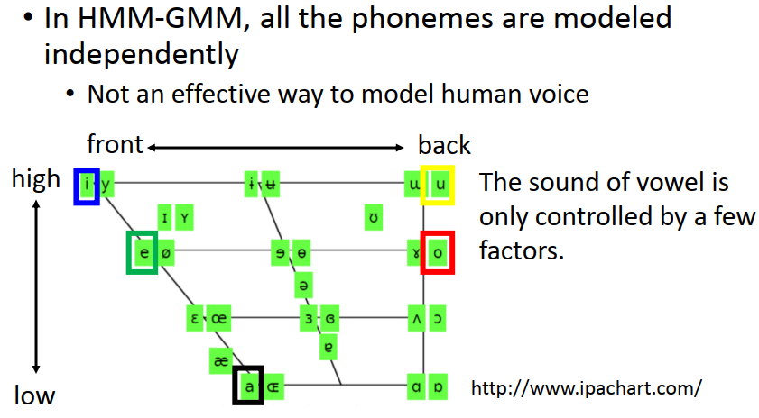

[TOC]

# P 22 11: Why Deep Learn <!-- 60' -->

## Deeper is Better ?

这张图告诉我们说，network 越deep，从1层到7层，果然error 在不断的下降，但是你仔细的思考一下这个问题，你的network 越深如果 imply  的是你的参数越多的话，那有什么好说的呢，你的model比较复杂，data比较多的话。本来performance 就会比较好

所以你真正要比较deep 和 shallow 的model 的时候，你应该做的事情是你应该要调整deep 和shallow 的model，让他们的参数是一样多的，很多人在比较deep 和shallow 的model的时候是没有注意到这件事情的，那个评比是不公平的，如果你要给deep和shallow model 一个公平的评比，你要故意调整他的参数，让他们参数是一样多的，这样的情况下shallow的model就是一个矮胖的model，deep的model就是一个瘦高的model

接下来问题是在这个公平的评比之下，是shallow比较强，还是deep 比较强。刚刚实验是有后半段的，后半段的实验结果是我们用5层 x 2000个neuron，得到的error rate是17.2，error rate 越小越好；对比用 1层 x 3772个neuron，得到的error rate是22.5，为什么是3772个neuron 呢，为了让一个hidden layer的 network 和 有5层hidden layer 的network 的参数是接近的。如果我们只有一层的network，这个时候的error rate是22.5，比 5层的 network大，

看另外一个case，7层每层2000个neuron 和1层4634个neuron，他们的参数的数目是接近的，这个时候会发现只有1层他的performance  是比较差的，甚至你今天再增加network的参数变成 1层，但是有16000 个neuron，有好多好多的neuron ，有原来这个case的4倍，error 也只有从22.6降到22.1 而已

当你用只有1层，但是非常非常宽的network ，跟也是只有1层但没有那么宽的network 来比，因为1 x 16 k  的network 的参数比1 x 2 k 的network 多，所以1 x 16 k 的performance  比 1 x 2 k 的network的 performance  强。但是你比较 2 x 2 k 的network 和 1 x 16 k  的network ，有两层的network 的参数远比  1 x 16 k  的network的参数少，但是  2 x 2 k 的network 只有两层，他的 performance  还是比只有1层的network 的performance 还要好。

为什么会这样？

因为在很多人的想象里面，deep learning 会work 就是因为 这是一个暴力碾压的方法，弄一个很大很大的model，然后collect 一大堆的data，所以就得到了比较好的performance  ，他就是一个暴力的方法

但是你会发现实际上不是这个样子，如果你今天只是单纯的增加parameter，但是你是让network 涨宽而不是长高的话，其实你对  performance   的帮助是比较小的，把network 长高，对 performance 的影响是很有帮助的，把network 涨宽 帮助没有那么好

为什么会这样呢

## Modularization 模组化

我们可以想象说，当我们在做deep learning的时候，其实我们就是在做模组化这件事情。什么意思呢，大家应该都会写程式，所以就知道说当你在写程式的时候，你不能把所有的程式都写在你的main function里面， 你会写一些 sub function,你会在你的 main function 里面去call sub function 1，sub function 2 和sub function 3，然后sub function 2 里面可能还会去call  sub sub 1，sub sub 2 和sub sub 3,sub sub 2 再call  sub sub sub function 2 这样子，他是一层一层，他是有结构化的架构。

这样做的好处是，有一些function 是可以共用，比如说搞不好 sub sub sub function 2 是salt？，你只要在其他的更high level 的function 里面call salt，都会call 到这个 function，不用每一次在每一个sub function 里面 需要做salt 的时候 imply 一个完整的 salt function 。你可以把他变成模组，需要的时候再去call他，这样就可以减少你程式的复杂度，让你的程式比较简洁

如果用在 machine learning 上面，可以想象现在有这样一个task，假设我们要做影像分类，让我们要把image分成4类，长头发的女生，长头发的男生，短头发的女生，短头发的男生。对这四类要分类的影像，统统去 collect data，比如说 长头发的女生 collect 到一堆 data，长头发的男生 也有一些 data，短头发的女生，短头发的男生 都有一些data，你就去train 4个classifier，就可以 solve 这一个 problem ，但是问题就是长头发的男生data 可能比较少，没有太多的training data,所以你train 出来的 detect 长头发男生这个 classifier 就比较weak，所以你detect 长头发男生的performance 就比较差。

怎么办呢，你可以用模组化的概念，假设我们现在不是直接去解那个问题，而是把原来的问题切成比较小的问题，比如说我们learn一些classifier，这些classifier他的工作是去 detect 有没有某一种的attribute 出现，他不是直接detect 是长头发的男生还是长头发的女生，他是把这个问题切成比较小的问题。他把这个问题切成，我们先决定input 一张image，他是男生还是女生，input一张image ，他是长头发还是短头发，虽然长头发的男生data很少，但是女生的data和男生data都可以分别 collect  到最后的data，虽然长头发的男生data很少，但是长发的人和短发的人的data，都可以collect  到够多，所以你train 这些 basic classifier 的时候，就不会train 的太差，这些basic classifier 都有足够的data 把它train 好。

接下来我们要解这个最后真正处理的问题的时候，你的每一个 classifier 就去参考这些 basic的 attribute 的 output，也就是最后要下决定的 classifier ，他是把前面的 basic classifier 当作 module去call 他的output，每一个 classifier  都共用 同样的 module,只是可能用不同的方式来使用他而已，对 classifier 来说他看到前面的 basic classifier 告诉他说是女生是长头发，那这个 basic classifier 是yes,反之是no,所以对后面这些 classifier 来说他可以利用前面的classifier ，所以他只要用比较少的training data，就可以把结果train 好，虽然说 classifier 2 的data 很少，但是现在要做的事情是比较简单的，真正复杂的事都被 basic classifier 做掉了，所以 classifier 做的比较简单比较少的data,就可以把它train 好

### 那deep learning 怎么和模组化这个概念扯上关系呢

每一个neuron 就是一个basic的 classifier，第一层neuron是最basic 的classifier，第二层neuron是比较复杂的 classifier，用第一层的 basic  classifier 的output 当作 第二层的 classifier  的input，把第一层的 classifier  当作 module，而第三层的 neuron 又把第二层的 neuron 当作他的 module，以此类推。这边要强调的是说在做deep learning 的时候怎么做模组化这件事情是machine 自动学到的，machine 就自动学到在image 里面，第一层 classifier  就是 detect 最单纯的attribute 等等

那我们刚才说做modularization 的好处就是让模型变简单了，我们是把本来的复杂的问题变得比较简单，当我们的问题变简单的时候，就算training data没有那么多也可以把task做好，这是模组化的精神。如果deep learning 做的是模组化的化，其实神奇的事就是deep learning 需要的training data 是比较少的，这有没有和你的认知是相反的呢

因为现在deep learning 很火，新闻上有各种各式各样的方法，常常听到有人说，AI 就等于big data + deep learning ,很多人就会觉得这个deep learning会work，是因为big data 的关系，没有big data  deep learning 就不会work，其实并不是这个样子的，

如果你仔细想想看假设我有真正很大的 big data, 假设今天要做 image 的classification,然后 我的data base 实在是太大了，大到我可以把全世界的image 统统搜集起来，test 的每一张image都在 data base 有一张，那我何必做machine  learning  ，直接做 table robot ？？就好了。所以其实machine learning 和big data 在某种程度上他们其实是相反的，你有真的big data 的时候你就不用learn他，你就？？，我们之所以不能table ？？是因为我们没有足够的data,所以我们才需要machine 去做举一反三这件事情，才需要machine 去做学习这件事情，所以这边有没有和你的认知是不太一样的呢，其实当我们做deep learning 的时候，就是因为我们没有足够的training data,所以我们需要deep Learning.

如果你用deep learning 的话，你其实是在做模组化这一件事情，所以如果从模组化的观点来看的化，deep learning 他所给我们带来的优势并不是，就像有人说的我就用一个比较大的model，然后有比较多的参数，然后collect 比较多的training data，然后硬train下去，所以performance 比shallow 的model好。可能不是这样，因为我们说deep learning 的好处他是来自于模组化，模组化的好处是我现在用比较efficient的方式来使用我的参数

在影像上面你可以观察到类似模组化的现象，

## Modularization – Speech

接下来要讲的是语音的部分，我们知道deep learning  在图像和语音上面他的表现特别好，那我们来讲一下在语音上为什么我们会用到模组化的概念

先非常简短的介绍一下人类语言的架构，当你说一句话的时候，比如说当你说“What do you think?",这一句话其实是由一串的phoneme(音素)所组成，所谓的 phoneme他的中文翻成音素，他是语言学家定出来的人类发音的基本单位，如果你不知道 phoneme 是什么的化，你就把它想成是音标，所以what 由四个 phoneme 组成，do 由两个 phoneme 组成，you 由两个 phoneme 组成等等，然后接下来呢，同样的 phoneme 他可能会有不太一样的发音，为什么呢，当你发do的uw 的时候和你发you的uw 的时候，你心里想的是同一个 phoneme ，想要发的都是uw,但是因为人类口腔的器官的限制，所以你没有办法每次发的uw都是一样的，为什么呢，因为这个uw前面和后面有接了其他的phoneme ，因为人类发音器官的限制，所以你的 phoneme 的发音会受到前后 的phone  所影响，所以为了表达这一件事情，我们会给同样的phoneme  不同的model，这个东西叫做tri_phone.

tri_phone 表达方式是这样，你把duw 中的uw,加上前面的 phoneme d和后面的 phoneme y, 和yuw 中的uw,加上前面的 phoneme y和后面的 phoneme th,就是 tri_phone ，有人看到这种表示方式就说 tri_phone 就是 三个phone,本来只考虑一个 phone，现在考虑三个phone，这不是这个意思，这不是考虑三个phone 的意思。这个意思是说，现在一个phone 我们用不同的model来表示他，如果一个phoneme 的 contacts 不一样，duw 中的uw 和 yuw 中的uw 的 contacts 不一样，我们就用不同的model来描述这样的 phoneme .一个phoneme 可以拆成几个state，state有几个其实是 engineer 自己定的，通常定成3个 state

这个是人类语言的基本架构，那怎么做语音辨识呢，语音辨识其实非常的复杂，我们今天只讲语音辨识的第一步，第一步你要做的事情，把 acoustic feature 转成 state，这是一个单纯的classification problem ，和作业3中把input一张image分成10类是一样的，我们现在input一个 acoustic feature 把他分说他是属于哪一个 state。

acoustic feature 是什么呢，在这里我们不会细谈，所谓 acoustic feature 简单想起来就是input声音讯号,是一串 vphone ,在这个wphone上取一个window，通常不会取太大，比如说250个mini second，一个 window 里面就把它用一个 feature 来描述window里面的特性，这个东西就是一个  acoustic feature，在这个声音讯号上呢，每个一个时间点,每隔一小段时间就取一个window，所以一段声音讯号就会变成一串 vector sequence，这个叫做acoustic  feature  sequence.

在做语音辨识的第一阶段你需要做的事情就是要决定每一个 acoustic feature 他属于哪一个state，也就是你要辨一个 classifier  ，这个 classifier  告诉我们说 第一个  acoustic feature 属于state a，第二个 acoustic feature 属于state a ....不过光只有这样子，是没有办法做一个语音系统的，要把state转成phoneme,把phoneme 转成文字，接下来用language model考虑同音异字的问题，等等，不是我们今天要讲的，

### 想比较一下在用deep learning 之前和用deep learning 之后，在语音辨识上的逻辑有什么不同

你就更能体会为什么deep learning 在语音上有非常显著的成果，我们要机器做的事情在语音辨识第一个阶段就是分类这个问题，也就是决定一个  acoustic feature 他属于哪一个state ，传统的方法叫做HMM，GMM。

GMM这个方法是怎么做的呢，这个方法是说，假设属于某一个state的 acoustic feature的分布 都是stationary distribution（平稳分布）的，可以用一个model来描述他.比如说这个state  ,d当作中心的 tri_phone  的第一个state( t-d+uw1)，可以用一个GMM来描述他，另外一个 state d-uw+y，可以用另外一个GMM来描述他，这个时候给你一个 feature 就可以算这个 acoustic feature 从每一个state 产生出来的几率，这个东西叫做Gaussian Mixture Model，GMM，

你仔细想想其实这一招根本不太work，因为tri-phone 的数目太多了，一般语言中文英文，都有三十几将近40个 phoneme ，就算30个好了，在tri_phone  里面，每一个 phoneme  随着他 contacts 的不同，你要用不同的 model，所以到底有多少 个tri-phone，你有30 的三次方个 tri-phone，你有27000个 tri-phone，每个 tri-phone又有三个 state，所以你有 数万个state，每一个state 都要用一个 Gaussian Mixture Model 来描述，参数太多了，你的training data 根本不够，

所以 传统上在有deep learning 之前，怎么处理这件事呢，我们说有一些state 其实会共用同样的model distribution，这件事情叫做 叫做**tied-state**，什么叫做不同的 state 共用同样的 distribution呢，意思就是说，假设你在写程式的时候，不同的 state 的名称 就好像pointer 一样，实际上你在真的写程式的时候你就是这么写的，state 的名称是pointer ，不同的 pointer 他们可能会指向同样的  distribution，有一些state 他的  distribution 是共用的，有一些没有共用，到底哪些要共用，哪些不要共用，也就变成说你要凭着经验还有一些语言学的知识，来决定哪些state 他们的声音是要共的，

可是这样是不够的，如果只分state 的 distribution 要共用或不共用，这样太粗了，所以有人开始提出一些想法，如何让他部分共用，等等，在deep learning 红火之前，前一个提出来比较有创新的方法 叫做subsbace GMM,其实他里面有模组化的影子，在这个  subsbace GMM 里面，这个方法是说我们 原来是每一个 state 他就有一个 distribution ，在   subsbace GMM 里面是说,我们先把很多的 Gaussian 找出来，我们先找一个 Gaussian  的库，每一个  state ，他的infomation ，就是一个key,这个key 告诉我们这个state 要从  Gaussian 库里面挑哪些 Gaussian  出来，比如说可能有某一个   state  1 挑第一第三第五个 Gaussian ， 某一个state 2挑第一第四第六个 Gaussian ，如果你这样做的化，有些时候这些 state  就可以 share 部分的 Gaussian ，有的时候又可以完全不 share Gaussian ，至于要share 多少的  Gaussian ，这个东西可以是从 training data 学出来的，这个是在DNN 火红之前的做法

### Modularization -Speech

但是如果你仔细想想，刚才讲的HMM，GMM的方式，所有的phone 或者是 state  是 independent model 的,这件事情是不effective 的,对model 人类的声音来说.那如果你想看人类的声音,不同的phoneme,虽然我们把它归类为不同的音素,我们在分类的时候把它归类为不同的class,但是这些phoneme 之间并不是完全无关的,他们都是由人类的发音器官 所generate 出来的,他们是和人类发音器官的发音方式是有某些关系的. 举例来说, 图中画出了人类语言里面所有的母音,母音的发音其实只受到三件事情的影响,一个是舌头的前后的位置,一个是舌头上下的位置,还有一个是你的嘴型,所以一个母音的发音只受到这三件事的影响,

在这个图上你可以找到英文的常见的五个母音,a(啊),e(哎),i(一),o(哦),u(wu),这个a,e,i,o,u 他们之间的区别就是当你从a到e到i 的时候,你的舌头是由下往上,i和u的差别是舌头放在前面或放在后面的差别, 所以如果你发 ,a,e,i,o,u 的话,你的舌头变化的方式就会像这一张图一样,我相信这个时候你心里一定在默念 ,a,e,i,o,u,你会想怎么感觉不太出来,这个我发现你自己念不太会感觉舌头位置在哪,如果你要知道舌头位置是不是真的和图上一样,回去张大嘴巴对着镜子念,a,e,i,o,u,你会发现舌头的位置和这个一模一样

在这个图上同一个位置的母音代表舌头的位置是一样的,但是嘴型是不一样的,比如说我们看左上角,在最左上角的位置有两个母音,一个是i(yi),一个是y(yu),i和y 的差别他们舌头位置是一样的,但是嘴型是不一样的,如果是i(yi) 的话,嘴是比较扁的,y(yu)的话嘴是比较圆的,所以你只要改变嘴型的位置就可以从 i(yi)变成y(yu),所以说人不同的 phoneme 之间是有关系的,所以如果你说每一个 phoneme 都搞一个自己的model,这件事情其实是没有效率的.

如果今天用deep learning 是怎么做的呢,如果是 deep learning 的话,你就是去learning  一个 deep  neural network,这个 deep neural network 的input就是 一个 acoustic feature ,他的 output 就是这个 feature 属于每一个 state的几率,就是一个很单纯的 classification的 problem ,和作业3做在影像上没有什么差别的, learn一个DNN, input是 一个 acoustic feature,然后 output 就是告诉你说这一个acoustic feature 属于每一个 state的几率,属于 state a 的几率P(a|x_i),属于 state b 的几率P(b|x_i),属于 state c 的几率P(c|x_i)等等,**这边最关键的一点是所有的 state 都共用同一个DNN,**在这整个辨识里面你就做一个DNN而已，你没有每一个state 都有一个DNN，

所以有些人没有想清楚deep learning 到底powerful 在哪里,他会说从GNN变道Deep learning  厉害的地方就是GNN 通常只做64 个 Gaussian mixture 而已,但是DNN 有10层每层都有1000个  neural ,参数很多,参数变多了所以performance 变好了,这是一个暴力碾压的方法,其实也没什么. 其实DNN不是暴力碾压的方法,其实你想想看在做HNN,GNN 的时候,你说GNN 只有64个 mixture 好像觉得很简单,但是其实你是每一个  state 都有一个 Gaussian mixture ,所以真正合起来他的参数是多的不得了的,如果你仔细去算一下GNN用的参数和DNN用的参数，在不同的task估测过这一件事情，其实他们用的参数你会发现其实几乎是差不多多的，DNN他只用一个大的model,GNN是用很多很小的model，但当我们把这两个东西拿来比较的时候, 其实他们用的参数量是差不多多的, 但是DNN把所有的 state 统统用同一个model 来做一个分类,会是比较有效率的做法,	

### 为什么这样是比较有效率的做法呢

举例来说如果你今天把一个DNN的某一个hidden layer 拿出来，那一个 hidden layer 其实是有1000个neuron ,你没有办法分析他,但是你可以把1000个 neuron 降维,降到二维,所以在这个图上面,每一个点代表了一个acoustic feature ,他通过DNN以后，把output layer 降到二维,发现他的分布长得这个样子(图片左下角),这个图上的颜色代表什么意思呢,这边的颜色其实就是,a,e,i,o,u,特别把这5个母音和降维后的二维图的母音颜色用同样颜色的框框框起来

你会发现神奇的是, DNN输出layer母音的分布和 右上角母音图的分布其实几乎是一样的,所以你可以发现说DNN在做的事情,他的比较lower 的layer 做的事情,他并不是马上要侦测现在 input 这一个发音他是属于哪一个phone 或哪一个state,他做的事情是, 他先观察说当你听到这个发音的时候, 人是用什么样的方式发在这个声音的, 他的舌头的位置在哪里,他的舌头的位置是高还是低呢, 他的舌头的位置是在前还是后呢等等. 

然后lower 的layer,比较靠近input的layer先知道了发音的方式以后，接下来的layer再根据这个结果去决定现在的发音是属于哪一个state, 或者是哪一个phone.  所以所有的phone会用同一组 detector,也就是那些lower的layer 是一个人类发音方式的 detector,而所有的phone的侦测都是用同一组 detector 完成的,所有phone的侦测都share 同一组的参数, 所以他这边就有做到模组化这一件事情, 当你做模组化的时候你是用比较少的参数来, 是用比较有效率的方式来使用你的参数

### Universality Theorem（普遍性定理）

所以我们回到我们很久以前就提到过的 Universality Theorem,过去有一个理论告诉我们说任何的continuous的function，都可以用一层neural network来完成，只要那一层neural network够宽的话，在90年代这是很多人放弃做deep learning的原因,你想想看只要一层hidden layer就可以完成所有的function,一层 hidden layer 就可以表示所有的function, 那做deep learning 的意义何在呢, 所以很多人觉得说deep 是没有必要的,我们就只要一个  hidden layer 就好

但是这个理论只告诉我们可能性, 但是没有告诉我们说要做到这件事情有多有效率, 没错你只要有够多的参数,你只要 hidden layer 够宽,你就可以描述任何的function,但是这个理论没有告诉我们的事情是, 当我们只用一个 hidden layer 来描述function 的时候,他其实是没有效率的,当你有multi-layer,当你是有hierarchy structure,你用这种方式来描述你的function的时候,他是比较有效率的

### Analogy 

如果刚才模组化的概念你没有听的很明白的话,	我们这边举另外一个例子,如果你会交换电路的话,我相信你听了这个例子以后就会对deep 为什么powerful 不会有太多的怀疑.

我想大家都修过逻辑电路,其实逻辑电路可以和 neural network类比,我们知道在逻辑电路里面整个电路是由一堆逻辑闸和 in gate 和 off gate 所组成的. 在 neural network 里面整个 network 是由一堆 neuron 所构成的,如果你有修过逻辑电路的话, 你会知道说其实只要两层逻辑闸, 就可以表示任何的boolean function. 这件事应该不会让你特别的惊讶. 所以其实既然两层逻辑闸可以表示任何的 boolean function,那有一个 hidden layer的 neural network (其实也是两层,有一个hidden layer ,有一个output layer,所以他还是两层 ) ,可以表示任何的continuous function其实也不会让人觉得特别惊讶

但是虽然我们可以用两层逻辑闸就描述任何的 fully function ,但实际上你在做电路设计的时候根本不可能会这样做,你可以用两层逻辑闸就做一台电脑,但是没有人会这么做,因为当你用 hierarchy  的架构的时候,当你不是用两层逻辑闸而是用很多层的时候,这个时候你拿来设计的电路是比较有效率的,虽然两层逻辑闸 可以做到同样的事情,但这么做是没有效率的

那如果类比到 neural network的话,其实意思是一样的,你用一个 hidden layer 可以做到任何事情,但是用多个 hidden layer 是比较有效率的,所以如果从逻辑闸这边来看,你用多层的架构可以用比较少的逻辑闸就完成一个电路,那你用比较多层的 neural network 就可以用比较少的 neuron 就完成同样的 function ,所以你会需要比较少的参数. 比较少的参数意味着你比较不容易 over fitting,或者是你其实只需要比较少的data 就可以完成你现在要train 的任务. 

所以这件事情有没有和你平常的认知是相反的呢,很多人的认知就是deep learning 就是很多的data 硬碾压过去,其实不是,当我们用 deep learning 的时候,其实我们可以用比较少的data 就达到同样的任务,

#### parity check

那我们从逻辑闸这边再举一个实际的例子,假设我们现在要做parity check. 要设计一个电路做 parity check. 什么是parity check 呢,就是你希望input一串数字,input一串  binary 的数字,如果里面出现1的数目是偶数的话, 他的output就是1,如果出现的是奇数的话,他的output就是0. 那假设你input 的sequence 的长度总共有一个 bits 的话,那用两层逻辑闸理论可以保证,需要 2^d^ 的 gate 才能描述这样的电路,但是你用多层次的架构的话,你就可以用比较少的逻辑闸就做到 parity check 这件事,

举例来说你可以把好几个XNOR gate 接在一起,如果你把逻辑闸用图下侧的方式接的话,现在input 1和0 , XNOR gate 的真值表在右上方,input 1和0 output 就是0,input 0和1 output就是0,input 0和0 output 就是1,就是在做 parity check 这件事情,这边用的就是一个 hierarchy的架构,当你用这种比较多层次的架构的时候 ,其实你只需要big O(d) 的gate 就可以完成你现在要做的这一个任务,所以当你用比较多层次的架构来设计电路的时候可以用比较少的逻辑闸就达到同样的事情,所以对 neural network 来说也是一样的,你可以用比较少的 neuron 去描述同样的function 

#### 剪窗花

如果刚才举的例子你没有听懂的话 ,以下是一个日常生活中你就会碰到的例子.这个例子是剪窗花,你有一张色纸,把它折起来,再把它剪一剪,就变成最终的样子,而不是真的去把最终图案的花样直接剪出来.这样太麻烦了,你要先把纸折起来再剪,

这个和deep learning 有什么关系呢,我们用之前讲的例子来做比喻.假设我们现在input的点有四个,红色的点是一类.蓝色的点是一类,我们之前讲如果你没有 hidden layer 的话,如果你是一个 liner 的model ,你怎么做都没有办法把蓝色分在一边, 把红色分在一边. 但是当你加了hidden layer 时,你就做了一个 feature 的 transformation,你把原来的x_1,x_2 project 到另外一个平面,转换到另外一个平面,变成x_1',x_2',所以原来红色点x_1跑到x_1',原来红色 x_2跑到 x_2'.

原来两个蓝色的点跑到红色斜线下方, 所以你会发现这两个蓝色的点是重合再一起的,所以当你从左下角的图通过一个 hidden layer 变到右下角的的图的时候,其实就好像是把原来的平面对折了一样,所以两个蓝色的点重合在一起,这就好像是说我们在剪窗花的时候把色纸对折一样,把这个平面对折就好像把色纸对折一样. 当你把色纸对折的时候,你在黄色点的位置戳一个洞,到时候在你把色纸展开的时候,看你折几折,他在这些地方都会有一个洞,

所以如果你把剪窗花这件事情想成是 training,把剪色纸这件事情想成是根据我们的training data, training data告诉我们说色纸上有画斜线的地方是 positive , 没画斜线的部分是属于 negative example .在假设我们已经把这个平面像色纸一样折起来的时候,这个时候training data 只要告诉我们说, 有阴影斜线的地方是属于 positive 的,只需要告诉我们这个小区间里面的data,展开以后我们就可以做出复杂的图样,

本来training data 只告诉我们比较简单的事情,但是因为现在有把空间对折的关系,现在有把空间做各种各样对折的关系, 所以展开以后你就可以有非常复杂的图案,或者是说你只要在这个地方戳一个洞,在其他地方也就都等于戳一个洞,所以根据剪窗花的例子,一笔data 就可以发挥5笔data 的效力,所以当你做deep learning的时候,你其实是用比较有效率的方式来使用你的data,

你可能会想真的是这个样子吗,在文献上没有太好的例子,这个比较像是臆测

但是做了一个toy example 来展示这一件事情,这个  toy example 是这样子的,我们有一个function ,他的input 是二维R^2^,就是坐标,他的output 是 0 和1,这个function 是一个地毯形状的function. 在红色菱形的范围内,他的output就要是1,蓝色的菱形范围内,他的output 就要是0, 现在我们来考虑如果用不同量的training example ,在一个hidden layer 和三个hidden layer 的时候,我们看到什么情形. 要注意的是我们有特别调整1个 hidden layer 和3个hidden 的参数, 所以并不是说当有三个 hidden layer 的时候他的参数比一个hidden layer 的多,一个hidden layer的 neural network 他是一个很胖的neural network , 三个hidden layer的neural network 他是一个很瘦的 neural network ,所以他们的参数是调整到接近的. 你要注意当你在比一个shallow 的network 和 比一个 deep 的 network 的时候,一个公平的评比应该要让他们有一样的参数量,

现在如果给他看100,000笔data 的话 ,1层 hidden layer 的neural network 和3层 hidden 的neural network 都可以learn 出和结果相近的training data,也就是从 R^2^ 里面sample 100,000笔data ,然后给他去学,学出来就是中间的两个图,对一个 hidden layer 来说,反正他可以模拟任何 function ,模仿这种菱形的地毯形式的function 应该也不是什么问题,

现在如果我们减少参数的量,减少到只用20,000笔,我们只从 R^2^ sample 出 20,000笔来做training ,这个时候你会发现如果只有一个hidden layer 的时候,你的结果就崩掉了,但是如果是三个hidden layer 的时候你的结果也是变得比较差,比training data 多的时候要差.但是你会发现说如果你用3个hidden layer 的时候 ,他的崩坏是有次序的崩坏,看他的结果,他的结果就像是你今天要剪窗花的时候把色纸折起来,最后剪坏了, 展开以后长成这个样子.而且你会发现说在比较少的 training data 的时候,用比较多的hidden layer ,最后得到结果其实是比较好的,

### End -to-end learning 

当我们用deep learning 的时候另外一个好处是我们可以做 End -to-end learning ,所谓的 End -to-end learning 的意思是这样,有时候我们要处理的问题非常的复杂,比如说语音辨识就是一个非常复杂的问题,那我们说我们要解一个machine learning 的problem 的时候我们要做的事情就是先找一个Hypothesis Function set,也就是找一个model,当你要处理的问题很复杂的时候,这个model里面会需要时一个生产线,这个model里面表示一个很复杂的function,这个很复杂的function是由很多简单的function 串接在一起的,

比如说你要做语音辨识的话,先把声音讯号送进来,再通过很多个function  一层一层的转换,最后变成文字,当你做 End to end learning 的时候,意思就是说, 你只给你的model input和output，不告诉他说中间每一个function要怎么分工, 你就只给他input 和output 然后让他自己去学,让他去学会说中间的每一个function ,每一个生产线的每一个点,每一站他应该要做什么事情,如果你要在deep learning 做这一件事情的时候就是叠一个很深的neural network, 每一层就是生产线上的一个点,每一层就是一个sample 的 function ,每一层会自己学到他应该要做什么样 的事情.

### Speech Recognition

比如说在语音辨识里面,在还没有用deep learning的时候,在还是shallow learning 的时代,我们怎么做语音辨识呢,我们可能是这样做的.

你先有一段声音讯号,要怎么把声音讯号对应成文字呢?你要先做DFT(不知道没有关系)，就是一个function，就是生产线上的某一个站,然后他变成spectogram，这个spectogram通过filter bank(不知道没有关系,就是生产线的另外一个站)，再得到output，然后再取log,取log是非常有道理的(不讲)，然后再做DCT, 最后得到MFCC, 再把MFCC丢到GMM里面，最后你可以得到语音辨识的结果,这个GMM把它换成DNN也是会有非常显著的 improvement

在整个生产线上只有最后GMM蓝色的这个block是用training data 学出来的，前面绿色的这些都是人手定,过去古圣先贤研究了各种人类的生理知识以后, 定出了这些function,他非常非常的强,就是减一分太瘦,增一分太肥这样子,不要想在这个上面改什么东西,改的都会比较差。就这样子卡了大概20年,古圣先贤实在太厉害了

但是后来有了deep learning以后，我们可以把这些东西用neural network把它取代掉。也就是说你就把你的deep neural network多加几层然后你就把DCT拿掉。这件事情现在已经是typical的做法了,过去MFCC是一种feature, 过去20年这个feature 可能是 Domain Name 语音辨识这一件事情, 但是现在已经不再是这样子了, 你可以从log 的output 开始做,甚至比较多人从log 的output 开始做,你把你的neural network 叠深一点,直接从从log 的output 开始做,你会得到比较好的结果.

现在甚至可以从 spectogram开始做，后面步骤都拿掉，通通都拿deep neural network取代掉，也可以得到更好的结果。deep neural network 学到它要做的事情, 如果你分析deep neural network 的weight的话, 他可以自动学到要做filter bank这件事情,filter bank是模拟人类听觉器官所制定出来的filter, 但是deep learning可以自动学到这件事情,

接下来有人就会想要挑战说, 我们能不能叠一个很深很深的 neural network ,直接input 就是 target?? domain 上的声音讯号,然后output直接就是文字,中间完全不要做 filter transform之类. 如果连 filter transform 都不用做的话,就不需要学讯号系统,

这件事情的结局是这样子,有好多好多人前赴后继的在做这件事情,最后Google 有一篇paper最后的结果是这样的,他拼死去learning 了一个很大的 neural network,input 就是声音讯号,完全不做任何其他的事情,input 就是raw 的vphone ,他最后可以做到和有做 filter transform 的结果打平这样子,但是也仅止于打平而已,目前还没有看到有一个结果可以input target?? domain 的声音讯号,不做  filter transform ,然后结果比 filter transform  好,所以肯定 filter transform 很强,或许他已经是讯号处理的极限了,就算是 machine learning learn 出来的结果其实也就是 filter transform . 如果你看Google 那个paper 的话,他其实会分析一下machine 做的事情,做的事情就很像是在做 filter transform ,但是做出来也就是和 filter transform  一样好而已,也没有办法比filter transform  做的更好,所以修讯号系统还是必要的,

### Image Recognition 

上面讲的都是语音的例子,影像其实也是差不多,这个大家应该都知道,就稍微跳过去,过去影像也是叠很多很多个blank,有很多很多人定的 handicraft feature,去处理你input的影像,只有在最后一层用一个比较简单的shallow 的classifier, 但是现在就直接 do?? 一个很深的network  ,然后input 就直接是pixel, output 就是里面影像是什么,就不需要 抽feature

### Complex task

deep learning还有什么好处呢,通常我们真正在意的task是非常复杂的，在这种非常复杂的task里面,有时侯非常像的input，会有很一样的output。举例来说，在做影视辨识的时候，白色的狗跟北极熊其实看起来是很像的，但是你的machine要知道左边图片要output 狗，右边图片要output 北极熊。有时候看起来很不一样的东西，其实是一样的，比如左边图是正面看的火车, 右边图是横着看的火车，他们是不一样，但是output都要是火车。

如果你今天的 network 只有一层的话,你只能做简单的transform，你没有办法把一样的东西变成很不一样，没有办法把不一样的东西变的很像，你要让原来input很像的东西结果看起来很不像，你需要做很多层次的转换。

举例来说,如果我们看下面这个例子,这个是语音的例子，在这个图上，左图做的事情是把MFCC投影到二维的平面上，不同颜色代表的是不同的人说的话。红色代表是某个人说的句子,蓝色代表是某个人说的句子...要注意一下这些人说的句子是一样的,在语音上你会发现说，同样的句子，不同的人说，它的声音讯号，看起来是非常不一样的,这个红色看起来跟蓝色看起来没关系，蓝色看起来跟绿色没有关系。有人看这个图，就觉得语音辨识不能做呀。不同的人说话的声音太不一样了。虽然说同样的句子,感觉太不一样了,不能做

如果你今天learn 一个neural network，如果你只看第一层的hidden layer的output，你会发现说，不同的人讲的同样的句子还是看起来很不一样的(中图)。

但是如果你今天看第8个hidden layer 的 output的时候, 你会发现说，不同的人说着同样的句子，它自动的被line在一起了，也就是说这个DNN 很多个layer 的转换的时候，它把本来看起来很不像的东西，它知道他们应该是一样的,经过很多个layer 的转换之后,就把他们 map 在一起了。在右边的这个图上，你会看到一条一条的线，在这一条线中你会看到不同颜色的声音讯号。也就是说不同的人说着同样的话经过8个hidden layer的转换以后，对neural network来说，它就变得很像。本来在input 的时候完全不像,通过很多个 layer 的转换之后呢,他就变得很像了.

这个是语音的例子,如果我们看 MNIST 手写数字识别的例子，也可以轻易做到这些实验, input feature是左上角这张图,input 就是 28*28 pixel，如果你把28 *28 pixel project到二维的平面的话,看起来像是左上角的图，你会发现在这张图上，4跟9几乎是叠在一起的,因为4跟9很像，我们仔细想想看4和9都是一个圈圈加一条直线,4和9 很像,所以你只看input pixel 的话,4和9几乎是叠在一起的, 几乎没有办法把它分开。

但是我们如果看第一个hidden layer的output，这时候你会发现4跟9还是很像,他们还是离的很近，7也和4很像.4,7,9 他们是很像的,这是第一个hidden layer 的output. 但是如果我们看第2个hidden layer的output, 你会发现 4,7,9 是逐渐被分开的. 到第三个hidden layer的output ，他们会被分的更开。

所以如果你今天要让不一样的input被merge 在一起,像刚才语音举得例子,或者是让原来很像的input 最后要分的很开，那你就需要好多hidden layer才能办到这件事情

其实还有更多用 deep learning 的理由,有人写了一篇paper, Do Deep Nets Really Need To Be Deep?这篇paper 比较了 1层 的 hidden layer 和3层 的hidden layer 在MINST 其他典型数据集上的的差别,但是结果并不意外,其实就算你把 1个 hidden layer 和3个hidden layer调 一样参数的时候,三个 layer的 performance 是比较好的,如果你真的有在做deep learning 的话,这个是 common set

接下来他发现说一个 hidden layer 参数怎么增加,performance 都不好,他很快就 ?? 了,他想说怎么会这样呢,他就做了一件当时很匪夷所思的事,他说1个hidden layer 的network learning 的 target不要用真正的label ,就是本来learning 的时候要用真正的label ,就看这个image 人告诉你说是1,或是0,你的network 就是用这个train 的,这是合理的想法,他说你现在的shallow 不要用那个label,用3层hidden layer 的output 当作你的 feature.就是你把所有的 image 都丢到一个learn 好的3层的hidden layer,然后得到那些output ,那有一些output 是错的,错就不管他是错的这样子.然后1层 的hidden layer 就去学三层hidden layer 帮你label 的结果,错的就学一个错的,结果他的performance 会比较好,可以逼近3层的hidden layer,可以几乎和 3层的hidden layer一样好,这样子,

因为他是想说,照理说一个hidden layer 就可以做到 任何事,所以 没有理由三层可以得到这个performance ,一层得不到这个performance,但是你直接learn一个1层的network 就是 learn 不出来那个结果,你要用一层的network 模拟3层的network 的行为,他才能够learn出这个结果这样子,

有人看了这篇paper说Rich 的结论是deep learning 不work,其实他的结论不是deep learning 不work,其实他的意思是deep learning 是work的.他说你直接learn一层的network 事learn不起来的,你要先learn 3层的network,再用一层的network 模拟3层的network的行为 才能learn的起来

可以看看更多的资料