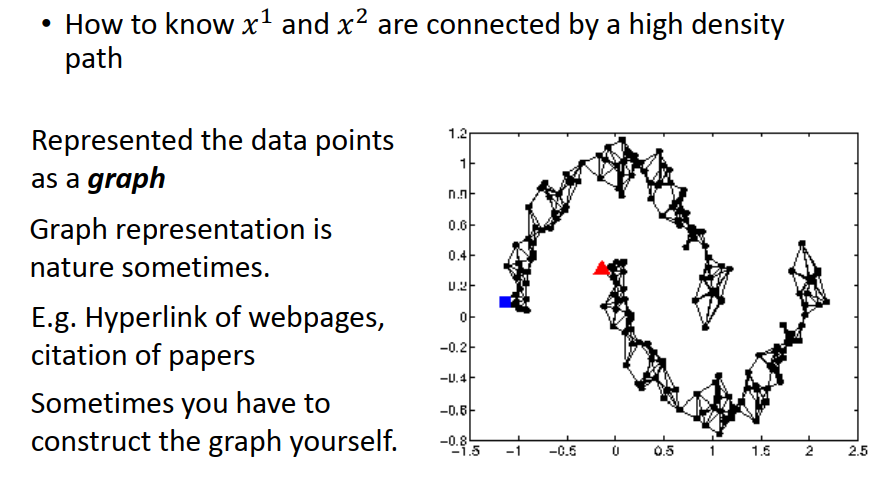
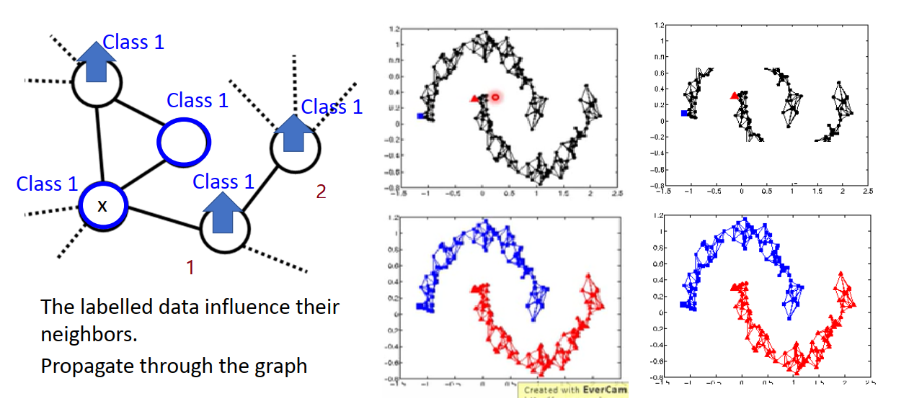

[TOC]

# P23 12: semi-supervised <!-- 60' -->

## Introduction

###  Semi-supervised learning 

什么是 Semi-supervised learning 呢, supervised learning 大家都知道,在 supervised learning 里面,你就是有一大堆的training data,这些 training data 的组成是一个function 的input和function 的output的pair,假设你有R笔training data,每一笔training data里面都有一个x^r^ 代表 function  的input,都有一个y_hat^r^ 代表 function  的output.举例来说在homework 3里面x^r^ 是一张image,y_hat^r^ 是class 的label

那所谓的  **Semi-supervised learning  是什么呢, Semi-supervised learning  是说在label data上面有另外一组unlabel 的data**,那这组unlabel的data,我们这边写成 x^u^ , 这些unlabel的data就只有function 的input,没有output,在这边有U笔unlabel 的data.通常我们在做 Semi-supervised learning的时候,我们期待常见的scenario(假设)是unlabel 的数量 远大于label data 的数量,也就是这边的U是远大于R 的,

其实 Semi-supervised learning 可以分成两种,一种叫做Transductive learning,一种叫做 Inductive learning,其实Transductive learning 和 Inductive learning 我认为最简单的分法就是在做 Transductive learning 的时候,你的  unlabel  data 就是你的 testing set,有人会说这不是用了testing set,这不是cheating 吗,其实不是,你用了testing set label 才是cheating ,你用了testing set feature  不是cheating,因为那笔testing set feature 本来就在那边了,所以你是可以用它的.所以如果你用了 testing  set 的feature 的话,这个叫做Transductive learning,

 Inductive learning 是说我们不把testing set 考虑进来,假设我们在training 的时候,我们还不知道 testing set 会 长什么样子,我们就没有办法事先根据 testing set去做任何事,我们必须要先learn好一个model,等testing set 进来的时候 再去 classificer 他

那至于是用 Transductive learning 还是 Inductive learning depend on现在 testing  set 是不是已经给你了,在有些比赛里面testing set 已经有给你了你就可能可以用它了,不过还是和主办单位确认比较好

但是很多时候你手上是没有 testing set,你要先learn 好model以后,尤其在真正你要用machine learning  application 的时候,并没有testing set在你的手上,你要先learn 好model以后,再等testing set 进来,这个时候就只能做 Inductive learning.

有人会说 Transductive learning 不会算是 Semi-supervised learning,不过我觉得这也算是一种 Semi-supervised learning,只是跟 Inductive learning. 不一样,

### 为什么semi-supervised learning 呢

因为有人常常会说我们没有data,其实我们不会没有data,我们从来不缺data,我们只是缺有label 的data,比如说你要收集image,其实很容易的,我就放一个机器人,每天在路上走来走去,一直拍,一直拍照,就收集到一大堆的image ,只是这些image是没有label的,只有非常少量的image 你才有可能雇人去label,所以label data  很少,但 unlabel data 会很多,所以  Semi-supervised learning 如果你可以利用这些unlabel data 来做某些事的话,会是很有价值的,

事实上,对人类来说,我们人类可能也是一直在做  Semi-supervised learning  ,比如小孩子会从父母那边得到一点点的  supervise  ,比如小孩在路上看到一只狗,他问他爸那是什么,然后他爸说那是狗,他就认得说这个东西是狗,之后他会再看到其他的东西,有狗啊,有猫啊,但是没有人会告诉他说每一个动物是什么,他在他往后的人生里看过很多奇奇怪怪的动物,没有人会去label 那些动物,他必须要自己把它学出来,所以对人类来说我们也是在做  Semi-supervised learning  .

### 为什么semi-supervised learning 有可能会带来帮助呢

假设我们现在要做一个分类的task,我们要建一个猫和狗的 classifier,我们同时有一大堆有关猫和狗的图片,这些图片是没有label 的,并不知道哪些是猫哪些是狗,那今天假设我们只考虑猫和狗有label的data 的话,

假设你今天要画一个boundary,把猫和狗的training data 分开的话,你可能就会想画 line_1,但是假如哪些unlabel data  长的是像灰色的点这个样子的话,这可能就会影响你的决定,所以 unlabel data 虽然他只告诉我们function 的input  但unlabel data 的分布可以告诉我们某一些事.比如说在这个example里面你可能很直觉的就会觉得  boundary 像line_2 这样子.

但是Semi-supervised learning 使用使用 unlabel  的方式往往伴随着一些假设,所以 Semi-supervised有没有用其实就取决于,你这个假设符不符合实际,你这个假设精不精确,因为你可能觉得左下角的图片应该是猫吧,谁知道呢,搞不好这个是狗,他们看起来很像是因为他们背景都是绿的这样子.所以 Semi-supervised learning 有没有用,他不见得永远都是有用的,他depend on 你现在的假设是不是合理

## Outline 

我们这边要讲4件事,第一个我们会讲说在 Generative model的时候,怎么用  .Semi-supervised  learning,然后我们会讲两个还蛮通用的假设,一个是  Low-density 的 Separation Assumption 和 Smoothness Assumption ,最后呢 我们会说Semi-supervised  learning还有一招就是找一个比较好的 Representation ,这个我们会等到讲unsupervised  learning再讲

### Semi-supervised Learning for Generative Model

我们来讲一下在 Generative model 里面你怎么做  .Semi-supervised  learning,我们都已经看过  supervised  learning 的 Generative model,在  supervised  learning 里面你有一堆 training的example ,你知道他们分别属于class 1 还是属于class 2,你会去估测 class 1 和class 2 的prior probability,你会估测P(c_1) ,P(c_2),然后你会估测P(x|c_1) ,P(x|c_2),也就是说假设你假设每一个class 他的分布 都是一个 Gaussian distribution的话,

那你会估测这个class 1 是从mean 是 μ^1^ 和  covariance 是Σ 的 Gaussian 估测出来的, class 2 是从mean 是 μ^2^ 和  covariance  matrix 也是Σ 的 Gaussian 估测出来的,我们之前讲过说通常如果你share Gaussian ,你的performance 可能会是比较好的,那现在有了这些  prior probability,有了这些mean,有了这些covariance matrix你就 可以估测given一个新的data 他是属于C_1 的posterior probabilityP(C_1|x),然后你就可以看一笔data就可以做 classification,你会决定一个boundary 的位置在哪里,

但是今天如果给了我们一些unlabel  的data ,他就会影响你的决定.举例来说如果我们看蓝色圈里的data,假设这些绿色的其实是unlabel data 的话,那如果你的mean和  covariance 是 μ^1^  ,μ^2^ 和 Σ 显然就是不合理的,今天蓝色 Σ 可能应该比较接近于圆圈,或许你在sample 时有点问题,你sample 到比较 奇怪的distribution ,或许他应该比较接近圆形.

而class 2 的 μ^2^ 或许不应该在这边,或许应该在其他的地方 ,或许应该在比较下面一点,等等.而如果你看 prior ?? 的话,你的 prior?? 可能会受到影响,比如说我们本来觉得 ,positive?? 这两个class 的label data 是一样多的,但是看了这些unlabel data 之后你或许会觉得class 2 的 data 其实是比较多的, prior probability 应该是比较大的,总之看了这些unlabel data 以后会影响你对 prior probability  ,对mean,对 covariance 的估测,影响了这些估测就影响了 posterior probability 的式子,就影响了你的 Decision Boundary

### 操作的方式

这个是在直觉上这么做的,但实际上在formulation 上怎么做呢,我们先讲操作的方式,再稍微讲他的原理,这边会讲稍微比较快的带过去,因为也许这个后续大概用不上,因为也不是用 Generative model 做的

#### step 1

step 1 是怎么样呢,我们先计算每一笔unlabel data 的 posterior probability（后验概率）,对每一笔unlabel data x^u^ 我们都去计算P_θ(C_1|x^u^),我们要先初始化一组参数,假设我们做 binary classification ,先初始化class 1 和class 2 的 prior 的几率P(C_1)和 P(C_2),把 μ^1^  ,μ^2^ 和 Σ 初始化,说初始化这个值是怎么来的,你可以random来 ,也可以用已经有label 的data 先估测一个值,总之你就得到一组初始化的参数,我们把这些 prior probability,class dependent 的  μ^1^  ,μ^2^ 和 Σ 统称为参数 θ,根据我们现在有的 θ ,你可以估算每一笔 unlabel data 属于 class 1 的几率,这个几率算出来怎样,是跟你model的值是有关的,算出这个几率以后你就可以去updata  你的model,这个update 的式子,非常的直觉.

怎么个直觉法呢,现在C_1 的 prior probability 怎么算呢,原来如果没有unlabel data 的时候, 你的计算方法可能是N 是所有的example ,N_1 是被标注为C_1的example,如果你要算C_1的 prior probability ,这件事太直觉了,如果不考虑unlabel data  的话感觉就是N_1除以N,但是我们现在需要考虑unlabel data ,那根据unlabel data 告诉我们的资讯 , C_1出现的次数是多少呢, **C_1出现的次数就是所有unlabel data 他是C_1的 posterior probability 的和**,所以unlabel data 并不是hard decide 一定要属于C_1或C_2,而是根据他的  posterior probability  决定他有百分之多少属于C_1,有百分之多少是属于C_2,那你就得到C_1的prior probability ,根据 unsupervised 的 data 可以影响你对C_1的估测,

#### step 2

那  μ^1^ 怎么算呢,原来如果不考虑unlabel data 的时候 ,所谓的   μ^1^ 就是把所有属于C_1的label data 都平均起来就结束了,这个很直觉,如果今天要加上 unlabel data 要怎么做呢,其实就只是把unlabel data 每一笔data  x^u^ 根据他的 posterior probability做 weighted sum,如果这个   x^u^ 他比较偏向于  class 1 ,C_1的话,他对 class 1 的影响就大一点,反之就小一点,就把所有 unlabel data 根据他是 C_1的 posterior probability 做 weighted sum,然后再除掉所有weight 的和,做一个 normalization 就结束了,这件事情几乎不用解释,因为太直觉了,直觉就是这么做的,

#### back to step 1

C_2的 prior probability , μ^1^  ,μ^2^ 和 Σ  也都是同样的方式算出来的,接下来你有了新的model,你就会back to step 1,有了新的model以后,你的几率就是不一样了,几率不一样,在step 2 ,你的model算出来又不一样,然后接下来你就又可以去update 你的几率,就反复反复的继续下去,在理论上这个方法会收敛，可以保证他会收敛,但是他的初始值,就和 gradient descent 一样初始值会影响最后收敛的结果

实事上这个step 1 ,如果你会EM algorithm 的话,step 1 就是E step, step 2 就是M step

### 背后的理论

我们来解释一下为什么这个 algorithm  是这样子做的,虽然这件事情实在是很直觉,但是他背后的理论他为社么要这么做呢,他的想法是这样子

我们原来假设我们只有label data的时候，我们要做的事情是要去maximize 一个likelihood，或者是maximize log likelihood ,意思是一样的,每一笔training data 他的  likelihood , 我们是可以算出来的,如果你给一个θ.每一笔training data 每一笔label data 的 likelihood   是可以算出来的,每一笔data 的 likelihood 就是P(y_hat^r^ )那个class 出现的 prior 根据那个class  Generat 那一笔data 的几率,所以给一个 θ ,可以把  likelihood  算出来,把所有的label data的 log likelihood  加起来就是你的total  likelihood  ,你要去找一个  θ去 maximize  他,solution 是很直觉的,他有一个 closed-form solution  带个式子你就可以把它解出来,

现在如果今天有unlabel data，式子有什么不一样呢, (label data 的部分是和上面是一样的),unlabel data 怎么办呢,unlabel data  并不知道他来自哪一个class,我们怎么估测他的几率呢,我们说一 笔unlabel data x^u^ 出现的几率,我不知道他是从C_1还是C_2来的,所以他就是  C_1和C_2都有可能,所以一笔unlabel data 出现的几率就是他在C_1的 prior probability  和C_ 1 这个class 产生这一笔  unlabel data 的几率 ,加上C_2的 prior probability  乘上C_ 2 这个class 产生这笔  unlabel data 的几率,把他们统统合起来就是这一笔  unlabel data 出现的几率,因为x^u^ 可以从 C1来,可以从C2来,我不知道他从哪里来,所以你就说他两个都有可能.接下来你要做的事情就是去maximize log L(θ) ,不幸的是log L(θ) 不是 combias?? 的,所以你解他的时候你变成要用 EM  algorithm ,其实你就是要 iteratively 去 solve 他,

所以我们刚才做那个步骤,在前一页投影片里面那个 algorithm ,他做的事情就是在每一次循环的时候,你做完 step 1,做完 step 2 你就让可以  log L(θ)  likelihood   增加一点,跑到最后他会收敛在一个local minimum 的地方

### Semi-supervised learning low-density Separation

这个是   Generative 的model ,我们接下来要讲一个比较 general 的方式,这边基于的假设是 low-density 的 Separation,也就是说这个世界是**非黑即白**的,什么是非黑即白呢,非黑即白意思就是说假设我们现在有一大堆的data,有label data,有unlabel data,在两个class 之间他们会有一个非常明显的鸿沟,也就是说现在如果给你这些 label data (蓝色的点),给你这些label data (橙色的点),可以说  boundary 要切在左边红线的位置也可以,  boundary 要切在右边红线的位置也可以,也就是可以把这两个class 分开,他们在training data 上的正确率都是100 %,但是如果你考虑 unlabel data 的话,或许左边的 boundary  是比较好的,右边的 boundary  是比较不好的,为什么呢,因为这边基于的假设就是这个世界是一个非黑即白的世界,在这两个class 之间,会有一个很明显的楚河汉界,会有一个鸿沟,会有一个地方,他之所以叫  low-density Separation,意思就是说在这两个class的交界处他的  density 是低的,这两个class 的交界处data 量是很少的,不会出现data,所以左边的  boundary 可能 就是比合理,

####  Self training

low-density Separation 最具代表性的简单方法就是 Self training,Self training 太直觉了,我觉得没什么好讲的,我相信大家都是秒 implement(实施) 这样子,  Self training 就很快的讲过去, Self training 就是说 我们有一些 label data,有一些unlabel  data ,

接下来先从 label data 去 train 一个model,这个model 叫做f^*^ ,这边其实你training 的方法,这种training 其实是很  general 的方法,你用什么方法得到你的f^*^,你是用 neural network ,你是用 deep 的方法, shallow 的方法,还是其他machine learning 的方法 都可以,反正你就是 train 出一个model  f^*^, 根据这个 f^*^ 你去label 你的unlabel data, 你就把x^u^ 丢进 f^*^ 看他吐出来 的 y^u^ 是什么,就是你的label data,这个东西叫做 Pseudo 的label ,

接下来你要从你的 unlabel data set 里面拿出来一些 data ,把它加到 label data set 里面,至于哪些 data 要被加进去就是一个open question,自己design 一些  heuristic(探索性) 的rule ,自己想个办法来解决,甚至可以给每一笔  unlabel data provide weight,有一些Pseudo label 比较 confidence,有一些 Pseudo label 比较不 confidence,

有了更多的label data 以后,现在label data 从unlabel data那边得到额外的 data,就可以回头再去train 你的model f^*^,这件事情 非常的直觉,

#### 我们用在 Regression 上面会怎样

Self learning 这么简单你可能觉得自己非常的懂,那我来问大家一个问题,以下这个 process 如果 我们用在 Regression 上面会怎样,当然你永远可以把  Regression  用在这边没有问题,你的程式也不会 segmentation fault (记忆体区段错误),问题就是这一招在 Regression  上面你觉得有可能会有用吗,

Regression  大家知道就是output 一个数字,output一个 real number ,你有一个  x^u^ ,你output一个 real number  ,你把这笔data 加到你的 training data  再train ,你会影响  f^*^ 吗,其实不会影响 f^*^,**所以 Regression   不能用这招,**

#### Self training Similar to semi-supervised learning for generative model 

你可能会觉得刚才这个 Self training  很像是我们刚才在 Generative model 里面用的那一个方法,他们唯一的差别是在做  **Self training** 的时候你用的是hard label ,在做  generative model 的时候你用的是 Soft label,在做 Self training 的时候我们会强制  a sign 一笔 training data他一定是属于某一个class ,但是在**generative model**的时候,  我们说根据他的 posterior probability, 他有一部分 属于class 1 ,有一部分属于 class 2, **所以一个是  Self training 是hard label ,Generative model  的时候我们用的是Soft label,**

到底哪一个比较好呢,如果我们今天考虑 的是 neural network 的话,你可以比较看看到底哪一个方法比较好,假设我们用的是 neural network,那你从你的label data 得到一组**neuron的 参数 θ^*^** ,现在有一笔unlabel data   x^u^ , 然后你说根据我们现在手上有的参数  θ^*^ **,把它分成两类,他有0.7 的几率属于 class 1, 有0.3 的几率属于 class 2,** 如果是 hard label 的话,你就把它直接label  成 class 1,因为他变成class 1了嘛,所以 x^u^ 新的target ,就是你拿x^u^ 再train neural network 的时候 **,他的target 就是第一维是1,第二维是0**,或者是你就拿这个东西和你 neural network 的output 拿去算 Cross entropy,如果是做 soft的话,那你就说70% 属于class 1 ,30% 属于**class 2,然后你就说新的target就是[0.7,0.3]**,如果我们今天用的是 neural network 的话,上面和下面 哪一个方法有可能是有用的呢

比较多人觉得下面的方法完全不会有用,为什么他完全不会有用呢,你仔细想想看,你现在model的output 在这边unlabel data上用这个主参数output 0.7,0.3,你说你把他的 target 又设成 [0.7,0.3],**那不就是同一组参数就会做到一样的事情吗**,所以如果你是做 neural network 的时候,你用一个 soft 的 label ,结果是没有用的,所以**这边你一定要用 hard 的label**,当我们用  hard 的label 是什么意思呢,我们用hard label 的时候我们用的就是 low-density Separation 的概念,

也就是说今天我们看 x^u^  ,他属于 class 1 的几率只是比较高而已,我们没有很确定 他一定属于 class 1 ,但是这是一个 非黑即白的世界,所以如果你看起来有点像class 1 ,那你就一定是 class 1 ,所以本来根据我的model是说几率是0.7 是class 1 ,0.3是class 2,那用 hard 的label ,用 low-density Separation ,就改成说他是class 1 的几率是1,就把他往class1 那边推过去,他就完全不可能是属于class 2

下面这个方法不会work ,之前还有看过有paper suppose在做 neural network 时候用一个什么soft的方法,果然 performance 不work ,不用做seaborn 我就知道结果会怎样,

#### Entropy-based Regularization

那刚才这一招有一个进阶版,叫做 **Entropy-based Regularization,**你可能会觉得说直接一看他有点像1就直接变1 ,直接有点像class2 就变2,有点太武断了,那你可以用 Entropy-based 的这个方法,Entropy-based 这个方法是说如果你用 neural network 的时候，你的output 是一个distribution,那我们不要限制说这个output 一定要是class 1 ,一定要是class 2 ,但是我们做的假设是这样,**这个 output  distribution 他一定要很集中**,因为这是一个非黑即白的世界,所以 output distribution 一定要很集中,

也就是说如果你 output ,假设我们现在做5个class 的分类,如果你的output 都是在class 1 的几率很大,在其他class 的几率都很小,这个是好的,因为是unlabel data,所以我不知道他的label 是什么,但是如果你的model可以让这一笔data在class 1 的output几率很大,在其他几率很小,那是好的,如果他在class 5 的几率很大,其他几率都很小,这个也是好的,因为我也不知道他是class 1 还是class 5,所以集中在class 1 或者class 5 是好的,什么状况不好呢,如果今天分布是很平均的话,这样是不好的,因为这是一个非黑即白的世界,这样子不符合  low-density Separation  的假设,

但是现在的问题就是我们要怎么用数值的方法来 Evaluate 这个 distribution 到底是好还是不好,这个 distribution 是集中的还是不集中的呢,这边要用的东西叫做  Entropy,也就是算一个 distribution  的 Entropy **,这个 distribution  的 Entropy  告诉你说这个  distribution  到底是集中还是不集中,**我们用一个值来表示这个 distribution  是集中的还是分散的
$$
𝐸(𝑦^𝑢 )=−∑_{(𝑚=1)}^5{𝑦_𝑚^𝑢 𝑙𝑛(𝑦_𝑚^𝑢 ) }
$$
这个怎么算呢,这个就算你没有修过   information theory之类,我相信你也是听的懂的,记一下他的式子,他的式子如上式,某一个 distribution   他的 Entropy  就是 负的他对每一个class 的几率,有五个 class ,submission 1到5,他对每一个class的几率乘上log 那一个class的几率,

所以如果我们今天把第一个 distribution  的几率带到上面的公式里面去,他只有一个是1 ,其他都是0,那你得到的 Entropy 是多少呢,你得到的 Entropy 算出来会是0 ,因为 1* log 1 是0,0*log0 也是0,所以就是0 ,没有什么特别好讲的,分类都是 class 5 的  Entropy 也是0,下面这一个这边每一个几率,也就是这边每一一个 $y_m^u $ 都是 1/5,就把这些 1/5 的值都带进去, 算出来就是 (-ln(1/5)) ,也就是ln 5,所以最后一张图,每个class 都有均匀分布的 Entropy  比较大,他是散布比较开的,属于一个class 的 Entropy  散布比较窄,所以他的 Entropy   比较小,

我们需要做的事情是,我们希望这个model 的output ,当然在label data 上他的分类要正确,但是在unlabel data 上他的 output  Entropy   要越小越好,所以根据这个假设,你就可以去重新设计你的 loss function ,我们原来的loss function 是说,我希望找一组参数,**让我现在在label data上的 model output 和正确的model 的output 他的距离越近越好,**你可能用 cross  Entropy 来evaluate 他们之间的距离,这个是label data 的部分

**在unlabel data 的部分,你会加上每一笔 unlabel data,他的output distribution  的Entropy,你会希望这些 unlabel data 他的 Entropy 越小越好,**在这两项中间你其实可以乘一个weight 来考虑说你要偏向unlabel data多一点还是少一点,那在training 的时候怎么办呢,在training 的时候就是一句话就是 train 下去 ,loss  可以算微分,可以算微分就没有什么问题,用  gradient descent 来 minimize 这一个式子,

这一件事情他的角色就很像我们之前讲的 Regularization,所以他称之为  Entropy-based Regularization ,之前我们说 Regularization 的时候我们在原来的 loss function 后面加 一个 perimeter 的1norm 或者2 norm ,让他比较不会overfitting ,现在加上一个 根据unlabel data 得到的Entropy 来让他比较不会over fitting,

#### Outlook: Semi-supervised SVM

还有别的 Semi-supervised learning 的方式,有一个很著名的叫做  Semi-supervised SVM,不过我们还没有讲 SVM, 所以这边就是当作一个outlook,这个 Semi-supervised SVM 他的精神是这样的,我们知道SVM做的事情就是，给你两个class的data ,然后让你找一个 boundary,这个 boundary **一方面要有最大的 margin,**所谓最大的margin 就是让这两个class 分的越开越好,同时呢他也**要有最小的分类的错误,**

那现在假设有一些unlabel 的data , 这个Semi-supervised SVM 会怎么处理这个问题呢,他会穷举所有可能的label,就是这边有4笔unlabel data ,每一笔他都可以是属于class 1也可以属于 class 2,穷举他所有可能的label,他可以是长右边第一张图的样子, 就是说红线左边是属于蓝色class ,红线右边是属于橙色class;可以长成右边中间图的样子,右边两个灰色为蓝色class ,左边两个灰色为橙色class;也可以长成 右边下边图的样子.左右都有蓝色和橙色的class ...有各种可能,有很多个可能,然后对每一个可能的结果你都去做一个SVM，

在右边第一张图的可能的情况下，SVM 的 boundary 为红线的位置,第二张图的可能的情况下, boundary 切在红色线的位置;右边下图的分布可能 SVM的 boundary 不得不切在红线的位置,因为找不到一个方法可以把两个class 分开,然后再去看说哪一个 unlabel data 的可能性,在穷举所有可能的label 的里面,哪一个**可能性可以让你的 margin 最大,同时又 minimize error,**今天在这个example 里面,可能是右边中间图可以让你的margin最大,上边图的 margin 小,下边图的 margin 不止小还有分类错误, 中间的margin  大,又都分类对,所以你可能最后就选择中间图的  boundary 

你可能会有一个问题说,穷举所有的 unlabel data 的label ,听起来不make sense(合理),我有1W笔unlabel data,有 2^10000^ 可能 ,没办法做,所以这个paper 里面就提出一个 approximate 的方法, 基本的精神是,一开始得到一些label ,然后你每次改一笔unlabel data 的label .看可不可以让你的 objective function  变大,变大的话就改这样子,

### Semi-supervised Learning -Smoothness Assumption 近朱者赤，近墨者黑

接下来我们要讲的方法是叫做  Smoothness Assumption,他的精神就是**近朱者赤近墨者黑**,或者是像劝学篇说的"蓬生麻中,不扶而直;白沙在涅,与之俱黑 "

他的假设是这样子, **如果x是像的，那他们的label y 也就像**,这个假设听起来没有什么,而且光讲这个假设其实是不精确的,因为你在一个正常的model,你给他像的input ,如果他不是很 deep 的话,本来output就会很像,所以这个这样讲其实是不够精确的,

**真正精确的假设,**应该是下面这个讲法,**X的分布是不平均的，他在某些地方是很集中，某些地方又很分散，如果今天x^1^和x^2^,他们在一个 high density region(高密度区域) 很close 的话,那x^1^ 的label y_hat^1^  和 x^2^ 的label y_hat^2^ 他们才会很像,**这句话有点让人不知道在说什么,什么叫在 high density 的region 很像呢,这句话的意思就是说他们可以用  high density 的path 做 connection(关系) ,这样讲你还是不知道我在说什么,

所以我们直接举一个例子,假设这个蓝色的图是我们data 的分布,他的分布就像一个血轮眼的样子,那假设我们现在有三笔data, x^1^ ,x^2^  和x^3^ ,如果我们只是考虑这个比较粗的假设,说像的x他的  output 像,那他的label 像,所以感觉好像应该是 ,x^2^  和x^3^ 的label 应该比较像,但 x^1^和x^2^ 的label 比较不像,但是其实  Smoothness Assumption 的假设不是这样,他更精确的假设是说你的像要透过一个  high density 的region 像,就是说 x^1^ 跟x^2^  他们中间有一个 high density 的 region ,他们中间有很多很多的data,所以他们两个相连的地方,是通过一个  high density 的path 相连的,你从x^1^走到x^2^ 中间都是点,都是人烟, 然后x^2^  和x^3^ 中间没有点所以你走不过去,这样懂我的意思吗,

假设蓝色的点是聚落的分布的话,x^1^ x^2^ 中间是平原,所以人很多, 所以x^1^ 其实走到x^2^  比较容易,x^2^  和x^3^ 中间是有个山.所以这边没有住人,所以走不过去,所以根据这个真正的  Smoothness Assumption的假设,他要告诉我们的意思是说, ,**x^1^ 和x^2^ 是会有比较可能有一样的 label ,**x^2^  和x^3^ 比较可能有不一样的label ,因为他们中间呢没有 high density  的path,

那为什么会有 Smoothness Assumption 这样的假设呢,因为在真实的情况下,这个假设很有可能是成立的,比如说我们考虑手写数字辨识的例子,你现在看到这边有两个2 ,这边有一个3, 对人来说你当然知道左边的两个都是2 ,但如果你单纯算他们的pixel上的相似度的话,搞不好两个2 其实是比较不像的, 中间的2 和3 搞不好是比较像的,第一个2 有一个圈圈,第二个2没有圈圈;第二个2 有一个钩钩,3 有一个这样的钩钩;看第二个2 和3 搞不好还比较像,第二个2 再稍微弯曲一点就变成3了,所以他们搞不好还比较像,

但是如果你把你的data 统统倒出来的话,你会发现第一个2 和第2 个2 中间,他们有很多连续的形态,就是第一个2 稍微变一下变成1-2 的2 ,变一下变成1-3 的2这样子,第一个2和第二个2中间有很多连续的变化,所以可以从这种生物(第一个2)演化成这种生物(第二个2),但是第二个2 没有办法演化成3,因为中间没有过度的形态,**所以他们中间有很多不直接相连的相似,**中间有很多 step stone ,可以让他这样跳过去,所以如果根据 Smoothness Assumption 的话 ,你就可以得到第一个2 和第二个2 是比较像的;第二个2 和3 中间没有过渡的形态,所以他们其实是比较不像的,他们其实不应该是属于同一个class , 两个2 其实应该属于同一个class,

那如果你看人脸辨识的话其实也是一样的,一个人如果从他的左脸照一张像,和右脸照一张像,差很多,你拿另一张一样是眼睛朝左的相片来比较的话,比左侧脸和右侧脸比较时更像,但假设你搜集得到够多的unlabel data 的话,你会找到两张侧脸之间有很多过度的形态,所以左侧面脸和右侧面脸可能是同一个人的脸,

或者是这招在文件分类上面可能是会非常有用的,为什么呢,假设你现在要分天文学和旅游的文章,天文学的文章有一个他固定的 word distribution  ,比如说他会出现 asteroid ,或出现bright ,如果旅游的文章他可能会出现 Yellowstone 啊,等等,那如果今天你的unlabel data 和你的label data 是有over overlap(重合)的,你就很容易可以处理这个问题,但是在真实的情况下,你的label data 和 unlabel data他们中间可能没有任何 overlap 的word,为什么呢,因为世界上的word 很多,一篇文章里面你往往你的词汇不会太多,但世界上可能word 很多,所以每一篇文章它里面的词汇其实是非常 sbus??的 , 他只提到非常少量的word ,所以你拿到两篇文章出来,他们中间有重复的word 比例其实没有那么多的,所以你很有可能你的label data 和你的unlabel data中间是没有任何overlap 的.

但是如果你 collect 到够多的unlabel data 的话,你就可以说 d_1 和 d_5像,d_5又和d_6像,这个像就可以一路propagate(繁衍) 过去,你就会知道说d_1和d_3 一类,d_2和d_9像,d_9和d_8像,就会得到d_2和d_4像,这个像也可以propagate过去

那如何实践这个  Smoothness Assumption  呢,最简单的方法是Cluster(集群)label ,这个方法太简单了,没什么可讲的,我们现在data  distribution 长这个样子,橙色是class 1 ,绿色是class 2,蓝色是unlabel data,接下来你就做一下 Cluster,你把这些所有的data拿来做 Cluster,你可能就分成3 个Cluster, 然后呢你就看说 Cluster 1 里面 class 1 的label data 最多, 所以Cluster 1 里面所有的data 就都算 class 1 , Cluster 2 和 Cluster 3 就都算 class 2 ,就结束了,就把这些data拿去learn 就结束了,

那这个方法不一定有用,尤其是在作业3 里面,你可以 implement(实施)这个方法,如果你今天要做 Cluster label ,你这个 Cluster  要很强,因为这一招work 的假设就是你可以把同一个class 的东西 Cluster 在一起,可是在image 里面你要把同一个 class 的东西 Cluster  在一起,其实是没那么容易的,我们在前面的投影片讲,为什么要deep learning 的时候,我们有讲过说不同的class可能会长得很像,同一个class 可能会长得不像,你单纯只用pixel 来做 Cluster  ,你结果八成是会坏掉的,你没有办法把同一个 class 的data Cluster  在一起,那unlabel data 没有帮你做出来就坏掉了,

所以如果你要让 Cluster label 这个方法有用,你的 Cluster  要很强,你要有很好的方法来描述你的一张image,在我们自己试的时候我们会用 deep Auto-encoder,我们是用  deep Auto-encoder 抽feature ,然后再做  Cluster  ,这样才会work,如果你不这样做的话,我觉得应该是不会work 的,但是你还是可以直接用pixel 做 Cluster 就是了

### Graph-based Approach

刚才讲的是比较直觉的做法,另外的方法是引入 graph structure,**我们用graph structure 来表达 connected by a high density path**这件事情,就是说我们现在把所有的data point 都建成一个 graph ,每一笔data point x 就是图上的一个点, 你要想办法算他们之间的similarity，你要想办法把他们之间的edge建出来,有了这个 graph 以后呢,你就可以说所谓的  high density path 的意思就是说,**如果今天有两个点,他们在这个 graph 上是相连的,是走得到的,他们就是同一个class ,如果没有相连 ,就算是实现上距离也不算太远,那你也走不到,**

那怎么建一个graph 呢,有些时候呢,这个 graph 的 representation 是很自然就可以得到的,举例来说假设你现在要做的是网页的分类,而你有记录网页和网页之间的 hyperlink ,hyperlink 自然的就告诉你这些网页间是如何连接的,;或者一些要做的是论文的分类,而论文和论文之间有引用关系,这个引用的关系也是另外一种 graph 的 edge,他也可以很自然的把这种图画出来给你

但有时候你需要自己想办法建这一个 graph ,怎么自己想办法建这个graph呢,这个graph 的好坏对你的结果影响是非常的 critical(关键) 的,不过这个地方就非常的 heuristic(探索) ,就是凭着经验和直觉,觉得你怎么做比较好,就选择你觉得爽的方法做就是了.

1. 那通常的做法是这个样子,你要先定义两个 object 之间, 你怎么算他的相似度,影像的话你可以base  on pixel  算相似度,performance 不太好,如果你base on auto_encoder  抽出来的feature 算相似度,那可能performance 就会比较好,
2. 算完相似度以后你就可以建graph 了,  graph 有很多种 ,比如说你可以建  K Nearest Neighbor 的 graph ,所谓 K Nearest Neighbor  的graph 意思是说我现在有一大堆的data,data 和 data之间我都可以算出他的相似度, 我就说 K Nearest Neighbor 设 k=3 ,那每一个point 都和他最近的相似度最像的3个点做相连,
3. 或者你可以做  e-Neighborhood , e-Neighborhood是什么意思呢,是说每一个点只有和他相似度超过某一个 threshold ,跟他相似度大于1的那些点才会被连起来,这都是很直觉的,

那所谓的 edge 也不是只有相连和不相连这样 binary 的选择而已,你可以给edge一些weight，你可以让你的edge跟你的要被连接起来的两个data point之间的相似度是成正比的,怎么定义这个相似度呢,我会建议比较好的选择其实是用 RBF function 来定义相似度

那怎么算这个function 呢,你可以先算 x^i^ 和 x^j^ ,如果你都把他们用 vector 描述的话,算他们的 Euclidean Distance(欧几里得距离),前面乘一个参数,,然后乘一个负号再取 Exponential,其实取 Exponential 这件事情是我觉得还满必要的,在经验上用这样的function 可以给你比较好的 performance ,

为什么 用这样的function 会给你比较好的 performance 呢,因为如果你想想看这个function ,他的下降的速度是非常快的,因为他有取  Exponential ,所以只有当  x^i^ 和 x^j^ 非常靠近的时候,他的这个 similarity 才会大,只要距离一稍微远一点, similarity 就会下降的很快,就会变得很小,也就是说如果你用这种 RBF function  的话,你才能够制造说,在右下角的图上,这边有两个橙色的点距离很近,这有一个绿色的点,其实他和橙色的点的距离也蛮近,只是稍微远一点,但是你用这种 Exponential 的话,每一个点都只和非常近的点连,他和稍微远一点他就不连了,你要有这样子的机制,你才可以避免连到这种跨海沟的这种link, 所以如果你用 Exponential  通常效果会是比较好的.

### Graph-based Approach的精神

那 所以Graph-based的方法,他的精神是这样子,如果我们现在在这个graph 上面 我有一些label data，比如在左图我们已经知道蓝色的圈是属于class 1 ,那跟他们有相连的那些data point 他是属于class1 的几率也就会上升, **每一笔data他去取影响他的邻居，**光是会影响他的邻居是不够的,如果你只是考虑光会影响他的邻居的话,其实可能帮助不会太大,为什么呢,因为如果说他们相连就代表他们本来就很像,你train 一个model ,input 很像的东西,output本来就很像得东西,所以帮助不会太大,

那Graph-based Approach  真正会有帮助他的鹈鹕位?? 就是他的class是会传递的，也就是说本来只有点1 和class 1 相连,所以他会变得比较像class 1,但是这件事情会像传染病一样传递过去,所以点 2 ,虽然他没有真的和任何真正是class 1 的点相连,但是因为像class 1 这件事情会是感染的, 所以这件事情也会透过 graph link传递过来,

所以举例来说如果我们看 右上图,你把所有的data point 都建成一个graph ,当然这个是比较理想的例子,然后你有一个蓝色的点,label 一笔data 是属于 class 1 , label 一笔data 是属于 class 2,经过 Graph-based Approach ,如果你的 graph 是建的这么漂亮的话,上半部分会统统都是蓝色., 下半部分就会统统都是红色,虽然红色有一部分的尾巴没有接在一起,但是红色这个class的这一件事情会一路 propagate 过去,

如果你要让 Graph-based  这种  Semi-supervised的方法有用,你的一个  critical 一定要data要够多,如果你的data不够多,右上角图的上侧没收集到data,这个点断掉了,那你这个  infomation  就传不过去了,

#### 定量的使用Graph-based 

刚才是定性的说一下 怎么使用这个Graph,接下来是要说怎么定量的使用这个Graph,这个定量的使用方式是,我们在这个 Graph 的structure上面定义一个东西叫做  label 的 smoothness ,我会定义说今天这个label 有多符合我们刚才说的那个Smoothness Assumption 的假设,

那怎么定义这个东西呢,如果我们看这两个例子,在这两个例子里面都有四个 data point ,那data point 和data point 之间连接的数字,代表了edge 的 weight ,左边和右边这两个graph 是一样的,但是我们现在给每一个data  不同 的label,假设在左边的graph 里面,你给他的label 是(1,1,1,0),在右图的example 里面给他的label 是(0,1,1,0),

那谁比较  Smoothness  呢,多数人都觉得左边比较 Smoothness ,大家的看法其实是非常一致的,左边三角形的地方都是1,y^4^ 是0,右边三角形的地方有0有1,y^4^ 是0,,感觉比较不符合  Smoothness Assumption 的假设,左边比较符合

但是我们需要用一个数字来定量的描述他说,他有多 Smoothness ,常见的做法是你写一个式子,这个式子你可以这样写,我们考虑有相连的point ,两两拿出来 ,summation over 所有的data pair i,j,然后呢我们计算i,j 之间的weight ,和i 的label 减掉j  的label 的平方,这边是 ,summation over 所有的data,不管他现在是有label 还是没有label,

所以如果你看左边这个case,三个都是(1-1)^2^ 是0,只有(y^3^ - y^4^)是 (1-0)^2^ 是1,所以你在 summation over 所有的data pair 的时候,只需要考虑 x^3^ 和  x^4^ 这个pair,(y^i^ - y^j^)^2^ 是1,w_i,j 是1,再除以2,除以2 这件事情只是为了等一下做某一个计算会比较方便,其实没有什么真正的效用,最后得到的 Smoothness  有多 Smooth 的 evaluation 呢,就是0.5,右边这个case根据这个定义算出来的 Smoothness  等于3,所以这个值越小越 Smooth,所以你会希望你得出来的label 根据这个Smoothness 的定义他算出来越小越好

其实可以很快告诉大家一件事, 求 Smoothness  的式子可以整理一下写成一个比较简洁的式子,怎么写呢,我们把y串成一个vector,现在y是包括label data ,也包括unlabel data ,每一笔 label data 和unlabel data  都吐一个值给你,所以你现在有R+U个 dimension ,串成一个 vector 就写成 **y** = [...y^i^ ...y^j^ ...]^T^ ,用粗体字来表示一个 vector ,如果你这样写的话  Smoothness 的定义式子可以写成 **y**这个 vector 的 transpose乘上一个  matrix 叫做L,再乘上**y**. 因为**y**  的 dimension  是 R+U,所以这个 L是一个  (R+U)x(R+U) 的 matrix ,这个L是有名字的,叫 **Graph Laplacian,** Graph Laplacian 就是指这个 L ,就是他的名字,这个L的定义是什么呢,他写成两个matrix 的相减,就是 **L= D-W,**

我们想想看W是什么,W就是你把这些data ponit  两两之间的weight 的connection 的关系建成一个 matrix  ,就是W,这边4个row ,和4个colour 分别就代表了data x^1^ 到x^4^ ,也就是说你现在 x^1^ 到x^2^ 之间 connection  的weight 是2,那(1,2)这边就是2,  x^1^ 到x^3^ 之间 connection 的weight 是3, 那(1,3)就是3,以此类推,就建出一个  matrix W.

D是什么呢,D是这样的,你把W的每一个row合起来,第一个row 2+3合起来放在 diagonal (对角)的地方变成5,2+1合起来变成 3 ,3+1+1变成5,1变成1,然后把这些合起来的值放在 diagonal 的地方就是D,然后你把  D-W 就得到 Laplacian,再把它放在这边(第一个式子),左边的式子就会等于右边的式子,你可能没有办法一下子看出来为什么左边的式子等于右边的式子,这个证明其实很无聊,你回去把Smoothness  的式子展开,你就知道左边其实是等于右边的,

所以我们现在知道这一件事情了,我们可以用**y^T^ Ly**来 evaluate 我们现在得到的label有多  Smooth,那在这个式子里面我们会看到有**y**,那这个y是label,这个label的值,也就是这个 neural network output 的值是取决于你的 network 的 parameter 的,所以这一项(第一个式子的右边)其实是network 的Depend,所以你要把graph 的information 考虑到neural  network 的training 的时候,你要做的事情其实就是在原来的loss function 里面加一项,你原来function 比如说是考虑**cross  entropy** 之类的,你就加另外一项,**加这一项是 Smoothness 的值,乘上某一个你想要调的参数λ,后面这一项他其实就象是一个 regularization term,**你不止要调你的参数,让你的neural network 在那些 label data 的output 和真的label 越接近越好,你同时要做到说,你output 的这些label ,不管是label data 还是unlabel data 上面,他都符合 Smoothness Assumption 的假设,Smoothness Assumption 的假设是由这个S 所衡量出来的,所以你要同时minimize Loss function 前面一项,也要同时  minimize  后面一项,你可能会说这件事怎么做,这件事没有什么好讲的,你就算一下他的  gradient,然后 做 gradient descend 就可以了,

其实你要算 Smoothness 的时候不一定要算在output 的地方,如果你今天是一个deep neural network 的话,你可以把你的 Smoothness 放在 network 的任何地方,你可以假设你的output 是 Smoothness  的,你也可以同时说我把某一个 hidden layer 接出来再乘上一些别的 transform ,他也要 Smooth,你也可以说每一个 hidden layer 的output 都要是 Smooth 的,都可以,可以同时把这些 Smooth 统统都加到 neural network 上面去

### Better Representation-去芜存菁，化繁为简

最后一个方法是 Better Representation,这个方法的精神就是  **去芜存菁，化繁为简**,这个部分我们会等到 unsupervised learning 再讲,他的精神是这样,我们会观察到的世界其实是比较复杂的,在我们观察到的世界的背后其实有一些比较简单的vector ,比较简单东西来操控我们复杂的世界,所以你只要能够看透这个世界的假象,直指他的核心的话,就可以让training 变得比较容易,

举例来说这个图是出自[神雕侠侣]的图,杨过手上拿一个剪刀,杨过和凡雍打的时候他说我可以在三招之内就减掉你的胡子,大家都不相信,杨过后来就真的在三招之内减掉他的胡子,为什么呢,因为杨过观察到胡子只是假象,虽然胡子的变化是比较复杂的,但是胡子是受到头操控的,头的变化是有限的,只要看透这件事情以后,他就可以把胡子减掉,所以凡庸的胡子就是observation,而他的头就是你要找的 Better Representation,