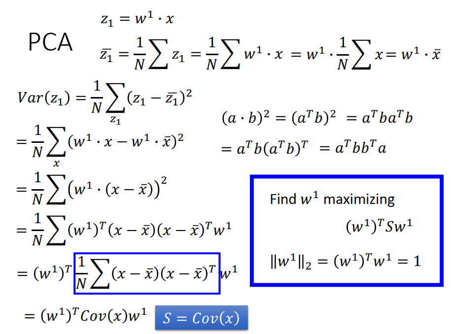
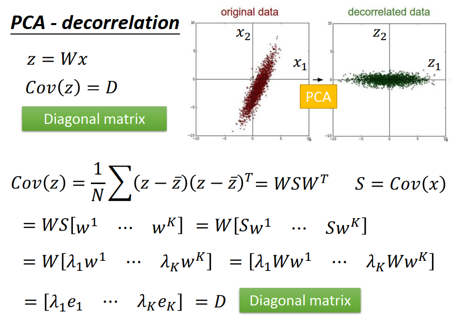

[TOC]

# P 24 13: unsupervised-learning -linear Methods <!-- 100' -->

##  unsupervised-learning

### Dimension Reduction

我把 **Dimension Reduction**(维数缩减)  分成两种,那一种做的事情叫做**化繁为简**,他可以**分成两大类,一种是做 Clustering ,一种是做  Dimension Reduction ,**

所谓的**化繁为简**意思是说,你现在有很多种不同的input,比如说你现在找一个function ,他可以input 看起来像树的东西,output都是抽象的树,也就是把本来比较复杂的input变成比较简单的output,在做 unsupervised learning的时候,你只会有function 的**其中一边**,比如说我们要找一个function 他可以把所有的树都变成抽象的树,但是你所拥有的training data,就只有一大堆的image,一大堆的各种不同的image,你不知道他的output 应该要是长什么样子,

### Generation

那另外一个  unsupervised learning 可以做的事情是**Generation,也就是无中生有,**做的事情是这样,我们要找一个function ,这个function你**随机给他一个input,**比如给他一个random number,也就是输入一个数字1,然后他就output第一颗树,输入数字2 就output另外一棵树,输入数字3就output 另外一颗,这样子,你输入给他一个 random number 他就自动的画一张图出来,**输入不同的number 给他,他画出来的图就不一样**,在这个task里面,我们要找的这个可以画图的function ,你只有这个function 的 output,但是你没有这个function 的 input ,你就只有一大堆的image,但是你不知道输入什么样的code,才可以得到这些image,

在这一份投影片我们先 focus 在  Dimension Reduction 这一件事情上,而且我们只  focus  在  linear的Dimension Reduction

## Clustering  聚类

### Clustering  

那我们先来说一下**Clustering** ,什么是 Clustering 呢, Clustering 就是说,这个太直觉了,其实也没什么好讲的,有一大堆的image,假设我们现在要做image 的 Clustering ,然后你就把他们分成一类一类一类的,之后你就可以说(左下边的一堆猫)这边都属于 Cluster 1, (右下边的一堆狗)这边都属于 Cluster 2,(上边的一堆鸟)这边都属于 Cluster 3,就是给他们贴标签的意思,这样你就把本来有些不同的image ,但是都用同一个 Cluster 来表示,做可以到**化繁为简**这一件事情,

这边**最 critical 的问题是到底应该要有几个Clustering ,**这个东西没有什么好的方法,这个就像neural network 要几层一样是,是 empirical 的去决定你需要几个 Cluster ,你当然不能太多,比如说你多到说,这边有9张image,你就有9个 Cluster ,那你干脆就不要做 Cluster 就好了,每张image 自己一个 Cluster ,这样有做和没有做意思是一样的,或者是你说我全部的image 都 Cluster 成,我只有一个 Cluster ,所有的 image 都放在同一个 Cluster  里面,那有做和没有做一样.但是要怎么选择适当的 Cluster ,这个就要  empirical  的来决定他,在 Clustering 方法里面,最常用的叫做  K-means,很快的讲一下 K-means 是怎么做的,

#### K-means

K-means 就是这样,我们有一大堆的data,他们都是 unlabel ,有一大堆的data, x^1^一直到 x^N^,这边每一个x 他可能就代表一张image,我要把它做成 K个 clusters,怎么做呢,

1. **我们要先找这些  cluster 的center,**假如这边每一个 object 都是用一个 vector 来表示的话,这边的这些  center 也是一样长度的  vector ,那我们每一个 cluster 都要先找一个  center, **有K 个  cluster ,我们就需要 c^1^ 到c^K^ 个  center,**那这些center初始的 center怎么来呢,你可以**从你的 training data里面,就随机的找K 个  object**  出来,就是你的K个  center,
2. 接下来你要对所有在  training data 里面的x 都做以下的事情,都做什么事情呢,**你决定说现在的每一个object  属于1到K的哪一个cluster ,**假设现在你的 object x^n^ 和第i个  cluster  的 center 最接近的话,**那 x^n^  就属于  c^i^**  ,那我们用一个  binary  的value b~i~^n^ 来代表第n个 object 有没有属于 第i 个  cluster ,如果第n个 object 属于 第i 个  cluster 的话, 这一个 binary  的value  b~i~^n^ **就是1,反之就是0**
3. 接下来你要update 你的  cluster,怎么 update你的 cluster呢,这个方法呢,也是很直觉,假设你要 update 第i 个 cluster 的 center ,你就把所有属于第i个 cluster 的 object 统统拿出来做平均,你就得到第i 个 cluster 的center,然后你要反复的做,

这边之所以在做 initialization 的时候你会想要直接从你的 data base  里面去挑 k 个object 出来做 center ,**有一个很重要的原因是假设你是纯粹随机的,你不用从 data point 里面去挑的,你很有可能在第一次 assess 这个 object 的时候就没有任何一个example 跟某一个 cluster 很像**,你最后有可能是有某一个 cluster 没有任何一个example ,你在update 的时候呢,程式就会 segmentation fault,所以你最好就是从你的training data 里面选K个example 出来当作你的 initialization ,

#### Hierarchical Agglomerative Clustering (HAC)

Clustering 有另一个方法叫 Hierarchical Agglomerative Clustering (HAC),这个方法是先建一个tree,假设你现在有5个example ,你想要把他做 Clustering.

1. 先做一个tree structural,怎么建这个 tree structure 呢,
   1. 你把这5个example ,两两 ,两两去算他的相似度,
   2. 然后挑最相似的那个pair出来,假设现在最相似的pair是第一个和第二个 example ,你就把第一个example 和第二个 example merge 起来,比如说把他们平均起来,得到一个新的vector,**这个vector 同时代表第一个和第二个example,**
   3. 接下来你可以算说现在变成有四个example 了,现在剩下只剩4笔data 了,把这4笔data再两两去算他的相似度,然后发现说第三笔和第四笔,最后这两笔是最像的,再把他们merge 起来,把他们平均起来,得到另外一笔data,
   4. 现在只剩3笔data,再两两去算他的  similarity,发现说黄色这个和中间这个最像,你就再把他们平均起来
   5. 最后就发现只剩红色和绿色,就只好把它平均起来,就得到这个tree 的root ,
   6. 就根据这5笔data,**他们之间的相似度,就建立出一个 tree structure ,**
   7. 这样你没有做Clustering,你只是建了一个 tree structure, 虽然这个tree structure 可以告诉我们说哪些 example 是比较像的,**就是比较早分支代表比较不像**,比如说**前面3个蓝色的**和**后面两个蓝色的**一开始在root 的地方就分成两类,所以前面3个蓝色的后面两个蓝色的就比较不像,
2. 那接下来你要做Clustering,怎么做呢,你要决定在这个tree structure上面**切一刀**,
   1. 比如说你决定切在**蓝色线的**位置,如果你切在蓝色线的位置的时候,你就把你的5笔data,变成3 个cluster,根据这一刀,前2个蓝色的是一个cluster,中间的蓝色是一个cluster,后面两个蓝色example是一个cluster;
   2. 那如果你这一刀切**红色线**的位置,那你就变成前3笔data是一个cluster,后面两笔是一个cluster;
   3. 如果这一刀切在**绿色线**的位置,那你就分成总共4个cluster,

**这个是HAC 的做法,**

#### HAC vs K-means 

那HAC 和刚才讲的K-means ,我觉得最大的**差别就是你如何决定你的 cluster 的数目**,

1. 在 k means 里面你要决定你的K的value 是多少,有时候你觉得说到底有多少 cluster 我不容易想,
2. 那你可以换成HAC ,好处就是先不直接决定几个cluster,而是决定你要在树上切在这个树的structure 的哪里,有人会觉得说 这样子比较容易的话, 那学习对你来说就有一些 benefit ,

## Distributed Representation 分布向量

但是光只做Clustering是非常卡的,在做Clustering的时候,我们就是以偏概全,因为每一个object 都必须属于某一个cluster,

这个就好像说念能力有分成6大类,然后呢每一个人都会被 assess 成6个念能力里面的其中一类,怎么决定他是哪一类呢,你就做水一件事这样子,你就拿一杯水看看他有什么反应,然后就把他assess成某一类.比如说水满出来了,就是强化系,所以小杰就是属于强化系,那我们知道说这样子把每一个人都assess成念能力里面的某一个系是不够的,**是太过粗糙武断**,比如说像比斯杰就有说,小杰其实是接近放出系的强化系的念能力者,所以小杰呢如果你只说他是强化系的,其实loss掉很多information ,你应该这样表示小杰,你应该说他是强化系是0.7,放出系是0.25,其实强化系和变化系是比较接近的,所以有强化系,其实你也会有一部分的变化系的能力,所以变化系是0.05 ,像小杰用剪刀,那个是变化系的能力,然后其他系的能力是0 .

所以如果你只是把你手上所有的object 分别assess到他属于哪一个cluster,这样是**以偏概全**这样太俗了,你应该要用一个vector 来表示你的 object **,那这个 vector 里面的每一个dimension,就代表了某一种特质,某一种attribute,那这件事就叫做 Distributed 的 Representation,**那如果你原来的object 是一个非常high dimension 的东西,比如说image,那你现在把他用他的attribute ,把它用它的特质描述,他就会从比较高维的空间,变成比较低维的空间,那这件事情呢就叫做 dimension Reduction,那他其实只是一样的事情,只是有不同的称呼而已,

### dimension Reduction

那我们从另外一个角度来看一下为什么dimension Reduction是可能是有用的,举例来说假设你的data的分布是长左图这个样子,在3D的空间里面,你现在的data 的分布是长这个螺旋的样子,但是用3D 的空间来描述这些data其实是很浪费的,从直觉上你就可以知道说,其实你可以把这个像地毯卷起来的东西把它摊平就变成右图的样子,所以你其实只需要在2D的空间就可以描述这个3D的information ,你跟本不需要把这个问题放到3D来解,这样是把问题复杂化了,你其实在2D就可以做这个task,

或者是我们举一个比较具体的例子,比如说我们考虑MNIST ,在 MNIST 里面每一个input digit 他是一个image,他都用28* 28 的dimension来描述他,但是实践上多数 28* 28 的dimension 的vector 你把他转成一个image,看起来都不像是一个数字,你random sample 一个 28* 28 的 vector转成image 看起来可能是雪花样的,根本就不像数字.所以在这个28维* 28维的空间里面,是digit的vector其实是很少的.所以其实你要描述一个digit,或许根本不需要用到28维* 28维的,你要描述一个digit ,你要的dimension可能远比28维* 28维少

所以如果我们举一个很极端的例子,比如说这边有一堆3, 然后这堆3如果你是从pixel来看待他的化,你要用 28维* 28维来描述每一张image ,然而实际上这些3 只需要用一个维度就可以来表示了,为什么呢,因为这些3其实就只是说把原来的3 放正是中间这张image ,右转10度就变成第四张图,右转20度就变成第五张如,左转10度变第二张图,左转20度变第一张图. 所以你唯一需要记录的事情只有今天这张image他是左转多少度,右转多少度,你就可以知道说他在28维的空间里面,应该要长什么样子,所以你只需要抓住这一个重点,你只要抓住这一个角度的变化,你就可以知道28维空间中的变化,所以你只需要一维就可以描述这些image,所以这就像我刚才举得例子,不同的3就是凡庸得胡子,转多少度就是凡庸得头这样子,

好,那怎么做dimension Reduction呢,在做dimension Reduction得时候,我们要做得事情就是找一个function,这个function 的input是一个vector x,他的output是另外一个 vector z,但是因为是dimension Reduction ,**所以你output这个 vector z 他的 dimension要比input这个x 还要小,**这样你才是做 dimension Reduction ,在做 dimension Reduction 里面最简单的方法是 **feature selection** ,这个方法没有什么好讲的,这个方法就是你把你的data的分布拿出来看一下,本来在二维的平面上,但是其实你发现都集中在x~2~ 这个dimension而已,x~1~这个dimension没什么用,把他拿掉,就只有x~2~ 这个 dimension,就等于是做到 dimension Reduction 这一件事,这个方法不见得总是有用,因为有很多时候你的case是任何一个dimension其实都不能拿掉,

## Principle component analysis (PCA),主成分分析

另外一个常见的方法叫做Principle component analysis (叫做PCA),这个PCA 怎么做呢,这个PCA做的事情是这样, 他说这个function是一个很简单的 liner function (x 到 z 的这个 function )，这个input x 和output z 之间的关系就是一个liner 的transform,也就是你把这个x乘上一个 matrix  W,你就得到他的output z,那现在现在要做的事情就是根据一大堆的x,我们现在不知道z 长什么样子,只有一大堆 x, 根据一大堆的x 我们要把W找出来,如果你要知道比较细节的东西,你可以看一下Bishop 的第12章,

### 介绍一下**PCA**

接下来我们来介绍一下**PCA**，刚才讲过PCA要做的事情就是找这个W,那这个W怎么找呢,假设我们现在考虑一个比较简单的case,我们考虑一个one dimension 的 case,什么意思呢,我们现在假设我们只要把我们的**data project 到1维的空间上,**也就是我们他z只是一个1维的vector,所谓1维的vector其实就是一个scalar,所以z是一个 scalar,或者是说我们可以这样写,如果z这边只是一个 scalar 的话,那我们 W其实就是一个row 对不对,就只有一个row而已,那我们就用w^1^ 来表示W的第一个row,那我们把x 和W 的第一个row w^1^ ,做 **inner product,**我们就得到一个 scalar  z~1~,接下来我们要问的问题是我们要找的这个w^1^ 应该要长什么样子,

1. 首先呢,我们先假设 w^1^ 的长度是1, **w^1^ 的2-norm 是1,**这个假设是有必要的,等一下你会看的更清楚,为什么我们一定要有这个假设,
   1. 如果 w^1^ 的2-norm是1的话,那  w^1^ 和x 做  inner product 得到的z~1~意味着什么,他意味着x是高维空间中的一个点,  w^1^ 是高维空间中的一个vector ,**那所谓的z~1~就是 x在 w^1^ 上的投影,**他这个投影的值,就是 w^1^ 和x 的 inner product ,这个就没有什么问题,
   2. 那所以我们现在要做的事情就是把**一堆x ,又透过 w^1^ ,把它投影变成 z~1~,我们就得到一堆z~1~**,每一个x都变成一个z~1~,
2. 那现在的问题就是这个 w^1^ 应该长什么样子呢,应该选哪一个 w^1^ 呢,举例来说假设右上角的图是x 的分布,这个x 的分布是什么呢,这个每个点代表了一只**宝可梦**,他的横坐标是**攻击力**,他的纵坐标是**防御力**,今天如果我要把二维的 x 投影到一维,我应该要选什么样的 w^1^ 呢,我可以选w^1^ 指向左下角到右上角的方向,我也可以选 w^1^ 指向其垂直的方向,我选不同的方向,我最后得到  projection 的结果会是不一样的,
3. 那你总是要给我们一个目标,我们才知道要选什么样的 w^1^ ,现在的目标是这样的,我们希望选一个 w^1^  ,他经过 projection 以后得到这些z~1~的**分布是越大越好**,也就是说我们不希望透过这个 projection 以后所有的点统统挤在一起,变成把本来data point 和data point 之间的**歧异度**呢拿掉了,我们是希望说经过这个 projection 以后,**不同的 data point 他们之间的区别 我们仍然是可以看得出来的,**就是machine run 找一个 projection  的方向,他可以 projection hold variance 越大越好,那如果我们看这个例子的话,你就会觉得说如果我们选左下角到右上角的方向的话,经过 projection 以后你的点可能是分布在这个地方,分布在长的橙色区域的range,那如果是 projection 在其垂直方向的话,那你点的分布可能是短的橙色区域的range ,
4. 所以如果 projection 在长的橙色区域的话,会有比较大的variance,  在短的橙色区域的话,也会有比较小的variance,所以你要选 w^1^的时候,  w^1^  的方向会指向 左下角到右上角的方向,
5. 其实这 个 w^1^ 代表什么意思呢,如果从这个图上你可以看到说  w^1^ 其实是代表了宝可梦的强度,宝可梦可能有一个**隐藏的 feature** 就代表他的强度,这个 隐藏的feature 同时影响了他的防御力和攻击力,所以防御力和攻击力是会同时上升的,

### PCA - equation

那如果我们要用 equation来表示他的话,你就会说我们现在要去 maximize 的对象是z~1~ 的variance,z~1~ 的 variance就是 summation over 所有的z~1~  ,然后$(z_1-\overline z_1)^2,\overline z_1$ 就是所有z~1~ 的平均, 

我们等一下再讲怎么做,你找到一个  w^1^ 可以让z~1~ 最大,你找到这个 w^1^ 就可以结束了.

但是你可能不要只投影到一维,你想要投影到更多维,比如说你想要投影到一个**二维的平面**,如果你想要投影到二维的平面的时候,这个时候你就把x跟另外一个  w^2^  做 inner product,得到 z~2~ ,这个 z~1~ 和 z~2~ 串起来就得到这边的z,这个 w^1^和   w^2^  的transpose排起了就是W的第一个 row 和第二个row,

那这个z~2~,我们要怎么找到 w^2^  呢,跟刚才找z~1~ 一样,

1. 我们希望首先 w^2^ 他的2-norm 是1,
2. 然后接下来这个z~2~ 他的分布也是**越大越好**,但是如果你只是要让  z_2的 variance 越大越好,那你找出来不就是 w^1^ 吗,  w^1^ 刚刚已经找过了,所以你就等于什么事都没有做
3. ,所以你要再加一个 constrain , 这个 constrain 是我们刚才已经找过w^1^ ,这个**w^2^ 要和  w^1^ 是垂直的,或者是w^1^ 和 w^2^ 是Orthogonal** ,   w^1^和 w^2^  他们做 inner product 等于0 ,

就用这个方法你就可以先找w^1^再找 w^2^再找 w^3^ ,就是看你要 product到几维,要 product几维是你要自己决定的, 这个就跟那种要几个 cluster要几个hidden layer ,你是自己决定的,那你要project 到K维,那你就找 w^1^ ,w^2^ 到 w^K^ ,就把你所有找出来的 w^1^ ,w^2^ 到 w^K^ 排起来,当作 W 的row,放在这边,就结束了,

那这边有一个事情,这个找出来的**W,他会是一个Orthogonal matrix,**为什么呢,如果你看他的row 的话, w^1^ 和w^2^ 是 Orthogonal 的 ,然后 w^1^ 的2-norm和 w^2^ 的 2-norm都是1,**所以他的row norm 是1 而且都互相之间是 Orthogonal  的**, 所以他是一个 Orthogonal 的 matrix

### Lagrange multiplier - Warning of math

接下来的问题就是怎么找 w^1^ 和 w^2^ ,怎么解这个问题呢,这边这个解法其实是蛮容易的,你先要用 **Lagrange multiplier** ,这边有个 **Warning of math** ,如果你没有听懂得话,就算了,就算是不会下面这套东西,其实可以用 gradient descent的方法,这我们之后会讲,可以把PCA这件事情,描述成一个neural network,然后就用 gradient descent 的方法来解他,不一定要用 **Lagrange multiplier** 来做PCA,就是这个PCA可以把它看成像 neural network 一样,但我们现在很快讲一下 **Lagrange multiplier**的方法,是很经典的方法,他怎么做的呢,他是这样子,

我们说**z_1 等于  w^1^ 和x 的inner product,**那z_1 的平均值$\overline z_1$是  summation over 所有的z_1,也就是 summation over 所有的 w^1^ 和x 的inner  product,这边是 summation over所有的data point ,和  w^1^ 无关,**所以可以把  w^1^ 提出来,**变成先 summation over 所有的x,再和  w^1^ 做 inner product得到 w^1^ 和 x 的平均 $\overline x$的 inner  product,
$$
\overline{𝑧_1} ̅={1\over𝑁}∑𝑧_1 ={1\over𝑁} ∑𝑤^1∙𝑥=𝑤^1∙{1\over𝑁} ∑𝑥=𝑤^1∙\overline{x}
$$
接下来我们说我们要 **maximize** 的对象 是z_1 的  variance,z_1 的  variance 我们可以写成 z_1 减他的平均值的平方,再 summation over 所有的z_1
$$
𝑉𝑎𝑟(𝑧_1 )={1\over𝑁} ∑_{𝑧_1}(𝑧_1−\overline{𝑧_1})^2
$$
把上式整理一下,$z_1$是  w^1^ 和x 的inner  product ,$\overline{z_1}是  w^1和 \overline x $ 的inner product,然后再取平方,那都有 w^1^.所以把w^1^ 提出来,变成 summation over w^1^ 乘以 $(x- \overline x)$ 的 inner product, 的平方
$$
𝑉𝑎𝑟(𝑧_1) = {1\over𝑁} ∑(𝑤^1∙(𝑥−𝑥 ̅ ))^2
$$
这个平方你可以把它做一下转化,怎么转化呢,  w^1^ 是一个 vector , $(x- \overline x)$ 是另外一个 vector,两个 vector ,比如说  w^1^ 就是a,  $(x- \overline x)$ 就是 b,a 和b 的 inner product 的平方$(a∙b)^2$可以写成 a 的 transpose 乘以b 的平方 $(a^T b)^2$,可以写成  $a^Tba^Tb$,这一项进一步可以写成  $a^Tb(a^Tb)^T$,为什么这边可以直接加一个  transpose 呢,因为  $a^Tb$ 是一个 scalar , 再 transpose  才是他自己,那 transpose 以后,a  transpose  b 的 transpose 就是把它们顺序对调,再加上 transpose ,所以就变成 $a^Tbb^Ta$,把 a带回 w^1^ ,b带回$(x- \overline x)$ ,就得到这样一个式子
$$
𝑉𝑎𝑟(𝑧_1) ={1\over𝑁}  ∑(𝑤^1 )^𝑇 (𝑥−\overline{𝑥}) (𝑥−\overline{𝑥})^𝑇 𝑤^1
$$
接下来,你这边是summation over 所有的data, 所以和 w^1^无关,把w^1^ 的transpose 拿出去 ,把   w^1^ 拿出去,注意这边 summation  是 summation  over $(𝑥−\overline{𝑥}) (𝑥−\overline{𝑥})^𝑇 $ , w^1^ 被拿出去, 那  $(𝑥−\overline{𝑥}) (𝑥−\overline{𝑥})^𝑇 $ summation  over 所有的data point 他是什么呢,他是 x 的 covariance , 他是x 的  **covariance matrix**,所以 𝑉𝑎𝑟(𝑧_1) 其实就是 w^1^ 的 **transpose** 乘以x 的 covariance matrix 乘上 w^1^ ,我们用 S描述  x 的  covariance matrix
$$
𝑉𝑎𝑟(𝑧_1) = (𝑤^1 )^𝑇 𝐶𝑜𝑣(𝑥) 𝑤^1~,~ S= 𝐶𝑜𝑣(𝑥)
$$
所以现在我们要解的问题是这样,找一个w^1^ ,他可以 **maximize**  w^1^ 的 transpose乘上  一个matrix S,再乘上  w^1^,但这一个  **optimization** 对象是有 constrain 的 ,如果没有constrain 的话,这个问题他会有无聊的  **solution**,你就把w^1^ 变每个值都是无穷大的,就结束了这个样子,所以你要有constrain ,这个constrain是**说w^1^的2-norm 要等于1.**

有了这些以后我们就要解这一个 **optimization** 的problem,这边这个S 是 x的  **covariance matrix,**他是 **Symmetric** ,而且因为他是 covariance matrix 的关系,他又是**半正定的**,他是 Positive-semidefinite ,也就是说 他所有的 eigenvalues 都是 non-negative,如果你对这件事有困惑的话,你就回去翻一下线代课程,(其实可以在个人网页上找到线代的教学),我们就先讲结论,假设你不想听中间的过程,结论就是,**这一个 programing 的problem 他的 solution 就是   w^1^  是 covariance matrix 的  eigenvector ,他只是一个 eigenvector ,他是对应到最大的  eigenvalue 𝜆1 的 那一个 eigenvector**,这个是结论,那中间的过程是怎么样的呢,

首先我要用 **Lagrange multiplier** ,如果你对这个东西有困惑的话,这不是我们这堂课应该讲的,看一下 Bishop 的 Appendix E,在做 **Lagrange multiplier**就列一个式子,这个式子长什么样
$$
𝑔(𝑤^1 )= (𝑤^1 )^𝑇 𝑆𝑤^1−𝛼((𝑤^1 )^𝑇 𝑤^1−1)
$$
他是先把  (𝑤^1^ )^𝑇^𝑆𝑤^1^ 放在第一个位置,减掉  𝛼 乘上 [ (w^1^)^T^w^1^=1]这一个constrain,然后接下来你把这个 g 对所有的w 做偏微分,w 是一个 vector 嘛,他里面有很多个 element ,所以你把这个function 对w 的第一个 element 做偏微分,对第二个 element 做偏微分,然后令这些式子统统等于0 ,然后整理一下后你会得到一个式子,这个式子是这样告诉我们的,这个式子告诉我们说 这个 **solution** 会满足下面这个式子,
$$
𝑆𝑤^1−𝛼𝑤^1=0
$$
再整理一下,变成
$$
𝑆𝑤^1=𝛼𝑤^1
$$
如果你写成这样 $ 𝑆𝑤^1=𝛼𝑤^1$ 的话,那  w^1^ 就是一个  eigenvector ,  w^1^ 就是S的eigenvector,  w^1^ 乘上S 等于自己乘上某一个  scalar, 所以 w^1^ 就是S的eigenvector,但是现在  S的eigenvector 有一大把,有很多,而且你可以找到一大把  eigenvector 他的 norm 都是1,所以接下来你要做的事情是看哪一个  eigenvector  带到这个式子里面 可以**maximize** (𝑤^1^ )^𝑇^𝑆𝑤^1^ ,谁可以     **maximize** 他呢,我们把这个 (𝑤^1^ )^𝑇^𝑆𝑤^1^ 整理一下变成 ,S乘上w^1^ 就是 𝛼 乘上w^1^,这一项就变成  α(w^1^ )^T^ w^1^,然后呢 (w^1^ )^T^ w^1^ 这个是1, 所以这边就得到  α,
$$
(𝑤^1 )^𝑇 𝑆𝑤^1=𝛼(𝑤^1 )^𝑇 𝑤^1 =𝛼
$$
接下来就是找谁可以让α 最大呢,   **w^1^ 是对应到最大的 eigenvalue 的那一个  eigenvector 的时候他可以让α最大,这个 α 就是最大的 eigenvalue  𝜆1 **   ,如果你没有听懂的话就记得这个结论就好了,

#### Find 𝑤^2^  maximizing   (𝑤^2^ )^𝑇^𝑆𝑤^2^

那第二个,如果我要找  w^2^ 的话,我们解什么样的式子呢,我们如果要找  w^2^ 的话,我们要解的是这样子的 一个 equation
$$
Find~𝑤^2~maximizing~~(𝑤^2 )^𝑇𝑆𝑤^2~,~(𝑤^2 )^𝑇𝑤^2=1~,~(𝑤^2)^𝑇𝑤^1=0
$$
我们要解说我们要maximize 根据  w^2^ 投影以后的variance 写成 (𝑤^2^ )^𝑇^𝑆𝑤^2^ ,同时 w^2^ 要满足 norm等于1,同时w^2^ 和  w^1^ 的 inner product , w^2^  和  w^1^ 的他们是 orthogonal,那这个结论是什么呢,解完这个问题你会得到什么呢,你会得到**w^2^ 也 是 covariance matrix S 的 一个eigenvector ,然后呢他对应到第二大的  eigenvalue 𝜆2** .

那现在呢我们就要用 Lagrange multiplier 来解他,解法就是你先写一个 function g(w^2^),这个   function g(w^2^) 里面包括了你要 **maximize**  的对象 还有你的两个 constraint (约束) ,分别要乘**上  α 和 β** 
$$
𝑔(𝑤^2 )= (𝑤^2 )^𝑇 𝑆𝑤^2−𝛼((𝑤^2 )^𝑇 𝑤^2−1)−𝛽((𝑤^2 )^𝑇 𝑤^1−0)
$$
接下来你对你所有的参数做偏微分,你对你的 w^2^ 里面的每个参数做偏微分,对 w^2^ 的第一个 element, 对 w^2^ 的第二个 element,以此类推都做偏微分,做完以后得到这个式子
$$
𝑆𝑤^2−𝛼𝑤^2−𝛽𝑤^1=0
$$
接下来左边同乘w^1^ 的 transpose,乘w^1^ 的 transpose会发生什么事呢,  乘w^1^ 的 transpose以后   w^1^ 的 transpose乘w^1^ 等于1,   w^1^ 的 transpose乘  w^2^ 等于0, (𝑤^1^ )^𝑇^𝑆𝑤^2^ 等于什么呢,因为这一项他是一个 scalar ,  (𝑤^1^ )^𝑇^是一个 vector ,S 是一个 matrix , 𝑤^2^ 是一个 vector ,所以乘完以后是一个  scalar **,scalar 在做 transpose还是他自己**,所以可以直接把它 transpose,结果是一样的,做完  transpose以后,得到  (𝑤^2^ )^𝑇^𝑆^T^𝑤^1^ ,因为 S 是  symmetric  的,所以他做 transpose 的时候还是他自己,所以这一项 S 的 transpose 变成他自己,所以变成  (𝑤^2^ )^𝑇^𝑆𝑤^1^
$$
(𝑤^1)^𝑇𝑆𝑤^2−𝛼(𝑤^1)^𝑇 𝑤^2−𝛽(𝑤^1)^𝑇𝑤^1=0\\
(𝑤^1 )^𝑇𝑆𝑤^2−𝛼0−𝛽1=0\\T
(𝑤^1 )^𝑇𝑆𝑤^2 =  ((𝑤^1 )^𝑇𝑆𝑤^2)^T= (𝑤^2)^𝑇𝑆^T𝑤^1=(𝑤^2)^𝑇𝑆𝑤^1
$$
接下来我们已经知道  w^1^ 是S的 eigenvector ,而且他对应到最大的  eigenvalue 𝜆1 𝑆𝑤^1^=𝜆~1~ 𝑤^1^ ,所以
$$
(𝑤^2)^𝑇𝑆𝑤^1 = 𝜆_1(w^2)^Tw^1
$$
 w^1^ 乘以  w^2^ 的 transpose 等于0 ,所以第一项是0,得到
$$
0−𝛼0−𝛽1=0
$$
从这一边我们得到什么结论呢,我们得到的结论是  β = 0,如果是 β = 0的话 βw^1^ 就会被拿掉,剩下的就是 𝑆𝑤^2^−𝛼𝑤^2^=0 ,他会告诉我们说 𝑆𝑤^2^=𝛼𝑤^2^ 
$$
𝛽=0: ~~𝑆𝑤^2−𝛼𝑤^2=0~~~~ 𝑆𝑤^2=𝛼𝑤^2
$$
所以你知道  w^2^ 是一个 eigenvector ,但是他是哪一个 eigenvector 呢,如果你选他,我们知道 (𝑤^2^ )^𝑇^𝑆𝑤^2^ 等于 eigenvalue  的值,但是你不能选 eigenvalue  最大的那一个 eigenvector ,因为他和  w^1^ 不是 **Orthogonal**,但是你可以选第二大,凭什么说选第二大的就和第一大的 是Orthogonal 呢,就去查一下你的线代课本,因为 S 是symmetric ,所以可以这么做,

#### PCA - decorrelation

我们今天就把math 的部分讲完,最后这一个地方要说的,在end of warning 之前剩下最后一页投影片,这页投影片要说什么呢,这页投影片要这样说的**,说 z = Wx,**这边有个神奇的地方,就是**z 的 covariance 会是一个  diagonal 的matrix** ,也就是说如果我们今天做PCA ,你原来的data的 distribution 可能是红色点的分布的样子,做完 PCA 以后,你会做 decorrelation,你会让你的不同的 dimension间的  covariance 是0,也就是说如果你算z 的 covariance  ,z 这个vector  covariance   matrix 的话,会发现他是 diagonal 的,

这样做有什么好处呢,这样做有时候会有帮助,假设你现在的PCA 所得到的新的feature. z 是一种新的 feature,这个新的 feature 是要给其他的model 用的,而你的model假设比如说是一个 generative model,那你用 Gaussian 来描述某一个class 的 distribution ,而你在做这个 Gaussian 的假设的时候,你假设你的 input data 的 covariance  就是 diagonal ,你假设不同的 dimension 之间没有 correlation,这样子可以减少你的参数量,也就是你做PCA 的时候,接下来的model就可以 ,你把你原来的input data做PCA 以后再丢给其他的model,其他的model就可以假设现在的input data ,他是  dimension 之间没有 correlation ,所以他就可以用比较简单的model 来处理 input data,这样可以避免 overfitting 的情形,这件事情怎么说明呢,这个也是很 trivial 的,z的 covariance  就是下式,把它展开就WSW^T^ ,S= Cov(x)
$$
𝐶𝑜𝑣(𝑧)={1\over𝑁} ∑(𝑧−\overline{𝑧}) (𝑧−\overline{𝑧})^𝑇\\
=WSW^T
$$
然后你就把它展开,W的 transpose,他的第一个column 就是 w^1^ ,一直到第K个 column是w^K^ ,把S乘进去, Sw^1^ 是什么呢,  w^1^ 是S的 eigenvector ,所以  Sw^1^ =  𝜆~1~ w^1^ ,  Sw^K^ =  𝜆~1~ w^K^ , w 是 eigenvector ,𝜆 是 eigenvalue,然后再把 W乘进去,W乘 w^1^  会是什么呢,想想看 w^1^  其实是W的 第一个row,而W 是一个 Orthogonal matrix, 所以 W乘 w^1^  会等于 e~1~ ,  e~1~ 就是一个 vector 他第一维是1,其他维都是0, W乘 w^K^  会等于 e~K~,  e~K~就是 第K维是1,其他维都是0,这个东西就是一个   diagonal 的matrix ,然后 warning 的部分就讲完了,

这个部分你或许觉得没有那么太容易理解,我们下次从另外一个角度来看PCA，你可能会更清楚说PCA是在做什么

### PCA – Another Point of View

我们上次讲到PCA ,然后PCA 有一个 很冗长的证明,然后说PCA 我们每次找出来的w ,第一次找出来的  w^1^  是 covariance matrix, 对应到最大的  eigenvalue  的 eigenvector,然后第二个找出来的   w^2^  , 就是对应到第二大的  eigenvalue  的那个 eigenvector,以此类推,等等,有一个很长的证明告诉你说这么做的话,我们每次投影的时候都可以让 variance 最大,假如以下这些东西你听不懂的话就算了,我们来看看另外一个可能是比较直观的说明.

另外一个比较直观的PCA 的想法是这样子的,假设我们现在考虑的是手写的数字,那我们知道说这些数字其实是由一些 basic 的component 所组成的,这些 basic 的component 可能就是代表笔画,

举例来说,人手写的数字可能是由这些   basic component 所组成的,有斜的直线(u^1^),横的直线(u^3^),比较长的直线 (u^5^),然后小圈 (u^2^),,大圈 (u^4^),等等所组成的,这些  basic component 把它加起来以后呢就可以得到一个数字,那这些 basic component 我们这边写成  u^1^ , u^2^ , u^3^ 等等,那这些 basic component  其实就是一个一个 的 vector,假设我们现在考虑的是 MNIST 的话, MNIST 的一张image 是28*28 的pixel,也就是  28维乘28 维的一个 vector,这些  component 其实也就是28维乘28 维的 vector,把这些 component 所代表的 vector 加起来以后,你所得到的 vector就代表了一个 digit,或者如果我们把他写成 formulation 的话,写起来像是下式,
$$
𝑥≈𝑐_1 𝑢^1+𝑐_2 𝑢^2+⋯+𝑐_K 𝑢^𝐾+𝑥 ̅
$$
x代表了某一张image 里面的pixel ,某一个image 可以用 一个vector 来表示他,这个 vector 这边写做x,这个 x 会等于  u^1^ 这个 component 乘上 c~1~ ,加上  u^2^ 这个 component 乘上 c~2~ ,一直加到 u^K^ 这个 component 乘上 c~K~ ,假设我们现在总共有 K个  component  的话,再加上  $\overline x$,   $\overline x$是所有的image 的平均,是  $\overline x$,所以每一张image 就是有一堆 component   的liner combination,然后再加上他的平均所组成的

举例来说,我们说7 是  u^1^ , u^3^ , u^5^ 三个  component   加起来以后的结果,所以对7 来说,假设这个7 就是x的话,c~1~ 就是 1,c~2~ 就是 0,c~3~ 就是 1,以此类推,你可以用 c~1~ ,c~2~ 到 c~K~来表示一张image,假设你 component   的数目是远比 pixel 的数目少的话,你就可以用 component  的weight 来描述一张image, 如果你component   的数目比 pixel的数目少的话,这个描述是会比较有效的.举例来说7是  一倍的u^1^ , 一倍的u^3^ 加一倍的u^5^ 所组成的,所以7你就可以说他是一个vector ,他第一维第三维第五维是1,

我们现在知道说x 等于一堆  component  的liner combination ,再加上平均,我们现在把平均移到左边,所以x减掉所有 image 的平均,等于 一堆  component  的liner combination  ,那我们说这些 liner combination  的结果我们写作 $\hat x$,那现在假设我们不知道这些 component  是什么,不知道  u^1^ 到  u^K^ 的vector 他们长什么样子,那我们要怎么找这 K个 vector 出来呢,我们要做的事情就是,我们要去找 这 K个 vector 使得  $\hat x$和  $(x- \overline x)$ 越接近越好,我们要找 K个 vector 让   $(x- \overline x)$ 和  $\hat x$越接近越好,那他们中间的差没有办法 用component 来描述的部分,叫 **Reconstruction error**

接下来我们要做的事情就是找K个component ,其实就是K个vector,他可以minimize 这个Reconstruction error,那这个Reconstruction error如果你要把 formulation写出来的话呢,就是我有一个 **Reconstruction error**写成L,我们要找K个 vector 去minimize他,要minimize的对象就是 $(x- \overline x)$ ,后面这一项是 $\hat x$ ,减掉 $\hat x$ 的2-norm,  $\hat x$是一堆 component 的 liner combination

那我们先来回忆一下PCA,在PCA里面我们讲说要找一个 matrix W,那我们原来的vector x乘上W 以后就得到 **dimension Reduction** 以后的结果z,我们可以把W 的每一个row 写出来,w~1~,w~2~一直到 w~K~ ,x乘上 w~1~ 的 transpose 得到 z~1~  ,x乘上 w~2~ 的 transpose 得到 z~2~  ,以此类推,那我们说 w~1~w~2~一直到 w~K~ 都是 covariance matrix 的 eigenvector ,实事上如果你要解这个式子,找出  u^1^u^2^ 到  u^K^ ,这个 w~1~到 w~K~,就是你用 **PCA 找出来的这个解**其实就是可以让上面这个式子最小化的,可以让error,这个 Reconstruction error 最小的   u^1^ 到  u^K^ ,在Bishop里面有proof,

我们现在在data base里面有一大堆的x,假设有一个x^1^ ,这个 x^1^ 减掉平均  $\overline x$ 等于  u^1^ 乘上 component 的 weight c~1~^1^,这边 **c~1~^1^ 的意思是说c~1~代表是说他是 u^1^ 的weight,c^1^代表说他是x^1^** ,u^1^  这个 component 的 weight , 所以  $(x- \overline x)$ 就等于  c~1~^1^u^1^+ c~2~^1^u^2^+..., $(x- \overline x)$ 呢他是一个vector ,我们把这个  vector  拿出来, **u^1^u^2^ 到  u^K^ 他们是一排 vector** ,我们就把他们排起来,其实他排起来就是一个 matrix ,他的 column 的数目是K个  column ,那前面 c~1~^1^  c~2~^1^ 呢,把它排成一排,我们现在把  c~1~^1^乘上u^1^ ,c~2~^1^乘上u^2^就会得到 第一个黄色的 vector  ,**也就是你把这些  component 的 weight 排成一排,第一排灰色的 vector 乘以绿色的 matrix 就会得到第一个黄色的vector** 

当然我们的 data set 里面不是只有一笔data.我们还有很多,比如这边有一个  x^2^,$(x^2- \overline x)$ 他就是第二个黄色的vector ,那  u^1^u^2^ 就在这边,第二个component 的 c~1~^2^  c~2~^2^ 和第一个  component 的 c~1~^1^  c~2~^1^他们是不一样的,他们的 notation 这边是不一样的,我们把  c~1~^2^  c~2~^2^ 摆在第二排灰色方框的位置,把第二排灰色的 vector 乘以绿色的 matrix 就会得到第二个黄色的vector .

以此类推,把第三个x^3^的 component 的 weight乘上component 就会得到第三个黄色的vector 

那如果我们把所有的data 都用这个式子来表示,都把他画在下面的话,黄色柱子集合我们就得到一个 matrix ,那这个matrix 的横轴**,他的  column 的数目就是你的data 的数目,**你有1 W笔data,这个横轴就是1 W,我们现在要做的事情就是用绿色柱子集合的 matrix 去乘上灰色方框集合的 matrix ,希望他越接近黄色柱子集合中的 matrix 越好,所以你要minimize  绿色柱子集合的 matrix 和灰色方框集合的 matrix相乘的得到的 matrix和左边 黄色柱子集合的 matrix 之间的差距,你要minimize这个  Reconstruction error

那怎么解这个问题呢,假如你有修过大一线代的化,你就知道这个问题是怎么解的,这个在线代里面是怎么说的呢,每一个 matrix x,你可以用 SVD把它拆成一个  matrix U 乘上一个 matrix ∑,乘上一个  matrix  V,U是m by k维, ∑ 是k by k 维,V是k by n 维,这个k 就是 component 的数目,所以我们把这个X可以 分解成 U ∑ 和 V,这个 U就是 u^1^u^2^ 到  u^K^ 的集合,这一个  ∑ 乘上 V就是 灰色c 的集合,

那我们知道说如果我们今天用 SVD的方法把X拆成   U ∑ 和 V三个 matrix 相乘,那右边三个 matrix 相乘的结果,和左边 的这个matrix,他们之间的 frobenius norm 是会被 minimize 的,也就是说用SVD 提供给我们的一个matrix的拆解方法,你拆出来的这个三个matrix 相乘他和左边这个的matrix是最接近的,

解出来的结果是什么样呢,U这个matrix 他的K个column 其实就是 一组orthonormal 的vector,这组 orthonormal 的vector 他们是XX^T^ 的 eigenvector,而他们这边总共有K个 orthonormal vector ,这 K个 orthonormal vector 他们就对应到  **XX^T^ 最大的 K 个  eigenvalue 的eigenvector ,**

你会发现这个XX^T^ 是 **covariance matrix** ,那我们说之前PCA找出来的那些w就是 covariance matrix的 eigenvector ,而我们在这边要说我们做SVD ,你解出来的U的每一个column 就是 covariance matrix的 eigenvector ,所以**U的解其实就是PCA得出来的结果**,所以我们说PCA在做的事情，你根据PCA找出来的w,找出来的 dimension Reduction 的 transform 其实就是在minimize这个construction error,那dimension Reduction的结果你得到的其实就是这些vector ( c~1~^1^  c~2~^1^ ...),你在PCA 里面得到的这些w 其实就是component ,

那如果大家知道这些,我们等一下会看PCA 和neural network 有什么样的关系,那我们现在知道说用PCA找出来的ｗ^1^ 到w^K^ 就是K个component u^1^u^2^ 到  u^K^ ,那我们说我们有一个根据component **liner combination**的结果叫做 $\hat x$,他是 w^k^ 乘上c~k~ 做 liner combination 的结果,我们会希望 $\hat x$和$(x- \overline x)$ 是越小越好,你想minimize 这个 reconstruction error

那我们现在根据 SVD 找出来了这个ｗ,w已经找出来了,那这个c~k~ 的值到底应该是多少呢,这个c~k~ 是每一个 example,如果是image recognition,每一个image都有一组自己的 c~k~,所以你要找这个c~k~ 就每个image 各自找就好,

这个问题其实就是说我现在有K维的vector,他们做**span 以后得到一个space**,如果我现在用 c~1~ 到c~K~ 对  ∑ c~k~ w^k^ 做  liner combination,怎么样才能最接近 $(x- \overline x)$ 呢,因为现在这K个vector 他们是 **orthonormal** 的,所以你要得到这个 c~k~其实很简单的,你只要把   $(x- \overline x)$ 跟 w^K^ 做inner produce,你得到的就是 c~k~,你要找一组c~k~可以minimize 左边这个和右边这个 error,你只需要把  **$(x- \overline x)$ 跟 w^K^ 做inner produce** 就好了,这个性质是来自于说这k个vector 是 **orthonormal**  的,

我们现在已经知道了这些事情,我们知道说  c~k~就是长这个样子,那这个做 liner combination 的事情可以想成用 neural network 来表示,什么意思呢

1. 假设我们的 $(x- \overline x)$ 就是一个 vector,这边写作一个3维的vector,
2. 那我们假设现在k只有2个 component ,k=2
3. 那我们先算出  c~1~ 和 c~2~ ,怎么算  c~1~呢,   c~1~ 就是  $(x- \overline x)$ 跟 w^1^ 的 inner produce,所谓的  inner produce就是 element-wise  的相乘,也就是把 $(x- \overline x)$的每一个 component  乘上 w^1^的 每一个 component ,接下来你就得到  c~1~
4. 这件事就好像是说 前面三个蓝色的 圆圈是neural network 的input,后面 c~1~ 的圆圈是一个 neuron , ｗ~1~^1^ ｗ~2~^1^  ｗ~3~^1^ 是  neuron  的weight ,这个  neuron  他是 linear的neuron ,他没有 **Activation Function**,你把这个input 乘上这个 weight 就得到 c~1~
5. 我们把这个 c~1~ 要乘上 ｗ^1^ ,所谓的  c~1~ 要乘上 ｗ^1^ 是什么意思呢,你就把  c~1~ 要乘上 ｗ^1^ 的第一维 ｗ~1~^1^得到 一个value, 乘上 ｗ^1^ 的第二维 ｗ~2~^1^得到 一个value, 乘上 ｗ^1^ 的第三维 ｗ~3~^1^得到 一个value,   ()$\hat x_1~ \hat x_2~\hat x_3$(部分)就是   c~1~ 要乘上 ｗ^1^
6. 接下来我们再算一下 c~2~ ,c~2~一样就是input和 ｗ^2^ 做 inner produce得到  c~2~,再把这个c~2~乘上  ｗ^2^ 的三个 element,
7. 再和原来 ｗ^1^ 这边乘的3个element 加起来就得到最后的output,这一项就是 $\hat x$,

那接下来我们training 的 criterion 就是minimize,我们要让这个 $\hat x$和 $(x- \overline x)$越接近越好,所以我们就是希望这个 neural network 的output 跟  $(x- \overline x)$越接近越好,最前面三个蓝色圆圈是我们的input   $(x- \overline x)$,他乘上一组weight,然后再hidden layer 的output 是 c~1~ c~2~ ,再乘上另外一组weight,得到   $\hat x$ ,我们希望 $\hat x$和 $(x- \overline x)$越接近越好,

那你会发现PCA 可以表示成一个  neural network ,这个 neural network他只有一个 hidden layer,这个  hidden layer 是linear 的 **Activation Function**,然后呢我们train这个  neural network 的criterion ,是要让input一个东西得到output,结果**这个output要跟input越接近越好**,这个东西就叫做**Autoencoder** ,

这边就有一个问题,假设我们现在这个weight 不是用PCA的方法,也就不是找 eigenvector  的方法去找出这些 ｗ^1^ ｗ^2^到w^K^,而是do 一个 neural network 直接用我们要minimize error  这个 criterion,然后用 **Gradient Descent**去 train 一发的话,那你觉得你得到的结果会跟用PCA 解出来的结果一样吗,

其实是会不一样的,你仔细想想看,PCA解出的这些ｗ 他们是**orthonormal**  的,他们是垂直的,那你今天如果你用 neural network ,do一个这样的neural network ,硬learn 一发,你会得到一个solution,但是你没有办法保证这组weight ｗ^1^ 和 ｗ^2^是垂直的,你得到的另外一组解,

我们刚刚在前面的SVD 的证明里面说,PCA找出来的这一组解 ｗ^1^ 到w^K^他可以让我们的 **reconstruction error** 被minimize,那你用这个 neural network的方法去用 **Gradient Descent**硬解一发,你不可能让你的 **reconstruction error**  比PCA 找出来的 **reconstruction error**  还要小(为什么不会还要小？)

如果是在liner的情况下,或许你就想要会用PCA找ｗ是比较快的,你用 neural network 或许是比较麻烦的,但是用  **neural network的好处是他可以是deep 的,**这边为什么只可以有一个 hidden layer 呢,他的一个hidden layer  就要改成很多个 hidden layer,所以这个就是我们下一堂课要讲的deep  **Autoencoder** ,

### Weakness of PCA 

#### 弱点1

PCA 其实有一些很明显的弱点,一个就是因为他是 unsupervised ,所以今天假如给他一大堆点没有label ,那对PCA 来说他.假设你只要把他 project 到一维上,PCA会找一个可以让data variance 最大的那一个 dimension,比说在这个case 里面,或许他就把它project到红色线的这一维上,把每一绿色的点都 project到红色线的这一维上，但是有一个可能是或许其实这两组data point 他们分别代表了两个class,如果你用 PCA这个方法来做 dimension reduction 的话,你就会使得这两个蓝色和橙色的class被merge 在一起,他们在PCA 找出来的single  dimension 上完全被混在一起,无法分别,那这个时候怎么办呢,你可能会需要引入 label data,

LDA是考虑label data 的降维的方法,不过他是 supervise 的,所以在这边就不是我们要讲的对象,这个LDA 是 Linear Discriminant Analysis 的缩写,

#### 弱点2

另外一个PCA 的弱点就是他是liner的,我们刚才在一开始举的例子的时候我们会说这边有一个S型的manifold,这边有一堆点的分布像一个S型,那我们期待说做 dimension reduction 以后可以把这个S型的曲面把它拉直,这件事情对PCA来说是做不到的,你让他做这件事情其实是强人所难的,因为你要把这个S型的曲面拉直是一个 unlinear  的transformation,PCA做不到这件事情,如果你把这个这个S型的曲面做PCA ，你得到的结果是右下角的图

就是把它从蓝色这边打扁这样子,你会发现蓝色和红色的点就被压在一起,绿色的点在这边,黄色的点在这边,你会把它打扁,而不是把它拉开,因为把它拉开这件事情是PCA 办不到的,我们等一下会讲Non -unlinear  的transformation,

### PCA -Pokemon

再来呢,我们就把PCA 用在实际的问题上,比如说用他来分析宝可梦的data,我们这一门课的例子都是宝可梦的例子,宝可梦我们知道说总共有800种宝可梦,有人说有721种宝可梦,因为在800种里面有一些是重复的,假设就是有800 种,

每一种宝可梦你可以用6个feature来表示他,分别是生命值,攻击力,防御力,特殊攻击力,特殊防御力还有他的速度等等,所以每一个宝可梦就是一个6维的data point ,就是一个6维的vector,我们现在要用PCA 来分析他, 在用PCA时 常常会有人问的问题是我需要有多少个 component,就是我到底要把它project 到1维,还是2维还是3维,这个资讯量才足够呢,这个depend on 你想要做什么,假设你想要做 visualization ,现在每一个宝可梦都是6维,你没有办法了解这个宝可梦他们之间的特性有什么样的关系,因为6维你没有办法看,你可能就会想要把它project 到2维,比较容易分析,那决定要用多少个 principal component 就好像是neural network要有几个layer,每个layer 要有几个neuron 一样,这个是你要自己决定的,

那一个常见的方法是这样,一个常见的方法是我们去计算每一个 principal component 的 λ,我们知道每一个 principal component 就是一个 eigenvector ,那个eigenvector 就对应到一个  eigenvalue  ,就是这边 的 λ,那这个 eigenvalue 代表说,我们用这个 principal component 去做 dimension  reduction的时候,在这个  principal component 的那个 dimension  上他的 variance 有多大,那个 variance 就是 λ

今天这个宝可梦的data 总共有6维,所以他 covariance matrix 是6维,所以你可以找出6个 eigenvector  ,你可以找出6个 eigenvalue  那我们现在来计算一下每个 eigenvalue  的 ratio,我们就把每个 eigenvalue  除掉6个eigenvalue   的总和,得到的结果会是这个样子,第一个 eigenvalue  他占全部的eigenvalue   的0.45,,第二个是0.18,第三个是0.13, 第四个是0.12..

看到这个结果,我们可以从这个结果看出来说这边是0.45,0.18,0.13,0.12,0.07,0.04,所以第五个 principal component 和第六个  principal component 他们的作用其实是比较小的,你用这两个dimension  来做projection  的时候,你project 出来的 variance 是很小的,代表说现在宝可梦的这些特性在第五个和第六个 principal component 上是没有太多的 information的,他的variance很小,所以没有太多的 information,所以如果我们今天要分析宝可梦的data,感觉只需要前面四个 principal component就好了,所以我们就实际来分析一下,

如果你做PCA以后,我们得到的4个principal component就是这个样子,每一个 principal component就是一个vector ,现在每一个宝可梦他是有用6维的vector 来描述他,所以每一个principal component 就是一个6维 的vector,这四个 principal component就是4个6维的vector,

那我们来看一下每一个 principal component 他做的事情是什么呢,如果我们看第一个 principal component,第一个principal component他的每一个 dimension  都是正的,这个东西是什么意思,这个东西其实就**代表了宝可梦的强度,**就是如果你要产生一只宝可梦的时候,每一只宝可梦都是由这4个vector做 **linear combination**,就是每一只宝可梦的数值可以想成是这4个vector做linear combination 的结果,就是come by a weight ,每一只宝可梦是不一样的,

所以如果你在选第一个 principal component的时候,你给他的weight比较大,那这个宝可梦他的6维都是强的,如果选的值小,他的6维都是弱的,所以这第一个 principal component就代表了这一只宝可梦的强度,

 那第二个 principal component 是什么呢,第二个principal component他在防御力的地方是正值,他在速度的地方是负值,也就是说这个防御力和速度是成反比的,你今天给第二个  component一个weight的时候,你会增加这只宝可梦的防御力,但是会减低他的速度,所以宝可梦防御力提升的时候,他的速度会下降.

那如果我们把第一个和第二个 principal component 画出来的话,你会发现是这个样子,这个图上有800个点,每个点就对应到一只宝可梦,然后你把他滑倒二维平面上,那这样我们很难知道每一只宝可梦是什么,所以我就做了一件发狂的事,做网页..

如果我们看第三第四个component的话 ,那会发现说第三个component 他是special defence 是正的,然后攻击力和HP是负的,也就是说这是用攻击力和HP来换取特殊防御力的宝可梦,

最后一个,他的HP是正的,然后攻击力和防御力是负的,也就是他是用攻击力和防御力来换取生命力的宝可梦,

这些分别是什么呢,如果我们把 第三个和第四个principal component画在图上的话,其实他们也是椭圆的形状,我基本上考虑的是统计的结果,所以会有一些out layer ,统计的结果最后算出来是decorrelation 的,其实用生命值和攻击力换特殊防御力其实也是糊糊,他不只是是一个防御力特别高的宝可梦,他也是一个特殊防御力特别高的宝可梦,第二名是冰柱机器人,

然后如果我们看生命力的话,第四个 component生命力特别强,这个其实和我们的预期是一样的,这个是吉利蛋和幸福蛋,所以今天我们至少回答到一个问题,最强的宝可梦其实是超梦还有那三只神兽是特别强的,

### PCA-MNIST 

我们可以拿他来做其他task,比如说拿他来做手写数字的辨识的话,会怎么样呢,我们可以把每一张数字都拆成 component的weight乘上component,加上component的weight乘上另外一个 component,但其实每一个component都是一张image,每一个component都是一个28x28维的vector,所以你可以把它画在图上,把它变成一张image,

我们如果画PCA得到前30个component的话,你得到的结果如图,白色的地方代表有笔画,第一个图是1,第二张图看起来有点像9,第6张图看起来有点像0,中间一条线,后面的很复杂,看起来像玛雅文字那么复杂,然后你用这些 component做 linear combination ,就可以得到所有的digit,就可以得到0到9这样子,所以这些 component就叫做Eigen-digits,这里叫 Eigen就是说这些 component其实都是 covariance matrix 的 eigenvector ,所以叫他 Eigen-digits,我们知道Eigen-digits做  linear combination ,就可以得到各种不同的 digit,

### PCA-FACE

如果做处理人脸的话,得到的结果大概是这样,右上角有一大堆的人脸,然后你就做找他的 principal component,找前30个principal component,你就会发现找出来就是这样子,每一个都是哀怨的脸这样子,所以叫 Eigen-face,每一张都是一个脸,把这些脸做 linear combination以后就可以得到所有的脸,

但是这边你有没有觉得有些地方和预期的不太一样呢,是不是程式有bug 啊,因为我们说PCA找出来的是 component,我们把很多component  linear combine 以后他会变成一个face,或者变成一个digits,但是我们现在找出来的不是 component  ,我们找出来的每一个图几乎都是完整的脸,刚才看前一个数字,你找出来的每一个 Eigen-digits 看起来都是玛雅文字,他们不是 component  ,不是笔画这种东西,不是圈圈,一竖这种东西,

为什么会这样呢,如果你仔细想想看PCA的特性,你会发现得到这个结果是可能的,因为在PCA里面你的  linear combination 的weight,他可以是任何值,他可以是正的也可以是负的,所以当我们用这些 principal component组成一张image 的时候,你可以把这些 component相加,也可以用这些 component相减,所以这会导致你找出来的 component 不见得是一个图的basic 的东西,

举例来说假设我想要画一个9,那我可以先画一个8,然后再把下面的圈圈减掉,然后再把一杠加上去,大家了解我的意思吗,因为现在我们不一定是把这些component加起来,我们可以把这些component相减,所以就变成说你可以先画一个很复杂的图,然后再把多余的东西减掉,这就是为什么我们刚才会看到一堆玛雅文字的关系,这些 component其实不见得是类似笔画这种东西,

那如果你想要得到类似笔画的东西怎么办呢,你要用另外一个技术叫做Non-negative matrix factorization(NMF),那在 Non-negative matrix factorization里面,我们刚才讲说PCA可以看作是对 matrix x做SVD, SVD就是一种 matrix factorization 的技术,就是一种矩阵分解的技术,他分解出来的两个 matrix 的值可以是正的可以是负的,

那现在如果你要用 NMF的话,我们没有打算要讲他的细节,列一个 reference 供大家参考,简单来说他的精神就是如果我们用NMF的话,**我们会强迫所有的 component都是正的**,首先我会强迫所有 component的weight都是正的,是正的好处就是现在一张image必须由 component 叠加得到,

你不能说我先个一张图,很复杂的东西,再把复杂的东西去掉一些部分得到一个digit,现在呢因为每一个weight 都一定要是正的,所以你只能相加,再来就是所有的 component 他的每一个 **dimension也都必须要正的**,如果你用NMF的话,你会让你的每一个**dimension**都是正的,如果你用PCA的话,你得到的dimension不见得每一维都是正的,你找出来的 principal component里面他会有一些负值,那你知道如果你现在要画一张image 的话,这些负值你是有点不知道该怎么处理的,如果我今天把这些负值都当作没有笔画就是0 的话,你可能整张图看起来都黑漆漆,大部分图都黑漆漆,都很怪,我前面那几张图的做法是如果有正值又有负值会把它 normalise ,把他做一个平移,让负的也都变成正的,看起来的图才会比较好看,这个就有点麻烦,如果你用NMF就不会有这个问题,你找出来的 component 都是正的,所以那些component 就自然的会形成一张image,下面是reference  给大家参考

所以如果在同样的task上,比如在手写数字的task上,一样apply NMF的时候，这个时候你找出来的 那些principal component他就会长这样,他就会清楚很多,你就会发现这显然就是都是笔画,第五张图是纵的,第7张图是0 的两边,第9张图是斜的...你就会发现你找出来的每个东西就都变成是笔画了,这跟我们本来想要找的东西是比较像的,

如果你看脸的话你就会发现说他长得是这个样子,他比较像是脸的一些部分,比如说第五张图是人中的地方,第六章图是眉毛,第八张是下巴,第十张是嘴唇,...如果你今天是对人脸的图片来做NMF的话你得到的结果会比较像是你期待要找的像是component的东西,

### matrix factorization

那接下来剩下的时间我们讲一下 matrix 的factorization,那  matrix factorization是这样，有时候你会有两种东西,你会有两种object,他们之间是受到某种共通的 latent 的 factor 去操控的,什么意思呢,假设我们现在做一下调查,调查每个人有买的公仔的数目,A B C D E代表五个人,调查一下每个人手上有的公仔的数目，比如说调查A有5个凉宫春日的公仔，B有4个，C有1个，D有1个。第二个是御坂美琦,A有3个，B有3个，C有1个，D有1个，E有1个。第三个是小野寺,D有4个，E有5个。第四个是小唯,A有1个，B有1个，C有5个，D有4个，E有4个。你会发现说：在这个matrix上面，每一个table里面的block并不是随机出现的。你会发现如果有买凉宫春日公仔的人，比较有可能有御坂美琦的公仔,有姐寺公仔的人比较有可能有小唯的公仔,那是因为每个人跟角色的背后是有一些共同的特性的,有一些共同的factor来操控这些事情发生的,otakus 是御宅族的意思,每一个御宅族和每一个角色之间是有一个共同的factor 去操控他们的,

什么意思呢,其实动漫宅或许可以分成两种,有一种是萌傲娇的,有一种是萌天然呆的,每一人其实就是在萌傲娇和萌天然呆的这个平面上的一个点这样子.那所以如果比较偏执位 A是比较偏萌傲娇的,那每一个角色他可能是有傲娇属性或者是有天然呆的属性,所以每一个角色也都是平面上的一个点,每一个角色也都可以用一个 vector来描述他,如果某一人萌的属性跟某一个角色他本身所具有的属性是match的话,所谓的属性match是说他们背后的vector很像,他们背后的vector在做inner produce 的时候值很大,那这一个人就会买很多凉宫春日的公仔这样子,所以他们有没有match这个degree ，他们匹配的程度就取决于他们背后的 latent factor是不是匹配,

所以可能ABC他们背后萌的角色是左边坐标轴的样子,A是萌傲娇的,B也是萌傲娇的,但是没有A那么强,C是萌天然呆的,然后每一个动漫人物的角色后面也都有傲娇和天然呆这两种属性,每一个角色都有他不同的属性,然后如果他们背后的属性是match的话,这个人就会买这个公仔这样子,这个世界操控的逻辑是这个样子,但是这些factor,一个人到底是萌傲娇还是萌天然呆，这件事情是没有办法直接被观察的,因为其实没有人在意一个阿宅他心里想什么这个样子,所以这些事情是没有人知道的,那你也没有办法直接知道每一个动漫人物他背后的属性是什么,这个也是没有办法直接观察到的,所以我们有的东西是什么呢,**有的是动漫人物和阿宅之间的关系,**也就是他手上有的公仔的数目,他们之间的关系,那我们要凭着这个关系去推论出每一个人和每一个动漫人物背后的 latent factor,每一个人背后都有一个二维的vector,分别代表了他,每一个阿宅背后都有一个vector代表了他萌傲娇或者是萌天然呆的程度,他都是用一个vector来表示,那每一个人物他背后都有一个vector,代表他傲娇的属性还有天然呆的属性,而我们知道的每一个阿宅他手上有的公仔的数目 就可以把它合起来看作是一个 matrix x ,

那这个  matrix x 他的row 的数目就是 otaku 的数目,他的column 的数目就是动漫角色的数目,那我们现在要做的事情是作一个假设,这个假设是这样子的,这个 matrix x 里面的每一个element他都来自于两个vector 的inner product,第一行的5 为什么A会有5个凉宫春日的公仔呢，是因为 r^A^ 和  r^1^ 的inner product 很大，他们 的inner product是5 ，所以他就会有5个凉宫春日的公仔,如果r^B^ 和  r^1^ 的inner product 是4 的话，那B就会有4个凉宫春日的公仔，以此类推，这个世界运作的逻辑就是这个样子，

这件事情如果你用数学式来表示他的话，你可以写成这样子，我们把  r^A^ 到  r^E^ 排成一排，把  r^1^ 到  r^4^ 当作是另外一个matrix  的row 排起来，这个k 是latent的 factor 的数目,这个东西我们是没有办法知道的,我们把人分成只有萌傲娇和萌天然呆,这样是一个不精确的分析方式,如果我们有更多的data的话,我们应该可以更准确的知道应该有多少factor,但是实际上要有多少factor，这件事情你必须要试出来,就像是  principal component 的数目或者是neural network的层数一样,这是你要事先决定好的,我们现在就假设说latent factor 的数目就是K,所以这个r^A^ 到r^E^ 你把他当作 matrix  row,这边就有M乘K的matrix ,你把 r^1^ 到r^4^ 当成column,那就是 K乘N的matrix那你把这个 M乘K的matrix和  K乘N的matrix 乘起来,你就会得到M乘以N的matrix,

那他每一个dimension分别是什么呢,我们知道说最左上角这个 dimension,如果你线代熟的话,他就是 r^A^乘上  r^1^ ,那第一个row ,第二个 column这个element n~A2~就是  r^A^乘上  r^2^ , n~B1~就是  r^B^乘上  r^1^ , n~B2~就是  r^B^乘上  r^2^ ,所以MxN 这一个 matrix 是什么呢,其实就是matrix X

假设我们说 MxN 这一个 matrix 就是matrix X 的话，那我们要做的事情就是找一组 r^A^ 到r^E^,找一组 r^1^ 到r^4^ ,把这两个 matrix 相乘以后和 这个 matrix X 越接近越好,minimize 这两个  matrix 相乘以后跟这个 matrix X 之间的  Reconstruction error,那这个东西我们刚才讲过你可以用SVD来解,你可能说SVD不是解完有3个 matrix 吗中间还有一个 Σ ,就看你是要把Σ 并到左边还是并到右边都可以,然后你就把这个  matrix X拆成两个  matrix， 他们可以minimize  Reconstruction error,,然后就结束了

但有时你可能会遇到这个问题,有一些information是 missing的,是你不知道这个information的。比如说：你并不知道ABC手上有没有小野寺的公仔，因为也有可能就只是在他所在的地区没有发行这个公仔，所以不知道如果发行的话他到底会不会买,所以这边其实是"?"

假设这个table上有一些问号的话，怎么办呢？你用刚才SVD的方法就会有点卡。你可能说我把这个值就当作是0,然后硬做一发,这样也可以,不过总觉得有些怪怪的,可以描述的更精确一点,那所以如果今天在这个matrix上有一些missing的value的话，我们还是可以做的，我们就用gradient descent的方法来做。我们写一个loss function $L=\sum _{(i,j)}(r^i ⋅r^j-n_{ij})^2$

我们要让r^i^ ,r^i^ 指的是每一个Otaku 背后的latent vector,r^j^ 指的是每一个动漫角色背后的latent vector,你要让 i 这个人他的latent vector乘以 j 这个角色他的latent vector的inner product,跟它购买的数量n~ij~越接近越好,重点是说：我今天在summation over这些element的时候，我可以避开这些missing 的data,我们在summation over这些i,j 的时候，如果今天这个值是没有的，我就不算它，我们只算值是有定义的部分.那接下来怎么办呢,接下来你都把loss function写出来了,那你要找r^i^ 和r^i^ 就用gradient descent硬算一发，就结束了

那所以根据刚才那个例子我们就可以实际的用 gradient descent来做一下,我们假设latent factor的数目等于2。那A到E都会对应到一个二维的vector,每一个人都会对应到一个vector,每一个人的latent vector就代表他萌哪一种属性, 那每一个角色也都可以对应到一个vector,每一个角色也都得到一个latent factor，这代表他的属性。**所以如果我们把它在两个维度里面比较大的维度挑出来的话，**你就会发现说：A,B是萌同一种属性，C,D,E是萌同一种属性，1,2有同样的属性，3,4有同样的属性。你没有办法真的知道说每一个属性分别代表的是什么,你不知道说这个维度是代表的是傲娇还是天然呆,需要先找出这些latent vector以后，再去分析他的结果,你就可以知道说,因为我们事先知道说姐寺和小唯是有天然呆属性的,所以第一个维度代表的就是天然呆的属性，第二个维度代表的就是傲娇的属性。

接下来有这些data以后，你就可以预测你的missing 的value,你就可以预测问号的值,怎么预测问号的值呢,我们如果已经知道r^3^ ,已经知道r^A^ ,我们知道说一个人会购买公仔的数量其实是动漫角色背后的latent vector跟人背后的latent vector做inner product的结果。所以我们只要把r^3^跟r^A^做inner product，你就可以预测说这个人会买多少公仔,所以做完 inner product以后的结果就是深蓝色方框里的数字,

告诉我们说,如果说r^C^ r^3^ 他们的 latent vector其实是match 的,所以C这个人如果他可以买的话,预期他会有2.2个姐寺的公仔,所以就可以推荐姐寺的公仔给他,就可以推荐他入坑,这样子,所以这种方法常用在推荐系统里面,大家可能都有听过 Netflix 的比赛,如果你今天把动漫角色换成电影,把中间的数值换成rating(等级评定) 的话,就可以预测某一个人会不会喜欢某一部电影,等等线上推荐系统现在很多都会使用这样子的技术,

那其实呢刚才那个model可以做更精致一点，我们刚才说：A背后的latent vector r^A^乘上1背后的latent vector r^1^ 得到的结果就是table上面的数值。但是事实上可能还有别的因素会操控它的数值，所以更精确的写法或许是：我们可以写成r^A^ 跟r^1^的inner product加上某一个跟A有关的scalar b~A~，再加上某一个跟1有关的scalar b~1~其实才等于5。这个跟A有关的scalar b~A~代表说：**A有多喜欢买工仔**,有的人他其实也不特别萌那个角色,他就只是想要买公仔而已,所以这个b~A~代表他本身有多想要买公仔,b~1~代表说：**这个角色它本质上会有多想让人家购买**,这件事情跟属性是无关的,就是他本来就会想要购买这个角色,比如说最近凉宫春日庆祝动画十周年，就出现凉宫DVD什么的,所以大家就可能比较想要买凉宫春日的公仔,所以就会有这个b~1~ 这个样子,

所以你今天就改一下minimize的式子，就变成把r^i^跟r^j^的inner product加上b~i~,再加上b~j~，然后你会希望这个值跟n~ij~越接近越好，你会希望r^i^跟r^j^ 这两个latent vector 的inner product加上代表i本身的scalar还有代表j本身的scalar要和在table上看到的值越接近越好,这个怎么解呢,没有什么好讲的,就用gradient descent硬解一发就好了,那你也可以加regularization,如果你觉得应该要 regularization 的话,你也可以在r^i^,r^j^,b~i~,b~j~上面加上regularization,比如说你会希望说r^i^,r^j^是sparse(稀少)的 ,每个人要么就是萌傲娇要么就是萌天然呆,不会有模糊的人,那你可能就会想要加上L1 的  regularization,如果你想要知道更多的话,以下是 matrix factorization经典的paper,他讲了在Netflix上面是怎么做的

那matrix factorization还有很多其他的应用，比如他可以应用在topic analysis上面。作业4要做的是跟文字有关的,里面你可能会需要用到topic analysis的技术.那如果是把刚才讲的matrix factorization的方式用在topic analysis上面就叫做latent semantic analysis(LSA)。他的技术和刚才讲的是一模一样的,就是换个名词而已,就是直接把刚才的动漫人物统统换成文章，把刚才的人都换成词汇。table里面的值就是term frequency，就是说"投资"这个word,在document 1 里面出现5次,"股票"这个word,在document 1 里面出现4次,以此类推,

有时候我们不止会用 term frequency,你会把这个term frequency再乘上一个weight代表说这个term本身有多重要.如果你把一个 term乘上比较大的weight的话,今天你在做matrix factorization 时候,那一个他term就会被比较考虑到,就会比较想要让那一个term 的  Reconstruction error比较小

那怎么evaluate一个term重不重要呢？有很多方法,比如说常用的是：inverse document frequency,可以自己google 一下,所谓inverse document frequency简单来讲就是计算某一个词汇在整个corpus 里面有多少比率的document涵盖这个词汇，假如某一个词汇是每个document都有，比如说"的",每一个document都有,那它的inverse document frequency就很小，代表说这个词汇的重要性是低的，假如某一个词汇是只有某一篇document有，那它的inverse document frequency就很大，代表这个词汇的重要性是高的。

在这个task里面，如果你今天把这个matrix做分解的话，你就会找到每一个document背后latent vector，就会找到每一个词汇背后的latent vector,那这边这个latent vector是什么呢？今天这个task里面的 latent vector 可能指的是topic可能指的是这个主题,某一个document他背后要谈的主题,有多少部分是跟财经有关的，有多少部分是跟政治有关的。某一个词汇他有多少部分是跟财经有关的，有多少部分是跟政治有关的。比如说可能今天在这个例子里面,“投资，股票”是跟财经有关的,那document 1跟document 2又都有比较多的“投资，股票”这两个词汇，那document 1跟document 2就有比较高的可能性他背后的latent vector是偏向于“财经”的

那其实topic analysis的方法多如牛毛，虽然他们基本的精神是差不多的,但是有很多各种各样的变化。一个常见的是probability latent semantic analysis(PLSA)和另外一个是 latent Dirchlet allocation(LDA)。这边就把reference 给大家参考,

前面我们也有讲过另外一个LDA,就是在 machine learning 里面有两个 LDA,,他们是完全不一样的东西,就是这个关系

这边就是一些 reference 给大家参考,这边只是列跟PCA比较有关系的。

dimension reduction的方法多如牛毛，比如说像MDS，MDS 他特别的地方是：它不需要把每一个data都表示成feature vector，它要知道的只有feature vector跟feature vector之间的distance，你只要有这个distance，你就可以做dimension reduction。一般教科书举得例子都会举会说：我现在有一堆城市，你不知道怎么把城市描述成一个vector，但你知道城市跟城市之间的距离,你就有每一笔data之间的距离，那你就可以把它画在一个二维的平面上。其实MDS跟PCA是有一些关系的，你如果用某些特定的distance来衡量两个data point之间的距离的话，做MDS就等于做PCA。所以其实PCA有一个特性是：它保留了原来在高维空间中的距离,如果两个点在高维空间中的距离是远的,在低维空间中他的的距离也是远的，在高维空间中是接近的，在低维空间中也是接近的.

PCA有几率的版本，叫做probability PCA。PCA有非线性的版本，叫做kernel PCA。另外一个东西叫CCA,CCA是说：如果你有两种不同的source，这时候你想要用CCA。比如说你做语音辨识，那你的两个source一个是声音讯号，另外一个是假设你今天其实是有银幕 的,可以看到这个人的唇形，可以读他的唇语,那你现在有声音讯号,有那个人嘴巴的image,那你把这两种不同的source都做dimension reduction，这个是CCA.还有另外一种东西叫ICA,他们名字听起来都很像,ICA比较常用在 source separation 上面,他要做的事情是原来在PCA里面找出来的components 是 orthonormal,那ICA 里面我们不见得要找orthonormal的 components ,我们找independent 的component 就好 ,然后他用一套很复杂的方法来定义什么是  independent的component .还有刚才有提到的LDA,他是Supervise 的方式,以上给大家参考.

