[TOC]

# P 25 14: unsupervised-learning -Word Embedding <!-- 42' -->

## Word Embedding

那我们上次讲了PCA,接下来我们要讲Word Embedding,那他其实就是specific用在文字上的 **dimension reduction**,我们这个 Word Embedding 要做的事情是什么呢,在Word Embedding 里面，我们希望machine 做的事情是,machine 在看大量的文章以后，他可以自动的把每一个不同的词汇都用 一个vector来表示,而且我们希望machine在描述这些词汇的时候,在用一个vector 来表示这些词汇的时候,这个vector的每一个dimension代表了某种含义或者至少能够做到说,如果这些词汇他有相近的语义,他有某些特殊的关系,可以在这个vector 上面被呈现出来,等一下会有一些实际的例子看看说这样的vector 可以呈现什么样的关系.那我们把这些word,这些我们拿来描述词汇的vector,我们就称之为  Word Embedding,或者是也有人叫做word vector,

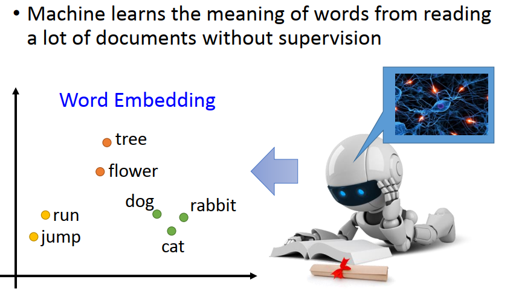

那一个词汇如果你要用一个vector来描述他,最简单的方法是1-of-N Encoding,所谓的1-of-N Encoding的意思是说我们用一个 lexicon size 的 vector来描述一个词汇,所谓length size 的意思是说今天假设英文有10w个词汇,我们就开一个10w维的vector,每一词汇我们都用 10w维的vector来表示,但是这个vector里面只有其中一维是1,其他维都是0,

举例来说如果是，我们今天在投影片上的例子里面假设,世界上只有5个词汇, apple bag cat dog elephant ,那每一个词汇就用一个5维的vector来表示,apple这个词汇就是第一维是1其它是0，bag这个词汇就是第二维是1其它是0，以此类推。这样子的坏处是这些词汇和词汇间的关系没有办法借由这种vector传递出来,举例来说,  cat dog elephant 都是动物,他们和 apple 和 bag是不像的,但是在这个case里面,每一个词汇他们都是独立的,他们都是完全不同的,所以从这些vector上面没有办法看出词汇与词汇之间的关系,

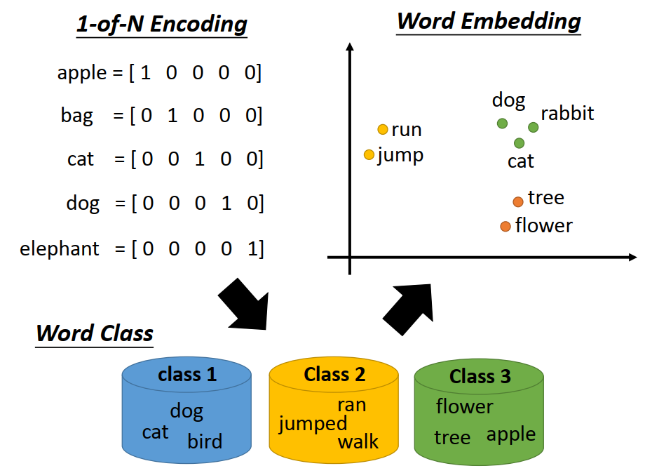

那怎么办呢？我们之前讲 dimension reduction 的时候有说,我们可以做clustering,clustering也是一种化繁为简的方法,对词汇来说你也可以做 clustering,你可以说哪些词汇属于同一个clustering,然后用那个 clustering来代表这个词汇,比如说dog cat bird都是class 1,ran jumped,walk都是class 2, flower,tree,apple都是class 3,class 1代表了动物，class 2代表了动作，class 3代表了植物这样子,

但是这样子做又太粗了,所以怎么办呢,我们需要word Embedding,在word Embedding里面每一个词汇他不是硬归类在某一个 clustering里面,而是每一个词汇都用一个 continuous 的vector来描述,这个continuous的 vector 每一个dimension 都可能代表了某种含义,举例来说在这个图上的例子里面我说每一个word Embedding都是用2维的vector 来描述,那可能第一维的vector靠左边的地方就不是生物,靠右边的地方,这一群就是生物,或者是你看第二维的vector可能是靠下面的地方是不会动的东西,靠上面的地方是会动的东西,等等,所以用 word Embedding来描述一个词汇,我们可以做到原来用word 的class 所无法描述的更精细的information,

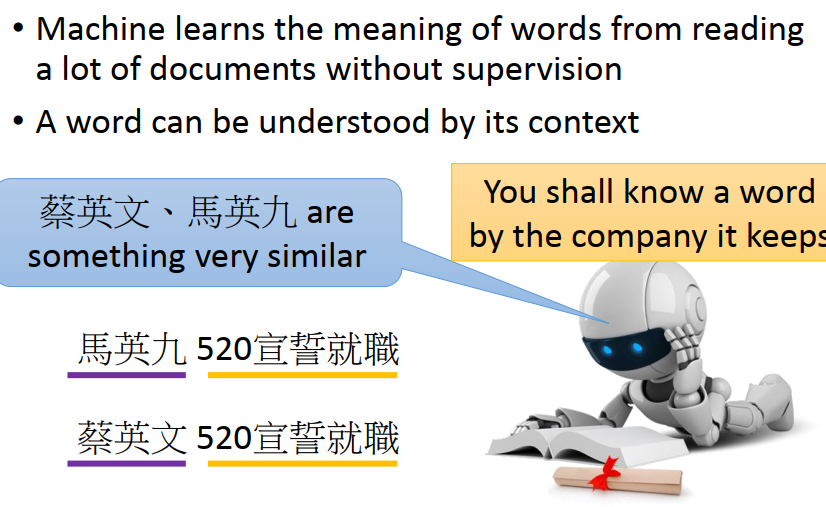

那怎么找这些word Embedding呢？怎么用一个vector来描述这些词汇呢,这边呢基本的概念就是每一个word,他的意思可以从他的上下文被看出来,举例来说假设今天你让machine 读很多新闻,然后machine发现说有一则新闻是：“马英九520宣誓就职”，另外一则新闻是：“蔡英文520宣誓就职”。就算machine不知道说马英九和蔡英文他代表的意思是什么，但是马英九和蔡英文他们有同样的context ,他们都用"520宣誓就职"这个context。那machine就可以推论说马英九和蔡英文他们其实有某种相似的关系,那可能在给马英九和蔡英文的vector的时候,他们的vector的某一个dimension 就会是一样的,

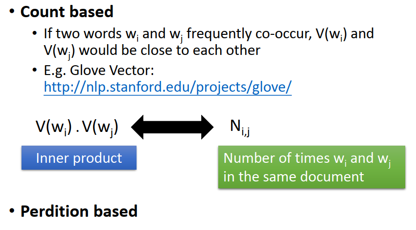

那实做上要怎么做到这件事呢,实做上怎么根据一个词汇的 context 上下文,找出这个词汇的vector,有两个体系的做法,但是他们其实基本的精神都是一样的,

### Count based

第一个是今天我们要为两个词汇w~i~和w~j~各找一个vector,V(w~i~)V(w~j~),找的原则就是我们希望如果w~i~和w~j~ 他们常常一起出现的话,那V(w~i~),V(w~j~),如果计算他们的相似度的时候,他们的相似度就应该要高,这种方法里面比较具代表性的是Glove vector

那实作上你可以这么做,我们目标是要为每一个词汇w~i~和w~j~ 都找出一个vector,V(w~i~),V(w~j~),那我们把V(w~i~),V(w~j~)做 inner product,会得到一个数值,我们一样可以根据现在手上的文章,搜集一大堆的文章,就可以计算两个词汇w~i~和w~j~的co-occur ,可以计算w~i~和w~j~一起出现的次数,这个值我们写作 N~i,j~ 然后你就去找一组vector V(w~i~),V(w~j~),希望V(w~i~),V(w~j~) 他们做  inner product以后他们的结果和 N~i,j~ 越接近越好,

实作上你可能不会直接用N~i,j~  这个数值,你可能不会直接count  w~i~和w~j~ 的数值,而是你会用其他方式做一些 normalization 啊等等,比如说取个log 啊等等,之类的,在实作上有一些更细微的变化,但是他的精神呢就是希望找一个 V(w~i~),V(w~j~)看做  inner product以后跟他们的一起出现的次数是呈正相关的,那这样两个词汇如果常常出现在同一篇文章里面,代表他们是有关系的,他们会被assess 接近的vector,这个是count based 的做法

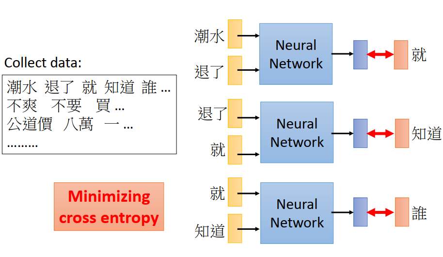

### prediction based

另外一个做法是 prediction based的做法，prediction based的做法是这样,我们先讲他是怎么操作的,再来讲他的原理,在prediction based的做法里面呢,你要做的事情是,你要叫machine去做一件事,machine做的事情是 predicted 接下来要出现的词汇是哪一个词汇,

举例来说你现在去 ptt 上爬了一大队文章,比如说"潮水退了就知道谁没穿裤子"等等,收集一大堆句子这样子,那接下来你要machine做的事情就是 predicted given 前面几个词汇,接下来会出现哪一个词汇,你要让machine去找一个neural network,这个 neural network input "潮水"和"退了",希望他就output"就"这个样子,有一件事我不知道有没有讲过,在中文里面一个字,大家知道字是什么吗，"潮"是一个字,"水"是一个字,"潮"和"水"合起来才是一个词,这样才是一个word,我想大家都应该知道

所以你不能说 "潮水"是一个字,他不是一个字,他是一个词,是一个word,中文通常我们会以word为单位来做种种的处理,所以你要先做断词,知道哪些字合起来是一个word,中文的断词会有ambiguously 的问题,同一个句子会有好几种不同的断法,比如说"台湾大学"到底要算是一个词还是两个词,就是台湾是一个词,大学是一个词,这中间会有模糊的地带,所以这其实会是一个问题,不过我们今天就不讨论这个问题,

所以拿到 corpus 有机会先做断词,接下来你就要机器预测说given 前面两个词汇"潮水"和"退了",那他要output就是"就",你就可以用minimize cross entropy 的方式让这个network的output跟他的target越接近越好,那你可能会问machine 的output是要  predicted接下来会有哪一个词,那你就看说世界上可能出现的词汇有多少个,假设世界上可能出现的词汇有10W个,那这个network 的dimension 其实会非常巨大,这边呢就是一个10W维的vector,

接下来这个network你希望他吃了input "退了"和"就",他就要output接下来是哪一个词汇,你就希望他的output是知道,接下来network input"就"和"知道",那你希望他output就是“谁”这样子,

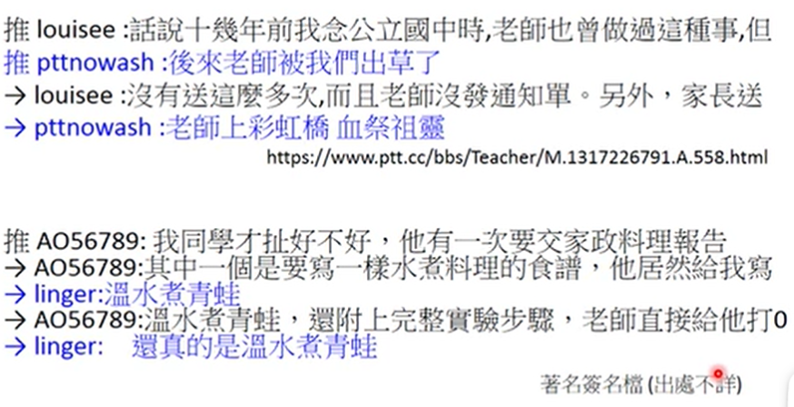

那你说这个东西可以干嘛,他不能干吗,他听起来少数的功用就是可以做推文接话,推文接话大家知道吗,这个我用心的从ptt上找出来的,而且我还找出他的起源这样子,"话说十几年前我念公立国中时,老师也曾做过这种事,但,,,,,,,,,,"这是某一个人,他推了这句话,但他还没有推完,被别人发现了,别人就可以去接,这里就有一个人接，然后他就learn了一个neural network,这个neural network 就是吃前面那个人推过的这些词汇,然后output下一个词汇这样子,所以这个人的network就output "后来".然后"后来"之后又接"老师","老师"后面接"被","被"后面接"我们","我们"后面接"出草","出草"后面接"了"这样子,然后这一个人又继续写出"没有送这么多次,而且老师没有发通知单,另外,家长送",“家长送"后面要接什么呢，network的回句就是“家长送"后面要接"老师上彩虹桥血祭祖灵"...这个是从teacher版上找出来的,你可以看这个连接,这个连接是原始的 推文的出处,

这边有另外一个,就是要写一个家政报告,要写到”水煮掉了,居然写”写什么呢,然后network的 predicted 是"温水煮青蛙",但是其实真的就是“ 温水煮青蛙”,他predicted 很准,这个签名档输出不详,那这个network看起来好像只能在ptt上使用

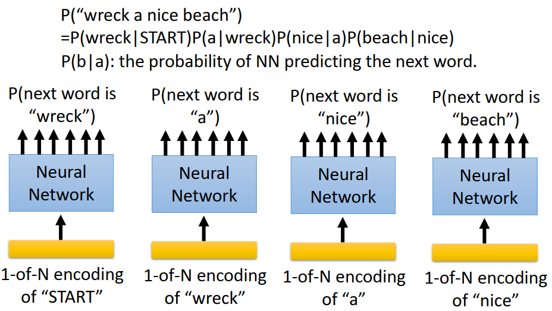

但是他其实还有别的作用,他可以用在  language model上,language model 大家知道是什么吗,language model 就是要 predicted 一个句子他出现的几率,比如说你希望machine可以估测"wreck  a nice beach"这一个句子他出现的几率,但是实际上你没有办法估测一个句子出现的几率,因为如果随便给你一个句子,你当然可以说我搜集一大堆data base,搜集一大堆ptt 的文章,搜集一大堆的新闻,然后有人问你一个句子,你去看说这个句子在data base里面出现的几率是多少,但多数句子出现的几率其实是0,因为多数的句子在你的training data里面一次都没有出现过,

但他们其实不是0, 所以你要估测这些一个句子的几率的时候,你通常会拆成比较小的片段,然后每一个片段分开去计算他的值,举例来说你要估测 "wreck  a nice beach"的几率,那你就会先计算start 后面接 wreck  的几率,wreck 后面接a 的几率,a后面接nice的几率 ,nice后面接beach的几率 ,随便会提的就是 "wreck  a nice beach"他的发音跟语言辨识 Recognize speech 是一模一样的, Recognize speech  就是语音辨识, "wreck  a nice beach"就是破环一个美好的海滩,那他们的发音是一模一样的,所以做语音辨识的人在举例的时候常会举这个例子

那P(b|a)当然只有用统计的方式去database里面统计说，比如说nice后面接beach 的几率有多少,那这件事情你也可以用NN来做统计,可以用NN来 predict说 given一个词汇a ,接下来output 词汇b 的几率有多少,

你就把刚才可以拿来做推文接龙的那个network拿出来,你就把START 也当作一个词汇,你把START 丢到这个network里面,然后看看他 predict wreck 的几率是多少,那你就得到了P(wreck|START);你把wreck 丢到这个network里面,看他 predict a的几率是多少;你把a丢到network里面,看他 predict nice 的几率是多少,再把nice 丢到network里面,看他 beach的几率是多少,然后你再把这些几率乘起来你就可以得到这个一个句子的几率,

现在如果你要做一些比较say of the art?? 的   language model,  language model其实很重要,它会被用在比如说翻译里面,或者是用在语音辨识里面,不管是机器翻译还是语言辨识,你都需要这样的语言模型.因为这样的语言模型的好处就是,今天如果机器翻出一个句子,比如说在做语音辨识的时候，你光考虑声音是不够的,你光考虑声学资讯是不够的,因为很多不同的sentence 他可能有同样的发音,就好像我们刚才举得语音辨识和破坏一个美好的海滩一样,他们可能有同样一个发音,所以你会需要一个语言模型来告诉你说哪一个句子他出现的几率是比较高得,所以这种技术常被用在语音辨识或者是机器翻译里面

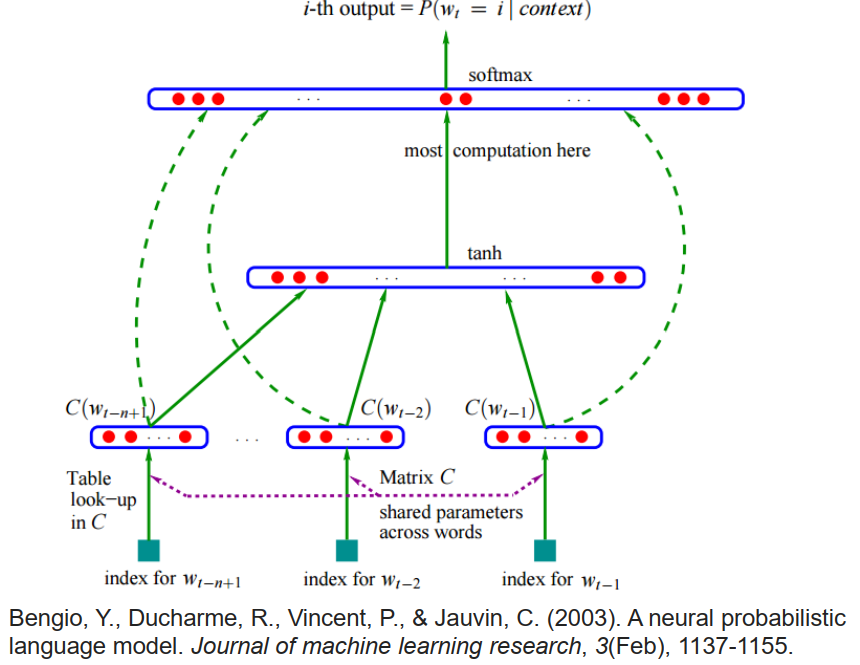

这边特别剪了一张图,这张图我认为是用neural network做 language model的 第一个研究的paper里面截出来的,在这个图上他要表达的意思是说我们现在要 predict 某一个word w~t~ 出现的几率,那我们的input是w~t-1~ ,w~t-2~ 到w~t-n+1~ ,每一个词汇都会先乘上一个 Linear的 transform,都会乘上一个matrix C变成一个low dimension 的vector,low dimension 的vector就是C(w~t-1~) ,C(w~t-2~ )到C(w~t-n+1~),把这些 vector 并起来再通过 hyperbolic tangent 再乘上一个matrix ,最后得到一个 lexicon size 的vector,这个 lexicon size 的vector 会做 softmax,那你就可以计算说given 这一串的word,  w~t-1~ 到w~t-n+1~ ,这边总共有n个word,接下来predict 是w~t~的几率有多少

那这应该是第一篇用  language model来做语言模型的paper,我大学的时候读过这篇paper,让我印象非常深刻,他说这个实验用30 张CPU跑了三周,最后没跑完,想一想deadline快到了,没跑完才去show个结果这样子,现在这个技术已经满坑满谷了,

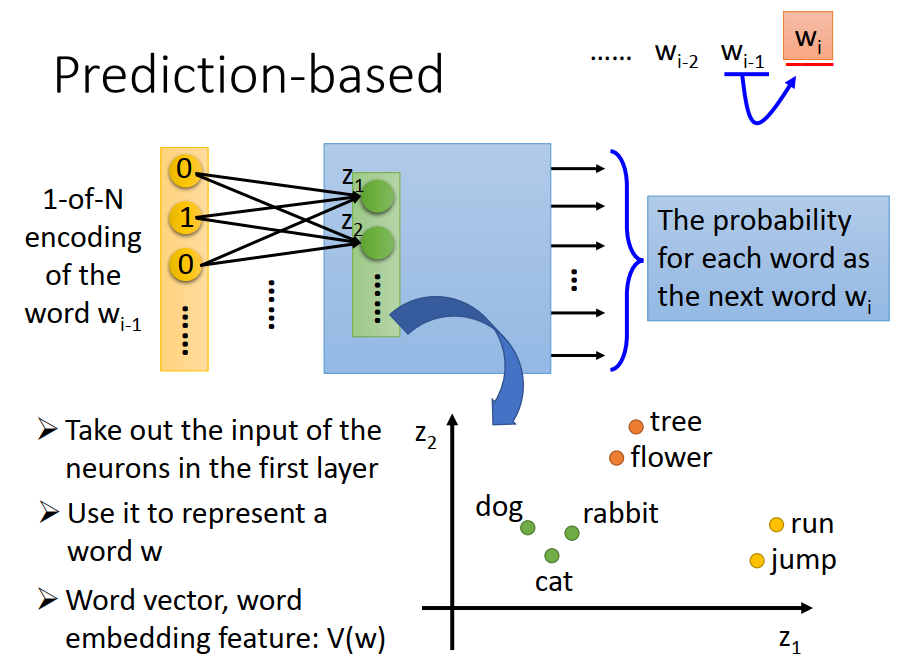

我们刚才讲的是我们要learn一个network,这个network是given word w~i-1~  of 下一个word  w~i~  ,实际上运作起来像是这个样子,每一个词汇 w~i-1~ 你都可以用一个 1-of-N encoding的vector来表示,就只有其中一维是1,其他维都是0,那你希望把这个 vector丢到一个network里面,network就是一个蓝色的黑盒子,然后它的output就是要predict 接下来w~i~是每一个词汇的几率,这个蓝色的盒子他的output就是lexicon size ,那每一个dimension就对应到一个词汇,然后呢machine希望 w~i~ 的那个词汇所对应的那个dimension他的几率越大越好

那有了这些东西以后,接下来我们知道说把 一个 1-of-N encoding的vector丢到这个 network里面去,把一个feature vector丢 到这个network里面去，我们做的事情就是把这个feature vector 乘上一个 linear的transform,再通过 Activation function变成第一个 hidden layer 的output,

如果我们现在，回到我们一开始要做的事情,我们就是要对每一个词汇取一个vector,回到我们 要对每一个词汇取一个vector这件事,那我们要怎么从这个network上得到那个vector呢,我们要做的事情就是，我们把进入第一个hidden layer 之前的,就把这个input feature vector乘上 linear transform 以后的那一个feature 拿来当作表示这一个词汇的vector,

就是你input一个词汇,每一个词汇都有一个各自不同的  1-of-N encoding 的vector,那你把这个vector 丢到这个network里面去,在进入第一Linear transform 之前,在进入第一层的hidden layer 之前,你会把这个vector 乘上一个matrix ,把它变成一个low  dimension 的vector,就好像是降维一样,做PCA降维的时候,你也是乘上一个matrix 做 Linear transform,意思是一模一样的,你对每一个vector都乘上一个matrix 做 Linear的 transform,接下来你就得到一个vector,这个vector的第一个 dimension他的值就是 z~1~,第二个dimension他的值就是是z~2~以此类推,如果你把这些word vector 统统都划在平面上的化,就可能可以得到我们刚才说的这种同样的word他有相近的vector,这样的特性

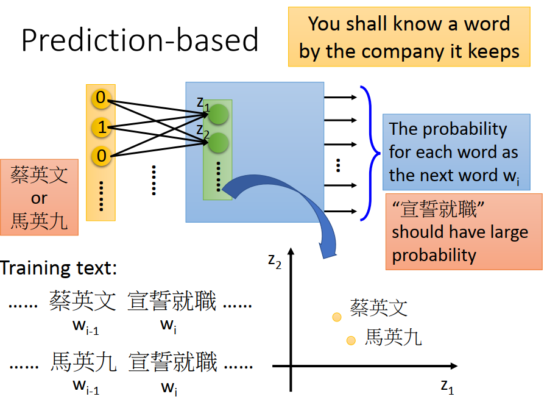

我们讲一下为什么,我们learn好这样的network以后,把一个词汇丢到这个network里面去,我们就可以得到这样的vector,因为我们刚才说每一个词汇可以借由他的上下文看出他的意思,所以现在假如你有一堆training data,里面有“蔡英文宣誓就职”这个 句子, “马英九宣誓就职”这个句子 ,那接下来呢,因为蔡英文和马英九后面接的有同样的词汇，这两个不同的 w~i-1~ ,后面接了同样的w~i~,所以你不管input 蔡英文的1-of-N encoding 还是 马英九的  1-of-N encoding ,你最后的output都需要是一样的, 不管input 蔡英文的1-of-N encoding 还是 马英九的  1-of-N encoding,你都希望output是 “宣誓就职”的几率是大的

对network来说,我今天给不同的input,我们希望得到一样的output,那要做的事情就是希望可以把原来不同的input把它做转换以后,在中间的hidden layer 做转换以后，希望他们变得比较接近,这样network的output才会是一样的,所以呢今天因为input蔡英文和马英九 的1-of-N encoding 他们output都要是同样的词汇,所以 蔡英文和马英九 在乘上了这个 Linear transform以后,machine 自然会希望他们有非常靠近的  Word Embedding,有 非常靠近的  Word vector,用这个方法就可以给类似的词汇,给接近语义的词汇,接近的  Word vector,

当然 蔡英文和马英九他们后面可以接各式各样不同的词汇,所以事实上你的network predict 是一个distribution,那 蔡英文和马英九 他们其实可能有不一样的 distribution,他们只是在宣誓就职的那一个dimension可能有比较相同的几率,所以你最后learn出来的结果应该会是  蔡英文和马英九他们在某几个 dimension是一样的,在另外几个 dimension又是不一样的.

所以不同的词汇,如果他们有同样的 attribute ,他们都是紫色的物件， 有同样的特性的话,在做word  Embedding 的时候他们会在某几个dimension 有接近的值

这边其实有一个秘密要告诉大家,其实天下人都知道,就是其实在做这种 Prediction-based 的approach的时候,我们真正用的network,不会用一个deep learning network,只会用一个只有一个hidden layer 的network,而且那一个只有一个hidden layer 的 network还没有 non-linear的Activation  function,他的 Activation function 是linear的,他其实非常像是PCA,你可能说为社么不用deep 的呢,我们知道说这一套 word vector的技术有一个pioneer ,最早提出这一套word vector 技术的人叫做Thomas ,

他讲了一个励志的故事,他说一开始他propose 的**Word2vec** 这个方法,然后他说他就投一个 conference ,那他就投了一个workshop,结果却被reject ,他就得到一个很negative 的 comment,然后说可以告诉我这个东西可以干嘛吗,但是他后来就投了别的 conference  上,现在我们知道**Word2vec** 是做NLP的时候必须要用的技术，他第一次投某一个workshop的时候得到的评价居然是这个东西可以干嘛,这是一个很励志的故事,

我有问他为什么这个network不是用deep 的呢,他说其实在他之前有其他人用deep 的network来train这样子的word Embedding,他想要表达的意思是说其实找这种  Word Embedding不太需要用到 deep 的network,用一个 shallow 的network就可以找出这种  Word Embedding,而且用 shallow network最大的好处就是train 的非常非常快,因为你要作这种  Word Embedding你要看非常非常大量的data,如果是deep的化train 起来太累了,所以用一个 linear的model train起来速度才够快,而且你已经可以得到你要的结果,

另外一个理由是其实 Word Embedding 做的事情比较像是feature interaction， Word Embedding这个model抽出来的这些vector,你是要拿来当作其他model,接下来其他NLP task 的input,我们这些vector其实是其他NLP task的input，那其实其他NLP的task 可能是用一个 deep 的model,那抽feature 的部分也许就不需要是一个deep 的model,

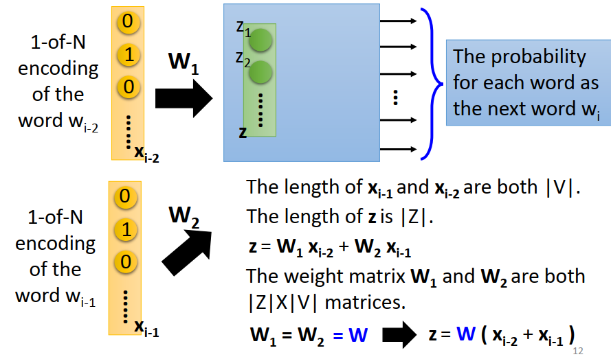

我们刚才看到的那个model,他是input一个word  w~i−1~,就predict下一个word  w~i~,但是只看一个词汇 predict下一个 词汇这样可能是不太够,我们希望machine看比较长的 history 这样才有足够的information去 predict下一个 词汇

在这个例子里面我假设machine是看前两个词汇,但是同样的道理,你要把它extend 到看前10个词汇,前20个词汇,意思都是一模一样的.要让machine看前两个词汇,现在 w~i−1~ w~i−2~,用他们的 1-of-N encoding 的vector这边写成  x~i−1~ x~i−2~来描述他,现在  x~i−1~ x~i−2~他们的dimension都是|V|,所谓|V|指的就是 lexicon 的size ,所以一个 vector他已经有10W维了,两个vector合起来就20W维,如果你要考虑前十个word,那就是100W 维,这个听起来其实有点太大了,所以在实作上会做 以下这个**trig** .这个**trig** 是什么呢,这个input是vector非常大,但是这边这个hidden layer 的size这边写成Z ,他的长度是|Z|,我们原来要做的事情是把  x~i−1~乘上某一个transform w~1~,再加上把 x~i−2~乘上某一个transform w~2~,然后把他们加起来变成z ,然后再通过后面的layer去 predict接下来的word 是哪一个

如果是这么做的话，这个 w~1~和w~2~ 都是两个硕大不同的 matrix,但是我们其实可以把   w~1~和w~2~tie在一起,所谓tie在一起就是说让 w~1~和w~2~ share同样的variable,我们在讲CNN的时候其实有看过同样的概念，我们说同一个filter他们看的范围不同,你比方说同一 filter在一个image上做convolution的时候，其实就是让不同neuron share同样的参数,这边的意思其实是一样的,如果我们今天 w~1~和w~2~用不同的参数的话,那你的参数太多了,你没有办法把你的history 真的扩展到说我要看前10个或者前20个word,所以我们应该要把 w~1~和w~2~ tie在一起,如果我们把  w~1~和w~2~ tie 在一起,如果我们把不同的input他后面要乘的transform tie 在一起的话,那其实不管你考虑得history有多长,你的参数都不会增加,

所以实际上我们在做word vector的时候我们确实会考虑非常长的history,你没有考虑长的history，你的结果看起来都跟差,你至少要考虑10个word，20个word才看到比较合理的结果,但是今天就算是考虑很长的 history你的参数也不会增加,因为我们实际上在做的时候不同的词汇,不同的input，x~i−1~和 x~i−2~ 他们是乘上同样的transform,也就是实际上这整个transform，你可以写成先把x~i−1~和 x~i−2~ 加起来然后再乘上w这个transform得到z，再去做接下来的prediction,

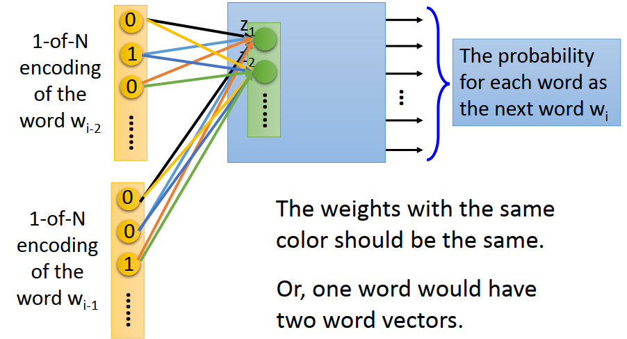

也就是说 w~i−2~的第一个dimension连到z~1~ 的weight跟 w~i−1~ 的第一个dimension连到z~1~ 的weight是一样的,w~i−2~的第一个dimension连到z~2~ 的weight跟 w~i−1~ 的第一个dimension连到z~2~ 的weight是一样的,以此类推,我相信你知道我的意思,

这样子他有另外一个好处是如果我们本来不同的input vector我们都给他不同的weight的话,那他做这个 dimension reduction做这个linear transform 后,同一个词汇你放在不同的位置你会得到不同的word Embedding,这样子会让人 觉得confuse 不知道选哪一组 word Embedding**,如果我们把不同的input他的参数tie 在一起的时候**,同一个词汇不管是放在哪一个位置,因为同一个词汇的  1-of-N encoding 是一样的,所以经过同样的 transform 以后，一定会得到同样的   word Embedding,这样你每一个词汇就会有固定一组的  word Embedding

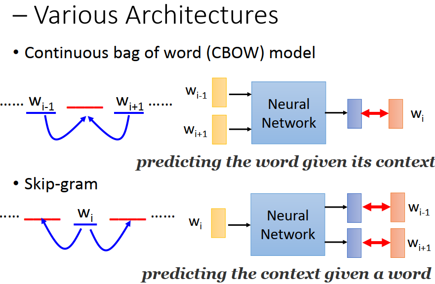

那其实这种prediction-based 的方法有很多不同的变形,刚才讲的是看一个history predict 下一个词汇是什么,那你也可以看 context predict 中间的词汇,这件事情叫做CBOW ,那你也可以看中间的词汇,predict 他的context,这种东西叫做 Skip-gram,那总之有总总不同的  word Embedding 的做法

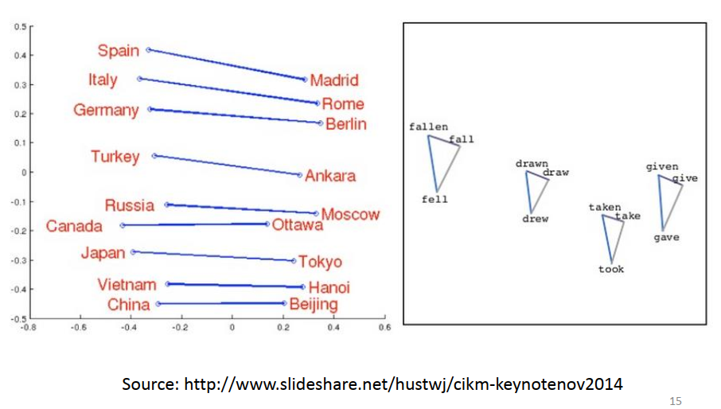

那你得到这种 word Embedding 之后,你把每一个词汇的word Embedding拿出来观察,其实你会发现很多有趣的现象,举例来说你会发现每一个国家和他的首都之间有着类似的关系,比如说 Japen跟Tokyo还有Germany和Berlin,Italy跟Rome他们的关系,你就会把这些国家的名字他的word Embedding 都拿出来,然后首都的word Embedding 都拿出来,你会发现国家和首都有着固定的关系,或者是动词的三态变化间有的固定的关系,你把每一个动词他的三态拿出来画在图上，可能发现每一个动词的三态变化是呈现一个有序的三角形

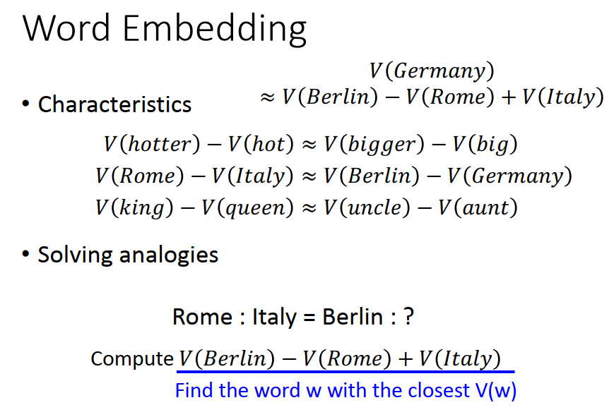

或者是你有了这种 word Embedding之后， 你可以做简单的推论,因为从这个 word Embedding上面,你可以发现说,这个结果还蛮容易观察到的，就是hotter的vector,我们直接用V(hotter) 代表hotter 的 vector,hotter的vector 减hot的 vector会接近bigger的 vector减掉big的 vector。或者是Rome的vector减掉italy的vector会很接近Berlin的vector减掉Germany的vector。或者是King的 vector减掉queen的vector会等于uncle的 vector减aunt的vector

这样的好处是当有人问你：罗马之于意大利，等于柏林之于什么呢。你可以基于这种word Embedding 来推论出这个问题的答案,这个东西就很象是,这个智力测试就会考这种问题,就可以让机器回答这种智力测验的问题，那我们知道说正确答案是 Germany ,那Germany  的vector张什么样子呢,如果根据中间这个 equation 的话,Germany 的vector会约等于Berlin 的vector 减去Rome 的vector加上Italy的 vector ,把 Germany 移到左边,把 Rome 和Italy 移到右边得到这一个式子,我们知道 Germany 的vector约等于Berlin 的vector 减去Rome 的vector加上Italy的 vector ,

但是假设我们今天不知道答案是  Germany ,那你怎么找出答案就是Germany 呢,你就去计算出 Berlin 的vector 再把它减去Rome 的vector再加上Italy的 vector ,把最上面的式子算出来,把这个 vector找出来,接下来看这个vector和哪一个词汇的vector最像,他很有可能就是和 Germany 的vector词汇 最像,那machine就可以得到答案是Germany

### DEMO

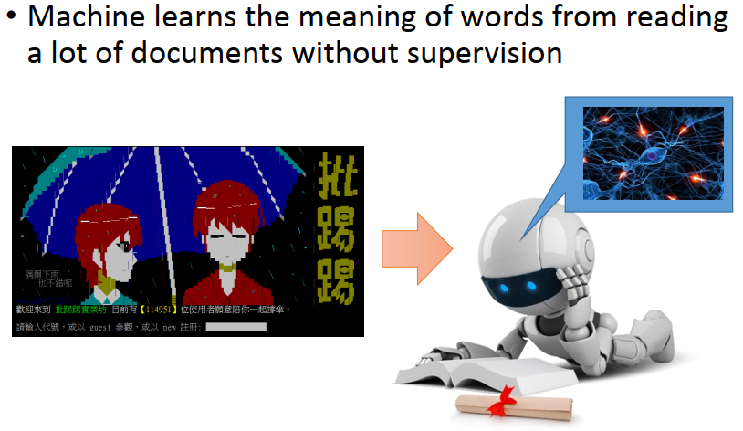

这边其实有一个demo,这个demo就是让machine实际上看ptt 八卦版的文章几个月以后看看他可以学到什么样的东西,

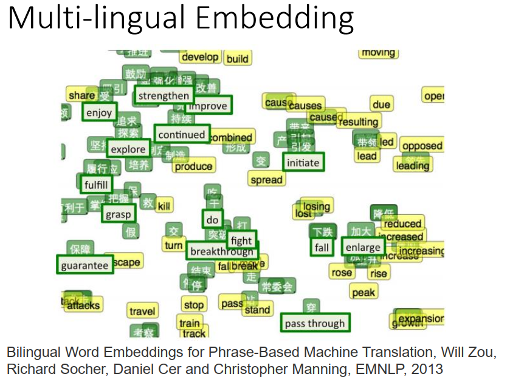

word Embedding还有很多其他有趣的相关研究,举例来说假设你现在train一组英文的word Embedding跟train一组中文的 word Embedding,但是这组 英文的word Embedding跟中文的 word Embedding,是没有办法混在一起用的,为什么,因为我们知道虽然 word Embedding 的每一个dimension代表了某种语义,但是word Embedding 的train 是unsupervised,所以并不知道每一个dimension代表的语义是什么,那有可能你中文learning一套 word Embedding,英文再另外learn一套word Embedding,就算 中文的 word Embedding,和英文的word Embedding他们的dimension都是一样的,比如说都是100维,你也没办法把这两种  word Embedding 混在一起用,因为比如说中文的第三维代表动物,英文的第七维搞不好才代表动物,他们如果分开来train 的话,你根本没有办法把他们混在一起用,

但是这边有一个有趣的研究结果是说,假设我们已经知道一些中文的词汇,跟一些英文的词汇他们的语义是完全一模一样的,举例来说在这个图上每一个词汇他的位置就代表了他的 word Embedding  的位置,然后绿色的框框里面的英文代表说我们已经identify 说英文的词和中文的词他们有一样的意思,比如说保障就是guarantee ,打就是fight,下跌就是fail,加大就是enlarge等等,

我们已经知道了这种资讯,那接下来我们既然知道这两个词汇有同样的语义,虽然说他们原来有不一样的 word Embedding .就可以learn一个transform 说我现在把英文的word Embedding，我希望guarantee  的word Embedding 通过transform 以后，结果可以和保障的 word Embedding 是越接近越好,希望说比如说fight 的word Embedding  做完transform以后 和打越接近越好,breakthrough 的 word Embedding 做完transform 以后和突破越接近越好,就可以把不同语言间的word Embedding  的transform 找出来

找出这个 transform以后接下来可以干嘛呢,就可以把其他的英文的词汇,其他英文的词汇我不知道他和中文的词汇对应关系,但是都把他丢到这个transform里面,那这些英文的词汇他们和这些中文的词汇就可以被放在同一个平面上,他们的transform以后的 英文word Embedding  和中文的word Embedding 他们在同样的dimension就代表了同样的意思,

举例来说右上角有一大堆黄色的英文词汇,(这个实验结果来自下面的paper,这应该是真实的实验结果)黄色的这些英文词汇,他们不知道和中文的哪些词汇有对应关系,但是你把黄色的这些英文词汇,通过刚才从绿色的这些英文所learn出来的transform以后,得到新的 word Embedding 以后,你会发现说这些黄色的英文他会和有类似语义的中文放在一起,比如说stop 他附近就有停,比如说reduce,他旁边就有降低等等,所以这个还蛮有趣的,这个结果还蛮惊人的,

虽然说我们本来train中文和英文是分开train的,但是如果我们加上了几笔train data 当作像anchor point 这样的东西,就可以把两个不同的semantic space把它 拉在一起,

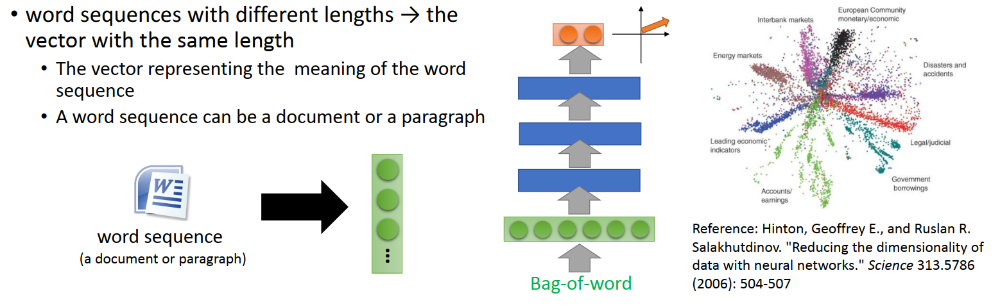

#### Document Embedding

我们刚才讲的是把一个词汇变成一个Embedding，变成一个vector ,那接下来要问的问题是能不能把一篇文章变成一个 Embedding ,能不能把一篇文章变成一个 vector,这当然是可以的,唯一比较麻烦的地方是说不同的文章他的长度是不一样的,不同的文章他里面有不同的词汇的数目,所以他的长度是不一样的.设计这个模型的时候你可能会需要做一些设计,

那最简单的方法就是你不要管这些词汇出现的顺序,你就看这篇文章里有出现哪些词汇,然后就用bag-of-word vector 来描述那一篇文章,bag-of-word vector 我想大家应该知道,每一个dimension一样对应到一个词汇,那个词汇出现几次，在他对应的dimension，他的数字就是多少,某一个词汇,比如说爱出现三次,那那个dimension的数值就是3,你把这种 bag-of-word vector丢到一个auto encoder 里面去,然后这个 auto encoder 会得到他的 Embedding ,然后你把这个 Embedding 拿出来,就可以描述那一篇 document,最右边的图上次是有看到的

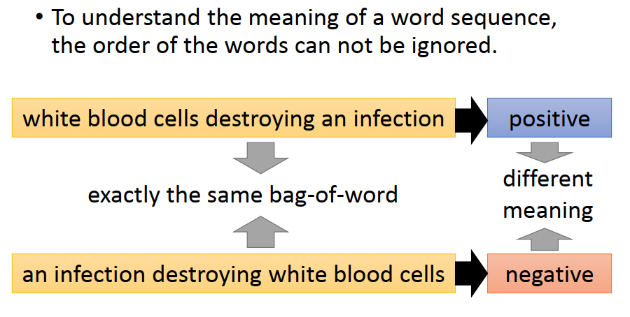

但是光这么做呢,其实是不够的,因为我们知道词汇的顺序其实也包含了很重要的 information,有可能两个句子他们有一模一样的 bag-of-word  但是他们的语义却因为词汇的顺序的不同而天差地远,举例来说这边有一个句子是 “white blood cells destroying an infection”，就是白血球消灭了传染病,下面有另外一个句子“an infection destroying white blood cells”就是传染病消灭了白血球,

这两个句子如果你看他们的 bag-of-word 的 话他们有一模一样的bag-of-word ,这样两个句子里面都有6个词汇,他们的6个词汇是一模一样的,只是组成的顺序不太一样,就因为组成的顺序不一样,所以上面这个句子是positive 的意思,下面这个句子是个negative 的意思,他们有同样的 bag-of-word ,却完全不一样的意思,所以我们会希望说machine可以把这一件事情学出来而不是只是用 bag-of-word  来描述一篇文章,至于要怎么做这个,我们就不细讲,这个就比较...(后面的视频没有了)

