[TOC]

# P 26 15: unsupervised-learning -Neighbor embedding <!-- 30' -->

## Neighbor embedding

等一下要讲的除了TSEN 以外,是一系列的方法,这一系列的方法叫做 Neighbor 的embedding,他们都是非线性的降维的方法.他们凭借的都是data point 和 data point 之间的关系,这些方法之所以叫做 Neighbor embedding就是因为他们凭借的是在原来的空间中,在降维前的空间中每一个点和他的邻居之间的关系来做降维,这些方法又叫做 manifold learning,

### manifold learning

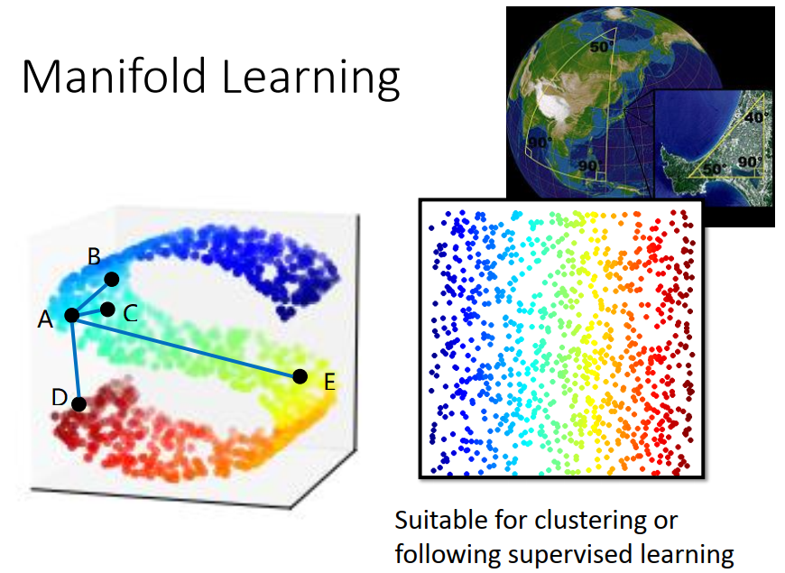

为什么叫做  manifold learning,我们刚才提了 manifold 这个字眼很多次, manifold 简单来说是高维空间中的低维空间,比如说我们这边有二维的S型,把它硬塞到3维的空间里面,那这个二维的空间就是一个manifold 

**在这个 manifold 上面,在这个比较近的距离间,Euclidean distance 可以使用,但是在距离比较长的时候  Euclidean distance 就不能使用,**什么意思呢,假设我们看黑色的点A,跟另外两个黑色的点B,C之间的距离,你可以说A点和B的距离比较远,A点和C比较近,对一些比较相近的点来说,他们之间我们可以用 Euclidean distance 来计算他们之间的距离.但是如果我们今天要问的是,点A和另外在红色区域的点D和在黄色区域的点E谁比较近,如果你算 Euclidean distance,你得到的结论可能是黄色的点E 比较远,红色的点D比较近,但是如果我们从  manifold 的角度来看的话,顺着S型走,其实是黄色的点E比较近.红色的点D比较远,

就是说你从不同的角度来看,不同东西的距离是不一样的,从  Euclidean distance来看,A和E 比较远,A和D 比较近,从  manifold 来看 ,A和D 比较远,A和E比较近,

那可能是 manifold 这个是比较有道理,所以我们会希望说把高维空间中的data做降维,如果我们可以把三维空间中的data降到二维,而这个降维的过程可以把这个 manifold 展开的话,那降维以后的结果我们就可以直接用  Euclidean distance,

那这个好处是假设你接下来的  clustering 或者是 supervised learning 的方法,他都是用   Euclidean distance 的话,你先做  manifold learning做降维,让你  Euclidean distance 可以使用,让之后其他的方法得到更好的 performance

#### Locally Linear Embedding

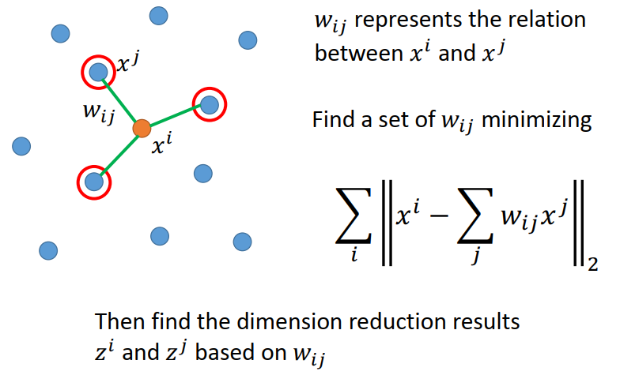

那接下来我们要介绍第一个方法叫 Locally Linear Embedding,他的缩写是LLE,他的想法是这样子,现在在高维的原来的data 的空间中,我们有一个点 x^i^,这个点 x^i^ 他有他的一些邻居,红色的这些点 x^j^,那 x^i^,x^j^ 中间有某种关系,我们称之为  w~ij~,我们用w~ij~来代表  x^i^和x^j^ 他们之间的关系,等一下会讲怎么叫做   x^i^和x^j^ 之间的关系

我们说   x^i^和x^j^ 之间有某种关系,这个关系是什么呢,这个关系是我们假设x^i^可以用他的邻居做 linear combination之后重组出来,x^i^ 会是 x^j^ 的 linear combination,而这个 x^j^ 的  linear combination的weight 就是 w~ij~,x^j^要用多少的比例才能够混出 x^i^ ,这个就是 x^i^和x^j^ 之间的关系.

所以 LLE要做的事情也是降维,但是他是用降维以后的结果,  x^i^降到z^i^,x^j^ 降到 z^j^, z^i^和z^j^ 之间的关系 w~ij~ 是不变的,

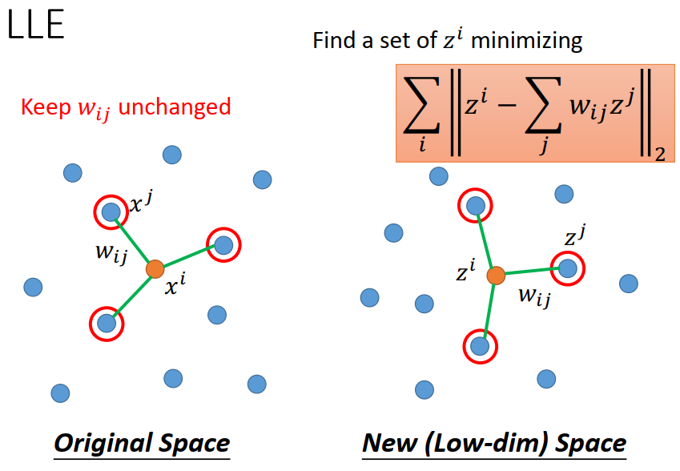

所以如果我们看  LLE 的话,你要先在原来的空间中找出  w~ij~,然后接下来你就把 w~ij~ 固定住,在新的空间中你要找一组新的z^i^和新的z^j^,而这 组新的z^i^和新的z^j^他们中间的关系仍然是 w~ij~,也就是这组新的z^i^和新的z^j^他们要满足下面这个式子,在前一页投影片里面你会  minimize 这一个  function,然后但是 x 是已知的,然后 minimize 这一个  function找出 w~ij~,但是在下一页投影片里面 w~ij~已经在原来的 space 里面找出来了,这关系就固定住了,但我们不知道降维以后的 vector是什么,所以在做LLE的时候我们就是在降维的过程就是,先找出 w~ij~ ,接下来固定住  w~ij~,找一组z^i^和z^j^ ,然后用 z^j^ 乘上同样的w~ij~也可以组合出原来的 z^i^,

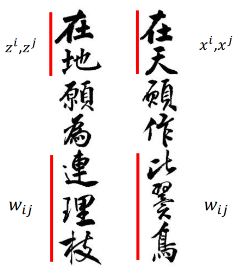

讲到这个就让我想到长恨歌的最后几句,“在天愿作比翼鸟，在地愿为连理枝”。“在天”就是在原来的data 的domain x^i^和x^j^ ,他们的关系就是w~ij~,但是如果今天做了一个transform就变成“在地”,“在地”就是z^i^和z^j^ ,但是他们的关系还是w~ij~,

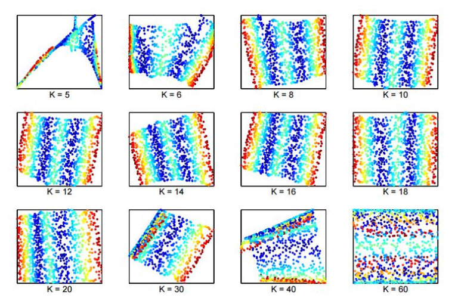

如果你做LLE 降维的话,你得到的结果是,这是paper 的例子,这个paper 的名字很酷,是原来LLE 原始的paper,有一个很酷的title "Think Globally,Fit locally".这个选这个K,选那个  neighbor 其实非常重要,你 Neighbor选的好,你才能够把原来的  manifold 展开, neighbor选的太大或太小都不对,因为今天把 manifold 从高维平面展开到低维平面,哪些点中间的关系不会变,哪些点中间的关系会变,我们是不知道的,但是原则是距离比较近的点他的关系会比较容易 keep 住,但是距离多近的点关系可以keep 住,这件事我们不知道,所以你选的多或者少都不对,如果你选K=5,这个是S型的 manifold ,照理说你会展开，你会展开成像k = 20这个就是很perfect的状况，其他k = 8或者 k = 20 都不错，那k =  5，你k选太少就烂掉了，如果你k选太多就不可以和每个人都做比翼鸟，每个人都连在一起，最后 transform 后的结果也是会烂掉的，这个是LLE

### Laplacian Eigenmaps

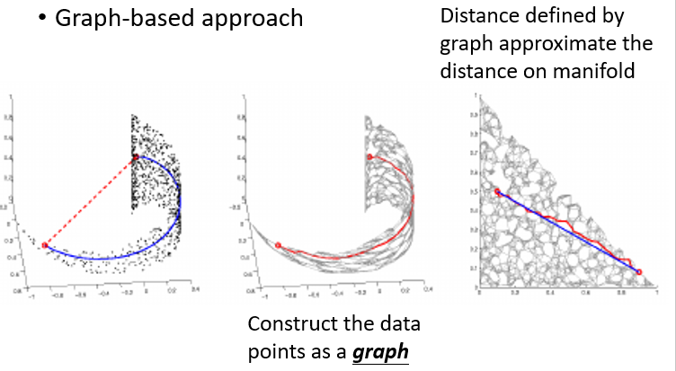

另外一个和LLE很像的方法，他是Graph-based 的approach，他叫Laplacian 的Eigenmaps，他和 LLE 的精神很像，所以我们现在用的是graph，我们之前讲过我们要衡量两笔data间的距离，用 Euclidean distance 未必是最好的方式，我们可以选择用graph来衡量两个data point 之间的距离，就是说如果今天这两个data point 之间有，我们先把这些data卷成一个graph，如果今天这两笔data 之间，他们在graph上面是有相连的，就好像是说捷运在这两个地方是通的，他们的距离就比较近，所以我们可以用graph来Define距离，然后根据 graph 来做降维，

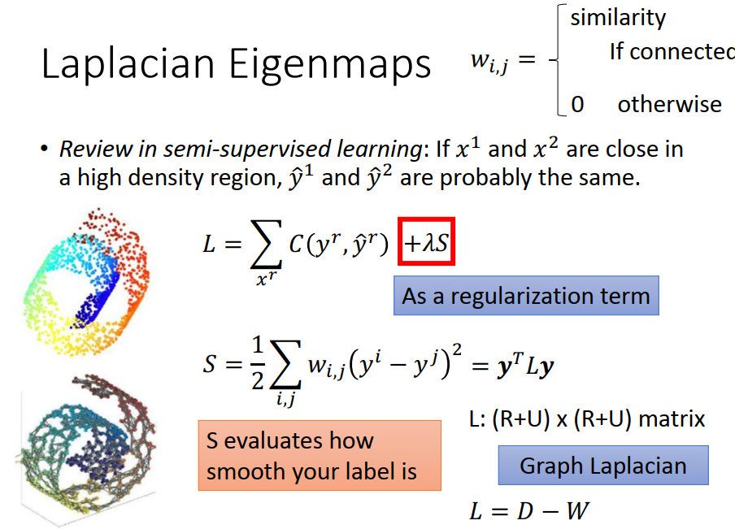

#### 首先第一件事情是先找一个 graph

怎么根据graph 来做降维呢，首先第一件事情是先找一个 graph，你现在有一堆data point x^1^ 和x^2^，你根据这些data point 降出一个graph，之前在讲smei-supervised learning的时候，我们其实也有用到graph 的概念，我们说我们建了一个graph以后，我们在做smei-supervised learning的时候不止考虑了cross entropy，我们不止考虑了每一个有label的data y^r^ 跟他的正确答案 $\hat y^r$之间的 cross entropy，我们还会加上另外一个 regularization的 term，这个  regularization的 term，是来自于 graph 的 structure

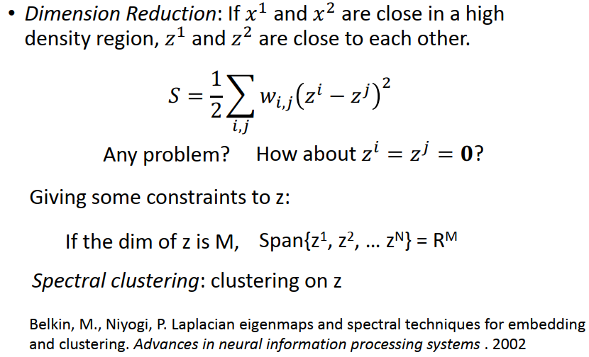

这个  regularization的 term 是长这样子的，这个  regularization的 term是说我们希望如果今天 x^i^跟x^j^这两笔data他们中间的edge 的weight 是 w~ij~的话，那我们希望 i 和j这两笔data他们 的label  y^i^ 和y^j^ 他们越近越好，你会希望你在产生这个label的时候，在graph 上相连 的两个点他们的label 越接近越好，

然后这个 S 就 evaluate y^i^跟y^j^ 他们有多相近，这是一个 regularization的 term，可以做一下简化，写出一个式子 y^T^Ly，然后这个式子里面的 L就是大名鼎鼎的 **Graph  Laplacian** ，我们是上次上课的时候讲过了，

#### unsupervised 

用在 unsupervised 的情况是怎么样的呢，前面是 supervised 的情况，听起来没有什么问题，我们现在想一想  unsupervised 的情况，在unsupervised 的情况 我们要为每一笔data x^1^和x^2^ 都找一个 dimension reduction 以后的结果，z^1^跟z^2^，那我们说 z^1^跟z^2^ 要minimize 上面这个 objective function，我们希望说假设我们知道 i 和j之间的weight ，在graph上面我们已经知道  i 和j的weight ，我们希望 z^i^ 这个vector 和  z^j^ 这个 vector他们的距离越近越好，i 和j如果他们的weight越大，z^i^跟z^j^越接近越好，这样才能够minimize 这个 objective function(loss function)，

我有个问题，你不觉得这个式子怪怪的吗，你不觉得你可以一眼看出这个  objective function (loss function)的 solution 是什么吗，你可以找到一个 solution ，这个 solution 是什么，如果所有的 z我统统设成0,我统统设成 zero vector，这样不是就可以让这个loss  最小了吗，那这样不是很奇怪吗，这样你找出来的，你做  dimension reduction 以后的结果完全没有意义，我只要把所有不同的point 通通都降到同一个点那我就可以minimize 这个东西，所以这样是不行的，所以怎么办，所以要加一个 constrain，细节大家再check 一下paper，

#### constrain

接下来是什么样的 constrain呢，他加了 constrain 是说我们必须对降维以后的z做一些限制，什么样的限制呢，我们对 z 的dimension 做一下这样的限制，假设我们要降维的维度是M，比如说原来的x 是100 维，M是10维，我们的z都是 10维空间中的point ，那我们希望我们现在所有的z他做Span  以后可以填满整个M维的空间，

简单来说，假设我们现在希望做   dimension reduction 降到二维，你不希望说降到二维以后你的data point 都只分布在比如说某一条直线上，或者只分布在某一个点上面，像上面这个preview 的例子，你希望你的那些data point做span ，做span以后，他可以展开整个二维的平面，这是个二维的平面，二维的平面有两个dimension，**他可以填满整个 二维的平面**，我们希望说做 dimension reduction以后，可以不只要满足上面这个式子，还要满足填满现在你降维后的空间的这个限制，在同时满足这两者的情况下，其实你可以找出一个closed-form solution

如果我们今天是先用这种方法做降维，然后再做 clustering的话，那个clustering方法就叫做Spectral clustering

### T-distributed Stochastic Neighbor Embedding (t-SNE)

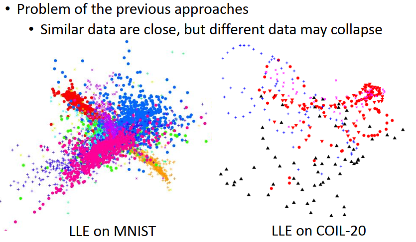

那刚才讲的那两个方法，Graph-base 的方法还有LLE他们都有一个问题就是他们只说了，今天如果两个 data point 他们在原来的 space 上相近，那降维以后他们也要相近，但他没有说，如果两个 data point 在原来的 space 上的距离很远，那降维以后他们应该要怎样，

因为少了这个东西，所以你会发现说，如果你今天做LLE 或者是 Graph  Laplacian  的时候，你可能会观察一个现象就是**本来不相干的点被集中在一起**，被叠在一起，什么意思呢，假如你在MNIST 上做LLE 的话，这边不同颜色的点代表不同的数字，LLE可以把同样的数字摆在一起，但他没有办法把不同的数字分开，因为他在他的 constrain 里面他只有说要把本来像的东西摆在一起，他没有说不像的东西不能摆在一起，有可能不像的东西也被摆在一起，这个其实不会是我们要的，

或者是右图是另外一个例子，这个例子也是对image 做  dimension reduction，这个 database里面的image ，有很多image 是对应到同一个object，比如说你把一台小汽车转一圈，转360度拍很多长照片。或者是你把一个茶壶转一圈拍很多张照片，所以你会发现这边同一个颜色应该代表就是同样的object，那同一个 object 做旋转的时候，用LLE降到 二维空间你就会看到一个圆弧状，你会看到一些有趣的圆弧，代表他们是同一个 object ，只是在空间中做了旋转，那LLE可以找出来说他们中间是有关系的，但是LLE 没有办法说保证不同的object 不会被塞成一团，所以这边LLE在database上做降维的时候会把本来不同的object 都塞成一团

#### t-SNE

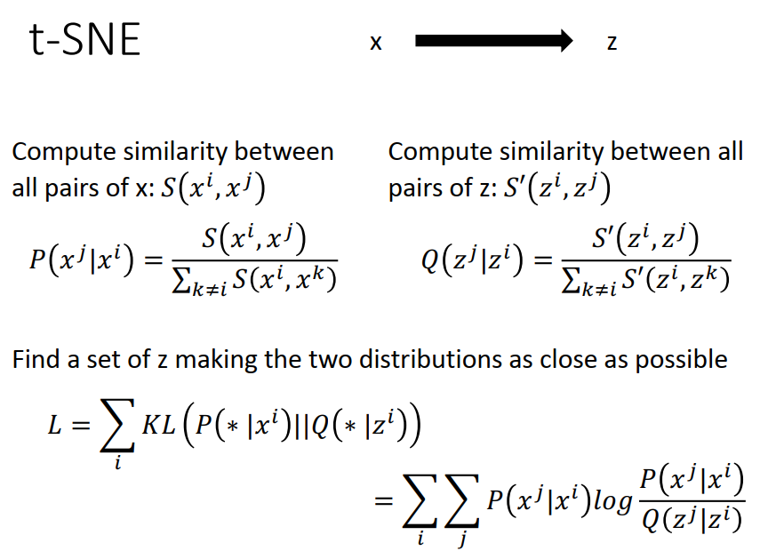

所以怎么办呢，有另外一种方法，这是我们刚才看到的t-SNE, t-SNE他最擅长做的其实就是 visualization，如果你今天要把高维的点做一个好的低维的视觉化的话呢， t-SNE常常是会被选择的方式， t-SNE是怎么做的呢，

 t-SNE是这样子的， t-SNE是说我们现在先计算在原来的空间中x^i^和x^j^ 之间的 similarity，计算x^i^和x^j^ 之间的 相似度，你可以用任何方法来计算他们之间的相似度，然后我们定义一个东西，这个东西你可以把它看成是一个几率，我们定义的东西叫做P(x^j^|x^i^), P(x^j^|x^i^)的意思就是 S(x^i^,x^j^)做一下 normalization，x^i^和x^j^ 之间的 相似度除掉 x^i^跟所有其他data point 之间的相似度，这个是降维前的结果，那我们看一下降维后的结果，

在降维后的空间中也计算 降维后的z^i^跟z^j^ 的相似度，那这边的相似度的function 我们写作 S‘，这个S‘ 和S可以是同一个 evaluation matrix，也可以是不同的  evaluation matrix，可以自己定，  t-SNE厉害的地方就是他在降维前和降维后他选择的是不同的  evaluation matrix，然后会看他是怎么选择的，

我们定义另外一个几率，Q(z^j^|z^i^)就是分子的地方是 z^i^跟z^j^ 的相似度，分母的地方是做一个 normalization 把所有其他的 点 z^k^和 z^i^的相似度加起来，

接下来我们定义好原来空间中的几率和降维以后空间中的几率，我们要找一组z 满足下面的特性，我们已经知道x ,我们只是不知道z ,我们要找一组z 满足下面这个特性，下面这个特性是说对所有的点 i我们希望P(x^j^|x^i^),的distribution和 Q(z^j^|z^i^) 的distribution的 KL divergence 越接近越好，你不知道 KL divergence也没有关系，KL divergence 就是在计算两个 distribution 之间有多相近，也就是我们希望 z^i^跟z^j^ 他们在新的空间中的  distribution 跟他们在原来空间中的 distribution  是越相近越好，

当我们采用   KL divergence 的时候，这边有两个好处，第一个是我们今天用的是几率，而不是 直接用similarity 的数值，所以他的Scale 就没有那么重要了，如果今天 S跟S’你选择不同的 evaluation matrix，他们的 Scale 可能不在 同一个档次上面，那你今天有做 normalization 可以 去掉不同的  evaluation matrix 造成的影响，这是第一件事

第二件事情是我们现在算的是两个 distribution  间的相似度，所以我们不止希望说在原来空间中几率大的两个data  point 在transform 以后几率也要大，同时也希望 几率小的transform 以后几率也要小，所以 t-SNE 如果讲白话一点他做的事情就是，**如果 两个data  point 在原来的空间中很近，transform 以后也要很近，如果 在原来的空间中很远，transform 以后也要很远，**

### evaluation matrix 

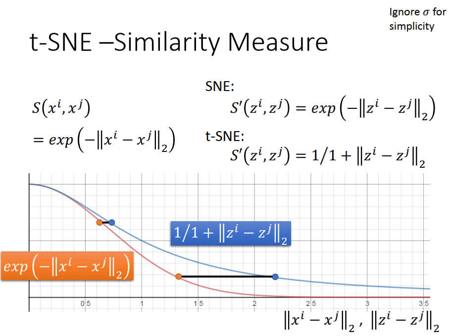

再来就是要看一下 t-SNE 所选的 evaluation matrix ，他在原来的空间  x^i^跟x^j^ 中，他选的  evaluation matrix 是把 x^i^跟x^j^  先算出他们之间的 Euclidean distance，再取负号，再取 Exponential，这样的好处是这一个  distance他下降的很快，也就是说你今天使用了这个 distance 的时候，如果两个点本来的距离很近， transform 以后仍然距离要很近，但是如果两个距离很远，只要稍微远一点，他们都是一样的远，大家了解我的意思吗，就是比如说有一个人他这辈子都住在台北，对他来说高雄也很远，美国也很远，都很远，这样子，这个意思是这样子

在  t-SNE  propose之前，还有另外一个方法叫做SNE ,那SNE 这个方法，他在 transform 以后的空间中用的是跟 transform  之间空间中的这个 similarity 的 evaluation matrix 是一样的，  但t-SNE 他novel 的地方是他选择了另外一个 evaluation  的方式，那这两个 evaluation  的方式有什么不同呢，

我们来比较一下，如果我们今天是用这个  Exponential 的这一个  similarity ，那你画出来的线是红色这一条线，那如果我们选择的是  t-SNE ，选择的这一个这个  evaluation的 similarity  evaluation matrix 的话，那他是蓝色这一条线，

这边的好处是说，假设我们现在在原来的 space 上面有两个data  point ，他们跟我们现在要考虑的这个 data  point他们之间的距离，一个是上面的橘黄色点，一个是下面的橘黄色的点，那当我们做了 t-SNE 以后，因为在新的space 上面我们 我们选择的是不同  evaluation matrix ，而这个 evaluation matrix  在比较近的距离的时候，他们是差不多的，在比较远的距离的时候差距的比较大的，所以 t-SNE  做的事情就是如果今天两个data point 他们在原来的space稍微有点gap 的话，那做完 t-SNE 以后他会把gap尽量的拉开，他会把那个gap夸张化，

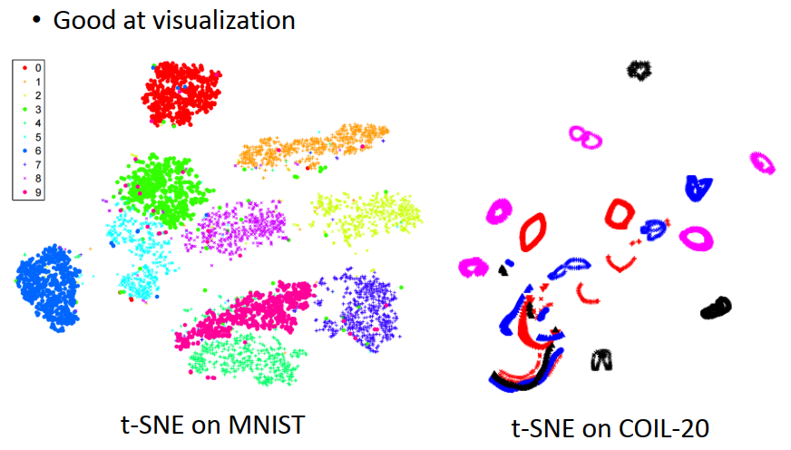

所以如果你看  t-SNE  的话，这个是在MNIST 上做  t-SNE 的结果，不同的数字就会分成一群一群的，通常你在做 t-SNE  的时候你可以看到的结果就是他会把你的 data point 聚成一群一群的，如果今天本来这两个 digit之间就有一些gap的话，做完 t-SNE以后，他会把这个gap特别强化，也许在原来的data point 里面，他的gap 没有那么明显，但是做 t-SNE 以后这个 gap 会被凸显出来，

右图是 t-SNE 做在COIL-20 的这个 corpus上面，这个corpus上面每一个颜色代表了某一个object，如果你用  t-SNE 做降维的话你可以发现非常有趣的情况，比如说每一个 object 就是一个圆环，或者是一条直线，比如说这个圆环就代表了说可能是某一个茶壶或者是某一个小汽车把它转一圈，然后他就绕着这个圆环走一圈，

以下这边有一个animation，也是从 reference上截下来的，

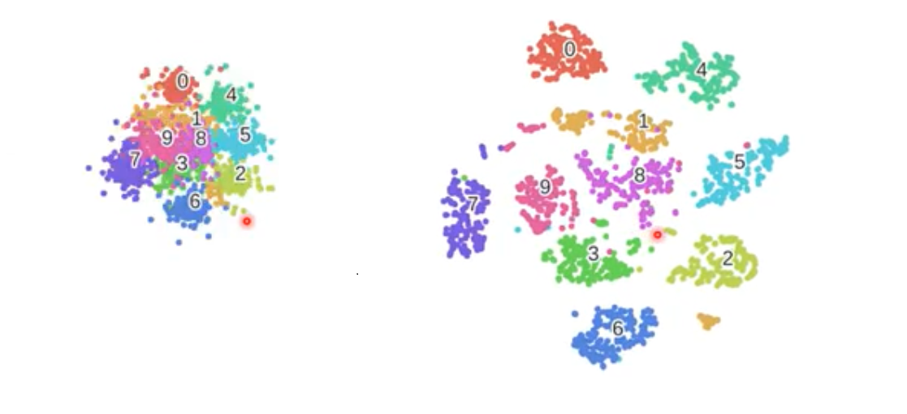

 t-SNE 是怎么解这个式子的呢，怎么找这个z的去minimize这个L的呢， t-SNE 用的就是 gradient descent，微下去就对了，所以你可以 visualize 随着 gradient descent 参数的update，data point 的变化，结果看起来像是这个样子(动图，data point 逐渐向数字聚拢)，原来所有的点都聚集在一起，随着参数的update，那他会分的越来越开，最后就散布开来这样子，这边每一个点代表一张image，其实这边用的并不是 MNIST，run MNIST的话结果看起来其实不会这么好，如果看前面这一张图，他可以把不同的数字分的蛮开的，就如果没有记错的话，他其实也不是直接做在 pixel 上面， 直接做在 pixel 上面没办法分的这么开，他应该是先做PCA 降维以后，才去做  dimension reduction 的，但就算是这样，还是有一些点分不开，比如说你看桃红色的点是9，青色的点 是4 ，4和9 其实还是很难分开的，

等一下我们会讲 deep Autoencoder，他其实有办法把 4 和9 分开，这边是一些 reference，刚才那个动画 是来自于下面这个tutorial ， t-SNE 其实你发现一般machine learning 的教科书是不会写的，因为他是一个还蛮新的方法，08年的时候 propose

