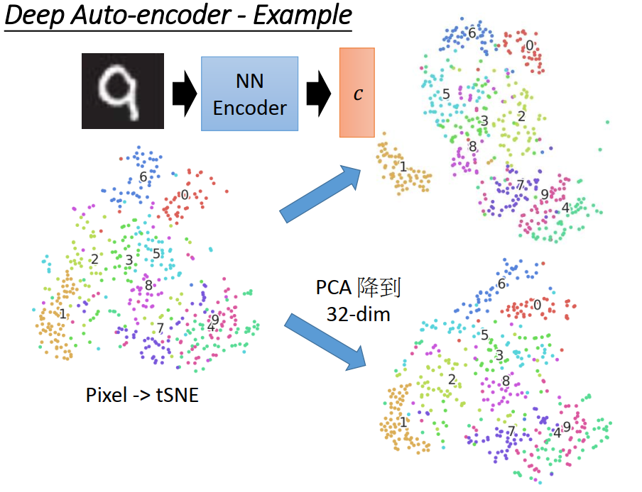

[TOC]

# P 27 16: unsupervised-learning -Auto-encoder <!-- 37' -->

## deep Auto-encoder

我们来讲一下 deep Auto-encoder，现在unsupervised learning 是一个很重要的问题，举例来说，在三巨头在nature的那一篇 deep learning 的overview 的paper 里面就说“We expect unsupervised learning to become far more important in the longer term. ”因为动物和人他们在学的时候我们通常用的是 unsupervised learning: we discover the structure of the world by observing it, not by being told the name of every object，我们通常是做 unsupervised learning，比较少做 supervised learning，

Yann LeCun 他的Facebook 上有这样一则 column(专栏)，他这样说的就是：如同之前说过的，多数人和动物多数的时候都是做 unsupervised learning，然后举了一个比喻，他说如果 intelligence 是一个蛋糕，unsupervised learning就是那个蛋糕，supervised learning 是蛋糕上的糖霜，reinforcement learning 是蛋糕上的樱桃，我们现在只做做了糖霜和樱桃但是没有做那一个蛋糕，我本来听到这个例子的时候我的第一个想法是，哦，其实那个蛋糕上面最重要的就是樱桃，蛋糕的本体不就是樱桃，小时候吃蛋糕的时候不就是要抢那一个樱桃吗，下面海绵的部分是没有人要吃的，要吃就吃那个樱桃，我本来以为这个是要讲 reinforcement learning 很重要，就像是樱桃一样，但仔细想想，再看他的上下文，他不是这个意思，他的意思就是说 unsupervised learning 很重要，而且他会之所以这样回，是因为有另外一个人说了  reinforcement learning  可以解决所以的问题，然后 Yann LeCun  不以为然，所以有了这个powered这样，并不是他用樱桃来比喻 reinforcement learning ，并不是说 reinforcement learning   是最重要的部分，那总之就是这样

## Auto-encoder

那我们要讲的是用deep learning 做 unsupervised learning 的一个方法，这个叫做Auto-encoder，我们要做的事情要是降维，就跟刚才PCA ,t-SNE 做的事情是一样的，只是我们现在降维的时候我们要用 neural network来做降维，**这个可以帮助我们降维的 neural network 我们叫做encoder，**这个 encoder他就是一个很多个hidden layer 的 neural network，就是我们今天把一个image丢到这个 encoder 的时候他会output一个 code，就是output一个降维以后的结果，我用的这个东西叫encoder，所以output我们就叫code，他会output一个 dimension reduction 的结果，这个 dimension reduction的结果远比PCA复杂，因为他不是一个线性的东西

但是这个network要怎么train呢，我们知道 supervised learning 怎么train，在做 supervised learning 的时候，我们要给 network input 一个output，我们要告诉network，看到这个input x,你要output 什么样的output $\hat y$,但是在learn 这个encoder 的时候我们并不知道code长什么样子，我们只有一大堆的input，但是我们不知道这个 code 应该长什么样子，那怎么train这个 encoder 呢，

要train这个encoder我们要同时train 另外一个东西，这个另外一个东西叫做decoder，decoder 做的事情就是给他一个code，给他一个code其实就是一个low  dimension  的vector，那经过这个 decoder以后，他就output成我们原来要考虑的 object

假如说我们现在要考虑的是image，我们要对image做降维的话，那encoder就是input一张image，output 一个code，decoder就是input一个code，output一张image，image 是700 多维的vector，code可能是一个 low  dimension  的，比如说10维的vector，

encoder 和decoder 独自存在的时候都无法学，但是把他们接在一起的时候就可以学，

我们等一下再细讲这个encoder和decoder 的结构，但是这件事情就跟我们刚才讲的PCA 很像，我们说PCA在做的事情是input一个vector x,这个x其实是有做过 normalise 的，然后乘上一个matrix w 得到一组code c,这组 code c 就是那些 component 的weight ，那把这个code c 再乘上同一组weight，乘上一个w 的 transpose，我们可以得到一个 reconstruction 的结果 $\hat x$,那PCA 要做的事情就是他这个W 和 W^T^其实有一个 closed-form solution，他不需要用 gradient descent train，用 gradient descent train没有比较有效率，就是用直接找  closed-form solution 就好了，你可以让 x 和 $\hat x$,他们之间的距离，他们的 Euclidean distance 是被minimize，

如果你把这个东西想成一个 neural network 的话，前面这个x 就是一个 input layer，后面reconstruct 出来的  $\hat x$就是 output layer ，中间每一个 component 的weight ，这个 component 是存在这个 w 里面，component 的weight 就是c ,component 的weight 就是 hidden layer，但是这个 hidden layer是linear 的hidden layer，他没有 Activation Function，这个是PCA。

那如果我们把这个东西当作一个  neural network 来看的话，我们会把中间这个 layer 称之为 Bottleneck layer，因为他特别的窄，因为code 就是要low dimension，我们要做降维，设计这个c是 low dimension 的，所以他的 维度特别小，所以叫Bottleneck layer，中间前面这个从x到c 的过程就是encode，从c 到  $\hat x$的过程就是 decode，而hidden layer 的output 就是我们要的code

### Deep Auto-encoder

那 Deep Auto-encoder 其实和PCA 比起来 就只是多加了几个 hidden layer 而已，怎么做呢，我们有一个input ，然后通过好多好多个layer 以后得到中间有一个 Bottleneck layer，Bottleneck layer 的output 就是code，然后再把这个code通过好多好多个 layer 以后 得到  $\hat x$，然后我们希望input的x 和 output 的$\hat x$他们的距离越接近越好，

input一个x 变成code，code再变成 $\hat x$，他可以reconstruct 成原来的 input，这个很早很早以前就有了，Deep Auto-encoder应该是在Hinton 在06年的science 上，10年前的   science  的paper上面提出来的，那个时候要train 这么深的 network，会需要用 RBM pre train，现在其实不需要了，

有时候我们会让这个 encoder和decoder做一下参数的限制，我们刚才看到说在做PCA 的时候encode 和decode 的参数互为  transformation，那今天你在做 Auto-encoder 的时候你可能也会希望对应的layer 他们的参数互为  transform，也就是第一个layer 的参数 W~1~，最后一个layer 的参数应该是  W~1~的 transpose W~1~^T^ ，那第二个layer 的参数 W~2~和倒数第二个layer 他的参数是  W~2~^T^ ，

但是这件事其实现在通常是没有必要的，现在做 Auto-encoder 的时候你 不见得会把这个  constrain加进去，加进这个 constrain 的好处就是你可以减少参数量，比较不容易over fitting ，但是 这件事情现在看来未必是必要的，

### 结果

那以下这边有几个结果，是来自于Hinton 06年，10年前的那一篇paper，那这是一些那篇paper里面的实验，说如果我们今天原来的image 长这个样子，原来的 手写数字长这个样子(第一张图)，我们用PCA 做降维，用PCA 从784 维降到30维，再做 reconstruction，把他展回来，变回原来的784维，那我们看到的图是这个样子(第二张图)，因为PCA 他本身就是线性的，那你把它做一个 线性的转换再转回来，他loss的information 多，所以你会发现  reconstruction回来的图是不清楚的，

那如果你是用  Deep 的Auto-encoder ，在 Hinton  的 paper里面，他叠了3个 hidden layer ，1000，500，250变到30 ，然后再用 250，500，1000 再把它展回来，如果是用  Deep Auto-encoder，通过这么多复杂的 hidden layer 以后，reconstruct 的结果 可以很接近perfect 的结果，原来 的image跟  reconstruct 回来的 image 几乎是一模一样的，但是这件事情并不是重点，就是  Auto-encoder 他的  reconstruction 的结果多好其实不是重点，比如说有同学来和老师说，哦，老师我这个  Auto-encoder  train 的超好，怎么超好呢，我这个   reconstruction  的error 是0 ，为什么呢，因为我中间每一个layer 统统是1000维这样子，所以这个network他做的事情就是把 784维，一直copy一直copy，copy到最后再把它丢出来，reconstruction  可以input和output 一模一样，你要不要直接把 input image 丢出来就好了，

就算是说你的  Auto-encoder 可以让 reconstruction error 压得很低，但是这件事情不是重点，重点是你现在的code做得有多好，有时候你就算有一些  reconstruction error，但是你的code真的有learn 到东西，这样反而才是我们要的，你要 reconstruction error低很简单，你只要把 hidden layer 开大，reconstruction error马上就下降了，但这不是我们要得，

### code到底做出来有多好

所以我们要看一下这个 code到底做出来有多好，这个是也是Hinton那个science的paper 上的结果，他说如果做 PCA 降维的话，现在是改成直接降到二维，整个结果会烂掉（上边的图），那和我们刚才在第一堂课的结束的时候看到的结果是一样的，做PCA直接压到二维会坏掉，如果今天做的是  Auto-encoder 压到二维那得到的结果是这个样子（左边的图），不同颜色代表的是不同的数字，那你可以从这个实验结果上看到说，不同的数字他们做完  Auto-encoder 以后得出来的code是分的蛮开的，

### De-noising auto-encoder

那如果你要让 Auto-encoder  train 的更好的话，有一招叫做 De-noising的 auto-encoder，因为我们有时候都会很害怕说   Auto-encoder会不会就只是 硬记了input的东西，然后再把它丢出来，他并没有真的去压缩理解他，为了要让 Auto-encoder学的更好，更robust（鲁棒性），我们会在input东西上面，input object  上面加上 noise，我们把x加上noise 变成 x‘，再用encoder把他encode 成c,再用 decoder 把它解回来，

那 decoder并不是要解回这个 x',而是要解回有加noise 前的x，这样你的encoder 不止learn到要做压缩这一件事情，他还要learn到他必须要把 noise 消掉，这样在做 decode 的时候 $\hat x$才会等于原来有加noise前的clean 的结果，注意不是要让 $\hat x$和x'像，而是要让 $\hat x$ 跟 x像，

### Example

这边我实际自己做了一下 Deep Auto-encoder，左边的图是我们刚才看到的，直接从pixel做到 tSNE 的结果，4跟9其实是分不太开的，那我有试一下说我先用PAC把pixel 统统降到32维，然后再做tSNE, 其实我有试别的维度，那得到的结果大概就只能做到这样，也就是4跟9仍然是非常接近的，tSNE中 4跟9 是几乎粘在一起(右下角)，PCA稍微有点分开，但还是几乎分不开(右上角)，

试着做了一下  Auto-encoder，我得到的结果，我learn好一个 Auto-encoder以后，我要的是encoder，把 encoder拿出来，丢一张image 进去，我就得到一个code，那注意一下，tSNE 的这些image，这边 visualize这些image 在train那个  Auto-encoder 的时候，这个Auto-encoder  从来没有看过这些 image，他train 的时候是用一组training 的image train，但这些 testing 的image 是 Auto-encoder 从来没有看过的，如果是他看过的话，他其实可以分的更好，但是这些image 是 Auto-encoder 从来没有看过的

我们看一下右上角的结果，我们发现说如果用这个 encoder做降维的话，因为有很多个hidden layer 的关系，可以发现在做完降维以后，不同的digit ，也就是不同颜色的这些data point，他们其实是会分的比较开的，举例来说我们看在这边直接用pixel 加到 tSNE 的 时候虽然1会出现在左下角，但是还是会有很多不同的data，不同的digit跟1 混杂在一起，这边有一些8，这边有一些5，这边有一些7 等等，1跟其他的data是有点分不太开的，但是做完这么多个layer 的transform 以后，可以把1拉到很边边，和其他的data几乎没有overlap 的，6和0也都被拉出去，那4，9，7他们真的是很像，所以做完encoder以后你也没有办法把他们完全分开，但是你会发现说7跟9跟4他们现在是被分的比较开的，他们并没有像左边这个case还有右下角这个case 4跟9 几乎是黏在一起的，encoder 的4跟9是可以被分开的，那他们排成一个非常有趣的样子，紫色区域就是7，再过去就是9再过去就是4，他们距离很近，但是他们并没有被完全的混在一起，这边是image得例子

### Auto-encoder – Text Retrieval

Auto-encoder 也可以用在文字上，我们知道说在做文字的搜寻的时候，文字搜寻怎么做呢，所谓文字的搜寻意思就是像Google 这样，输入一个query，然后呢就告诉你说哪些文章是你要找的。那怎么做呢，有一个最传统的方法叫做 Vector Space Model，Vector Space Model的概念就是把每一个document 他的query统统用一个vector来描述他，那接下来你就会计算query 和每一个document之间的cosine similarity，计算query跟每一个 document 之间的角度，看哪些 document跟 query的相似度特别高，那他就是搜寻的结果，

那怎么把一个 document 描述成一个 vector呢，最无脑的做法就是用bag-of-word,所谓用 bag-of-word 意思就是，假设我现在有一个句子，叫做”This is an apple“，我要把它描述成一个 vector 怎么做呢，我们就开一个高维的vector，这个 vector的维度非常高，他的维度就是看现在世界上有多少个词汇，他的dimension就有多少，比如说英文通常至少10 W个词汇，那这个dimension就是10 w维，那每一个dimension都对应到一个word，比如说this有出现在句子里面，那this 对应 的dimension就是1，is有出现，他对应 的dimension就是1，an有出现，apple有出现，他们对应的dimension都是1，其他都是0，但是用bag-of-word的坏处就是他虽然很简单，但是没有考虑到semantic的东西，你没有考虑到语义的东西，有很多词汇他是同义的，但是用 bag-of-word 来看的时候他们就是完全不一样的，用bag-of-word你只能做到字面的比对，如果你的query 跟  document里面有出现同样的词汇，出现的同样的词汇出现的越多，这两个vector就越近，听起来没有什么特别厉害的地方，

但是我们知道说一个搜索引擎他真的要做好，他不可以只有考虑字面的意思，他还有考虑语义的意思，就是你输入一个词汇，你会希望他不是只有把包含这个词汇的文章找出来，他希望所有有关联的文章也要被找出来，那所以怎么办呢，如果我们还是套用Vector Space model 的话，那么我们就不要用 bag-of-word这样子的representation，我们要用更好的representation，可以表示语义的representation，

这个实验结果也是出自Hinton 10年前的那个science的paper，这边的做法就是叠一个 Auto-encoder ，这个Auto-encoder 把bag-of-word 的feature，这边是2000维，出现频率比较少的词汇就不考虑他了， 把  bag-of-word 的feature通过 Auto-encoder以后降成二维，也就是说每一篇文章现在就是**二维空间上的一个点**，那如果把这些点 visualize一下的话，现在用的data是20 Newsgroups 的data，就是用一堆新闻的data，把这些新闻的data，本来用 bag-of-word 表示，现在统统用  Auto-encoder学一下降到2维的话，然后呢再把这些新闻画在图上，看起来像是如图(右上角)，

这个每一个点代表一篇新闻，不同颜色的点就代表是不同类的新闻，在20 Newsgroups 里面会告诉你每一篇新闻属于哪一类，你会发现他的散布是个非常impressive，他的散布像是一朵花一样，不同类别的文章就是花的其中一个花瓣，像你在做搜寻的时候，有时候你输入一个query，你也可以通过这个 encoder把它变成一个二维的vector，假设输入一个query落在这个地方，那你跟其他的文章算 cosine similarity，就可以把这一整类的文章都找出来，虽然这一类的文章里面，有一些文章可能跟你原来的 query根本就没有重叠的词汇，但是经过这个Auto-encoder  的降维以后，machine可以把同类的文章找出来，就算他们可以没有一样的词汇，也有可能被找出来，他们的相似度仍然可能是大的，那如果同样的方法你用一个传统的叫做LSA的也是一个线性的降维的方法的话，你得到的结果是比较差的，因为LSA就是线性的，所以投影到二维以后，结果坏掉了也是很正常的，不同类别的文章统统都被塞成一坨，他们都没有办法把它分开，

### Auto-encoder –  Similar Image Search

那也可以做影像搜寻，这个影像搜寻的结果是来自于Hinton的coursera 的课程的投影片，这个是2011的paper，这边做的事情是说如果我们今天要做影像搜寻，最简单的做法就是把一张truly 影像，你要做Google 以图找图，最简单的方法就是输入一张图片，然后跟其他的图片算他的相似度，比如说你输入一个 Michael Jackson的图片，那你就把Michael Jackson 的图片跟你data base里面其他图片算相似度，看哪一张图片最像，那就是搜寻的结果，举例来说在例子里面得到的结果，和Michael Jackson最像的图片，如果你直接算他的pixel上的相似度的话，得到的结果是这个样子，你会发现说 这个Michael Jackson 的图片跟马蹄铁是非常像的，这个头发就是马蹄铁，他很像，所以搜寻到马蹄铁的图

那如果你用 Auto-encoder的话 怎么做呢，一样就是learn 一个encoder，learn一个encoder，把image 丢到这个encoder 里面通过很多个layer transform以后变成code，当然你还有另外一个decode，会把这个code解回原来的image，我这边就是图小就没把它画出来，

那今天这个encoder 丢进去变成code，code会把它解回原来的image，这些解回来的image其实非常的糊，现在看来说这个图好糊，当年是说，哇，这怎么这么清楚这样子，因为现在你如果用GAN来生成这个图的话，就知道我们会稍微用其他方法生成图的话，就可以生成很清楚的图这样子，但是当年如果你用这么多个hidden layer做出来，跟其他方法比起来，这个产生的 reconstruct 的结果已经非常清晰了。

但是 reconstruct 方法的结果清不清楚，这个不是重点，重点是说如果把每一个image用一个code来表示，那我们搜寻的时候不是算pixel上的相似度，而是算code上的相似度的话，能不能得到比较好的结果，上面是pixel上的相似度，是我们刚才在前一页投影片已经看到的东西，如果现在把每一张image用256维的code来表示在code上面，直接算相似度的话，得到的结果会是像下面这个样子如果输入一个Michael Jackson 的图，你会找到其他的人脸，也就是说这个encoder会知道说这些都是人脸，我们应该要用同样的code来描述他，我们应该用同样的code里面同一个dimension来表示他，

### Auto-encoder for CNN

那刚才讲的 Auto-encoder ，encoder和decode的部分都是用 Fully Connect 的 Feedforward Network，你完全可以用CNN来做这件事,尤其是如果我们现在处理的是影像的话,你可以用CNN来处理是更有效率的，你可以do一个CNN的encoder，所谓CNN的encoder就是现在把一个image通过Convolution,再通过Pooling,再通过Convolution,再通过Pooling,就把他变成一个code,然后做decoder是什么意思呢,做decoder就是你把这个code做 Deconvolution,等下会解释Deconvolution 是什么 ,顾名思义Deconvolution显然就是 Convolution 的相反, Convolution反过来就是 Deconvolution ,然后Deconvolution,再来就是Unpooling,Deconvolution ,再来就是Unpooling,那这个Unpooling显然就是 Pooling 的相反,等下我会解释他是什么,然后你希望说最后你 reconstruct 出来的结果会跟input image越像越好,然后再去train 这里面encoder 和decoder所有的参数,就可以得到一个CNN的encoder 和一个CNN 的decoder,

### CNN -Unpooling

那用CNN 做 Unpooling是什么意思呢,我们都已经知道max pooling 是什么,做 max pooling的时候就是我们现在这个是 某一个filter 的output,那我们就说 filter 的output 4个一组,4个一组选一个最大的,这个是max pooling ,除了选最大的以外,我们同时还要记得说谁是最大的,谁的table记得说谁是最大的,

那接下来在做 Unpooling 的时候我们有一张比较小的image,我们要把它做扩展，我们要把每一个pixel ，扩展成4个pixel，黄色就变成4个黄的，绿色就变成4个绿的，蓝的变四个蓝的，红的变4个红的，我们做 Unpooling  的时候其实就是 max pooling 的相反，比如说我们看黄色这个部分，黄色这个部分本来 max pooling 取max是从左上角取，这个时候你就把黄色这个值贴在左上角，但是被 max pooling 丢掉的那些值，我们不知道他的值是多少，那我们就统统补0，同样绿色这边，本来绿色的max pooling 只有右下角取出来，我们就把绿色的值放在右下角，其他地方补0 ，以此类推就行了，所以当你做 Unpooling   的时候你会把image变大，做pooling 是把image变小，做 Unpooling   是把image变大，本来一张image 是右上角左图，做Unpooling   以后变大很多，变得原来的两倍，

#### CNN  \- Deconvolution

实事上 Deconvolution 就是 Deconvolution，怎么说呢，很多人想不太清楚这件事情，所谓 Deconvolution是怎么做的呢，我们现在有一个input，我们做 convolution 的时候就是说，前三个是同一个region,第二列第一个有一个filter，他和这个region的data乘上这三个橙色蓝色绿色的weight得到一个output，然后呢我们会把这个filter移点，同一个filter乘不同的input，一样的weight得到另外一个output，这个就是  convolution 在做的事情，

Deconvolution顾名思义就是要反过来，我们原来是用3个value乘上不同的weight产生一个value，Deconvolution就是反过来，就是很直觉的，就**是一个value乘上3个不同的weight变成3个不同的值**，本来这3个值变一个值，现在一个值变3个值，原来我们在3个值变一个值的时候，这些region 间有重叠，前面三个和中间三个和后面三个是有重叠，所以我们一个值长三个值的时候也会有重叠，再把重叠的地方加起来，其实这件事情你会发现说他其实就等同于是做一个 convolution ，你先把原来的这三个值旁边补很多的0，接下来你做一发 convolution ，然后你会发现说中间的图表示的事情和右边的图表示的事情是一样的，

值A是值1乘上橙色的weight，得到值A，在右图我们一样是做一遍 convolution ，这个convolution  的filter 的三个weight跟左边图的三个weight的值是一样的，都是橙色蓝色绿色，只是放的方向不太一样，放的顺序是反过来的，那你会发现，假设补的灰色就是0，没有影响，值2乘上橙色的这个值就变成B这个值

再看值C ，值C是值1乘上蓝色加上值3 乘上橙色，值D是值2乘上蓝色加上值4乘上橙色，值E是值1乘上绿色加上值3 乘上蓝色加上值5乘上橙色，值F是一样的，是值2乘上绿色加上值4乘上蓝色加上值6乘上橙色，

所以Deconvolution 其实就是convolution ，只是他的weight是不一样，然后旁边需要补0 而已

### Auto-encoder – Pre-training DNN

那这个Auto-encoder可以怎么用呢，除了做降维以外，因为可能觉得就算我把一大堆对应到数字的image做降维，降到10维，降到2维，你可能说又怎样呢，我得到一大堆二维的vector，我还是不知道哪一个image对应到的是哪一个digit，那这个有什么用，

所以 Auto-encoder他也可以跟 supervised 的方法做结合，你可以用 Auto-encoder先去Pre-train 你的 network，什么意思呢，假设我现在要做手写数字辨识，我就是要搭一个network，input 784维，通过两个1000维再通过一个500维，最后output 10维做手写数字辨识，我可以Pre-train一个 Auto-encoder，那train  Auto-encoder的时候，他是unsupervised ，所以这个thin narrow?特别适合这个 semi-supervised 的task，就是你有大量的手写数字辨识的image，但是你的data很少的时候，特别适合做这样子的事情，

 Auto-encoder 的training 是unsupervised 的，那你可以train 一个Auto-encoder ，他input一个x,然后他中间的hidden layer 是1000维，然后output是$\hat x$，这边要稍微注意一下，因为一般我们在train  Auto-encoder 的时候你都会希望code是bottleneck，希望code的dimension是比较小的，但是这边如果code的dimension比input还要大的话，那你的network可能一不小心就是把784维做一次copy再丢出来，那你的network就什么都没有learn到，所以今天假设你要处理的状况是 你的 Auto-encoder 的code是 high dimension 的时候，那这边code的dimension要配合我们的network，你的network是1000维，我们等下要拿这个 Auto-encoder 的参数去当作train这个参数的initialize的参数，所以这边1000维，这边也要有1000维，那我们要让这样子中间宽的 Auto-encoder train 好必须要加一些 regularization 或者是要做 De-noise 的Auto-encoder 才能够train出比较好的 Auto-encoder ，你要给他加一些regularization 绑住他的手脚他才能不会直接把input copy到hidden layer里面去，然后再找回来，这样等于啥事也没干

那我们先train一个Auto-encoder ，然后得到weight W^1^ 和W^1^’ ，怎么把W^1^ 留下了，接下来我们把所有的x 都用W^1^ 转成一个新的feature 叫做a^1^ ，接下来再learn另外一个Auto-encoder，这个Auto-encoder 把1000维变成code然后再把它展会来，然后呢要minimize reconstruction error 然后得到另外一个weight  W^2^ ，接下来你把所有的x 通过  W^1^和   W^2^ 得到一大堆的feature 就是a^2^ ，接下来再train第三个 Auto-encoder ，得到 W^3^，接下来你就把W^1^,W^2^,W^3^ 当作你的network的初始的参数，把最后的output layer 接上去，output layer做 random  initialize 就好了，然后back propagation 去做fund-tune，fund-tune所有的参数，这样就可以用  Auto-encoder 来 Pre-train一个比较deep 的network，

### Restricted Boltzmann Machine

那在早年train 一个deep 的network比较困难，往往没有办法train前面几个layer，你用  Auto-encoder 就可以先把前面几个layer train好，他还有很多类似的方法可以做到同样的事情，一个比较知名的就是大家耳熟能详的 Restricted Boltzmann Machine，我这边就不打算讲Restricted  Boltzmann Machine，因为你不知道是什么是critical? model，你没办法听懂Restricted Boltzmann Machine，他看起来很像 neural network，但他不是 neural network，如果你不了解这件事，你自己去读文献的话就会卡到不行，他不是 neural network，

### Deep Belief Network

还有另外一个东西，听起来和  neural network很像，叫 Deep Belief Network，但他也不是neural network，他也是 critical?  model，Deep 听起来好像是deep neural network，但他不是deep neural network，这边我就留一些 reference 有一个很好的线上课程给大家参考

## decoder

那我们刚才讲说在train  Auto-encoder 的时候，我们train了一个encoder train了一个decoder，那我们现在可以用 encoder 来做降维，那decoder这个副产物其实也是有用的，他有什么用呢，他可以拿来产生image，我们可以拿一个decoder出来，然后把一个code 丢给decoder，然后他就可以产生image，

举例来说我们现在做一个deep 的  Auto-encoder ，然后这个  Auto-encoder  的  encoder 可以把所有的image都降到2 dimension的平面上面，然后接下来你在这个2维的平面上面取某一个 region，在这个region里面等距的sample一些点出来，就是sample一大堆二维的vector出来，等距的sample 二维的vector，然后一个一个丢到decoder里面去，每一个二维的vector就会变成了一张image，画出来的结果就是这个样子，

因为你今天在做sample的时候，比如说如果你sample到没有数字的地方，你想算出来的东西就不是数字，你说我怎么知道数字出现在什么地方呢，你在training 的时候你可以对code做 regularization，你可以说我强迫code的分布都要接近于原点，如果我强迫code的分布要接近于原点的话，那我们的code的分布就会长这个样子，就会以原点为中心散布开来，接下来你在原点的附近等距的sample一些data point，你画出来的图长的就是这个样子，

你看这个蛮有道理的，从左到右，是从圆圈变成棍子，code的x轴好像代表了有没有圆圈，有没有一个圈，那纵轴(code的y轴)好像代表了这个digit 的方向，1本来是向左斜的，接下来变成直的，接下来变成向右斜的，所以在做Auto-encoder 的时候你不只有一个encoder可以做dimension reduction，我们还有了一个decoder，他可以生出我们要的东西，比如说生出一张image，这个我们下一堂课会再讲到，

