[TOC]

# P 28 17: unsupervised-learning -Deep Generative Model(Part Ⅰ) <!-- 29' -->

## Generative Model

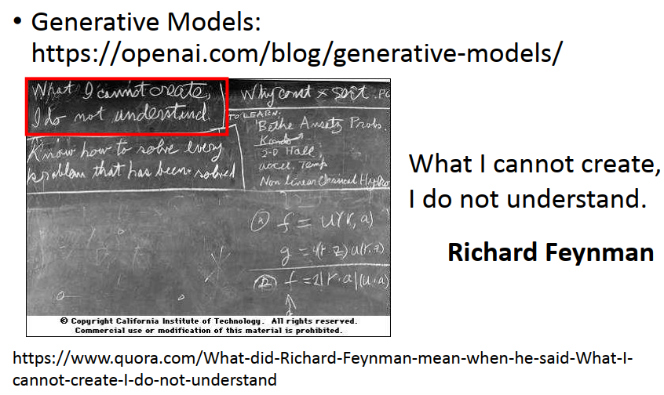

接下来我要来讲一下Generation 的model，有关Generation 的Model你可以看一篇很好的reference，这个是openai 写的一篇科普的文章，我把它列在这边，那在这篇文章里面，他开头就是引用这个费曼的话，这句话来历是什么呢，据说费曼过世以后，有人去他的办公室，擦一下他的黑板，在黑板上留下这句话，这个是他办公室的黑板，这一句话写在左上角，他说“what I cannot create,I do not understand.",所以如果一个东西他不知道怎么产生他的话，他就不算是真的完全理解，那所以对于machine来说，或许也是一样的，

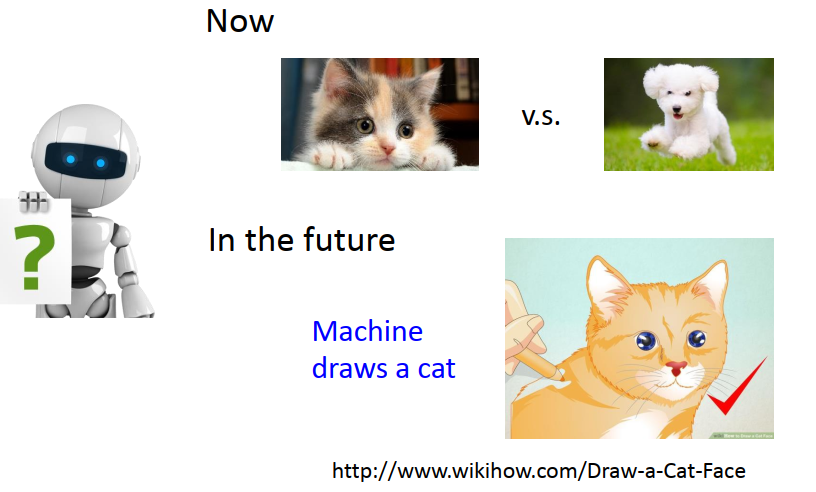

比如machine在影像处理上machine 可以做到分类，你可以让他见识猫和狗的不同，但他或许并不真的了解猫什么，或许他并不真的了解狗是什么。也许在未来有一天，machine它可以自己画出一只猫的时候，它对于猫这个东西的概念或许就不一样了。而这个是现在一个非常热门的主题，有很多相关的研究，我们就来稍微来overview一下相关的研究。

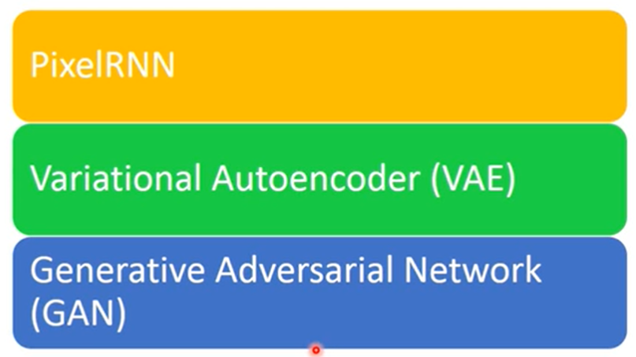

在这些研究里面，大概可以分成三个方法。这边分别是：PixelRNN, Variational Autoencoder (VAE), 和Generative Adversarial Network(GAN)，这些方法其实都非常的新，其中最旧的是VAE，VAE是2013年提出来的，像GAN是2014年提出来的，虽然他提出来还不到2年，有时候我们一般在上课的时候，尤其在必修课里面，你听到的每一个东西往往都是，比如说50年前，100年前propose出来的，但是在 machine learning 这个领域里面，他的变化是非常非常快速的，所以有很多很多未来可能会成为非常经典的方法，他是这几年才不断的推陈出新，所以我试着在课程里面cover一些比较新的技术，让大家知道说这个领域他的变化是非常非常的快的，

### PixelRNN

那我们先来讲一下PixelRNN，我们今天就先讲一下这些方法大概是怎么运作的，然后下一次再细讲他的原理，我们来讲一下这个PixelRNN，虽然我们还没有讲过RNN是什么，但我相信这个方法你是可以听的懂得,因为他非常的直觉,

假设我们今天目标是要让machine自己画一张图出来，比如说我们今天要让machine画出一个解析度是3*3有9个 pixel的image。肿么做呢？我们让machine每一次就画一个pixel，他每一次就点一个点,点完9个点，就画出一张图了。

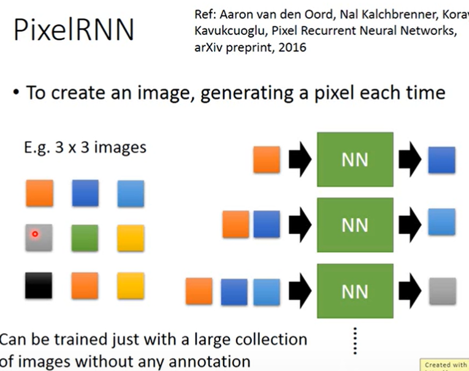

怎么做呢,假设我们先随机给这个image涂一个红色的pixel，接下来你就learn一个model，他input就是已经在图上的红色的pixel，他的output就是接下里要吐出什么颜色的pixel。假设他吐出蓝色的pixel，那你就把蓝色的pixel再摆到image上面。那你说肿么描述一个pixel呢,一个pixel不就是RGB三个颜色所构成的吗，所以一个pixel就是一个三维的vector。所以你就是learn一个neural network，它可以吃一个三维的vector，然后output另一外三维的vector,这个三维的vector的三个值就代表这个pixel的RGB三个值，你就把这个neural network的output转成一个颜色，然后把它涂上去就结束了，接下来这个图上有两个点了。

那你就再用同一个model ,他input红色和蓝色的pixel，接下来他就output下一个pixel,比如说他是浅蓝色的pixel。那这边你可能会有的问题就是：neural network不是input一个 fixed-length vector，output 另一个fixed-length vector吗，比如说input 3维他就固定只能input 3维,那你怎么input一个pixel，又用同一个neural network 又input两个pixel呢, 这个就是RNN可以处理的地方，RNN他可以处理 variable length的input 。因为我们还没有讲过RNN,如果你觉得你无法理解怎么处理一个variable length 的 这个pixel的话，你就想像说,还没有pixel的地方我就补0。就想象说我这边空白的地方我其实就补一个白色的pixel而已.

那接下来你给它红色、蓝色和浅蓝色的pixel，接下来它吐出一个灰色的pixel，然后你就再把灰色的pixel画到图上。接下来就重复刚才的步骤，给他这四个pixel,然后把下一个pixel再涂上去。那你就把9个pixel都涂完。就画完一张图了。

那要train这种network很简单，因为他完全就是unsupervised，不需要任何的label。不像我们在作业3 里面你要知道某一些image他的label是什么,你才能够train一个image的classifier,这边不用, 你就收集一大堆的image，然后machine就会知道说,看到第一个pxiel是这个颜色，第二个pixel应该是什么，看到第一个和第二个pixel是这个颜色 ，第三个应该是什么，看到一二三个pixel，第四个pixel应该是什么，这个就叫pixel RNN。你可能想说,这一招这么简单，它会work吗,也让我们蛮惊奇的,他其实是work的。

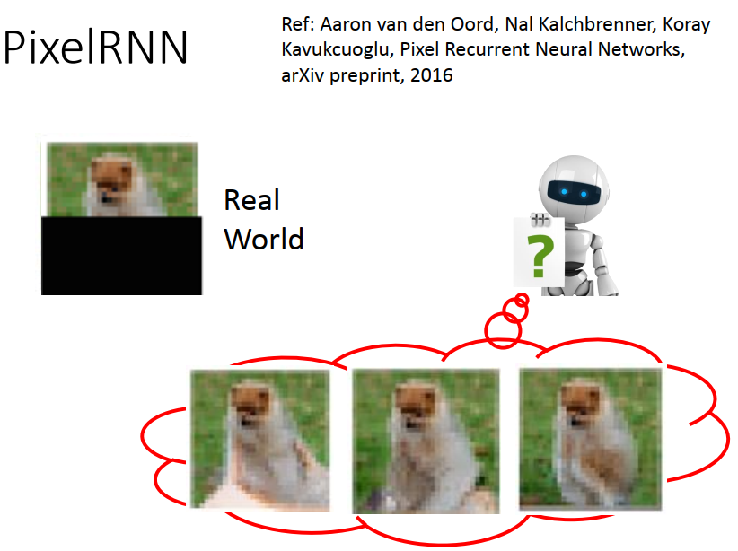

而且在不同generate image的方法里面，现在就我所知应该是Pixel RNN他产生的图是最清晰的，其他的方法产生的图没有办法像Pixel RNN 这么清晰。

如图是deep mind 的paper 的一个例子,这个是真实的image这个是一只狗，如果我们现在把这只狗的下半身遮掉。接下来我们就要让machine去 predict说：given这些pixel(为遮住的image)，接下来狗的下半身应该要长什么样子，machine把狗的下半身画出来。那machine画出了这样子的狗(如图),这样子的狗,还有这样子的狗,有看起来像猩猩的狗还有看起来像鸡的狗,

### 应用在语音上

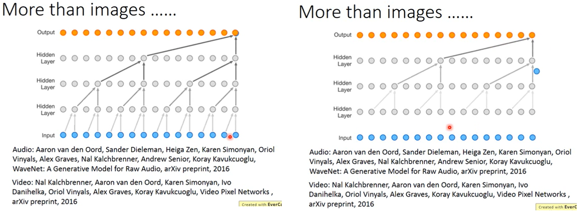

然后这个方法其实也可以被用在不止是影像上,他也可以被用在语音上,非常著名的例子就是Wave Net,我们知道Wave Net可以做语音合成,那 Wave Net到底怎么做的呢,其实他的概念非常简单,就是input一大堆,这边底下的每一个node,蓝色的圈圈,代表的就是wave form,wave form大家知道吗,就是,反正你就把声音取进来,然后直接取取样,然后看他的amplitude,完全不要做任何什么feature transform什么,统统都不要,这边每一个蓝色的点,就是声音讯号上面的一个sample,

那今天就是这样,给定前面一段的声音讯号,然后 predict下一个sample 的结果,然后把它放下来,再predict下一个sample 的结果,再放下来,再predict下一个sample 的结果再放下来...就是这样,然后接下来你就是硬train 下去就结束了,然后你就可以合出一段声音,这个是在语音上的应用,

### 在影像上的应用

在影像上也有应用,在影像上你也可以做一样的事情,只要让machine看过很多个Video,他就可以 predict 说给他一段video接下来会发生什么事情,比如说在Google的demo里面，他会demo说,它的那些影像都是机器人手背上的影像，它在机器人手背上装了一个摄影机，所以他可以录说机器人的手背看到的影像,那你就可以看到说,影像的前半段是机器人的手伸向一块抹布，然后影像的后半段是,机器人把抹布拿起来。但是把抹布拿起来的那些影像是机器自己脑补的结果，并不存在于现实生活中，机器自己predict接下来会发生什么样的事情。

### 练习生成模型

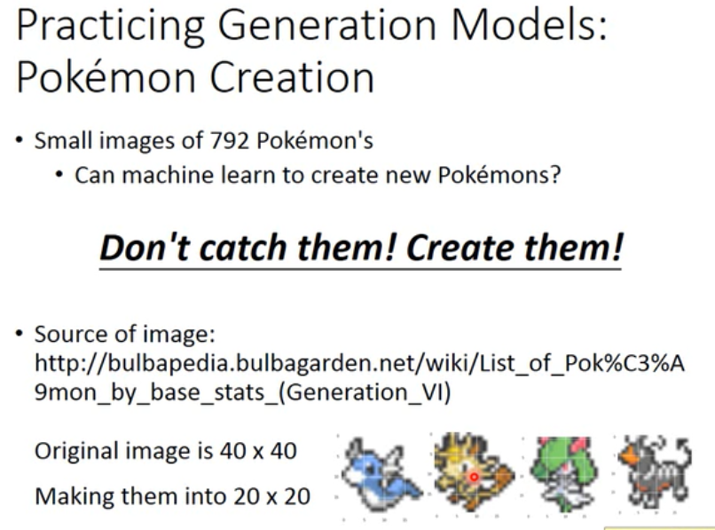

那如果你想要练习Generation的话，一个最简单的application当然是做NMIST,不过做NMIST我觉得有点虚弱，Generate digit 有点虚弱,而且那个有点简单,所以我create另外一个 task,如果你想要练习这个Generative model的话,你可以用这个task，这个task是 Pokemon 的Creation。这边我们有792张宝可梦的小图，那我们要让machine看过这些小图以后，它自己产生新的宝可梦出来。这边口号就是：“Don't catch them! Create them”用创造代替补抓,过去我们是抓宝可梦,在野外抓宝可梦,这样我们在实验室里面自己创造新的宝可梦出来,image的 source是来自于Pokemon 的Wiki,我看了一下他的从copy right,他那边的image都可以任意使用和编造,所以应该是没有版权的问题

原来的image是40*40的pixel，其实我觉得40 *40有点稍微太大了，所以我把它cut小一点,就只取了中间的部分,变成20 *20的image，看起来大概像是这样子(如图),虽然影像解析度没有很高，但还是可以很清楚的看到说他就是宝可梦。

那这边有一些tips,因为我其实自己实际做了一下,我觉得有一些tip,首先就是你可能很直觉的觉得说：一个pixel应该就是用一个三维的vector,用三个数字来描述它,每一个数字代表了RGB。比如说这样一个pixel(绿色)你可能就用三个数值(R=50, G=150,B=100)来描述他，但是我觉得实际上这样做以后,我发现这样做结果感觉不是太好，那我觉得一个原因是因为：你用这样做，你产生的图都很灰,看起来都灰灰脏脏的。那我觉得一个原因是因为,如果你要产生非常鲜明的颜色的话，非常鲜明的颜色往往是RGB里面的某一个value特别高，其他都接近0,像灰色,就是三个RGB的value都差不多就是灰色。所以如果你要让他产生非常鲜明的颜色的话,你这三个值要差的够大才行.但是你在learn的时候，你往往没有办法真的比如说让B=0,G=0,你往往做不到这一件事.尤其你今天如果是output把0-255 normalization 到0-1之间，output你用sigmoid function的话，sigmoid function的值通常都落在0.5左右，他们都落在中间,他很难落在这种极端的值。所以它产生的值,就是RGB三个值都差不多，所以每张图看起来都是灰色的，棕色的,就感觉不太好看。

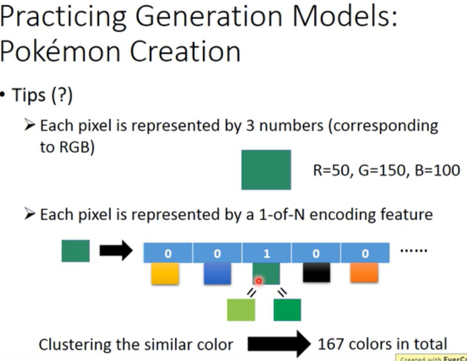

所以我就稍微做了一下前处理，怎么做前处理呢,我把每一个pixel都用一个 1-of-N encoding的vector来表示，在这个1-of-N encoding里面，每一个dimension就代表了一个颜色。也就是说：每一个pixel都是用一个vector来表示，那这个vector的每一个dimension,比如说第一个dimension就代表黄色，第二个dimension就代表蓝色，第三个dimension就代表绿色,第四个dimension就代表黑色等等。也就是说不让它产生RGB去合成颜色，而是直接让它产生一个颜色。所以比如说这个绿色进来，那他就是第三维是1，然后其他是0，所以一个pixel我们用这个方式来描述它。

但是这边会有一个问题就是：可能的颜色太多了，RGB每一个都有256种可能,256的三次方，有太多可能的颜色。肿么办呢？我先做clustering，把同样接近的颜色cluster在一起。也就是说：这三个绿算是同一个颜色，都用上面这个绿来表示它。那我就把在corpus里面出现次数比较少的颜色跟出现次数比较多的颜色把它合并起来，所以我们得到了167个不同的颜色。

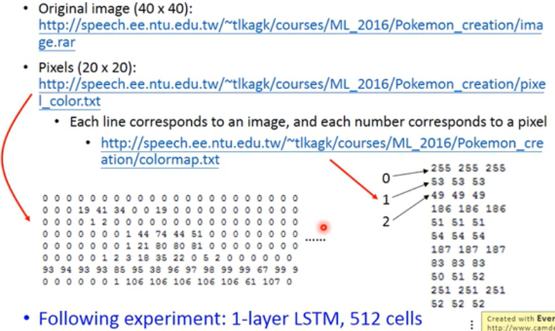

我release 的这个corpus,大家可以任意使用,这个corpus是这样的,原来的image在这边(original image),然后我裁过的结果在这边(Pixel),那我这边就直接存pixel,所以你也不用做 pre process,也都帮你做好了.在这个data里面，每一个row就代表了一张image，然后每一个数字就代表了一个颜色。那肿么知道每个数字代表了什么颜色呢？他的maping 在这边,比如说0他的RGB就都是 255 255 255，所以0代表白色。然后呢比如说这边这个2,2代表3个都是49 49 49，这个其实是一个灰色等等。

那我等一下做了一下pixel RNN的实验，你会很怀疑说：只有700多张图，你train的起来吗,train得起来是train的起来，但问题就是你可以得出什么正常得好的结果吗。我发现惊人的就是其实是可以的，然后我没有花太多时间调参数，我就用了一个一层的LSTM还有512个 cells。

你不知道 LSTM是什么也没有关系,反正就是learn 一个很简单的model,做出来的结果就还算尚可,那你我相信认真调一下参数,你可以做的比我好的更多,

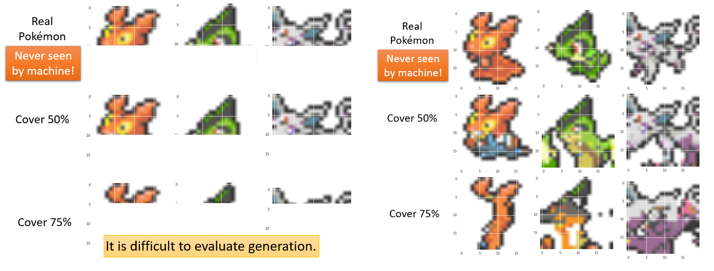

这个是实验的结果，首先要强调的是，我特意留了三张宝可梦是machine没有看过的，你在training data里面是没有这三张宝可梦。接下来我给machine看这个宝可梦的前半部，把剩下的半部,把他盖起来，只给machine看前半部,然后让他predict这个宝可梦应该长什么样子。

第一张图你觉得他是什么呢,他看起来像是个兔子，红色的兔子,然后把它下半身generate出来,他长这样子(第二行第一个)，他原来是有穿吊带裤的兔子,但它其实是长这样子的(第一行第一个)。那你觉得这一只是什么呢(第二行第二个),感觉是铁家蛹之类的东西，那machine generate出来的结果是这样子,他是一个长的绿毛虫，这个还有一个尾巴这样子,他是一个绿毛虫,但是实际上他是一只蜥蜴。然后这个,这个是什么(第二行第三个),这个machine generate出来,他觉得是一个类似狗或者是狐狸的东西，他的脸很长,这个是他的脚,machine还知道配色,本来他是没有很多深紫色,脚这边帮他涂一下深紫色这样子,我觉得还蛮强的,但实际上他其实是这样子(第一行第三个).

那如果我们今天给它看只有25% percent的图，他会得到什么呢,也就是只给他看一个耳朵,他会觉得接下来是什么呢,他产生这个腊肠兔这样子,而且我觉得machine还算蛮强的,他有手,他把手画出来了,腊肠兔,然后嘴巴眼睛这样子,我觉得还蛮强的;这个给他看一个角,他会觉得是什么,他觉得是铁甲蛹这样子,类似铁甲蛹,看着像右边,然后自己产生了一个看起来不爽的眼睛这样子,鼻子,嘴巴,第三张图给他看上面一点点也不知道什么东西,然后他判断出来他觉得是这个样子,你看他产生一个脸,他产生一个兔子的脸,左上角是耳朵,左下方是眼睛,还有一个翻白眼的眼睛,这个是他的鼻子这样子,他产生一个脸,有时候我觉得还蛮强的,

而且我觉得在做这种task有一个难点就是,你很难evaluate这个task，因为所谓的创造这件事情,是无法evaluate的,你不能说,我觉得这个腊肠兔也很合理啊,我觉得搞不好还比这个蛞蝓更合理一点这样子,是不是,就是说他generate出来并不一定要跟ground truth??一样,generate出来的结果跟ground truth??不一样,并不代表说他画的是错的,所以像这种的task是很难被evaluate的，这是现在做这种Generation的一个难点。

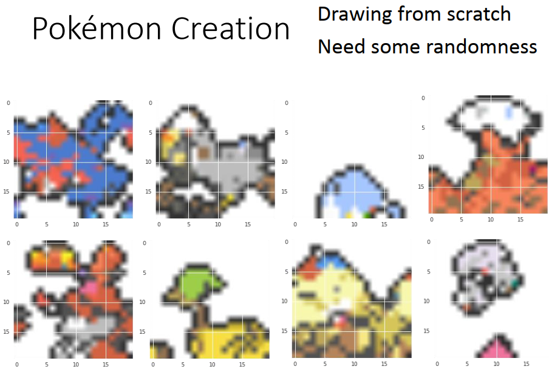

刚才是有给machine一个开头,然后让它画下去，那接下来呢,你就什么都不给它，让它从头开始画。但是如果你只是什么都不给它，让它从头开始画的话，它可能每一张image都是一样的，所以你要故意加一些random，也就是说它在predict下一个pixel的时候，不见得是选几率最高的那一个pixel，它会有一定几率选一个几率比较低的颜色出来画在图上面面，这样它每一次画的图都才会有点不一样。

这个其实蛮多都不知道在做什么的图,比如说像第一列的两张图我都不知道在做什么,第一张图右上角看起来像是鸟的嘴巴,这个也许是两个眼睛,我也不知道他在画什么,第二行第一个看起来像是个兔子,难道这个是他的脸吗,难道这个是他带了一个头盔吗,我也不知道他在画什么,有一些我觉得比较清楚,像第一行第二个,我觉得他是一只飞鸟,左下侧是他的手,这是一个大嘴鸟,左上角是他的嘴巴这样子;第二行第二个是一个比较惨的鸵鸟,因为他是一个戴绿帽的鸵鸟;第一行第三个是地鼠,这个画的还不错,因为他还有配色这样子,浅蓝色配白色,这个是一个地鼠,因为他是有眼睛的;第二行第三个也是另外一只比较大只的地鼠,他头上有一些蓝蓝红红的,他是比较大只的地鼠;第一行第四个我胡乱给他起个名字好了,叫他岩浆蘑菇好了,他下面是岩浆,上面是云,叫他岩浆云蘑菇好了,他上面,他这个是有眼睛的,不要小看他,他是有眼睛的,两个眼睛都点出来;第二行第四个是飞行骷髅这样子,他也是有眼睛的.我发现这个model还蛮强的,他还蛮喜欢点眼睛出来的

## Variational Auto-encoder

然后还有其他方法,细节我们或许下一次再讲,但我们可以稍微看一下他的结果,这个东西叫做 Variational的 Auto-encoder,

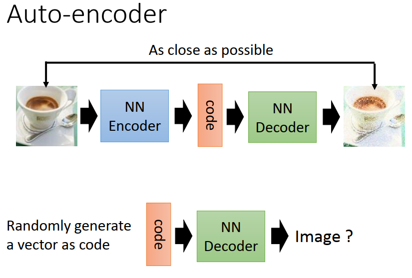

那我们之前已经有讲过Auto-encoder，那我们之前在讲Auto-encoder的时候，我们说你现在Auto-encoder的training 的criterion,就是input一张image通过encoder变成一个code，再通过decoder把这个image解回来，那你希望input跟output越接近越好。那你learn完这个auto-encoder以后，你其实就可以把这个decoder拿出来，然后你再给它input一个random的东西，你generate一个random 的vector,把这个random的 vector当做一个code,你这个code是10维，也就是generate一个 10维的vector，然后希望丢到这个decoder里面，它output就可以是一张完整的image.

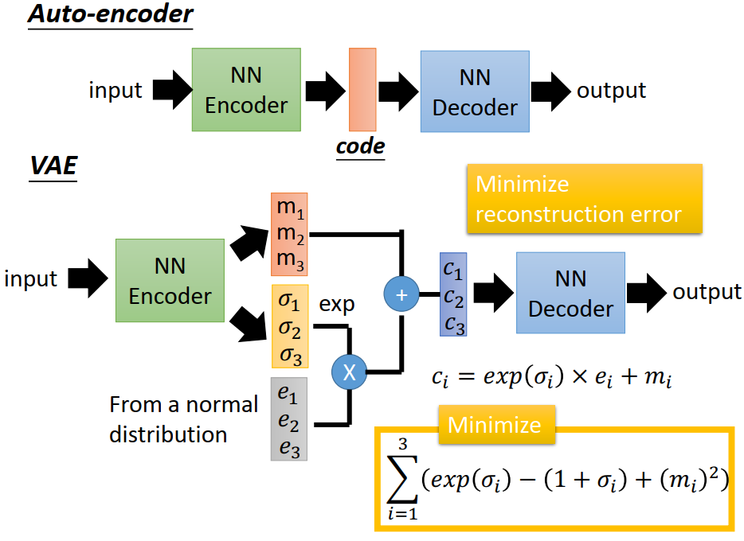

但实际上这么做，你得到的performance通常不一定很好。你要用一个方法叫做variational auto-encoder(VAE)，那你得到的结果会比较好。这个VAE怎么做呢,他的结构跟auto-encoder非常像，它只是在中间加了一些神妙的小trick。为什么加这个神妙的小trick,或许我们下一次再讲,这个神妙的小trick是什么呢,他说input一个encoder,encoder跟decoder的部分维持原状不动，但是现在在encoder的地方，我们不是直接output code，我们先output两个vector。假设你打算要做的code是三维的话吗，那你output这两个vector也都是三维,这个 vector是m~1~,m~2~,m~3~,这个 vector是σ~1~σ~2~,σ~3~，接下来你用normal distribution去generate另外一个也是三维的vector，它的三维分别是e~1~,e~2~,e~3~。接下来你把σ~1~σ~2~,σ~3~取Exponential ,跟e~1~,e~2~,e~3~相乘，然后把它跟m~1~,m~2~,m~3~,加起来，你得到c~1~,c~2~,c~3~，这个东西才是你的code,这个$c_i=exp(σi)∗e_i+m_i$，然后丢到decoder里面，你会希望说decoder能够minimize reconstruction error。

但是光只有这么做是不够的，它还有第二项，这一项是说,这一项是非常的神妙,我们之后再解释,这一项是怎么样呢,你看着觉得很怪,这一项是我们把它的三个dimension加起来，然后我们要去minimize$(1+\sigma_{i}-(m_i)^2-exp(\sigma_{i}))$，有这么一项,你要minimize reconstruction error同时minimize这一项。

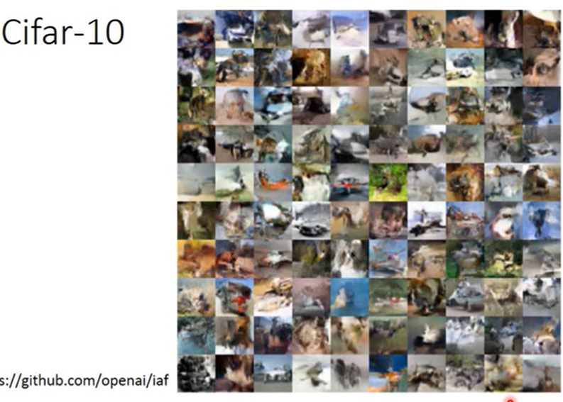

好,那你用VAE 做出来的结果怎么样呢,这是openai做的结果,他们是做在Cifar-10上面，你会发现说：其实用VAE得到的图他是不太清楚的。这些图你看的出来好像想画点什么,但是你又搞不清楚他到底在画什么,但是用VAE跟刚才的Pixel RNN 有什么不一样的地方呢,用VAE的话,你可以做以下的事情，你可以control 你要generate的image,理论上,

### 宝可梦生成

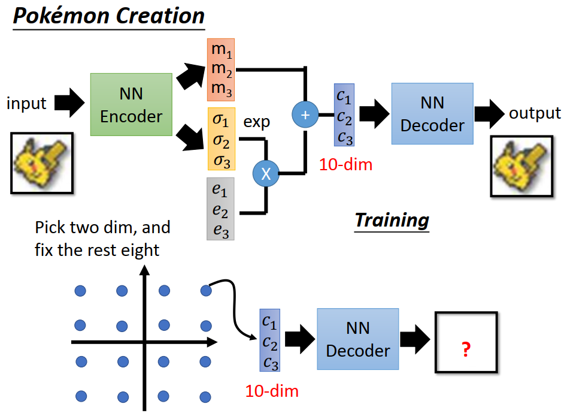

什么意思呢,假设我们现在把这个VAE用在pokemon 的creation上面。那我们training的时候，就是input一个pokemon，然后reconstruct一样的pokemon，然后learn出来的这个code我们就设10维。learn好这个pockmon的VAE以后，我们就把decoder的部分拿出来。因为现在我们有一个decoder，那你可以input一个vector。所以在input的时候你可以这样做,你可以说我现在有10维的vector，我固定其中8维只选其中的二维出来，然后在这两维的这个dimension上面我撒不同的点，然后我们把每一个点都丢到decoder里面，看它合出来的image长什么样子。那如果我们做这件事情的话，如果我们撒不同的点的话，你就可以看到说：这个code的每一个dimension分别代表什么意思。那如果我们可以解读说code的每一个dimension代表什么意思，以后我们就可以把那个code就当做像是一个拉杆一样可以调整它，就可以产生不同的pokemon,理想上是这样子的,

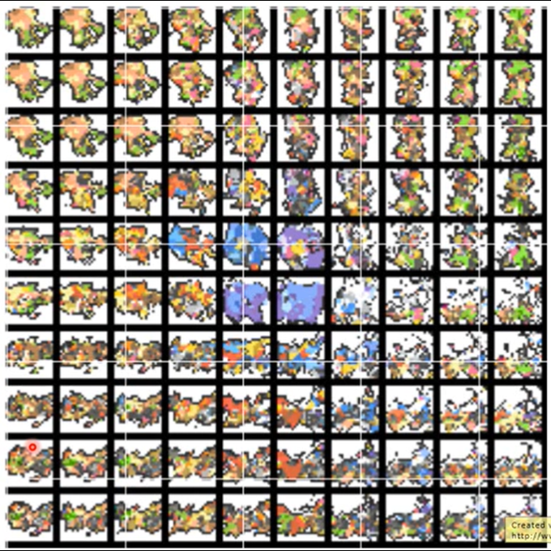

那我们VAE产生出来的结果是这样个子(上图)，你可能觉得没有很好,这个是,首先你都看不出来每一只是什么,没错,因为VAE做出来就是这样子,那这两个 dimension 分别是移动了,变化了这个code两个dimension以后的结果。但是你从这个变化你可以看得出来：每一个dimension其实或许他真的是有一些含义的。比如说,如果我们看纵轴的变化，上面看起来像是一个站着的东西，然后他后来就逐渐的倒下来了,然后就演化变成类似鱼得东西,然后后来就趴下来,变成一个趴在地上的东西这样子。那如果你从左边到右边呢，你会发现说他站的越来越直。他本来是感觉是有点前倾的,然后越往右他就站的越来越直,然后头上会有出现一个帽子,站的越来越直,所以你可以从这两个dimension的变化发现说,它确实是有学到一些东西的，如果我们可以让图产生的更清楚的话，我们就可以控制这两个dimension，就可以产生不同的宝可梦。

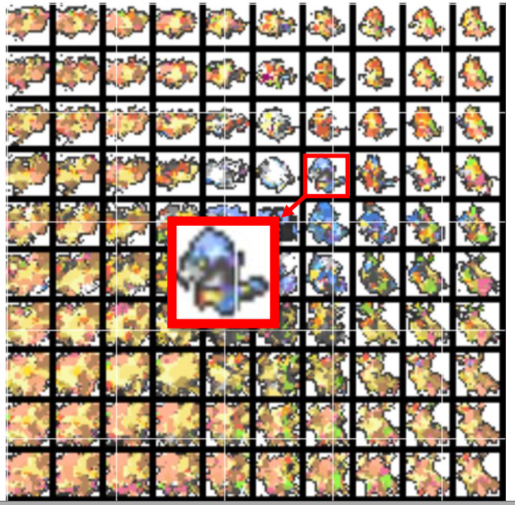

这边是某两个dimension,这边是另外两个dimension的结果。这边这个例子可能要更清楚一点,比如说你看从右边到左边,本来是类似一个仓鼠的样子，后来就慢慢倒下来,倒下来变成一团雾这样子;那如果你看直的话,它本来是一个仓鼠的样子,从上面往下，你会发现说首先它的脚越来越长，你就会看到宝可梦的演化,他本来脚很短,然后越来越长,后来变成有一只很长的脚,看起来就变成像是鸟，后来就变成说有两只很长的脚,然后后来又变成说其实他是有四只脚的,看起来像是哺乳类动物，这是他的演化,如果看他的尾巴的话,本来尾巴很短,后来尾巴也越来越长,那如果你看他的头的话,本来耳朵很短,后来耳朵越来越长,看起来就像是长出了角一样,所以就可以看到说：随着input code不同，你就可以产生不同的宝可梦。

那在这么多图里面，你会发现说都没有清楚的，都没有看起来像样的。但我其实找到一个像样的,就是在这边这样子,我找到一个,这边这一只,我想原来宝可梦里面应该是没有这一只，他产生出来时这样,它看起来他的头像是一个海马，然后他的尾巴像鳄鱼。我们就胡乱叫他鳄鱼海马这样子,

### 用VAE写诗

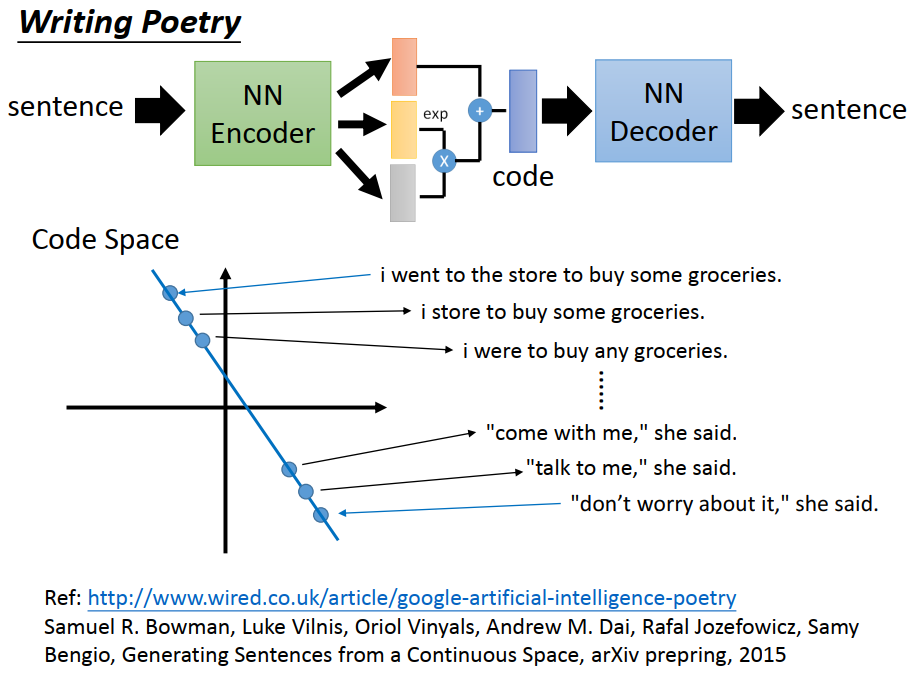

然后呢,有人说可以用VAE来写诗，怎么用VAE来写诗呢,这个做法是这样子的。我们本来VAE的Auto-encoder input是一个image，output也是一个image。现在只是把input和output改掉,改成input一个sentence，output也是一个sentence。不过如果你要input除以sentence的input产生 sentence 的output,这边你需要用RNN才能够做到,这个我们就之后再讲,

那怎么让machine写诗呢，这边这个做法是这样子的。你先胡乱选两个句子，一个句子是：“i went to the store to buy some groceries”，另外一个句子是：“don't worry about it ,she said”。接下来你通过这个encoder把这两个句子都找出他的code，所以这两个句子就变成在code space上面的两个点，接下来你把这两个点相连，然后中间等距远间隔的取一些点，再把中间等间隔取的点，你就把这个code再丢到decoder里面，还原出句子。所以把“i went to the store to buy some groceries”的点稍微偏一点以后，你得到的句子是：“i store to buy some groceies”，在偏一点以后你就得到:"i were to buy any groceries"，然后就这样一直下来。到“don't worry about it ,she said”附近,变为“come with me ,she said”,然后“talk to me ,she said”,然后 “don't worry about it ,she said”

你可能会说这个算是写诗吗,这个是这样,如果你仔细看他的paper的话,他的paper里面没有提到写诗这一件事,但是这个blog里面说是这样子是在写诗就是了.我不知道这个blog是谁写的,大概就是这样子,

那GAN的部分我们就下一次再讲,

