[TOC]

# P 29 18: unsupervised-learning -Deep Generative Model(Part Ⅱ) <!-- 63' -->

## review

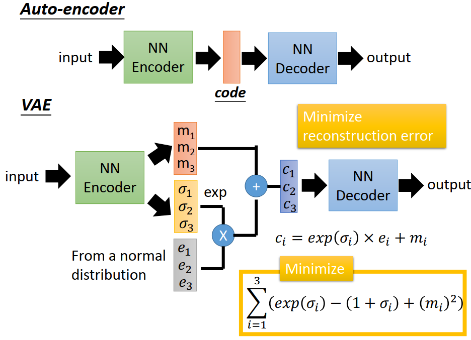

我们上次讲了叫做 Generation这一件事情,然后呢可以用Pixel RNN 来做,然后这边create一个 Generative的task,然后呢上次还讲了VAE,但是没有讲太多他的原理,我们来复习一下VAE做的事情,auto-encoder我想大家都很熟悉了,那VAE做的事情是什么呢,VAE做的事情是说,你一样有一个encoder,一样有一个decoder,那你现在encoder 会output 两组vector,这边一组是 m~1~,m~2~,m~3~,另外一组是 σ~1~σ~2~,σ~3~,那接下来你会  generate一个 vector,这个vector是从 normal distribution sample 出来的,接下来你把 σ这个vector取 Exponential,然后再乘上random sample 出来的这个vector,再加上原来m这个vector,得到你的code c,把这个code 丢进decoder 里面产生image,那你希望说 input跟output越接近越好,另外 auto-encoder还有另外一项 constrain.

## why VAE?

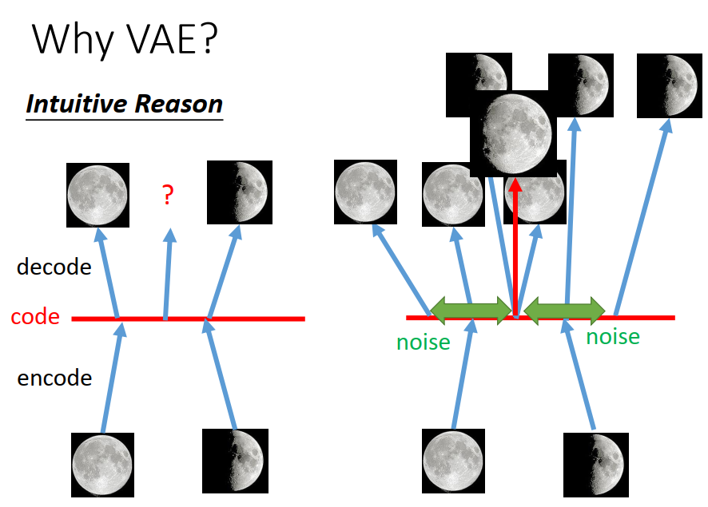

那再来的问题就是为什么要用VAE这个方法,原来的auto-encoder会有什么样的问题呢，如果你看文献上的话,VAE,如果你看他原来的paper的话,他有很多很多的式子,你就会看的一头雾水,那在讲那些式子之前,我们先来看 intuitive 的理由,为什么要用VAE,如果是原来的auto-encoder的话,原来的auto-encoder他做的事情是,我们把每一张image变成一个code，假设我们现在的code就是一维,就是图上这一条红色的线。那你把满月的这个图变成code上的一个value，然后再从这个value做decode,就可以把它变回原来的图，那如果是弦月的图也是一样变成code上的value,然后接下来你再把从code上的value,可以把它变回原来的图。那假设我们今天是在满月和弦月的code中间，sample一个点，然后再把这个点做decode变回一个image，他会变成什么样子呢,你心里或许期待着说：他会变成满月和弦月中间的样子，但是这只是你的想象而已。其实因为我们今天用的encoder和decoder他都是non-linear的，都是一个neural network，所以你其实很难预测说在这个满月和弦月中间到底会发生什么事情。你可能想象是满月和弦月中间的月相,但未必,他可能根本就是另外一个东西,

那如果用VAE有什么好处呢？如果用VAE的好处是,实际上VAE在做事情就等于我下面说的这一件事情,当你把这个满月的图变成一个code的时候，它会在这个code上面再加上noise，它会希望再加上noise以后，这个code reconstruct以后还是一张满月。也就是说：原来的auto-encoder，只有中间这个点需要被reconstruct回满月的图，但是对VAE来说，你会加上noise，在这个范围之内的图reconstruct回来以后,都应该仍然要是满月的图，这个弦月的图也是一样的,弦月的code再加一个noise,reconstruct回来以后,这个range的code都要变成弦月的图。

你会发现说,在这个位置，在这个地方这个code这个点,它同时希望被reconstruct回满月的图，同时也希望被reconstruct回弦月的图，可是你只能reconstruct回一张图而已啊。肿么办,那VAE training的时候你要minimize mean square error，所以最后这个位置所产生的图会是一张介于满月和弦月中间的图,你要同时让他最像满月也最像弦月,那你产生的图会是什么样子呢,也许就是介于满月和弦月之间的月相。所以如果你用VAE的话，你从你的这个code space上面去sample一个code再产生image的时候，你可能会得到一个比较好的image。如果是原来的auto-encoder的话，你random sample 一个point,你得到的你可能看起来都不像是一个真实的image。

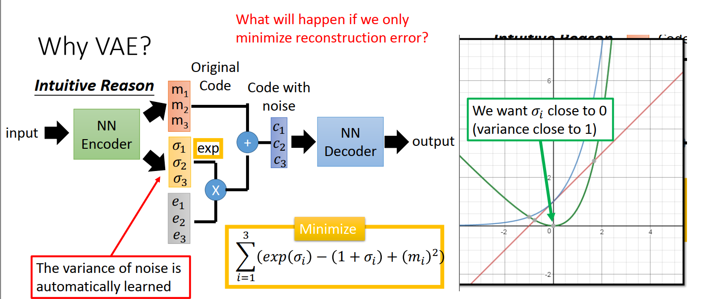

所以VAE就是这样,这个encoder 的output m代表是原来的code，那这个c代表是加上noise以后的code。那decoder要根据加上noise以后的code把它reconstruct回原来的image。那这个σ~1~是什么意思呢,这个σ 他就代表了现在这个noise的variance,他代表了你的noise应该要有多大,不过因为variance是正的,所以这边会取一个Exponential,因为neural network的output,假设你没有用那个 Activation Function 去控制他的话呢,他的output可正可负嘛,假设你这边是linear 的output的话,他output可正可负,所以取一个Exponential确保他一定是正的,可以被当作variance来看待，那现在当你把这个σ乘上这个e,这个e是从normal distribution里面 sample出来的值，当你把这个σ乘上e再加到m 的时候,就等于是你把这个m加上了noise，就等于是你把原来的code加上noise,那这个e是从一个normal distribution sample出来的，所以他variance是固定的，但是乘上了这个不同的σ 以后，它的variance的 大小就有所改变。所以这个variance决定了这个noise的大小，而这个variance是从encoder产生的，也就是说,machine在training的时候，它会自动去learn说这个variance应该要有多大。

但是如果就只是这样子的话是不够的，假如你现在的training你就只考虑说,我现在input一张image，然后我中间有这个加noise的机制，noise的variance是自己learn的,然后decoder要 reconstruct回原来的image，那你要 minimize 这个reconstruction error，如果你只有做这一件事情的话是不够的，你training的出来的结果并不会如同你预期的样子。

为什么呢,因为这个variance现在是自己学的，假设你让machine自己决定说variance是多少，那它一定会决定说 variance是0就好了,就像让大家决定自己分数是多少，那每个人都会是100分了。所以这边这个variance如果你只让machine自己决定的话，他就会觉得说variance是0就好了，那你就等于是原来的auto-encoder,因为variance 是0 的话就不会有这个不同的image overlap 的情型,这样你reconstruction 的error是最小的 。所以你要在这个variance上面去做一些限制，你要强迫它的variance不可以太小。怎么做呢,所以我们另外再加的这一项 $\sum_{i=1}^{3}(exp(\sigma_i)-(1+\sigma_i)+(m_i)^2)$ ，其实就是对variance做了一下限制

怎么说呢,这一项是这样子,你看他这边有 $exp(\sigma_i)-(1+\sigma_i)$ ，那exp(σ~i~) 画在图上的话他是蓝色的这一条线， 这个(1+σ~i~) 画在图上的话他是红色的这一条线。当你把蓝色这一条线减红色这一条线的时候你得到的是绿色的这一条线，绿色的这一条线的最低点是落在 σ=0 的地方，注意一下σ之后会再乘以 Exponential,所以σ=0 ，exp( σ )=1，意味着说他的variance是1,Exponential 0 是1,所以 σ=0 的时候loss最低，意味着说你的variance=1的时候loss最低。所以machine就不会说,让variance=0，然后minimize reconstruct error，它还要考虑说 variance是不能够太小。那最后这一项 m~i~^2^ 对要minimize这个code做L2-Norm怎么解释呢,其实很容易解释,你就想成是我们现在加了 L2 的 regularization。我们本来常常在training auto-encoder的时候，你就会在你的code上面加一些regularization，让它的结果比较??,比较不会over fitting,比较不会learn出太过trivial的 solution。

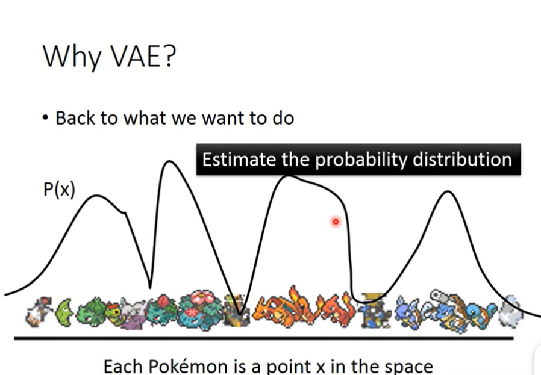

这个是直观的理由,那如果比较正式的解释的话，要怎么解释他呢,以下是就是paper上比较常见的说法。假设我们回归到我们到底要做的事情是什么，假设你现在要叫machine 做的事情是 generate 这个宝可梦的图话，那每一张宝可梦的图你都可以想成是高维空间中的一个点。一张image假设它是20*20的image，他在高维空间中就是一个20 *20也就是400维的点，我们这边呢写做x,虽然在图上我们只用一维来描述它，但这个其实是一个高维的空间。那我们现在要做的事情其实就是Estimate这个高维空间上面的几率分布P(x)，我们要做的事情就是estimate这个P(x)，只要我们能够 estimate 出这个 P(x)的样子，注意x其实是一个vector,假设我们可以 estimate出 P(x)的样子，我们就可以根据这个P(x)去sample出一张图，那找出来的图就会是像宝可梦的样子,因为你取P(x)的时候你会从几率最高的比较容易被sample 出来。所以这个P(x)理论上应该是在有宝可梦的图的地方，就如果你今天这个图长的像一只宝可梦的话,它的几率是大的，中间橙色的是喷火龙家族,他们几率是大的,后面是水箭龟家族,他们几率是大的,如果是一些怪怪的图的话，比如倒数第5个看起来像是皮卡丘,又有点不像,最后一个看起来像是一个绵羊又像是一个鱼,这边几率是低的。如果我们今天能够estimate 出这个probability 的distribution 那就结束了。

### Gaussian mixture model

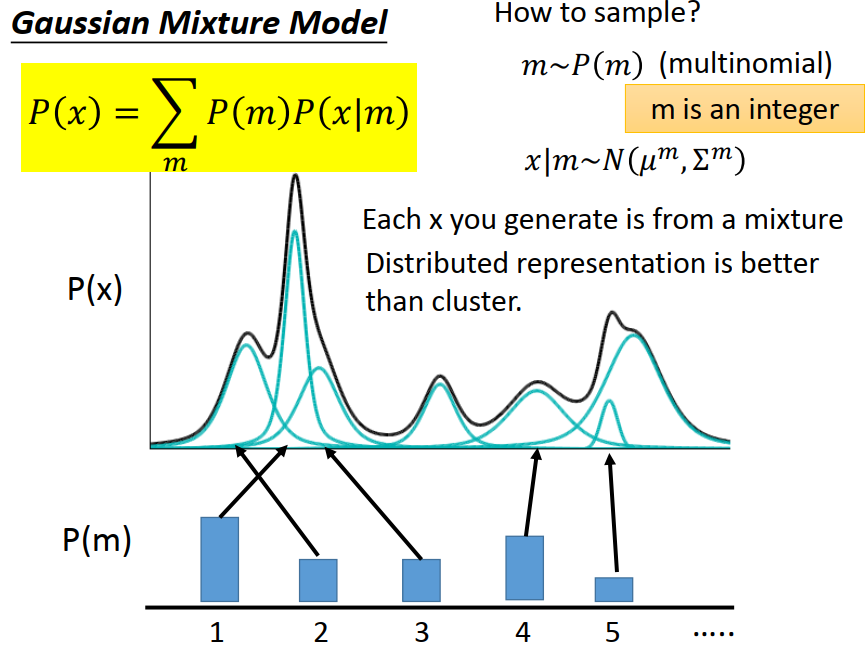

那怎么estimate 一个probability 的 distribution呢,我们可以用Gaussian mixture model。Gaussian mixture model做什么呢,我们现在有一个distribution长这个样子(黑色的线),黑色的,很复杂很复杂，那我们说这个很复杂的黑色的distribution他其实是很多个Gaussian 我们这边这个蓝色的代表Gaussian ,有很多个Gaussian 用不同的weight叠合起来的结果。只要你今天的Gaussian 的数目够多，你就可以产生很复杂的distribution，虽然黑色的很复杂,但他背后其实是由很多 Gaussian叠合起来的结果,那这个式子怎么写他呢,你会把它写成这样子$ p(x)=\sum_{m}p(m)p(x|m) $。

首先呢如果你要从P(x) sample 一个东西的时候，你怎么做,你先决定你要从哪一个Gaussian sample东西，假设现在有100个 Gaussian ,那这个每一个Gaussian 他背后都有一个weight，每一个Gaussian 有自己的weight, 接下来你再根据每一个Gaussian 的weight去决定你要从哪一个Gaussian sample data,然后再从你选择的那个 Gaussian 里面sample data。如果你选择1这个 Gaussian  的话,那你就是从最高的那个峰sample data,那如果你选择2的话,就从第一个峰的地方,3就从这个地方,4就从这个地方,5就从这个地方,以此类推...

所以怎么从Gaussian mixture model sample 一个 data呢 ,你就这样做,首先你有一个multinomial 的distribution，你从这个 multinomial 的distribution里面决定你要去 sample哪一个Gaussian ，今天m代表第几个Gaussian ，它是一个integer。那决定好你要从哪一个 Gaussian  sample data 以后，决定哪一个Gaussian 以后，每一个Gaussian 有自己的mean μ^m^, 有一个自己的variance Σ^m^,所以你有了这个m以后你就可以找到这个mean 跟variance, 根据这个 mean 跟variance你就可以sample一个 x出来。所以今天整个P(x)写成 summation over所有的Gaussian ，那一个Gaussian  的weight P(m)再乘上有了那个Gaussian以后,从那个Gaussian  sample出x的几率 P(x|m)

那在 Gaussian mixture model 里面,有总总的问题,比如说你需要决定这个 mixture 的数目,但是如果你知道mixture  的数目的话,接下来给你一些data x ,你要 estimate这一把  Gaussian 跟他的每一个 Gaussian 的weight 跟 他的  mean 跟variance,其实是很容易的,你只要用 EM algorithm就好了,你不知道这个是什么没有关系,反正就是这是很容易的事情,

那现在每一个x他都是从某一个mixture被sample出来的，这件事情其实就很像是在做classification一样。每一个我们所看到的x，它都是来自于某一个分类(class )。但是我们之前有讲过说,把data做classification,做cluster其实是不够的，更好的表示方式是用distributed 的representation，也就是说每一个x它并不是属于某一个class,某一个 cluster，而是它有一个vector来描述它的各个不同面向的特性 (attribute)。所以VAE其实就是Gaussian mixture model 的distributed representation的版本。

#### VAE

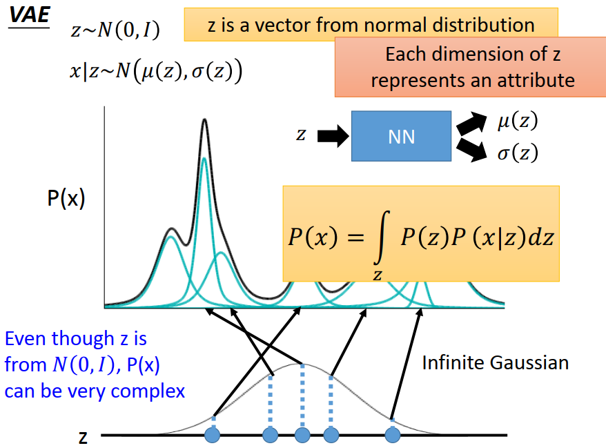

首先我们要sample一个z，这个z是从一个normal distribution sample出来的,那这个z 是一个vector。这个vector 的每一个dimension就代表了某种attribute,代表了你现在要sample的那个东西的某种特质,z 的每一个dimension就代表了他要sample的某种东西的特质，

假设z他长这样的(如图),他是一个Gaussian distribution ，那现在我们在这个图上假设它是一维的，但是在实际上这个z可能是一个10维的,100维的vector，到底有几维是你自己决定的。假设现在z 就是一维的 Gaussian. 然后接下来你Sample出这个 z以后，根据z你可以决定μ跟σ,你可以决定Gaussian 的  mean 跟variance。刚才在那个Gaussian mixture model里面，你有10个mixture，你就是10个  mean 跟10个 variance，但是今天在这个地方，你的z有无穷多个可能,他是 continuous,他不是 discrete.所以你的 z 有无穷个的可能,所以你的 mean 跟variance 也有无穷个的可能。

那怎么给一个z找一个 mean 跟variance 呢,你这边的做法就是：假设 mean 跟variance都来自于一个function，你把z带进产生mean 的这个function他就给你μ(z)  ,μ(z) 代表说现在如果你的这个hidden 的东西,你的这个attribute是z的时候，那你在这个x这个 space上面的mean  是多少。同理σ(z) 代表说你的variance是多少,代表说你现在如果从latent的space里面得到z的时候你的variance 是多少.

所以实际上这个P(x)是怎么产生的呢,每一个在这个z这个space上面，每一个点都有可能被sample到，只是在中间这边这个点被sample到的几率比较大,在tail的地方点被sample到的几率比较小。当你在z的space上sample出一个点/point以后，那个point会对应到一个Gaussian。中间最高的点对应到最高的Gaussian,其他的点对应到相应的 Gaussian,等等,每一个点都 对应到一个Gaussian,那至于某一个点对应到什么样的Gaussian，它的 mean 跟variance是多少，是由某一个function所决定的。所以当你用这个概念,当你今天你的Gaussian是从一个normal distribution所产生的时候，现在你等于就是有无穷多的Gaussian。原来Gaussian mixture model里面最多就512 个,那个太少,现在无穷多个 Gaussian. 

那另外一个问题就是,那我们肿么知道每一个z应该对应到什么样的 mean 跟variance呢, 这个function怎么找呢。我们知道说neural network就是一个function，所以你可以说,我就是train一个neural network，这个neural network的input z，然后它的output就是两个vector第一个vector代表了input是z的时候你Gaussian的 mean， 这个σ 代表了variance,那 variance实际上来说他是一个matrix,你可以把matrix 拉直当作他的output,或者是你可以指output diagonal 的地方,然后假设 diagonal 的地方都是0 这样都是可以的.

反正我们有一个neural network他可以告诉我们说：在z这个space上面的每一个点他对应到x space的时侯，你的这个 distribution  mean 跟variance分别是多少。

那现在P(x)的distribution会长什么样子呢, 这个P(x)的distribution就会变成是P(z)的几率跟我们知道z的时候x的几率，在对所有可能的z做积分,这边不能够是相加,不能够是 summation,必须要是积分,因为这个z是continuous 的。那有人可能会有一个困惑，为什么这边一定是Gaussian呢,可以不是 Gaussian这样子,他可以是一朵花的样子,在文献上确实有人会把它弄成一朵花的样子,他可以是任何东西,这个是你自己决定的。

当然这个 Gaussian说起来是合理的,你就假设说每一个attribute他的分布就是Gaussian，比较极端的case总是比较少的嘛，那比较没有特色的东西总是比较多的,然后attribute和attribute之间是 independent 的,这样假设其实也是合理的, 不过z的形状是你自己假设的,你可以假设任何形状。但是你不用担心说,你如果假设Gaussian会不会对这个 P(x)带来很大的限制,会不会说如果是假设z是 Gaussian distribution 的话,有些  P(x)就没有办法描述。其实不用太担心这个问题，因为不要忘了这个NN是非常powerful的，只要neural够多的NN可以represent任何的function。所以今天从z到 x中间的mapping 可以是很复杂,所以 就算是你的z是一个normal distribution，最后这个P(x)他也可以是一个非常复杂的distribution。

#### Maximizing Likelihood

那再来呢,所以我们现在的式子是这样子的,我们知道 P(x) 可以写成对z 的积分,然后乘上 P(z)然后乘上P(x|z), P(z) 是一个 normal distribution，x|z是我们先知道z是什么，然后我们就可以决定这个x他是从什么样的 mean 跟variance的 Gaussian 里面被sample出来的， 但是 μ(z) ,σ(z)这一个  function有z,他有什么样的 mean 跟variance,他们 中间的关系是不知道的,是等着要被找出来的。

但是问题是怎么找呢,它的equation就是要 maximizing 我们的 likelihood，我们现在手上已经有一笔data x，那你希望找到一个 μ 的function,找到一个 σ 的function，它可以让你现在已经观察到的data,你现在手上已经有的 image,这个每一个x代表一个image，现在手上已经有的image,它的P(x)取log以后呢他的值相加以后是被maximizing的,这个就是 maximizing我们已经看到的 image 的 Likelihood.这边只是复习一下这个z 怎么产生这个 μ(z) ,σ(z),他是透过一个 NN。所以我们要做的事情就是，调这个NN里面的参数,然后这个NN里面每个neural的weight 跟 bias，使得这一个 Likelihood可以被maximize。

那在这边等一下会引入另外一个distribution，他叫做 q(z|x)。他跟上面的NN是相反的,上面是given z 决定 x 的 mean 跟variance.这边是given x 决定在z 这个 space 上面 的  mean 跟variance.也就是说我们有另外一个 NN' ，你input x以后，它会告诉你说,对应z的 mean 跟对应的 z variance, 你给它x以后，它会决定这个z要从什么样的   mean  跟什么样的 variance 被sample出来。那上面这个NN其实就是VAE里的decoder，下面这个 NN' 其实就是VAE里的里的encoder

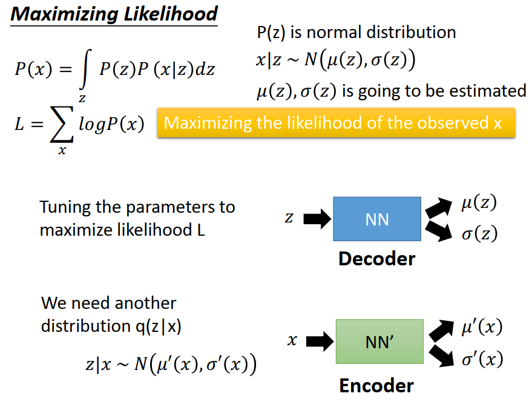

我们现在先不要管 NN 这一件事情,我们现在就先只看这个式子就好 $P(x)=∫_zP(z)P(x|z)dz$,这个 P(x|z)我们先不要在意他是不是从NN产生的,反正这个就是一个几率,我们要去把它找出来,怎么找呢,这个 log P(x)他可以写成对over z 的积分 $ logP(x)=∫_zq(z∣x)logP(x)dz$ 这样子,你想说这个为什么是这样呢,因为 q(z|x)它是一个distribution，这个式子对任何distribution都成立。我们假设 q(z|x)就是现在就是一个从路边捡来的distribution,他可以是任何一个distribution，任何一个distribution你都可以写成这个样子, 因为这个积分是跟这个P(x)是无关的，所以你可以把 P(x)这一项提出来，然后积分的部分就会变成1，所以左式就等于右式。这个没有什么好讲的,这个式子只是什么都没有做,

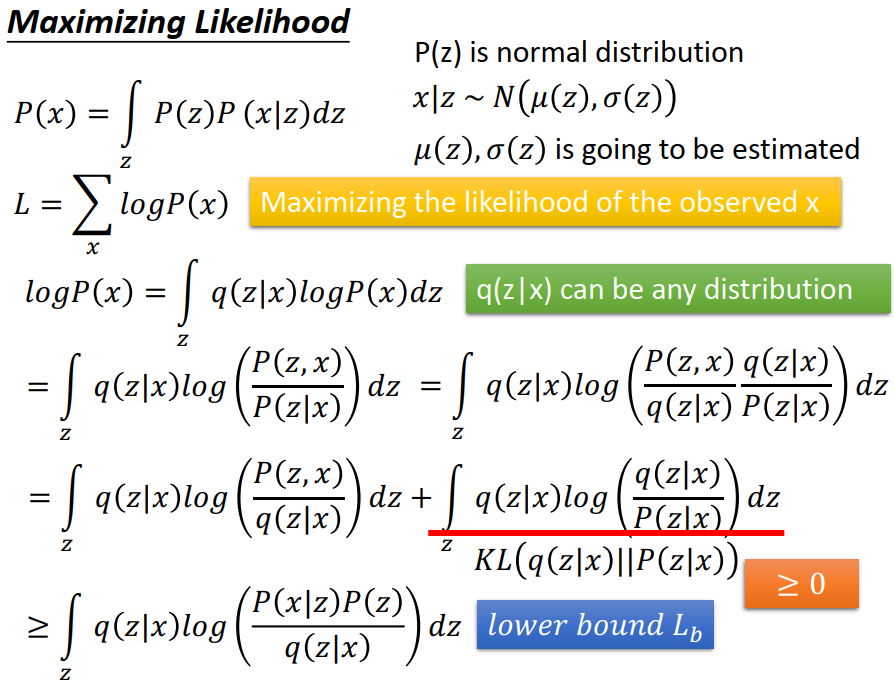

再来呢其实也是一个其实什么都没有做的式子, P(x)可以写成 $P(z,x)\over P(z|x)$,你把 P(z|x)展开一下就会发现说 $P(z,x)\over P(z|x)$ 等于  P(x),这也没什么好讲的,那接下来呢,又是一个什么都没有做的式子,

本来我们把 P(z,x) 除掉 q(z|x),然后呢再把 q(z|x)除掉 P(z|x),左式也等于右式,因为这个  q(z|x) 其实是可以消掉的,这个呢小学生就应该知道,这个式子也等于是什么事都没有做这样子,那接下来这个东西被放在log 里面,我们知道log 相乘等于拆开后相加,所以log  这一项 $P(z,x)\over  q(z|x)$乘 这一项$ q(z|x)\over P(z|x)$,等于 log  这一项 $P(z,x)\over  q(z|x)$加 log这一项$ q(z|x)\over P(z|x)$,那接下来观察一下这两项代表什么事情,

右边这一项他代表了 KL divergence,这个 P(z|x) 是一个distribution， q(z|x) 是另外一个distribution，现在x 是给定的,所以 你有两个 distribution,那当有两个distribution的时候,你可以算一个东西叫做  KL divergence,KL divergence代表的是 这两个distribution的相近的程度,如果这个KL divergence他越大，代表这两个distribution越不像，这两个distribution一模一样的时候,KL divergence会是0 ,所以KL divergence他是一个距离的概念,衡量了两个 distribution之间的距离, 右边这一项就是KL divergence 的式子，右边这个式子是一个距离，所以他一定是大于等于0的,最小也是0 而已，那至于这个为什么 KL divergence 什么的,反正你就记起来就是了,那因为右边这一项一定是 大于等于0的,

那所以左边的式子会是L的 lower bound,就是L一定会大于等于左边这一项,左边这一项你可以再拆一下,P(z,x)等于 P(x|z)P(z),所以L一定会大于 $\int_{m}q(z|x)log(\frac{p(x|z)p(z)}{q(z|x)})dz $这一项，那这一项就是一个lower bound,我们叫他 L~b~。

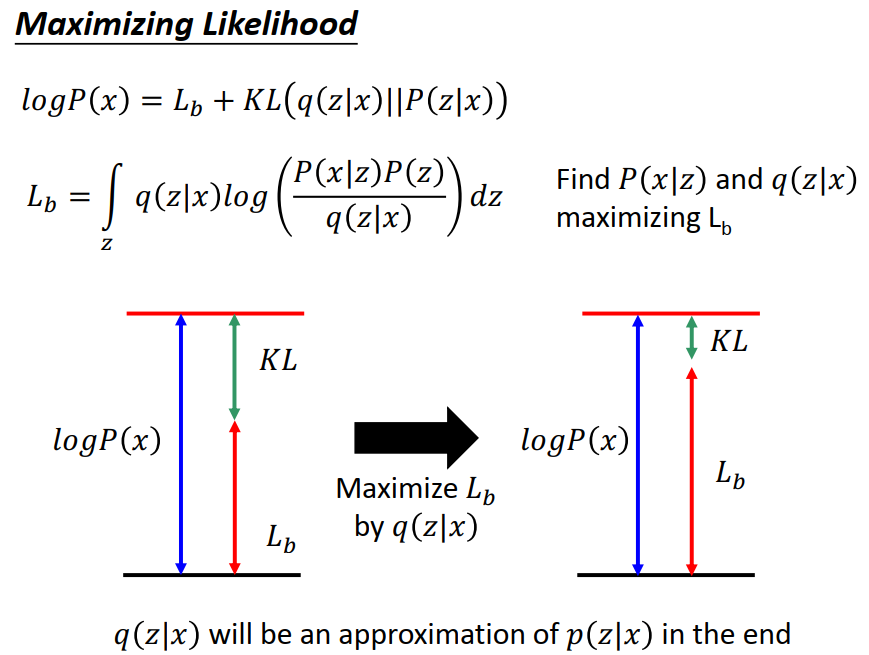

那现在我们知道的事情是这样子,这个log  probability,我们要maximize 的这个对象他是由这两项加起来的结果，那 L~b~他长得这个样子,在这个式子里面，P(z)是normal distribution,是已知的，我们不知道的是 P(x|z)跟q(z∣x)  。那我们本来要做的事情是找 那个P(x|z)，让这个Likelihood 越大越好，现在我们要做的事情变成找 P(x|z) 跟 q(z|x) ，让  L~b~ 越大越好。我们本来只要找这一项P(x|z)，现在顺便也要找  q(z|x),把这两项合起来,我们需要同时找这两项,然后去maximize这个  L~b~，突然多找一项到底是要做什么

如果我们现在只找 P(x|z) 的话,然后去maximize   L~b~的话,你如果 maximize   这一项  P(x|z) ,你如果调整这一项,你如果找这一项  P(x|z) ,让  L~b~ 被maximize   的话,那因为你要找的这个  Likelihood他是  L~b~ 的 upper bound,所以你增加   L~b~  的时候,有可能会增加你的Likelihood，但是你不知道你的这个Likelihood跟你的 lower bound之间到底有什么样的距离。就是你想象希望你做到的是,当你的lower bound上升的时候，你的Likelihood 始终会比Likelihood高, 然后 Likelihood 也跟着上升。但是有可能你会遇到比较糟糕的状况是,你的lower bound上升的时候，Likelihood反而下降,虽然他还是lower bound,他还是比 lower bound大,但是他有可能下降,因为根本不知道它们之间的差距是多少。

所以引入q(z|x)这一项其实可以解决刚才说的那个问题。为什么呢,因为你看如图蓝色的线是Likelihood ， Likelihood = L~b~ +KL divergence  ，如果你今天去调这个q(z|x),调q(z|x)这一项, 去maximize    L~b~ 的话,会发生什么事呢。你会发现说 首先q(z|x) 这一项 跟log P(x)是一点关系都没有的,对不对,log P(x) 只跟  P(x|z) 有关。这个 q(z|x)到底带什么东西, 这个值( L~b~ +KL divergence)都是不变的,蓝色这一条长度都是一样的,

但是我们现在却maximize  这个L~b~ ,maximize  L~b~ 代表说minimize 的这个KL divergence，也就是说你会让你的 lower bound跟 你的 Likelihood 越来越接近,如果你 maximize 这个 q(z|x)这一项的话。所以今天假如你固定住 这个P(x|z)这一项，然后一直去调 这个q(z|x)这一项的话，你会让这个 L~b~一直上升，最后这个KL divergence会完全不见,假如你最后可以找到一个q(z|x),他跟这个 P(z|x)正好完全 distribution 一模一样的话,你会发现说你的 Likelihood 就会和 lower bound完全平在一起,他们就完全是一样大的,这个时候如果你再把 lower bound 上升的话。那因为你的Likelihood 一定要比lower bound大，所以这个时候你的 Likelihood 就可以确实他一定会上升。所以这个就是引入 这个q(z|x)这一项他有趣的地方,

那今天也会得到一个副产物，当你maximize q(z|x)  这一项的时候，你会让这个KL divergence越来越小，意味着说,你就是让这个 q(z|x)跟这个 P(z|x)越来越接近。所以我们接下来要做的事情就是找 这一个P(x∣z) 跟 这一个q(z|x) ，然后可以让 L~b~越大越好，让 L~b~越大越好就等同于我们可以让Likelihood 越来越大。而且你顺便会找到这个 q(z|x) 他可以去 approximation P(z|x)。

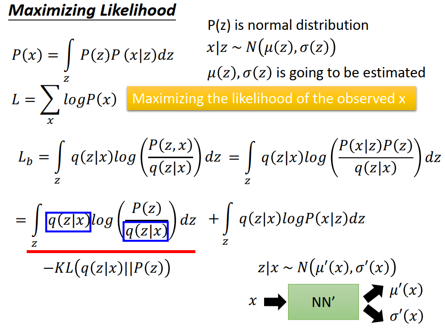

那这一项 L~b~他长什么样子呢,这一项 L~b~我们刚才讲过他就是长这个样子(黄色字下面一行右边),然后呢 log 里面相乘,可以把它拆开,我们把 P(z) 除以q(z|x) 放在一边,把 P(x∣z) 放在另外一边,那如果你观察一下的话会发现P(z) 是一个distribution， q(z|x) 也是一个distribution，所以这一项$ \int_{z}q(z|x)log\frac{p(z)}{q(z|x)}dz $是一个KL divergence,这一项是 P(z) 跟 q(z|x) 的 KL divergence。那如果复习一下，这个q是什么呢,q是一个neural network，当你给x的时候，它会告诉你说, 这个q(z|x)他是从什么样的mean 跟variance 的 Gaussian 里面 sample出来的。

#### connection with Network

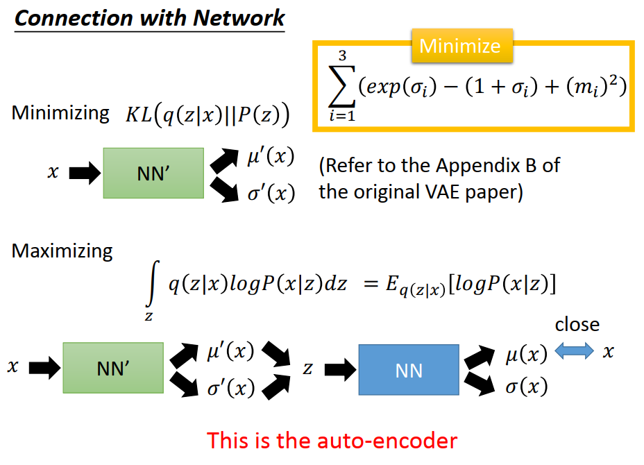

那所以呢,我们现在如果你要 minimize 这个 P(z)跟 q(z|x) 的 KL divergence (KL (q(z|x)||p(z)) )的话，你就是去调这个output μ'(z),这个output σ'(z) ,你就会调你这个q对应的那一个 neural network 让他产生的distribution可以跟一个normal distribution越接近越好。这件事情这个推倒我们就把它放在这个地方,你就自己参照这个 VAE的原始的paper.那minimize这一项其实就是我们刚才说的这一项,刚才说的在reconstruction error外另外再加的那一个看起来像是regularization 的式子，它要做的事情就是minimize这个 KL divergence，它要做的事情就是希望说 这个q(z|x)的output跟normal distribution是接近的

那我们还有另外一项,另外项是这样, 另外一项是要积分over q(z|x)乘上log P(x∣z) 对z 做积分$ \int_{z}q(z|x)log P(x|z)dz$ ，这一项的意思就是你可以想象就是我们有一个 log P(x|z),然后呢他用q(z|x)来做 weighted sum。所以你可以把它写成log P(x|z) 根据 q(z|x) 的期望值，所以这边这个式子的意思就好像是说我们从  q(z|x) 去sample data,就是给我们一个 x 的时候,我们去根据  q(z|x) 的几率分布去sample 一个 data,然后让 log P(x|z) 的几率越大越好，

这件事情其实就是auto-encoder在做的事情。什么意思呢,怎么从 q(z|x)  去sample一个 data呢,你就把x丢到neural network里面去，他产生一个 mean 跟一个variance,根据 这个 mean 跟variance 你就可以sample出一个z。然后接下来我们要做的事情就是,你已经做这一项了(  q(z|x) ),你已经根据现在的x sample 出一个z .

接下来你要maximize这 一个 z 产生x的几率( log P(x|z))，那这个 z 产生这个x的几率,是把这个z丢到另外一个neural network里面去，他产生一个 mean 跟variance 。那要怎么让这个几率越大越好呢,要怎么让这个NN output 所代表这个distribution 产生x 的几率越大越好呢, 假设我们忽视variance这一件事情的话,因为后来一般在实做里面你可能就不会把variance这件事考虑进去，你只考虑 mean这一项的话。那你要做的事情就是让 这个mean 跟你的 x越接近越好。你现在是一个Gaussian distribution，那Gaussian distribution在mean 的地方的几率是最高的，所以如果你让这个NN output这个 mean 正好等于你现在这个 data x的话，那这一项 log P(x|z) 他的值是最大的。

所以现在这整个case就变成说, input一个x，然后产生两个vector，然后sample 一下产生一个z，再根据这个z，你要产生另外一个vector,这个vector要跟原来的x越接近越好。这件事情其实就是auto-encoder在做的事情，你要让你的input跟output越接近越好。所以这两项合起来就是我们前面看到的VAE的loss function,如果你听不懂也没有关系,我前面有提供一个比较  intuitive 的想法.

### Condition VAE

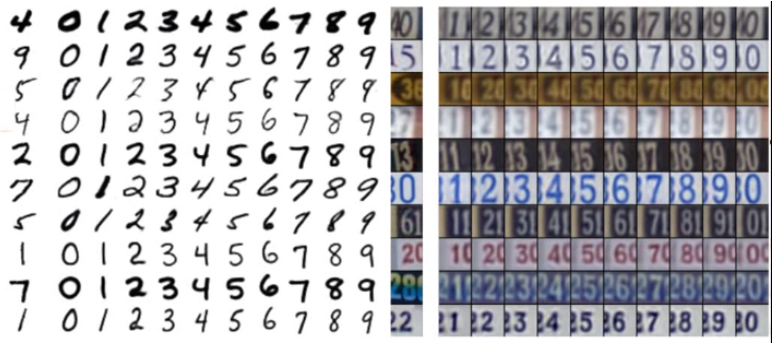

那其实VEA有另外一个事,叫做 conditional 的 VAE， conditional 的 VAE我们今天就简单讲一下概念就好了, conditional VAE 他可以做的事情是说,比如说如果你现在让VAE可以产生手写的数字，他就是给它一个digit，然后它把这个digit的特性抽出来,他抽出他的特性比如说他有他的笔画的粗细等等，然后接下来你再丢进encoder的时候,你一方面给它有关这一个数字的特性的distribution，另外一方面告诉decoder说它是什么数字。那你就可以根据这一个digit，generate跟它style很相近的digit。这应该在MNIST上面的结果(左图),reference在下面,右图是在另外一个数字corpus上的结果,你会发现说conditional VAE确实可以根据某一个digit画出其他的style相近的数字。这边是一些 reference给大家参考.

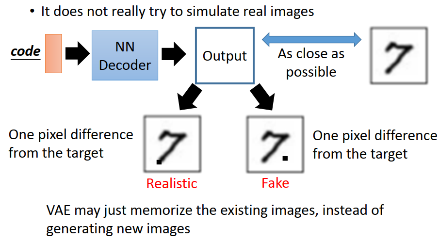

### Problem of VAE

VAE其实有一个很严重的问题,就是因为他有这个问题,所以之后又propose了GAN,那VAE有什么样的问题呢,VAE其实它从来没有去真的学怎么产生一张看起来像真的image，因为它所学到的事情是：它想要产生一张image，跟我们在database里面的某张image越接近越好。但是它不知道的事情是：我们在evaluate它产生的image跟database里面image的相似度的时候,我们是用比如说Mean Square Error(MSE)等等来evaluate两张image中间的相似度，今天假设我们这个decoder的 output跟真正的image之间有一个pixel的差距，他们有某一个pixel 是不一样的,但这个不一样的pixel他落在不同的位置其实是会得到非常不一样的结果。假设这个不一样的pixel他是落在7的尾部的地方,他只是让7的笔画比较长一点，跟落在另外一个地方(右边)。对人来说你一眼就可以看出说：右边是machine generate, 他是怪怪的digit，左边这个搞不好是真的,因为根本看不出来跟原来这个7有什么差异,他只是稍微长了一点,看起来还是很正常的。但是对VAE来说都是一个pixel的差异，对它来说这两张image是一样的好或者是一样的不好。

所以VAE他学的事情只是怎么产生一张image跟database里面的image一模一样，他从来没有想过说,要真的产生一张可以以假乱真的image。所以如果你用VAE来做training的时候，其实你产生出来的image往往都是database里面的image 里面的 linear combination而已。因为它从来没有学过要产生新的image，它唯一做的事情只有模仿而已,它唯一做的事情只有希望他产生的image跟database里面的某张image 越像越好,他只是模仿而已,或者最多就是把 原来database里面的image做  linear combination,他没有办法产生一些新的image,所以这样感觉没有非常intelligent.

## Generative Adversarial Network 

所以接下来就有 propose 另外一个方法,叫做Generative Adversarial Network(GAN)，Adversarial 是对抗的意思,然后他的缩写是GAN,你会发现他是很新的paper,他最早出现的时候是2014年的12月,所以大概是两年前的paper,

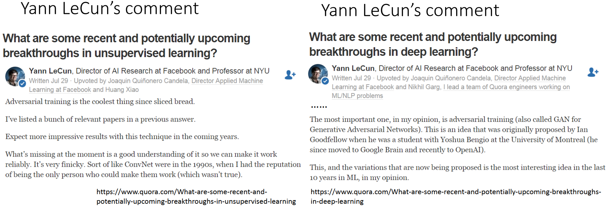

以下这边引用了这个Yann LeCun 对GAN的 comment，就是有人在quora上面 问了说,这个unsupervised learning 的 approach哪一个是最有potential的,然后 Yann LeCun 他 亲自来回答,他说adversarial training is the coolest thing since sliced bread, since sliced bread大家知道什么意思吗,我Google了一下是则俚语,如果翻译成中文的话就是有始以来的意思,这个since sliced bread是什么意思呢,sliced bread是切片面包的意思,那这个俚语的典故好像是说在过去面包店是不帮你切面包的,吐司面包考完他不帮你切,所以你买回去要自己切很麻烦,然后后来就有人发明说应该要先切了以后再卖,然后大家都很高兴这样子,所以 since sliced bread他在英文俚语里面是有史以来的意思,然后他说这是有史以来最酷的方法.

这边还讲了一些别的,他说 what is missing at the moment is  a good understanding of it so we can make it work reliably,it is very finicky .Sort of like ConvNet were in the 1990s,when I had the reputation of being the only person who could make them work(which wasn't true) ,就其实GAN非常难train,感觉好像只有 Ian Goodfellow propose 他们 可以做起来,其他人做起来,你可以Google 一下GAN 的code,很多人做在MNIST 上面,他们产生的digit 都不是很好看,就是我们用VAE随便做都可以打爆那些东西.所以真的产生image 很怪,但是你如果看paper的话,他的performance 是蛮好的,所以他里面还有很多不为人知的技巧,像过去大家相信说只有 Yann LeCun 可以train的起来CNN,不过其实不是这样子,

那其实我很无聊,我又找到另外一则这样子,就是有人问说,有没有什么最近的breakthrough 在deep learning里面,然后 Yann LeCun 又来回答了,他说 ,The most important one ,in my opinion,is adversarial training(also called GAN).This is an idea that was originally proposed by Ian Goodfellow.他说这个是 the most interesting idea in the last 10 years in ML.所以我们就看在这10年内最有趣的想法到底是什么样的,

### GAN

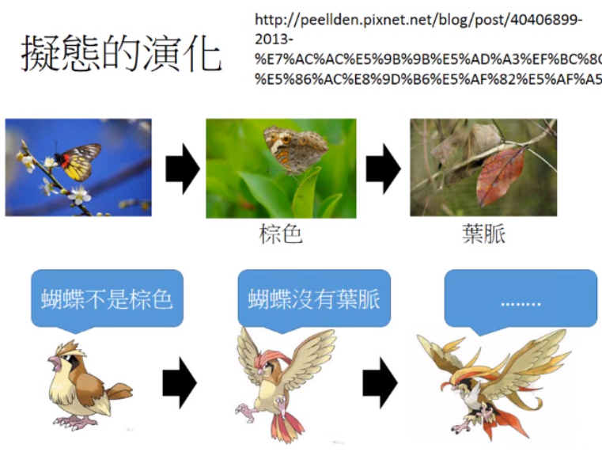

这个GAN的概念有点像是拟态的演化，比如这是一个枯叶蝶,他长的就跟枯叶一模一样)(第一行右图)，那枯叶蝶是怎么变得跟枯叶一模一样的呢,他怎么变成这么像的呢,也许一开始它长是这个样子(第一行左图)。然后呢但是它有天敌,就类似麻雀的天敌，比如像波波这样子他有天敌,天敌会吃这个蝴蝶，天敌辨识是不是蝴蝶的方式就是,它知道蝴蝶不是棕色的，所以它就吃不是棕色的东西。所以蝴蝶就演化了，它就变成是棕色的。但是它的天敌也会跟着演化，波波会变成哔哔鸟这样子,然后这个哔哔鸟知道说蝴蝶是没有叶脉的，所以它会吃没有叶脉的东西,他会ignored有叶脉的东西。所以蝴蝶又再演化就会变成枯叶蝶他就产生叶脉，它的天敌也还会再演化，天敌和枯叶蝶他们就会共同的演化，所以枯叶蝶就会长得越来越像枯叶，直到最后没有办法分辩为止,

### The evolution of generation

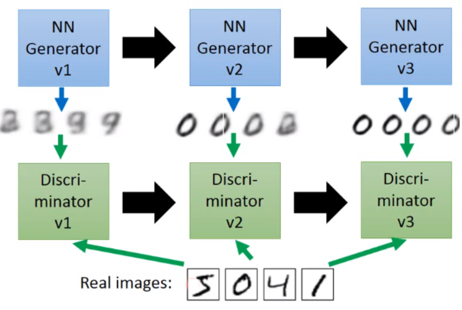

所以这个GAN的概念是非常类似的，GAN的概念是这样,首先有一个第一代的generator，第一代的generator很废, 他可能根本就是random 的,然后generate一大堆奇怪的东西,看起来不是像是真正的image的东西,假设我们现在要 generator的是digit。接下来有一个第一代的Discriminator,它就是那个天敌，Discriminator做的事情是,它会根据real的 image跟generator所产生的image去调整它里面的参数，去评断说,一张image是真正的image还是generator所产生的 image。接下来这个generator根据这个discriminator他又去调整了它的参数，所以他第二代generator他产生的digit就可能就更像真的，然后接下来discriminator会再根据第二代generator产生的digit跟真正的digit去再update它的参数。接下来有了第二代的discriminator会产生第三代generator，那第三代generator产生的数字又更像真正的数字,就是第三代的generator他产生的这些数字可以骗过第二代的discriminator，第二代的generator他产生的这些数字可以骗过第一代的discriminator,但是discriminator会再演化,他可能又可以分辨第三代的generator产生的数字跟真正的数字之间的差距,

但你要注意的一个地方就是,这个Generator它从来没有看过真正的image长什么样子，discriminator有看过真正的image 长什么样子，它会比较 真正的image和generator的output的不同，但是Generator从来没有看过真正的image,它做的事情只是想要骗过discriminator。所以因为generator从来没有看过真正的image，所以generate它可以产生出来那些image是database里面从来都没有见过的，所以这比较像是我们想要machine做的事情。

#### discriminator

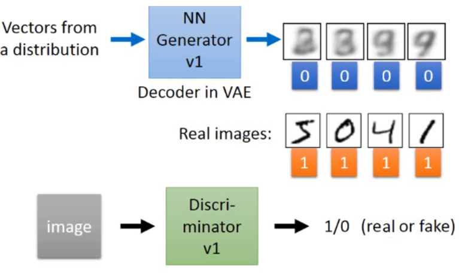

我们现在看这个discriminator是怎么train的,这边是比较直觉的,这个discriminator他就是一个neural network，它的input就是一张image，它的output就是一个number,你output就是一个scale,那你可能通过sigmoid function让他的值介于0-1之间，1就代表input这张image是真正的image，假如你要做手写数字辨识的话,那input image 就是真正的人手写的数字,0代表是假的,是generator所产生的。那generator是什么呢,generator在这边他其实他的架构就跟VAE的decoder是一摸一样的，它也是一个neural network，它的input就是从一个distribution(他可以是normal distribution 或者是任何其他的 distribution ) sample出来的一个vector，你把这个sample出来的vector丢到generator里面，它就会产生一个数字,产生一个image)，那你给它不同的vector，它就产生不同样子的image，那先用generator先产生一堆假的 image假的。然后呢我们有真正的image，那discriminator就是把这些generator所产生的image都label为0(fake)，然后把真正的image都label为1(True)。

接下来就只是一个 binary classification的problem,大家都很熟,你就可以learn一个discriminator,

#### generator

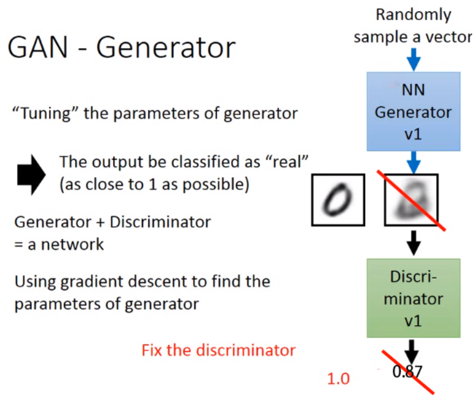

接下来怎么learn generator呢,那 generator的 learn 法 是这样子,现在已经有了第一代的discriminator，那怎么根据第一代 discriminator 把第一代的 generator  再 update 呢。首先如果我们随便给输入一个vector，它会产生一张随便的image，这个image可能没有办法骗过discriminator，你把这个generator产生的image丢到discriminator里面，他可能说这有0.87像这样子。然后呢接下来要做的事情是什么呢,接下来我们要做的事情是调这个generator的参数，让现在discriminator会认为说,generator generate 出来的image是真的，也就是说,要让 generator generate 出来的image丢到discriminator以后，discriminator的output必须 要越接近1越好，所以你希望说generator generate的是长这个样子的image，他可以骗过discriminator, discriminator output是1.0觉得它是一个真正的image。

这件事情怎么做呢,其实因为你知道这个 generator 是一个neural network，那 discriminator也是一个neural network，你把这个 generator 的 output当做discriminator的 input，然后再让它产生一个scale。这件事情其实就好像是,你有一个很大很大的neural network，他这边有很多层,然后你丢一个random的  vector，它output就是一个scale，所以一个generator加一个 discriminator他合起来就是一个很大的network，他既然合起来是一个很大的network,那你要让这个network再丢进一个random vector，他 output 1这件事是很容易的，你就做gradient descent就好了。你就gradient descent调整参数，希望丢进这个vector的时候，它的output是要接近1的。但是你这边要注意的事情是,你在调这个network的参数的时候，你在做back propagation 的时候你只能够调整这个generator的参数,只能算generator的参数对output的gradient，然后update generator的参数,你必须要fix 住discriminator 的参数。如果你今天不 fix 住discriminator的参数会发生什么事情呢, 你会发生说对discriminator来说，要让它output 1很简单，他这个最后output bias设1，然后其他最后weight都设0，output不就是1了。

所以你要让这整个network input 一个random 的vector，output是1的时候，你要把 discriminator的这个参数锁住，discriminator参数必须要是fix 住的,然后input 一个 generator,然后只调generator的参数，这样generator 产生出来的 image 才是一个可以骗过discriminator 的image。

#### GAN-Toy Example

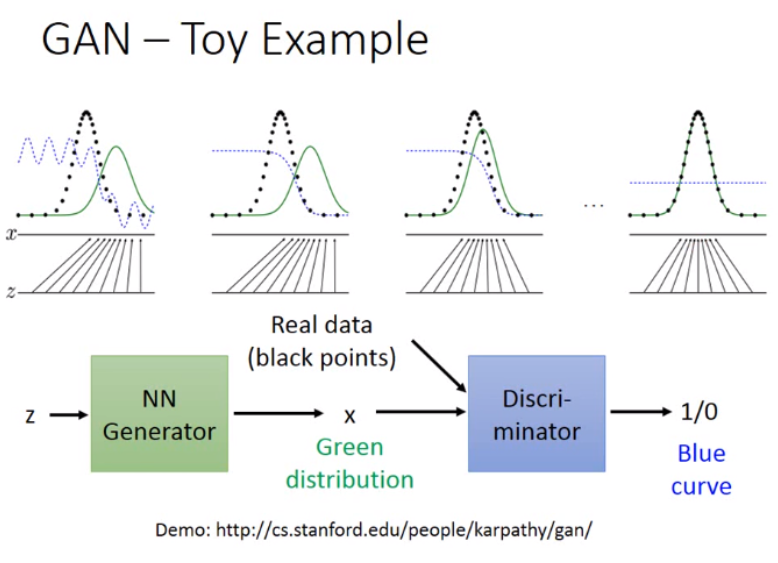

这边有一个来自GAN 的原始paper的Toy example，那我们来说明一下这个Toy example是什么意思,这个Toy example是这样子的,他说现在的这个z  space 也就是这个decoder 的 input,我们知道 decoder 的 input 就是一个 z,就是一个hidden 的 feature ,这个z 他是一个one dimension的东西,那他丢到generator里面，他会产生另外一个one dimension的东西, 这个 z 可以从任何的distribution 里面sample出来，那这边在这个例子里面他显然是从一个 uniform的 distribution里面 sample出来的，然后你把这个z 通过 neural network以后,每一个不同的z会给你不同的x，这个x的分布就是绿色这个分布。

现在要做的事情是：希望这个generator的output可以越像real data越好，他这边的real data就是黑色的这个点，假设有一组real 的data,就是黑色的这个点,你要找的这个distribution 是黑色这个点,那你希望你的 generator 的output,也就是这个绿色的distribution可以跟黑色的这个点越接近越好。那如果按照GAN的概念的话，你就是把这个generator的output 的 x跟real 的data,这些黑色的点,丢到discriminator里面，然后让discriminator去判断说现在这个value,其实现在这个x,还有这个real data都只是一个scale 而已,  现在这个scale他是 来自真正的data的几率跟来自于generator 的output 的几率,如果他是如果是真正的data 的话就是1，反之就是0.那 discriminator的output就是绿色的curve

那假设现在generator他还很弱，所以他产生出来的 distribution是这个绿色的distribution(第二张图图)，那这个discriminator他根据real data跟generator 的distribution他的样子你给他这个x 的值,他的output可能就会像是这一条蓝色的线，这条蓝色的线告诉我们说，这个discriminator认为说如果是在这一带的点(右半区)，他比较有可能是假的,他的这个值是比较低的,如果是落在这一带的点,他比较有可能是从generator产生的，落在这一带的点(左半区)，他比较有可能是real data。

然后接下来generator就根据discriminator的结果去调整它的参数, generator要做的事情是骗过discriminator，既然discriminator认为在第二张图左半区比较有可能是real 的data，generator 就把他的output往左边移，那你说有没有可能会移太多,就比如说就统统偏到左边去了，是有可能的,所以GAN很难train这样子,这个要小心的调参数，让他不要移太多,这个绿色的distribution(右图)就可以稍微偏一点,就比较接近真正real的黑色的点的这个distribution.所以generator会骗过它,他就产生新的distribution。然后接下来discriminator 会再update这个绿色的这一条线,那这个process就不断反复反复继续进行，直到最后generator产生的 output跟real data一模一样，那discriminator会没有任何办法分辨真正的data。

现在train GAN 的时候所遇到最大的问题,不知道discriminator是不是对的，因为你说discriminator现在得到一个很好的结果，那可能是generator太废，有时候discriminator得到一个很差的结果，比如说它认为每一个地方他都无法分辨是real 的value还是 fake的value，这个时候并不代表说：generator generate 的 很像，有可能只是discriminator太弱了，所以这是一个现在还没有好的solution的难题。

所以真正在train GAN的时候，你会怎么做呢, 你会一直坐在电脑旁边看它产生的image，因为你从那个 discriminator 跟generator 的那个loss你看不出来他generate出来image有没有比较好，所以就变成说你generator update一次参数,discriminator  update一次参数 ，你就会拿generator generate一些image看看有没有比较好这样子，如果变差了,方向走错了，再重新调一下参数，所以这个非常的非常的困难。

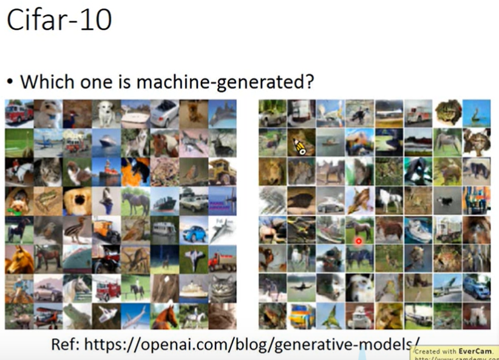

我们这边其实有人在线上放了一个demo,我们来看一下这个demo,非常realistic 的image.这个是openai 产生的 image,那如果我们问你说你觉得左边是real image还是右边是 real image(右边是电脑产生的),其实他还是没有办法骗过人,你会看到这边有很多怪怪的东西,有一些都很像,这个马还蛮像的(4,5),这个有飞鱼(3,8),大嘴巴的猫(4,8)有很多怪怪的东西,他其实没有办法骗过人,那我觉得如果放单一一张,比如光这个马的话,他可能可以骗过人.

就是这个openai 他们有做过那个实验,好像可以骗过有21%machine  Generative 的image 会被误判成real的,所以他其实可以骗过部分的人

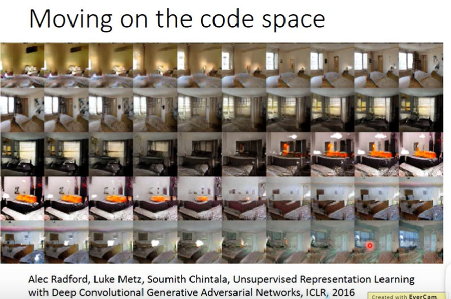

另外这边又有另外一个很惊人的结果,在文献上非常惊人的结果,就是说先拿很多房间的照片,让machine去 get train GAN,然后他可以 generate房间的照片,那我们说那个 generator 就是你input一个vector给他,他就output一张image给你,那你现在可以在那个input那个space上面去调你的vector,去产生不同的output,所以他说他先random找几个vector,random找5个vector,产生5张房间的图,接着再从这个点移动你的vector 到这个点这样,所以就会发现说你的image 逐渐的变化,然后跑到这个点(2,1),再逐渐的变化,再跑到这个点(3,1),你会发现一些有趣的 地方,比如说,这边有一个窗户(第三行第一个),他慢慢的就变成了一个类似电视的东西(第三行最后一个),然后这边有一个电视(第四行第一个),他慢慢的就变成了窗户这样(第四行最后一个),

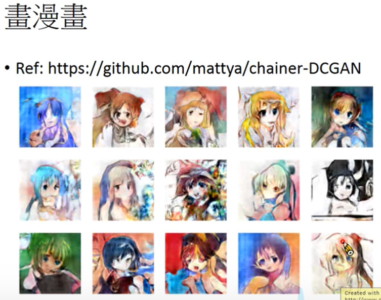

那我觉得最惊人的结果是有日本人用GAN画很神奇的东西,就传说中一旦你能够成功的使用他,他就可以召唤出不可思议的力量,但是大部分的时候你都没有办法成功的召唤他,他有点像是那个神之卡的感觉,你只要能够操控那个神,就可以获得不可思议的力量,但大部分的时候你都无法操控他,

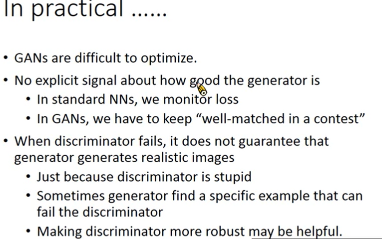

因为他最大的问题就是你没有一个很明确的signal，它可以告诉你说现在的generator到底做的什么样,没有一个很明确的signal,可以告诉你这一件事。在一个standard 的NN 的training里面，你就看那个loss，loss越来越小代表说现在training越来越好。但是在GAN里面，你其实要做的事情是：keep 你的那个generator跟discriminator他们是well-matched的 ，他们必须要不断处于一种竞争的状态。他们要像塔式亮跟近藤光一样,不断处于一种势均力敌的 状态.他们必须要成为对手.

这很麻烦，因为在GAN里面,你要让generator跟discriminator一直维持一种势均力敌的状态，所以你必须要用不可思议的平衡感来调整这两个generator跟discriminator的参数。让他们一直处于势均力敌的状态, 那 这个其实很像是在做 alpha go一样,你有两个agent,然后你要让他们一直处于一样强的状态.

那当今天你的discriminator fail的时候，因为我们最后train的终极的目标是希望generator产生出来的东西是discriminator完全无法分别的,也就是discriminator他在鉴别真或假的image上面,他的正确率是0，但是往往当你发现你的discriminator 整个fail掉的时候，并不代表说,generator真正generate很好的image，往往你们遇到的状况是因为generator是太弱了这样子。

那很多时候通常会遇到的状况是,generator他不管input什么样的 vector,他output都给你一张非常像的东西,那那一张非常像的东西不知道怎么回事就骗过了discriminator,那个是 discriminator 罩门,他无法分辨那一张image,那他整个就fail掉了,但并不代表你的machine真的得到好的结果这样子,

