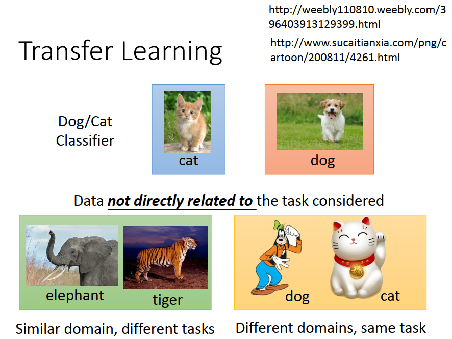
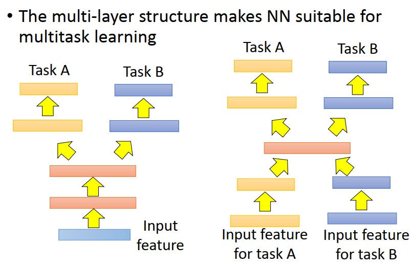
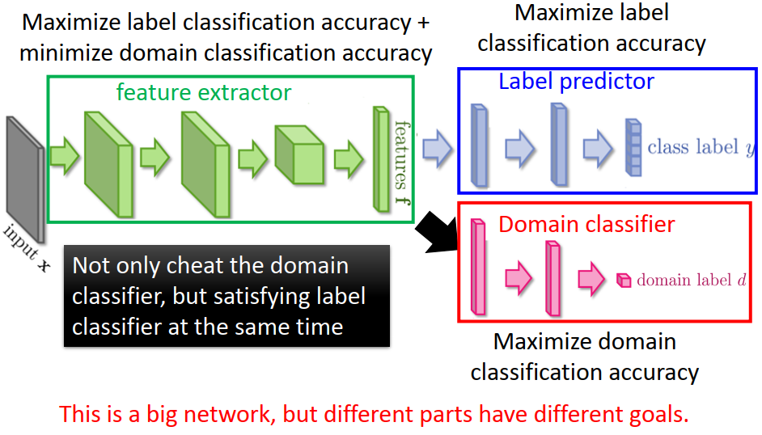
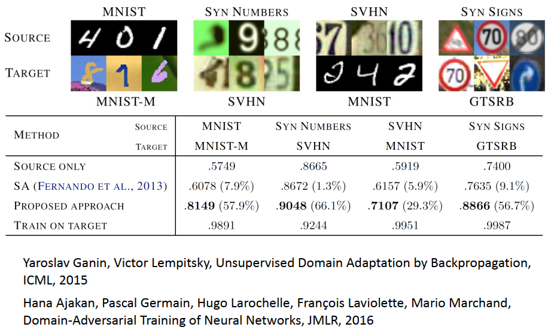

[TOC]

# P 30 19: Transfer-learning <!-- 74'2020.3 -->

## Transfer learning

Transfer learning指的意思是说，假设你现在手上有一些跟你现在要进行的task没有直接相关的data，那你能不能用这些没有直接相关的data来帮助我们做一些什么事情。比如说,你现在要做的是猫跟狗的classifier，那所谓的没有直接相关的data是什么意思呢,所谓的没有直接相关其实是有很多不同的可能。一个可能是比如说input的 distribution 是类似的,比如说input distribution一样是动物的图片，但是task你的label是无关的,比如说现在你的另外一些data其实是要分大象和老虎,你的input domain是像的，但是你的task是不一样的。还有另外一个可能是,你input domain是不一样的，但是你的task是一样的,比如说一样是要做猫狗的分类，但是你现在的图片是一些招财猫图片，跟高非狗的图片.跟原来的图片的 distribution 是非常不像的,但你要做的task是一样的,那 Transfer learning要问的问题就是,**我们能不能够再有一些不想关data的情况下，然后来帮助我们现在要做的task。**

那为什么我们要考虑Transfer learning这样的task呢,举例来说,在speech recognition里面,可能你现在要做的事情是台语的语音辨识，但是台语的data是很少的,那你就会想说我们今天能不能,但是其实语音的data是很容易收集的，你随便去YouTube 上爬一下,就可以爬到一大堆英文啊,中文啊,其他语言的data。那我们能不能够用其他语音的data来 improve台语的语音辨识这一件事情。或者是如果在image recognition里面, 或许你现在有兴趣的task 是做 medical 的images，你想让机器自动诊断说有没有tumour 啊什么之类的,这是现在很流行做这些事情,那可是这种medical 的image其实是很少的，不可能手上有太多这种image,但是实际上image的 data我们永远都不缺。你胡乱网络上爬就有一大堆image,或者你download 一下MNIST 里面,超过100 W张image,有这么多的image,只是不是 medical 的image,那这些其他的image对你现在要考虑的task有没有什么可能是有帮助的.

或者是在文件的分析上面,你现在要分析的文件是某个很Specific 的 domain,比如说你想要分析的是某种特别的法律的文件,那这种法律的文件或许你的data很少,但是假设你可以从网络上collect 到一大堆的data,那这些data有没有可能是有帮助的呢,

那其实 Transfer learning 这件事情是有可能的吗,用不相干的data用来自其他domain的data，来帮助我们现在的task，是有可能的吗,是有可能的,因为我们在现实生活中，我们都是不断的在做Transfer learning。比如说,你可能是是一个研究生，你可能想要知道研究生应该怎么样过日子，那怎么办呢,你就可以参考爆漫王这样子.那在爆漫王里面其实漫画家就是研究生，责编就等同于指导教授。漫画家每周都要画那个分镜然后去给责编看，然后就跟责编讨论,就像你每周要跟指导教授进度报告一样，画分镜就是跑实验。最后的目标就是要在Jump上面连载,那在Jump上面连载就是投稿期刊这样子,连 word embedding 都知道这一件事情,

所以说虽然我们没有一个研究生的守则，但是从爆漫王里面我们可以知道说：身为一个研究生应该要做什么样的事情。那你可能会觉得说,拿漫画来跟神圣的研究做类比，有点不伦不类,我跟你讲漫画家都是用生命来画漫画的,那其实比我们做研究认真多了。我不知道大家有没有看过爆漫王,我简介一下爆漫王的剧情,就30个字,爆漫王是说有两个高中生,一个叫真诚一个叫高木,然后不知道怎么回事就很想当漫画家后来就当了漫画家,故事就结束了.因为每一周都要连载,实在太累了,然后有一次真诚就累到要住院,要开刀,在住院的时候他手还是握着画笔在那画,然后大家都阻止他,然后他女朋友就来看他,然后他女朋友就决定要支持他,然后他女朋友就握着他的手继续画下去,所以这个就好像说你今天在做研究的时候,你觉得每周进度报告太累了,最终累到生病住院了,然后其他人都叫你不要再做研究,然后你女朋友来看你,把你手压在键盘上,让你继续写code.

还有比如说像那个里面有一个天才漫画家叫 新妻惠一儿他应该在影射他应该在影射那个尾田荣一郎,新妻因为他想要结束他现在的连载,然后就跟总编说他想结束现在的连载,然后就跟总编谈一个条件,我从现在开始接下来的十周,我都要是jump的人气第一名,如果我可以做到的话,你就要让我结束连载,如果做不到那继续画,画到死为止这样子.就像你跟指导教师说我做这个题目很腻了,我想要毕业,指导教师说你接下来连发十篇paper,都拿Best Paper Award,我就让你毕业.如果做不到就做到死为止.就是这个概念这样子,所以他们是比我们还要认真很多的,所以我觉得研究生都应该要看一下爆漫王.

## Transfer learning -Overview

Transfer learning 我们要怎么讲呢,Transfer learning 是这样子的,Transfer learning 有很多很多的方法，它是很多方法的集合。那在你以下听到的我用的这个terminology里面,这个地方的terminology有点混乱,所以不同文献用的词汇其实是不一样的,有些方法有人说算是Transfer learning ，有些方法有人又说不算是Transfer learning，这边是很混乱的，所以如果你看到我说的跟别人不一样,也有可能并不是我错或者是别人错,这个地方就是很混乱,你只要知道说那个方法是什么就好了。

那我们会怎么讲呢,我们讲法是这样,我们现在有一个我们想要做的task，然后有一些跟这个task有关的data这个叫做target data，我们有一些data是跟这个task无关的data，这个data叫做source data。那接下来我们讲法会是那个target data他有可能是有label的，也有可能是没有label的，那个source data他也有可能是有label的，也有可能是没有label的，所以现在我们就会有四种可能，所以之后我们就会分这四种可能来讨论。

上次我们讲到 Transfer learning我们可以分成四个不同的象限来讨论他,那我们的data分成两种,一种是 target data,一种是 source data,那所谓的  target data 是说这个 target data跟我们现在要考虑的这个task是直接相关的,那source data 他是跟我们现在要考虑的 task 没有直接的关系,当然什么叫做 没有直接的关系,这个定义是比较模糊的,有很多种很不同的定义方式,有人说比如说像说input都是image,但是如果这个image他们的distribution是很不一样的,这些image比如说一个是实物的image,一个是真正的东西的image,一个是动画的image,那他们就差很多,那就可以算是跟这个task没有直接相关,

等一下我们讨论的方式就是我们可以分成我们的 target data有可能是有Label 的,有可能是没有label的,那我们的source data也可能同时是有label的,有没有label的.所以总共有四种可能,那分别在这四种可能的情况下介绍一些方法,

### Model Fine-tuning 

那我们就先来讲假设我们现在我们的 target data跟source data同时都有label的情况下，那我们可以做什么事情, 最常见的,也最简单的做法就是,**fine-tuning你的model**

什么意思呢,我们现在看一下我们现在的task, 在我们现在的task里面，我们的target data(x^t^,y^t^)和source data(x^s^,y^s^)统统都是有label的，target data我们就用上标t 来表示,虽然target data里面我们有我们要找的 function的 input x^t^跟他的output y^t^,在 source data 里面,  我们有function的 input x^s^跟 y^s^.

但是通常我们会假设说：**现在我们的target data 他的量是非常少**, 如果target data量其实很多的话，你就直接当做一个一般的machine learning的problem直接拿来target data 来train你的model就好了，你也不需要做什么 Transfer learning，这边是假设说在做  Transfer learning的时候是假设说这个 target data 量是非常少的,而这个source data是很多的。虽然这个source data跟我们现在要考虑的task没有关系，但我们想知道说,在target data很少的情况下，如果有一大推不相关的source data到底有没有可能会有帮助。

#### one-shot learning

那如果你今天的target data的量非常少，少到只有几个example而已，这个就叫做one-shot learning。有人说 one-shot learning并不是,从他的名字来看好像是应该只有一个example,所以叫one-shot ,但有时候不见得只有一个example 产生叫one-shot ,反正意思就是如果你今天target data量真的非常非常少可以说你在做 one-shot learning

那这样子的task有什么样的例子呢,在语音上最典型的例子就是speaker的 adaption，什么意思呢,我现在的target data是某一个人的声音，我们要辨识某一个的声音,但是这个人的声音你不可能有太多的label data,你不可能对这个人的audio去做太多的 transcription,你可能只有他的非常少量的 transcription,比如说他可能只有对你的machine 说三句话，只有这三句话的label而已,那但是source data你有一大堆的audio data是来自于不同人的,那这些audio data 都transcription。那通常这种data你要collect 上万小时,都是有可能的,那你当然不可能直接就用target data,某一个 speaker 他的data去train一个语音辨识系统，这样一定会坏掉的。所以你会希望说：这个有好几w小时的source data在这个task里面可以有什么帮助。

那这边的处理方式其实是可以非常的直觉的，怎么做呢,你就拿你的source data直接去train一个model，然后接下来呢,你去fine tune你的model用这个target data,什么叫做用target data 来fine tune你的model呢,其实这个想法非常直觉的,你就把你在 source data 上train 出来的model当作是training 的 initial value **,当作是那个初始的值,**然后再用 target data 去train 下去,就结束了,但是这边可能会遇到的challenge是说, 

可能会遇到的这个问题是说source data他真的非常非常的少，所以你今天就算是在target data上面 train出一个好的model，当你把它当作model的 initialization再 去在source data上再去做training的时候，可能train下去可能就坏掉了。所以在train的时候要很小心,有很多可能的不同的技巧,

#### conservative training

比如说一个技巧叫做conservative的 training，conservative的 training是说你现在有大量的source data，比如说如果在语音辨识里面他就是很多不同speaker的声音，然后都做 transcription,那你可以去train一个拿来做语音辨识的neural network。接下来你有target data,target data是某个speaker的声音跟transcription，你可能只有5句10句那么多,那怎么办呢,如果你直接拿这些target data去train这个model train下去就坏掉了。那怎么办呢,你可以说我在training的时候下一些constraint (regularization)，让training的时候train完的新的model跟旧的model不要差太多。比如说你可以说我下一个constraint ,这下这个 constraint 其实就是加一个 regularization.之前我们在training 的时候你会加比如说L1,L2 的regularization,那在conservative的 training里面,你会加另外一种不同的 regularization,你会说我们希望说现在新的model的output跟旧的model的output在看到同一笔data的时候他们的output 越接近越好。或者是你可以下constraint 说新的model跟旧的model 他们的L2-Norm差距越小越好,**总之你就是做一些事情让你的新的model跟旧的model他们的差距不要太大**,这样就可以防止over fitting的情形.就可以防止说你的 target data只有一点点,train下去以后整个结果就坏掉了的情形

#### layer transfer

那另外的一个方法是layer的 transfer，你现在有用source data train好的一个model，那你把这个model里面的某几个layer拿出来直接copy到新的model里面去 。接下来你用你的source data只去train没有copy的layer,可能你只保留一个layer是没有copy，source data就只train那个layer就好,这样的好处就是你的source data只需要考虑非常少的参数，所以就可以避免over fitting的情形。当然如果你今天之后你source data够多了，你也可以说我最后还是要fine-tune整个model。这样也是可以的

##### 哪些layer应该被transfer，哪些layer不应该被transfer

###### 语音辨识的时候，你常见的做法是把一个neural network的后几层是copy的

那 layer transfer其实是一个非常非常常见的小小的技巧,那现在有可能的问题就是你可能会问的问题就是哪些layer应该被transfer，哪些layer不应该被transfer呢,有趣的是在不同的task上面需要被transfer的layer往往反而是不一样的。比如说在语音辨识上面，我们通常是copy the last few layers(最后几层)然后重新train input 那一层。为什么呢,在语音上你可以想成说每一个人,他用同样的发音方式，但是因为比如说口腔结构略有差异，所以同样的发音方式得到的声音是不一样的。那我们说这个neural network前几层他做的事情是从这个声音讯号里面得知现在这个语者说话的人他的发音方式，那你根据发音方式他就可以得到说现在说的是哪一个词汇, 他就可以得到辨识的结果。所以从这个角度来看，从发音方式到辨识结果，也就是neural network的后面几层是跟语者也就是说话的人是没有关系的，所以它是可以被copy的。而不一样的地方是从声音讯号到发音方式这一段可能是每个人都是不一样的。

所以在做语音辨识的时候，你常见的做法是把一个neural network的后几层是copy的,只有前面可能第一层用target data 用某一个speaker 的data train 。但是在image的时候我发现是不一样的，因为在image的时候通常是copy前面几层，只train最后几层。

###### image的时候通常是copy前面几层，只train最后几层

为什么呢,因为在image的时候你会发现说，当你在source domain上learn了一network，那你今天learn到的这个network,你learn 到的CNN通常前几层他做的就是detect最简单的pattern, 比如说前几层做的事情就是detect 有没有直线横线，或者是有没有简单的几何图形。所以在image上面一个neural network前几层learn的东西，它是可以被transfer到其他的task上面。而最后几层learn的东西往往是比较extract,这个比较 extract 的东西他就没有办法transfer到其他的task上面去。所以在做影像处理的时候反而是会copy前面几层,然后后面几层重train.

所以到底哪些layer要被 transfer其实是case by case,这边也是"运用之妙，存乎一心",

这边是一个image在layer transfer上面的实验， 这个是出自 bengio 在NIPS 2014 的paper, 这个实验是做在ImageNet上面,这个实验是说现在他把 ImageNet 的 corpus,应该是120 w张image分成source跟target，那这个分法是按照他的class来分的,我们知道  ImageNet  的image一个typical的 set out?? 是有1000个class,那把其中500 个 class归为source data，把另外 500 个class归为target data。横轴的意思是说,我们在做transfer learning 的时候copy了几个layer,所以copy 0个layer，就代表说完全没有做transfer learning，所以这是一个 base line,你就直接在这个 target data 上面train 下去 ,纵轴是top-1的 accuracy，所以是越高越好。

所以直接train下去的结果是白色这个点,没有做 transfer learning 是白色这个点,那如果今天是copy前面几个layer,只有train 最后几个layer 的时候呢,如果今天是只有copy第一个layer,train 剩下的layer,copy前面两个layer,copy第三个 layer,就是在 source data上面train 一个 model,然后copy第一个layer,或copy第二个,copy第三个,一直到copy前面7个layer,然后剩下的layer再用  target data去train,会得到什么样的结果呢.

你会发现说,其实如果今天,今天他的结果是会变差的,但是如果在前面只有copy几个layer 的时候,只有copy第一个layer 的时候,performance 是稍微有点进步的,如果copy前面两个layer,performance 几乎是持平的,但是如果 copy 的layer 太多,结果是会坏掉,但是他这个实验是想要显示说,在不同的data上面,train出来的 neural network **前面几个layer 是可以共用**的,后面几个layer可能是没有办法共用的

上面这一条橙色的线是说如果我们今天copy完以后还有 Fine-tuning 整个model的话,就是把第一个layer 在source domain上train 一个model,然后把第一个layer copy过去以后,再用 target domain Fine-tuning 整个model,包括前面copy过的layer的话,那你得到 performance 是橙色这一条线,那在所有的case上面都是有进步的,那其实这个结果是蛮 surprised 的,因为你不要忘了,这可是  ImageNet 的corpus,就是一般我们在做 transfer learning的时候,我们都是假设 target domain的data非常少,这边 target domain可是有60 W张的,你可能没有处理过这么多的image,所以这个 target domain data,他是非常非常多的,但是就算是在这个情况下,再多加了另外60 W张 image做  transfer learning,其实还是有帮助的,从结果看来还是有帮助的,

中间这两条蓝色的线是什么,这两条蓝色的线跟  transfer learning 比较没有关系,不过是这篇paper里面发现的一个有趣的现象,他说,假设,他是想要做一个对照组,他说我们今天在 target domain 上面 learn 一个model(听不懂就算了),然后把前几个layer copy起来,然后接下来我再用一次 target domain 的data,train 剩下几个;layer,那你可能前面几个layer 就fix 住,只 train 后面几个layer ,那你可能会觉得说直觉上来说这样train和直接train 整个model没有太大的差别,但是最后发现说,假设你fix前面几个layer,就是你先train好一个model,fix前面几个layer ,接下来只train后面几个layer,接下来重新train后面几个layer,结果是有些时候是会坏掉的,那他的理由是说今天在training的时候,前面的layer跟后面的layer其实是要互相搭配的,所以如果你今天只copy了前面的layer,然后只train后面的layer,你其实performance 会是比较差的,后面的layer就没有办法跟前面的layer 互相搭配,所以结果有点差,但是如果你可以 Fine-tuning 整个model的话,performance 就跟有没有 transfer learning 是一样的,这是另外一个有趣的发现,作者自己对这件事情是蛮 surprised 的,

这是另外一个实验结果,这个实验结果是要说红色这一条线是我们刚才在前一页看到的红色的这一条线,这边是说假设我们的source跟target是比较没关系的，也就是说把这个ImageNet 的corpus分为source data跟target data的时候，把比如说自然界的东西通通当做source，那你target统统是人造的东西桌子椅子等等，这样子的transfer learning会有什么样的影响。那他发现说如果你今天source 跟target 的data是不太一样的,是差很多的，那在做transfer learning的时候，你的performance会掉的比较多,不过前面几个layer,还是影响是比较小的,如果你只是copy前面几个layer的时候，performance仍然跟没有跟copy是持平的。这意味着说,就算是你现在的source domain跟target domain是非常不一样的,一面是自然的东西一面是人造的东西，在neural network的第一个layer，他们仍然做的事情很有可能是一样的。这个绿色的这一条线,这个烂掉这一条线是说,假设我前面几个layer的参数是random的,那会发生什么事情呢,得到的结果其实就是烂掉了,这是一个base line

### Multitask Learning

那另外一个我们要讲的是 Multitask的 Learning,那在 Multitask 的Learning里面,Multitask Learning跟fine tuning略有不同地方就是,在fine tuning里面我们care的 是target domain做的好不好，在source domain上learn 一个model,接下来target domain上fine tuning,那你现在care的是 target domain 上做的好不好,fine tuning以后source domain 坏掉了就算了,那在Multitask Learning 里面我们其实同时care target domain跟source domain做的好不好。我们同时care 在这两个domain上能不能够同时把它做好,

那怎么做呢,其实如果我们今天用的是 deep learning base方法的话，它特别适合拿来做这种Multitask 的Learning，因为你可以说,我丢一个neural network,假设你现在两个不同的task他们用的是同样的feature的话,比如说你们都做影像辨识，只是现在影像辨识的class 不一样的话,那你可以说我就learn一个neural network，input就是两个不同task常用的feature,但是中间会分叉出来一部分的network他的output是task A的答案，一部分的network output是task B的答案。这么做的好处是,你的task A跟task B他们在前面几个layer就会是共用的,在前面几个layer 会同时使用 task A跟task B 的data去同时train前面几个layer,所以前面几个layer 是用比较多data train 的，所以他可能有比较好的performance。那你要做这件事的前提就是,你要确定这两个task他们有没有共通性，是不是可以共用前面几个layer。

今天有时候有一些更 crazy 的task,是你现在连input都是没有办法share 的,就是有可能 你input都是没有办法share 的,但是你可以说我今天先, 两种不同task的 不同的input,我们都用不同的 neural network把它 transform到同一个domain上面去,在同一个domain上你再apply不同的neural network，把一条路去做task A，一条路去做task B,中间可能有某几个layer是share的。如果在这样子的task下你也可以做transfer learning，就算是task A跟task B的input ,output完全不一样，如果你觉得在中间几个layer他们有共同的地方，你还是可以用这样子的model架构来处理。

#### Multitask Learning  \- Multilingual Speech Recognition

Multitask Learning一个很成功的例子就是多语言的语音辨识，假设你现在手上有一大堆的不同语言的data,比如说你有法文，德文,西班牙文,意大利文,还有中文，那你在train你的model的时候，你在train你的拿来做语音辨识的neural network 的时候,你可以train一个model他同时可以辨识这五种不同的语言。这个model 的前面几个layer他们会共用参数，后面几个layer每一个语言可能有自己的参数，这么做是合理的。因为虽然说是不同的语言，但是都是人类说的，所以前面几个layer它们可能是就可以share同样的咨讯，可以共用同样的参数。

其实在translation你也可以用同样的事情，假设你今天既要做中翻英，也要做中文翻日文，那你可以把这两个model一起train。在一起train的时候,反正在中翻英还是中文翻日文，你都要把中文的data先做process，那把中文的data先做process那一部分的neural network就可以是两种不同语言的data共同使用的。

那有人就会问说,这个 transfer  他到底可以transfer 的多广,会不会说比如说德文法文都是同样的语系的语言,所以他们是可以transfer  的,但是这些欧洲的语言跟中文,或许是不能 transfer  的,目前在语音这边的发现是,几乎所有的语言都可以 transfer ,

过去还有人说收集了十几种语言，然后把它们互相之间两两都做transfer，做了一个很大的N*N的table，每一个case 都有进步。所以目前发现大部分的case，不同人类的语言就算你觉得它们不是非常像，它们也都可以互相transfer。

这边举的这个例子是从欧洲的语言去transfer到中文上，这个中文的data我记得可能不是太多,可能是10小时.这边横轴是中文的training 的data，纵轴是辨识的character error rate。你会发现说你一开始data很少,假设你现在只有用中文直接train一个model，你现在data很少，error rate当然就很大，那你data越来越多，到100多个小时的时候,你的error rate就可以压到30以下。但是今天如果你有一大堆的欧洲语言，你是把这些欧洲语言跟中文一起去做multitask 的training，用这些欧洲语言的data来帮助中文的model前面几层让它train更好。你会发现说,就算是在中文data很少的情况下，你有做transfer learning，你就可以得到比较好的performance。当然中文data越多的时候，中文本身的performance是越好，但是就算是你中文100小时的data借用一些从欧洲语言来的 knowledge.对这个辨识还是有微幅帮助的。所以这边的好处是说,假设你做Multitask Learning的时候，你会发现你有100多个小时跟你只有这边大概是50小时以内，如果你有做transfer learning的话，你只需要1/2以下的data就可以跟原来有两倍的data做的一样好.

常常有人会担心说,transfer learning会不会有负面的效应，会不会有negative的 transfer 的结果.是有可能的，如果两个task不像的话，你的transfer 就是negative的。你今天两个task不像,你要让你的neural network同时做两个task反而把结果弄糟了.但是有人会觉得说,总是在思考说两个task到底之间能不能够transfer，然后 trial and error,这样很浪费时间。所以有人propose这个progressive 的neural network。

### progressive neural networks

这个progressive的 neural network 其实是很新的做法,这个是16年的放在arxiv上面的paper。你会发现说他还是有很多问题的.这个方法是这样子.他说我先up?? task 1,我就先train一个task 1 的neural network，蓝色这个 neural network, train好以后它的参数就fix住了，那现在我们要做task 2，做task 2 的时候怎么样呢,我们一样有一个 neural network,但是task 2它的每一个hidden layer都会去接前面task 1的某一个hidden layer的output。所以在training 的时候他的好处就是, 你今天就算是task 1跟task 2非常的不像，首先task 2的data不会去动到task 1的model，所以task 1一定不会比原来更差。再来就是task 2他去借用task 1的参数，但是它可以把这些参数就直接设为0，这样子也不会影响task 2的performance。最糟糕的情况下,就跟自己train 的 performance 是差不多的. 如果 task 3你也就做一样的事情，你的task 3会同时从task 1和task 2的hidden layer得到information。

那你可能会觉得说这个model感觉有点怪怪的,如果我今天有5个 task,第五个task不就是要接前面四个task吗,对啊,他是怪怪的,作者也有说怪怪的,等待大家提出更好的想法.

### Domain-adversarial training

接下来是,我们要讲的是,假设我们的 target data是unlabeled ，而我们source data是label的时候我们可以做什么样的事情呢,

这边的task 是这样,在source data我们有 function的input, 也有function 的output，但在target data我们只有function的input，没有function的output。举例来说,我们可以说：我们的source data是MNIST的 image，那我们的 target data是另外一个 corpus, MNIST-M的 image,他就把这个 MNIST 的image加上一些奇怪颜色的背景。然后MNIST是有label的，我们知道每一张image 对应到哪个digit,但是 MNIST-M他是没有label的，那在这种情况下我们通常是把source data就视作training data，把target data就视作testing data。那这边的问题就是,你的 training data跟你的 testing data是非常mismatch.你怎么在这种 source data MNIST 上train 出来的一个model直接 apply 到另外一个 corpus 上面,他也work呢,虽然另外一个corpus他要做的事情也是辨识数字0~9,但是他们input的image 是非常不一样的,要怎么把在  source data learn 出来的model 也可以 apply 到  target data 上面呢.

如果你今天直接learn一个model，他的input就是一张image，你就不管,你就直接说这算 mismatch 的training 跟 testing 也没有关系,直接learn 一个model,直接 learn下去看他会怎样的话,你会发现你的结果可能是会烂掉。如果我们把一个neural network当做是一个 feature 的extract，我们知道neural network 的 前面几层我们可以看做是在抽feature，后面几层可以看做是在做 classification。如果我们把neural network 的前面几层看作是在抽  feature 的话,我们把这个feature拿来看，会发现什么事呢,我们会发现说,不同domain 的data它的feature根本就完全不一样，比如说如果把MNIST的 feature 丢进去的话，它是蓝色的这些点,你会发现蓝色的这些点其实他很明显的分成10群,是0到9总共10个数字,但是如果你今天是把另外一群image, 把另外一个corpus的image 丢进去的话，你会发现他抽出来的feature就是红色这一群,这边是有把做t-sne 降维以后的结果,他做出来就是红色这一群 。所以你会发现说, 今天做feature extraction的时候，原来source domain 的 image跟target domain的 image,他们根本就不在同一个位置里面，他们抽出来的feature跟我们完全不一样,所以后面的classifier,他虽然可以把蓝色的这部分做好，但红色的这一部分他就只能无能为力。

### Domain-adversarial training

所以肿么办呢？所以这边希望做到的事情是,前面的feature extract 它可以把domain的特性去除掉，这一招叫做Domain-adversarial training。等一下会讲为什么这边出现 adversarial 这个字,我们之前已经看过 adversarial 这个字在前面讲这个 GAN的时候,GAN 就是 Generative adversarial 的 model,这边又出现了 adversarial ,这边 adversarial 跟那个GAN 他的原理是非常像的.这边我们希望 feature  extract 做到的事情是他可以把domain 的特性消掉,也就是 feature extract 的output不应该是红色跟蓝色的点分成两群，不同的domain不应该是分成两群,而是不同的domain 应该都被混在一起,我们希望这个  feature  extract 他的 output是可以把不同的 domain的 image 混在一起,也就是把不同的 domain的特性取消掉。

那怎么learn这样的feature extract呢, 这边的做法就是在后面接一个domain 的classifier。把feature extract的 output丢给domain的 classifier，domain 的classifier它也是一个classification的 task，它要做的事情就是说：根据现在feature extract给它的feature，判断说这个feature来自于哪一个domain，在这个task里面，就是要分辨这些feature是来自于MNIST那个 corpus 还是来自于另外一个MNIST-M的 corpus。

这件事情就是有一个generator 的output，然后有一个discriminator这件事情，让它的架构非常像是GAN。但是跟GAN不一样的地方是：之前在GAN那个task里面，你的generator要做的事情是产生一个image，然后骗过discriminator，这件事很难。但是在这个Domain-adversarial 的training里面，要骗过domain classifier太简单了。肿么做呢,有一个solution就是：不管看到什么东西，output都是0，就骗过classifier了,结束。

所以如果光只是train 这个domain classifier是不够的，因为feature extractor可以很轻易骗过domain classifier

所以你要给feature extractor增加它任务的难度，所以这个feature extractor它output 的feature不只要同时骗过domain classifier,他还要同时让label的 predictor做得好。这个label predictor它就吃feature extractor的 output，然后它的output就是10个class。

所以今天你的feature extractor他不只要骗过domain classifier，他同时还要满足label predictor的需求。他抽出来的feature不只是要把domain的特性消掉，他同时还要保留原来的digit 的特性。那如果我们把这三个network放在一起的话。实际上他就只是一个大型的neural network而已，他有很多层,就像一个在 Multitask Learning会用到的 neural network 一样,

但是这个 neural network他是一个各怀鬼胎的neural network,一般的neural network就是整个neural network 里面每一个参数他想要做的事情都是一样的，他们有共同的目标,他们要minimize loss，他们要 optimize accuracy,但是在这个neural network里面.他的network他们参数是各怀鬼胎的。这边蓝色这部分 label predictor 他想要做的事情是把class 的分类做的正确率越高越好，domain classifier要做的事情是他想要正确的 predict 一个 image是属于哪个domain。feature extractor他想要做的事情是：他同时 要improve label predictor 的 accuracy，但他同时想要minimize domain classifier 的accuracy。

所以这个 feature extractor 他是一个不好的队友, 就是 domain classifier他想要做 domain classification 这件事情,但是   feature extractor 他想要做的事情是捅他队友一刀这样子,他队友想要选总统,但是他背后捅了他一刀这样子,他不想要让他选总统,所以他想要做的事情,跟他队友想要做的事情是相反的,所以他是一个会陷害他队友的model,

那这个 feature extractor怎么陷害他的队友呢(domain classifier), 这件事情其实是很容易的，你只要加一个gradient reversal layer就行了。也就是今天你在做back propagation的时候,你的 domain classifier 计算 back propagation的时候不是有 forward跟 backward 两个class 吗，那在做backward class 的时候你的domain classifier传给feature extractor什么样的value，feature extractor就把它乘上一个负号。也就是domain classifier 告诉你说某一个value应该要上升，它就会故意下降。所以他就做一个跟  domain classifier要求相反的事情.

那domain classifier因为他看不到真正的image，所以它最后一定会fail掉。因为它所能看到的东西都是feature extractor告诉它的，所以它最后一定会无法分辨feature extractor所抽出来的feature是来自于哪个domain

但是今天的问题就是domain classifier一定要奋力的挣扎，这个model其实虽然讲起来原理很简单,但我相信实际上的training可能跟GAN一样,是没有那么好train 的,今天这个domain 的classifier 他一定要奋力挣扎,因为它一定要努力去判断说现在的feature是来自于哪一个domain。如果你的 domain classifier是比较弱,他比较懒惰, 他一下子就放弃不想做了,那你就没有办法把前面的 feature extractor 逼到极限,就没有办法让前面的 feature extractor 真的把 domain 的information remove 掉,如果domain 的 classifier 他根本很 weak ,比如说他一开始就不想做,他output 永远都是0 的话那你的  feature extractor 胡乱弄什么  feature 都可以骗过 domain classifier 的话,那你就达不到你把 domain  的特性remove 掉的效果,所以今天这个 task里面你一定要让 domain classifier奋力挣扎然后最后才死掉,这样你才能够把 feature extractor 的潜能逼到极限.

那这个其实你看这个很新的方法,这边引用的是 ICML 2015的 paper跟JMLK 2016 的paper,

这是paper中的一些实验结果，做了不同的domain 的transfer。包括从 MNIST 上  transfer到MNIST-M上,从这一个数字的 corpus transfer到 另外一个数字的 corpus ,从这一个数字的 corpus transfer到 MNIST 上面,然后两种不同的道路号字的 data的互相 transfer.那如果我们看一下现在的实验结果的话，这个纵轴代表用不同的方法，这边有一个用 source only 的方法,就是说我们直接在 source domain 上train 一个model,然后test 在 testing  的domain 上,所以在这四个结果里面，你会发现说：如果只用source only的话，performance 是比较差的。这边他有比较另一个 transfer learning 的方法,那这个留给大家自己去参考文献,那这个 proposed 的方法,是也就是我们刚才讲的这个 Domain-adversarial 的 training,如果你用 Domain-adversarial training 的话,你得到的结果是这个,你先看最下面这一行,最下面这一行是说你直接拿 target domain 的data去做training ,那你会得到 performance 是最下面这一个 row,这个其实是你的 performance 的 upper bound ,所以你会发现说如果你用 source 的data 跟 target data train 出来的结果是很有天差地远,这中间有一个很大的GAP,如果你今天用  Domain-adversarial training  的话,你会发现说他其实可以有很好的 improvement ,在不同case上都有很好的 improvement ,

### zero-shot-learning

接下来我要讲的是zero-shot 的 learning,在 zero-shot 的 learning 里面,跟刚才讲的task 是一样的,我们只有 source data有label，target data 没有 label。那你可以说在刚才task里面我们可以把source data当做training data，target data当做testing data，但是实际上在zero-shot learning里面，它的define又更加严苛一点。它define是：**今天在source data跟target data，它的task是不一样的。**

什么意思呢,比如说如果在影像上面,你可能是要分辨猫跟狗，但是你的source data里面可能有猫的class，有狗的class。但是你的target data里面,你的 image是草泥马这样子，在你的 source data里面是从来都没有出现过草泥马，如果在source data里面从来都没有出现过草泥马的话, 那machine 有办法看到他就说是草泥马吗，不觉得这个实在是太强人所难了。但是这个task其实在语音上很早就有solution了，其实语音本来就常常会遇到zero-shot learning的问题。

假如我们把不同的word都当做一个class的话，那本来在training的时候跟testing的时候你就有可能看到不同的词汇。你的testing data里面本来就有一些词汇,英文的词汇这么多,至少10 W 个不同的词汇,你testing data 的时候本来就有一些词汇是在training的时候从来没有看过的。

那在语音上我们怎么解决这个问题呢,语音上我们的做法就是不要直接去辨识一段声音属于哪一个word，我们辨识的是一段声音属于哪一个phoneme 。如果不知道phoneme 是什么的话就想成是音标就好了,所以我们辨识的单位不要定成word,而定成 phoneme, 然后我们在做一个phoneme  跟table之间对应关系的表，这个东西我们叫做 lexicon ,也就是词典。我们建一个文字跟 phoneme之间的对应关系的表根据 domain  knowledge. 在辨识的时候只要辨识出phoneme 就好，然后你再去查表说：这一段phoneme 对应到哪一个word。这样就算是有一些word是没有出现在training data里面的，只要他在你建好这个 lexicon  里面是有出现过，你的model可以正确辨识出进来的声音是属于哪一个phoneme  的话，你就可以处理这个问题。

那在影像上是怎么做的呢,在影像上我们可以把每一个class用它的attribute来表示，也就是说：你有一个database，这个database里面你会有所有不同可能的 object 跟它的特性。假设你现在要做的事情就是辨识动物，但是你的training 的data跟testing 的data他们的动物是不一样的。但是你有一个database，这个database 里面告诉你说：每一种动物它们有什么样的特性。比如狗他就是毛茸茸，四只脚，加有尾巴；鱼是有尾巴但没有四只脚,没有毛茸茸,chimp,这个黑猩猩有毛茸茸,没有四只脚然后没有尾巴,黑猩猩是没有尾巴的,猴子才有尾巴.

然后你今天这个attribute你要定的够丰富，每一个class都要有他的独一无二的 attribute,如果两个class 他的 attribute 一模一样的话,等下那个方法会fail 掉。那在training的时候，我们不直接辨识说：每一张image属于哪一个class，而是去辨识说：每一张image里面它具备什么样的attribute。所以你的neural network learning 的 target就是说：看到猩猩的图，就要说：这是一个毛茸茸的动物，他是没有四只脚的动物，是没有尾巴的动物。看到一个狗的图就要说：这是毛茸茸的动物，有四只脚的动物，有尾巴的动物。

那在testing的时候，就算今天来了一张你从来没有见过的image，那没有关系。你今天neural network 他的任务也不是要detect说：input 这张 image它是哪一种动物，他只要 detect 说 input这一张image 他有什么样的attribute。所以input你没有见过的动物，但是你只要能够把它attribute找出来，然后你就查表看说：在你的database里面哪一种动物它的attribute跟你现在model 的 output最接近。有时可能没有一个正好一摸一样的,那也是没有关系的，就看说谁最接近，哪一个动物他的 attribute 跟 neural network 现在的output 最接近,那那一个动物就是你要找的.

那有时候你的attribute可能非常的复杂,你的attribute dimension可能很大，甚至可以做attribute的 embedding。也就是说现在有一个embedding 的 space，把training data里面每一张 image都透过一个transform，把它变成embedding space上面的一个点。然后把所有的attribute也都变成embedding space上面一个点，那这个g(∗)跟f(∗)他们都可以是neural network，那training的时候就是希望 f 跟 g 越接近越好。那在testing的时候如果有一张没有看过的image，你就看说这个 image 的 attribute embedding 以后跟哪一个attribute最像，那你就知道说它是什么样的image。草泥马翻译就是 Grass-mud horse 

这边的意思是说我们要把, image跟attribute他们其实都可以描述成 vector，这边想要做的事情是把image 跟 attribute 投影到同一个空间里面。也就是说：你可以想象成是对image的vector，也就是图中的x，跟attribute的vector，也就是图中的y都做降维，然后都降到同样的 dimension。所以你把x通过一个function f都变成embedding space上的vector，把y通过另外一个function g也都变成embedding space上的vector。

但是要怎么样找这个f 跟g 呢, 这边 f 跟g 你可以说就是neural network。input一张image它变成一个vector，或者input一个 attribute  vector 他变成一个vector。这个f 跟g 怎么找呢, 你的training target就是你希望说：假设我们已经知道说这个y^1^是x^1^的attribute，y^2^是x^2^的attribute，那你就希望说找到一个f跟g，它可以让x^1^跟y^1^投影到embedding space以后越接近越好，x^2^跟y^2^投影到embedding space以后越接近越好。

那如果你现在已经把f跟g找出来了，现在假如有一张你从来没见过的image叫做x^3^在你的testing data里面，它也可以透过这个f变成embedding space上面的一个vector，接下来你就看说这一个embedding 的 vector x^3^它应该跟y^3^的embedding 最接近，那y^3^就是它的attribute,那你就再看说他对应到哪一个动物,比如说他是 Grass-mud horse ,他就是草泥马.

有时候你会遇到一个问题，就是如果我根本没有database呢.我根本不知道每一个动物他的attribute是什么，肿么办呢, 那你可以借用word vector。我们知道说word vector的每一个dimension就代表了现在这个word他的某种attribute。所以你不一定需要一个database去告诉你说：每一个动物他的attribute是什么。假设你有一组word vector，这组word vector里面你知道每一个动物他的对应的word的word vector，这个 word vector 你就拿一个很大的 corpus,比如说?? train 出来, 那你就可以把你的attribute直接换成word vector，所以你就把 attribute 统统换成那个word 的word vector, 再做跟刚才一样的embedding就结束了。

那其实刚才的training 这边是可以稍微讲一下的, 假设我们的training 的criterion是说我们要让x^n^通过f(x)跟y^n^通过g(y),他的距离越接近越好。你就是找一个f 跟 g minimize f(x^n^) 跟 g(y^n^) 的距离,这样子你觉得OK吗.这样子其实是会有问题的，因为这样你的model就只会learn到说：它把所有不同的x跟所有不同的y都投影同一点，这样子距离最少,就结束了。所以如果你的loss function这样定其实是不行的，所以你需要稍微重新设计一下你的loss function。前面这个loss function只有考虑到说如果我们知道 x^n^跟y^n^ 是一个 pair,要让他越接近越好，但没有考虑到的是 我们如果知道x^n^跟另一个y^n^他不是同一个pair，那它们的距离应该要被拉大。前面这个 loss function没有考虑到这件事,所以应该要改一下这个 loss function.

怎么改这个loss function.,一个可能是你把他改成这边这是一个max, max的里面的两个的element分别是0 跟 k-f(x^n^)跟g(y^n^)的inner product，加上一个max,找一个m不等于n,然后f(x^n^)跟g(y^m^)的inner product。这个k是你自己define的margin,这个k是一个constant，training的时候自己define

那今天这边有一个max,他的其中一个element一个是0，另外一个element是一个看起来很长的式子( k-f(x^n^)∗g(y^n^)+max f(x^n^)∗g(y^m^)),这个是什么意思呢. 它会从0跟这个式子里面选一个最大的，所以今天这一项他的最小值就是0。那什么时候他会等于0呢, 当你另外一项,不是0 的这一项,他的值小于0的时候，这个loss他就会是0。所以你今天如果k-f(x^n^)∗g(y^n^)的inner product 再加上后面这一项$max_{m\neq n}f(x^n)*g(y^m)$的inner product小于0的时候，这一项会是zero loss，然后我们再整理一下,这两项移到右边(非k 的两项),然后把左右对调, 得到下面这个式子$f(x^n)g(y^n)-max_{m\neq n}f(x^n)*g(y^m)>k$,所以如果看下面这个式子的话,你就比较清楚这一项的含义是什么,下面这个式子的意思是说,什么时候我们会有 zero loss 呢,当 我们的f(x^n^)跟g(y^n^)他的inner product 的值大于另外一个,假设我现在在所有不是y^n^ 的y里面找一个m出来，这个m他是跟f(x^n^) 最接近的.但就算他们的 inner product 最大,他还是要比正确的答案小一个k,就是如果今天x^n^跟y^n^他们之间的inner product值要很大,要有多大,他要大过所有其它的y^m^跟x^n^的inner product，而且要大过一个margin k。所以如果你定这个式子的话,你不只是把 pair起来的 image 跟 attribute 拉近,你同时也要把那些不成pair的东西,不成对的东西把他拆散. 

#### convex combination of semantic embedding

其实还有一个更简单的Zero-Shot learning的方法叫做convex combination of semantic embedding。这个方法是说：我们也不要做什么learning，假设我们现在有一个off the shelf 的语音辨识系统，跟一个off the shelf  word vector，这两个可能不是你自己train 的,从网络上载下来的，就可以做这件事情。

怎么做呢, 我把一张图丢到neural network里面去，然后它的output说他没有办法决定他是哪一个class，但它觉得有0.5的几率是lion，有0.5的几率是tiger。接下来你再去找lion跟tiger的word vector，然后把lion跟tiger的word vector 用1 : 1的比例混合, 0.5 的tiger的vector +0.5 的lion 的vector得到另外一个新的 vector ，那你再看说哪一个word 的word vector跟这个混合以后的结果最接近。假设是liger这个字最接近的话，那这个东西就是liger,liger是什么呢,liger就是狮虎这样子.老虎跟狮子生下的后代叫 liger.

这个是paper 里面举的例子,他paper 里面就是用这个例子,你在这边你不需要做任何training ,你只要有一组word vector,一个语音辨识系统,就可以做这样子的 Transfer learning, 以下是这个方法的实验结果，我觉得其实还也颇惊人的。我们来比一下人类跟机器的差别，我们来看第一张图，你觉得他是什么,我们来看机器觉得怎么样呢,假设你没有做Transfer learning, 就直接拿一个CNN来，他说他觉得最有可能的是sea lion是海狮，其实他也是奇奇怪怪的内容,比如 cowboy boot,蛮像 cowboy boot的,但像是他说是海狮,答海狮的你跟这个machine 同一个等级,那正确答案是什么呢,正确答案是 Stellar Sea lion,北海狮这样子,所以 image Net 其实是一个 很崩溃的 corpus,这是很崩溃的task,就是在这种task上面,你就觉得说机器真的有可能赢过人的,因为我觉得应该不可能有人可以答对这个正确的答案,

这个 DeViSE是另外一个方法,他是我们刚才讲的把 word vector 跟 image都 project到同一个 embedding space上的结果,在这边看他的结果,并没有很好而且比较荒谬的答案比如说 flip-flop 之类的，ConSE是刚才讲的,那一个完全不用 training 的方法,结果很惊人,他的前五名里面,是有北海狮的, 而且他其他的答案也都是海狮,California sea lion,Australian sea lion , South American sea lion等等. 

那这边有举另外一个例子,我们刚才都用草泥马当作例子,但是那个例子并不是乱取的,因为image Net 里面真的有草泥马的,这个大家都知道是草泥马,Machine  的答案是这样子,第一名是Tibetan mastiff.这个是敖犬这样子,拿铁手套跟他打,然后有一种 titi monkey ,我也不知道是什么,然后 Koala ,chow-chow好像是一种狗,松狮狗之类的.所以他其实蛮像敖犬的,llama 是什么. llama 其实就是草泥马,所以他表面上看起来有答对但其实没有答对,因为答案是另外一种llama 这样子,这种草泥马,如果你有看过草泥马传奇的话他其实是部落里面最强的骑手才能骑他的,所以草泥马其实有很多种,至少有三种,这一种是最强的,反正他不是llama就对了.llama的脸是尖的,这种的脸是圆的.那 DeViSE 方法是得到比较怪的结果,那其实这个task 有点难,所以这可能是一个比较失败的例子, 这一个 network (ConSE )其实也没有得到正确的结果.他得到最边界的时候 domestic  llama.

那这个 Zero-Shot learning 刚才举的例子都是影像的例子,最后我举一个 文字的例子,这个结果其实是蛮新的,这个结果是最近才被放到 arXiv 上面是Google 的paper,那你知道现在不止要放 arXiv ,还要做漂亮的动画在部落格上面.

这个漂亮的动画是这样子的,这个动画里面是说,这个是做machine translation.现在在training的时候，machine看过说如何把英文翻成韩文有这种data，他还知道怎么把韩文翻成英文有这种data，他知道怎么把英文翻成日文有这种data，他知道怎么把日文翻成英文有这种data。接下来它从来没有看过日文翻韩文的data，但是他可以翻，它从来没有看过韩文翻译日文的data，所以他也可以翻。

这件事情是怎么做到的呢,如果你看那个部落格的文章的话,他好像有第一个版本的 title是很手动的,就是说 Google 的machine 发明了自己的 secret language,后来标题就被偷偷改了,后来看到另外一个版本标题这样子.他实际上做的事情是这样子,那篇部落格不知道是谁写的,

这边要做的事情是这样子,为什么zero-shot learning 在这个task是可行的呢,因为如果你今天用同一个model做了不同语言之间的translation以后，machine可以学到的事情是怎样的呢, 他可以学到的事情是对不同语言的input 都把他不同语言的不同的句子他可以project到同一个space上面,而在这个space 上面他是 language independent 的,这个 space上面的位置只跟这个句子的 semantic 有关.

举例来说这个是paper 里面的例子, 这个paper 里面的例子是说我们现在根据我们learn好得那一个 translator，那个translator 有一个encoder，它会把你input的句子变成vector，decoder根据这个vector解回一个句子，就是翻译的结果。那如果我们今天把不同的语言都丢到这个encoder里面让它变成vector的话，那这些不同语言的不同句子在这个space上面分布有什么样的关系呢.

它发现说如果今天有日文、英文、韩文的三个句子，这三个句子讲的是同一件事情，是一样的意思,通过这个encoder 的 embedding以后他们在这个space上面其实是差不多的位置,其实就是在圈出来的位置。在左边这个图上面不同的颜色代表说同样的意思,但是他们这些句子虽然是同样的意思,但可能来自于不同的语言。比如说这边红色的这三条线,他们在这个space上是在一起的,代表同样的意思,但是他们其实是来自于不同的语音,

所以你说这样子算是machine发明了一种新语言其实也算是还可以蛮有意思的，如果你把这个embedding space当成一种新的语言的话。machine他做到的事情就是他发现了一种 sequence language，对每一种不同的语言他都先转成这种只有它自己知道的sequence language，再从这种sequence language转成另外一种语言

所以今天就算是有某一个翻译task ，你的input语言和output语言是machine没有看过，它也可以透过这种他自己学出来的sequence language来做translation。

这边是更多zero-shot learning  的paper给大家参考。那其实  zero-shot learning 像刚才看到用在image 的分类上面,其实现在被用在Caption Generation 上面,希望machine 看到一个他从来没有看到的东西,他也可以用自然语言来描述说他现在到底看到什么,或者看到什么动作.

### self-taught learning & self-taught clustering

那剩下一点点部分,我想要讲的是,有时候你遇到一个状况是,target data有label,source data是没有label的, 我们刚才讲的状况都是 source data有label 的状况,有时候 你会遇到 source data 没有label 的状况,但是 target label 可能 有label,可能没有label.这种 ,target data有label,而source data没有label的状况叫做self-taught learning。这种target label没有label，source data也没有label,这种状况叫做self-taught clustering,就算是一种这种状况.

那在 self-taught learning里面,作者有强调说他这个跟一般的  transfer learning 不一样的,你知道这个名词都是大家自己定的,在这个   self-taught learning作者里面他的想法是  transfer learning 是有data的,在 source domain 有label data才叫 transfer learning, self-taught learning 不算是一种  transfer learning.不过后人其实都把  self-taught learning 当成是一种    transfer learning 就是了.不过这个就只是文字上面枝枝节节的小问题.

那这个 self-taught learning 是怎么做的呢,另外有一个必要要强调,就是   self-taught learning 跟 semi-supervised learning 有一些 不一样的地方,我们讲说 semi-supervised learning 在learning 的时候,你也是有一些label 的data,有一些unlabel  的data,所以你可以说这个  source data  他是  unlabel  的data, target data 是 label 的data,所以这也是一种  semi-supervised learning ,但是这种semi-supervised learning  跟一般的 semi-supervised learning 有些不一样,因为一般 semi-supervised learning 你会假设你那些 unlabel  data至少还是跟你的label data是比较有关系的,但是在这个task里面,在 self-taught learning里面,你那些  unlabel  data 那些 source data  跟 ,target data他的关系是比较远的,

那其实  self-taught learning  他的概念很简单,他说假设我们现在的 source data 够多,虽然他是unlabelled ,我可以去learn 一个 feature extractor, 那在原始的  self-taught learning 的paper 里面,他的  feature extractor 是 sparse coding,但是现在这个paper 比较旧了,现在也不见得要用 sparse coding 可以learn.比如说  Auto-encoder,用 Auto-encoder  的 encoder  来做 feature extractor .总之你有大量的data,他们没有label,你可以做的事情是用这些data去learn 一个好的 feature extractor , 用这些data去learn 一个好的 representation,然后用这个   feature extractor在你的 target data上面 去抽 feature ,那在 self-taught learning  那一篇原始的paper 里面,他其实做了很多的task,我们这边不要一一细讲好了,那这些task 都显示还 self-taught learning  是有可能可以得到蛮显著的improve

