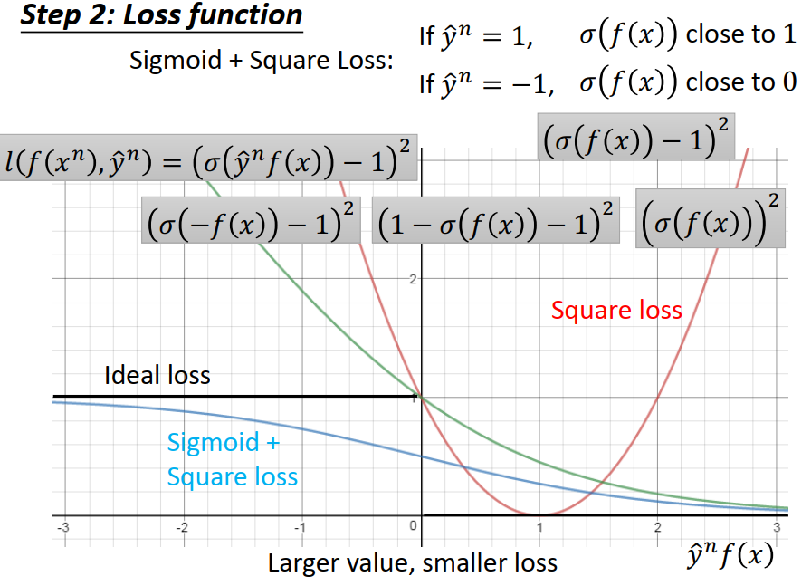
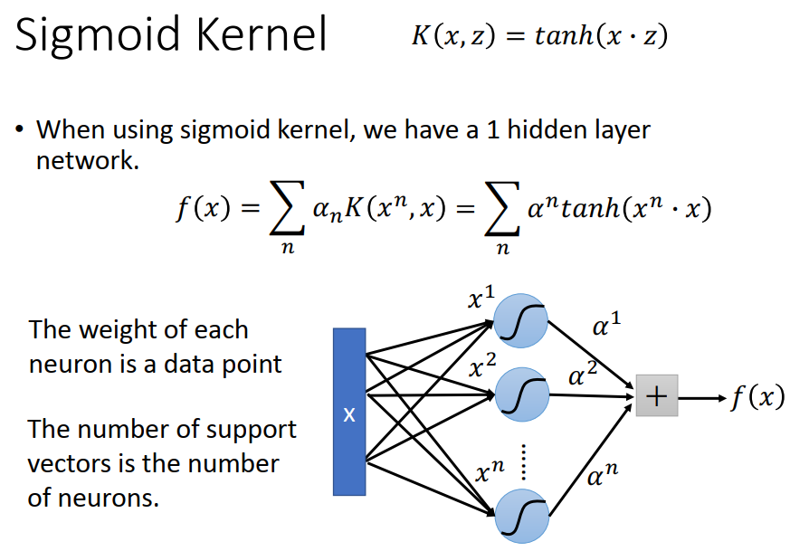

[TOC]

# P 31 20- Support-Vector Machine(SVM) <!-- 65' -->

方法之间其实如果你很熟悉整个 Machine Learning 的原则的话,不同的方法之间他们其实是非常像的,所以其实就算你没有办法把所有方法都学过,其实也是一法通,万法通,就是machine learning 的方法其实是非常非常多的,我觉得你并不需要很汲汲营营的把所有的方法都觉得你应该要学过一遍,掌握几个大原则,其实你就可以了解大部分的方法.

Support-Vector Machine 是什么呢,Support Vector machine他有两个特色：

- 第一个是他用了 **hinge loss,**等一下我们会讲，hinge loss是什么
- 另外一个是我觉得他最厉害的地方：他有个kernel trick

把hinge loss+kernel trick就是Support Vector machine,就是SVM.

## hinge loss

我们现在讲一下 hinge loss 是什么,回到我们在开学的时候讲过的 binary classification 的问题,我们讲过说在理想上,binary classification 应该要怎么做呢,在理想上我们期待说我们知道说一个 Machine Learning 的 solution他往往就 有三个 step,在  binary的 classification里面,

### step 1: function set

第一个 step是我们想要定义一个 function g(x) ,这个  g(x) 他里面有另外一个 function f(x),当 f(x)>0 的时候,他的 output 就是 +1 ,代表 某一个class, 当 f(x)<0 的时候,他的 output 就是 -1 ,代表另外一个class,那我们现在的training data,我们是 supervised 的problem,所以每一笔data都有一个 label $\hat y$,我们现在假设  $\hat y$ 就用 +1 和-1 来表示,分别代表两个不同的class,

之前在讲logistic regression的时候,我知道说我们在讲  $\hat y$ 的时候我们是用1和0表示, 但是这边要用 +1跟-1 来表示比较顺这样,那你知道说用 +1和-1 来表示跟用 0跟1 来表示是讲一件事情,都是讲同一件事情,就只是朝三暮四的差别而已, 但是这边如果用  +1和-1 的话, 等一下在写式子的时候是会比较顺的, 所以这边用  +1和-1 ,只要记得他的差别就好了 , 

### step 2: Loss function

那 Loss function 呢, 理想上一个最理想的Loss function是写成像下面这个样子，
$$
L(f) = \Sigma_n \delta(g(x^n) \neq \hat y^n)
$$
当今天这个 g(x) 的output 跟 $\hat y$ 不一样的时候,machine 就得到一个 loss 1,如果一样的时候就没有loss ,所以一个很理想的 Loss function 是 summation over 我们今天所有的 training  data,然后呢,对每一笔 training  data 都带进去 g(x) 里面看他的output 是多少,他可能output +1,也可能 output -1,接下来看他的output 跟  $\hat y$ 是一样的还是不一样的,如果是不一样的你就得到一个 loss 1 ,反之就是0 ,δ 加一个括号的意思就是里面这一件事情如果为真的话,δ 这个function 的output就是1,所以如果 $ g(x^n)\neq \hat y^n$,那 δ的output就是1,所以我们现在的loss 就变成 g 在 training set上总共犯了几次错误,当然希望他犯的错误是越少越好,

但是在今天这个 task里面,你要做 optimization ,你要用第三步找一个好的function这一件事情变得有点困难,因为你的loss 是不可微分的,,这个东西是没有办法微分的,所以你根本没有办法用 gradient descent 来解他,怎么办呢,我们把这个 δ 用另外一个 approximate 的loss 来表示,直接 minimize这个 δ做不到,所以我们不直接 minimize 这个 δ, 我们 minimize 另外一个 loss function,这边写成 小写的 l,那至于这个 loss function可以长什么样子,你就可以自己随便定了,

图中是我们的g,他里面有 一个 f(x),这个图上的横轴为$\hat y^n f(x)$，那我们会希望说因为今天这个 $\hat y^n$可以是+1,也可能是-1,那我们希望如果 $\hat y^n$是+1 的时候,f(x) 要越positive(大)越好，$\hat y^n$如果是−1 的时侯，f(x)应该要是越负越好。所以整体说来你会希望$\hat y^n f(x)$两者相乘以后他的值越大越好，他们要是同向,他们要是同号,他们两个乘起来要越大越好,所以今天原则就是如果我们把纵轴当作是loss的话,原则就是越往右, $\hat y^n f(x)$越大.loss就应该要越小,

那我们刚才讲的理想的状况是什么样子呢, 我们刚才讲的理想的状况是假设今天  $\hat y^n 跟 f(x)$ 他们是反向的,他们相乘以后你得到的值是负数的话,那你得到的loss 就是1,反之如果他们是同向的,你的loss 就是0 ,这个是理想的状况,但这件事情是没办法微分的,

#### Square Loss

那我们现在做一个 approximation,我们把 δ 用 l 来取代,这个纵轴就是l 的值,你可以选各种各式各样不同的function 来当作l 这个 function,举例来说你可以说我现在的loss 的定法 我期望当   $\hat y^n =1$ 的时候, f(x)跟1 越接近越，$\hat y^n=-1$的 时侯，f(x)和-1 越接近越好。这个是 Square loss

Square loss他其实可以写成这个样, Square loss 的这个loss 可以写成 $l(f(x^n), \hat y^n)=( \hat y^n f(x^n)-1)^2 $ ,为什么呢, 如果我们今天 $\hat y^n$ 代1 的话, 这个 function就变成 $ ( f(x^n)-1)^2$, 如果$\hat y^n$ 代-1 的话, 这个 function就变,成 $ ( -f(x^n)-1)^2$,那  $ ( -f(x^n)-1)^2$ 可以写成 ,因为他在平方里面,所以可以把负号拿掉 ,$ ( f(x^n)+1)^2$, 也就是 $ ( f(x^n)-(-1))^2$, 所以当你写这个式子的时候,你就意味着如果  $\hat y^n = 1$ 的时候, f(x^n^) 要跟1 越接近越好,   $\hat y^n =-1$ 的时候, f(x^n^) 要跟-1 越接近越好,

Square loss 的function ,你把这个 function 画出来 他对这个  $\hat y^n f(x)$是写成红色线的样子,但是这个东西是不合理的,我们一开始在讲 binary classification 的时候,我们就讲过你用 Square loss 是不合理的,从这个图上你就可以更明确的看出他的不合理性,因为我们不希望说  $\hat y^n $ 跟 f(x^n^)  成起来很大的时候居然有一个很大的loss,

#### Sigmoid+Square loss

那另外一个是  Sigmoid+Square loss,这边我们 Sigmoid 就用一个 σ 来表示, 那我们希望 $\hat y^n = 1$ 的时候,σ( f(x^n^) )趋近于1 ,   $\hat y^n =-1$ 的时候, σ(f(x^n^)) 趋近于0, 这个式子可以写成 这个样子$l(f(x^n), \hat y^n)=( σ (\hat y^n f(x^n))-1)^2 $ ,为什么呢,如果你把 $\hat y^n$ 带 1 的话,那没有问题,很直觉的就是希望这个 output 和 1 越接近越好, 带 -1 的话呢, 变成  $ (σ(-f(x^n))-1)^2$,  σ(-f(x^n^))  是什么呢,如果你了解这个  Sigmoid function 的特性的话,你把里面 的值取一个 负号,其实就是 $(1-σ(f(x^n))-1)^2$,我想这个你们想一下的话应该可以体会,然后这个1 可以消掉,所以就变成    $ (σ(f(x^n)))^2$,  总之你写这个 式子的意思就是希望说 f(x^n^) 通过 Sigmoid function 以后 如果 他的答案是1 他就要接近1,如果 他的答案是-1 他就要接近于0,这个式子写出来是蓝色的这一条线,

### cross entropy

那我们之前有讲过说其实你在做 logistic regression 的时候 你不会用  Square loss 当作你的loss ,因为他 的 performance 不好,我们之前 应该也有实际操作过,你不会用 Square loss ,其实你会用 cross entropy,

那如果用 cross entropy 的话 我们才 在  logistic regression 的时候 我们其实真正用的是 cross entropy, cross entropy 的意思我们其实之前讲过 ,就是你的这个  σ(f(x^n^)) 代表了一个 distribution,那你的 Ground Truth 是另外一个 distribution, 这样的 distribution 之间 的 cross entropy 就是你要去 minimize 的 loss ,如果你回头过去把  Square loss 的function 写出来的话, 你会发现其实这个 function 可以写成$ l(f(x^n),\hat y^n)=ln(1+exp(−\hat y^nf(x)))$,这边我们就不做多余的推到,可能比较麻烦,你自己推一下就知道,

那这一个式子是不是合理的呢,他其实是合理的,你想想看 当你今天的  $\hat y^n$ 乘上 f(x^n^) 趋近于无穷大的时候,当他趋近于 无穷大的时候 ,Exponential 负的无穷大 是0 ,那 就变成 ln (1+0),得到的结果是 0,所以 当 $\hat y^n f(x)$ 趋近于无穷大的时候, 这一个  Sigmoid  +cross entropy 这样的 loss function 他是绿色的这一条,他会趋近于0, 如果你今天  $\hat y^n f(x)$  他的 负很大的时候,Exponential  里面会是正的很大,再加上1 ,他的值会很大,再取log 以后他还是无穷大的,就是log整个 Exponential  消掉 ,如果 Exponential  在里面是无穷大的话,得到的结果还是无穷大的,所以你得到的值是无穷大的,

所以今天灰色的式子 $ l(f(x^n),\hat y^n)=ln(1+exp(−\hat y^nf(x)))$,是绿色这一条线,在这边我特别把它偷偷除了个log 2, 你对 loss function 除一个 constant 不会影响你最后找出来的解, 我们这边 偷偷除了一个log 2,为什么呢,因为我们要 偷偷除 log 2 以后,你可以让绿色的线变成 刚才 ideal loss 的 upper-bound,也就是说我就可以 claim 说 ,我们虽然没有办法 minimize ideal 的loss,就是黑色的这条线,但是我们可以去 minimize 他的 upper-bound,希望 minimize  upper-bound 就可以顺便 minimize 这个  ideal 的 loss function,

那我们可以比较一下 绿色和蓝色的这两条曲线,你就可以比较了解说为什么我们之前会选择用 cross entropy  而不是用 Square error 来当 做我们的loss function 在我们做 logistic regression 的时候,因为你想想看我们今天如果我们把  $\hat y^n$ 乘以 f(x^n^) 从 -2移到-1 的时候 如果是 Square error +Sigmoid  他的变化很小, 如果是 Sigmoid  +cross entropy 他的变化就非常大,那所以对 Sigmoid  的这个 function 来说 他在这种极端的case,在你的值非常的negative的时侯,照理说应该要有很大的 gradient,你应该 赶快调整你的值,但是实际上不是如此,因为在值很大的时候,当你在这一项   $\hat y^n f(x)$  非常 negative的时侯,你调整你的值,对你最后的 total  loss 影响不大,所以就会变成说对这个  Square loss+Sigmoid 的case来说,就算是他调整了他 negative 的值,他也没有办法得到太多的回报,所以他就会不想要调整那些非常 negative的值, 那对这个 cross entropy  来说,他的努力是可以得到回报的,所以他就会很乐意把 原来很 negative的值 把它往正的地方推,所以我们用 cross entropy 的时候在实作上你会比 Square error 还更容易training ,所以我们 在做 logistic regression 的时候 都是用 cross entropy ,

### hinge loss

那 hinge loss呢,hinge loss呢,他是写成一个很特别的式子,他写成这样 $l(f(x^n),\hat y^n)=max(0,1−\hat y^nf(x^n)) $,他说我们的 loss function 是 maximum, 其实我们刚才在讲 zero shot learning 的时候其实是有看到 类似的function,我们这边写成  $max(0,1−\hat y^nf(x)) $, 今天如果 $\hat y^n$ 带1 ,那 loss function 就是 $max(0,1−f(x)) $, 那什么样的状况下今天我们会有一个 zero的loss呢,因为这边是  $max(0,1−f(x)) $,所以这个 function 最小的值 是0 ,什么时候会达到这个 function 的最小值,会达到 loss 是0 最完美的状况呢,只要 1- f(x)<0 就行了, 1- f(x)<0 的时候 这个 loss 的值就会是0,也就是说只要  f(x)>1的时候这个 loss 就会是 0 , 如果今天$\hat y^n$ 等于-1  的时候,这个 loss function会写成  $max(0,1+f(x)) $, 那要让loss 等于0,我们就是要让   1+ f(x)<0 ,也就是要让    f(x)<-1

所以今天你用   hinge loss 做 training 的时候 你想要让 machine 做到的事情,什么时候machine 会觉得 他的loss 是0 ,他已经做到 完美的case了呢,他如果今天 对一个 positive 的example 来说  f(x)>1的时候是完美的case, 对一个 negative example 来说,他的    f(x)<-1 的 时候 他就是一个完美的case, 他的值不用太大,你把    f(x) 变成2 loss 也不会比较小,你把   f(x)变成-2  loss 也不会比较小 ,他只要 大过1 跟 小于 -1 就可以,

很容易把 hinge loss  的话,他长得像是 紫色这条线的样子,你会发现说在紫色的这一条线上,在平的 good enough 的那一段,只要 $\hat y^nf(x)$ 大于1 的时候,就已经够好,你的loss就已经是0,再更大都没有帮助,但是今天 如果   $\hat y^nf(x)$ 是 positive ,是 positive 还不够好,就是如果今天   $\hat y^n跟 f(x)$ 是同向,那machine 在做 classification的时候他已经可以得到正确的答案,根据我们刚才前面定出来的 step 1定出来 的function,他也就可以得到正确的答案,

但是对  hinge loss  来说,这样还不够好,他会说你只得到正确的答案还不够,你要比正确的答案还要好过一段距离,这个距离 就是margin,也就是说,当你今天     $\hat y^nf(x)$ 还没有大于1 的时候,你其实还是会有 penalty 的, 促使这个machine让     $\hat y^nf(x)$ 大于1 这样子,

你可能会问说,为什么这边是 1 呢,你可以想想看如果这边是1 的话,hinge loss  才会是 ideal loss 的 一个 tight的 upper-bound,如果你用 其他值的话,他可能就不是一个那么 tight 的 upper-bound, 所以  hinge loss  跟我们刚才看到 的 cross entropy 一样,他也是一个我们ideal 的 loss function 的 upper-bound,所以我们也会期待说 我们 可以 minimize   hinge loss  然后就可能可以得到  minimize   ideal loss function  的效果,

那 如果我们比较  hinge loss跟  cross entropy 的话,你会发现说它们最大的不同来自于他们对待已经做的好的example的态度，今天如果我们把    $\hat y^nf(x)$ 从1挪到2，对cross entropy来说 你可以得到 loss 的下降**,所以cross entropy  他会想要好还要更好,**如果你今天 已经可以把     $\hat y^nf(x)$ 的值做的够大, cross entropy 他有动机要让他的值 更大,因为这样还可以 减少 loss, 但是对  hinge loss 来说呢,如果你采用的是  hinge loss function **,他是一个 及格就好的 loss function ,所以今天只要你的值大过 你的 margin 的时候就结束了,**就这样子了，他就不会想要再做的更好，那你可能会问说在实作上到底 Hinge loss 跟  cross entropy 他们的 performance 有什么样的差别呢,在实作上的差别可能没有你想像的那么显著,有一些时候我们会看到  Hinge loss 可以略胜  cross entropy ,但其实也没有 赢那么多. 那你 采用 Hinge loss的时候有一个好处是他比较不害怕 outlier,那你learn 出来的结果 会是比较 robust,这个等一下我们在讲 kernel 的时候会比较明显的看到这个结果

如果你看这个 Hinge loss 跟  cross entropy 的差别的话,就是这个 cross entropy 就好像是说你现在期末考你有很多要读,但是你就只想要拼死读一棵而已,你想要把某一科考到100 分,其他如果你念不起来的你就会放弃,因为你最后可能就被21??了,那  Hinge loss  他会顾全所有的科目,他会所有的科目都考到及格就好了,所以他其实是会 欧趴 的,所以如果今天你有 outlier的时候, Hinge loss会给你比较好的结果 , cross entropy 会给你比较差的结果,等一下我们在别的角度再看这个问题的时候可能是会更清楚.

## linear SVM

#### step 1: function(model)

那现在什么是 linear 的SVM,  linear 的SVM是说我们现在 的function 就是 linear 的,  我们现在的 f(x) 就是, x 里面的 每一个 feature  x~i~ 乘上他的 对应 的weight w~i~, summation 起来 再加上 b, 那我们可以把这件事情看作是两个 vector 的 inner product,其中一个 vector 是 model 的  parameter w 跟 b concatenate起来的 的vector, 另外一个vector是 x 的feature 的 vector 跟 1 concatenate起来的结果,如果你把这两个 vector 做 inner product 的话,那你就会得到 左边这个式子,所以在等一下影像的说明里面, 我们把w 跟 b 串起来的那个vector 直接就用 w 来表示,这个东西是你的model的参数,是要透过 training data 来把它 找出来的, 下面 x 跟 1  concatenate 在一起的结果,我们就当作是一个 新的feature ,你就想象我们每一个 feature 下面都有 concatenate 1 ,这样你就可以把 bias这一项省略掉,所以一个function 你就写成 w^T^x,或 w 和 x 的 inner product, 

那在SVM 里面,你的 f(x) 长这个样子,然后你就说  f(x) > 0的时候是属于某一个 class ,  f(x) < 0的时候是另外一个 class ,

#### step 2 :  loss function 

那如果是 loss function 呢,如果是 loss function 的话,在SVM 里面,他 的特色就是他采用了  **Hinge loss**  这个 loss function ,那通常呢你还会加上一个  regularization 的  term,那这一个  loss function 他是一个  convex 的function ,为什么呢,因为我们知道  Hinge loss  的loss function 他长得是这个样子,就像 Relu 得那个 Activation Function  的形状,所以他是一个 convex 的 function ,而 regularization 这一项, l 2 的 regularization , 他也是一个  convex 的 function,所以你所有 的loss 都是 convex 的 function,regularization  也是 convex 的 function,当你把这些 convex 的 function 叠加起来以后会发生什么事情呢, 其实你可以很轻易的证明说把   convex 的 function 叠加起来 仍然是  convex 的 function ,所以今天的 loss function 其实就是一个  convex 的 function ,

#### step 3: gradient descent 

如果 是convex 的 function  的话,你做  gradient descent 就很简单,不管从哪个地方做 initialization,你最后找出来的结果都会是一样的,那你可能会问说这个东西在某些点不可微,对不对,他有这种零零角角的东西,你这个  Hinge loss 他在某些点是不可微的,那你把很多这些不可薇的 convex 的 function 叠加起来他就长这样(紫色线),他有很多零零角角的地方,感觉不是每一个位置都可微,但是这个不是什么大问题,这个其实是可以做的,你想想看, 我们之前在讲deep learning 的时候,你有 Relu 的  Activation Function  ,你有 Maxout network ,他们表面上看起来也是不可微的,但是其实你都是可以用 gradient descent去做 optimization.所以今天这个 case也一样,我们可以用 gradient descent去做 optimization.等一下我们会看看怎么去做这一件事情,

###  logistic regression 跟 linear SVM 的差别

其实如果我们比较  logistic regression 跟 linear SVM 的差别,他唯一的差别是什么呢,他唯一的差别就只是我们怎么定 loss function ,你用 Hinge loss  就是 linear SVM ,你用 cross entropy 的loss 就是  logistic regression,

而  linear SVM 的function 没有必要一定要 是  linear  的,只是他如果是 linear  的话有很多好的特质,但是如果他不是  linear  的 也OK,你也可以用 gradient descent来train ,所以 SVM是可以有 deep 的版本,我们这边列一个 reference 给大家参考,当你今天在做 deep learning 的时候,你不是用  cross entropy 当作你的 minimization 的对象,当作你的loss function,而是改用 Hinge loss   的话,你其实就是有一个 deep 版本的SVM,所以你其实没有必要说什么我其实做的是deep learning ,我做的是SVM,他们其实就是可以是一样的东西,这个背后的精神其实都是可以相通的,

### linear SVM-gradient descent

再来的问题就是怎么用 gradient descent来learn SVM 呢,我知道你传统上听到的方法都不是用 gradient descent来learn SVM,但是 SVM确实是可以用  gradient descent来做 training 的,有一个用 gradient descent来train SVM 的方法叫做Picasso,我忘了 附reference,我之后再附上去,总之 SVM 是可以用  gradient descent来train

怎么train呢,我们现在的 loss function 长 这个 样子 $L(f)=∑_nl(f(x^n),\hat y^n)$,然后 l 是一个 Hinge loss  ,然后gradient descent就很简单,你只要能够对他做微分就好了,我们只要能够对我们的model里面的某一个 weight w~i~ ,对这个 summation里面的某一个loss 可以做 偏微分,我们就可以做 gradient descent,

这个偏微分的值是什么呢,w~i~ 只跟 f(x^n^)有关,所以我们可以把 偏微分拆成两式相乘的形式,如式1,我们先用  f(x^n^)对 loss function做偏微分,再乘上用 w~i~ 对   f(x^n^)对做偏微分,用 做 w~i~ 对 f(x^n^)对做偏微分的结果是很简单的,因为我们知道  f(x^n^) = w^T^ x^n^ 就是一个 linear 的function,他是两个 vector 的 inner product ,所以如果你用  w~i~ 对 f(x^n^)对做偏微分的话,那你得到的其实就是 x^n^ 的 第i 个 dimension 的value,

那前面这个用 f(x^n^)对 loss function做偏微分他的解值是怎样呢,这个 f(x^n^)他就是这一个 Hinge loss 的 loss function,这个 Hinge loss 的 loss function他长得是 Relu这个样子(紫色得线),他有两个 operation 的 region ,他可以是 operation 在0 是max 的case,他可以是 operation 在1-$\hat y^nf(x^n)$ 是max 的case. 如果他operation 在0 是max 的case,就是平的 region, 他operation 在1-$\hat y^nf(x^n)$ 是max 的case.他就是斜的 region,

那什么时候会 operation 在哪一个case呢,这个是depend on 你现在的model w 是多少,也就是说假如你现在的 1-$\hat y^nf(x^n)$ >0 ,这 个f(x^n^)  的值取决于你现在的model w 的值是多少,假设这个 东西大于0 ,那就是  $\hat y^nf(x^n)$ <1,当   $\hat y^nf(x^n)$ <1的时候,你的model作用在斜的region,作用在 这个  1-$\hat y^nf(x^n)$  region ,把他对 f(x^n^)  做微分,你得到的值就是$-\hat y^n$ .那在另外一个case,因为就是值就是0 ,所以说微分以后还是0 这样子,所以今天的微分值就有两个可能,如果今天是作用在这个   $\hat y^nf(x^n)$ <1 region ,就得到  这个 $-\hat y^n$  微分值,作用到这个 region (0),就得到 这个(0) 微分值

所以微分的值,你把这一整项L(f) 对 w 做偏微分以后你得到的值 就是式2 的样子,就是 summation over 所有的training data,再看每一笔 training data的  $\hat y^nf(x^n)$  是不是小于1,如果是的话,这一项 δ值就是1,那他这个 1 就会乘上负的 $\hat y^n$ ,这个前面还会乘上一项 x~i~^n^ ,前面这一项depend on 你现在的参数是什么,所以我们就把它写成 c^n^ (w),所以你要 update 参数的时候,你就把 w~i~j减掉 learning rate,乘上 c^n^ (w),乘上你这个 第n个 feature 里面 的第i维,你就可以 update 你的参数 w~i~,就这样,所以SVM 是可以用 gradient descent 来解的,

### linear SVM-another formulation 

所以如果你只是要写 linear 的 SVM的话,其实你用 keras 其实就可以秒做,你可能说这跟我们平常看到的SVM 不一样,我知道平常看到的SVM 是什么样子,我们现在把我现在讲的这一个  Hinge loss  的function变成你平常看到的 SVM,

你平常看到的SVM 是怎么样的呢,你平常看到的SVM 是我们现在把这个Hinge loss 换成用一个 notation ϵ^n^ 来取代他, 然后我说 ϵ^n^ = max(0,1- $\hat y^nf(x^n)$ ),我什么都没有做,我只是换了一下 notation 而已,我们现在的目标就是要minimize 这个 total loss,  

ϵ^n^ = max(0,1- $\hat y^nf(x^n)$ ), 我其实可以有另外一个写法, 另外一个写法是什么呢,我写成,你说我们要 0 跟 1- $\hat y^nf(x^n)$里面 取大的那一个当做 ϵ^n^,所以 ϵ^n^他会大于 0 ,也大于  1- $\hat y^nf(x^n)$ ,那我可不可以写成 这件事情其实 就等于   ϵ^n^>=0,    ϵ^n^>= 1- $\hat y^nf(x^n)$ ,

假设我们不考虑这个loss,我们先无视上面这一块,上面红框框里面的式子等于下面红框框里面的式子吗,我们来想想看,这个  ϵ^n^ 他是 0 跟  1- $\hat y^nf(x^n)$ 的 max,然后我今天说   ϵ^n^ 可以大于0 也可以 大于1- $\hat y^nf(x^n)$ ,但是   ϵ^n^ 不见得是正好等于他们的max, 他可以是他们的max 加1加2加100 W,所以如果我这样讲的话,上面红框里的式子和下面红框里的式子其实他们是不一样的

,如果我们无视最上面L(f)这个式子的话,红色框里面的式子是不一样的,这两个ϵ^n^ ，一个符合 上面红框的式子 ϵ^n^， 跟符合下面红框这两个  constrain 的 ϵ^n^ 是不同的ϵ^n^ ,他们是不同的值,所以上面 红框中的式子跟下面红框里的式子好像是不一样的. 但是这个只是表象上,假设我们不考虑这个 loss function 的话,上下这两个红框里的式子疑似是不一样的,我们这边整理一下式子,把  $\hat y^nf(x^n)$ 移到左边,ϵ^n^ 移到右边,所以变成  $\hat y^nf(x^n)$ >=1-ϵ^n^ ,所以上面这两个式子跟下面是不一样的,

但是今天重点就是你今天加了minimize loss function L 这件事情以后,上面红框里的式子跟下面红框里的式子就会变得是一模一样的,为什么呢,因为我们 现在要去minimize L(f),所以你要选择一个最小的ϵ^n^ 让你的L能够最小,那虽然我们下面只有下 constrain 说    ϵ^n^>=0,    ϵ^n^>= 1- $\hat y^nf(x^n)$ ,理论上他不需要正好等于0,他不需要正好等于1- $\hat y^nf(x^n)$ ,他可以是任何值这样,或者说举个最简单的例子,  ϵ^n^我带1 M,带一个无穷大,他就符合这个constrain , ϵ^n^ 随便带一个很大的值他大于0 也大于  1- $\hat y^nf(x^n)$ ,就符合这个 constrain ,他不需要等于他们两个之间比较大的那一个,理论上这两个东西是不相等的, ϵ^n^ 带任何一个很大的值,就符合下面这个  constrain ,但问题是我们现在要做的事情是要去minimize  L ,当我们 要做的事情是要去minimize  L 的时候我们就要想办法让  ϵ^n^越小越好,那当  ϵ^n^他的  constrain 是要ϵ^n^>=0,    ϵ^n^>= 1- $\hat y^nf(x^n)$ ,让他最小的办法就是让   ϵ^n^等于他么里面最大的那个,所以加上我们的目标要 minimize total loss 的时候上面这个 红框框里的式子会跟 下面这个 红框框里的式子是一样的,

所以当我们把上面这个 红框框里的式子转成下面这个 红框框里的式子的时候,这个就是你所熟悉的SVM了,你所熟悉的SVM就是告诉我们说这个  $\hat y^n跟f(x^n)$ 要是同号的,他们相乘以后要大于等于一个margin 1,但是呢这个 margin 是 soft 的,因为soft是软的,有时候你没有办法满足这个 margin,没有办法让  $\hat y^nf(x^n)$>=1,那怎么办呢,你把你的 margin 稍微做一下放宽,把它减掉一个 ϵ^n^,这个 ϵ^n^会放宽你的 margin ,所以这个 ϵ^n^叫做 slack variable,slack 大概是松弛的意思,他可以让你的margin 变得比较松,但是这个 松弛的  ϵ^n^他 绝对不能够是负的,因为负的不符合他的目的,如果   ϵ^n^ 是负的的话那你就是把margin 变大而不是把margin 变小,所以这个  ϵ^n^ 他有一个 constrain 他必须要大于等于0,

那把这些事情合起来以后,你会有一个你要minimize 的对象,再加上一些constrain ,那这个formulation 他是一个quadratic programming 的 problem,那你就可以带一个quadratic programming 的 solver然后把它解出来.其实你不见得要带  quadratic programming 的 solver 才能解,刚才看到说 SVM其实可以用gradient descent求解。

## kernel Method

### Dual Representation

这个是这样子的,kernel mapper你随便Google 就有一大堆的东西,那在这一整套的东西里面,我认为最重要的大家容易卡住的地方就是你要先说服你一下这一件事情,要说服你说实际上我们找出来的weight,就是我们实际上找出来可以minimize loss function的那一个weight 我们写做w∗,他其实是我们的data的 linear combination，w∗ 其实是 summation over所有的training data 的point x^n^ ,然后对所有的  x^n^ 都乘上一个 weight α~n~∗，也就是说你找出来的model其实就是你的 data point 的linear combination，一般说服你这件事的方法都是做用 Lagrange Multiplier 解一下刚才的那一个式子，然后说服你这一件事情，我这边试着从另外一个角度来说服你，

我们刚才说我们可以用 gradient descent 来minimize SVM，所以但是我们要算出来说 gradient descent 式子呢，就是长这个样子(绿色框框里面)，那这个是对w~i~ update 的时候的式子，然后对 w~1~ 到 w~k~ 假设现在w 有k 维，update 的式子都是一样的，唯一不一样的地方只是你会换这个最后乘上去的这一个 value，在update 第一维的时候，你乘上去的value就是 x^n^ 的第一维，在update 第 i 维的时候，你乘上去的value就是 x^n^ 的第 i 维，在update 第 k 维的时候，你乘上去的value就是 x^n^ 的第 k 维，那把他们全部合起来，把这边  w~1~ 到 w~k~串成一个 vector，这边 x~1~^n^ 到  x~k~^n^ 也串成一个vector，那你得到的结果就是每次你update w 的时候 你都是把 w减掉 η 乘上 summation over  x^n^ 乘上 一个weight(红色的框框)

这意味着什么，这意味着假设我们  initialize 的时候，你的w 是一个 zero vector，那你每次在update w 的时候你都是加上你的data point 的linear combination，所以最后得到的 solution，你用  gradient descent 解出来的w ,得到的结果就是w 的 linear combination，

那这个 c^n^(w) 是什么呢，这个  c^n^(w)是  f 对loss function 的偏微分，那我们刚才讲说如果我们今天用的是 Hinge loss 的话，Hinge loss是像 Relu,他有两个 operation 的 region ，如果他作用在max =0 的那个region 的话，那他的这一项就会是0 ，所以当你在用 hinge loss的时候，你的c^n^(w)  往往都是0 ，也就是不是所有的x^n^ 都会被拿来加到w 里面去，所以你最后解出来的w∗他的这个  linear combination 的weight可能会是 sparse，

所谓 linear combination 的weight是 sparse的意思是说可能有很多的 data point 他对应的α~n~∗的值等于0， 而那些值不等于0 ，他的 α~n~∗不等于0 的 那些 x^n^ 他就是 support vector，如果你 α 等于0 ，那你就一点作用都没有了，你对这个model 完全没有影响力，你要 α 是non zero的那你才会决定说你最后的model，你最后的 parameter长的什么样子，而这些可以决定这些  parameter长的什么样子 的data point ,他们就叫做  support vector。所以叫做 support vector machine

那今天在 data point 里面，不是所有的点都会被选作 support vector，其实只有少数的点，少数的data  point 会被选作 support vector，所以SVM 相较于其他方法，他可能是比较  robust 的，你今天如果你的 loss function 选的是  cross entropy，你在做 logistic regression 选的是   cross entropy，他就没有 sparse的这个特性，如果你看 cross entropy 的那个 loss function，他在每一个地方微分都是不等于0 的，他没有微分等于0 的地方，微分都是不等于0 的，所以你今天你解出来的这个 α 他就不会是  sparse，

如果你用 Hinge loss 你解出来的 α 就会是  sparse，解出来的 α 是  sparse的意思就是说，今天那些不是 support vector 的 data point ，你把他从 database里面 remove 掉，他对你最后的结果是一点影响都没有的，如果今天有一个 奇怪的 outlier，你只要不要把它选做  support vector ，他对你最后train 出来的model，就不会有任何影响，而不像是其他的方法，如果你是用 logistic regression，每一个data都 count，每一个data，每一笔data对你最后的结果都会造成影响，

那今天我们把 w 写成是 data  point 的 linear combination ，最大的好处就是我们可以使用等一下说的Kernel 的 Trick，这个想法是这样子，我们已经知道说  w 就是 data  point 的 linear combination ，本来w 可以写成这样(绿色框框)，这个w 我们可以把它写成说我们把 所有的data point x^1^到 x^n^  排起来，排成一个 matrix X ,然后呢 α 就是一个vector，它里面的值是 α ~1~ ,α ~2~ 一直到 α ~N~，我们把这一个 matrix 乘上这一个 vector，你就会得到 X 的这个 column 的 linear combination ，也就是  matrix X 乘上 vector α，所以w 可以写成   matrix X 乘上 vector α，

当我们知道这一件事情以后，当我们知道w 可以这么写以后，我们可以做什么事情呢，我们可以改一下我们的function 的样子，我们本来的function 是写成 w ^T^ x,现在我们已经知道w 就是X 乘上 α ，所以 f(x) 就是 α^T^ X^T^x,这一项看起来像是什么样子呢，x 是一个 vector，X^T^ 是一堆 row叠在一起， α^T^ 是一个倒下来的vector ，你把  α^T^ 这一个 vector乘上这一个 matrix X^T^ ，再乘上这个vector x,你得到的是一个scale ，

我们把这个vector x乘上这个 X^T^ 以后你得到的是一个vector，得到的结果是什么呢，你得到的结果是第一个 dimension就是 x^1^ 跟 x 的 inner product，第2个 dimension就是 x^2^ 跟 x 的 inner product，最后一个 dimension就是 x^N^ 跟 x 的 inner product，接下来你把这个vector α^T^ 跟 这个 vector X^T^x再做  inner product 以后，你得到的结果就是 你的 f(x) = Σ~n~α~n~(x^n^⋅x) ,就是  f(x) 怎么算，把x 带进来， 他跟 database 里面的每一个 x^n^ 都乘上  inner product 以后，再把 inner product 的结果用  α ~n~做 weighted sum 就是你的   f(x) ，

你可能会担心说 database 里面的每一个  x^N^ 算一遍   inner product，会不会很费事呢，其实还好，因为假如你是用  Hinge loss，这个α 是 sparse 的，所以你只需要考虑那些  α 不等于0 的vector 就好了，

等一下，我们会把  x^N^ 跟x 做    inner product 这件事情，写成一个function，我们写一个function K( x^n^ ,x ), K( x^n^ ,x )就是   x^n^ 跟x 的  inner product ，这个function叫做 kernel function 。

那我们今天已经知道 step 1 就是写成把  x^n^ 跟x 带进kernel function ，再乘上   α ~n~，再summation 以后的结果，那在 step 2 跟 step 3呢，我们今天要 maximize 的对象变成什么呢，我们的model 是写成这个样子(绿色方框)，不知道的东西其实变成是  α ~n~，inner product里面没有参数，你本来就知道了，你不知道的东西是α ~n~，那我们在 ??(44:47) 的时候我们的问题就变成你要找一组最好的 α ~n~，他可以让我们的total loss最小

这个最好的 α ~n~他可以长什么样子呢，我们知道我们的loss function 就写成 summation  over 所有的每一笔data 的 l  的loss function  $L(f)=∑_nl(f(x^n),\hat y^n)$,而 l 的loss function 他 吃两个 input 一个 是 f(x^n^),一个是 $\hat y^n$ ， f(x^n^)就是 step 1 的这个 function，那你可以把这个 function 带进来，他写起来就是蓝色线画出来的部分，因为 summation  over n前面已经用过了，所以我们这边  summation  over n‘，但是都是  summation  over 所有的training data，

那观察这个投影片上的所有的式子，你会发现说现在我们不再需要真的知道说x 的vector 是多少，我们真正需要知道的其实只有 x 跟另外一个vector z 他们之间的 inner product 的值，或者是我们只需要知道  kernel function ，我们就可以做所有的 optimization，我们今天只需要知道   K( x^n’^ ,x^n^ ) 的value是什么，我只需要知道   K( x^n^ ,x ) 的value是什么，我并不需要真的去知道 x^n^ 跟 x 他的vector 长什么样子，我只要能够算得出这一项(蓝色横线上的式子)，其实就结束了，等一下可以看到这一招给我们带来一些好处，这一招就叫做 kernel Trick 

那其实这个  kernel Trick  不是只能用在 SVM里面，如果你回过头去看说，这个w 等于 data 的linear combination 这一件事情，其实不是只有 SVM 适用，像logistic regression你也可以用到的方法，所以你也可以有 kernel base 的 logistic regression，linear regression你也可以用同样的方法，所以你也可以有 kernel base 的  regression。这些都是可以的，只是这边都不限在SVM 上面，

###  kernel Trick  

那这个  kernel Trick  怎么用呢，这个   kernel Trick  是这样，我们之前有说过说如果是 linear 的model，他有很多的限制，你可能要对你 input的feature 做一个 feature transform，他才能够apply用 linear model 来处理，如果在 neural network 里面，我们就用好几个 hidden layer 来做  feature transform。那现在假设我们有一笔data，他是二维的 （x~1~,x~2~），那我们想要对他先做   feature transform，在  feature transform 上面再去 apply linear 的SVM，在  feature transform 以后再去 apply linear 的model，那我们假设 feature transform  以后的结果 是我们把 ϕ(x)变成绿色方框中的值，也就是说我们想要考虑 feature 和feature  之间 ，也就是x~1~和x~2~之间的关系，

那如果我要计算 K(x,z) 的时候,我们想要算x跟z的 kernel  function ，也就是x跟z 他们做完 feature transform 以后做 inner product 的值的话，我可以怎么做呢，最简单的方法当然就是我把 x 跟 z 都带到这个 feature transform  的function 里面把他们变成新的feature，变成新的feature 以后我们就可以直接做  inner product ，然后算出来的结果就是这样(红色方框)，这个是国中生都会算的东西，那我们可以把这一项做一下转化，红色方框中的式子可以被简化成 (x~1~z~1~+x~2~z~2~)^2^ ,(x~1~z~1~+x~2~z~2~)^2^ 是什么 ，(x~1~z~1~+x~2~z~2~)^2^ 正好就(x~1~,x~2~)跟 (z~1~,z~2~) 这两个 vector 的  inner product ，所以说我们把 x跟 z 投影到另外做 feature transform 再做  inner product ，等同于他们原来在   feature transform之前的 space 上面先做  inner product 以后再平方，

那这招有时候给我们带来好处，因为有时候直接计算这个结果，直接计算 x 跟 z 带进 kernel function 以后的output ，会比先做 feature transform 再做   inner product 还要更快速，

举例来说，假设我现在要做的事情是我的 x 跟 z 不是两维，而是高维，是k 维，我们想要把它投影到更高维的平面，这个更高维的平面里面，我会考虑所有feature 两两之间的关系，所以假设你现在原来有k 维，在更高维的平面，至少是 C~k~^2^维，我们要考虑所有feature 之间两两的关系，所以  ϕ(x)就是 x~1~^2^到 x~k~^2^ ,然后$\sqrt 2 x_1 x_2，\sqrt 2 x_1 x_3，\sqrt 2 x_2 x_3，$以此类推，

那如果你用 kernel Trick 的话，你可以轻易的把 ϕ(x)跟 ϕ(z) 的 inner product 的结果，轻易的算出来，怎么算呢，其实 ϕ(x)跟 ϕ(z) 的 inner product 就是 x 跟z 的 inner product  的平方，你直接把 x 跟z 做  inner product 再平方，你只需要算 k个 element 的相乘再做一次平方就好，但是你如果先把他 project 到 high dimension 再做 inner product  的 话，在 high dimension 这个dimension很大，这个 dimension 是  C~k~^2^维，如果你今天的feature dimension  越大，k 值越大的话这个 feature 就越长，所以你先做完 feature transform 再做   inner product 是会比你先做 inner product 再取平方还要运算量要大，所以这个是比较快的，

(x⋅z)^2^ 可以拆成绿色方框里的样子，那这个平方你把他展开的话，里面有二次项，会有两两相乘的 等等，你把x 集中到一边 就可以得到这个 vector ϕ(x)，你把z 集中到另外一边就得到 z 做完 feature  transform 以后的结果，所以 (x⋅z)^2^ 就会等价于 先做 feature transform 再做   inner product 

### RBF kernel 

那还有一些更惊人的结果，比如说你可以说 我做 kernel Basis 的，我做 RBF kernel ，做  RBF kernel 的意思是说我们现在，我们说 K(x,z)就等于 x 跟 z 的距离乘上 -1/2，再取  Exponential(绿色框框)，这个东西就是在衡量x 跟 z 之间的相似度，如果x 跟z 越像，这个 kernel 的值就越大，如果x 等于 z 的话，值就是1，如果 x 跟z 完全不一样的话，他们的值就是0 ，

这个式子其实也可以化成两个 high dimension 的vector 做 inner product 以后的结果，而这两个 vector 他们其实他们的dimension 是有无穷多维的，所以本来如果你要把一个 x project 到无穷多维，再做 inner product 你做不到，因为 无穷多维什么样子的，你根本不知道，但是如果你直接算 x 跟 z 的距离然后再乘 -1/2 ，再取Exponential，你其实就等同于在一个无穷多维的空间里面去做 inner product ，这个无穷多维的空间长什么样子呢，

我们可以把这个 绿色框框中的式子展开，变成下一行的式子，接下来把 x 的norm跟 z 的 norm 这两项提出来，剩下 exp(x⋅z),那我们把 x 的norm 这一项用C~x~ 来表示他，他跟 x 有关，而z 的norm 这一项用C~z~来表示他 他跟 z 有关，最后加exp(x⋅z)，

exp(x⋅z)你可以用 泰勒展开式，你不用对他做 Taylor Exhibition，就变成说红色框的式子，这个有无穷多项，从0 次方一直 summation 到无穷多次方，我们把它展开的话看起来就像是后面的式子的样子，那如果我们今天把这每一项都拆开的话，你会得到什么呢，

C~x~C~z~ 可以看成是两个 vector，他们都只有一个 dimension，一个是 C~x~一个是 C~z~  的  inner product。C~x~C~z~(x⋅z) 可以看成是把原来的x  的vector乘上  C~x~，把z  的vector乘上  C~z~,再做  inner product以后的结果。 C~x~C~z~ 1/2(x⋅z)^2^ 这一项，x跟z 先做 inner product 再平方，在前面的例子已经看过，x跟z 先做 inner product 再平方其实可以拆成是两个 high dimension 的vector 再 inner product 的结果，所以 (x⋅z)^2^ 等于两个 high dimension 的vector 做 inner product 的结果，这个  high dimension 的vector 他会考虑两个 dimension 之间的关系，如果你今天是三次方，他就会考虑 三个 dimension 之间的关系，这样子，

我们现在把属于x 这边的vector 都串起来，把它串成一个很长的vector，属于z 这边的也都串起来，因为这边有无穷多项，所以穿起来之后 x 跟z 他们各自都有无穷长的vector，然后他们做inner product ,然后最后你得到的结果就是这一个 kernel 所给你的结果，

所以当你使用 RBF kernel 的时候，你就是在无穷多维的平面上去做事情，不过你在无穷多维的平面上去做事情，可以想象他其实有可能蛮容易 over fitting 的，所以如果你用  RBF kernel 的时候有时候要小心你可能会在 training data上得到很好的performance, 但是在testing data 上得到很糟的performance。

### Sigmoid kernel 

你也可以做 Sigmoid 的kernel ，Sigmoid Kernel是说，K(x⋅z) = tanh (x⋅z) (Hyperbolic Tangent),那至于 x 跟 z 的 inner product 做 Hyperbolic Tangent 是哪两个 high dimension  vector 做inner product 以后的结果，就自己回去用   Taylor Exhibition的展开来看看你就知道了，

那我们之前已经说过说当我们的function，当我们要把一个 x 拿来做testing 的时候，带到 f里面的时候，我其实是计算x 跟我training data里面所有 x^n^ 的kernel 的 function 的output，然后再乘上  α~n~，如果当我们用的是 Sigmoid Kernel 的时候，你就是把所有data里面的  x^n^ 跟x 做 inner product，再去 Hyperbolic Tangent，再乘 α~n~，再全部合起来以后的结果，

如果我们今天用的 Sigmoid Kernel ，这个 f(x),你就可以想成他其实是一个只有一个hidden layer 的 neural network，为什么，你把x 拿进来，他会跟所有的x 都做 inner product ，再通过 Hyperbolic Tangent。对每一个 x 做 inner product 这件事情其实就好像是你有一个 Neuron 他的weight 就是 某一笔data，你把x^1^ 那一笔data 拿出来当作这一个 Neurons 的weight ，你把x^2^ 那一笔data 拿出来当作第二个 Neurons 的weight ，一直到把 n笔data 拿出来当作这个 Neuron 的weight ，然后把它们都通过  Hyperbolic Tangent 得到 output，然后你再把它全部乘上 α，然后把它全部加起来(α应该下标 ，统一），我们找出这些 α，把它 weighted sum 起来，那你就得到最后的  f(x)，

所以这就是一个 neural network，只是他只有一个 hidden layer ，那在这个 neural network里面他 的每一个  Neuron 的weight 就是某一笔data，那 Neuron 的 数目呢，Neuron 的 数目就是看你有几个support vector，你就有几个 Neuron 

那既然有了这个  kernel Trick 以后，我们其实是可以去直接设计这一个 kernel  function，我们根本就可以完全不用理会x 跟 z 的feature 长什么样子，你只要有一个 kernel function 可以把x 跟 z 这两个东西带进去，他可以给你一个value，这个value 代表了 x 跟 z  在某一个高维平面上的vector 的inner product 的话，你根本就不需要在意x 跟 z 他们的vector长什么样子，

什么时候这一招会有用呢，假设你的x 是有 structure 的data，比如说他是一个 sequence，如果是一个 sequence 的话，你其实不容易把 sequence表示成一个vector，假设你的每一个sequence 长度都还不一样，那你就不容易把这些不同长度的 sequence 都用一个 vector来描述他，所以你根本不知道他的x 长什么样子，你根本不知道他的   ϕ(x) 应该要长什么样子，

但是我们可以直接定他的 kernel function，我们知道kernel function 其实就是 投影到高维以后 的inner product，所以kernel function 往往就是一个类似similarity 的东西，所以今天如果你可以定义一个 function，他是 evaluate  x 跟 z  的 similarity ，就算 x 跟 z  他是有 structure  的object，比如说他是 tree structure ,他是 sequence也没有关系，你只要知道怎么算两个 sequence之间的 similarity ，你只要知道怎么算两个 tree structure 之间的 similarity ，你就可以有机会把这个 similarity 当作一个 kernel 来使用，当然你可能会很怀疑说我胡乱定一个similarity ，他背后有 feature vector可以support 他吗，那我们说这个 kernel 其实是两个vector 做 inner product 后的结果，那你胡乱定义一个function ，他可以拆分成两个 vector inner product 以后的结果吗

不是所有的function 都可以，但是有一个叫做 Mercer‘ theory可以告诉你说哪些function 是可以的，所以你有办法 check 说你定出来的这个 kernel function 他背后有没有两个vector 做inner，这件事情你是可以 check 的，

所以在语音上，假设你现在要做分类的对象，其实是Audio 的Segment。Audio Segment，每一个 Segment常常，一段声音讯号，我们就是会用一个 vector sequence来描述他，每一段 声音讯号的长度都不一样，所以 他vector sequence 的长度可能都不一样，比如说假设你现在做task 可能是给你一段声音讯号，他要看说这段声音讯号他的分类的问题，你要初步判断说这段声音讯号里面语者的情绪，他可能分成高兴，生气，等等有十类之类的，你要把它做分类，你想要做SVM，但是一段声音讯号你没有办法直接用一个 vector来描述他，怎么办呢，你可以直接 定他 的kernel，你就不要管他这段声音讯号他变成一个 fixed ??(1:01:52)代表 vector 的时候长什么样子，你直接定他的kernel，你直接定说定一个 function  K(x，z)，然后说我把x 是一段声音讯号带进去，z 是另外一段声音讯号带进去的时候，这个function的output 应该是什么，你定好这个你就可以直接用 kernel Trick换SVM，就算你不知道说一段声音讯号描述成一个vector 的时候应该是什么样，

那这个方法怎么定这个kernel呢，怎么定两个 sequence之间的kernel呢，这个我就把 reference 留在这边 给大家参考，

## SVM related methods

其实SVM还有很多，比如说SVM可以做 Regression , SVM 做 Regression就是 Support Vector   Regression，他的精神是这样子，用几句话讲一下他的精神，他的精神是说我们原来在做 Regression 的时候我们会希望我们 model的output 跟 target 越近越好。如果做Support Vector   Regression的时候，他说我进到某一个距离里面，进到他的某一个剑围的距离，剑围大家也不知道是什么，所以就算了，就是 张辽的剑围，就是他进入target的某一个距离里面他的loss 就是0，就是 Support Vector  Regression

Ranking SVM呢，Ranking SVM他常常被用在当你要考虑的东西是一个排序是一个list的时候，比如说在 final project 里面，不是有一个 recommendation题目吗，他要你的output 是一个list，当然你可以说我把他当作是一个 Regression 的题目，我给每一个element一个分数，然后按照分数由高到低做搜寻，但是这样你并没有直接 optimize 你的问题，你其实可以直接考虑这个list的Ranking，如果直接考虑 Ranking 的SVM，叫做 Ranking SVM，或许你在你的 final project 里面用得到这个东西，

还有另外一个东西叫 one-class  SVM ,他是说他会希望属于  positive 的example 都聚成一类，然后 negative 的example 就散布在其他地方，这个都有一些  reference 给大家参考就好，

## Deep Learning 

我们可以比较一下 deep learning 跟 SVM 的差别，我们说 deep learning 的前几个layer就可以看作是 feature transform ，最后一个layer 可以看作是一个 linear 的classifier 。那其实SVM做的事情也是很类似的事情，他前面他先做一个，我们先 apply 一个 kernel function把你的 feature 转到一个 high dimension 上面，然后在  high dimension space 上面我们就可以 apply  linear classifier 。只是在SVM里面一般  linear classifier 你都会用 hinge loss。

那事实上 SVM 的kernel  是learnable，我列一个  reference 给大家参考，其实实事上他是 learnable的 ，但是他没有办法learn的像deep learning那么多，你可以做 的事情是，你有好几个不同的kernel，然后你把不同的kernel combines下去，他们中间的weight 是可以learn 的，当你只有一个kernel 的时候，SVM 就好像是只有一个 hidden layer 的 neural network，当你把 kernel 在做 linear  combination  的时候，他就好像是一个有两个 layer 的 neural network

