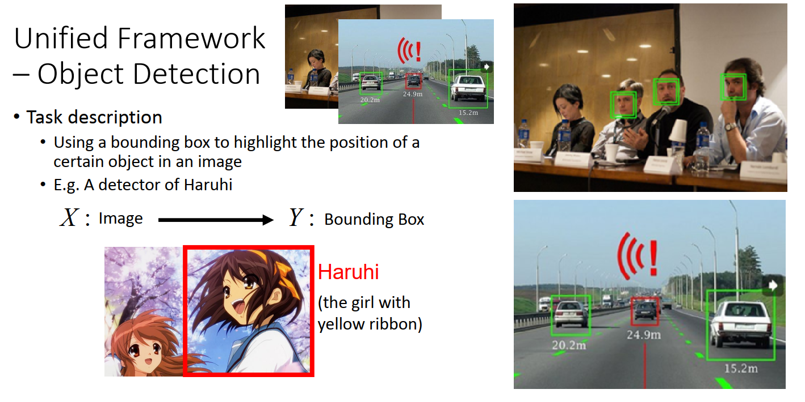
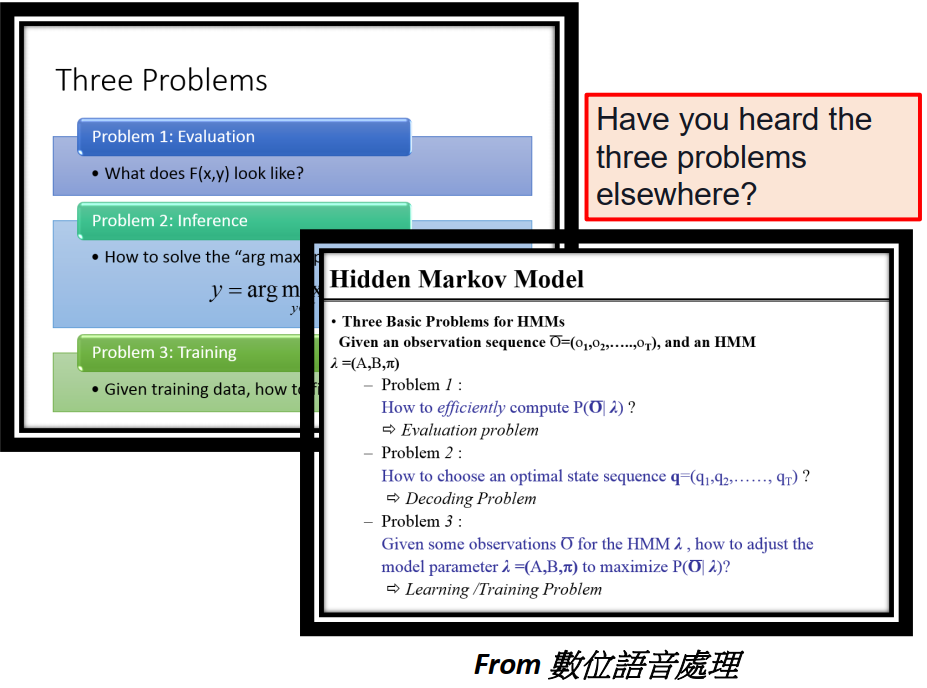

[TOC]

# P 32 21- Structured Learning -Introduction<!-- 19' -->

## Introduction

什么是Structured Learning呢? 到目前为止，我们考虑的问题他的input其实都是一个vector，output都是另外一个vector，不管我们是在做SVM还是 在做Deep Learning的时候，有没有想过我们的input跟output都只是vector而已，但是实际上我们真正要面对的问题往往比这个更困难，我们可能需要input或者output是一个sequence，我们可能会希望output是一个list，我们可能会希望output是一个tree，我们可能会需要output是一个bounding box等等。 比如说像你在final里面，在recommendation的final里面你可能会希望你的output直接就是一个list，而不是一个一个element当作 output。当然，就大原则上我们知道怎么做，我们就是要找一个function，它的input就是我们要的object，比如说他是个tree 啊什么之类的，它的output就是另外一种object，只是我们不知道要怎么做。比如说，如果我们目前学过的deep learning的Neural Network的架构，你可能不知道说我要怎么do??一个Network他的input才会是一个tree structure,output才会是一个另外一个tree structure。你可能不知道要怎么做这一件事情。

## Example Application

像这种 structure learning 的task ，他有非常多的应用，其实他的应用比比皆是，我知道一般 machine learning 的课程是不会讲   structure learning 的，但其实  structure learning 他的Application非常多，所以如果你不知道 structure learning 的话，你其实很多时候你会非常的卡，

### Speech recognition(语音辨识)

比如说 语音辨识，如果是你只知道一般的 feed forward network，你根本无法想象语音辨识是怎么做的，因为语音辨识他是 input一个 sequence ，output 另外一个 sequence 。

### Translation(翻译)

或者是你根本无法想象  Translation 是怎么做的，Translation 是input 一个sequence,output另外一个sequence，比如说你要中翻英，中文是一个 sequence，英文是另外一个sequence

### Syntactic Paring(文法解析)

或者是你要做 Syntactic 的Paring，做文法剖析，就是input 一个sentence，他是一个sequence， output 是一个文法剖析 的tree structure 

### Object Detection(目标检测)

或者你要做Object detection，那你的 input 是一张image，你的output是那个object 的位置，你会把那个 object 用一个bounding box把它框出来。那个bounding box是你的output，他也是一个object。

### Summarization

或者你要做Summarization，你的 input是一个document，你的output是你 summary以后的结果。那你的 input 跟 output都是sequence。

### Retrieval

或者你要做 Retrieval，你的 input是搜寻的关键词，你的 output是搜寻的结果，搜寻的结果是一个list。他也是一个有 structure 的东西

那 Structured learning  怎么做呢？虽然这个Structure learning听起来好像很困难，但是实际上它有一个Unified 的 Framework(统一的框架)，怎么做呢，

## Unified Framework

在Training的时候，我们就是到一个function，这个function我们这边写作大写的F，这个大写F他的input是X跟Y，我们之前是找一个小写的function f，他的input是x output 是y，现在不一样，我们要找一个大写的F，他的input就是X跟Y，它的output就是一个real number。这个大写的F它做的事情就是他想要衡量说当我今天的input 是X跟Y的时候，他们两个都是structure的object ，这个X跟Y他们有多匹配。越匹配的话，F他output 的值就越大。

那testing的时候，假设我们找出这个F，那testing 的时候我们要怎么做呢，testing的时候就是给一个新的x，我们去穷举所有的可能的y，穷举所有的可能的y，一一带进大写的F 这个 function，看看哪一个y他可以让F的值最大，可以让F的值最大 的那个y,叫做$\tilde y$,他就是最后你的辨识的结果，就是你的 model的output。

那你会说原来 f 呢，原来想要做的事情，是找一个小写的f input X output Y，这个小写f  input X output Y 你就 可以把它想成小写的f(x) 其实就是$arg \max_{y \in Y}F(x,y)$，这样讲你可能觉得有点抽象，所以我们来举个实际的例子

## 例子

### 目标检测

假设我们现在要做的task 是我们要给一张image ，然后现在machine 的任务是要找出image里面我们要它找的object，所以现在在我们的task中input是一张image，output 是一个Bounding Box。举例来说，现在假设我们的task 是要做一个凉宫春日 的detect，input是一张image，那 output 的 Bounding Box 就是凉宫春日 在的位置这样。给不知道的人讲一下就是 有帮黄丝带的这个是凉宫春日，

那你可能说侦测凉宫春日，有什么用，没什么用这样子。但是它还有其他的作用，比如侦测人脸呀，或者是无人驾驶，然后侦测有没有车子等等~

我知道说现在 在做  Bounding Box 的 extraction，你可以有别的方法，你可以用Deep Learning 的方法来做。有一个 network叫做 highway??(5:51) CNN ,他可以直接output  Bounding Box 。那事实上，Deep Learning 和Structured Learning是有关系的，这个我还没有听其他太多人讲过，这个是我个人的想法，我认为 Gan其实 他就跟 structure learning 是 非常有关系的，GAN就是在实作我们刚才讲的那个 Framework 的一个方法， 这个我们讲完 structure learning  以后再讲。所以 deep learning 跟 structure learning 他们并不是  Independent的，他们就即将要被merge 在一起，但是我还是想要举 Bounding Box 的例子，因为我只是想要秀凉宫春日的图而已，

那如果是 Object Detection的，那是怎么做的呢, 你的 input x 就是一张image，y 就是Bounding Box，F(x,y)就是说假设 这张image配上这个红色的bounding box，这个位置的bounding box，它们有多匹配。如果是在 Object  detection的例子的话，就是它有多正确，你能不能真的把 凉宫春日 框出来。所以你会期待说，你的model可以做到的事情，你的大写的F可以做到的事情是这样子，给这一张图，如果框得很对(红的的框框,第一行），它的分数就很高，因为框的很对。框在这边绿色的框框，有一点不对，框在实久留头上(蓝色)，就很不对这样子。那如果是另外一张图，框在红色的框框，很对，框在这个地方(绿色)，后面这个人，我也看不清楚他到底是谁，原来也是 实久留，也是不对，然后框这个蓝色的地方，这个人到底是谁，这个是谷泉，

接下来，testing的时候，testing 的时候给一张x ,那个x是从来没有看过的图。那你穷举所有可能的bounding box，你这个bounding box 可以画在红色框框的地方，可以画在绿色框框的地方，可以画在蓝色框框的地方，可以画在黄色框框的地方，可以画在各种不同可能的地方，然后看说哪一个bounding box得到的分数最高。可能红色的得到10分，绿色的得2分，蓝色得3 分，黄色得-1 分，等等 ，然后红色的分数最高，所以红色得就是你的model 的 output。

### Summarization

那在别的task里面，其实也是差不多的，假设我们今天要做 Summarization，Summarization 的task 就是 input 一个document，很长的，他有很多句子。那output是一个summary，你的 summary可以就只是从这个 document里面取几个句子出来。取一个subset 出来，

那么我们training的时候，就是你的这个F(x,y)，他的 document跟 正确的 summary配成一对的时候，F的值就很大，如果document跟不正确的summary配成一对的时候，F的值就很小，对每一个training data 都这么做。 testing的时候，你就穷举所有可能的summary，看哪个summary可以让你的F 最大，它就是你的 model的output。

### retrieval

或者是 retrieval 的时候 也是一样，retrieval的task，input 是一个查询词（查询关键字），output是一个搜寻的结果，是一个 web pages的list

Training的时候，我们要training data 知道 说 input这个 query 的时侯，output哪一个 list，才是perfect。那input 奥巴马 的时候，output 这个list是perfect，所以他们的分数最高，output蓝色的list是不对的，所以他的分数要比较低，那input Trump 的时候，output 这个list是对的，所以分数比较高，output 蓝色的list 是不对的，所以他的 分数比较低，等等。做搜寻的时候，比如说有人输入一个凉宫春日，那你就穷举所有可能的list，看看哪一个list的分数最高，你可能觉得穷举所有的 list听起来多么的荒谬，这个都是可以做的，你只是需要想一个好的演算法去解这个问题， 那你就看哪一个list可以让 分数最高他就是 F(x~1~)

## 概率描述

这个Unified Framework或许你听得觉得很陌生，觉得很怪这样，第一次听到的人，都会觉得搞什么东西呀。怎么忽然出现一个F，那我换一个说法，看你有没有比较接受，我这个说法是这样子，我们在Training的时候我们是要estimate x和y的join probability P(x,y)，要estimate x和y 一起出现的几率，这个几率其实也是一个 function，这个几率的 input就是一个X跟一个Y，output就是一个介于0到1之间的值。

那我在做testing的时候，就是给我一个object x，我去计算p(y|x) 的几率，那哪一个y的几率最高，他当然就是我的答案，那 p(y|x)可以写成 p(x,y)/p(x) , p(x) 对你最后找出来的y 没有影响，所以真正做得事情看看y 跟哪一个 x 的 join probability 最高，那一个y 就是最后你的output，就是你最后model的 output。

而蓝色的training 就是 蓝色 的training ，这个 inference 就是这个绿色的inference，我们刚才讲的 F(x,y),你或许觉得说 evaluate x 跟 y 有多相容，这个到底是在讲什么，不太懂，那如果我把它换成我想要 evaluate x 跟 y  的 join 的 probability，x 跟 y 一起出现的几率，然后在 testing 的时候，根据这个几率我要找最有可能的y，这样你会不会觉得能够接受一点呢，其实这两个东西都是可以的，如果你今天是在读的是这种 graphical model 的文献的话， graphical  model 的文献你自己看可能都是看的一头雾水，其实  graphical  model 就是 structure learning 的其中一种，所以如果等一下你把我课之后的 structure learning 的部分听完，你可以 link 到   graphical  model  的部分,你会发现我讲的其实就是，其实  graphical  model 就是 一种 structure learning ，只是在 graphical model  里面的时候我们 把 F(x,y) 换成几率，但其实讲的是一样的事情，还有什么??biyifu network，马尔可夫 random fill 啊，他们讲的其实是一样的事情，他们也都是去找一个这种 evaluation 的function，只是他们 evaluation 的function 是几率，

那用几率有什么坏处呢，有一些坏处，我个人其实比较喜欢用 F(x,y)  胜过几率，因为用几率有个坏处就是有时候东西说几率很怪，你说我们做搜寻，那x 是查询值然后y 是一个搜寻的结果，然后要衡量这个 搜寻结果跟查询值共同出现的几率我觉得很怪，有时候不太能够接受。然后再来就是几率会有一个 constrain，就是 summation over 1 ，对所有的x,y summation over 1，但你现在是一个有 structure  的东西，x 跟y 都是一个 很大的space，要做这个 summation 很难，你会就是搬着石头砸自己的脚，就是你把这个几率的东西引进来，要 normalize，要把它变成一个几率，然后结果你花大部分的时间在想办法把他做  normalization，那何不不要做 normalization。那做几率有一个好处，就是他是meaningful 的，几率你比较容易了解想象他是什么样的东西

那其实还有另外一个东西，叫做Energy model ，你可能有听过Energy model，这个 Energy model 是 Yann LeCun 提出来的，我在下面有附一 下Yann LeCun的 Energy model 的一些说明给大家参考(http://www.cs.nyu.edu/~yann/research/ebm/)，其实 Energy model 讲的 也是structured learning，在差不多的时间点世界上有很多不同的人都提出了类似的想法，提出了类似的framework，他们合起来这边这个 Unified structure learning 的  framework  ,他们讲的其实是一样的东西，什么 graphical model，structure learning，structure SVM，Energy-based model ，他们的 framework 都是一样的，就好像说同样的东西在念人里面叫做念，在海贼王里面叫做霸气，在火影里面叫做查克拉，他们其实是一样的东西，

那这个 framework听起来好像很厉害，其实要做这个Framework你要解三个问题，我们很快的带过这三个问题。

### Problem 1 ：Evaluation

第一个问题是，F(x,y)到底长什么样子，你很难想象F(x,y)到底应该长啥样子。现在 input 是一个image 加上一个bounding box，这个F(x,y)应该长什么样子。input 是一个keyword 跟 一个list，这个F(x,y)应该长啥样子。

### Problem 2 ：Inference

再来就是荒唐的那个Inference的问题，怎么解 “arg max”这个问题。这个Y他可是很大的，比如说你要做Object Detection，你就穷举所有可能的bounding box。这件事情做得到吗。

### Problem 3 ：Training

第三个问题是Training，training 的时候的 Principle 就是，我们希望正确的x 跟 y  的pair 可以大过其他的，这个Training 是可以完成的吗。

只要你解出这三个问题，你就可以做Structured Learning的problem 。 只要获得三张神之卡，就可以成为新一代的法老王一样。其实我觉得GAN 可能就是解这三个问题的 solution，虽然你可能看不出来GAN 跟这个有什么关系，但他们是有关系的，我觉得GAN好像就是看到解这三个问题的曙光这样子。

其实这三个问题你在别的地方是有听过的，如果你有修过数位语音处理的时候，李林三老师在讲HMM的时候，他有说HMM有三个问题，其实这三个问题就是 general 的 Structured Learning 的三个问题，就是他不是只用在 HMM上，他可以apply在任何 Structured Learning  的problem上

实事上这个东西我们也可以把他跟DNN Link 在一起，我们之前讲的 feed forward network，你好像听的说跟现在讲的 Structured Learning 没有关系，是有关系的，之前讲的东西就是 Structured Learning 的一个 special case，

怎么说呢，我们现在说我要做手写数字辨识，input一个image，把它分成10类，那我的F长什么样子呢，我的F长这样(绿色底的框框)，我先把x扔进一个DNN，得到一个vector叫做 N(x)，接下来我再input y，这个y是一个vector，做手写数字辨识的时候y 是一个 10维的vector，他只有一维是1，其他是0，他分别代表10个 不同的数字，然后 把这个y和N(x)算cross entropy，negative 的cross entropy就是F(x,y)。那你的整个F 就是 input x,y ,output就是 红色方框里的值

然后呢接下来，在testing的时候，在inference的时候，你就说，我现在要做手写数字辨识，我穷举10个所有可能的辨识的结果，虽然说穷举所有可能辨识的结果其实也才十个，十个可能的辨识的结果，每一个都带进去这个Function里面，看哪一个辨识结果是可以让F(x,y)最大，它就是我的辨识结果。哪一个辨识结果可以让F(x,y)最大呢，其实如果你是用 cross entropy来定义这两个vector之间的差距的话，你就看说现在哪一个digit 他对应的 dimension他的值最大，他就是那个辨识的结果，所以这件事情跟我们之前在train neural network 用 cross entropy做loss function 的时候做的事情其实是一模一样的，就是我们之前讲的东西是Structured Learning 的一个 special case。

其实实事上虽然我们一直讲说我们做的是 F(x),output y，实际上那个问题也可以想成我们找了一个 F，input x,y,output 就是一个 number evaluate x,y有多 contact，有多相容，那这个 arg max 这个问题 因为在 classification 里面我们的y 太少了，才看有几个class 就有几个y ,这是可以穷举的，那找max 其实就是穷举的那一个行为，他是可以轻易做到的，

