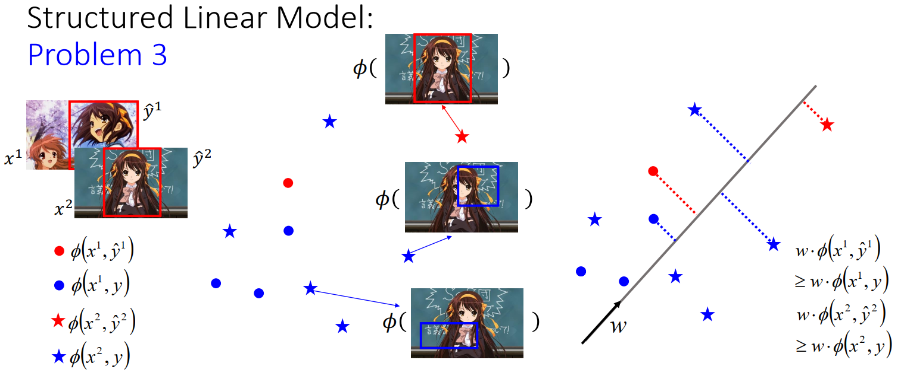

[TOC]

# P 33 22- Structured Learning -Linear Model<!-- 24' -->

我们之前讲了三个problem，那再来我们就是要想办法解这3个 problem，那我们的问题就是哪一个 problem你觉得最难呢，这边没有一个正确的答案，如果你觉得第三个problem最难的话，你这个运气不错，因为我们现在知道说假如第一个Problem 他有某种 specific的 form，这个就是假设 F(x,y)他长某个样子，等一下我们会讲说这个样子是什么样子，假如他长这个样子的话，那第三个Problem就不是个问题。所以我们就要先来讲讲看这个我们刚才说的 specific form应该要长的是什么样子的。

## problem 1

那这个specific form应该要长的是什么样子呢， 我们说这个 specific 的 form必须是Linear，也就是说给我一个(x,y)的pair，首先我用一组特征来描述这个(x,y)的pair，这边每一个ϕ~1~，ϕ~2~，ϕ~3~代表一个value，代表一个scalar，也就说x~1~跟y~1~他们具有characteristic  1 的强度是ϕ~1~(x,y)，具有特征2的强度 是ϕ~2~(x,y) ，具有特征3的强度 是 ϕ~3~(x,y)。然后F(x,y)它长得什么样子呢，他就被定义成 F(x,y)=w~1~ϕ~1~(x,y)+w~2~ϕ~2~(x,y)+w~3~ϕ~3~(x,y)+...这没有问题，这还是一个 F(x,y) 的function，你就把x,y 带进这个 function，找出这些feature ，然后把他们乘上一组你事先定好的 weight  w~1~，w~2~，w~3~ 你就可以得到  F(x ,y) 的值，然后  w~1~，w~2~，w~3~ 我们是要从 training data 里面得到的，

你可以把它整理一下，你可以把 w~1~，w~2~，w~3~ 串成一个 vector，你可以把这些特征值 ϕ~1~，ϕ~2~，ϕ~3~ 也串成一个vector，这个  w~1~，w~2~，w~3~ 所形成的vector 我们就称之为 w ,这个 ϕ 所形成的 vector 我们就称之为 ϕ(x,y),这个 w 是一个 vector，这个 ϕ 是一个 vector，我们的 F(x,y)我们就可以写成w 和  ϕ  的inner product  F(x,y)=wϕ(x,y)，你把x跟y 带进这个 function，然后抽出 ϕ 这个vector，然后跟 w 做 inner product  得到一个scalar，就是这个 F(x,y)  的input。然后我们接下来要讲的就是假如你的 F(x,y) 写的这样，那problem 3 就不是一个问题，那这样讲可能很抽象，所以我们还是用刚才举得例子来说明一下这个 F(x,y) 是长什么样子。

### 目标检测  object detection

比如说假设我们要做 object detection，我们的x 是image 而y 是一个 bounding box, 我们要定义一个 feature 的vector ϕ，这个 ϕ 把这个 x image跟这个 y 这个 bounding box 带进 ϕ 这个 function 里面，那我们要得到一个vector，那这个vector怎么定呢，其实就是随便你定，你就胡乱定，

比如说红色的pixel在框框里面出现的百分比当作一个维度，绿色的pixel在框框里面出现的百分比是一个维度，蓝色的是一个维度，或者是红色在框框外的百分比是一个维度，等等，就胡乱定，或者是框框的大小是一个维度，不过这些feature都很弱，你用这些feature可能没办法做一个凉宫春日的detector，那在image里面比较 state-of-the-art 的方法可能是，一个是用visual word，visual word 我不知道大家知不知道是什么，现在这个图上你看到很多小小的方框 ，每一个方片代表了某种pattern，不同颜色的方块代表了不同的pattern，他们就像是文章里面的词汇一样，所以他们叫做visual word ，你就可以说在这个框框里面，编号是100号的visual word 的出现几个，那他也是一个维度的feature。这边要顺便说明一下这个 visual word 的形成是真的，是真的用 visual word  token 去抽这一张image的。然后本来想要顺便就做一个 凉宫春日的 detector，但后来没有成功。

这些feature要由人找出来吗？还是我们直接用model来抽呢，我们现在定义的这个function F(x,y)，他是一个linear function，他是两个vector 的inner product ，它其实没有办法做太厉害的事情。所以你要让它最后performer好的话，那你要抽出很好的feature。那要怎么抽出很好的feature，当然可以说我用人工的方法定，但是这样子不见得能够找出好的feature，所以如果是在object detection 这个task上面，state-of-the-art 的方法就是，比如你去train一个CNN，这是一个很潮的东西。你可以把这个image丢进这个CNN里面，他也会output出一个vector，这个vector可以很好的去代表这一个bounding box里面的东西。那其实现在像Google他们在做object detection 的时候都是用类似的方法。你知道那个 object detection不是就是一个image，然后他会框起来，然后说这个框框里面是什么，那你有没有想过这个东西能用一般的 deep neural network做吗， 其实不行的，对不对， deep neural network怎么可以告诉你那个框框在哪里，所以他们其实是用 deep neural network 加上 structured learning 的方法做的，只是他们在讲的时候不知道为什么都要忽略  structured learning  这个部分，听的时候有人就会一头雾水，其实就是这么回事，所以抽feature我们是可以用deep learning 来抽 feature ，这个是用 object detection当做例子。

### 摘要 summarization

或者是如果你做 summarization 的话，那你的x是一个document，y是一个 summary。那你就也可以定义一些feature，比如说我可以说y里面有没有包含“important”，如果y里面有包含“important”这个word的话这个feature 可能是1，反之就是0，那你可以想到这个 feature 他可能对应的weight是比较大的，因为如果y里面有包含“important” 这个word 的话，那 y 可能是一个合理的summary，或者是y里面有没有包含“definition”这个word ，或者是y的长度是多少，你可以定各式各样的feature，或者是你可以定义一个evaluation说 y 的，你知道这个 summary 必须要是很精简的，定义一个 evaluation manager ？？（8:27） 说y的 精简程度是多少等等，当然你也可以想办法用deep learning抽些比较有用的feature 。

### 搜索 Retrieval

那比如说如果是Retrieval 的话，其实也是一样啦。x是keyword，y是搜寻的结果。你就胡乱定，比如说你定说，y 的第一笔搜寻结果跟x的相关程度，当然你要想个办法定义什么叫做相关程度。或者是说 y 的第一笔搜寻结果他的相关程度有没有比第二笔搜寻结果高，这个也是一个feature ，等等你就胡乱定，或者是你可以胡乱定说 y 的Diversity的程度是多少，我们知道说每个人想要找的东西都不一样，比如说你输入Java ，你可能是要去Java 吧，或者是你想要学这个语音， 那搜寻引擎不知道你要找的到底是什么，一个好的方法就是把各种 information 都搜寻出来， 你可以说我们定义一个major？？叫做 Diversity， 看看说我们的搜寻结果是不是有包含足够不同的 丰富的咨询，这个是第一个问题，反正你就是要想个办法定义一下这个feature 就对了。

## Problem 2

如果第一个问题定义好了以后，那第二个问题怎么办呢。我们本来这个F(x,y)=w⋅ϕ(x,y) 可以写成两个vector 的inner product ，但是我们一样是要去穷举所有的y，y=arg max~y∈Y~w⋅ϕ(x,y) ，看哪个y可以让ϕ(x,y)值最大。这个怎么办呢？我们先不要管他，假设这个问题已经被solved这样子。

## Problem 3

假装这个问题已经被solved 以后，我们就进入第三个问题。第三个问题，我们刚才讲过我今天找了一大堆Training data：$\{(x^1,\hat{y}^1),(x^2,\hat{y}^2),...,(x^r,\hat{y}^r,...)\}$我希望找到一个function F(x,y)，我现在所谓的希望找到一个function F(x,y)，其实是希望找到一个weight w，因为你知道这个 function F 其实就是由w 定义的， 我们要找到这个w使得以下的条件(黄色方框)被满足.

对所有的training data而言，我们希望正确的，如果我们用 x^r^跟正确的 $\hat y^r$抽出来的 feature 跟w 做 inner product,$w\cdot \phi(x^r,\hat{y}^r)$的值应该大过于任何  $\hat y^r$以外的 y 跟  x^r^抽出来的feature 跟w 做 inner product $w\cdot \phi(x^r,y)$。如果$w\cdot \phi(x^r,\hat{y}^r)$ 大过于 $w\cdot \phi(x^r,y)$ 的话，我们就可以让正确的y 他的function F  大过于错误的 y 所带进去这个F 以后所得到的值， 这个是我们像要的，

 或者是如果我们举 比较具体的例子来说明一下我们现在要达到的目标是什么，我们现在要达到的目标是这样，假设我现在要做的是object detection，我们收集了一张image x^1^，然后呢，我知道x^1^所对应的$\hat y^1$应该是红色 的框框，我们收集了另外一笔image x^2^，我知道他对应的框框应该在这个位置(同为红色框框)。然后我们假设 $(x^1,\hat{y}^1)$所形成的feature是红色的ϕ(x^1^,y^1^)这个点，我们现在假设feature 是只有两维，所以他可以画在图上，但是实作上你可能会抽个千维百维万维， 假设 $(x^1,\hat{y}^1)$所形成的feature ϕ(x^1^,y^1^)是红色的点， 其他的y跟x^1^所形成的feature 是蓝色的点。我们把他画在图上，如果你的框框在左图的红色的框框的地方，他是红色的点，在其他地方是蓝色的点，

那你可以想象说 红色的点只有一个，而蓝色的点有好多好多个，这边只是随便举三个例子示意一下，我们说$(x^2,\hat{y}^2)$所形成的feature是红色的星星，x^2^跟其他的y所形成的是蓝色的星星。如果我们把红色的星星跟蓝色的星星画在图上假设他们是在这些个位置， 右上角的图的框框是正确的框框所形成的feature是在这个地方 ，右边下面两张图是错误的框框所形成的feature是在这些个地方。可以想象，红色的星只有一个，蓝色的星星有千百万个。

我们再来要达到的任务是，我们希望找到一个w，那这个w可以做到什么事呢，这个w可以做到的事情是，我们把这上面的每一个点，红色的星星，红色的圈圈，成千上万的蓝色圈圈和成千上万的蓝色星星通通拿去跟w做inner product 以后，我得到的结果是红色星星所得到的值大过于所有蓝色星星所得到的值，而红色的圈圈所得到的值大过于所有蓝色的圈圈所得到的值。当然不同形状间我们就不比较。就是圈圈自己跟圈圈比，只要红圈圈大过蓝圈圈就好，星星自己跟星星比，只要红星星大过蓝星星就好。做的事情就是这个样子，也就是说我们希望正确的答案所形成的feature 跟w 做inner product 以后，大过于其他的 ϕ跟w 所形成的inner product，就是我们要完成的事情 。

#### 解法

你可能会觉得说这个问题会不会很难呢，我们要找到一个w 完成这一件事情 ，但是这个蓝色的东西可是有成千上万个，我们有办法找到这样子的w吗，接下来要讲的就是这个问题没有我们想象中的那么难，所以我们以下提供一个演算法。这个演算法他可以做到的事情就是 ，假设我刚才说的那一个要让红色大于蓝色的，这个vector，只要他存在，那要不存在就没有办法，那只有存在的话，用下面这个演算法，我们可以找到答案。

这个演算法他长什么样子呢，我们来说明一下，我们现在这个演算法他的 input就是我们的training data$\{(x^1,\hat{y}^1),(x^2,\hat{y}^2),...,(x^r,\hat{y}^r),...\}$,他的output就是要找到一个vector w，这个 vector w 要满足我们之前所说的我们要找到的特性

这个怎么做呢，一开始，我们先initialize w=0，然后我们开始跑一个??(16:05)回圈，在这个回圈里面，每次我们都取出一笔training data $(x^r,\hat{y}^r)$，然后我们去找一个$\tilde{y}^r$，它可以让$w \cdot \phi (x^r,y)$的值最大，就是我今天找到一个 $\tilde{y}^r$他可以让这一个 function  $w \cdot \phi (x^r,y)$的值最大

那你可能回问说这个事情怎么做呢，这个问题其实就是Problem 2，我们刚才已经假设说Problem 2 已经解决了的，这个东西反正就是有解的就对了，那如果今天找出来的$\tilde{y}^r$他不是正确答案 $\hat y^r$ 的话，即$\tilde{y}^r \neq \hat{y}^r$，那代表我们今天这个w不是我要的，因为如果这个w 是我要的，他可以让这个值最大的那个y 就是 $\hat y^r$  ，这才是我要的w, 

那如果今天得出来的是$\tilde{y}^r$，那这个w 不是我要的，要把这个w改一下，怎么改呢，我把$x^r跟\hat{y}^r 的 feature~ \phi(x^r,\hat{y}^r)$ 算出来，把$x^r跟 \tilde{y}^r 的feature ~\phi(x^r,\tilde{y}^r)$也算出来，我把这两个feature 相减再加到w里面，再update w，然后我有新的w以后，我再去取一个example，然后再重新算一次max，如果算出来不对再update，然后这个步骤就一直一直下去，如果今天我们要找的w是存在的话，他最终就会停止。

这个演算法你有没有觉得很熟悉呢，有没有修过轩田的机器学习，这不就是Perceptron algorithm 吗，你知道 Perceptron 他做的就是 binary 的classification，  我们今天要做的不是binary 的 classification， 我们今天要做的 是structured learning。但是你可以想想看 binary 的 classification 其实也就是structured learning 的一个特例 而已，你可以回去想想看今天讲的这个 algorithm 跟这个 Perceptron learning 有什么样的关系， 

#### algorithm -Example

其实以下的证明跟 Perceptron  的证明其实几乎是一样。我们举个例子来说明一下，刚才那个演算法是怎么运作的，如果你没有听的很清楚的话，怎么运作的呢。我们今天的目标是要找到一个w，它可以让红色星星大过蓝色星星，红色的圈圈大过蓝色圈圈，我们假设这个w他是存在的，

这个演算法做的事情是这样，首先我们假设w=0，那假设w 是0，然后我们随便pick 一个training data ,然后training data  现在只有两笔，pick这个$(x^1,\hat{y}^1)$，$(x^1,\hat{y}^1)$那个点的分布长的是圈圈的点的分布的样子，然后我要根据我现在手上的data  w 去看说 哪一个y 他所形成的feature 跟 w 做inner product 以后得到的值最大，那现在因为w=0，所以你这个feature不管是谁，所形成的feature算出来都是0，所以其实都是一样的，那么没关系，我们就random 的选一个y出来 ， 当做$\tilde{y}^1$。我们假设我们选了图中红框标出的点作为$\tilde{y}^1$，然后因为今天我们选出来的$\tilde{y}^1 跟\hat{y}^1$他们不一样，所以我要调整一下我的w ,怎么调整呢，我调整的方法就是把 $\hat y^1$所形成的feature 减掉 $\tilde{y}^1$所形成的feature再跟w加起来，红框中的式子对应了图中的箭头。然后因为w是0，0 加上这个以后就还是这个，

所以我们现在经过第一个 intervention以后， 我们找到一个w，那接下来在第二步呢，我们就再选一个training data，我们现在选的是$(x^2,\hat{y}^2）$，那选了$(x^2,\hat{y}^2）$以后，红色的星星在这边，蓝色的星星在这边，那我们要做的事情就是穷举所有的y，这个y 可能有成千上万个，虽然这边只画几个点意思一下而已，成千上万个y,哪一个形成的feature跟w 做inner product 以后最大， 

然后我们现在就真的算一下，假设我们就真的算一下，发现 $\tilde{y}^2$他跟我们现在手上的w 算出来的inner product 最大，那这一个y 我们就说他是  $\tilde{y}^2$，然后发现  $\tilde{y}^2$跟 $\hat y^2$他们是不一样的，那没关系，我们就去update一下w ,怎么update 呢，我们要把这一个红色的星星的vector减掉这一个我们选出来的蓝色星星的vector，那这个vector就是绿色的这个vector，那我们把绿色的这个vector，加上原来的w 这个vector，把它加起来以后我们就得到一个新的w,他是在这个方向(红色框出来)，

那我们得到这个新的w以后呢，我们还没有结束，我们要继续再去看一遍这个$(x^1,\hat{y}^1)$。我们发现说如果拿这个新的w 去跟所有的点通通拿去算inner product的话，这个时候$\tilde{y}^1=\hat{y}^1$,这个w对第一笔data来说他是我们要的。接下来我们再选一遍第二笔data，我们发现说对第二笔data而言我们选出来的 $\tilde{y}^2 = \hat{y}^2$，这个w 也是我们要的，我们看过一个intervention以后，我们看过 所有的data以后，我们发现现在w不再更新，那其实现在我们不管再怎么pick这个data，w 都已经不会再更新了。 这个时候我们就停止整个的training。那我们发现说现在我们所找出来的这个w可以让 $\hat y$ ，红色的星星跟他inner produce 以后大过蓝色的星星，跟红色的圈圈做inner produce 以后大过所有蓝色的圈圈，所以我们就结束了，  

接下来我其实要讲的就是，接下来其实想要做的事情是证明说以上的演算法他最后是会结束的，而就算是说今天那些蓝色的东西他有成千上万个，这个演算法终究是结束的，而且他跟那些蓝色的object 的数目是没有关系的，接下来就是比较数学部分了，

** 视频好像少了一段 数学部分

