[TOC]

# P 36 25: Recurrent Neural Network(Part Ⅰ)<!-- 49' -->

接下来我们来讲一下 Recurrent Neural Network，Recurrent Neural Network他其实也可以做到我们在前一堂课讲的 Sequence Language 的task,最后我们再来说他们有什么样的不同，

## Example Application

我们这边要举的例子是slot filling，我们知道说现在很流行的做一些智慧客服啊什么之类的东西， 比如说做一些智慧的订票系统，那这种智慧的客服或者智慧的订票系统里面，你往往需要slot filling 这个技术，

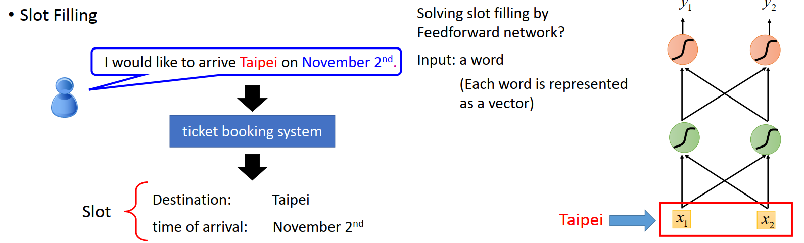

slot filling指的是什么呢，slot filling指的是说，假设有一个人对你的订票系统说：“ i would like to arrive Taipei on November 2nd”，你的系统要自动知道说 ，你的系统里面有一些slot，比如说在这个订票系统里面，他会有一个slot叫做Destination，一个slot叫做time of arrival，你的系统要自动知道说这边的每一个词汇他属于哪一个slot，那你的系统要知道说Taipei属于Destination这个slot，那你的系统要知道说 November 2nd属于time of arrival这个slot。那其他的词汇就不属于任何 slot 里面。

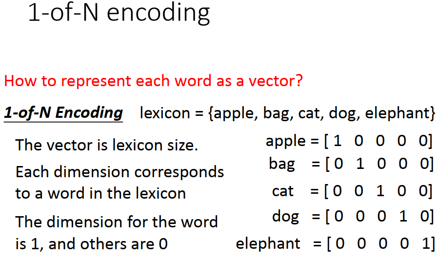

这个问题要怎么解呢，其实这个问题你当然也可以用一个feed forward 的 neural network来解，也就是说我叠一个feed forward 的 neural network，然后他的 input 就是一个词汇，比如说你把Taipei变成一个vector丢到这个neural network里面去，但是你要把一个词汇丢到neural network里面去，你必须要先把它用一个向量vector来表示。那怎么把一个词汇用一个向量来表示呢 ，方法实在太多了，最naive 的方法就是 1-of-N encoding，我想这个应该就不需要再细讲，当然 你用 word vector来 表式一个词汇也是可以的，

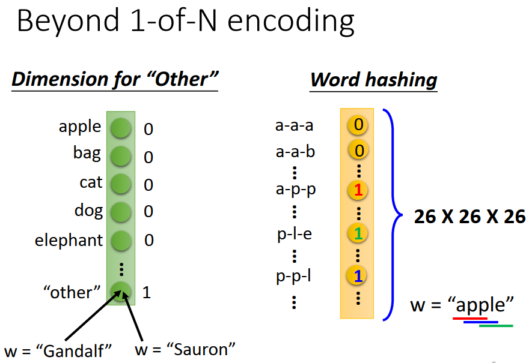

或者是有一些  Beyond 1-of-N encoding 的方法，比如说有时候如果你只是用 1-of-N encoding 来描述一个词汇的话，你会遇到一些问题，因为有很多词汇你可能从来都没有见过，所以你会需要在1-of-N encoding里面多加一个dimension，这个dimension代表other。然后所有的词汇，如果它不是在我们词典有的词汇就归类到other里面去，比如说 Gandalf 不在我们的vocabulary 里面,他就归类到other，或者是 Sauron他不在 这个vocabulary 里面，他就归类到other里面去。你也可以用某一个词汇的字母来表示它的vector，如果你用某一个词汇的字母的 ngram来表示那个vector 的话，你就不会有某一个词汇不在词典中的问题，比如说，你有一个词汇叫做apple，那apple他里面有出现app、有出现 ppl、有出现ple，那在这个vector里面对应到app 的那个dimension就是1,对应到ppl的 dimension就是1,对应到ple的 dimension就是1,其他都为0。

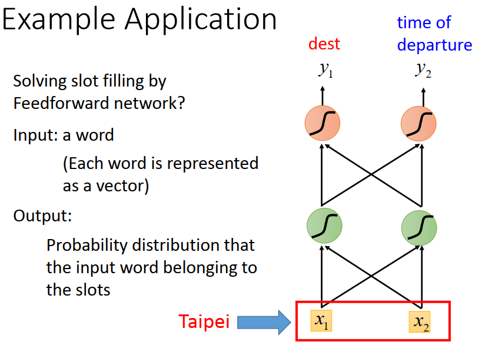

假设我们可以把一个词汇表示成一个vector，那你就可以把这个vector丢到一个feed forward 的neural network里面去，在slot filling这个task里面，你就会希望你的output是一个probability distribution。这个probability distribution代表说我们现在input 的这一个词汇属于每一个slot的几率，举例来说Taipei属于destination的几率还有Taipei属于time of departure的几率，等等。

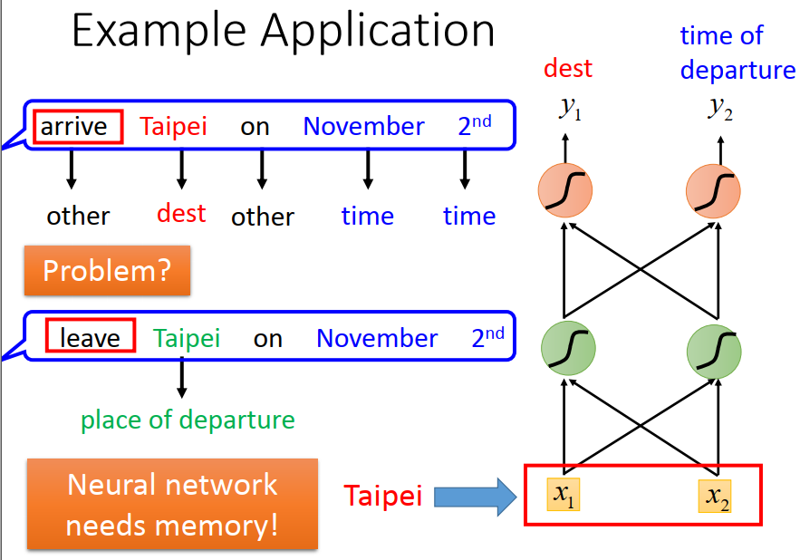

但是光只有这样是不够的，feed forward neural network 没有办法 solve 这个problem。为什么呢，假设现在有一个使用者说要：“arrive Taipei on November 2nd”那arrive 是other,Taipei 是 dest, on是other,November是time,2nd是time。但是如果另外一个使用者说:"leave Taipei on November 2nd"，那 Taipei 这时候他 应该是“place of departure”，它应该是出发地而不是目的地。但是对于neural network来说，input一样的东西output就是一样的东西，input "Taipei"这个词汇，他output要么就都是destination几率最高，要么就都是place of departure， 目的地的几率最高，要么就都是出发地的几率最高，你没有办法让他有时候出发地的几率高，有时候让它目的地的几率高。怎么办呢，这时候我们就希望我们的neural network他是有记忆力的。如果今天的neural network是有记忆力的，它记得它在看过这个红色的Taipei之前它就已经看过arrive这个词汇；它记得它在看过绿色的Taipei之前，它就已经看过leave这个词汇，它就可以根据一段话的上下文产生不同的output。所以如果我们让我们的neural network他是有记忆力的话，它就可以解决input同样一个词汇，但是output必须是不同的这个问题。

## 什么是RNN？

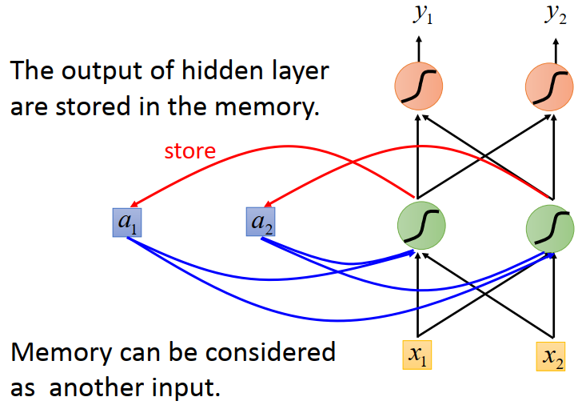

那这种有记忆的neural network就叫做Recurrent Neural network，他的缩写是RNN。那在Recurrent Neural network里面，每一次我们的hidden layer 里面的neuron产生output的时候，这个output 都会被存到memory里去，这边用蓝色方块表示memory，当这些 hidden layer 里面的neuron 有output的时候，他就被存到这个蓝色的方块里面去。那下一次如果当有input的时侯，这个hidden layer 这些neuron不只是考虑input 这个x~1~,x~2~，他还会考虑存在这些memory里面的值。对它来说除了x~1~,x~2~以外，这些存在memory里的值a~1~,a~2~也会影响它的output。

### 例子

我想直接举一个例子大家可能会比较清楚，假设我们现在这个图上的这个network，它所有的weight都是1，然后所有的neuron都没有任何的bias。假设所有的activation function都是linear，这样可以不要让计算太复杂。现在假设我们的input 是一个sequence,我们的input 是 $\begin{bmatrix} 1\\ 1 \end{bmatrix}\begin{bmatrix} 1\\ 1 \end{bmatrix}\begin{bmatrix} 2\\ 2 \end{bmatrix}...~...$，那我们把这个 $\begin{bmatrix} 1\\ 1 \end{bmatrix}\begin{bmatrix} 1\\ 1 \end{bmatrix}\begin{bmatrix} 2\\ 2 \end{bmatrix}...~...$ 这个sequence input到这个Recurrent neural network里面去，会发生什么事呢，首先在你开始要使用这个Recurrent Neural Network的时候，你必须要给memory起始值，假设他还没有放进任何东西之前，memory里面的值是0.

现在输入第一个$\begin{bmatrix} 1\\ 1 \end{bmatrix}$，接下来对发生什么事呢，对左边的绿色的 Neuron 来说(第一个hidden layer)，它除了接到input$\begin{bmatrix} 1\\ 1 \end{bmatrix}$以外他还接到了memory的0跟0，因为我们说所有的weight都是1，所以他的output就是2，右边绿色的Neuron 的output也一样是2。接下来，因为所有的weight 都是1，所以红色这两个Neuron  他们的 output就是4。所以input$\begin{bmatrix} 1\\ 1 \end{bmatrix}$的时候，他的output 就是 $\begin{bmatrix} 4\\ 4 \end{bmatrix}$，

接下来Recurrent Neural Network会将前面一次绿色neuron的output存到memory里去，所以memory里面的值被update成2，这个2会被写进来，所以memory 里面的值就update 变成2.

接下来再输入$\begin{bmatrix} 1\\ 1 \end{bmatrix}$，这个时候绿色的neuron 会有什么样的输出呢，他的输入有四个 $\begin{bmatrix} 1\\ 1 \end{bmatrix},\begin{bmatrix} 2\\ 2 \end{bmatrix}$ ,weight都是1，所以把2+2+1+1 ，得到的结果是6，最后红色的 neuron 的输出就是 6+6 是12，所以当第二次再输入$\begin{bmatrix} 1\\ 1 \end{bmatrix}$的时候，输出就是 $\begin{bmatrix} 12\\ 12 \end{bmatrix}$

所以对Recurrent Neural Network来说，你就算输入一样的东西，你就算给他一模一样的input，就像在case里面都是$\begin{bmatrix} 1\\ 1 \end{bmatrix}$，它的output是有可能会不一样了，因为存在memory里面的值是不一样的。

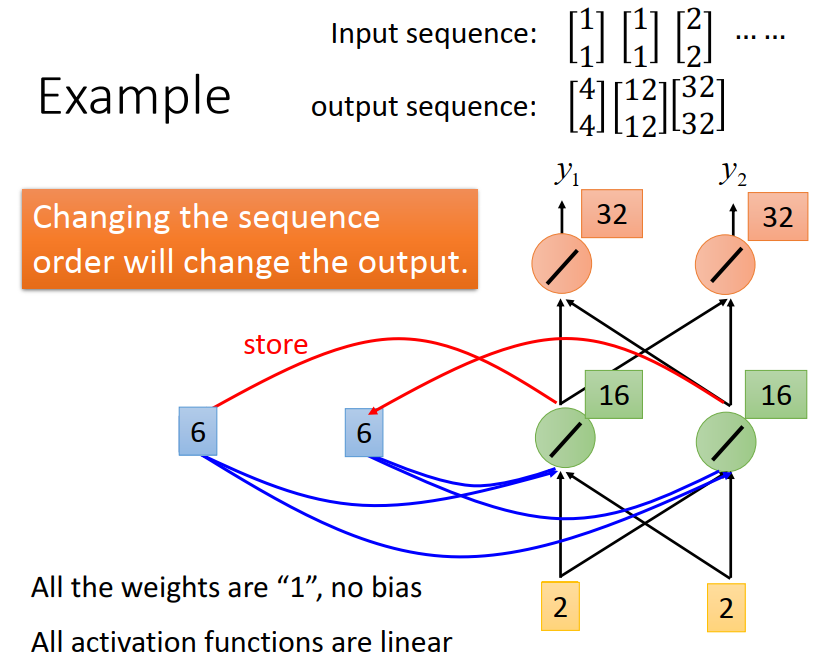

在绿色的 neuron 的output是$\begin{bmatrix} 6\\ 6 \end{bmatrix}$,接下来$\begin{bmatrix} 6\\ 6 \end{bmatrix}$就会被存到memory里面去，所以2就被洗掉，变成6，接下来我们的input是$\begin{bmatrix} 2\\ 2 \end{bmatrix}$，假设 input是$\begin{bmatrix} 2\\ 2 \end{bmatrix}$，这边每一个绿色的 neuron  他考虑了4个 input $\begin{bmatrix} 2\\ 2 \end{bmatrix}$，$\begin{bmatrix} 6\\ 6 \end{bmatrix}$,所以 6+6+2+2是多少呢，得到的是16，红色的 neuron 的output是 32 ，所以input$\begin{bmatrix} 2\\ 2\end{bmatrix}$的时候，output 是 $\begin{bmatrix} 32\\ 32 \end{bmatrix}$

那在做Recurrent Neural Network时，有一件很重要的事情就是这个input 的sequence，Recurrent Neural Network 在考虑他的时候，并不是 independent的，所以今天如果你任意调换input sequence的顺序，比如说把$\begin{bmatrix} 2\\ 2\end{bmatrix}$挪到 最前面来，那output是会完全不一样的，所以在Recurrent Neural Network里，它会考虑input 这个sequence的order。

### RNN 

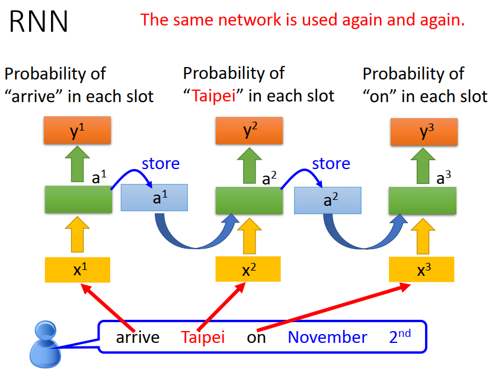

所以今天我们要用Recurrent Neural Network来处理slot filling这个问题的话，他看起来就像是这样，有一个使用者说：“arrive Taipei on November 2nd”，那arrive就变成了一个vector丢到neural network里面去，neural network的hidden layer他的output写成a^1^,这个a^1^是一排neuron 的output，所以他其实是一个vector,然后根据这个a^1^我们产生y^1^,这个y^1^就是“arrive”属于每一个slot filling的几率。

接下来a^1^会被存到memory里面去，接下来"Taipei“会变成input，那这个hidden layer会同时考虑“Taipei”这个input 跟存在memory里面的a^1^,得到a^2^，再根据a^2^产生y^2^，y^2^是属于“Taipei”每一个slot 的几率。

这个process 就以此类推，我们再把a^2^存到memory里面，再把"on"丢进去，那hidden layer同时考虑input“on”这个词汇的 vector，跟存在memory里面的a^2^，得到 a^3^,然后 a^3^再得到y^3^,他代表“on”属于每一个slot 的几率。

这边要注意的事情 是，有人看到这个图就说，这边有三个network，这个不是三个network，这个是同一个network在三个不同的时间点被使用了三次。我这边特别把同样的weight就用同样的颜色来表示。

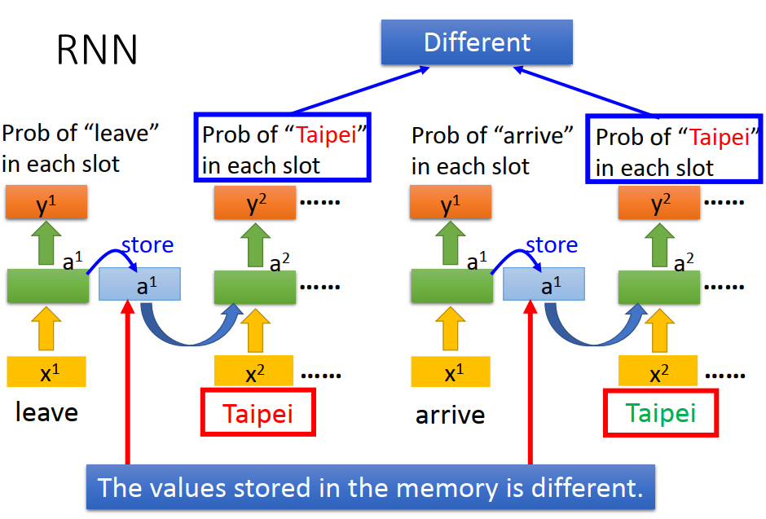

所以如果我们有了memory以后，刚才我们讲了输入同一个词汇，我们希望看output不同的这个问题就有可能被解决。比如说，如果同样是输入“Taipei”这个词汇，但是因为红色“Taipei”前面接的是“leave”，绿色“Taipei”前接的是“arrive”，所以因为“leave”和“arrive”他们的vector不一样，所以hidden layer的output也会不同，所以存在memory里面的值也会不同。所以虽然现在x~2~是一模一样的，但是因为存在memory里面的值不同，所以hidden layer的output也会不一样，所以最后的output也就会不一样。那这个是Recurrent Neural Network的基本概念。

### Of course it can be deep  

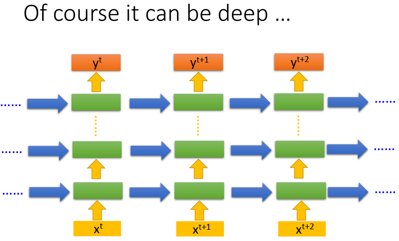

当然你这个架构，Recurrent Neural Network 的架构你是可以任意设计的，比如说，它当然是deep，我们刚才看到的Recurrent Neural Network 它只有一个hidden layer，当然它可以是deep 的Recurrent Neural Network 。

比如说，我们把x^t^丢进去之后，它可以通过一个hidden layer，再通过第二个hidden layer，以此类推,通过很多个 hidden layer以后，才得到最后的output。那每一个hidden layer的output都会被存在memory里面，在下一个时间点的时候，每一个hidden layer会再把在前一个时间点存的值再读出来，最后得到最后的output，这个process就一直持续下去。这个deep 你要叠几层都是可以的

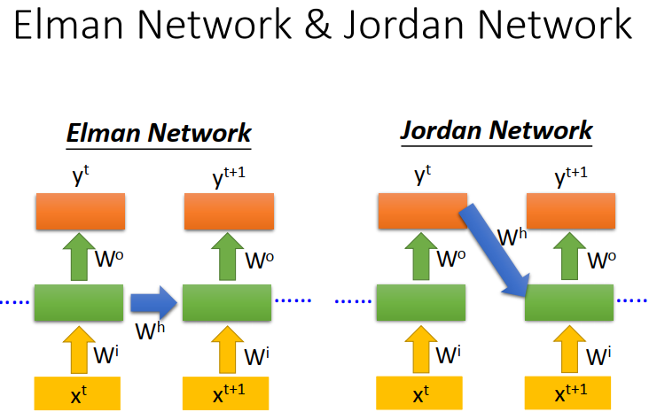

那Recurrent Neural Network 有不同的变形，我们刚才讲的叫做 Elman network。如果我们今天是把hidden layer的值存起来，在下一个时间点再读出来，这个叫做  Elman network。有另外一种叫做Jordan network，Jordan network他存的是整个network 的 output的值，它再把output的值在下一个时间点再读进来，他是把output的值存到memory里面。传说Jordan network可以得到比较好的performance。因为 Elman network的 hidden layer 他是没有 target的，所以有点难控制说它学到什么样的hidden 的 information，他学到把什么东西放在memory里面，但是Jordan network的y 他是有target，所以我们今天可以比较清楚我们放在memory里面的是什么样的东西。

### Bidirectional RNN  

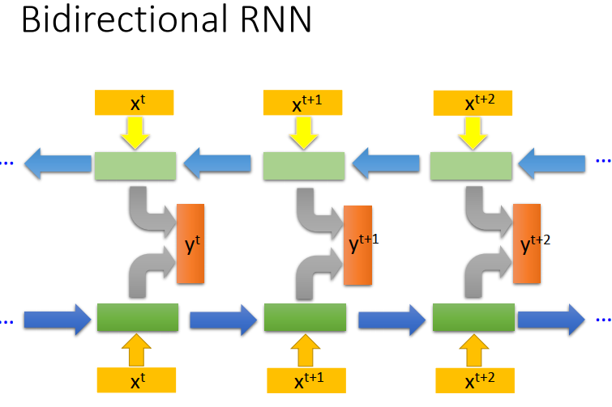

Recurrent Neural Network 他还可以是双向的，什么意思呢，我们刚才看到 Recurrent Neural Network你input一个句子的话，它就是从句首一直读到句尾。假设句子里面的每一个词汇我们都用x^t^来表示它的话。他就是先读x^t^再读x^{t+1}^再读x^{t+2}^。

但是其实它的读取方向也可以是反过来的，它可以先读x^{t+2}^，再读x^{t+1}^，再读x^{t}^。你可以同时train一个正向的Recurrent Neural Network，又同时 train一个逆向的Recurrent Neural Network，然后把这两个Recurrent Neural Network的hidden layer拿出来，都接给一个output layer得到最后的y^t^。所以你把正向的network在input x^t^的时候的 output， 跟逆向的network在input x^t^的时侯的output，都丢给 output layer，然后 output layer 产生y^t^，然后产生y^{t+1}^,产生y^{t+2}^,以此类推。

那用Bidirectional neural network的好处是，你的network 他在产生output的时候，它看的范围是比较广的。如果今天你只有正向的network，在产生y^{t+1}^的时候，你的network 只看过x^1^一直到x^{t+1}^的input。但是如果我们今天是Bidirectional的 neural network，在产生y^{t+1}^的时候，你的network不只是看了x^1^到x^{t+1}^所有的input，它也看了从句尾一直到x^{t+1}^的input。那你的network等于是看了整个input的sequence以后。假设你今天考虑的是slot filling的话，你的network等于是看了整个sentence以后，才决定每一个词汇的slot应该是什么。这样当然会比只看句子的一半还要得到更好的performance。

## LSTM

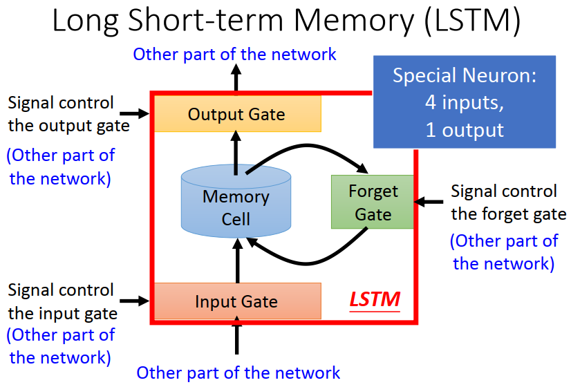

那我们刚才讲的Recurrent Neural Network其实只是 Recurrent Neural Network 的一个最simple的版本，那我们刚才讲的那个 memory 是最单纯的，是我们随时都可以把值存到memory里面去，也可以随时把值从memory 里面 读出来。但现在比较常用的memory称之为Long Short-term的 Memory(长时间的短期记忆)，这种Long Short-term的 Memory他的简写是LSTM.这种Long Short-term 的 Memory他是比较复杂的。

这个Long Short-term 的 Memory他有三个gate，当外界，当 Neural Network 的其他部分，当某个neuron 的output想要被写到memory cell里面的时候，他必须先通过一个闸门，通过一个input Gate，那这个input Gate他要被打开的时候，你才能够把值写到memory cell里面去，如果他被关起来的时候，其他 neuron 就没有办法把值写进去。

至于这个input Gate他是打开还是关起来，这个是neural network自己学的，所以它可以自己学说，它什么时候要把input Gate打开，什么时候要把input Gate关起来。那输出的地方也有一个output Gate，这个output Gate会决定说，外界其他的neuron  可不可以从这个memory里面把值读出来，当 output Gate被关闭的时候就没有办法把值读出来，只有output Gate被打开的时候，才可以把值读出来。那跟input Gate一样，output Gate什么时候是打开，什么时候是关起来，network也是自己学到的。

那还有第三个gate叫做forget Gate，forget Gate决定说，什么时候memory 要把过去记得的东西忘掉。或者是他什么时候要把过去记得的东西做一下format把它format掉。那这个forget Gate什么时候会把存在memory的值format掉，什么时候会把存在memory里面的值继续保留下来，这也是network自己学到的。

那整个LSTM你可以看成，它有四个input 1个output，这四个input，一个是想要被存到memory cell里面的值，但是它不一定存的进去，这要depend on input Gate,要不要让这个 information过去， 跟操控input Gate的讯号，操控output Gate的讯号，和操控forget Gate的讯号，所以一个 LSTM 的 cell 他有四个input，但它只会得到一个output

这边有一个小小的冷知识：Long Short-term Memory中 这个“-”你觉得他应该被放在哪里，他应该放在在short和term之间，有时候我会看到有人放在 Long和 Short之间，那其实这个是比较不make sense 的，应该是放在short和term之间，因为他其实还是一个  Short-term 的memory，他只是比较长的Short-term memory。按照这个字面意思，他是比较长的Short-term memory。

因为我们之前看那个 Recurrent Neural Network，它的memory在每一个时间点都会被洗掉，只要每一次有新的input进来，每一个时间点 Recurrent Neural Network 都会把memory 洗掉，所以他这个 short-term是非常short的，他只记得前一个时间点的事情，但如果是Long Short-term 的话，它可以记比较长一点，只要forget Gate不要决定要format 的话，它的值就会被存起来。

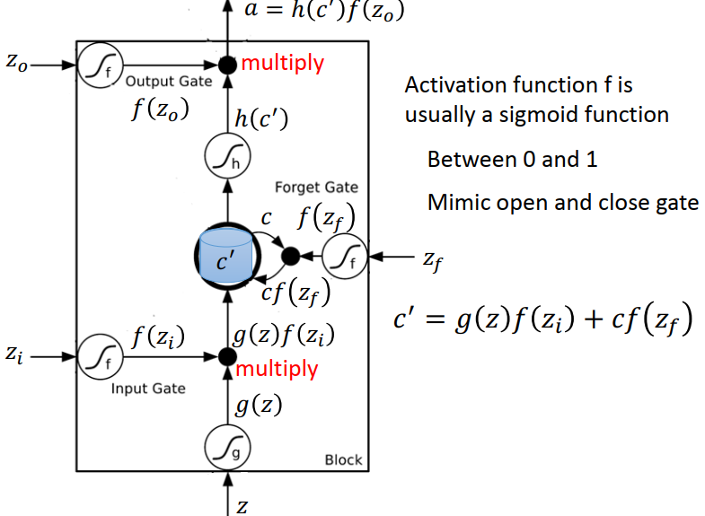

这个memory 的cell如果更仔细来看它的formulation的话，它长的像这样。底下的z是外界的input，外界要传到cell 里面的input，这个是input gate,这个是 forget gate,这个是output gate。

那我们假设现在要用被存到cell 里面的 input 叫做z，操控input gate的 signal 叫做z~i~  ，这个所谓操控input gate的 signal 他也就是一个 scalar,  也就是一个 数值，那等一下会讲那个数值是从哪里来的，反正这边就是有一个数值被当作这一个 cell 的input.那这个 forget gate，有一个操控他的数值是z~f~，output gate 有一个操控他的数值 是z~o~，综合这些东西以后最后会得到一个output ，这边写作 a。假设我们现在 cell 里面在有这四个输入之前，它里面已经存了值c。

现在假设要输入的部分，输入z，那三个gate分别是由z~i~,z~f~,z~o~所操控的。那output a会长什么样子呢。我们把z通过一个 activation function得到g(z)，然后把 z~i~通过另外一个activation function得到f(z~i~)，这边这三个 z~i~,z~f~,z~o~ 他们通过的这3个 activation function f, 通常我们会选择sigmoid function，那选择sigmoid function 他的意义就是 sigmoid function 的值是介在0到1之间的。而这个0到1之间的值代表了这个gate被打开的程度，如果这个 activation function f 的output 是1，表示这个gate 是处于被打开的状态，反之代表这个gate是被关起来的。

那接下来，我们就把g(z)乘上这个 input gate 的值 f(z~i~)，得到g(z)f(z~i~)，那这个 forget gate的这个z~f~，z~f~这个signal 也通过 这个 sigmoid activation  function得到f(z~f~)。然后接下来呢，我们把存在 memory 里面的值 c 乘上 f(z~f~)，得到 cf(z~f~)，然后接下来把这个 cf(z~f~) 加上g(z)f(z~i~)，把这两项加起来，得到c',c′就是新的存在 memory 里面的值。

所以根据到目前为止的运算可以发现说，这个f(z~i~) 就是 control 这个g(z)，可不可以输入的一个关卡，因为假设f(z~i~) = 0，那 g(z)f(z~i~) 就等于0，那就好像是没有输入一样，如果f(z~i~) 是等于1，那就等于是直接把g(z)当做输入 。那这个f(z~f~)呢，f(z~f~) 就是决定说，我们要不要把存在memory 里面的值洗掉，假设f(z~f~) 是 1，也就是 forget gate 是被 开启的时候，这时候 c 会直接通过，就等于是把之前存的值还是记得。那如果是这个 f(z~f~) 等于0， 也就是 forget gate 被关闭的时候， 0乘上c ,过去存在memory 里面的值 就会变成0。然后把这个两个值加起来 cf(z~f~) + g(z)f(z~i~) 然后就写到 memory 里面得到 c′ 这样子。

那我觉得 forget gate 他的开关是跟我们的直觉的想法是相反的，这个 forget gate 他打开的时候代表的是记得，他被关闭的时候代表的是遗忘。所以他名字我觉得取得有点怪，或许不该叫他  forget gate，不过反正习惯上就是这么做，就是这么叫他的，那把这个c′ 通过h得到 h(c′)，然后接下来，这边 有一个output gate，这个 output gate受f(z~o~) 所操控，z~o~  通过 f 得到 f(z~o~) ， f(z~o~) 如果是 1的话，这边我们会把这个 f(z~o~) 跟 h(c′) 乘起来，所以如果  f(z~o~)  是1，就等于是 h(c′) 可以通过这个 output gate，如果   f(z~o~)  是 0 ，就等于这个output 就会变成0， 就代表说 存在 memory 里面的值没有办法通过output gate 被读取出来。

### LSTM例子

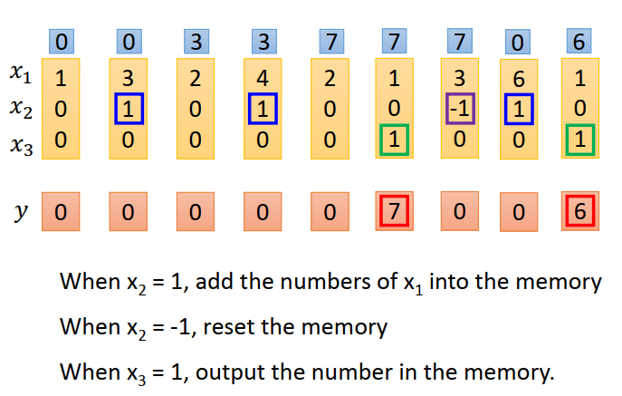

也许这样你还是没有觉得很清楚，所以后面我就打算做一个 人体 LSTM，我从来没有在其他地方看过人体LSTM，你可以想象我这个 投影片是做很久，我们先讲一下我们要举得例子。等一下我们要举得例子是这样子，我们的network 里面只有一个LSTM 的cell，那我们的input都是三维的 vector，output都是一维的output。那这个三维的vector他跟output还有memory里面得值的关系是这样子。假设第二个dimension x~2~ 的值是1时，x~1~的值就会被存到memory里面去，假设x~2~的值是-1的时侯，memory 就会被reset ，memory 里面存的值就会被遗忘，假设x~3~ =1的时侯，你才会把 output gate 打开，才能够看到输出。

所以呢，假设我们原来存在 memory 里面的值是0，当第二个 x~2~的值是1 的时侯，3会被存到memory里面去，所以得到的值就变成3。第四个 x~2~ 又出现一次 1，所以4会被存到memory里面去，所以就得到7。第六个x~3~等于1，所以这个 7会被输出，所以得到7。第七个x~2~是 -1，如果是-1 的话，就会把 memory里面的值洗掉，所以看到 -1 下一个时间点  memory 的值就变成 0。然后第八个x~2~ 看到1，就会把6存进去，所以得到的值是6，这边1 是输出，所以得到值是 6 。

### LSTM运算举例

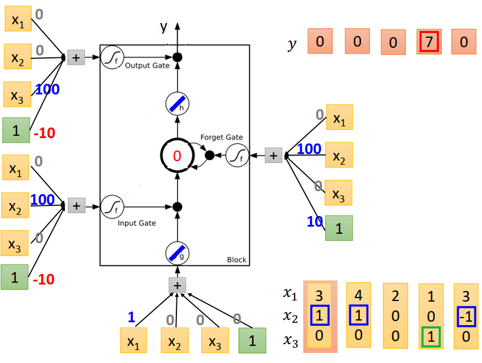

那我们就来实际做一下运算，这个是一个memory cell，这是一个LSTM 的 memory cell。那我们知道 LSTM 的 memory cell 总共有4个input， 这四个input都是 scalar，这四个的 input的 scalar是怎么来的呢，这四个 scalar 是我们 input 的那个三维 的 vector乘上 一个 linear 的 transform以后，所得到的结果，你就把 x~1~,x~2~,x~3~ 这三个 vector ，乘上3个值再加上bias，就得到这边的input (最下面的input）， x~1~,x~2~,x~3~ 这三个 值，再乘上3个weight 再加上bias，就得到他的input (input gate 的input），以此类推，那这些值，就是你的这个 input  x~1~,x~2~,x~3~ 要乘上哪些值，还有那个bias 的值应该是多少， 这一件事情是通过train data用 gradient descent 去学到的。我们这边只是 假设说我已经知道这些值是多少了，然后我用这样的输入他会得到什么样的输出。那我们就实际的来运算一下。

不过在实际运算之前，我们先根据它的input，根据这些参数来分析一下我们可能会得到的结果。那你看在底下input这个地方， x~1~乘1，其他都是乘0，所以这边就是直接把x~1~当做输入。那现在我们看input gate 的地方，他是 x~2~乘以100，bias是-10，也就是说假设 x~2~没有值的时候，因为bias是-10，所以通常input gate是被关闭的，如果 bias 是 -10的话 ，那通过sigmoid Activation Function 以后他的值会接近0，所以代表他是被关闭的，那只有在 x~2~ 有值的时候，如果  x~2~ 有值，他就比bias这个 -10还要大， 如果  x~2~大于1的话，这个时候input 就会是一个很大的正值，代表input gate被打开。forget gate平常都被打开的，你会发现说，因为他的bias是10，所以它平常都是被打开的，所以平常都会一直记得东西，只有在  x~2~ 给他一个很大的负值的时侯，他会压迫这个bias，才会把forget gate关起来。output gate平常也都是被关闭的，因为他bias是很大的负值，但是如果今天x~3~有一个很大的正值的话，他就可以压过bias把output gate 打开。

所以我们就实际的 来 input一下看看。我们假设 g 跟 h 都是linear的，这样计算会比较方便。假设初始值存在 memory 里面的初始值是0，那我们现在 input 第一个vector(3,1,0),input (3,1,0),input (3,1,0)会发生什么事呢，3* 1，所以这边进来的值是3。然后 1∗100−10，所以这边 input gate约等于1，所以他是被打开的。所以1* 3，通过input gate 以后，得到的值是3 。forget gate，input 是 (3,1,0)，所以 forget gate是被打开的。然后把 0 *1+3 ，虽然 forget gate 是被打开的，不过里面本来就没有存值，所以没有什么影响，0 *1+3 ，所以存在memory里面的值变成 3。然后接下来看 output gate， (3,1,0) ，  output gate还是被关起来的，所以3无关通过，所以输出就是0。

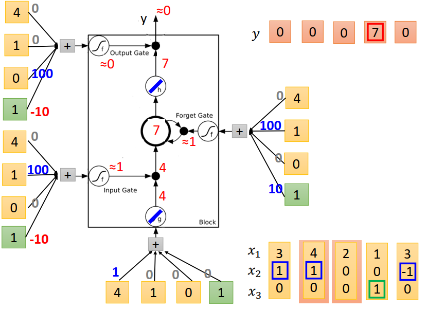

接下来input(4,1,0), 然后这个 input的地方还是 4，然后这个  (4,1,0) 会把 input gate打开，然后会把 forget gate，forget gate也会被打开，因为forget gate被打开 的关系，所以 3* 1+4，所以memory里面存的值会变成7 ，output gate仍然是被关闭的，所以7没有办法被输出，所以整个memory的输出仍然0。

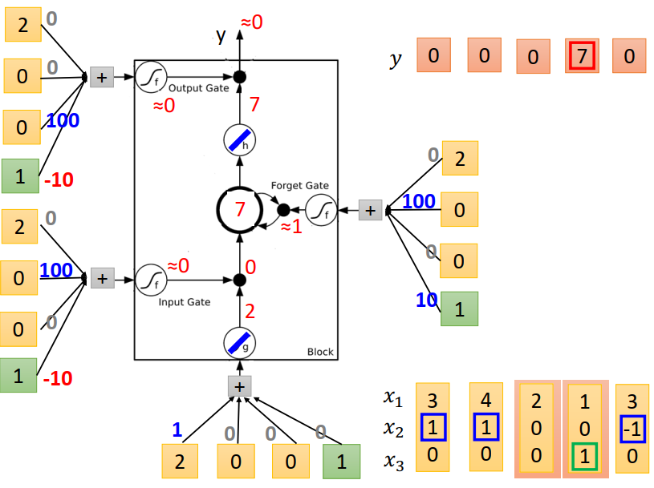

接下来input(2,0,0), input(2,0,0) 会发生什么事呢，input(2,0,0), 所以现在input 变成 2，然后 input gate会怎样呢, input gate现在 是(2,0,0), 所以他  Activation Function input 是-10，所以output 是趋近于0，所以0 *2=0，等于input 这个2  被 input gate 挡住了。forget gate，(2,0,0) 得到的 Activation Function input 是 10，所以 forget gate还是打开的。所以 7 * 1 +0， 原来的存在memory里面的值是不动的，还是7。这个7 他没有办法被输出 ，因为 output gate仍然是关闭的，所以整个output仍然是0。

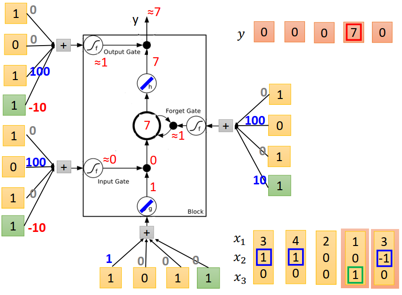

接下来input 是 (1,0,1),input (1,0,1) 会发生什么事呢，这边 input 仍然是1,input gate是被关闭的，forget gate 这个时候，仍然跟原来一样，他是被打开的，所以memory里面存的值是不变的.output gate 呢,当你input(1,0,1)  的时候， 你会打开 output gate，就是 Activation Function 的input 变成90，通过  Activation Function以后 得到1，1*7 等于7. 所以 output 的地方会变成是 有值的，也就是存在 memory里面的值 7会被读取出来

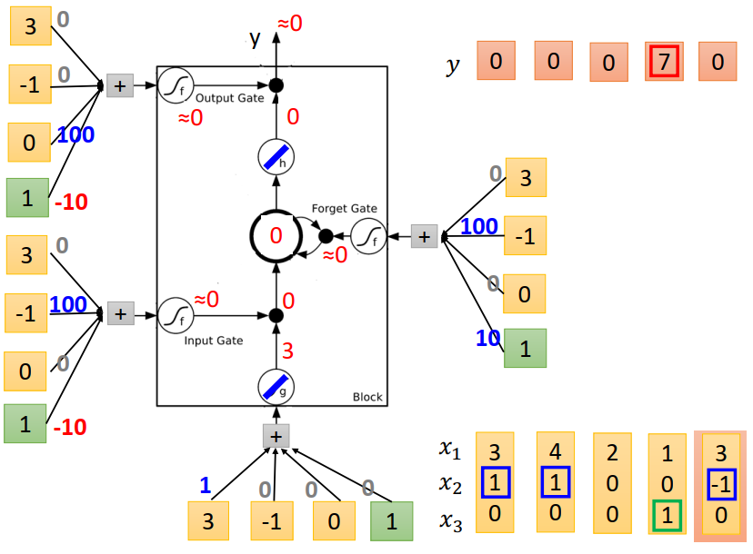

最后让我们试一下(3,-1,0),  这个3 就被读进来，input gate 会被关起来.forget gate 呢,因为 x~2~ 是-1，所以 forget gate的  Activation Function 的input 是-90，Activation Function 的output 就是0， 所以 memory里面存的值会被洗掉，变为0，memory里面存的值 会乘上  forget gate 的output ，会被洗掉，就变成0. output gate这个时候，仍然是关闭起来的，不过他有开有关也没差，反正现在存在 memory里面 的值变成0， 读出来的值也是0。

### LSTM 原理

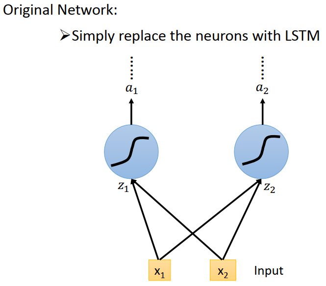

那你看到这边你可能会有一个 问题，这个东西 跟我们原来看到 的neural network 感觉很不像，他跟原来 的neural network 到底有什么样的关系呢。你可以这样想，在我们原来的neural network里面，我们会有很多的Neuron，我们会把input乘上不同的weight，然后当是做不同Neuron 的输入，然后每一个neural 他都是一个function，他输入一个scalar，output 另外一个scalar。但是如果是LSTM的话，你其实你只要把LSTM 的那个 memory的cell想成是一个neuron就好了。

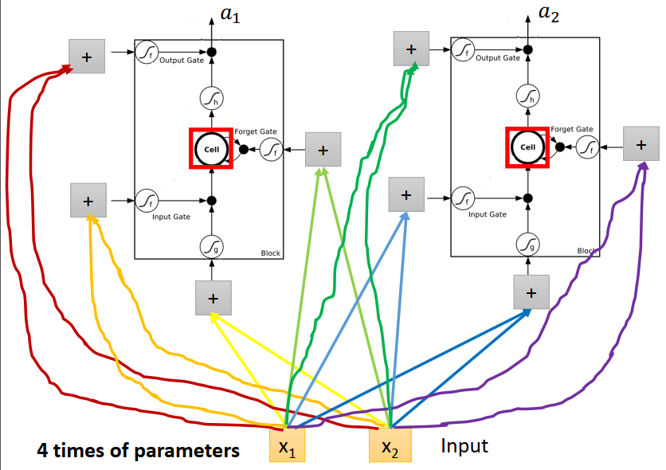

所以如果我们今天要用一个 LSTM 的 network，你做的事情只是把原来的简单的neuron换成一个LSTM 的 cell。而现在的input(x~1~,x~2~ )，他会乘上不同的weight当做LSTM的不同的输入， 也就是说(x~1~,x~2~ ) 乘上某一组weight，假设我们现在这个hidden layer只有两个neuron，也就是只有两个 LSTM ，但实际上你不会只有两个neuron，通常可能有 比如说 1000个 neuron，有1000 个 LSTM 的 memory cell。现在假设只有两个neuron，那x~1~,x~2~乘上某一组weight，会去操控第一个 LSTM 的output gate（红色)，乘上另外 一组 weight操控第一个 LSTM 的 input gate（橘黄色），乘上一组 weight当做第一个 LSTM input (黄色)，乘上 另外一组 weight当做另外一个 LSTM 的forget gate 的input(绿色）。第二个LSTM也是一样的，x~1~,x~2~乘上某一组weight，操控他的output gate（深绿色)，他会操控他的 input gate（浅蓝色），操控他的 input （蓝色），操控他的forget gate（紫色），等等。

所以 我们刚才讲过说 LSTM他就是有四个input跟一个output，而对一个LSTM来说，他的这四个input是不一样的。在原来的neural network里面一个neuron就是一个input一个output。在LSTM里面它需要四个input，它才能够产生一个output。就好像有的机器他只要插一个电源线他就可以跑，这样可能会LSTM 他要插4个电源线他才能跑。

所以LSTM 因为他需要四个input，这四个input都是不一样，所以LSTM需要的参数量，假设你现在用的neuron 的数目，就是假设 LSTM 的network，跟neural network 的，就原来的这个你用原来的 neural network 他们的 neuron 的数目是一样的时候，LSTM需要的参数量会是一般neural network的四倍，从这个图上你可以很明显的看出来，一般的 neural network 只需要input 的部分的参数，但LSTM还要操控 另外3个 gate，所以他需要4倍的参数。

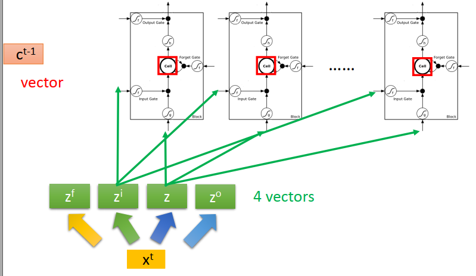

不过这样讲你可能 还是没有办法了解，你没有办法体会的可能是 这个跟Recurrent Neural Network 的关系是什么，这个好像看起来不太像 Recurrent Neural Network ，所以我们要画另外一张图来表示他。你可以想这个图也是要画非常久。

假设我们现在有一整排的neuron，假设一整排的 LSTM ，那这一整排的 LSTM 里面，他们每一个人的memory 里面都存了一个值，每一个 LSTM 的cell 他里面都存了一个 scalar，  把所有的 scalar 接起来他就变成 一个 vector，这边写成 c^t-1^, 那你可以想，这边每一个memory 里面存的 scalar 就代表了这个vector 里面的一个dimension。现在在时间点t，input一个vector x^t^，这个vector 他会首先先乘上 一个linear 的transform，乘上一个 matrix 变成另外 一个vector z, 你把 x^t^ 乘上一个 matrix变成z, 这个z也是一个vector，z这个vector的每一个 dimension 就代表了操控每一个 LSTM 的input，所以这个z 他的 dimension 就正好是 LSTM 的 memory cell 的数目。那这个 z 的第一维就丢给第一个cell，第二维就丢给第二个cell，以此类推，希望大家知道我的意思

那这个x^t^会再乘上另外的一个transform得到z^i^，然后这个z^i^ , 他的 dimension 也跟cell的数目一样，z^i^的每一个dimension都会去操控 一个 memory ，所以 z^i^ 的第一维就是操控第一个cell 的input gate，第二维就是操控第二个cell 的input gate，最后一维就是操控最后一个cell 的input gate。那 forget gate 跟output gate也都是一样，这边就不再赘述。你把x^t^乘上 transform得到 z^f^， z^f^ 会去操控每一个  forget gate ，然后 x^t^乘上另外一个  transform得到 z^o^， z^o^ 会去操控每一个 cell的  output gate .所以我们把 x^t^乘上四个不同的transform得到四个不同的vector，这四个vector的dimension都跟cell的数目是一样的，那这四个vector合起来就会去操控这些memory cell 的运作。

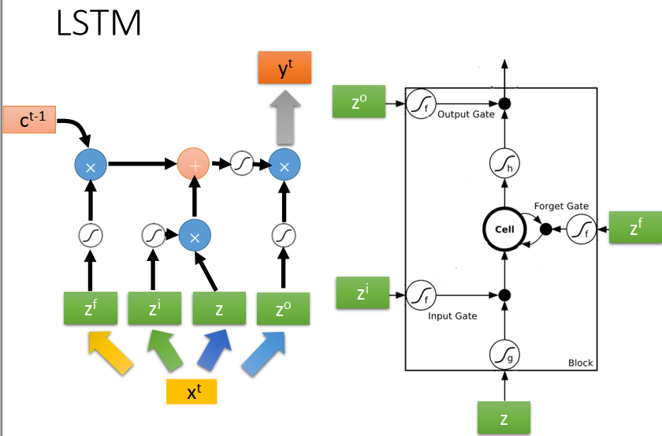

那我们知道一个memory cell就是长这样，现在input分别就是z,z^i^,z^o^,z^f^, 注意一下，这四个z 他们其实都是vector，丢到cell里面的值其实只是 每一个vector的一个dimension，因为每一个cell 他们 input的那个 dimension都是不一样的，所以每一个cell input的值都会是不一样。但是所有的 cell 是可以共同一起被运算的,怎么共同一起被运算呢，我们说，z 要乘上z^i^，要把z^i^ 先通过activation function，把它跟z相乘，这个乘是这个 element-wise 的 product 的意思，element-wise 的  相乘，这个 z^f^也要通过 forget gate 的 activation function，他跟之前已经存在 memory  cell里面的值相乘，然后接下来，你要把z跟z^i^相乘的值加上z^f^跟c^t-1^相乘的值，把他们加起来，那 output gate 呢，z^o^通过activation function, 然后把这个 output，跟相加以后的结果再相乘，最后就得到最后 的 output y^t^.

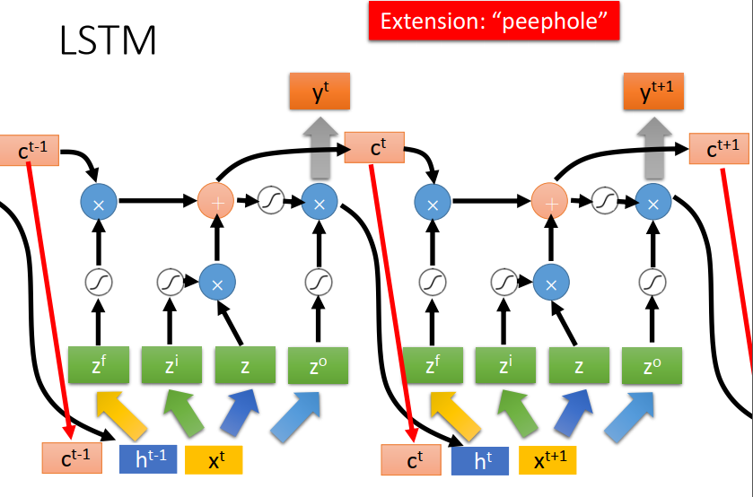

这个时候相加以后的结果就是memory里面存的值,也就是c^t^，那这个process就反复的继续下去，在下一个时间点input x^t+1^，然后把z 跟input gate相乘，你把forget gate跟存在memory里面的值相乘，然后再把前面两个值加起来，再乘上output gate的值，然后得到下一个时间点的输出y^{t+1}^

你可能觉得说这已经很复杂了，如果你自己做投影片的话显然是要做非常久，但是这个不是 LSTM 的最终形态，这个只是一个simplify 的 version， 真正的LSTM会怎么做呢,他会把上一个时间的hidden layer 的输出接进来，当做下一个时间点的input，也就说下一个时间点操控这些gate的值不是只看那个时间点的input x，还看前一个时间点的output h。然后其实还不止这样，还会加一个东西叫做“peephole”，这个peephole是什么呢，这个peephole就是把存在memory cell里面的值也拉过来。所以在操控 LSTM 的四个gate的时候，你是同时考虑了x,同时考虑了h,同时考虑了c，你把这三个vector并在一起，乘上4个不同的 transform 得到这四个不同的vector再去操控LSTM。

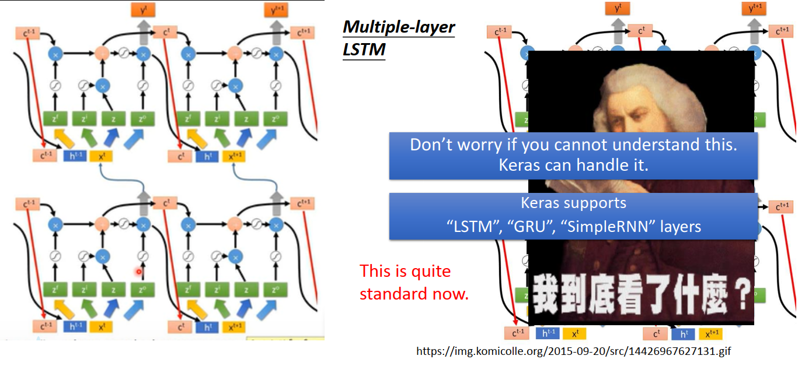

那 LSTM 通常不会只有一层，现在胡乱都要叠个五六层才爽这样子。所以他就长的大概是这个样子。然后每一个第一次看这个东西的人，他的反映都是这个样子。大家知道  sequence to sequence model 吗，那个 Google brand propose的，然后我有听过他 taught，他第一次看到LSTM 的时候，他的想法就跟这个图上是一样的，就是这个太复杂了，这应该不work把，我认识的每一个人第一次看LSTM 都觉得说这个应该不work。但是他现在还其实 还 quite standard ，当有一个人说我用 RNN 做了什么事情的时候，你不要去问他说为什么你不用LSTM,因为他其实就是用LSTM。因为现在当你说，你在做RNN的时候，其实你指的就用LSTM，所以他其实是比较 standard  的 。那其实Keras 里面有支援LSTM，所以就算是刚才讲的这么复杂的东西你没听懂，其实就算了，在 Keras里面就是打LSTM 四个字母，然后就结束了，Keras 他其实支援 三种Recurrent Neural Network，一个是‘’LSTM‘’,

另外一个“GRU”,GRU是LSTM的一个稍微简化的版本，它只有两个gate，据说少了一个gate，但是performance跟LSTM差不多，而且少了1/3的参数，所以比较不容易over fitting。

如果你要用这堂课最开始讲的那种最简单的 RNN 的话，你要说是simple RNN才行。

