[TOC]

# P 37 26: Recurrent Neural Network(Part Ⅱ)<!-- 91' -->

## learn 

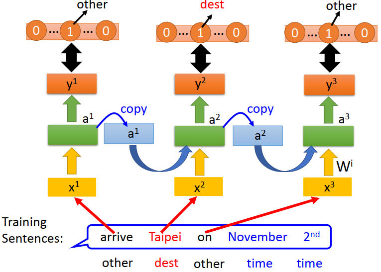

上次讲到 LSTM，总之就是一个复杂的东西，再来的问题是，像  Recurrent Neural Network这种架构，他要如何做 learning 呢，我们之前有说过，

如果要做learning的话，你要定义一个cost function来evaluate你的model 的 parameter 是好还是不好，然后你选一个model parameter，可以让loss 最小。那在Recurrent Neural Network里面，你会怎么定义这个loss呢，以下我们就不写算式，直接举个例子。

假设我们现在做的事情是slot filling，那你会有training data，这个training data是说,我给你一些sentence，你要给sentence label，告诉machine说第一个word它是属于other这个 slot，“Taipei”属于 Destination这个 slot,"on"属于other的 slot，“November”和“2nd”都属于要抵达 time 的 slot，然后接下来你希望说，你的cost 会怎么定呢。把 “arrive”丢到Recurrent Neural Network的时候，Recurrent Neural Network会得到一个output y^1^,接下来这个y^1^会看 一个 reference 的 vector算它的cross entropy。所以你会希望说，如果我们现在丢进去的是“arrive”，那y^1^他的reference 的 vector应该是对应到other 那一个 slot的dimension value 是1，其他是0，这个reference 的 vector的长度就是你slot的数目，这里定了四十个slot，那这个 reference vector的长度 他的 dimension就是40，那假设现在 input 这一个word他应该对应到other这个 slot的话，那对应到other 那个 dimension就是1,其它就是0。

那现在你把“Taipei”丢进去的时候，因为“Taipei”属于destination 这个slot,所以就希望说把x^2^丢进去的时候，y^2^它要跟reference 的 vector距离越近越好。那y^2^的reference vector是对应到destination 那个 slot是1，其它为0。

但这边注意的事情是，你在丢x^2^之前，一定要丢x^1^, 在把“Taipei” 丢进去之前一定要先把“arrive''丢进去，不然你就不知道存到memory里面的值是多少。所以在做training的时候，你也不能够把你的all trains 里面的这些word，这个word sequence 打散来看，word sequence仍然要当做一个整体来看。同样的道理，把“on”丢进去，他的 reference vector是对应到这个对应 到 other那个 dimension是1,其它是0.

然后所以你的 cost 就是每一个时间点的 RNN 的output跟 reference vector的cross entropy的和就是你要去minimize 的对象。

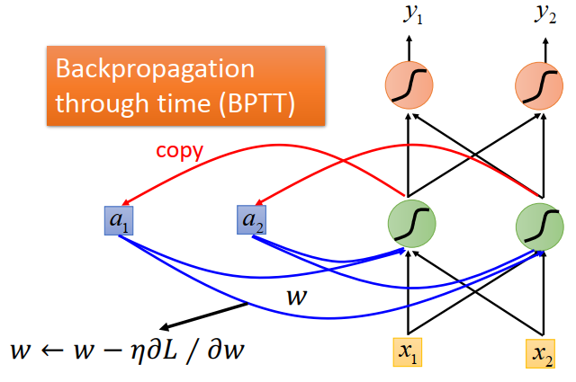

那现在有了这个loss function以后，training 要怎么做呢，training 其实也是用 gradient descent 。也就是说如果我们现在已经定出了loss function L ，我要update这个 network里面的某一个参数w，我要怎么做呢，就是计算 w 对 L 的偏微分，把这个偏微分计算出来以后，就用  gradient descent  的方法去update 每一个 参数。我们之前在讲 neural network的时候，已经讲过很多次了，那在讲这个 之前的那个 feed forward network 的时候，我们说 gradient descent 用在feed forward network里面你要用一个比较有效的演算法叫做Back propagation。那Recurrent Neural Network里面，gradient descent 原理是一模一样的，但是为了要计算方便，所以也有开发一套演算法，这套演算法是Back propagation的进阶版，他叫做BPTT。那它跟Back propagation其实是很类似的，只是因为Recurrent Neural Network它是在high sequence上面做运作，所以BPTT它需要考虑时间的information。那我们在这边我们就不讲 BPTT，反正你只要知道说，反正RNN就是用gradient descent train 的，他是可以train 的就行了。

## unfortunately

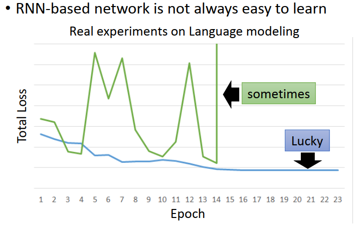

然而不幸的就是，RNN的training是比较困难的。一般而言，你在做training的时候，你会期待，你的learning curve是像蓝色这条线，这边的纵轴是total loss，这个横轴是training 的时候 的epoch的数目，你会希望说,随着epoch 越来越多，随着参数不断的被 update，loss 应该就是慢慢，慢慢的下降最后趋向收敛。但是不幸的是，当你在训练这个Recurrent Neural Network的时候，你有时候会看到绿色这条线。这个很重要，如果你是第一次train Recurrent Neural Network，你看到绿色的这样子的learning的 curve，这个 learning的 curve非常剧烈的抖动，然后抖到某个地方，就出来 NAN, 然后你的程式就segmentation fault， 这个时候你会有什么想法，我相信你的第一个想法就是程序有bug啊。

今年春天我邀那个 Tomas Mikolov 来台湾，Tomas Mikolov 就是发明 word vector 的人，之前讲过了，然后他跟我分享了他当时开发RNN的心得，他是最早开始做RNN的 Language model 的人，大概在09年的时候就开始做，有很长一段时间，只有他能够把RNN 的 Language model train 起来，其他人都train不起来，他说他在那个年代，那个年代是没有像现在有什么 tansorflow，Theano之类的，那个年代做什么东西都是要徒手磕的，所以他徒手磕了一个RNN，然后train完以后就发生这样的 现象,他第一个想法就是,程式有bug,然后努力的de 了bug 以后,果然有很多bug,但是他后来就把bug 修掉,他觉得应该是没有bug 了,但是这个现象还是在的,所以他就觉得很困惑,那其他人就跟他说,放弃啦,放弃啦,这不work  这样子,他却想说他要知道结果,为什么会这样,所以他就做分析,这个图是来自于他的paper,

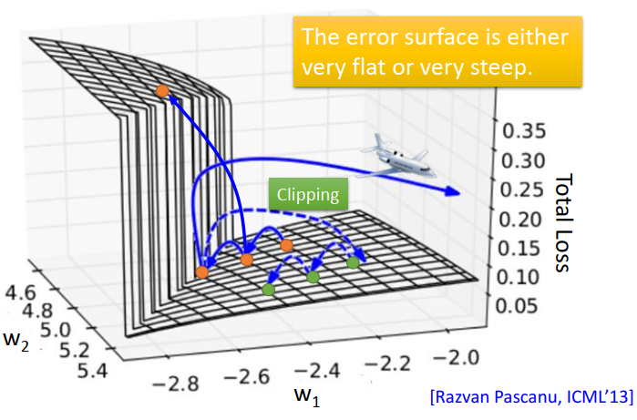

他分析了下RNN的性质，他发现说RNN的error surface,所谓 error surface 是total loss对参数的变化,是非常陡峭的(崎岖的), 所谓 崎岖的 的意思是说,这个 error surface他有一些地方非常的平坦，有一些地方非常的陡峭，就像是有悬崖峭壁一样.所以以上这是一个,这边投影片上是一个示意图,纵轴是total loss，那这个 x轴 和y轴代表两个参数 W~1~ 跟  W~2~。这个图上显示的就是 W~1~  W~2~这两个 参数对total loss 的影响,发现说在很多地方都是非常平坦的,在某些地方非常的陡峭,

所以这个会造成什么样的问题呢, 假设你从橙色这个点当做你的初始点，用 gradient descent 开始调整你的参数, 橙色这个点, 你算一下 gradient ,然后 update 你的参数，就跳到下一个橙色的点; 再算一下 gradient ,再 update 你的参数，你可能正好就跳过一个悬崖，所以 你的loss就突然爆增，就会 看到loss上下非常剧烈的震荡。有时候可能会遇到另外一个更惨的状况，就是你正好一脚踩在这个悬崖上，那你踩在悬崖上会发生什么事情呢，你踩在悬崖上,因为在悬崖上的gradient很大，然后之前的gradient都很小，所以你措手不及，因为之前gradient很小，所以你可能把learning rate调的比较大。但是 gradient 突然很大, 很大的gradient 再乘上很大的learning rate,结果参数就update很多，然后整个参数就飞出去了,所以你就NAN,所以程式就 segmentation fault

然后 Tomas Mikolov就想说,怎么办呢,他说他不是一个数学家,所以他要用工程师的想法来解决这个问题，然后他就想了一招,这一招应该是蛮关键的，实际上很长的一段时间，只有他的code可以把RNN的 Language model train出来,很长一段时间,人们是不知道这一招的,因为这一招他觉得实在是太没什么,所以没写进在paper 里面,直到他在写博士论文的时候,博士论文是比较长的,所以有些东西就算你觉得  trivial,你可能还是会写进去,直到他在写博士论文的时候,大家才发现这一个秘密.

这个秘密是什么呢,这一招说穿了就不值钱,这一招叫做clipping, clipping 的意思是说,当gradient大于某一个threshold的时候，就不要让它超过那个threshold，在 Tomas Mikolov 程式里面我记得就是,  当gradient大于15的时侯，就等于15结束。所以因为gradient现在不会太大，所以当你做 clipping的时候，就算是踩在这个悬崖上，也没有关系,你的参数就不会飞出来，他会飞到一个比较近的地方，这样你仍然可以继续做 RNN的training。

那接下来的问题就是, 为什么RNN会有这种奇特的特性。有人可能会说，是不是因为来自于sigmoid function，我们之前有讲过在讲 Relu 做 activation function的时候，我们讲过一个问题叫做 gradient vanish的问题，然后我们说这个问题是从sigmoid function来的，因为 sigmoid  的关系,所以有  gradient  vanish 这个问题,

就是说RNN会有这种很平滑的error surface,是因为来自于gradient vanish，是因为来自于sigmoid function.  这件事情我觉得不是真的, 你想想看,如果这个问题是来自于sigmoid function，你换成Relu就解决这个问题了.所以不是这个问题了。可以跟大家讲一个秘密，如果你用 Relu ,你会发现说一般在train neural network 的时侯，很少用Relu来当做activation function。为什么呢, 因为如果你把sigmoid 换成Relu，其实在RNN上面  performance通常是比较差的。所以activation function并不是这这个地方的关键点。

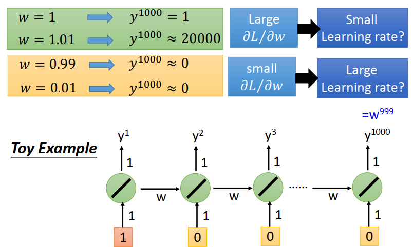

如果说我们今天有讲这个 Back propagation  through time (BPTT) 的话，从式子里面你会比较容易看出说为什么会有这个问题。那今天我们没有讲Back propagation  through time 。没有关系，我们有一个更直观的方法可以来知道说一个gradient的大小是什么样子。这个更直观的办法就是你把某一个参数做小小的变化，看它对network output的变化有多大，你就可以测出这个参数的gradient的大小。

我们这边举一个很简单的RNN当作我们的例子，今天有一个全世界最简单的RNN，他只有一个neuron，这个neuron是linear。他只有一个 input,没有bias，input的weight是1，output的weight也是1，那 transition的部分 的 weight是w。也就是从memory接到neuron的input的weight是w。

现在假设我给这个 network的输入是(1,0,0,0)，只有第一个时间点输入1 ,其他都输入0,那这个network的output会长什么样子呢,比如说，这个 network在最后一个时间点,第 1000个时间点 的output值会是多少,我相信大家都可以 马上回答我,他的值 是w^999^,你把1 输进去,再乘上w ,再乘上w ,再乘上w ,乘了999次w,输出就是 w^999^.后面输入都是0,不影响,只有一开始的1 有影响,但是他会通过 999 次的w,

那我们现在看假设w是我们要learn的参数，我们想要知道它的gradient，所以我们想要知道当我们改变w的值时候，对network 的output有多大的影响。现在我们假设w=1，那y^1000^，network在最后一个时间点 的output 也是1,假设w=1.01，那y^1000^ 是多少呢, y^1000^  是1.01 ^999^,1.01 ^999^是多少呢,是20000，是一个很大的值, 这个就是跟蝴蝶效应一样，这个w有一点小小的变化，对它的output影响是非常大的。

所以w有很大的gradient。那你可能想有很大的gradient也没有什么，我们只要把他的 learning rate设小一点就好了。但实事上如果 我们把w设成0.99，那y^1000^ = 0，如果我把w设0.01，那y^1000^还是等于0。也就是说在1这个地方有很大的gradient, 但是在0.99 的地方gradient 就突然变得非常非常的小，这个时候你又需要一个很大的 learning rate。就会造成说你设 learning rate很麻烦，你的error surface很崎岖，因为这个 gradient 是时大时小的，而且在非常短的区域之内，gradient就会有很大的变化。所以从这个例子其实你可以看出来说，为什么RNN会有问题，RNN 的 training的问题其实是来自于它把同样的东西在transition的时候, 在时间和时间转换的时候反复使用。从 memory 接到 neuron 的那一组weight ,在不同的时间点都是反复被使用的,所以这个w只要一有变化，它有可能完全没有造成任何影响，一旦他可以造成影响，影响都会是天崩地裂的影响,所以他有时候 gradient 很大，有时候gradient很小。

所以RNN会不好训练的原因并不是来自于 activation function, 而是来自于它有high sequence,**同样的weight在不同的时间点是会被反复的不断的被使用。**

## 如何解决RNN梯度消失或者爆炸

那有什么样的技巧可以帮助我们解决这个问题呢, 其实现在最广泛的被使用的技巧就是LSTM，LSTM可以让你的error surface不要那么崎岖。它可以做到的事情是，它会把那些比较平坦的地方拿掉，他可以解决gradient vanish的问题，但是他不会解决gradient explode的问题。你有些地方仍然是会非常的崎岖的,你有些地方他仍然是变化非常剧烈的，但是不会有特别平坦的地方。

因为如果你在做LSTM 的时侯，大部分的地方都变化很剧烈，所以当你在做LSTM的时候，你可以放心的把你的learning rate设的小一点，让他要在learning rate特别小的情况下进行训练。

那为什么LSTM 可以做到 handle gradient vanish 的问题呢，为什么他可以避免让 gradient特别小呢. 我听说有人在面试某家国际大厂的时候就被问这个问题，那这个问题怎么答比较好呢,这个问题是这样, 为什么我们把RNN换成LSTM 。如果你的答案是因为 LSTM比较潮，因为 LSTM比较复杂，这个都太弱了。真正的理由就是 LSTM可以handle gradient vanishing的问题。但是接下来人家就会问说：为什么LSTM 可以 handle gradient vanishing的问题呢, 我在这边试着来回答看看，这样子之后如果有人 ,你口试的时候再问道这个问题的时侯，你可以想想看有没有办法回答。

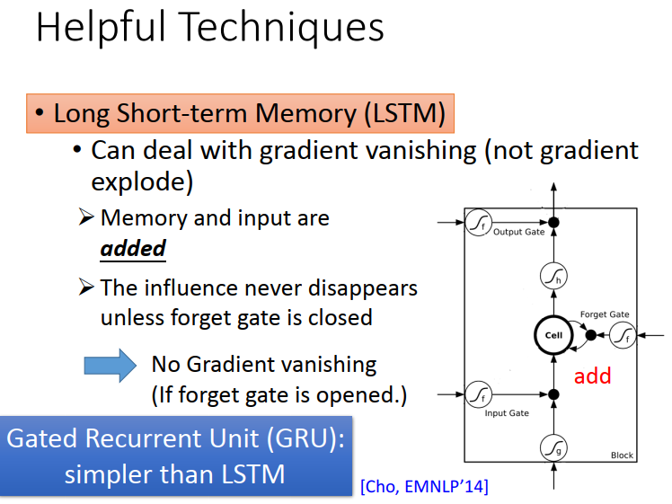

这个如果你想看 RNN跟LSTM,他们在面对memory的时候，它们处理的 operation 其实是不一样的。你想想看，在RNN里面，在每一个时间点，其实 memory里面的资讯都是会被洗掉，在每一个时间点，neuron的output都 会被 放到 memory里面去，所以在每一个时间点，memory里面的咨询都会被覆盖掉,都会被完全洗掉。

但是在LSTM里面不一样，它是把原来memory里面的值乘上一个值再把input的值加起来放到cell里面去。所以它的memory 和 input是相加的。所以今天它和RNN不同的地方是，如果今天你的weight可以影响到memory里面的值的话，一旦发生影响,这个 影响会永远都存在。不像RNN在每个时间点的值都会被format掉，所以只要这个影响一被format掉它就消失了。但是在LSTM里面，一旦能够对memory造成影响，那那个影响会永远留着, 除非forget gate被使用, 除非forget gate决定要把memory 里面的值洗掉，不然一旦 memory 有改变 的时候，每一次都只会把新的东西加进来，而不会把原来存在memory 里面的值洗掉，所以它不会有gradient vanishing的问题

那你可能会想说可是现在有forget gate, forget gate 就是会把过去存的值洗掉。事实上在 LSTM 97年的时候就  propose,LSTM  的第一个版本其实就是为了解决gradient vanishing的问题，所以它是没有forget gate 的，forget gate是后来才加上去的。甚至，现在有个传言是,你在训练LSTM的时候，你要给forget gate特别大的bias，你要确保forget gate在多数的情况下都是开启的，只有少数的情况他会被 format 掉.

那现在有另外一个版本的用gate操控memory cell，叫做Gates Recurrent Unit(GRU)，LSTM有三个Gate，这个 Gates Recurrent Unit 他只有两个gate，所以 Gates Recurrent Unit,缩写是 GRU, 相较于 LSTM 他的 gate 只有 两个,所以他需要的参数量是比较少的。因为它需要的参数量比较少，所以它在training的时候是比较 robust 的。所以如果你今天在train LSTM 的时候，你觉得over fitting的情况很严重，你可以试下用GRU 替代。那GRU的精神就是, 他怎么拿掉一个gate 呢,我们今天就不讲 GRU 的详细的原理, 他的精神就是 旧的不去，新的不来。它会把input gate跟forget gate联动起来，也就是说当input gate 被打开的时候，forget gate就会自动的关闭,就会 format掉 存在 memory里面的值，当forget gate没有要format 值 的时候，input gate就会被关起来。也就是说你要把存在memory里面的值清掉，才可以把新的值放进来。

## 其他方式

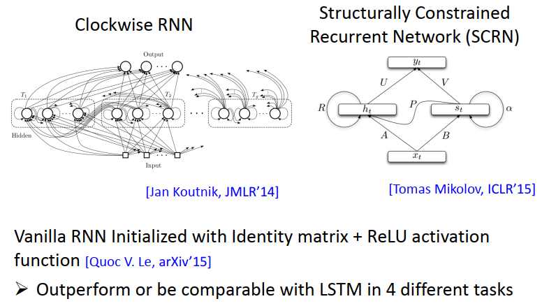

其实还有很多其他的technique是来handle gradient vanishing这一个问题。比如说clockwise的 RNN或者说是这个 Structurally Constrained Recurrent Network (SCRN)等等。就把 reference留在这边给大家参考

最后有一个蛮有趣的paper是 Hinton propose的,  这个方法是这样,他说当他用一般的RNN 而不是 LSTM,他说一般的RNN 他用identity 的 matrix（单位矩阵）来initialized transition 的weight,然后再使用 ReLU 的 Activation function 的时候,它可以得到很好的performance。那你可能说刚才不是说用ReLU的performance会比较差吗，如果你是一般training 的方法,你 initialization 的 weight是random 的话，那ReLU跟sigmoid function来比的话，sigmoid performance 会比较好。但是如果你今天用了identity  的matrix 当作 initialization  的话，这个时候用ReLU 的 performance就会比较好,这件事情真的是非常的神奇.当你用了这一招以后,用一般的RNN，不用 LSTM ,他的 performance 就可以吊打原来的 LSTM ,那你就觉得说LSTM 能有这么复杂,结果都是百忙一场这样子,这个是非常神奇的一篇文章.

## more applications...

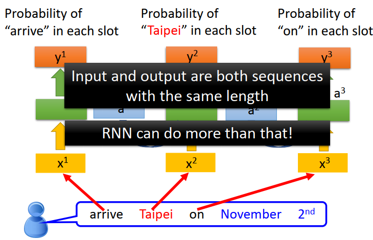

那其实RNN有很多的application，在我们前面举得那个slot filling的例子里面。我们是假设input跟output的element 的 数目是一样做的，也就是说input有几个word，我们就给每一个word 一个slot 的label。但实事上 RNN他可以做到更复杂的事情

### Many to one

#### sentiment analysis

比如说他可以 input是一个sequence，output只是一个vector，这有什么应用呢。比如说，你可以做sentiment analysis。sentiment analysis现在有很多的application.

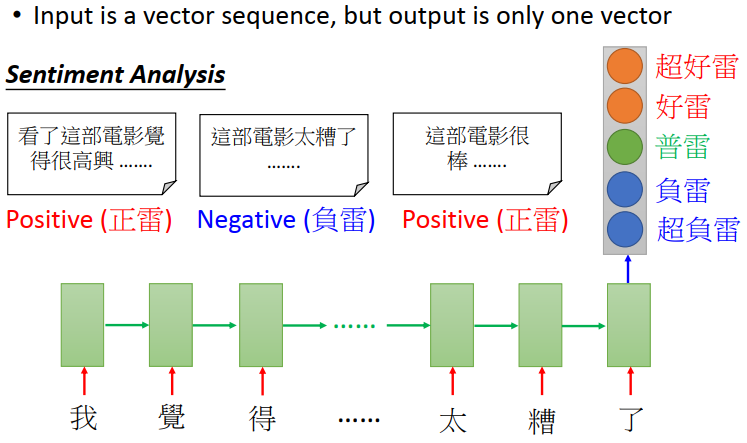

比如来说,某家公司想要知道说，他们的产品在网络上的评价是positive 还是negative。他们可能就会写一个爬虫，把跟他们网络评价有关, 跟他们产品有关系的那些网络上的文章都爬下来。那这一篇篇看太累了，所以你可以用一个machine learning 的方法 自动 learn一个classifier去分类说哪些document是正向的，哪些document是负向的。或者是在电影版上，sentiment analysis做的事情就是给machine 看很多文章，然后machine要自动知道说，哪些文章是正类，哪些文章是负类。怎么样让machine做到这件事情呢, 你就是learn一个Recurrent Neural Network，这个input是一个 character sequence，然后Recurrent Neural Network把这个 character sequence读过一遍。然后在最后一个时间点，把hidden layer拿出来，可能再通过几个transform，然后你就可以得到最后的sentiment analysis 的prediction ,比如说 input 这一个 document, 他是超好雷,好雷,普雷,负雷,还是超负累,他是一个分类的问题，但是 input是一个sequence，所以你需要用RNN来处理这个 input.

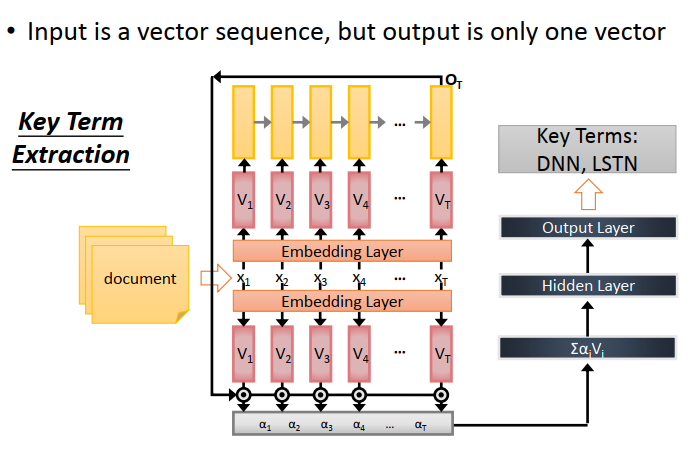

或者是我们实验室做过,用RNN来作key term extraction。所谓 key term extraction 的意思是说给machine看一篇文章，然后 machine要predict 说这篇文章里面有哪些的关键词汇。然后跟我们在final  project  里面的第三个task做的其实是非常类似的事情. 那如果你今天能够收集到一堆 training data,也就是搜集到一堆 document，然后这些document都有label说哪些词汇是对应他对应的key word 的话，那你就可以直接train一个RNN，这个RNN把document 的 word sequence  当做input，然后通过Embedding layer，然后用RNN把这个document读过一次，然后把出现在最后一个时间点的output拿过来做attention，我们发现说我们没有讲过attention 是什么,没有关系,这个地方你就听听就好, 用 attention 以后,你可以把重要 的information抽出来再丢到feed forward network里面去,得到最后的output

### many to Many

#### 语音识别

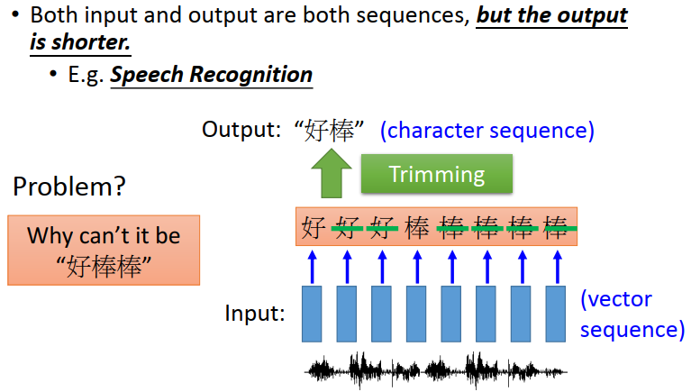

那它也可以是多对多的，比如说当你的input和output都是sequence，但是output 的sequence比input sequence短的时候，RNN可以处理这个问题。什么样的任务是input sequence长，output sequence短呢。比如说，语音辨识就是这样一个任务。在语音辨识这个任务里面input是一串 acoustic feature sequence,语音是一段声音讯号 ,比如说你要做语音辨识的时候你就说一句话，这句话是一段声音讯号。我们一般处理声音讯号的方式，就是在声音讯号里面，每隔一小段时间，就把它用一个vector来表示。这个一小段时间通常很短,比如说，0.01秒。那他的output呢,他的output 是character 的 sequence。

如果你是用原来的RNN,用我们在做 slot filling 那个RNN ，你把这一串input丢进去，它充其量只能够做到说，告诉你每一个vector他对应到哪一个character。假设做中文的语音辨识的话，那你的output的 target理论上就是这个世界上所有可能中文的character,那这个可能,常用的可能就有八千个，所以你的这个RNN 的output 这个 class 的数目会有八千。虽然很大，但这是有办法做的。但是你充其量也只能做到说,每一个vector属于一个character。但是 input 这个每一个vector 对应到的时间是很短的,通常才 0.01秒，所以通常是好多个vector才对应到同一个character。所以你的辨识结果就变成 “好好好棒棒棒棒棒”这样子。你可能会说,这不是语音辨识的结果呀，怎么办,有一招叫做 “trimming”, “trimming”就是把重复的东西拿掉，就变成“好棒”。那这样会有一个很严重的问题，因为它就没有办法辨识“好棒棒”。

#### CTC语音识别

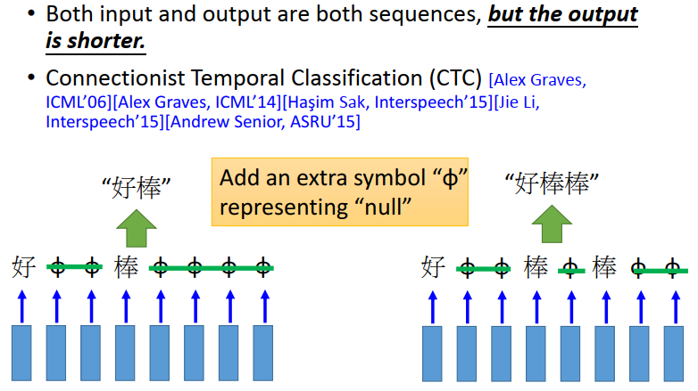

跟不知道的人说一下, “好棒”和 “好棒棒”正好是相反的.这件事我发现很多人都不知道,比如说我女朋友工作的地方,就是有一次他们的老板说,我们来编个我们公司的口号把,然后就找一个台大的人来编,这个台大的人就对公司心怀怨恨,所以在他的口号里面就有 “好棒棒”,就是“XX公司好棒棒”,然后主管都觉得很棒这样子,他们都不知道说这个是负面的意思.所以不把“好棒”和“好棒棒”分开来是不行的,

所以需要把“好棒”跟“好棒棒”分开来，怎么办，我们要用一招叫做“CTC”,这一招也是那种说穿了不值钱的方法,但这一招很神妙，它说：我们在output的时候，我们不只是output所有中文的character，我们还多output一个符号，叫做"null"叫做"没有任何东西"。所以今天如果我 input一串 acoustic feature sequence,它的output是“好 null null 棒 null null null null”，然后我就把“null”的部分拿掉，它就变成“好棒”。如果我们输入另外一个sequence，它的output是“好 null null 棒 null 棒 null null”，它的output就是“好棒棒”。就可以解决叠字的问题了。

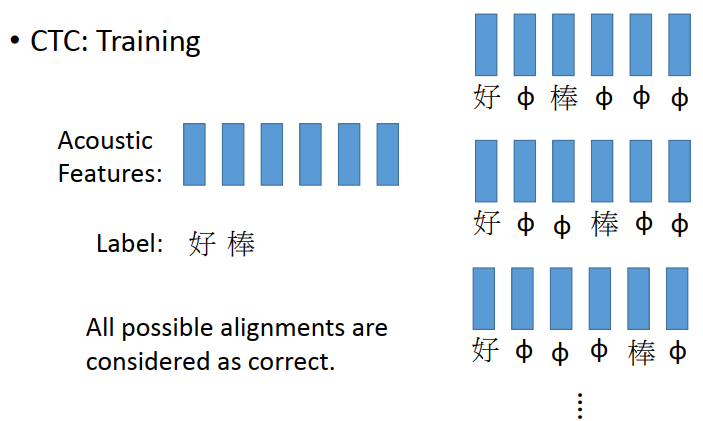

那在训练的network的时候,训练的时候 怎么做呢,CTC怎么做训练呢。这个也是可以的,CTC在做training的时候，你手上的training data就会告诉你说，这一串acoustic feature对应到这一串character sequence，但它不会告诉你说“好”是对应第几个 frame 到第几个 frame ,“棒”是对应第几个frame 对应到第几个frame 。那怎么办呢，穷举所有可能的alignments。简单来说就是，我们不知道“好”对应到哪几个frame，不知道“棒”对应到哪几个 frame。我们就假设所有的状况都是可能的。可能第一个是“好 null 棒 null null null”，可能“好 null null 棒 null null”，可能“好 null null null 棒 null”。我们不知道哪一个是对的，就假设全部都是对的。那 training的时候，全部都当做是正确的，一起去train。你可能会想说,穷举所有的可能，那可能性感觉太多了，这个有巧妙的演算法可以解决这个问题,那我们今天就不细讲这个部分。

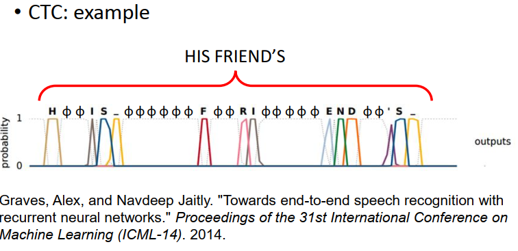

以下是在文献上 CTC 得到的一个结果,这个是英文的。在做英文辨识的时候，你的RNN的 output 的target 就是character,就是英文的字母+空白,空白就是你也不需要给RNN词典什么之类的。它就直接output字母，然后如果到一个字和字之间有boundary，他自动就会用空白区分。

假设一个例子，第一个frame 就output h，第二个frame就 output null，第三个frame 就 output null，第四个frame就 output I等等。如果你看到output是这个样子的话，那最后你把“null”的部分拿掉，这句话辨识的结果就是“HIS FRIEND'S”。你不需要告诉machine说："HIS"是一个词汇，“FRIEND's”是一个词汇,machine透过training data 他自己会学到这件事情。那传说，Google 现在的语音辨识系统已经全面换成CTC来做语音辨识。如果你用CTC来做语音辨识的话，就算是有某一个词汇,比如说英文的人名，地名,从来 在training data 里面没有出现过，machine从来不知道这个词汇,他其实也是机会把他正确的辨识出来。

#### sequence to sequence learning

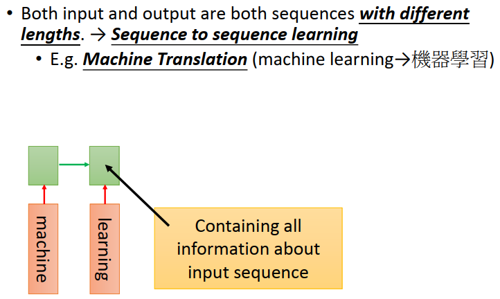

另外一个神奇的RNN的应用叫做sequence to sequence learning，在sequence to sequence learning里面,RNN的input跟output都是sequence,但这两个 sequence 的长度是不一样的。刚才在讲CTC的时侯，input比较长，output比较短。在这边我们要考虑的case是不确定input跟output谁比较长谁比较短。

比如说，我们现在要做的是 machine translation，input英文的 word sequence要把它翻成中文的character sequence。那我们并不知道说，英文跟中文谁比较长谁比较短,有可能是output比较长，也有可能是output比较短。所以怎么办呢

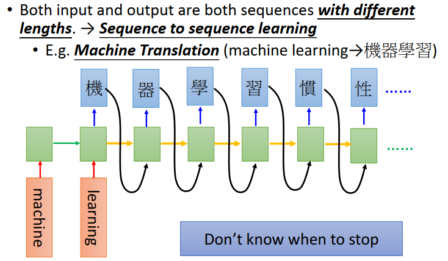

现在假如 input 是 machine learning ，我们就把 machine learning 用RNN读过去，然后在最后一个时间点，这个memory里面就存了所有input 的整个 sequence的information。

然后接下来，你就让machine 吐一个character,比如说他第一个吐的 character 就是机，你把   machine learning  让  machine 读过一遍,然后再让它output character,他可能就会output 机, 接下来,再叫他output 下一个character，你把之前的output出来的character当做input，再把memory里面存的值读进来，它就会output “器”。那这个“机”要怎么接到这个地方呢，有很多支支节节的技巧，这个太多了,这个以后我们再讲,这个以后或许下学期在 NLP 再讲, 这个有很多支支节节的地方，还有很多各种不同的变形。那他在下一个时间点 “器”以后，他就output“学”，然后 “学” 后面就 output“习”，然后他就会一直output下去,“习”后面接"惯", “惯”后面接"性",永远都不停止这样.第一次看到这个model,就想哇有这个work吗,你根本不知道什么时候该停止.

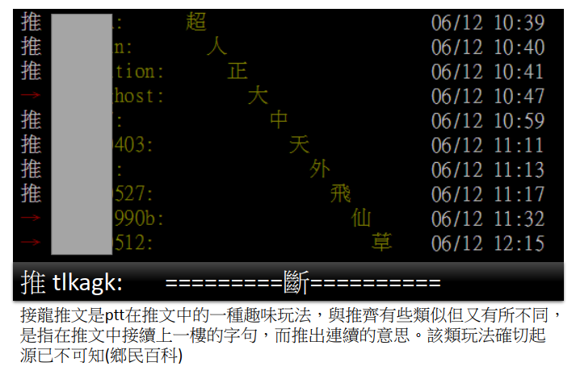

那怎么办呢, 这就让我想到推文接龙，我不知道大家知不知道推文接龙是是什么 ,(上图有解释),也就是说有一个人推"超"以后，下一个人就会推"人"，然后 "人"后面再推"正"，然后一直推推，等你推好几个月，都不会停下来,我也不知道为什么会这样,他不会停下来。你要怎么让它停下来呢, 你要有一个人冒险去推一个“断”，他就会停下来了。其实也不会停下来,你要推一个“断”他就会停下来,

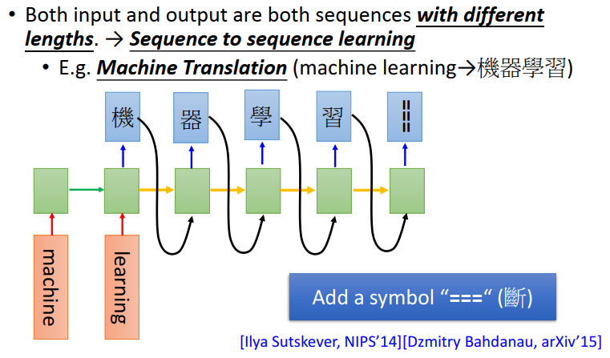

所以今天让machine 做的事情,也是一样, 要如何阻止它不断的继续产生词汇呢, 你要多加一个symbol 叫做“断”，所以machine现在不只是output所有可能 的character，它还有一个可能的output 叫做“断”。所以如果今天“习”后面他的output是“===”(断)的话，就停下来了。你可能觉得说这个东西train的起来吗，train的起来。神奇的就是这一招是有用的.

它也有被用在语音辨识上,也就是直接input  acoustic feature sequence,直接就 output  character sequence.只是这个方法还没有 CTC 强,这个方法还不是 state of the art 的结果,但让人真正 surprised 的地方就是这么做是行的通,然后它的结果是没有烂掉的.在翻译上倒是据说用这个方法已经可以达到  state of the art  的结果.

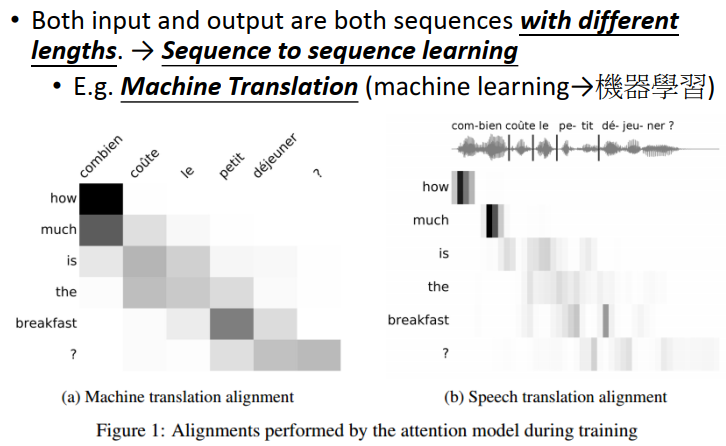

最近这个是 ,应该是 Google brand 在12月初的时候发的paper,所以是几周前放在 arxiv 上面的paper.他们做了一件事情,我相信这件事情很多人都会想到,只是没人去做而已.它这个想法是这样, sequence to sequence learning我们原来是input ,假设做翻译的话,也就是input某种语言的文字,然后翻译成另外一种语言的文字。那我们有没有可能直接input某种语言的声音讯号，output另外一种语言的文字呢, 我们完全不做语音辨识。比如说你要把英文翻译成中文，你就收集一大堆英文的句子，看它对应的中文翻译。你完全不要做语音辨识，直接把英文的声音讯号丢到这个model里面去，看它能不能够output正确的中文。结果这一招居然是看起来是行得通的, 我相信很多人想过这个,大家觉得做不起来,所以没有人去试,但是这一招看起来是行得通的 。你可以直接input 一串法文的声音讯号,然后model就得到辨识的结果.这件事情是还蛮 surprised,如果 这个东西能够成功的话,他可以带给我们的好处是,如果你今天在 collect  translation 的training  的data 的时候.会比较容易,

假设你今天要把某种方言,比如说台语转成英文，但是台语的语音辨识系统其实比较不好做，因为台语你可能根本就没有,它根本没有一个 standard 的文字的系统，所以你要找人来 label 台语的文字可能也有点麻烦, 如果这样子的技术是可以成功的话，未来你在训练台语转英文的语音辨识系统的时候，你只需要收集台语的声音讯号跟它的英文翻译就可以了。你就不需要台语的语音辨识的结果，你就不需要知道台语的文字，你也可以做这种翻译。

#### Beyond Sequence

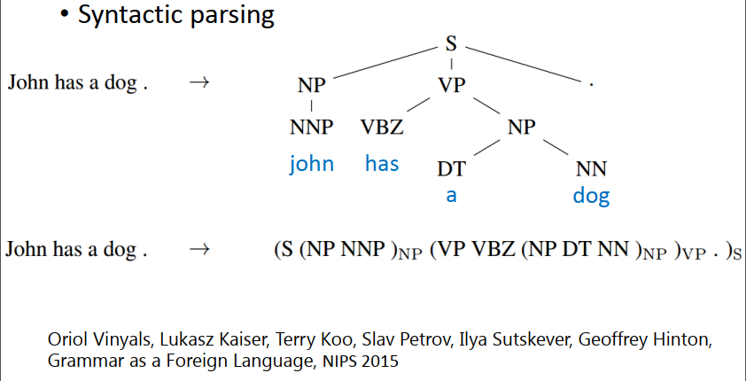

现在还可以 用sequence to sequence的技术，甚至可以做到Beyond Sequence。比如说这个技术也被用在 syntactic 的 parsing tree里面。用在产生 synthetic 的 parsing tree 上面, 这个  synthetic 的 parsing tree是什么呢, 意思就是，让machine看一个句子，然后它要得到这个句子的文法的结构树，他要得到一个树状的结构。要怎么让machine得到这样子的树状的结构呢,过去你可能要用structure learning的技术才能够解这个问题。但现在有了 sequence to sequence learning的技术以后，你只要把这个树状图描述成一个sequence,有人说树状图怎么描述成 sequence,当然可以描述成一个 sequence,看这个是 root 一般写作 S, 所以这是 S   的左括号,这是S的右括号,它下面有NP 根,VP,所以有NP 的左括号,NP 的右括号,VP 的左括号,VP 的右括号, NP下面有NNP, VP下面有VBZ,NP,  NP下面有DT,NN等等.所以他有一个  sequence .

所以如果今天是sequence to sequence learning 的话，你就直接learn 一个sequence to sequence 的 model。它的output直接是 这个 syntactic parsing tree 就可以了。就这样子train 你可能觉得说你这样真的train 的起来吗, 可以train的起来的，这很 surprised, 非常的surprised

但你可能想说如果 machine它今天长出来的这个 output的这个sequence,如果它不符合文法结构呢,如果它记得加左括号，却忘了加右括号呢，但是神奇的地方就是LSTM有很好的记忆力,所以它不会忘记加上右括号。

### Document转成Vector

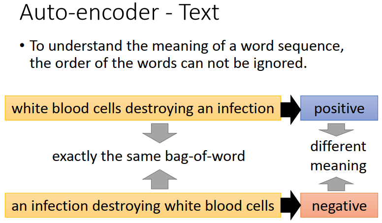

那我们之前讲过 word-to-vector ,那我们说如果我们要把一个document表示成一个vector的话，往往会用bag-of-word的方法，但当我们用 bag-of-word 这样的方法的时候，我们就会忽略掉 word order 的 information。举例来说，有一个word sequence是“white blood cells destroying an infection”，另外一个word sequence是：“an infection destroying white blood cells”，这两句话的意思完全是相反的。但是如果你用bag-of-word来描述它的话，他们的bag-of-word完全是一样的。它们里面有一摸一样的六个词汇，但是因为这个词汇的order是不一样的，所以他们的意思一个变成是positive，另外一个变成是 negative，他们的意思是很不一样的。那我们可以用sequence to sequence Auto-encoder这种做法来, 在有考虑word sequence order的情况下，把一个document变成一个vector。

##### 怎么做呢

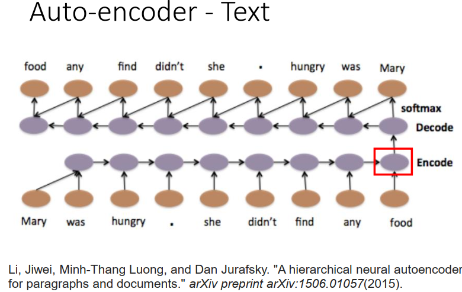

怎么做呢,我们就 input一个word sequence，"Mary was hungry,she didn't find any food",然后通过一个 Recurrent Neural Network 把它变成一个Invited vector??，然后再把这个Invited 的 vector当做这个 decoder的输入，然后让这个decoder，找回一个一模一样的句子。如果今天Recurrent Neural Network可以做到这件事情的话，那Encoding 的这个vector就代表这个input sequence里面重要的information,所以这个 decoder 才能够 根据这个 Encoding  的vector  把这个 讯号 decode 回来 。train 这个  Sequence-to-sequence Auto-encoder的时候，你是不需要label data 的，你只需要收集到大量的文章，然后直接train下去就好了。

这个 Sequence-to-sequence Auto-encoder 还有另外一个版本叫skip thought，当你用 skip thought 的时候, 如果是用Sequence-to-sequence Auto-encoder ,input 跟 output 都是同一个句子，如果你用skip thought的话，你 output 的target 会是下一个句子，如果你 用 sequence-to-sequence Auto-encoder 通常你得到的code 比较容易表达文法的意思，如果你要得到语义的意思的话，用 skip thought 可能会得到比较好的结果。

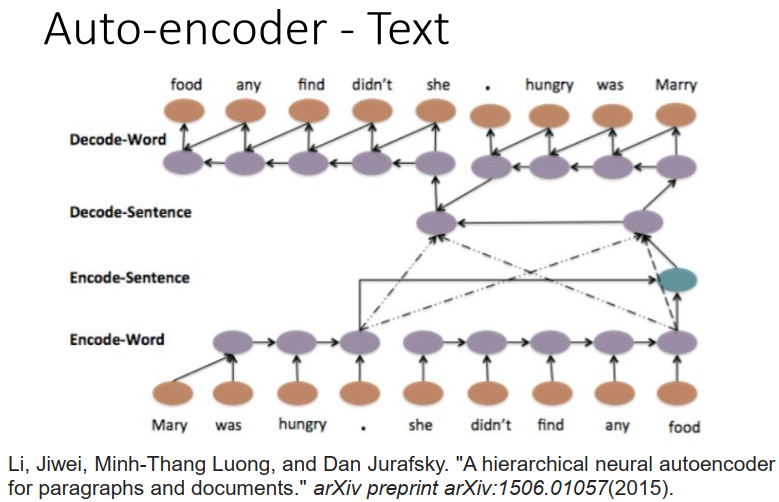

这个结构甚至可以是hierarchical,你可以每一个句子都先得到一个vector,"Mary was hungry"得到一个vector，"she didn't find any food"得到一个vector，再把这些vector加起来，然后变成一个整个 document high label 的 vector，再用这个整个document high label 的 vector去产生一串sentence 的 vector，再根据每一个sentence 的 vector再去解回word sequence。所以这是一个四层的LSTM,从word 变成sentence 的 sequence ，再变成document label 的东西，再解回sentence 的 sequence，再解回word 的 sequence.这个东西也是可以 train 的.

### Sequence-to-sequence Auto-encoder -Speech

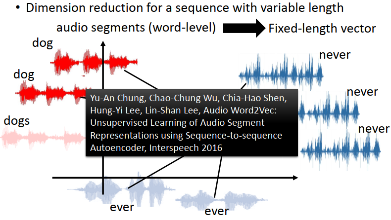

刚才的东西也可以被用在语音上，Sequence-to-sequence 的 Auto-encoder 被用在文字上,也可以用在语音上，如果在语音上的话,它可以做到的事情就是 ,它可以把一段audio 的 segment,把它变成一个fixed length 的 vector。比如说，这边有一段声音讯号，他们长长短短的都不一样，那你把他们变成vector的话，可能dog跟dogs 的vector 比较接近，可能 never和ever 的vector 是比较接近。这个我称之为audio 的 word to vector。就像一般的 word to vector,它是把 一个word变成一个vector，这边是把一段声音讯号变成一个vector。

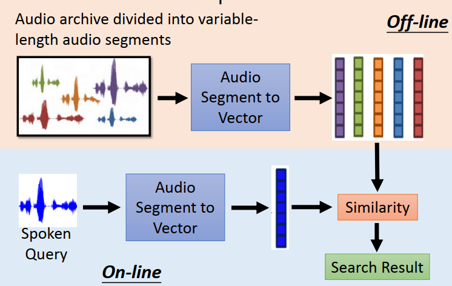

那这个东西你可以把它用在, 有什么用呢, 一开始在想这个的时候我觉得应该就没有什么用, 但是它其实可以拿来做很多事。比如说，我们可以拿来做语音的搜寻。什么是语音的搜寻呢, 你有一个声音的data base, 比如说，上课的录影录音，然后你说一句话，比如说，你今天要找跟美国白宫有关的东西，你就用说的说"美国白宫"，然后不需要做语音辨识，直接比对声音讯号的相似度，machine 就可以从data base里面把有提到 "美国白宫"的部分找出来

那这个怎么做呢,你就先把,你有一个audio 的 data base，那你把这个data base做segmentation切成一段一段的。然后每一个段用刚才讲的audio segment to vector 的这个技术，把他们通通变成vector。然后现在使用者输入一个 query，这个  query 也是语音的, 透过audio segment to vector 的技术可以把这一段声音讯号也变成vector，然后接下来计算他们的相似程度。然后就得到搜寻的结果.

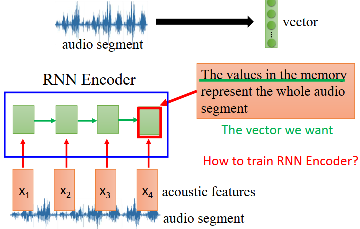

那这件事情怎么做呢, 怎么把一个audio 的 segment变成一个vector呢, 做法是这样子,先把audio  的segment抽成acoustic features Sequence，然后把它丢到Recurrent neural network里面去，那这个recurrent neural network它的角色就是一个 Encoder，然后这个recurrent neural network 它读过这个 acoustic features Sequence以后，它在最后一个时间点, 存在memory里面的值就代表了整个  input 的声音讯号它的information。那这一个,它存在 memory里面的值是一个vector。这个东西其实就是我们要拿来表示整段声音讯号的vector。

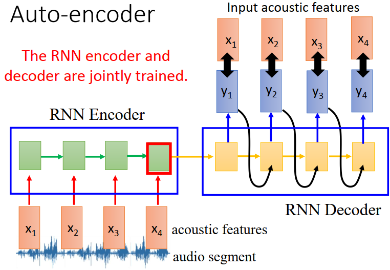

但是只有这个 RNN 的 Encoder我没有办法train，你要同时还要train一个RNN 的 Decoder， RNN Decoder 它的作用就是，它把Encoder 存在 memory里面的值，拿进来当做input，然后产生一个acoustic features sequence。然后你会希望说这个y~1~跟x~1~越接近越好。然后根据y~1~ 再产生y~2~， 再产生y~3~， 再产生y~4~。今天训练的target 就是希望y~1~  到y~4~ 跟 x~1~  到x~4~ 他们是越接近越好。那在训练的时候，这个 RNN 的 Encoder跟RNN 的 Decoder 他们是 jointly trained /一起train 的.如果只有  RNN 的 Encoder跟RNN 的 Decoder ,他们只有一个人是没有办法 train 的,但是把 他们两个接起来你就有一个target 可以一路被 从这边的 back propagate回来,你就可以同时train RNN 的 Encoder跟 Decoder

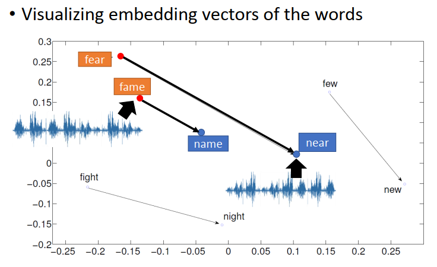

这边是我们在实验上得到一些有趣的结果，在这个图上每个点其实都是一段声音讯号，把声音讯号用刚才讲的这个 Sequence-to-sequence Auto-encoder技术把它变成平面上的一个vector。你会发现说,比如说 fear的位置在左上角，near的位置在右下角，他们中间这样的关系,fame 的位置在左上角，name的位置在右下角,他们中间有一个这样子的关系。那你会发现说, 把fear的开头f换成n，跟fame的开头 的f换成n，它们的word vector的变化方向是一样的,就好像我们之前看到的这个 vector 一样, 跟我们之前看到的文字的 word vector 一样。不过这边的这个 vector 还没有办法考虑 Semantic 语义的information, 那我们下一步要做的事情就是把语义加进去,但这个部分现在还没有完成.

## Demo: Chat-bot

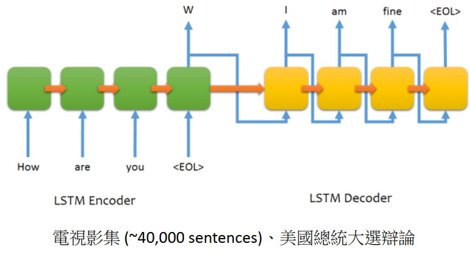

接下来我有一个demo, 这个demo 是用Sequence-to-sequence Auto-encoder来训练一个chat-bot, 所谓 chat-bot就是 聊天机器人,知道现在很流行做聊天机器人。那怎么用这种 sequence to sequence learning来train 一个 chat-bot呢. 你就收集很多的对话，比如说电影的台词，假设电影的台词里面有某一人说 “How are you”，然后另外一个人就接“I am fine”。那你就告诉machine说这个sequence to sequence learning  ,当它input是“How are you”的时候，这个model的output就要是“I am fine”。你可以收集到这种data，然后就让machine去 train。我们就收集了四万句的电视的影集 和美国总统大选 的辩论的句子，然后让machine去学这个sequence to sequence这个model。这个是跟中央大学蔡老师的团队一起开发的,然后做的同学台大这边有李同学和卢同学...(好像少一段介绍)

## Attention-based Model

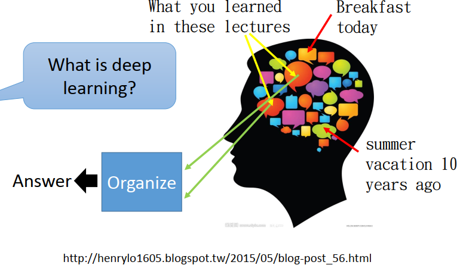

其实现在除了RNN以外，还有另外一种有用到memory的network，叫做Attention-based Model，他可以想成是RNN的一个进阶的版本。

那我们知道说，人的大脑有非常强的记忆力，所以你可以记得非常非常多的东西。比如说，你现在可能同时记得早餐吃了什么，可能同时记得10年前中二的夏天发生了什么事，可能同时记得在这几门课里面学到的东西。当然有人问你说什么是deep learning的时候，那你的脑中会去提取重要的information，然后再把这些information组织起来，产生答案。但是你的脑中会自动忽略掉那些无关的事情，比如说，10年前中二的夏天发生的事情等等。

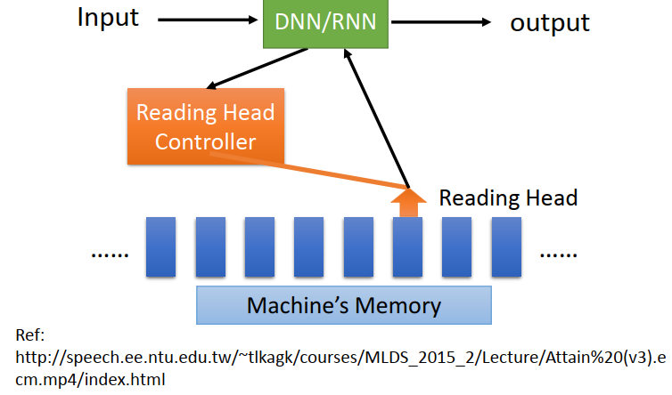

那其实machine也可以做到类似的事情，machine也可以有很大的记忆的容量。它也可以有一个很大的data base，在这个data base里面，每一个vector就代表了某种information被存在machine的记忆里面。

当你输入一个input的时候，这个input会被丢进一个中央处理器，这个中央处理器可能是一个DNN 或者是一个 RNN，那这个中央处理器会操控一个读写头,会操控一个 Reading Head Controller，这个Reading Head Controller会去决定这个reading head放的位置。然后 machine再从这个reading head 放 的位置里面去读取information出来 ，然后产生最后的output,那我们就不打算细讲这样的model ,如果你有兴趣的话,可以参考我之前上课的录影.

### Attention-based Model v2

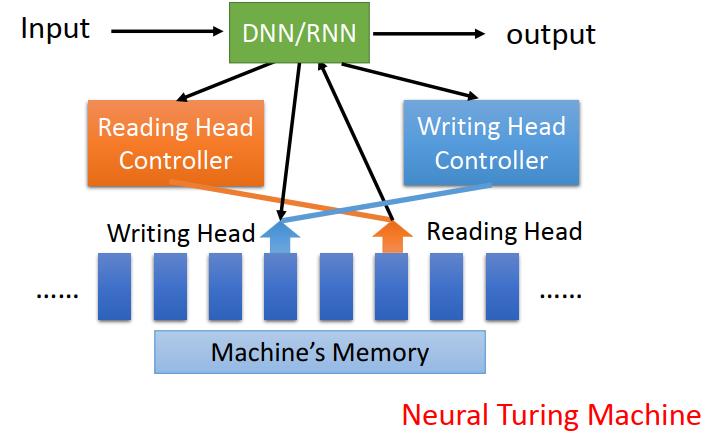

这个model还有一个2.0的版本，这个2.0的版本,它会去操控 一个writing head controller。这个writing head controller会去决定writing head 放的位置。然后machine会去把它的information透过这个writing head写进它的data base里面。所以，它不只是有读的功能，还可以把资讯它 discover出来的东西写到它的memory里面去。这个东西就是大名鼎鼎的Neural Turing Machine,这些其实都是很 新的东西.我今天  Neural Turing Machine 应该是在 14年的年底~ 15年初的时候提出来的,所以都是很新的东西.

### Reading Comprehension

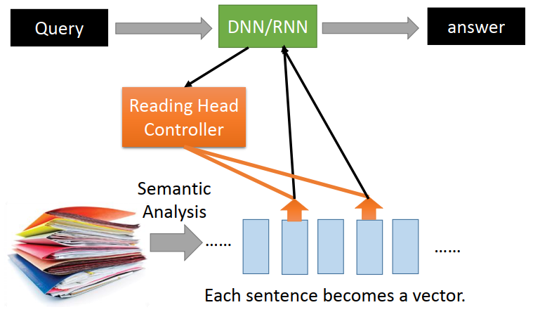

现在这样的 Attention-based Model 常常被用在Reading Comprehension里面。所谓的Reading Comprehension就是让machine 去读一堆document，然后把这些document里面的内容, 每一句话变成一个vector 。每一个vector代表了某一句话的语义 Semantic。接下来你问machine一个问题，比如说"玉赛 有多高啊"什么之类的, 然后这个问题被丢进一个中央处理器里面，那这个中央处理器去控制了一个reading head controller，去决定说现在在这个data base里面哪些句子是跟中央处理器有关的。所以假设machine发现说这个句子是跟现在的问题是有关的，它就把reading head放在这个地方，把information 读到中央处理器里面。这个读取information的过程它可以是 iterative ,它可以是重复数次,也就是说machine并不会只从一个地方读取information，它先从这里读取information以后，它还可以换一个位置从另外一个地方再去读取information。那它把所有它读到的information collect 起来，它可以给你一个最终的答案。

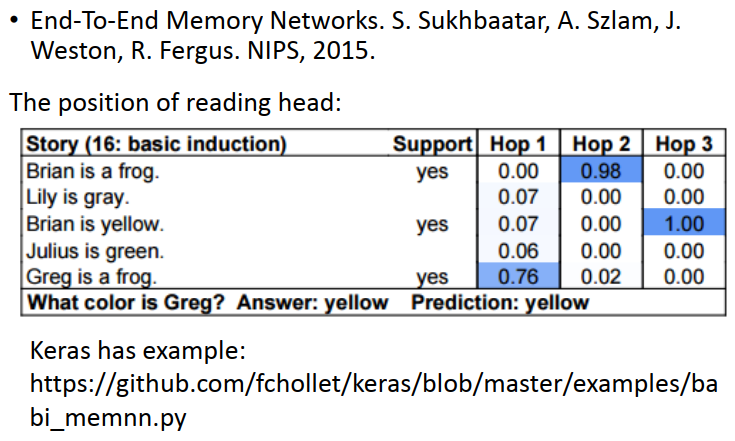

上图是Facebook AI research 在baby这个 corpus上面的一个实验结果，baby那个 corpus是一个Q&A question answer 的task ,它其实是比较简单 的一个的task 。有很多用 temporary ??(1:00:21)产生 的 document,还有一些简单的问题,我们需要回答这个问题.

我们需要做的事情就是读过这五个句子，然后问它说：what color is Greg，那他要得到正确的答案，yes。那你可以从machine attention的位置,也就是它reading head 的位置 看出machine的思路。图中蓝色代表了machine 的 reading head 放着 的位置，那这个 Hop 1，Hop 2，Hop 3代表的是时间，也就是说在第一个时间点，machine先把它的reading head放在“Greg is a frog”，所以他把这个information提取出来,他提取 “Greg is a frog” 的information。接下来他再提取“Brian is a frog” 的information ，接下来他再提取“Brian is yellow” 的 information。最后它就得到结论说,答案Greg 的颜色是yellow 这样子。那这些事情是machine自动learn出来的。也就是machine要 attention 在哪一个位置，这些是透过neural network 自己去学到知道怎么做的，也就是说并不是去写程序，告诉machine 说 你要先看这个句子，再看这个句子，再看这个句子。不是,是machine自动去决定他要看哪一个句子。

### Visual Question Answering

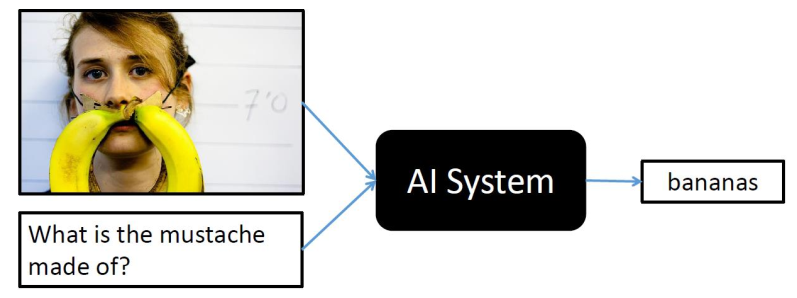

也可以做Visual 的 Question Answering，Visual 的 Question Answering 也就是 让machine看一张图，然后问他一个问题,你就问它这是什么，如果它可以正确回答是香蕉的话，他就有超越部分的人类了.

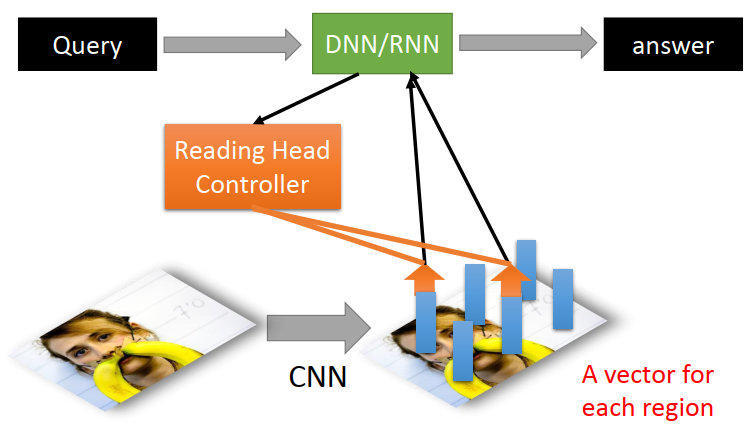

那这个Visual 的 Question Answering你怎么做呢, Visual 的 Question Answering你 就让machine看一张图，然后透过CNN你可以把这个图的每一小块region用一个vector来表示。接下来，输入一个query，然后这个query被丢到中央处理器里面，这个中央处理器去操控了reading head的  controller，这个reading head controller决定了他要读取资讯的位置, 看看说这个图片什么位置是跟现在输入的问题 是有关的,那把information读到中央处理器里面，这个读取的process可能要好几个步骤，machine会分好几次把information读到中央处理器里面，最后得到答案。

### Speech Question Answering

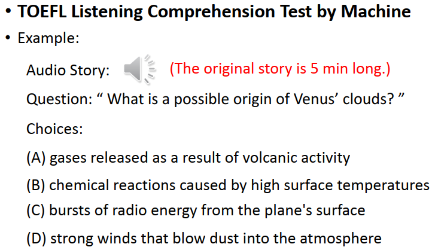

那也可以做语音的Question Answering 。比如说在语音处理实验室, 我们让machine做托福的听力测验(TOEFL Listening Comprehension Test) 。所谓托福听力测验就是让machine听一段声音，然后问它问题，然后从四个选项里面，machine要选出正确的选项。那machine做的事情跟人类考生做的事情是一模一样的。我们用来训练和测试machine 的资料就是 托福听力测验 的资料.

#### Model Architecture

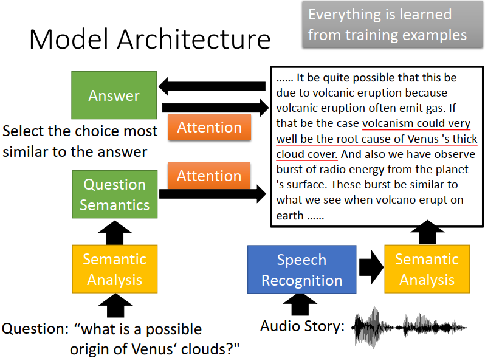

那用的Model Architecture跟我们刚才看到的其实就是大同小异。你让machine先读一下question，然后把这个question做语义的分析得到这个 question的语义，那声音的部分先用语音辨识把它转成文字，那再把这些文字做语义的分析，得到这段文字的语义。那machine了解了question的问题的语义和audio的  story 的语义以外,还可以做 attention，决定在这个audio story里面哪些部分是和回答问题有关的。那这个就好像是画重点一样，machine根据他画的重点产生答案，那它甚至也可以回头过去修正它产生出来的答案。经过几个process以后，最后machine得到他的答案, 他把他的答案跟其他选项计算相似度，然后看哪一个选项的相似度最高，它就选那一个选项。那这整个task就是一个大的neural network。除了语音辨识以外,这个 question semantic部分还有audio story semantic 的部分都是neural network，所以他们就是 jointly train ,你就只要给 machine 托福训练听力的考古题,然后 machine 就自己会去学了.

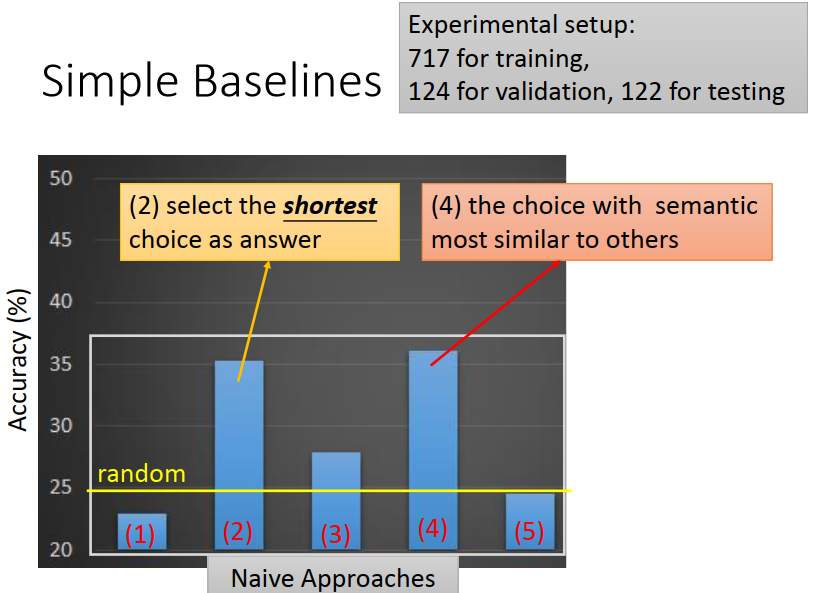

这个底下是一些实验结果，这个实验结果是这样的,你要random猜, 正确率是25 %。那你会发现说,有两个方法是远比25 %强的。这个是很重要的information

这边这五个方法都是naive的方法，也就是完全不管文章的内容，就直接看问题跟选项就猜答案。然后我们发现说，如果你选最短的那个选项，你就可以得到35 % 的正确率,所以这个是计中计,你可能会觉得应该要选最长的,但是其实要选最短的。还有另外一个是这样,如果你分析四个选项的semantic，你做那个 sequence-to-sequence auto encoder，去把每一个选项的semantic找出来，然后你再去看说某一个选项和另外三个选项语义上的相似度，你会发现说,如果某一个选项和另外三个选项的语义相似度比较高的话，那然后你就把他选出来,那你就有35 % 的正确率。这和你的直觉是相反的，我们直觉通常会觉得说 我们应该选一个选项,他的语义和另外三个选项是不像的，但是人家早就计算到你会这么做了，所以这是计中计，如果你要选某一个选项他的语义 跟另外三个选项最像的话 ,你反而可以得到超过 random 的答案，如果你今天是选最不像的,语义最不像的那个选项，你得到的答案就会接近random ，他都是设计好的。这个都是一些  trivial 的方法,

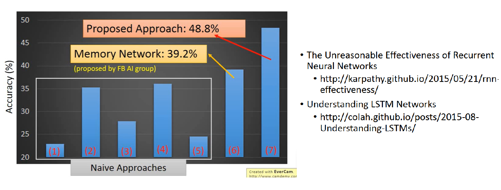

你可以用 一些 machine learning 的方法,比如说用 memory network, memory network 可以得到39.2 %正确率，是比随机动一下还要好一些,  如果用我们刚才讲的那个model的话，我们现在有语音辨识错误的情况下,最好可以做到将近 50 % 的正确率。其实 50 % 的正确率 是没有很高,我觉得这样应该是去不了美国学校的,但是就是 两题可以答对一题,如果你没办法 两题答对一题 的话,你其实就没有machine 强.,以下是一些 reference 给 大家参考.

## RNN v.s. Structure learning

最后我这边其实有一个问题,我们讲了 deep learning,也讲了  structure learning,他们中间有什么样的关系呢,你想想看,我们上周讲了 HMM，讲了CRF,讲了 structure  Perceptron, 和structure   SVM,他们可以做的事情,是比如说做 POS tagging, input 一个 sequence ,output 另外一个 sequence.

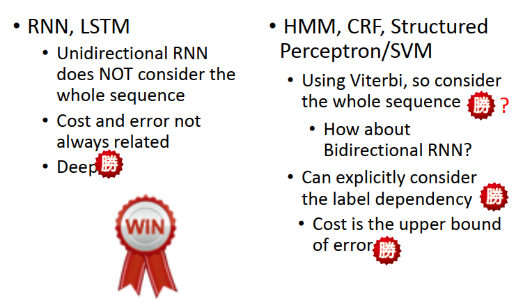

RNN,LSTM 也可以做到一样 的事情,当我们使用deep learning 的技术跟使用 structure learning的技术有什么不同呢, 首先假如我们现在用的是unidirectional 的 RNN或 LSTM，当你在make decision的时候，你只看了sentence的一半，而如果你是用structure learning的话，透过 Viterbi  的algorithm 你考虑的是整个句子,如果你是用 Viterbi algorithm 的话, machine会读过整个句子以后,才下决定 。所以从这个角度来看，也许HMM，CRF, structure SVM等等还是有占到一些优势的。但是这个优势并没有很明显，因为RNN ,LSTM等等 ,他们可以做Bidirectional ，所以他们也有办法考虑一整个句子的information.

那在HMM, CRF里面，你可以很 explicitly的去考虑 你的label 和label 之间的关系. 什么意思呢,举例来说，你今天在做inference的时候，你在用Viterbi algorithm求解的时候,假设 你可以直接把你要的constrain 就下到那个 Viterbi  的algorithm 里面去,你了解我的意思吗,你可以直接说我希望每一个label出现的时候都要连续出现五次,这件事情你可以轻易用 Viterbi  algorithm 做到，因为可以修改 Viterbi algorithm,让 machine 在选择分数最高的句子 的时候，排除掉不符合你要的 constrain 的那些结果，

但是如果是LSTM或 RNN 的话，你要直接下一个constraint进去是比较难的，你没办法要求 RNN说你一定要连续吐出某一个label五次才是正确的,你可以在training data里面给他看这种training data,但你叫他去学,但是这样是比较麻烦的, Viterbi 可以直接告诉你的machine 要他做什么事,所以在这点上，structured learning似乎是有一些优势的。

如果是RNN和 LSTM，你的cost function跟你实际上最后要考虑的error往往是没有关系的，想想看,当你在做RNN ,LSTM的时候，你在考虑的cost是,比如说每一个时间点的cross entropy, 每一个时间点你的RNN的output 的reference?? 的 cross entropy，它跟你的error 往往不见得是直接相关的, 因为你的 error 可能是比如说两个 sequence 之间的 id distance 。但是如果你是用structure learning的话，structure learning 的cost会是你的error 的一个 upper bound，所以从这个角度来看，structured learning也是有一些优势的。

但是最后最重要的，RNN,LSTM可以是deep 的，而 HMM,CRF, structure  Perceptron, 它们其实也可以是deep，但是它们拿来做deep learning 其实比较困难。在我们上一堂课讲的内容里面。它们都是linear 的,为什么他们是 linear 的 ，因为我们定的那个 evaluation 的 function 是linear  的。如果他们不是linear 的话你会很麻烦,你在training 的时候会有很多麻烦，所以他们是linear 的我们才能够套用我们在上一堂课教的那些方法来做inference 跟 training 。

在这个比较上,,deep learning 会占到很大的优势, 最后整体说起来呢，其实如果你要得到一些 state of the art 的结果, 那这种 sequence Language task 上得到  state of the art 的结果, RNN ,LSTM 是不可获缺的,所以整体说来, RNN ,LSTM 在这种 sequence Language的 task 上面的表现其实 会是比较好的.deep 这一件事情是比较强的,他非常的重要,如果你今天用的只是linear 的model，如果你的model是 linear 的,你的 function space就这么大，就算你可以直接 minimize 一个error 的 upper bound,那又怎样，因为所有的function 都是坏的，所以相比之下，deep learning 可以占到很大的优势。

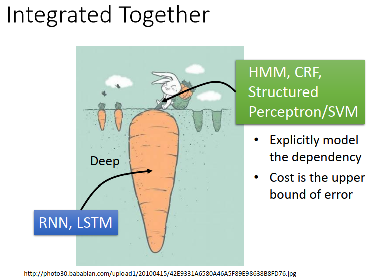

但是其实 deep learning 跟 structured learning 他们是可以被结合起来。而且有非常非常多的先例,有很多成功的结合的先例, 你可以说我 第一步,就是 我 input 这个 feature 先通过RNN跟 LSTM，然后先通过RNN,LSTM ,RNN,LSTM 的output再做为HMM,CRF, structure  SVM 等等的input。你用RNN, LSTM的output来定义HMM,CRF, structure  SVM 的evaluation 的 function，如此你就可以同时又享有deep 的好处，同时又享有structure learning的好处。最后你这边有deep,这边有 structure  ,这两个是可以 jointly 一起learn 的.你可以想想看,这个 CRF 可以用  gradient descent train ,其实  structure  SVM我们好像没有讲,但是  他也可以用  gradient descent train ,所以你可以把 deep learning 的部分和structure learning jointly 合起来,一起用 gradient descent 来做training ,

### Speech Recognition

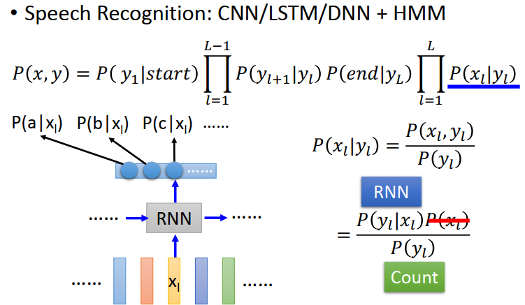

在语音上，我们常常会把deep learning 和structure learning 合起来,你可以常常见到的组合是 deep learning 的 model CNN/LSTM/DNN + HMM 的组合 ，所以做语音的常常说我们把过去我们所做的东西通通都丢掉了,其实不是的, HMM往往都还在，如果你要得到 最 state of the art 的结果现在还是用这样hybrid system 得到的结果 往往是最好的。

这个 hybrid system 怎么work呢, 我们说在HMM里面，我们必须要去计算x跟y 的join probability，或者是在structured learning里面，我们要计算x跟 y的evaluation function，在语音辨识里面，x是声音讯号，y是语音辨识的结果。 在HMM里面，我们有transition的部分, 我们有 emission的部分，DNN做的事情其实就是去取代了emission的部分，原来在HMM里面,这个 emission 就是简单的统计,就是统计一个Gaussian mixture model，但是把它换成DNN以后，你会得到很好的performance。 怎么换呢,一般 RNN 他可以给我们的output 是input 一个 acoustic feature,他告诉你说这个 acoustic feature 属于哪一个 state 的 几率 ,那你可能想这跟我们要的东西不一样啊,我们要的是 P(x∣y),这边给我们的是 P(y|x),

怎么办呢,做一下转换,RNN 可以给我们  P(x∣y),然后你就可以把它再一次分解成 $P(x_l,y_l) /P(y_l)$,再把它分解成$P(y_l|x_l)P(x_l)/P(y_l)$,那前面这个  P(y|x) 他可以从RNN 来，P(y~l~) 你就直接count,你就直接从你的 corpus 里面统计 P(y~l~)  的出现的几率，这个 P(x~l~) 你可以直接无视他，为什么P(x~l~) 可以直接无视他呢,你想想看,最后你得到这个几率的时候，在 inference  的时候 x~l~ 是 input,是声音讯号,是已知的，你是穷举所有的y~l~,看哪一个 y~l~可以 让P(y~l~) 最大，所以跟 x有关的项最后不会影响inference的结果，所以我们不需要把x考虑进来。

那其实加上HMM在语音辨识里是蛮有帮助，就算是你用RNN，你在做辨识的时候，常常会遇到一个问题，假设我们是一个frame，一个一个frame丢到 RNN ,然后问他说 这个frame属于哪一个form，他往往会产生一些怪怪的结果，比如说因为一个form 往往是蔓延好多个frame，所以本来理论上你应该会看到说第一个frame是A，第二个frame是A，第三个是A，第四个是A，第五个是A,然后接下来换成BBB，但是如果你用RNN在做的时候，你知道RNN他每个产生的label他都是 independent 的，所以他可能会突然发狂 ,在这个地方就突然若无其事的改成B，然后又改回来A，你会发现它很容易出现这个现象。然后如果今天这是一个比赛的话,你就会有人发现说,RNN有点弱,他会发生这种现象,如果手动,只要,比如说只要某一个output 前后不一样,我就手动 把它改掉,然后你就可以得到 2% 的进步, 那你可以吊打其他同学, 那如果你加上 HMM 的话, 就不会有这个情形, HMM 会帮你把这种状况自动就把它修掉。所以加上 ,HMM 其实是蛮有帮助的, 对RNN 来说,因为 它 在 training 的时候它是一个一个 frame 分开考虑的，所以其实今天假如这个不同的错误对语音辨识的结果影响很大，但是RNN不知道 ,如果我们今天把这个B改成错 在这个地方, 对最后语音辨识的错误的 影响其实就很小,但是RNN不知道这件事情， 所以对他来说，在这边犯一个错误 和 这边犯一个错误 是一样的,但是 RNN 认不出这件事情来,你要让RNN 可以learn　出这件事情,你需要加上一些 structured learning 的概念,才能够做到

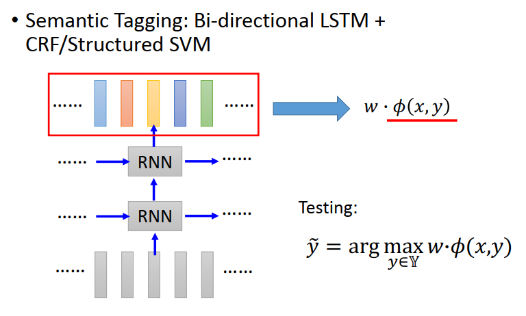

那在做 slot filling 的时候,现在也很流行用 Bi-directional 的 LSTM 再加上 CRF ,或者是structure 的 SVM ,也就是说先用 Bi-directional 的 LSTM抽出feature，再拿这些feature来定义 CRF或者Structured SVM 里面我们需要用到的 feature, CRF, SVM 都是 linear 的model，你只要先抽一个 feature ϕ(x,y),然后 learn 一个 weight w，这个ϕ(x,y)的feature，你不要直接从 raw  的feature来,直接从  Bidirectional 的 RNN 的output ,可以得到比较好的结果。

### is structured learning practical?

那有人会说structured learning到底是否 是 practical 的,你知道structured learning 你需要解三个问题，那其中inference  那一个问题往往是很困难的，你想想看, inference  那个问题 你要ARG ,你要穷举所有的y,看哪一个 y 可以让你的值最大，你要解一个optimization的 problem，那这个optimization的 problem并不是所有的状况 都有好的解 , 应该说大部分的状况都没有好的solution ，sequence labeling 是少数有好的 solution 的状况，但其他状况都没有什么好的 solution 。所以好像会让人觉得说structured learning它的用途并没有那么广泛，但是实际上未来未必是这个样子的。

实事上你想想看,我们之前讲过的GAN,我认为 GAN就是一种structured learning，如果你把discriminator看做是evaluation function, 就是我们之前讲的在 structured learning里面 你有一个 problem 1,你要找出一个  evaluation function, 如果这个 discriminator 就可以把它看作是 evaluation function,所以我们就知道 problem 1怎么做. 

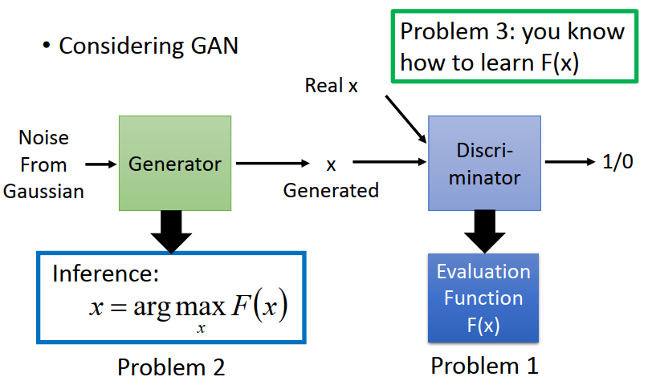

那最困难 的 problem 2 要解一个inference的问题，我们要穷举所有我们未知的东西，看看谁可以让我们的evaluation function最大。这步往往很困难，因为x的可能性太多了,未知的东西的可能性太多了。但实事上这个东西它可以就是generator，我们可以想成generator 它不是就是给 一个noise，给一个从 Gaussian 里面 sample 出来的noise, 他就output一个x , 他就output一个object 出来，它output的这个 object ，不是就是可以让discriminator分辨不出来的 那个 object 吗，如果discriminator就是evaluation function的话，它output的那个 object  就是可以让evaluation function的值很大的那一个object ，所以这个generator它其实就是在解这个问题，这个generator的output其实 就是这个 argmax的output ，所以你可以把generator当做在是在解inference 的这个问题，那 problem 3呢,problem 3你已经知道了, 我们怎么train GAN , 就是 problem 3 的 solution. 实事上 GAN 的training 它跟 structure SVM，那些方法的training,你不觉得也是有异曲同工之妙吗 , 大家还记得  structure SVM 是怎么train 的吗,  在structure SVM 的training 里面, 我们每次找出最competitive 的那些example,然后我们希望正确的 example 它的 evaluation 的function  的分数大过 competitive example,然后update 我们的model , 然后再重新选 competitive 的 example, 然后再让正确的 大过competitive  ,就这样 iterative 的去做.

你不觉得GAN也是在做一样的事情吗,GAN 的training 是我们有正确的example,就是这边的x, 它应该要让  evaluation function 就是 discriminator  的值大,然后我们每一次用这个 generator,generate 出最 competitive 的那些x ,就是可以让 discriminator 的值最大的那些 x ,然后再去 train discriminator, discriminator 要分辨正确的 real 的跟 generative 的, 也就是discriminator  要给 real 的 example 比较大的 值,给那些 most competitive  的 x 比较小的值,所以然后这个 process 就不断 的 iterative  的进行下去,你会 update 你的 discriminator , 然后 update 你的generator,  然后再 update 你的 discriminator , 其实这个跟  structure SVM 的training 其实是有异曲同工之妙的。

那你可能会想说在GAN 里面,我们之前在讲  structure SVM  的时候,都是有一个input,有一个 output,有一个x,有一个 y,我们之前讲的GAN 只有x,听起来好像不太像,那我们就另外讲一个像的给你听看看 .

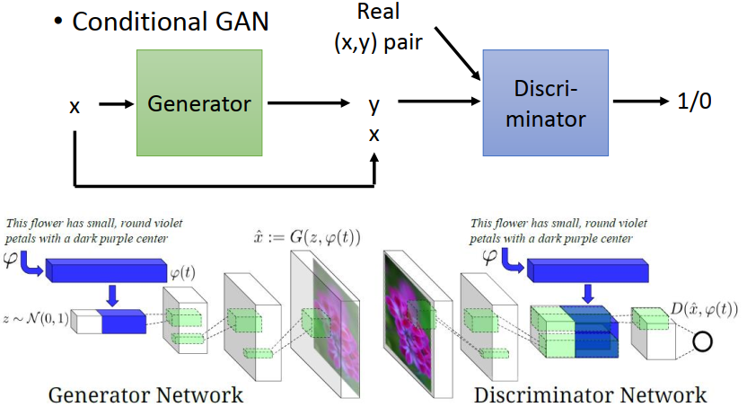

其实GAN也可以是conditional的GAN，什么是conditional的GAN 呢,我今天 的 example 都是 x,y 的 pair, 我要解的任务是 given x，找出最有可能的y，比如说它可以就想成是做语音辨识，x是声音讯号，y是辨识出来的文字，那如果是用conditional GAN 的概念，怎么做呢, 你的  generator input 一个x，它就会output一个y，discriminator它是去 check 一个 x,y的pair是不是对的，如果我们给他一个真正的x，y的pair，他会给他比较高的分数，你给它一个generator output 出来的 y配上他的 input x，所产生的一个假的x,y  的pair，它会给他比较低的分数。training 的 process 就和原来的GAN 是一样的，这个东西已经被成功运用在用文字产生image这个task上面。在用文字产生image这个task,  就是你跟machine 说一句话说 "有一只蓝色的鸟" , 他就画一张蓝色的鸟的图片,

那这个task 你的input x 就是一句话，output  y 就是一张image，generator做的事情就是给他一句话，在这边,什么 " This flower..", 给他一句话然后他就产生一张image，那 discriminator 做的事情就是discriminator  给看他一张image 跟一句话，它要判断说这个x，y的pair ,这个 image 和  sentence pair ,他们真的 还是不是真的，那如果你把 discriminator换成 就是evaluation function，把generator换成就是解inference的 那些 problem，其实conditional GAN和structured learning 他们是可以类比的,或者是你可以说GAN就是train structured learning model的一种方法。

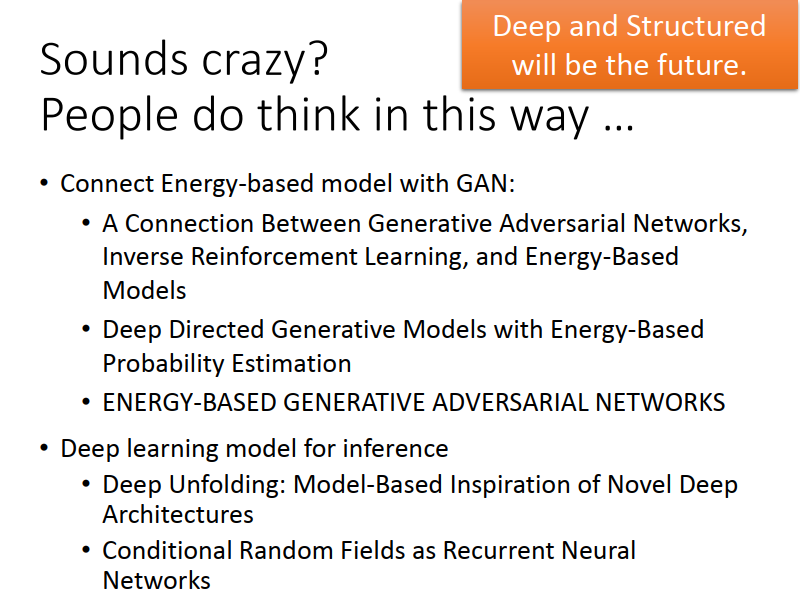

你可能觉得 这听起来,或许理论里面你没有听的太懂,这就算了,你可能觉得这可能是我们随便讲讲的,但是我就想说其他人也一定就想到了,所以我就 Google 了一下其他人 的propagation,果然其实很多很多人都有类似的想法，这个 GAN可以和Energy—based model 做connection 。 GAN可以被视为 train Energy—based model的一种方法,所谓 Energy—based model ,其实我们之前有讲过,它就是 structured learning 的  可以说是另外一种称呼, 是 Yann LeCun 提出来的, 这边有一系列的paper 在讲这件事,

那你可能觉得说把 generator 视作事在做 inference 这件事情是在解这个argmax 那个 problem 听起来感觉很荒谬,其实也有人就是这么想, 也有人想说,这边也列一些Reference给大家参考.也有人觉得说一个  neural network 它有可能就是在做解 argmax 这个 problem,所以也许 deep& structured 就是未来一个研究的重点 的方向.

那说到   deep& structured ,其实我就想到我的另外一门课,就是 " Machine learning and having it deep  and structured "因为有同学即兴问我一些问题,有关下学期开课的问题,或许可以在这边一次性回答....

