[TOC]

# P 38 27: Ensemble<!-- 100' -->

## Framework of Ensemble  

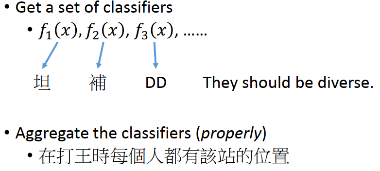

Ensemble的这种方法其实就是团队合作，好几个模型一起上的方法。那在做 Ensemble 的时候,通常的状况是这样,你有一打的classifier，假设你现在做的是分类的问题,你手上有一打的classifier，f~1~(x), f~2~(x) ,f~3~(x),....那你想把这一打的 classifier 集合起来 让他们发挥原来一个 classifier所没有办法发挥的更强大的力量，这些classifier 通常你会希望他们 是diverse的，每一个classifier 他们有不同的属性,他们有不同的作用。就好像说如果今天大家一起出团去打王的时候，每一个人都有自己需要做的工作，你会需要一个团队里面,有各种不同的角色,要有人扮演坦，有人扮演补，有人扮演DD（输出）.DD不知道大家知不知道是什么,DD就是输出的意思,

然后你要把不同的classifier, 把他 aggregate 在一起,把它集合在一起, 这个集合的时候你需要用比较好的方法来把他们集合在一起，这样就好像是在打王的时候坦补和DD他们有不同的应该要站的位置，那这个ensemble就最适合在期末的时候讲,  为什么呢,因为假设你现在已经开始做final,我相信你其实很累了,你可能没有什么太多的时间为final 的 project 写什么太分级的大的新的程式, 也许你想要call一下你手上现有的程式, 然后调调参数看有做到多好,那其实有一个大招,可以让你迅速的improve 你的 performance,就是 ensemble,如果你今天已经想不到新招术了,就是你现在做一做已经卡住了,不知道怎么进步的话,通常用 ensemble 可以让你的 performance 再提升一个 level,所以你会发现说在比那个 machine learning 的比赛的时候,比如在 kaggle 上的 比赛的时候.就是你有一个好的模型,你可以拿到前几名,但你要夺得冠军,你通常都会需要 ensemble,都会需要用群殴的方式才能够得到冠军,所以我们今天就是要讲一下,怎么来做这个群殴.

## ensemble : Bagging 

群殴的方式,其实有几种不同的方法,那我们先讲 Bagging 这个方法,那要注意一下,就是我们等一下会讲,我们除了会讲 bagging 以外,我们还会讲 boosting,那bagging 和 boosting 他们使用的场合是不太一样的,那这个 大家要特别注意一下,

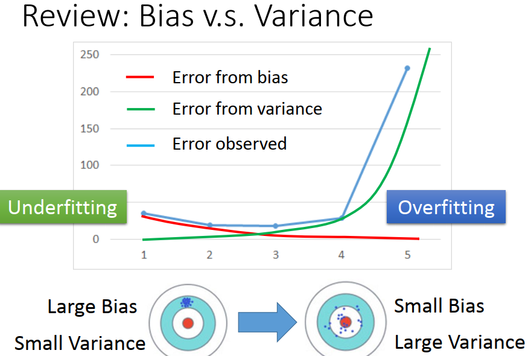

那我们再复习一下我们过去在开学就已经讲过的东西,我们在开学的时候讲过说我们在做machine learning 的时候有 bias和variance 的 trade-off,如果我们今天有一个很简单的model，我们会有很大的bias但比较小的variance，如果我们有一个复杂的model，可能是小的bias但是大的variance。从上图上看，在这两者的组合下，我们会看到我们的error rate ,随着model 的复杂度增加，逐渐下降然后再逐渐上升。

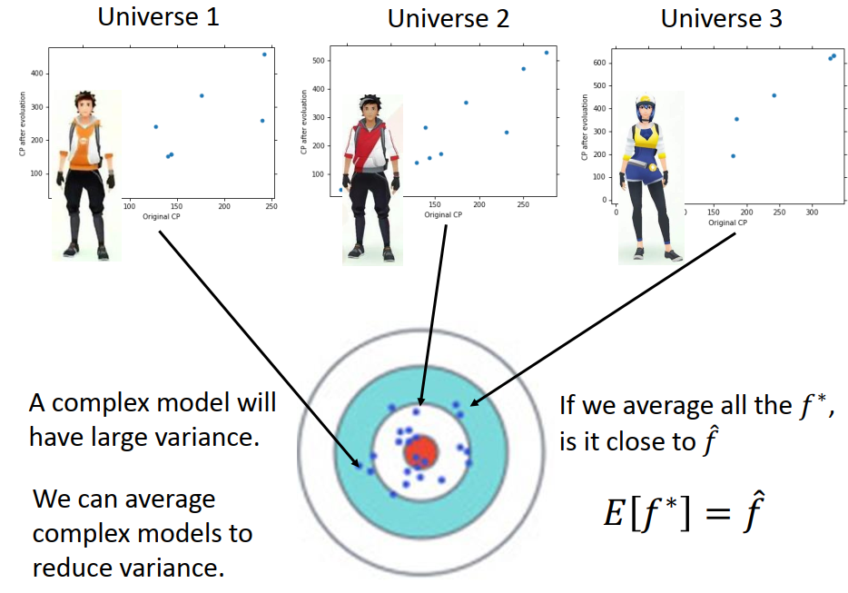

那我们之前也有举过说假设现在在不同的世界里面我们都在抓宝可梦,那在不同的世界里面我们都会得到一个模型，假设我们现在用的是一个很复杂的模型,那我们会有很大的variance,也就是在不同的世界里面,我们所预测出来的,可以预测宝可梦CP值的模型会非常的不一样。但是这些模型的结果variance虽然很大，但是他们 的 bias是小的，所以我们可以把不同的模型通通集合起来，我们可以把不同的模型的输出做一个平均，得到一个新的模型$\hat{f}$，这个新的模型 $\hat{f}$可能就会跟正确的答案是接近的。那Bagging其实就是要体现这件事情。 

Bagging要做的事情就是,虽然我们不可能真的到不同宇宙去搜集data,但是我们可以自己创造出不同的dataset，再用不同的dataset 各自去训练一个复杂的model，虽然每一个model 独自拿出来看他可能 variance很大，但是我们把不同的variance很 大的model 集合起来以后，他的 variance 就不会那么大，但是他的 bias 会是小的。

怎么自己制造不同的data呢,假设你现在有N笔training data.那你对这N笔training data做 Sampling,你从N个 N笔 training data里面每次取N‘ 笔data组成一个新的dataset，那你通常在做sample 的时候你会做replacement ,也就是你抽出一笔data以后,你会再把它放到你的 pool 里面去,那所以这边通常N' 你可以就设成N,但是虽然你把 N' 设成N,你从 N这个dataset 里面,做N次的sample with replacement,得到的这个 dataset跟原来的这N笔data 并不会是一样的,对不对,因为你可能会反复抽到同一个example,

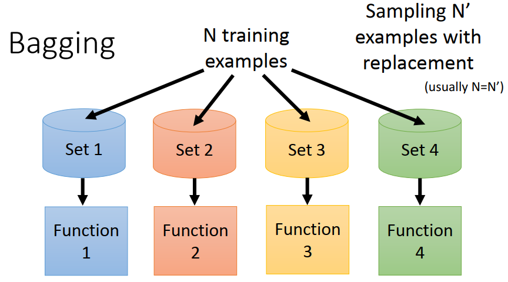

总之呢,我们就用sample 的方法建出好几个dataset,每一个dataset都有N'笔data，那每一个dataset里面的data 都是不一样的，接下来你再用一个复杂的模型去对这四个dataset都去做learning, 那你就找出了四个function，接下来在testing的时候，你就 把一笔 testing data丢到这四个function里面，那你再把你得出来的结果做平均（回归）或者是做voting（分类），那通常就会比只有call一个function 的时候performance 还要好，performance 还要好 是指说 你的 variance 会比较小, 所以你得到的结果会是比较 robust 的,比较不容易over fitting。那如果今天你做的是 regression 的方法 的时候,你可能会用Average 的方法来把四个不同的function 的结果组合起来.如果今天是分类的问题的话,你可能会用voting的方法来把这四个结果组合起来.就看说这个4个function里面哪一个类别有最多classifier 投票给他,那你就选那一个class 当作你的model的output.

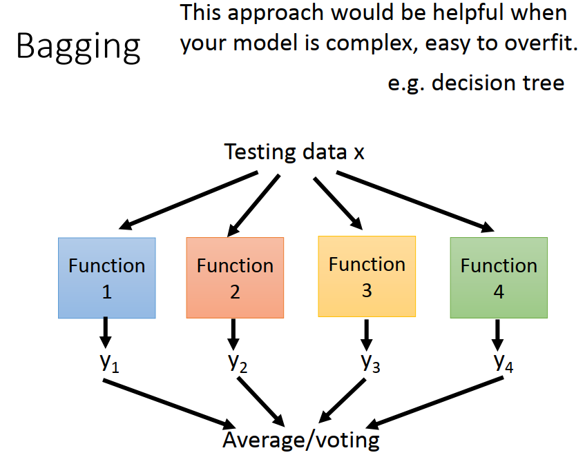

那要注意一下,什么时候做Bagging, 当你的model 很复杂的时候，你担心他over fitting 的时候,你才做bagging,了解我的意思吗,做bagging 的目的是为了要减低 variance,就是你的model 的bias已经很小了 但是 variance 很大,你想要减低 variance 的时候,你才做bagging,所以适用做 bagging 的情况是,你的model 本身已经很复杂,在你的 training data上很容易就over fit 这个时候你会想要用 bagging。什么样的model 很容易 over fit呢,有人会说NN很容易 over fit,没有其实NN没有那么容易over fit,相较于看你跟谁比,很多人就凭着直觉说,一个neural network 看起来参数那么多,应该就是很容易over fit吧,那如果你今天有实作过 neural network 的话,我想你其实是不会这么想的,做neural network 的时候.你常常遇到的问题是,你没办法在training set上over fit.而不是你非常容易 over fit.什么样的model 非常容易 over fit呢,举例来说,Decision Tree 就是一个非常容易over fit 的方法,所以 Decision Tree 你只要想的话,你把那个树长的很深,他在 training data上,只要树够深,你都可以拿到 100% 的正确率.NN你很难拿到 100% 的正确率.你要拿到100% 的正确率就是在MNIST 上要好好调参数,才能拿到100% 的正确率. 但是像 Decision Tree这种方法,只要他想,他可以拿到100%  的正确率.但是在training data上拿到 100% 的正确率没有什么,不见得有什么特别厉害的地方,其实就只是over fitting 而已.

所以今天你什么时候你要做bagging,就是 model很容易over fitting 的时候要做 bagging.所以 Decision Tree 很需要做bagging. random forest 就是 Decision Tree 做bagging 的版本,就是 random forest.那我们没有讲过 Decision Tree.其实我觉得也不见得需要讲,因为我知道你们每个人都知道 Decision Tree 对不对.我看大家在作业里面很多人都已经用到 Decision Tree都用的很爽,所以这个就好像是不太需要讲的.我们就秒讲过去.

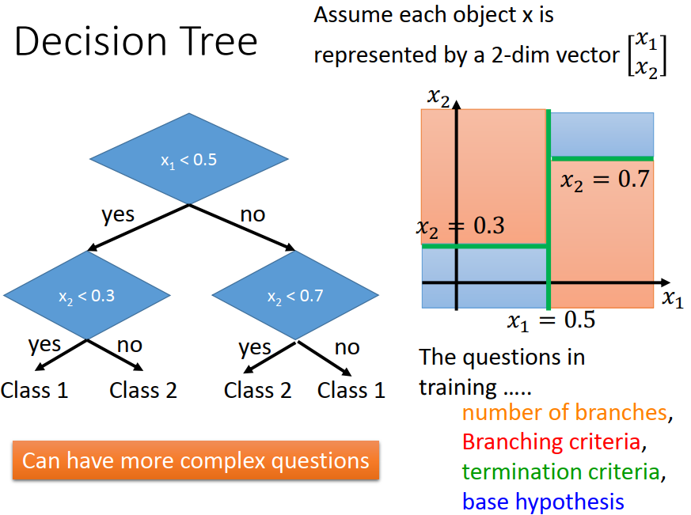

我们现在假设我们每一个object 他有两个 feature x~1~跟 x~2~,Decision tree 就是你根据你的 training data去 建出一颗树，这个树是这样子,这颗树告诉我们说, 如果输入的object x ,x~1~小于0.5 的话就是yes（往左边走），大于0.5就是no（往右边走），所以就是在x~1~ = 0.5 的地方切一刀, 以左的 就走到左边这条路上去. 往右就走到右边这条路上去. 接下来看 x~2~, x~2~小于0.3的时侯就说是class 1（对应坐标轴图中左下角的蓝色）,涂蓝色.  x~2~ 大于0.3 的时候就说是class 2就涂红色 ；那如果在右边.右边如果  x~2~小于0.7 的时侯就涂红色， x~2~ 大于0.7 的时候就涂蓝色。

那这边这个 ,Decision tree 上边问的问题是比较简单的 ，他只看 一个 dimension,你其实可以同时看两个dimension，你其实可以问更复杂的问题. 要问什么问题是人自己决定的. 所以做Decision tree 的时侯会有很多你需要注意的地方. 举例来说你可能会需要考虑说, 比如说在每个节点我要做多少分支，那我要用什么样的criterion  来做分支，我要什么时候停止分支，我有我的可以问的问题的集合里面 有哪些问题等等 . 有一大堆的,也是有很多的参数要调,跟NN一样，有一些东西是你需要调整的

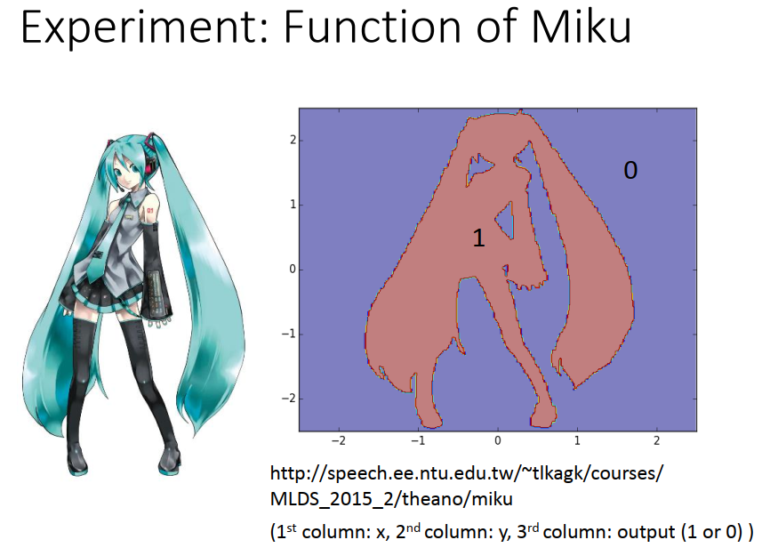

那我们就来举一个  Decision tree  的例子,我们把 Decision tree  实作在以下这个 task上面.这个 task叫做 初音task.这个task是这样子的.我们有一个 分类的问题,这个分类的问题是说这个 输入的 feature 就是二维，在这个红色的部分是属于class 1的，在蓝色的部分是属于另外一个class ,class 2，那这个 class 1分布的样子正好就跟 初音 是一样的。如果你要用这个data的话,我放在这边,你可以 载这个data来用. 这个是一个 初音的task. 一般教科书都会用什么方形啊,圈圈啊,那个都太弱了,我这个要用初音的task,  就是 class 1  的分布就跟初音一样.那现在 Decision tree 能不能够在这个 task 里面 把class 1和 class 2 正确的进行 分类呢,我们来看一下结果.

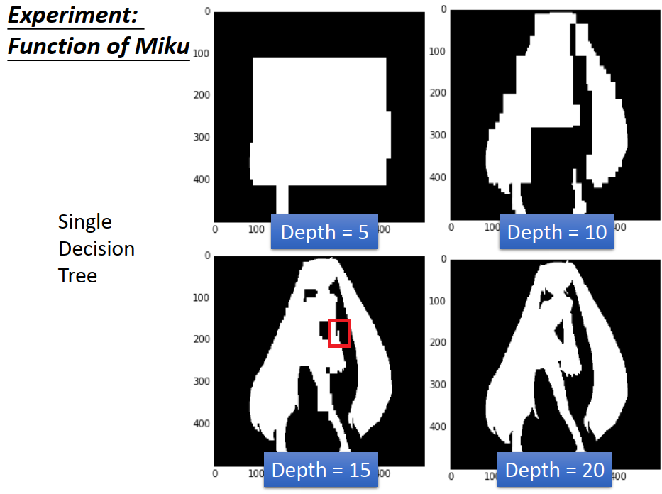

 现在我们用一颗 Decision Tree. 那这个 Decision Tree的深度是5, 他没有办法把 class 1 和class 2 分开.他只能框说这个一个方块的地方就是 class 1 . 如果更深的  Decision Tree呢,如果 是 Decision Tree的深度深达10的话, 看起来就有点初音的样子了，不过他有很明显的锯齿状,看起来像是在Minecraft 的世界里面看到的初音. 那如果 depth 是15的话，那就看起来更好了, 这个样子看起来就蛮对的,但是有一些 地方还是有点怪怪的,比如这里,这边 凸起来一块. 如果今天 Decision Tree 的深度是20的话，那你就可以完美的把class 1的位置跟 class 2的位置区别开来，就可以完美地把初音的样子勾勒出来。

这个其实没有什么,就是 Decision Tree 只要你想的话你永远可以做到 error rate 是0,你永远可以做到正确率是 100.因为你想想看,最极端的case就是你这个 tree 一直长下去,每一笔 data point 就是一个很深的树的其中一个节点的其中一个leaf,其中一片叶子.那这样你的正确率就一定是 100% .所以这个没有什么,树够深,Decision Tree 可以做出任何 function. 

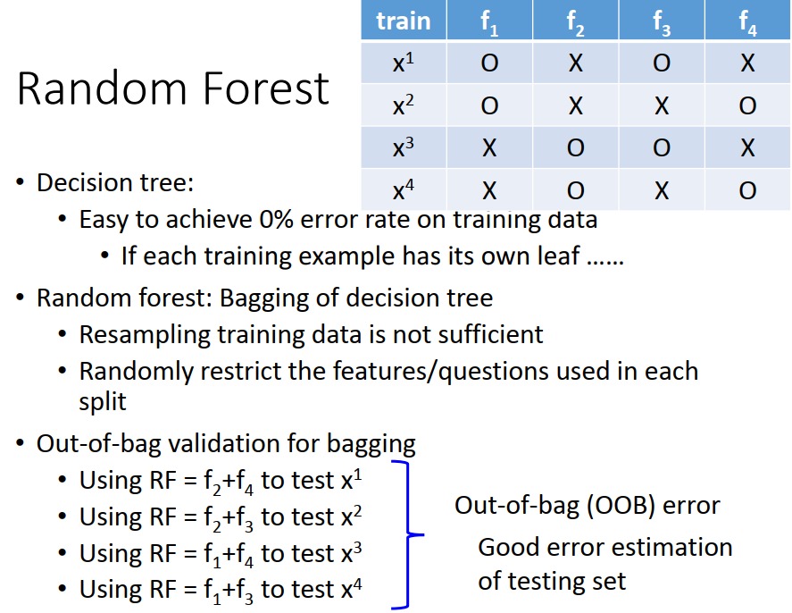

但是就是因为 Decision Tree 他太 容易 over fitting ，所以你单用一颗 Decision Tree 你往往不见得可以达到好的结果。所以我们要对决策树做Bagging, 这个方法就是 Random Forest. 那我们可以用 传统的  Bagging 的方法 来做 Random Forest, 你可以用传统的刚才讲的那个 sample 的方法来做 bagging, 但是如果用那种方法 你得到的Tree 通常每一棵都没有差太多,所以用光用 sample 的方法 看起来是不太够 。

在做 Random Forest的 时候 比较 typical 的方法是在每一次要产生Decision Tree 的breanch 的时候.都random 的决定哪一些feature 或哪一些问题是不能用的，你random 的决定说现在要做 split 的时候哪些 question或哪些feature 不能用,就算是你用的是一模一样的dataset，每一次你产生的Decision Tree也会是不一样的，最后你再把所有 Decision Tree 的结果通通集合起来，那你就得到 Random Forest。 

那如果你今天是用Bagging的方法的话，有一个叫做 out-of-bag 的方法可以帮你做validation 。一般我们在做 validation  的时候你都是把你手上原来有label 的 data切成两块. training set和validation set，如果你今天是用bagging 的方法的话你可以不要把你的 label data 切成 training set和validation set,但是 一样有 validation 的效果。 

怎么做呢,因为我们知道说今天在做 bagging的 时候每一个function ,你train出来的每一个 model,他都只用到部分的data,假设我现在 training data 里面有 x^1^到  x^4^ ,总共有四 笔data. 而f~1~只用第一笔和第二笔data train （圆圈表示训练，叉表示没训练），f~2~只用第三笔第四笔data train，f~3~只用一，三笔data train，f~4~只用二，四笔data train ，那我们就会知道说，实际上, 我们 在 train f~2~和f~4~的时候我们其实没有用到 x^1^，所以可以用  f~2~加 f~4~ Bagging的结果去在 x^1^上面testing 他的performance ，同理，我们可以用 f~2~和 f~3~做Bagging的结果去test  x^2^, 用 f~1~和 f~4~做Bagging的结果去test  x^3^,用 f~1~和 f~3~ Bagging的结果去test  x^4^。 然后接下来 再把  x^1^跟    x^4^ 的结果把他做平均,计算一下 error rate ，你就得到一个 out-of-bag 的 error。虽然我们这边没有明确的切出一个 validation set，但是我们做testing 的时候我们所用的model并没有看过那些 testing 的data。我们在 test  x^1^到  x^4^  的时候, 这些model 并没有看过 x^1^到  x^4^  , 所有这个  out-of-bag error 他其实也是一个 可以在 testing set上 可以反映 testing set 结果的 estimation。 

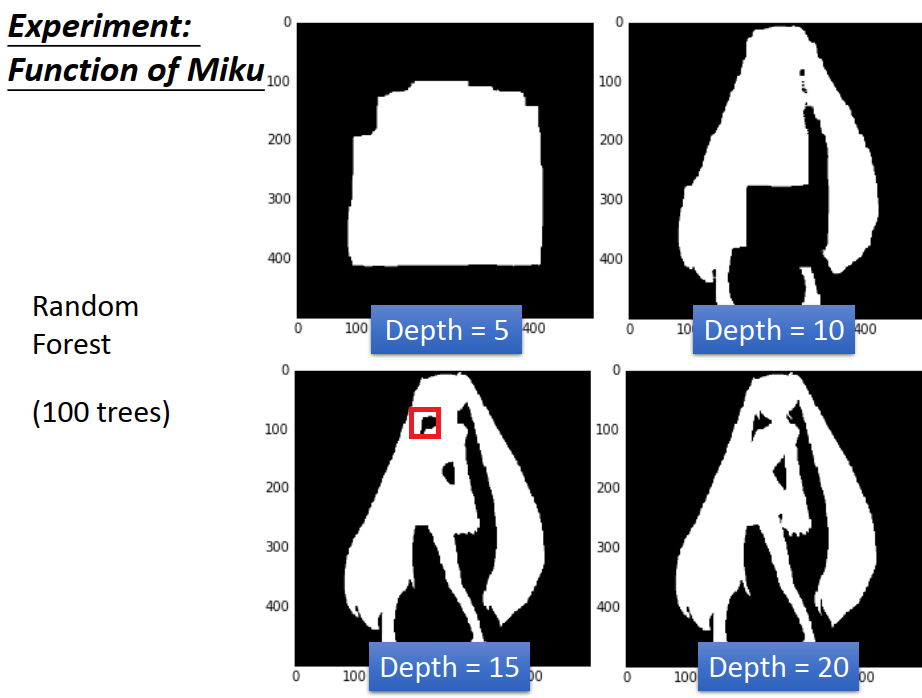

那我们看一下  Random Forest 的 在初音的这个 task 上面的结果. 这边是做100棵树,你会发现说如果是100 棵 Depth =5 的树,做出来的结果是这个样子.这边要强调一下 做Bagging 并不会使你的model 更能够 fit data，所以Depth 是5 的树没有办法fit出那个function，你用 Random Forest 还是 没有办法fit出那个function,  你可以得到的结果只是 现在 ,因为是把 5棵树 平均起来 ,所以你得到的整体 的function 他是比较平滑的 而已。所以 比如说 Depth 是10 看起来就是这样,看起来就不像Mine craft 的世界就是了 , 如果 Depth 是15 得到的结果是这样, 看起来很好,但其实他是有一个 瑕疵 的,他有些地方没有做好,我记得这边有一条头发垂下来,这个他没有把那条头发框出来的样子,对没错, 如果你是 Depth = 20 100 颗 Depth  20 的树你就可以完美的把 初音框出来,这边其实是有一条头发的,要把 这个做出来才是真的正确.

### Boosting 

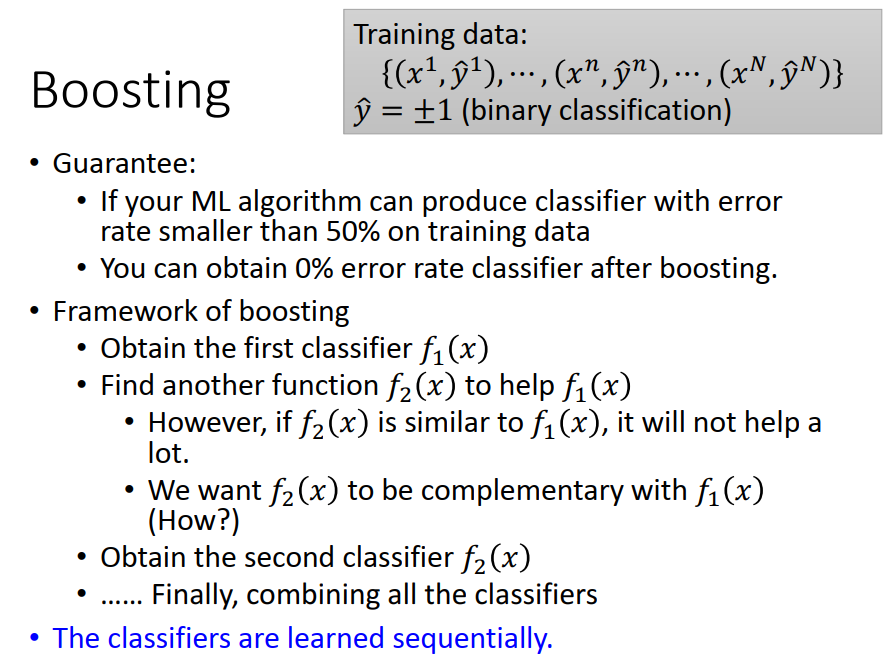

那接下来我们要讲  boosting ,boosting 跟刚才的 bagging 是不一样的, bagging 是用在很强 的 model , Boosting是用在弱的model上面 ，当你有一些弱的 model ，但是问题是 你没有办法让他们去 fit 你的data的时候，这个时候你 就会 想要用Boosting 。 Boosting 是这样 ,Boosting 他可以 保证说, 他有一个很 powerful   的Guarantee ,这个很 powerful   的Guarantee 是这样说的 ,假设你有一个 ML algorithm ,他可以 给你一个 错误率高过 50%的 classifier，假设我们现在要做分类的问题 的话, 那错误率高过 50%的 classifier , 你就 random ,假设这是个二元分类的问题, 你用random 猜是 50%，你高过50% 用脚就很轻易可以办到,很烂的模型都可以办到,  只要你能够做到这件事 , Boosting 这个方法可以保证你最后把这些 错误率仅略高于 50% 的 classifier组合起来以后, 他可以让 错误率达到 0%这样,。有没有听起来非常神奇,  听起来就是非常的强, 

#### framework of  Boosting

这 整个 Boosting的framework  整个大架构大概是这样,

1. 首先你先找一个 classifier f~1~(x),这 个 classifier f~1~(x) 很弱,没有关系,
2. 接下来你再找一个  classifier f~2~(x), 他去辅助 f~1~(x) , 但是你要 注意一下 这个 f~2~(x) 和  f~1~(x) 不可以很像, 他们要是 互补的 ,   f~2~(x) 和  f~1~(x) 的特性是互补的 ,    f~2~(x) 要去弥补 f~1~(x) 的缺失,     f~2~(x) 要去做 f~1~(x) 没有办法做到的事情, 这样进步量才大, 那boosting 等一下我们就会讲说怎么样找到一个    f~2~(x) 他跟 f~1~(x)  是最互补的,然后 你就得到第二个classifier f~2~(x)
3. 然后接下来你再找说,我先找classifier f~2~(x), 那我再找一个 f~3~(x) 跟  f~2~(x) 是 互补的 ,
4. 接下来我再找一个 f~4~(x) 跟  f~3~(x) 是 互补的 ,
5. 这个 process 就继续下去,你找到 一把的 classifier ,你再把这把 classifier 集合起来 你就可以得到很低 的 error rate ,就 算是每个  classifier 他们都很弱也没有关系,

那要注意的地方是 今天在做 Boosting的时候 ,这个 classifier  的 训练是有顺序的(sequentially) ,你要先找出  f~1~(x) 才找的出 f~2~(x) , 才找的出 f~3~(x) , 他是 sequentially 的 ,你要先找  f~1~(x) 才知道说 怎么一个 f~2~(x) 跟   f~1~(x) 是互补的 , 所以他是有顺序的找 ,  那前面在 Bagging 的时候 每一个classifier  是没有顺序的,你在做 100颗 tree,你在做 Random forest,你要 train 100棵 Decision Tree, 这100 棵 Decision Tree 可以平行做,但这边 如果你是要把 100 个  Decision Tree 用 boosting的 方法 ,把它变得很强 的话 ,那你要按顺序做,没有办法,他是没有平行做的方法. 那这边假设我们考虑的task是一个 binary classification 的task,就是有一堆 training data,x跟 $\hat y$, 那  $\hat y = \pm 1 $ 

#### How to obtain different classifiers?   

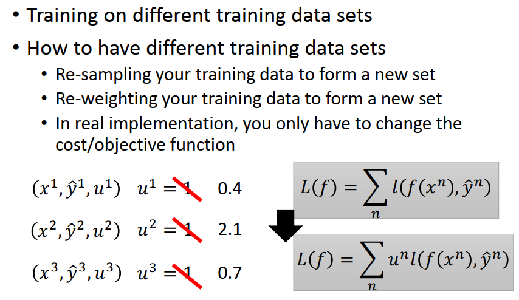

那接下来要讲的就是,怎么得到不同 的 classifier  ,我们刚才有讲过 bagging 的时候有讲过说要得到不同 的 classifier  我们可以用 制造不同 的training set 的方式来得到不同 的 classifier  ,那在boosting 的时候,你 也可以这么做,你可以用 resample data的 方式来制造不同的training data, 然后得到不同 的 classifier,

但是有另外一种方法 可以帮你制造出不同的 data set, 你可以给你的training data 里面的每一笔data 一个 weight ,举例来说 我们这边 用u来代表每一笔data的weight ，一开始 你可以借由 改变这个 weight来制造不同的data set，举例来说 本来现在你有 3笔data, 每一笔data的 weight 都是1，那你可以把它改成说 现在 第一笔data weight 是 0.4,第二笔data weight 是2.1,第三笔data weight 是0.7，这样就等于制造出了一个新的data set。那其实 sampling 也可以是同是改了 weight ,只是 sampling比如说你某一笔data被 sample 两次,就代表说他的weight 变成2 ,只是如果 你用 sampling 的方法的话,你的weight 只能是整数,直接调一个weight u 的话 可以给小数就是了,

那就算是你改变了这个 weight，对 training 也不会有太大的影响。我们知道,在training 的时侯，原来的 objective  Function 是写成这个样子$L(f)=\sum\limits_{n}l(f(x^n),\hat{y}^n)$,你有一个 loss function,你要去minimize他,这个 loss function 是 summation over 所有的 training data,对每一笔 training data x^n^,我们都把他带到 function f 里面去,得到 f(x^n^),计算  f(x^n^) 跟 $\hat y^n$ 的差距,这个 差距用一个 loss function 来表示，这个 l 他可以是各种不同 的function , 反正 能够 量  f(x^n^) 跟 $\hat y^n$ 之间的差异就行了 , 然后你就用gradient descent 的方法去找一个 function f, 来minimize 这个L, 这个 total loss function, 如果今天 加上weight 的话有什么不同呢 ，没有什么不同 ,唯一的不同只有你会在 每一个 l 的function 前面乘上 u, 你会在 每一个 l 的function 前面乘上 那笔data  的weight, 代表那笔data  的权重 , 所以 今天如果有一笔data 他的的权重比较重,他的u 比较大，那你今天在training 的时候他就会被多考虑一点。

## Adaboost

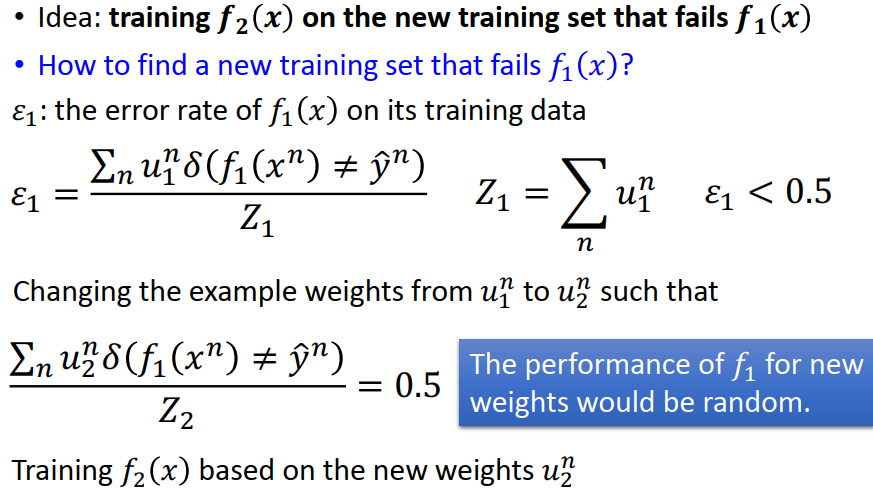

那有了这个 概念以后, 那 Adaboost 的 精神是什么呢,  Adaboost 的 精神, 这个 boosting有很多的方法,那等一下我们要介绍的是其中最经典的这个 Adaboost  的方法,这个 Adaboost 的方法是这样子,  Adaboost的方法 他的想法是说,我们现在先训练好一个 classifier f~1~(x)，那我们要去找一组新的training data，所谓的找一组新的 training data 意思其实就是 reweight 我们 的training 的example,我们要去找一组新的training data，让 f~1~(x) 在这组 新的 training data上面结果是会烂掉的，会fail 掉,他的正确率会变成只有 50% , 我要找一组新 的training data ,f~1~(x) 在这组 新的 training data 是做不好的,然后再 让f~2~(x)在这组 新的 training data上面去做训练。

那接下来,怎么找一个新的 training data 可以 让这个f~1~(x) 坏掉呢 ,假设给你一个 f~1~(x) ,你要找一个 training data 让  f~1~(x)  坏掉呢 ,那我们先来看一下 这个 f~1~(x) 在training data上的 error rate 怎么计算 ， f~1~(x) 在training data上的 error rate 我们这边写成ϵ~1~  ,这个ϵ~1~的计算方法 就是 summation over 所有 的training的 example n,然后即 计算说每一 笔的training sample 他的结果是不是是对的，如果是对的话 就是 0 ，如果是错的话就是 1, 然后每一笔 training example 你都还要乘上他的 weight u^n^，然后你要再做 一下 normalization，因为这个 u^n^ 的值合起来不见得是1 ,所以你要做一个normalization,   这个normalization 就是 summation over 所有 的 u~1~ , summation over 所有 的weight 就是这个 normalization 的term,   那 ϵ~1~ 他一定会小于 0.5 ,因为我们假设说我们今天 的 classifier  是还可以的,  所以不是一个 完全 random 的 classifier   ,所以他的 error rate 总是可以小于 0.5 , 你其实没有办法制造一个 classifier 他的 error rate 大于0.5 ,你知道吗,因为 classifier 他的 error rate 大于0.5 ,你只要把它的 output 反过来, 他的error rate 就小于 0.5 

现在我们想要做的事情就是 原来 training data 的weight 是 u~1~,我们要给一组新的training data 的 weight 是 u~2~,这组新的training data 的 weight 会使得说,如果我们今天把 上面这个算  ϵ~1~的式子的 u~1~,换成 u~2~,得到的结果会变成 0.5,本来   ϵ~1~ 是小于0.5 ,是在以  u~1~作为weight 做计算的时候 小于0.5  ,那现在把 u~1~ 换成 u~2~  weight 就变成 0.5,

这个时候就好像是说 假如我们重新 weight 了我们的 training data, 本来是用  u~1~作为 training data 的weight ，现在用u~2~ 作为  training data 的 weight ，在这组新的 weight上面， f~1~(x) 他的 performance 就像是随机的 一样，然后接下来我们再拿这组新的training data,用  u~2~  当作weight 的   training data再去训练f~2~(x)，那f~2~(x) 就会 跟 f~1~(x) 是互补的。

### 实际的例子 Re-weighting Training Data  

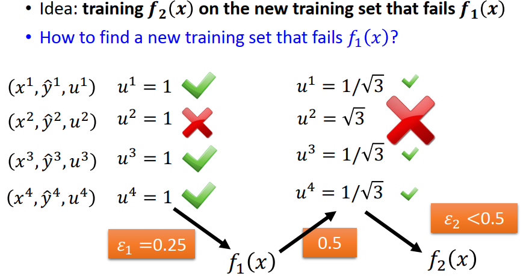

那这样讲也许有点抽象,所以我们 举一个实际的例子,现在有4笔 training data, 那这 4笔 training data 的weight  就是  u~1~到 u~4~，那我们假设  u~1~, u~2~ ,u~3~, u~4~通通等于1，这4笔training data weight 是一样的,  现在我们用这四笔training data去训练一个模型, 去训练一个classifier f~1~(x) ，假设f~1~(x)  其实他 只是一个特别 powerful  的 algorithm ,所以就算是 training data他也没有办法每一笔 training data都分类正确

我们假设他只分类正确三笔 training data,一笔 training data  是分类错的,所以 他的 error rate 是0.25,四笔 training data 分错一笔,所以他的 error rate 是 0.25, 接下来我们要改变这个 data 的 weight，我们要把 u 的值变一下 ,让f~1~(x) 在这个新的 training dataset上他的 error 变成0.5 ,怎么改呢,其实有不同的改法,我们这边假设说,举例来说,我们假设 u^1^ 的weight 是 $1/\sqrt 3$,因为我们现在要让 f~1~(x) 的error 变大,怎么让 f~1~(x) 的error 变大,就是看他说他答对哪几题,那几题的配分就变小, 答错哪几题,哪几题的配分就变大,就像考试的时候,你先把考卷写完,然后老师 也改完以后,然后我们再重新去计算配分,看到你答错的配分就比较高,你答对的配分就比较低,然后你 就会发狂,就会生气，

今天要做的事情就是要让  f~1~(x) 生气,我们先看看他答对哪些,答错哪些,本来今天和他说好说每一题的配分都是一样的,但其实是骗他的,他今天答完以后再改一下题目的配分,第一题他答对了,所以配分就变成  $1/\sqrt 3$,第二题他答错了,所以配分就增加,就变成  $\sqrt 3$,第三题跟第四题他也答对了,所以配分就减少,就变成  $1/\sqrt 3$,如果今天在这笔新的 training data 的情况下,就会变成  f~1~(x)  他就会变得很糟,因为你想想看,他答错的题目 weight 是   $\sqrt 3$,他答对的题目 weight 是   $1/\sqrt 3$,有3题,   $1/\sqrt 3$ 乘 3 也是    $\sqrt 3$对不对,所以 答错的题目跟答对的题目的weight 是一样的,所以今天    f~1~(x)   的error rate 就变成了0.5,

那接下来我们再组新的 training data  上面,这组 新的 training data  可以让 f~1~(x) 整个 烂掉,我们在这组新的  training data  上面再去 训练   f~2~(x),那   f~2~(x)  呢,因为他是看着这组新的weight,看着这个新的配分去做练习的,他看这个新的 weight 去做学习的,所以 新的 error rate 在这组weight 上 他的 error 会是小于 0.5, 所以   f~2~(x)  可以和   f~1~(x)   是互补的.  更详细的证明我们之后会有,我们今天都是讲个精神,我们之后 会有完整的证明,

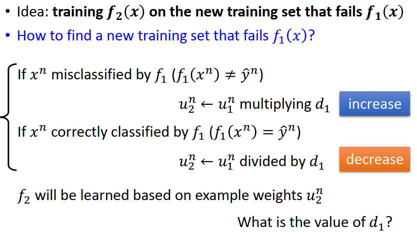

那接下来我们来讲一下实际上要怎么做  Re-weighting这件事情呢,这个做法是这个样子的,如果说今天某一笔data x^n^ 他会被 f~1~(x)  分类错，那我们就把第n笔data的 weight u~1~^n^ 乘上一个值 d~1~变成 u~2~^n^ ，这个d~1~是大于1的值,也就是说 x^n^ 如果 分类 错误的话就把那一个题目 那笔 data 的权重提高, 乘上 d~1~ 把它提高,  那如果x^n^ 是正确的被 f~1~(x)  分类的话，那我们就把 u~1~^n^除掉 d~1~把他变小, 所以错的就增加,对的就变小 ,那   f~2~(x)  会在新的 weight   u~2~^n^上进行训练。 

#### math

再来的问题就是这个  d~1~ 的值 应该要设多少呢,这边没有什么高深的数学,其实就是 推一下,怎么样要设什么样的 d~1~可以让 u~1~^n^变成 u~2~^n^  以后,可以让  f~1~(x)   的 error rate 是0.5,这边就只是数学式比较繁琐,但其实很简单的数学,

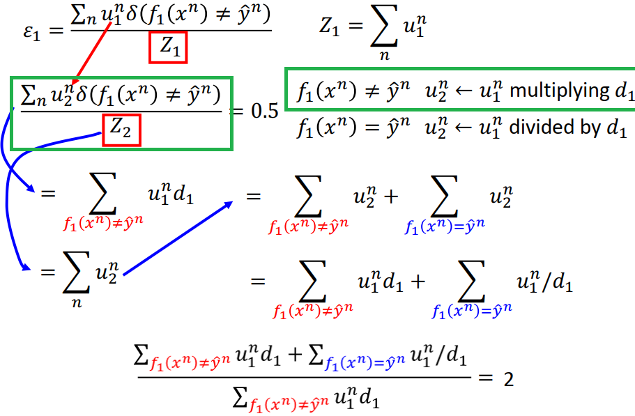

这个数学是这样子的,我们现在 已经计算出  ϵ~1~,   ϵ~1~的式子是这个样子, 那我们现在希望把 u~1~^n^换成 u~2~^n^  ,得到的 weight 是0.5,那我们的原则就是 如果今天 第n笔 data 的分类是错误的,那就乘上  d~1~, 如果分类是正确的,那就除掉  d~1~,

那我们先看一下 上面这边,上面这是边（绿色框框）指 summation over 分类错误的 那些data,所以上面的这些  u~2~^n^他都是分类错误的,所以他都会乘上  d~1~,所以上面分子的地方,你可以写成  summation over u~1~^n^ 乘上  d~1~,上面这些 u~2~^n^每一笔都是 u~1~^n^ 乘上  d~1~,因为他们都是分类错的 ,那再来我们 看分子的地方,分子的地方是   summation over  u~2~^n^  ,, u~2~^n^  有两个 case ,一个是 如 果  f~1~(x) 会把这笔data分类错误的话,那 u~2~^n^  是来自 u~1~^n^ 乘以  d~1~, 如果是分类正确的话,那 u~2~^n^  就是来自 u~1~^n^ 除以  d~1~,所以这整个式子列出来的话 就是最下面式子的样子,然后你把分子的地方带进去,分母的地方带进去,得到 这个式子,这个式子他是等于0.5

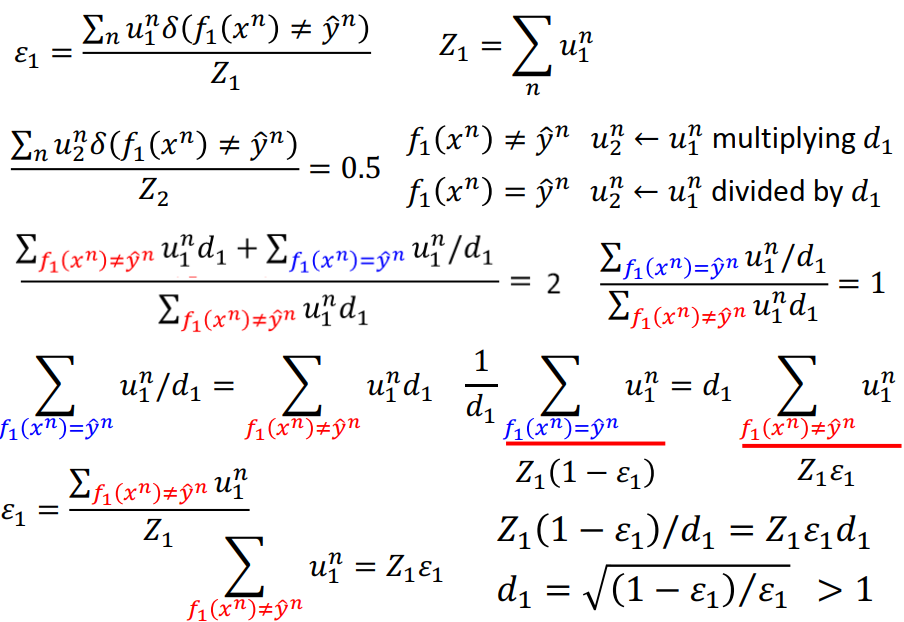

然后我们把 分子和分母倒过来 ,所以左边分子和分母倒过来,右边 就从 0.5 变成 2,接下来我们发现分子和分母都有共同的 Σ u~1~^n^ d~1~,分子分母所共有的,所以我们知道说  Σ u~1~^n^/ d~1~ 除以  Σ u~1~^n^ d~1~ 会等于1 ,这告诉我们什么呢, 告诉我们说  Σ u~1~^n^/ d~1~ ,就我们把所有那些   f~1~(x) 会答对的 data x^n^ 拿出来, 把他们的  u~1~^n^ 除以  d~1~ 要等于所有 f~1~(x) 会答错的 那些 x^n^ 他们的  u~1~^n^ 乘以  d~1~ ,这个式子就算没有刚才的推导,其实你也可以 很直觉的写出这一个 式子,如果你要让   f~1~(x) 在新的weight 上 的 error rate 是0.5的话,那当然他答对的部分的新的  weight 要等于 答错的部分的新的  weight 

接下来你把  d~1~ 提出去,那接下来,我们看一下我们 知道 ϵ~1~ 可以写成 这个样子,ϵ~1~ 的分子的地方是对那些答错的 example  x^n^ weight 的总和,然后再做 normalization,然后这一项出现在这个地方,就是我们可以把 这一项用 ϵ~1~ 把它代换掉,所以这一项等于 Z~1~ϵ~1~ ,这一项呢,这一项是  Z~1~(1-ϵ~1~)对不对,因为 这一项加这一项 会是   Z~1~, 既然他是 Z~1~ϵ~1~他就是 Z~1~(1-ϵ~1~) 

总之经过一番推导以后,你会算出来说 $d_1=\sqrt{(1-\epsilon_1)/\epsilon_1}$ , 拿这个 d~1~ 去乘或者除u~1~^n^，你就 可以制造一个 training dataset ,他是会让 f~1~(x) fail 掉的 training dataset ,这个 d~1~ 的值他一定会大于1，为什么,因为ϵ1一定小于0.5，所以在  d~1~ 的根号的项里面分子会大于分母, 所以这个 d~1~ 他都会大于1

#### Algorithm for AdaBoost  

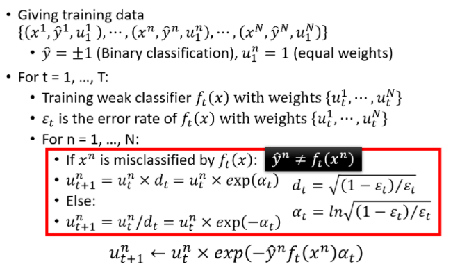

那整个 AdaBoost 的演算法 我们可以 讲完这页就好,整个 AdaBoost 的演算法看起来就是这个样子,现在我们有一堆training data,那每一笔training data,我们都一开始给他初始的weight 都是1，然后接下来你要跑T个 iteration,每一个 iteration都会给我们一个 classifier,都会给我们一个weight 的 classifier  f~t~(x) ,之后再把 所有的f~t~(x)集合起来,就变成一个强的 classifier,

那在每一个 iteration 的时候,每一笔 training data都有它自己的weight ,这边写成 u~t~^1^ 到  u~t~^N^ ,我们用下标 t 代表的是那一个 iteration  的weight,那我们用这个weight 训练出f~t~(x),然后计算 f~t~(x)  在原来的weight 上面的error ϵ~t~, 在计算出  ϵ~t~ 以后,我们 就可以 re-weight 每一笔training data,如果 x^n^他被  f~t~(x)  分类错误的话,如果分类错误的话怎么办呢,就把  u~t~^n^ 乘上 d~t~, 就把  u~t~^n^ 乘上 一个大于1 的值然后得到一组新的weight ,这组新的weight 会在下一个 iteration   的时候被使用,反之 就把原来的weight 除掉  d~t~,得到一组新的weight ,这组新的weight 要在下一个 iteration   的时候被使用

那这个   d~t~我们刚才已经讲过了,这个 $d_t=\sqrt{(1-\epsilon_t)/\epsilon_t}$ ,或者是我们可以写成有另外一个变数叫做 α~t~,

这个 $\alpha_t=ln\sqrt{(1-\epsilon_t)/\epsilon_t}$ ，这么做是有含义的,这么做的话 我们可以把  d~t~换成 Exponential α~t~, 把除 d~t~换成 乘以  Exponential α~t~, 所以本来是有乘有除,现在变成一个是乘 exp(α~t~),  一个是乘 exp(-α~t~), 之所以这么做,是为了要表达式子的时候可以更简便一点

怎么样更简便一点呢,我们可以这两个式子合成一个式子,我们可以这样写,我们可以说这下面这两个式子差的只有一个负号而已,我们都是要把原来的weight 乘上  exp(α~t~), 只是这个  α~t~前面有时候是+1,有时候是-1,怎么用一条式子决定 α~t~前面是+1 还是-1 呢,我们就只需要说我们把 $\hat y^n$ 乘上 f~t~(x)  ,如果说今天 是 miss classifier 的情况下, $\hat y^n$ 跟 f~t~(x) 他是不一样的,这两个值是不一样的,所以他是-1,那-1乘-1 ,  α~t~前面就变成1 ,就变成这个样子,如果是分类正确的情况下,这两项是一样的,所以这两项相乘就是+1,所以再乘上-1,所以这一项就变成-1,所以总之今天我们可以直接用这一个 式子,一个式子来表示这两个式子,

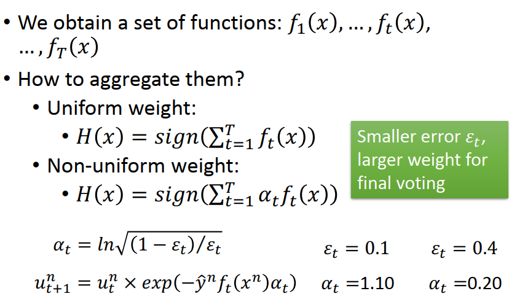

好,那接下来经过刚才的训练以后, 我们就得到了一把classifier f~1~(x) 到f~T~(x)， 再来就是怎么把这把 classifier 集合在一起呢,

##### Uniform weight

你可以说 你用  Uniform的 weight,你可以说我们就说 现在有T个 classifier ,那 将这T个 classifier 都得到一个 output,把这 T个 classifier的output 就加起来,看他是正的还是 负的,如果是正的话就代表是 class 1，如果是负的话就代表是class 2，就把这  T个 classifier的值通通加起来,然后取他的正负号,这样虽然可以,但这样子不是最好的方法，因为这 T个 classifier 有好有坏，所以我们 应该要给他不同的权重,  

##### on-uniform weight

怎么给他 不同的权重呢,我们在每一个 classifier 的output 的前面都乘上一个权重α~t~, 然后再全部加起来以后再取他的正负号，这样可以得到比较好的结果 ,α~t~怎么 得到呢,这个 α~t~我们在前一页式子有看过,这个 α~t~就是拿来改变每一笔 training data 的 weight 的那一个 α~t~,那个 α~t~我们在前面看过,

我们现在看一下 这个 α~t~ 的精神,如果今天某一个 classifier他的 ϵ~t~是0.1,他是一个 错误率比较低的classifier, 那我们把  ϵ~t~= 0.1这件事情带到这个式子里面去算 α~t~,那它的 α~t~就是1.1,  所以错误率低的  classifier 他会有比较大 的 α~t~, 如果今天有另外一个 classifier 他的 ϵ~t~是 0.4,代表他是一个 很烂的 classifier ,他的 错误率接近0.5 了,我们 把  ϵ~t~= 0.4带到这个式子里面去算 α~t~,我们得到 α~t~ 是0.2,所以今天如果有一个比较正确 的classifier ,错误率比较低的 classifier ,它得到的  α~t~  的值是大的,如果是比较烂的 classifier  ,它得到的  α~t~  的值是小的,

也就是说我们今天在做 weighted sum的时候,如果有一个 classifier 他的 正确率,**它当初训练的时候他的 错误率是比较大的,那他的weight 就比较小, 它训练的时候他的 错误率是比较小的,那他的weight 就比较大,**所以这件事情是非常有道理的,这个   α~t~  是 make sense的

#### Toy Example  

我们很快把后面这个例子讲过好了,如果这边你觉得太快的话,你就回去自己看一下投影片,我相信这个对大家来说应该非常容易,那我讲完这一段,我们就请助教来讲一下作业6

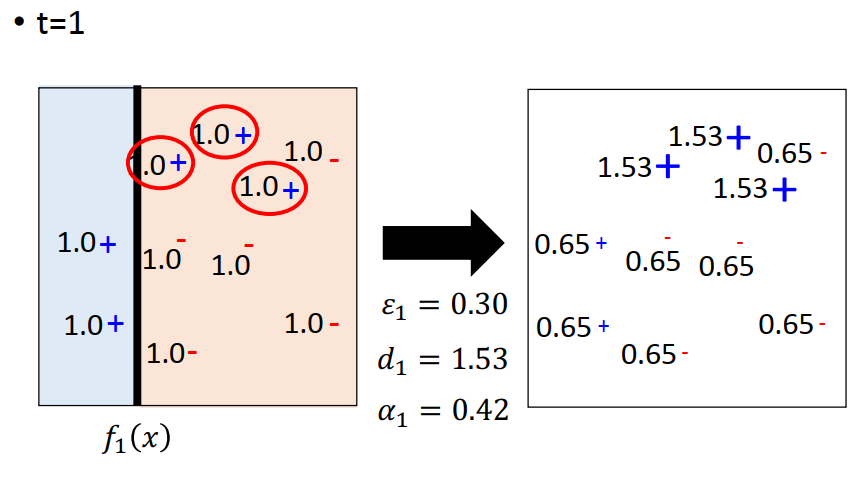

这个很简单,我们现在假设说,刚才那个演算法,如果你没有听懂得话,就看看这个例子,你就知道他的意思了,我们假设我们的T=3,我们现在的 weak 的 classifier 很weak,它不是 Decision Tree 也不是 Neural Network,它叫做 Decision stump,Decision stump没什么好讲的,知道吗,它太简单的了,

它做的事情就是 现在假设我们的  feature 都分布在二维平面上，在二维平面上选一个dimension 切一刀，其中一边当做class 1，其中另外一边当做class 2,结束,这个就叫做 Decision stump,那要做 Boosting 你一定要找一个 weak  classifier,那 Decision stump它够weak, 所以我们可以把它用在这里  

 好,那现在一开始 ,每一笔training data 的weight 都是 一模一样的, 都是 1.0 ,那我们用  Decision stump 找一个 function ,这个 function 是f~1~(x) ,那他的  boundary 就切在这个地方,以左我就说是positive example ,就算是 positive的,其实一边是 class 1是 positive的 ，然后往右就是粉红色就是negative ，

你会发现这边有 3笔data,他的分类是错误的,那计算一下,有三比data,分别总共有 10笔data,3笔data分类错,所以 error rate 是0.3,  error rate 是0.3 的话,d~1~ 算出来就是 1.53 ,α~1~ 算出来就是0.42,你就带前一页的投影片的公式,你就可以轻易的求出来,

现在我们已经算出来  ϵ~1~,d~1~,α~1~ 以后,那我们接下来 就是去改变每一笔 training data 的weight，我们说分类正确的就weight 就要变小,分类错误的weight 就要变大, 分类错误的就要乘1.53 ，分类对的就要除1.53 ，所以这三笔分类错的他的weight 就变大,分类对的weight 就变小,

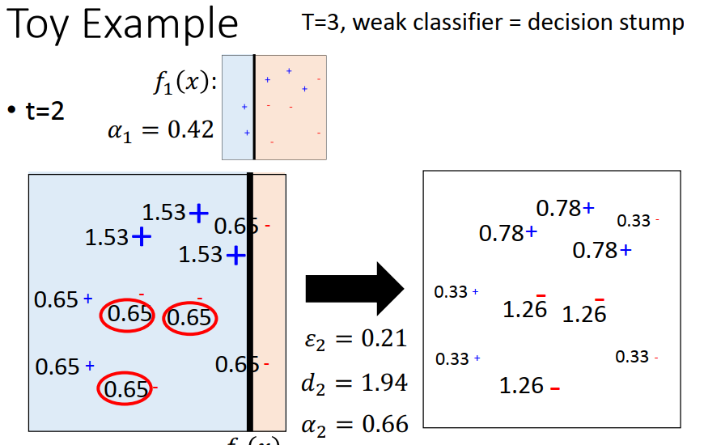

现在有了一组新的weight 以后,你就可以再去找一次另外一个 Decision stump,那有一组新的weight ,那你找出来的Decision stump 就不一样了,那新的 Decision stump 它切一刀,切在这个地方,往左是 positive ,往右是 negative ,往左是蓝色,往右是红色,你会发现说有3笔data 的分类是错的,那现在  f~2~(x) 的 error rate 是多少呢,你会根据这每一笔data 的weight 进行一下计算,就会发现说第二个classifier  他的error rate 是 0.21,他的 d~2~ 是1.94,他的 α~2~ 是0.66

接下来这三比data分类错,所以给他weight 比较大,这三笔data要把它乘上 1.94,那剩下的data通通把它除掉 1.94,那现在我们就找到了第二个 classifier,那每一个classifier的weight就是 他的  α的值,那我们把它的 α的值写在这个 classifier 的旁边,

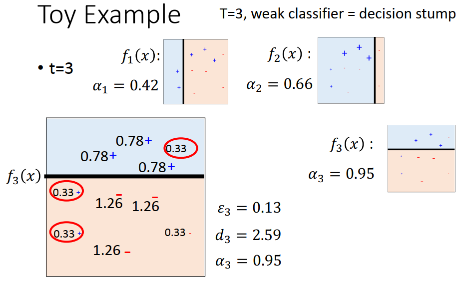

接下来找第三个 classifier,那这个 第三个 classifier我们把它找出来,第三个 classifier说上面是蓝色的,下面是红色的,那它这么讲会导致有 3笔data分类错误,那计算一下他的 error rate是 0.13,你可以计算他的  d~3~,你可以计算他的  α~3~ ,

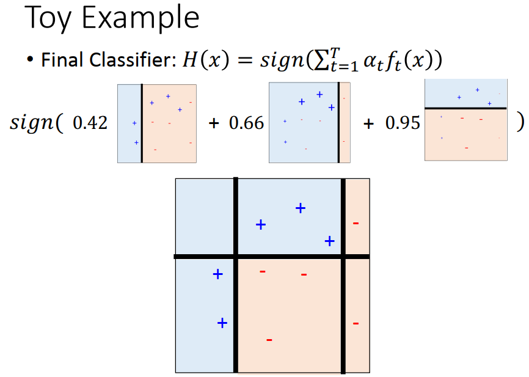

如果你现在有更多的 iteration 的话,你会重新去weight 你的这个 data,但是现在我们就说只跑3个 iteration ,所以跑完就结束了,我们 得到 3个 classifier还有他们的weight,然后就结束了,最后我们怎么把这 3个 classifier组合起来呢,你把每一个 classifier都乘上他们对应 的weight,通通加起来,再取他的正负号,

我们来看一下说这个加起来的结果到底是怎么回事,现在有3个 Decision stump ,这个三个Decision stump 把整个 二维的平面切成六块，

那左上角,左上角三个 classifier 都觉得是蓝色的，所以填蓝色。

那我们看中间这一块, 中间这一块第二个和第三个 classifier 觉得是蓝色的 ,第一个觉得是红色的，但是后面两个觉得是蓝的 合起来的weight 比较大，所以中间上面这块是蓝色的. 

右上角，第一个觉得是红的,第二个觉得是红的, 第三个觉得是蓝的,这两个红的的weight合起来比蓝的的weight 大,所以又是红的。

左下角呢,左下角是第一个蓝的,第二个蓝的,第三个红的,两个蓝的合起来比红的大,所以是蓝的,

下面这个呢,红的,蓝的,红的,两个红的加起来比蓝的大,所以是红的,

右下角三个 classifier ,三个  Decision stump都是 红的,红的,红的,所以是红的,

所以现在这三个  Decision stump没有一个是 0% 的 error,他们都有犯一些错,但当我们把这三个 Decision stump 组合起来的时候, 他会告诉我们说这三个区块是属于蓝色,这三个区块是属于红色的,而他的正确率是 100% ,所以3个 weak 的 classifier ,再把它组合起来,它可以得到好的结果,

接下来我们就请助教来讲一下作业6 .

#### warning of Math

各位早,我们来继续讲 AdaBoost,上一次讲的是AdaBoost的 algorithm,现在要讲的是理论上的证明,这边要证明说假设我们按照 AdaBoost的 algorithm 来产生我们最后的 classifier ,这个最后的 classifier 这边写成H(x),

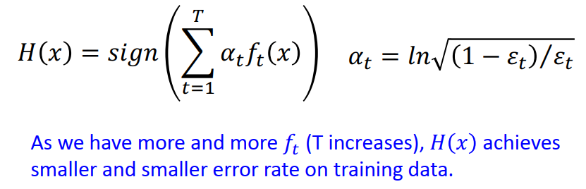

这个最后的 classifier H(x) 是由一堆 weak 的classifier f~t~(x) 所组成的,如果我们的 AdaBoost的 algorithm 我们跑 T 个iteration 的话,我们就会得到T 个  weak 的classifier,从  f~1~(x) 到 f~T~(x) ,那在 每一个  weak 的classifier 它还有weight ,他们还有权重,这样我们就可以知道说哪些  weak 的classifier 其实我们一定要参考它多一点,哪一些应该被参考的少一点,那这个权重就是 α~t~, 那我们把所有的  weak classifier 的output ,就是假设你现在要 classifier 某一个 object x, 你就把x 分别丢到每一个 weak 的classifier f~t~(x) 里面, 再把 f~t~(x) 的output乘上他的weight  α~t~,再 summation over所有的  weak classifier ,再取他的正负号,就可以得到最终的分类的结果,

那这个 α~t~是什么呢,我们说这个 α~t~跟 这个  ϵ~t~ 有关, ϵ~t~组成了  α~t~,而 ϵ~t~ 又是什么呢,ϵ~t~是error rate,是 classifier f~t~(x) 的error rate ,那现在要证明的东西是 如果weak 的classifier 越多,或者是换句话说  AdaBoost 的algorithm 跑越多的 iteration 在training set上 的error 会越来越小,所以这样子你就可以增加你的 weak classifier ,然后让你的model 在training set上的performance 越来越好,

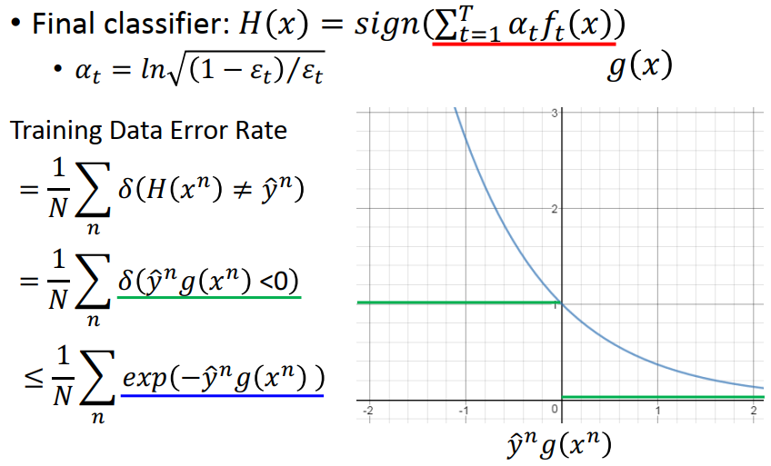

怎么证呢,其实这个是蛮简单的,我们先算一下 H(x) 的error rate,我们先把  H(x) 的error rate 的式子列出来,怎么算呢,它长的什么样子呢,其实很简单就是 summation over n, 这个 n 代表你的 training data,x^n^ 代表你的training data, 那如果  $H(x^n) \neq \hat y^n$,H(x^n^) 的output 跟正确的解答不一样的话,那你就有一笔error 得到的error 就是1 ,反之 如果   $H(x^n) =\hat y^n$的话,那你得到的error 就是0,然后再做一下平均,假设有N笔training data,

那我们这边是先把T个 weak classifier weighted sum起来,再取他的正负号,那括号里面这一项现在用g(x)来表示,g(x) 代表T个  classifier的 weighted sum,那所以 error rate这一项你也可以写成是$\hat{y^n}g(x^n)$,看他是小于0还是大于0,小于0 代表 $\hat{y^n}跟 g(x^n)$异号所以是错误的,所以得到的error 就是1,那如果他们是同号代表是正确的,那你得到的error就是0,这都没有什么特别难的地方,

最后一项,最后一项我们说这个 error rate其实有一个 upper-bound,这个 upper-bound写作这样,这个 upper-bound是 Exponential的 $-\hat{y^n}g(x^n)$,怎么说呢,如果我们把$\hat{y^n}乘上g(x^n)$这个值把它画出来,就一目了然了,

我们现在画个图,这个图的横轴是 $\hat{y^n}g(x^n)$ ,绿色的线代表的是δ( $\hat{y^n}g(x^n)$ <0) 这一个function 他的值,所以 $\hat{y^n}g(x^n)$ 如果 小于0 的话这个 δ 的output 是1,反之δ 的output 是0,那这个绿色这个 function 有一个  upper-bound,就是蓝色的function,蓝色的function 是  $exp(-\hat{y^n}g(x^n))$, $exp(-\hat{y^n}g(x^n))$ 画起来就是这个样子(蓝色的弧线),所以蓝色这个function 是绿色function 的  upper-bound,这个应该是没有什么特别的问题

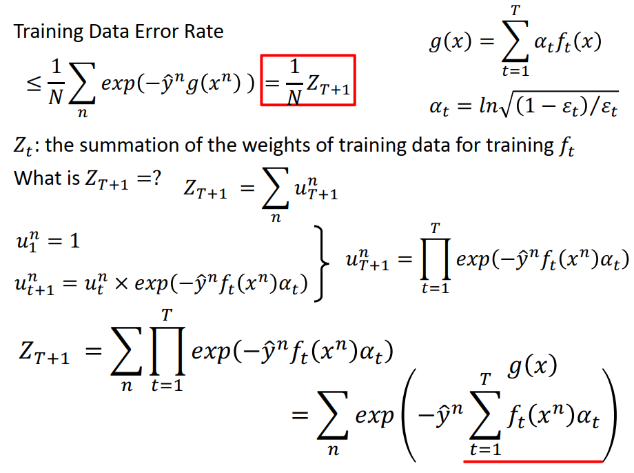

再来就是我们要做的证明是证这个 upper-bound 会越来越小,那怎么 证这个 upper-bound 会越来越小呢,在直接它之前,我们来算另外一个数值,我们要算Z~t~,什么是 Z~t~呢,我们说在每一个iteration 的时候我们都会给training data一个weight,每一笔 training data 都有一个weight,那我们用这些weight来算 f~t~, 那所谓的  Z~t~就是我们把所有 training data 的weight 加总起来,就是 Z~t~,然后等一下会说明这个 Z~t~跟上面这个  upper-bound 的关系,

我们先不要管那个 upper-bound ,我们先来算个Z~t~,那我们现在要算的是 Z~T+1~,也就是说当我们把 t个 iteration 跑完以后,假设我们接下来要算 f~T+1~,要学  f~T+1~,第 T+1 个 weak classifier,那在train 第 T+1 个 weak classifier 的时候,那些 training data 的weight 把它总和起来,应该是多少呢,那 Z~T+1~等于 summation over 所有的 training data它的每一笔training data 的 weight 的总和,$Z_{T+1}=\sum\limits_{n}u_{T+1}^n$,

那每一笔training data 的 weight  又是多少呢,我们假设在初始的时候,在train 第一个 weak classifier 的时候,这时候每一笔 training data你给他的weight 都是一样的,都是1,这个是个非常合理的假设,

接下来在第t+1 个iteration ,你要train第 t+1 个classifier 的时候,你会把原来的weight 在第t 个 iteration 的weight u~t~ 乘上  $exp(-\hat{y^n}f_t(x^n)α_t)$​, 这件事情,我们之前其实有讲过了,就是说如果今天第n笔的 classifier 它被classifier 是正确的,那他的weight就会被下降,如果它 classifier 是错误的,他的weight就会被上升,怎么增加和减少他的weight,我们靠的是乘后面这一项,

那我们前面在讲那个 Adaboost  的 algorithm 的时候有解释过说,为什么这个式子长的是这个样子,这个 α~t~ 它跟 ϵ~t~ 有关系,我们把它写在右上角,总之呢第 t+1 个时间点的weight 跟第 t 个时间点的weight 他们之间有着这么样的关系,

那 如果要你算第  T+1 的 iteration  的时候的weight,要train 第 T+1 个 weak classifier的时候的weight,会不会算呢,你会算,你就把所有的这些,因为第一项是1,你开始是1,然后接下来就一直乘 Exponential 这一项,所以其实我们只是把这些Exponential这些项乘上T次而已. 我们知道 t跟 t+1中间的关系就是乘这一项,那从u~1~ 到u~T+1~ 中间,我们就是乘了 这个 Exponential项,乘了T次,

那如果要算Z的话,算Z的话,Z就是把所有每一笔training data 的 u 通通都 summation 起来,所以我们就只在这个式子前面 加了一个 summation 而已,接下来我们可以把 summation放到,我们可以把这个 连乘这一项放到 Exponential里面,有一大堆 的 Exponential相乘等于指数项相加,所以我们可以把连乘这一项放到 Exponential里面,

那这个 $\hat y^n$ ,$\hat y^n$ 是指第n笔training data正确答案,他跟 iteration 是完全没有关系的,他是label,他跟 iteration 是完全没有关系,所以,$\hat y^n$ 这一项可以被提出来

所以总之Z~T+1~会写成右下角这个式子,右下角这个式子是啥呢,你看红色的这一项其实就是g(x),所以整个这一项其实就是左上角的这一项,所以这个Z~T+1~他和  upper-bound是非常有关系的,其实training的时候你的error 的upper-bound就是Z~T+1~ 除以N,

你会发现说你的**training data 的weight 的summation 居然是跟你的 error 的 upper-bound 有关系的**, 那所以接下来就是要证说 weight 的 summation 会越来越小, 所有的  training data 的weight  的summation 会越来越小,如果你可以证明这件事的话,这个游戏就结束了,

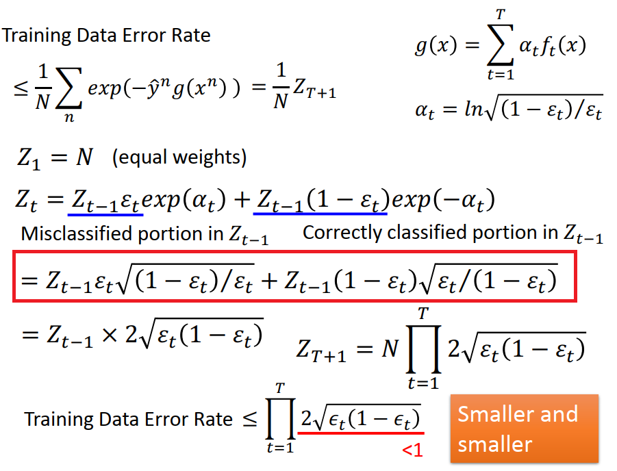

那这个  Z~1~是什么,我们知道说 Z~1~在第一次train 第一个 classifier 的时候,每一笔training data 的weight 都是1,总共有N 笔training data,所以他的weight 是N,所以 Z~1~ = N

那Z~t~呢, Z~t~跟 Z~t-1~中间有以下的这个关系,你要从  Z~t-1~变到 Z~t~,你只要做以下这个运算就好了,这个运算是什么意思呢,这个运算是说我们先找出   Z~t-1~里面 Misclassified 的部分,然后Misclassified 的部分,分类错误的部分会被乘上  exp(α~t~), 那分类正确的部分会被乘上  exp(-α~t~),那这个 分类错误的部分有多少呢,我们知道假设 error rate叫做 ϵ~t~,那分类错误的部分就是 Z~t-1~乘上 ϵ~t~,分类正确的部分当然就是 Z~t-1~乘上 (1-ϵ~t~),分类错误的部分会被乘上  exp(α~t~),分类正确的部分会被乘上  exp(-α~t~),把这两项加起来,你就得到  Z~t~,

所以呢,我们现在又知道 α~t~是多少,α~t~ 的 式子就写在这边,所以把α~t~带进去,我们得到说  Z~t~等于红框中的式子,那合起来是多少呢,合起来就是,这个太容易了,就把那个 分子和分母消一下,你得到$Z_{t-1}\times{2\sqrt{\epsilon_t(1-\epsilon_t)}}$,所以从这一项其实我们就可以看出说 Z~t~ 会比  Z~t-1~还要小,

对不对,你想想看, ϵ~t~ 是error rate,error rate一定小于0.5,它最大就是0.5,所以 Z~t-1~后面乘的这一项他的最大是多少呢,它最大的是,如果   ϵ~t~ 等于0.5的时候他是最大的,所以两倍的 $2\sqrt{\epsilon_t(1-\epsilon_t)}$​​最大的值,其实就是1,它没有办法比1还要更大了,所以 Z~t-1~会乘上一个比1小的值变成 Z~t~,所以我们知道说, Z~t~会小于Z~t-1~

那如果我们要把 Z~T+1~算出来的话多少呢, Z~T+1~就是 Z~1~的N乘上T项,每一项都是 $2\sqrt{\epsilon_t(1-\epsilon_t)}$​​,所以我们知道说 training 的error 是会越来越小的,因为 $2\sqrt{\epsilon_t(1-\epsilon_t)}$​​ 是小于1 的, 所以  Z~t~会越来越小,Z~t~就是 upper-bound 所以 upper-bound 会越来越小,所以 error rate可能也是会越来越小,那这个证明就到这边

#### AdaBoost 的 神秘的现象

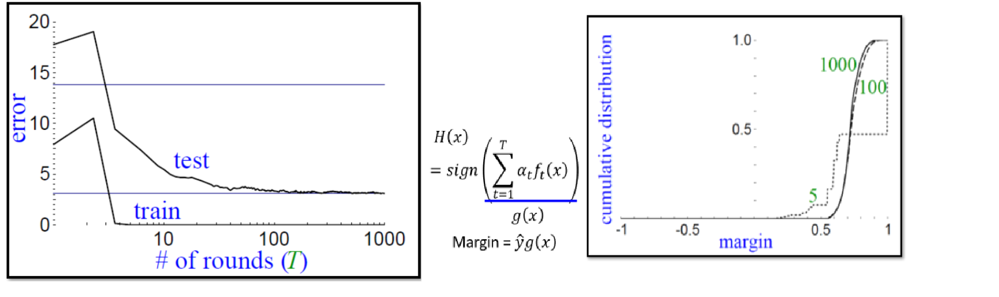

接下来要讲的是一个 AdaBoost 的 神秘的现象,这个神秘的现象是这个样子的,这边横轴是training 的  iteration,就是你找多少个 weak 的 classifier 来帮忙,纵轴是error rate,那你会发现说比较低的这一条线是在training data上面的 error rate, 比较高的这一条线是在testing data上面的 error rate,但是神奇的地方是，你看这个 training data 的 error rate 其实很快就变成0 了,大概在5个 iteration之后,你找5个 weak 的  classifier combine在一起以后 error rate其实就已经是0 了,

但虽然 error rate 是0 ,但就 5个 weak 的  classifier 的error rate 合起来是0 ,要强调一下,是 5个 weak 的  classifier 的error rate 合起来是0,并不是 是 单一 一个 weak  classifier 的error rate 是0, 单一 一个 weak  classifier  都很弱,要很多合起来以后它error rate 才是0,

实事上,在 AdaBoost 演算法里面,如果你想一下的话,如果你的 weak   classifier 的error rate train 在training data上 就已经是0了,那其实这整个演算法是会有问题的,你算一下那个 α~t~会发现说,他是 undefined 的,所以 AdaBoost 的假设说你的 train weak  classifier algorithm 没有办法让你的 error rate变0,如果会变0的话,这演算法是会有点问题的,

但是你看虽然说我们加了更多的 weak  classifier 以后整体的error rate 在training data上没有下降,但是在 testing data上仍然是有下降的,这就是一件还颇神奇的事情,在training data上的error 已经没有在下降了, 但是在testing data上的error 仍然可以继续下降了,你的 classifier 已经可以把 training data 的每一笔data 都classifier 正确,感觉已经没有可以学的东西了,对不对,他可以把 training data 的classifier 都 classifier 正确,已经没有可以学的东西了,但是可以加更多的 weak classifier 以后,居然 testing data error还可以再下降,

为什么呢,我们来看一下这个式子（两个图中间的式子）,这个最后我们找到的 classifier 叫H(x),他是一大堆 weak classifier combine 以后的结果,我们把 weak classifier combine 以后的output 叫做 g(x),那我们把 g(x)乘上$\hat y$ 这个东西 定义为 Margin,我们希望 g(x) 跟 $\hat y$  他是同号的,如果是同号的话分类才正确,那我们不止希望它同号,我们希望它相乘以后越大越好,意思就是说我们不只是希望说这个g(x),如果 x 是 positive 的,如果 $\hat y$ 是正的,我们不止希望 g(x) 就是稍微大一点,比如说 0.000001,我们希望它比0 还要大的越多越好

对不对,因为如果今天 g(x) ,如果  $\hat y$ 是正的时候, g(x) 是0.000001那可能一点error 就会让你的分类错误,只要一点 training data跟testing data Miss Match就会让你分类错误,但是如果今天  $\hat y$ 是正的,而 g(x) 是一个 非常大的正值,那error 的影响就会比较小,

所以如果我们看一下,这个从现象上面来看一下这个 AdaBoost 的Margin 的变化的话,你会发现说如果今天只有5个weak classifier 合在一起,那 Margin的分布是这个样子(虚线),但如果有100个甚至1000个weak classifier 结合在一起的时候,他的分布就是这个黑色的实线

所以你会发现说虽然在training data 上的error 已经不会再下降了,在5个weak classifier 的时候error 就已经不会再下降,因为所有的 training data它的  $\hat yg(x)$ 都是大于0,你会发现说  Margin 的分布都是在右边,也就是说  $\hat y$ 已经都跟所有的 g(x) 同号,但再加上 weak 的 classifier 以后你可以增加 Margin,那增加 Margin的好处就是 让你的这个方法比较 robust,它可以在t testing set 上得到比较好的 performance ,那其实SVM 也有类似的效果,AdaBoost 其实也有这个效果

#### 为什么可以让 margin 增加

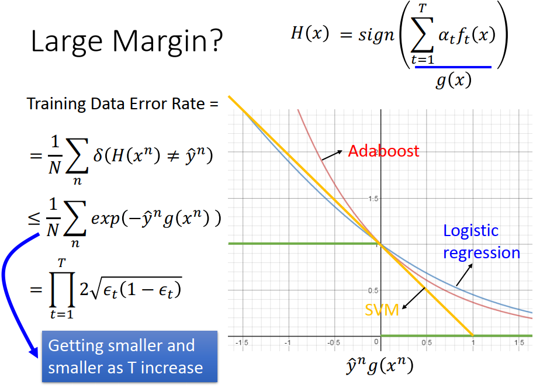

那为什么可以让 margin 增加，这边就是要说明一下为什么AdaBoost 可以让 margin 增加，那我们刚才已经把 error rate 的式子列出来，这个是 error rate 的式子，他是绿色 的一条线，然后呢，我们说这个 error 的式子它有一个 upper bound，这个 upper bound 应该红色这一条线，那我们刚才又说 这个 upper bound 是会越来越小的，刚才证明说对每一个 iteration 而言，这个 upper bound 会越来越小，虽然说我们并没有真的对那个 upper bound 去做微分，做gradient descent等等之类的事情，但是我们会让这个 upper bound 越来越小，所以你可以把这个 upper bound  想成就是AdaBoost 的 Objective function，所以 AdaBoost 做的事情是它会去 minimize 一个Objective function，而这个 Objective function 是红色的这一条线，

这边还画了别的方法它的 Objective function，有黄色这一条线是SVM 的 Objective function，蓝色这一条线是logistic regression 的 Objective function，那AdaBoost 的 Objective function是红色的这一条线，

那你会发现红色的这一条线有什么样的特性呢，你会发现说今天在，如果我们是考虑绿色这一条线，我们只要让  $\hat y$​ 乘上  g(x) 到这个图的右边，你的 error 就是 0，到右边以后，如果让   $\hat y$​ 乘上  g(x) 再更靠右，也没什么好处，error 也不会下降，但是如果你看 AdaBoost ，其实 SVM跟 logistic regression 也有同样的效果，你会看到 AdaBoost 这一条线当你的  $\hat y$​ 和  g(x)是 同号在右边的时候，其实 error 并不是0，你可以把   $\hat y$​ 和  g(x)继续再往右，你还是可以得到越来越小的 error，所以就算是现在的error rate 算出来已经是0 了，对AdaBoost 来说还没有结束，还可以再做，还可以再做的更好，因为他可以把   $\hat y$​ 和  g(x)再更往右边推，然后得到更小的error，那这个是 AdaBoost 为什么会 increase 这个  margin ，

#### 实作

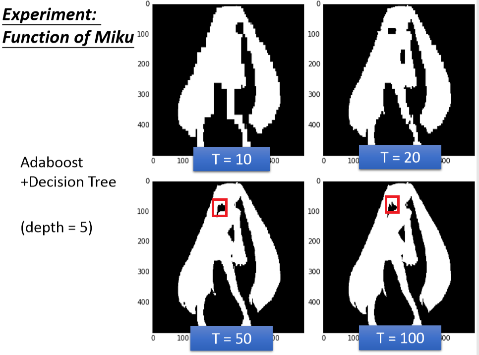

那最后这一页是一个实作，实作一下 AdaBoost+ Decision Tree ，那 Decision Tree 的深度就设为5，我们把很多深度只有5 的 Decision Tree 集合起来，看看它可以变什么样子，那我们之前有讲过说 深度是5  的 Decision Tree ，我们之前用的是初音的function，它没有办法 fit一个初音的function，就算你做 bagging ，做 Random Forest，也没有用 Random Forest，他本来要做的事情，就并不是要让不同 的weak classifier 之间可以互补，它只是要让强的 variance 不要那么大而已，但是 AdaBoost不一样，它可以让 weak 的 classifier 彼此之间是互补的，所以今天就算是 深度是5 的 Decision Tree，一颗没有办法fit 出你的function ，如果你找了10棵，这边T=10代表 AdaBoost iteration 跑10次，所以有10棵深度是5 的 Decision Tree ，那这些Decision Tree他们互相之间是互补的，跟 Random forest 不一样，这10棵 Decision Tree 是互补的，如果是 Random forest 你找10棵，100棵都fit不了这个初音的function，但是现在如果找10棵tree，然后他们彼此之间是互补，你就可以得到比较好的结果，

这是个 初音的function，你可以看到初音的样子，他的脚 是歪的，如果有20棵树你就可以做的好很多了，只是这个脚的地方还是有点奇怪的东西，如果50棵树几乎就可以fit出你的 function，但其实这样还没有结束，因为这边其实是有一个 毛的，要把那一个毛做出来才行，所以如果有100棵树的话，你就可以几乎是完美的fit出那个初音的function，所以你从这个 例子里面看到说 Boost 跟这个 Bagging 是很不一样的，

## Gradient Boosting

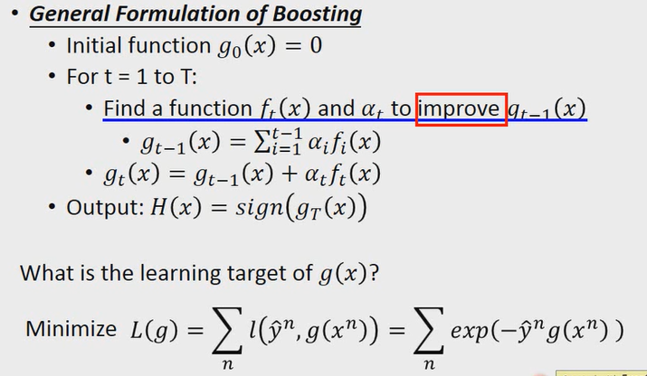

那接下来我们想要讲的是 Gradient Boosting，那这个 Gradient Boosting他是刚才那个 Boosting 演算法更 general的版本，整个 Boosting 的演算法 in general 你可以看成是以下这样的 algorithm

我们现在跑T个  iteration ，那每次在这个 T个 iteration 里面，我们都要找一个function f~t~(x)跟α~t~，我们找一个 weak classifier  f~t~(x) 跟他的 weight α~t~，那这些人合在一起会 improve 一个g~t−1~(x)，g~t−1~(x)是什么，g~t−1~(x)是把过去所有的，已经找出来的 function 根据他们的weight ，weighted sum 的结果就是这个 g~t−1~(x)，

我们已经有一个 g~t−1~(x) 了，我们要找一个 f~t~(x)跟α~t~它跟  g~t−1~(x) 是互补的，我们把这个  f~t~(x)跟α~t~加到  g~t−1~(x) 以后变成 的 g~t~(x) 会比原来的 g~t−1~(x) 更好 ，

最后我们跑完 T个  iteration 就得到 H(x)，

现在的问题就是怎么找到这个比较好的  g~t~(x) 呢，怎么样找到一个  f~t~(x)把它加到g~t−1~(x) 以后得到的  g~t~(x) 是比较好的呢，

那你要为g~t~(x) 先设一个目标，我们说在做Machine Learning 的时候，你要设一个  Objective function，接下来你就是调整你的参数去 Maximize  Objective function，或者是minimize 你的 cost function ，现在我们要做的事情就是要minimize 这个 cost function 

那这个 cost function 怎么写呢，对某一个function g~t~(x)，它的 cost function 怎么写呢，我们写成summation over 所有的 training data n $L(g)=∑_nl(\hat y^n,g(x^n))$​,然后l 是loss function，l 这个function 是算  $\hat y^n$​ 跟 g(x^n^) 他们之间的差异 ，比如说你可以用 cross entropy或者是Mean Square Error等等来计算  $\hat y^n$​ 跟 g(x^n^) 之间的差异，

那我们现在把这个 l 定为 $exp(-\hat{y}^ng(x^n))$​,那这个定义合不合理呢，这个定义应该是合理的，因为这个式子，如果我们要minimize 它的话，如果要minimize  $exp(-\hat{y}^ng(x^n))$​,我们会希望  $\hat y^n$​ 跟 g(x^n^) 尽量 同号，而且他们同号相乘的时候要越大越好，

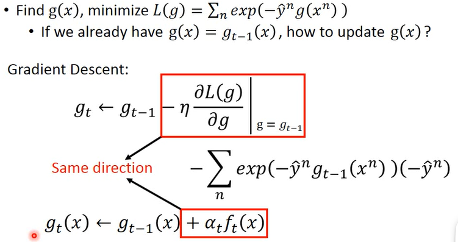

那怎么minimize 这个function L(g)呢，这一步呢可能需要稍微的想一下，我们这边这件事比较抽象，就是我们其实要用gradient descent 来找一个新的 function g~t~, 它可以minimize loss function L(g)，

我们要把 g 这个 function 对 L(g)做微分，算出它的 gradient ，把他的 gradient 算出来以后，我们这边写的，这边 notation 我觉得好像没有用的很好，这里我应该写三角形比较对，把它写在 gradient 的式算比较对，没关系，大家知道我的意思

我们要把function  g 对 L(g) 算它的 gradient ，然后再用 这个 gradient 去update g~t-1~ 得到 g~t~，那这样新的 g~t~跟原来的  g~t-1~比起来，它会让loss function 比较小，这样大家知道我的意思吗，那我猜这边你第一下你就卡住了，就是什么叫做拿一个function 对 L(g) 去做 gradient 呢，function g 又不是参数，如果是neural network 参数 θ你知道怎么对  L(g) 算gradient ，但是如果是一个function g,他要怎么对 L(g) 做gradient 呢，

这个地方你可以这样想，其实一个 function g(x), 一个假设横坐标就是x,那他其实高维，不过这边就画一维意思一下，那他其实一个function比如说长这个样子的是 g(x)（黑板），你可以想成它的每一点就是一个 参数，这样大家可以想象吗，我取一个 x~1~，我得到一个 g( x~1~)，我取一个x~2~，我得到一个 g( x~2~)，假设我这个x 取的非常非常的密，那其实 g(x)它就是一个 vector g( x~1~)跟 g( x~2~)，点点点点这样，这个vector其实就是这个function 的参数，你可以调整这个参数然后就改变了这个function的形状，

你要决定这个function 的形状是什么，你就调整那些参数，这个function的形状就变了，所以你其实可以把一个function 想成它其实就是有无穷多个参数，大家可以想像吗，你既然可以接受他是参数的话，那我们就可以把它对L(g)做偏微分 ,你还是可以说我如果改变 g在某一个点的位置的值，他对L(g)的影响有多大，所以你还是可以算出 g 对L(g)的偏微分，这个是如果从 gradient descent 的角度来考虑的话是这个样子，

如果从Boosting 的角度来看的话，我们说 Boosting 做的事情是找一个f~t~(x)和α~t~加到 g~t−1~(x) 后变成 g~t~(x) ，那怎么找这个 f~t~(x)和α~t~呢，那我们就会希望 f~t~(x)和α~t~这一项其实就是这一项(两个红色框框里的式子)，或者是只至少他们的方向要是一样的，因为前面还有乘一个learning rate，所以这两个式子一模一样其实没有必要，但是希望他们的方向是一样的，如果  f~t~(x)的方向跟这个 微分的方向一致的话，那我们把这个  f~t~(x)加给 g~t−1~(x)就可以让新的g~t~(x)  的loss 变小，这个是你要抽象的部分

接下来就是假设我们定义说L(g) 就是长这样子的话$-\sum\limits_{n}exp(-\hat{y}^ng_{t-1}(x^n))(-\hat{y}^n)$​，那对g 做偏微分他得到的值是多少呢，把L(g) 对g 做偏微分，这边是  $exp(-\hat{y}^ng(x^n))$​，这边是$exp(-\hat{y}^ng_{t-1}(x^n))$​ ，那把它对 g 做偏微分的话得到的值是多少呢，Exponential的部分做偏微分以后是不变的，g 其实是我们的参数，对Exponential的指数项做微分的话，你这边得到的是$(-\hat y^n)$​ ,前面这边有一项负号，我把它拿下来，这边省略掉了learning rate，那负号是可以消掉的，所以我们得到了这样的式子$\sum\limits_{n}exp(-\hat{y}^ng_{t-1}(x^n))(\hat{y}^n)$​，那我们会希望说 f~t~(x)跟这个式子的方向越一致越好，我们希望说 f~t~(x)跟这个式子的方向越一致越好，

所谓的方向越一致越好是什么意思呢， 因为每一个function你都可以把它想成是一个vector，只是这个 vector有无穷多维，所以 f~t~(x)是个function，他是一个vector，它有无穷多维，这个也是一个vector，这个vector有无穷多维，如果你觉得无穷多维很难想象的话，你可以说我们只考虑training data有出现的x ,那他的维度就是有限的，training data有100W笔data，他就是100W维，

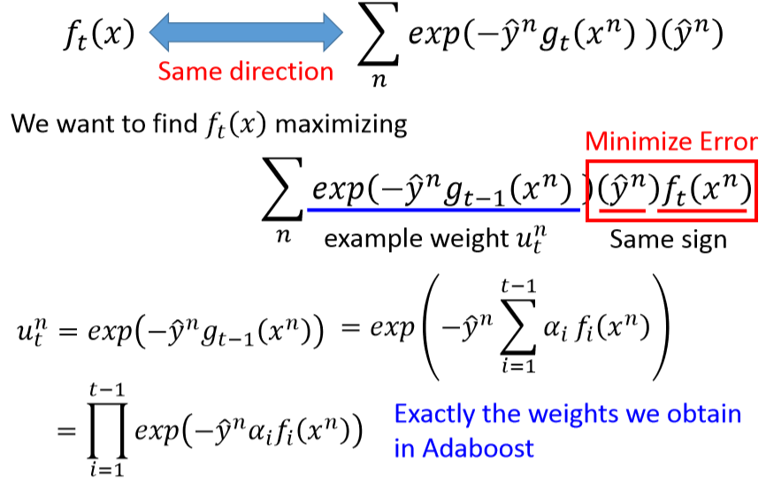

我们今天希望  f~t~(x)跟这个式子他们的方向越一致越好，怎么让他越一致越好呢，因为 f~t~(x)是我们要找的目标，我们要去找出 f~t~(x)，所以我们要怎么找这个  f~t~(x)呢，我们要找的这个 f~t~(x)希望说，如果我们把这个 f~t~(x)乘上这一项，这个值可以越大越好，如果这个值越大越好，就代表 f~t~(x)跟这个式子他们的方向越一致，

那这个式子要怎么看呢，这个式子可以想成说我们现在对每一笔training data，我们都希望$\hat y^n$​ 跟f~t~(x)他们是同号的，然后每一笔 training data前面都乘上了一个weight，这个weight是u~t~^n^,这个都乘上一个weight，这个weight 是$exp(-\hat{y}^ng_{t-1}(x^n))$​，这个weight $exp(-\hat{y}^ng_{t-1}(x^n))$​到底是什么呢，你把  g~t−1~(x)的式子带进去，g~t−1~(x)是一堆  f~i~(x^n^) 乘上他的weight 的summation，然后再把相加 的这一项提出来变成连乘，你就会发现说这个 weight exactly 就是AdaBoost 的 weight，

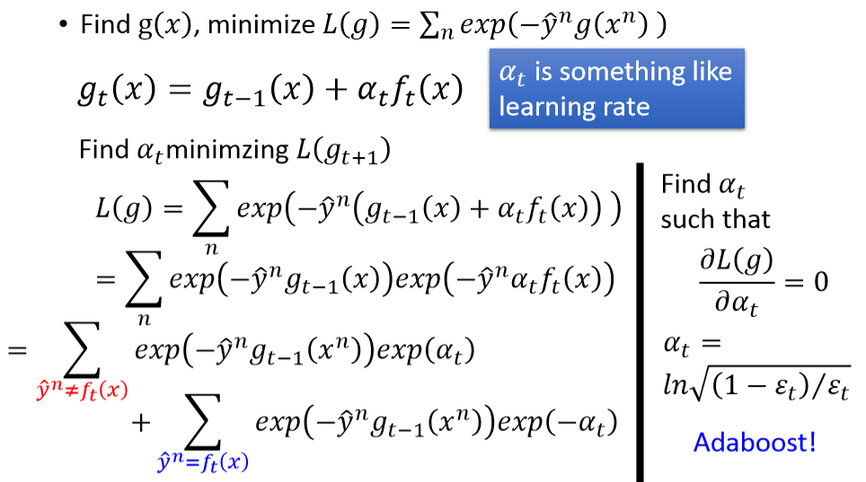

所以呢我们今天找出来的 这个f~t~(x)，其实就是AdaBoost 里面找出来的 f~t~(x),所以在AdaBoost 里面，我们找一个weak的 classifier  f~t~(x) 的时候，你可以想成是好像在做gradient descent一样，有了这个  f~t~(x)以后，你把这个 f~t~(x)加到这个 g 里面，会让g 的loss 变小，

再来问题就是怎么决定这个α~t~呢，今天这个α~t~ 他的作用 就很像是learning rate 一样，今天在一般做gradient descent 在 train一个neural network的时候，那个learning rate 你就是设个 fix 的值啊，或者是用种种，比如说 sampling ？？的learning rate 的设法来设它，

但是在这边我们要做的事情是给定了f~t~(x) 以后，穷举各种不同可能的 α~t~，去试不同可能的 α~t~，看看哪一个 α~t~可以让 g~t~(x) 的loss最小，找完f~t~(x) 以后，把f~t~(x) 固定下来，试不同的 α~t~，看看哪一个 α~t~可以让 g~t~(x)的loss 最小，

那为什么这边会选择这样子的做法呢，因为在做 gradient descent的时候， 在train neural network的时候 算参数的 gradient 其实是比较快的，所以你可能不会稀罕说你的learning rate设的好不好，如果你今天的learning rate设的太小，反正你就多算几次gradient ，多跑几步就行了，但是今天在这个 gradient Boosting的方法里面，这个 f~t~(x) 他是一个classifier，你在找f~t~(x) 的过程中，它的运算量可能就可能是很大了，甚至如果你的f~t~(x) 是一个neural network，你要把f~t~(x) 找出来的时候，本身你就需要很多次的 gradient descent 的iteration，所以今天既然找出来f~t~(x) 以后你就要好好的珍惜它，把它的利用价值发挥到最大，

所以在这边 Gradient Boosting采取的方式是，既然已经找出f~t~(x) ，我固定住f~t~(x) 然后硬调一个最好的learning rate  α~t~，穷举所有的 learning rate  α~t~看哪一个  α~t~可以让我们的loss 掉的最多，但实际上你不可能真的去穷举所有的   α~t~一个一个去试试看，这边做的事情其实就是看说，解一个 optimization 的problem，看说哪一个  α~t~可以让loss 最小，

那怎么做呢，我们这边就把那个equation掠过，实际上你做的事情就是计算α~t~跟 L(g) 的 微分，然后再看说α~t~ 的值是多少的时候，这个微分是0，这样就可以把这个极值找出来，那巧合的是找出来的α~t~就是$ln\sqrt{(1-\epsilon_t)/\epsilon_t}$​,就是 AdaBoost 里面的那一个weight，所以 AdaBoost整件事情你就可以想成它也是在做gradient descent，只是我们的 gradient 是一个function，然后learning rate有一个很好的方法可以决定这个 learning rate，

因为 Gradient Boosting 的想法有一个好的地方是我们现在可以任意更改你的Objective function。我们刚才说我们定了一个 Objective function是  $exp(-\hat{y}^ng(x^n))$​，那你永远可以定其他的Objective function，那你就可以创造出不一样的 Boosting的方法，

## Ensemble: Stacking

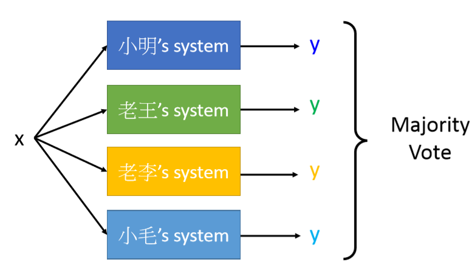

那最后一个我要讲的 Ensemble的方法是Stacking，那Stacking是什么呢，那个Stacking非常的实用，我觉得你做 final project 里面呢这个是非常实用的方法，那现在到了期末，大家都很忙，那你一组其实有4个人，然后想你可能就4个人每一个人都弄了自己的一个model，你选好一个 final project 题目，然后每4个人都弄好了一个自己的model，但是最后要怎么让你的 performance 再提升呢，你要把4个人的model combine 起来，也就是说你把一笔data x丢入到四个model里面，然后每一个model 都会给你一个output ，你再把这四个output 想办法把它合并起来，得到最终的答案，比如说你可以用Majority Vote，假设是一个分类的问题的话，你可以用 Majority Vote，最多系统选择哪一个class，那那个class 就是正确答案，  、

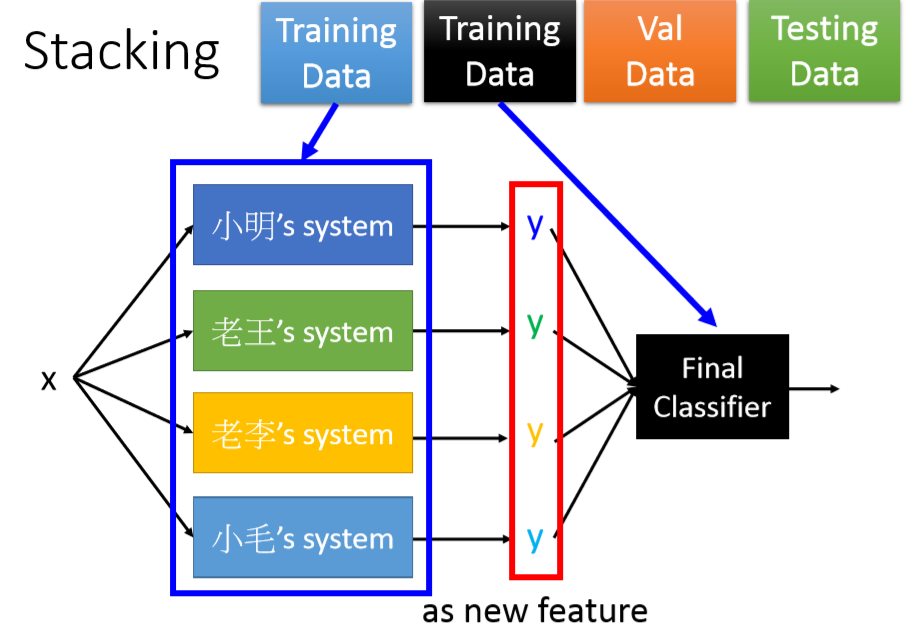

但是你今天会遇到问题就是并不是所有的系统都是好的，并不是所有的model都是好的 ，有些model 可能是烂的，比如说可能小毛特别弱，它做的系统是跟random 一样，所以如果你把它的系统的权重和其他系统设一样，那这样不行，这样你整个 performance 会坏掉，但是如果你本来就知道小毛特别弱，你把它的权重设的很低的话，就伤了它的自尊心，所以怎么办呢，我们要去learn 一个 classifier ，

这个 classifier 是这样，他把前面这些 system 的output 当作input，也就是说这些 system 的output 对最后这个 classifier 来说 它就好像是一个feature 一样，他把这些 system 的output当作feature ，然后再去决定最终的结果是什么，这个最终的classifier ，你就不需要太复杂，

比如说前面如果已经用 neural network 了，都已经用好几个 hidden layer 的 neural network了，也许final 的classifier 就不需要 再是一个好几个hidden layer 的neural network，它可以是 logistic regression 就行了，

那在做这个实验的时候你要注意说，我们知道我们会把 training set，我们会把有label 的data分成 training set 跟validation set，在做 stacking 的时候你要把 training set 再分成两部分，一部分的training set，拿来learn 这些 classifier ，那另外一部分的training data 拿来learn这个 final classifier，为什么要这么做呢，因为有的要拿来做 stacking 的这些前面的classifier ，它可能只是fit training data，

举例来说可能小明的code 就是乱写的，它其实它的classifier 是怎么试都不会错，它的classifier 就是如果有一笔data进来跟 training data 一样，他就把它的label吐出来，不然他就什么事都没有做这样子，他可能就写一个很奇怪的很烂的，很异常 over fitting 的code，但是如果你今天的这个 final classifier 的 training data跟这些system 用的training data是同一组的话，你会发现小明的classifier 好强，error rate 是100% ，我们都参考小明的classifier 就好了，但是其实小明的classifier 它什么事都没有做，它只是硬把training data 记起来而已，所以今天你在train final classifier 的时候，你必须要用另外一笔training data 来train 这个 final classifier ，不能跟前面train的这些系统的 classifier 一样，如果你有这个 final 的 classifier 以后，你就可以给不同的系统不同的权重，那如果小毛的系统特别差的话，那final classifier 就会给他 比较小的权重，比如是0这样子，那现在小毛的自尊心其实还是会被伤害，只是他是被机器伤害的，所以就可以维护团队的和谐，

