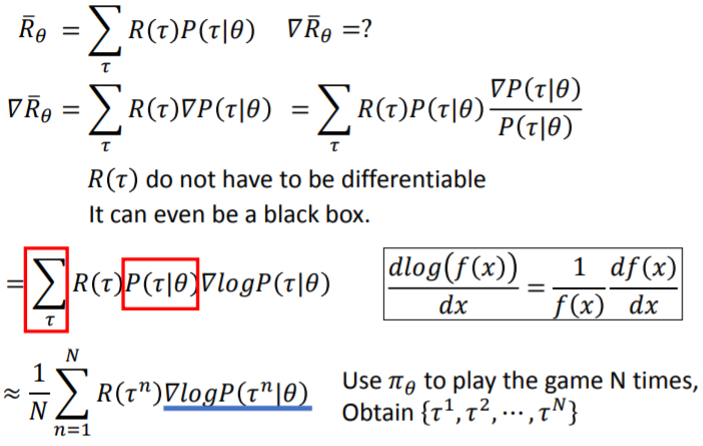

[TOC]

# P 39 28- Deep Reinforcement Learning-Scratching the surface<!-- 66' -->

## Deep Reinforcement Learning 

Reinforcement Learning 其实是一个很大的题目，所以我在下面加了一个 subtitle，就是学一些皮毛这样，剩下时间我们就讲一些皮毛，这年头呢，讲到 Deep Reinforcement Learning ，大家都会觉得说很兴奋，因为在2015年2月的时候，Google 先在nature上发了一篇用reinforcement learning 的方法来玩akari的小游戏，然后都可以痛鞭人类，然后后来在 2016的春天，又有大家都耳熟能详的alpha go，也是可以痛鞭人类，那 David Silver 就说他觉得说 AI 就是 Reinforcement Learning加Deep Learning ，就是Deep Reinforcement Learning : AI = RL + DL，这个东西现在讲起来大家都觉得就很兴奋这样子，

## Scenario of Reinforcement Learning

那这个 Reinforcement Learning 是什么呢，在Reinforcement Learning里面你会有一个Agent跟一个Environment,这样讲可能有点抽象，等一下会讲比较具体的例子告诉大家说这个Agent跟Environment他们分别可以是些什么。这个Agent它会有Observation，他会去看这个世界，看到世界的某些种种的变化，那这个Observation又叫做State，你在看Deep Reinforcement Learning的时候你常常会看到一个词叫做State，其实这个State 就是Observation，这个State 这个词我觉得总是很容易让人误导，因为你听到State这个词，你总是会想的好像是一个，他翻译应该翻译成状态，这个状态感觉的系统的状态，不是，这个State 是环境的状态，大家了解我的意思吗 ，所以我觉得这个 Observation这个词或许是更贴切的，就是你的 Machine 所看到的东西，所以这个state其实指的是这个环境的状态，也就是你的machine 所看到的东西，

所以在这个  Reinforcement Learning 领域才会有这种这个 胖DP这种做法，所谓 胖DP 就是 partial observable state， 我们 state 只能观察到一部分的情况，如果今天这个 state 是 machine 本身 的State 那怎么 会有那种 State 怎么会 不知道的情况，那就是因为这个State 其实 是，所以如果你把state当作machine 的state，你会搞不清楚那个 partial observable state 那一套想法到底是在干嘛，今天就是因为state 其实是 环境的 state，所以机器是有可能没有办法看到整个环境所有的状态， 所以才会有 这个 partial observable state 的这个想法。总之我今天没有要讲那个，但是这个state 其实就是 Observation，如果以后你有机会，看看文献，再看看我说的对不对，

那 machine会做一些事情，它做的事情就叫做Action，它做的这些事情会影响环境，会跟环境产生一些互动，对环境造成的一些影响，因为它对环境造成的一些影响 ，它会得到Reward，这个Reward就告诉它说，它的影响是好的还是不好的。

这边举一个抽象的例子，比如说机器看到一杯水，然后它就take一个action，他action就是把水打翻了，那Environment 他就会得到一个negative的reward，因为人告诉它说不要这样做，所以它就得到一个负向的reward。接下来因为水被打翻了，在Reinforcement Learning 里面这些发生的事情 都是连续的，因为水被打翻了，所以接下来它看到的Observation 就是水被打翻的状态，然后它看到水被打翻的状态 ，它决定 take另外一个action，他决定要把它擦干净，人觉得他做的很对，它就得到一个positive 的reward。那机器要做的事情，也就是他生来的目标就是他要去学习采取那些action，他根据过去的 得到的positive reward 还有negative reward ，他去学习采取那些 可以让reward 被 maximize 的那些 action 。这个就是他存在的目标。

### Learning to play Go

如果我们用 alpha go为例子的话，一开始machine的Observation是什么，machine的Observation就是棋盘，棋盘你可以用一个19*19的matrix 来描述，如果是 alpha go 他的Observation 就是棋盘，然后 接下来它要take一个action，它take一个action是什么呢，它take  action就是落子的位置，它take一个action 就是放一颗棋子到棋盘上，落一子这样，下在这里，下在3之3。

接下来在围棋这个游戏里面你的 Environment 是什么，Environment 其实就是你的对手，所以你下的棋，你落子在不同的位置你就会影响 你的对手的反应，总之你落子以后，你的对手会有反应，你看到的这个Observation就变了，假如对手落一个白子在这个地方，你Observation 就变 。机器看到另外一个Observation以后，他又要决定它的action，所以他再take一个action，他再采取某一个行动，比如说再落子在另外一个位置。用机器下围棋就是这么一回事。

那今天在围棋这个case里面，他是个还蛮难的Reinforcement Learning 的task，因为在多数的时候，你得到的reward都是0，因为你落子下去通常都是什么事也没发生这样子，你得到的reward 就是0。只有在你赢了，或者是输的时候，你才会得到reward，如果你赢了你就 得到reward是1，如果是输了，你就得到reward是-1。所以做Reinforcement Learning困难的地方就是有时候你的reward是很 sparse的，只有少数的 action ，只有在少数的情况 你才能够会得到reward。所以他的难点就是机器怎么在只有少数的action 会得到 reward的情况下去发掘正确的action。这个是一个很困难的问题

那对machine来说，它要怎么学习下围棋呢，他就是不断的找一某个对手一直下一直下，有时候输有时候赢，然后接下来它就是调整他看到的 Observation和action之间的关系，他里面有一个model，他会调整说看到 Observation 他要采取什么 action，他会调整那个model让它得到的reward可以被maximize。

#### Supervised v.s. Reinforcement

我们可以比较一下如果今天要下围棋的时候，用Supervised learning 和Reinforcement learning 你得到的结果会有什么样的差别，你的training 的方法有什么样的差别。如果是Supervised learning 的话， 你就是告诉机器说看到 这样子态势就落子在 这个 位置，看到另外一个 盘式你就落子在另外一个位置。那 Supervised learning 会不足的地方当我们用 Reinforcement learning 的时候往往是连人都不知道正确答案是什么，所以在这个 task你不太容易做Supervised learning 。因为在围棋里面看到这个盘式到底下一个位置最好的点是哪里，其实有时候人也不知道，机器可以看着棋谱学，但棋谱上面的这个 应对不见得是最optimal,所以用Supervised learning 可以学出一个会下围棋的Agent ，但他可能不是真正最厉害的那一个人，如果用 Supervised learning 就是machine从一个老师那边学，那个老师会告诉他说，每次看到这样的盘式i你要下在什么样的位置，看到这样的盘式你要下在什么样的位置，这个是 Supervised learning

如果是Reinforcement 呢，就是让机器就不管他，他就找某一个人去跟他下围棋，然后下一下以后，如果赢了他就得到positive的reward，输了就得到 negative 的 reward ，赢了他就知道说之前的某些下法可能是好的，但是没有人告诉它在这几百步里面哪几步是好的，哪几步是不好的，没有人告诉他这件事，他要自己想办法知道。Reinforcement learning 里面你是从过去的经验去学习，但是没有老师告诉你说什么是好的，什么是不好的，machine要自己想办法，那其实在做Reinforcement learning 下围棋的这个task里面，machine需要大量的training 的example，他可能要下3000 W盘以后他才能够变得很厉害，但是因为没有人可以跟machine 下3000 W盘，大家都知道 alpha go的解法就是learn 两个 machine，然后他们自己 互下。那我们知道说 alpha Go其实 是先做Supervised Learning，machine先learn 得不错以后，再让他去做 Reinforcement learning 

### Learning a chat-bot

Reinforcement Learning 也可以被用在 chat-bot上面。怎么用呢，我们之前其实也有讲过 chat-bot 是怎么做的，就是learn 一个 Sequence-to-sequence 的model ，input 是一句话，output 就是机器的回答。

#### Supervised v.s. Reinforcement

如果你是用 Supervised Learning learn 一个chat-bot ，你就是告诉machine 说如果有人跟你说“hello”，你就要讲“hi”。如果有人跟你说“bye bye”，你就要说“good bye”。这个是 Supervised Learning 的 learn 法

如果是Reinforcement Learning 的learn 法就是让machine胡乱去跟人讲话，讲一讲以后，人最后就生气了，machine就知道说他某一句话可能讲得不太好。但是没人告诉它说他到底哪一句话讲得不好，它要自己去想办法发掘这件事情。

### Reinforcement Learning

这个想法听起来很crazy，但是真正有chat-bot是这样learn的，这个怎么做呢，就是因为你要让machine 去跟人一直讲话，然后学习说 看出人生气，或者是没有生气然后去学怎么跟人对话，这个学习太慢了，你可能要讲好几百万次以后，你要跟好几百万 人对话以后才会学会。但是如果一个Agent 要跟几百万人对话的话，大家都会很烦，因为没有人要跟他 对话，所以怎么办呢，就用Alpha Go  style的讲法，他Learn  两个agent，然后让它们互讲这样子，Learn  两个chat-bot，然后就让它们互讲

然后他们可能都乱讲，然后有一个人说“see you",然后另外一个人就说“see you"，然后另外一个再说“see you"， 就陷入无穷的loop这样，然后就乱讲，就是让两个chat-bot去对话，然后他对话完以后还是需要有人告诉它说它们讲得好还是不好。

所以如果是在围棋里比较简单，因为围棋的输赢是很明确的，赢了就是positive ，输了就是 negative ，输赢你就写一个程式来判读就好了，那可是如果是对话的话就很麻烦，因为你可以让两个machine去互相对话，他们两个可以对话好几百万次，但是问题就是你不知道这个对话，没有人告诉那两个machine 说你们现在聊天到底是聊得好还是聊得不好，所以这算是一个尚待克服的问题。

那这个在文献上的方法是，这个方法可能不见得是最好的方法，他说就定个rule，我们就人去写一些规则，那这个规则其实在paper 里面也写的是，也是蛮简单的，蛮简单的几条规则，这几条规则会去检查说，我看过去那两个Agent对话的记录， 如果对讲得好的话，就给它positive 的reward ，讲得不好就给它negative 的reward，那讲得好或不好就是人自己主观定，所以也不知道人定的好不好， 然后machine就从它这个reward 里面去学说怎么讲才是好。

其实我可以在这边做一个预言就是我觉得接下来就会有人用GAN 来learn 这个chat-bot。虽然现在还没有看到，但我相信很快就会有人干这么一件事，这个怎么做呢， 你就learn 一个 discriminator，然后这个discriminator他会看真正人的对话跟那两个machine的对话，就 判断说你们现在这两个agent 的对话像不像人，如果像的话，他会去抓说像人还是不像人，然后接下来那两个agent的对话他们就会去想要骗过那个discriminator，让他讲的越辣越像人，那个discriminator判断他说像人或不像人的 这个结果就是reward， 他等于是用discriminator自动learn 出给reward的方式，我相信很快就会有人做这么一件事了。其实这个 Reinforcement Learning 有很多的应用，今天他特别适合的应用就是 如果有一个task人也不知道怎么做，那你人不知道怎么做就没有label data，这个时候用 Reinforcement Learning 是最适合的。

### More applications

比如说在语音实验室里面，我们有做让machine 学会做Interactive retrieval，所谓Interactive retrieval 的意思是说有一个搜寻系统，那machine 跟他说我想要找跟 US President有关的事情，那machine可能觉得说这个US President太废了， 很多人都是美国总统，到底是要知道什么跟美国总统有关的事情呢，machine就会反问 他一个问题，要求他 more precisely ，他说他要找跟 Trump 有关的事情，那machine就反问他说你是不是要找的是跟选举有关的事情等等， 但是machine 要反问什么问题这个人也不知道，我们人也不知道要问什么样的问题才是好的，但是你可以用  Reinforcement Learning 的方式来让machine 学 说问什么样的问题它可以得到最高的reward，那你的reward 可能就是最后搜寻的结果使用者觉得有多好，越好就是reward 越高，但是每一次machine只要每问一个问题，他就会得到一个negative的 reward，因为每问一个问题对人来说就是actual error，所以应该要有一个 negative 的reward

### More applications

其实那 Reinforcement Learning 还有很多applications，比如开个直升机，开个无人车呀，或者是据说最近deep mind 用 Reinforcement Learning 的方法来帮Google 的server节电，现在也有人拿 Reinforcement Learning 来让machine 产生句子，你知道在很多 task里面machine 都需要产生句子，比如说Summarization或者是translation。那这种产生句子的task有时候还蛮麻烦的，为什么，因为有时候machine 产生出来的句子他是好的，可是却跟答案不一样，因为 translation  有很多种，有一个标准的答案是那样，但是并代表说machine 今天产生出来的跟标准答案不一样他一定是坏的， 所以这个时候如果你可以引入Reinforcement Learning 的话其实是会有帮助的，

### Example: Playing Video Game

那Reinforcement Learning最常用的application ，现在最常用的application就 是打电玩。打电玩 的 application 现在已经满坑满谷，那如果你想要玩的话， 现在都有现成的environment，可以让你在那个现成的environment 上面去玩，一个叫做Gym,这都是open ai 那个公司开发的，那这个Gym 比较旧，所以最近他们又开了一个Universe ，Universe里面有很多那种3D的游戏。那每次讲说让machine 玩游戏，就会有一个问题说，machine不是本来就已经会玩游戏了吗，在那些游戏里面不是本来就已经有一个AI了吗， 但是现在你要让machine 用Reinforcement Learning 的方法去学玩游戏，跟那些已经内建的AI 其实是不一样的，因为machine他学怎么玩这个游戏，其实是跟人一样，他就是它是坐在荧幕前的，也就是说他看到的东西并不是从那个程序里面去截取什么东西出来 ，他看到的东西就是那个荧幕画面，他看到的东西跟人一样就是pixel，当然用Reinforcement Learning让machine学习玩这些 电玩的时候，machine 看到的就是pixel， 再来呢他要take哪一个 action，他看到这个画面它要做什么事情它自己决定，并不是人写程序告诉它说 if 你看到这个东西then你做什么。它是自己学出来的。

举例来说你可以让machine 玩space invader，space invader就是叫小蜜蜂还是大黄蜂，他的translation不太重要，那我们等一下举例的时候都用这个来做例子，都用space invader 来做例子，所以我们可以稍微解说一下这个游戏，在这个游戏里面，你可以take的actions有三个，就是左右移动跟开火这样。

然后他怎么玩这个video game 呢，整个scenario 是这个样子，首先你看到 machine会看到一个observation，这个observation就是荧幕的画面，也就是荧幕的画面里面的pixel。那开始的observation  我们就叫它 s~1~，所以一开始machine看到 一个 s~1~， 这个 s~1~其实就是一个matrix，这个matrix其实就是每一个pixel就是用一个vector来描述他，所以这边应该是一个三维的tensor，这个是一个matrix但是他是有颜色的，所以他是3维的 。

那machine看到这个画面以后，他要决定它take哪一个action，他现在只有三个action可以选择。比如说它决定 要往右移。那每次machine take一个action以后，它会得到一个reward，但是因为只是往右移，这个reward是什么， 这个reward就是左上角的这个分数，就是他的reward。那往右移不会得到任何的reward，所以得到的reward r~1~ 是 0，

那machine take完这个action 以后，他 的action会影响了环境，所以machine看到的observation就不一样了。现在machine 看到的observation叫做 s~2~，那有点不一样，因为他自己往右移了，当然这些外星人也会稍微动一点，不过这个跟machine take的action是没有关系的，但是有时候环境的变化本来就会跟那个action 没有关系，有时候环境的变化会是纯粹随机的，跟machine take的action是没有关系的。那看到s~2~，

然后接下来，这边要讲一下，通常环境会有一些random 的变化 ，而环境这个random 的变化，跟machine take的action 其实是没有什么关系的，比如说这边突然多出一个子弹，那这些外星人什么时候要放子弹，我觉得应该就是随机的。

然后machine看到 s~2~ 以后他要决定它要take哪一个action，这个是 a~2~,假设它就决定说他要射击，然后他就决定射击，假设他成功的杀了一只外星人，他就会得到一个reward，那我们发现说杀不同的外星人，其实得到的分数是不一样的。假设他杀了一个5分的外星人，那他看到的 observation 就变了，少了一只外星人。这个是第三个observation。

这个process 就一直进行下去，直到某一天在第T个回合的时候， machine take action a~T~，然后他得到 的reward r~T~进入了另一个step，这个step是一个terminal 的step，它会让这个游戏结束，那在这个space invader游戏里面 terminal  step就是你被杀死，就结束了。

所以今天这个machine 可能take一个action比如往左移，那得到reward 0，然后不小心就撞到alien的子弹，然后他就死了，所以游戏就结束了。那从这个游戏的开始到结束，叫做一个episode，对machine 来说他要做的事情就是不断的去玩这个游戏，他要学习怎么在一个episode里面去maximize 他可以得到的 reward，去maximize它在整个 episode 里面可以得到的total reward。就是他必须要在死之前杀最多的外星人，他要杀最多的外星人，而且他要可能需要闪避外星人的子弹，让自己不要那么容易被杀死。

### Difficulties of Reinforcement Learning

那Reinforcement Learning的难点在哪里呢？它有两个难点

#### Reward delay

第一个难点是，reward 的出现往往是会有delay，比如在space invader里面其实只有开火这一件事情才能得到reward，你都是开火以后才得到reward， 但是如果machine只知道开火以后就得到reward，他最后learn出来的结果就是它只会疯狂开火。对它来说，往左移往右移没有任何reward，他不想做。但实际上，往左移往右移这些moving，它对开火能不能够得到reward 这件事情是有很关键影响的。但是虽然说这些往左移往右移的action，本身没有办法让你得到任何reward，但它可以帮助你在未来得到reward，这件事情其实就像是规划未来一样，所以machine需要有这种远见，他要有这种vision，他才能够把这些电玩玩好。那其实在下围棋里面，有时候也是一样的，有时候短期的牺牲可以换来最后比较好的结果。就像是虚竹把自己的子堵死一块，结果最后反而赢了。

#### Agent's actions affect the subsequent data it receives

那另外一个就是你的Agent所采取的行为会影响他之后所看到的东西，所以你的Agent要学会去探索这个世界。比如说如果在这个space invader里面，你的Agent总是只会比如说往左移往右移，它从来不开火，他永远不知道开火可以得到reward，或者是他从来没有去试着击杀最上面紫色的母舰，他就永远不知道说击杀这个东西可以得到很高的reward，所以要让machine知道说要去explore 这件事情，它要去探索他没有做过的行为，虽然说这个行为可能有好的结果，坏的结果。但是探索没有做过的行为在Reinforcement Learning里面也是重要的一件事情。

## Outline

我知道说这个 Reinforcement Learning 其实有一个 typical 的讲法，你要先讲这个Markov decision  process，但是如果我们今天先讲 Markov decision  process的话，讲完Markov decision  process其实就下课了，所以你就会只听到Markov decision  process，而且太多课有讲Markov decision  process，所以我就觉得我们不要从Markov decision  process开始讲起，那我知道说在Reinforcement Learning 里面过去很红一个方法叫做 deep to network，但我们今天也不讲deep to network，因为为什么呢，因为其实那个东西现在都已经被打趴了，现在最强的方法叫做A3C ,就是 deep Reinforcement Learning已经有点退流行了，你会发现说 在那个Gym里面最强的那些agent都是由A3C，像我们刚才看到的那一个例子，大家看到那个自己玩 space invader 的例子就是用A3C 的,所以我想说我们不如直接来讲A3C这样子，就是迎头赶上的概念，我们直接来讲最新的东西，

那要讲A3C之前，我们需要知道什么事情呢，我们需要知道说这个Reinforcement Learning的方法 分成两大块，一个是Policy-based的方法，一个是Valued-based的方法。Policy-based的方法 其实应该是比较后来才有的， 应该先有Valued-based的方法，所以一般教科书都是讲 Valued-based的方法 比较多，讲 Policy-based的方法比较少。比如说如果你看那个？？，就是有一本那个deep Reinforcement Learning 的 ？？，这是？？写的，他在97版的教课书里面，Policy的方法就讲的比较少，一节而已，但是他今年又再版，他还在撰写中，这个我暑假的时候载下来教科书的内容跟最近载下来的内容是完全不一样的，差很多，那他最近在改那本教科书，那 Policy-gradient 就有一整个章节在讲 Policy-gradient

那在Policy-based的方法里面，你会learn一个负责做事的Actor，在Valued-based的方法你会learn一个不做事的Critic，他专门批评不做事。但是我们要把Actor跟Critic加起来叫做Actor+Critic的方法。现在最强的方法就是Asynchronous Advantage Actor-Critic这个(他的缩写叫做A3C)，我们等一下就讲一下 Actor-Critic这个方法。那你可能会说最潮的 Alpha Go是用什么方法，如果你仔细读一下Alpha Go 的paper 的话，他是各种方法大杂烩，他里面其实有Policy-gradient 的方法，Policy-based的方法，他也有Valued-based的方法，那其实他还有model-based的方法，就是没有讲到  model-based的方法，所谓model-based的方法是指Monte Carlo Tree Search那一段算是model-based的方法，不过像model-based那种方法就是你要预测未来会发生什么事，你有一个对未来的世界的理解，那你就预测未来会发生什么事，这种方法其实应该是在只有棋类游戏是比较有用的，如果是像打电玩的话，就没有看到什么model-based的方法很成功的解，在打电玩里面，我想你要预测这个未来会发生的状况是比较难的，未来会发生的状况是难以穷举的，不像围棋虽然未来会发生的状况很多，但你还是可以举出来，但是如果是电玩的话，我就很少看到 model-based 的方法，看起来做model-based 的方法在电玩上是比较困难的。

### To learn deep reinforcement learning ……

以下是一些reference，如果你想学更多的话，Sutton教科书在这里，David Silver有十堂课，他的内容基本是就是base on Sutton 的教科书讲的，他讲了10堂课，每堂有一个半小时，他没讲太多 deep Reinforcement Learning 的东西，但是他有一个deep Reinforcement Learning 的 ？？，在video lecture 的网站上可以找到，另外你可以找到这个open AI的这个Join Schulman,他的这个lecture，他的lecture讲 的是这个 Policy-based的方法

## Policy-based Approach Learning an Actor

### Machine Learning ≈ Looking for a Function

那我们就先来讲怎么学一个Actor，那所谓的Actor是什么呢，我们在开学的时候就有说过说，Machine Learning 在做的事情其实就是找一个Function，那其实在 Reinforcement Learning里面，Reinforcement Learning也 是Machine Learning 的一种，我们要做的事情也是找一个Function。这个Function就是所谓的，Actor就是一个Function。这个Actor 我们通常就写成π，我用 π来代表这个function，这个function的input是什么，这个 Function的input就是Machine看到的observation，它的output是什么，它的output就是Machine要采取的Action。所以observation就是我们现在要找的function 的 input，Action 就是我们现在要找的function 的output，那我们要 透过reward来帮助我们找出这个function ，也就是帮助找出Actor。

### Three Steps for Deep Learning

那在有些文献上，这个Actor又叫做policy，所以你看到policy 的时候他指的就是那个 actor，那我们说找个这个Function有三个步骤，所以deep learning 是很简单的就是3个步骤

#### Neural Network as Actor

第一个步骤就是决定你的Function长什么样子，决定你的Function 的space ，那我们说 neural network 他决定了一个function 的space，所以我们今天 的actor 他可以就是一个neural network，如果你的actor 就是一个neural network，那你就是在做deep Reinforcement Learning

所以这个Neural Network的input 就是machine 看到的 observation，这个observation就是一堆pixel，你可以把它描述成一个， 用一个vector 来描述或者是用一个matrix 来描述。那output呢，output就是你现在可以采取的action，

或者是我们直接看下面这个例子可能会比较清楚，output是什么呢，input就是pixel，那你把Neural Network 当作Actor，那他可能不只是一个简单的feed forward network，因为你的 input现在是一张image，所以你里面应该会有 Convolution layer，所以他应该是会用 Convolutional 的neural network，那 output 的地方呢，你现在有几个可以采取的action，output就有几个dimension。假设我们现在在玩Space invader 这个游戏，我们可以采取的action 就是左移、右移和开火，那output layer就只需要三个Neuron，就只需要3个 dimension分别代表了左移、右移和开火。

那这个Neural Network怎么决定这个Actor要采取哪一个action呢，通常的做法是这样，你把这个image丢到Neural Network里面去，它就会告诉你说每一个output dimension ，也就是每一个action 所对应的分数，那你可以采取分数最高的action，比如说left，分数最高，那你的machine，现在假设你找好这个 actor，那你machine看到这个画面他可能会采取left。

但是在做Policy-gradient  的时候，我们通常会假设你的actor 他是stochastic 的，你的这个 policy是stochastic的，所谓stochastic 的意思是说你的policy 的output其实是一个几率，也就是说如果你的分数是0.7，0.2跟0.1，那你有70%的几率会left，你有20%的几率会right，有10%的几率会fire，就是看到同样的画面的时候根据几率同一个actor他其实会采取不同的action，那这种stochastic的做法其实很多时候是会有好处的，比如说想象你要玩猜拳，那你要玩猜拳的时候，如果你的actor是deterministic，你就可能说就只会出石头，你就可能会一直输这样，就跟小叮当一样，所以有时候我们会需要 stochastic 这种policy ，在以下的lecture 里面我们都假设我们 的actor 是stochastic，

那用Neural Network来当做这个Actor有什么好处，传统的做法是直接除一个table，这个table告诉我说 看到这个 observation 我就采取 这个action，看到另外一个 observation，我就采取另外一个action，但这个做法你要玩这种电玩是不行的，因为电玩的input是pixel，你要穷举所有可能的pixel是没有办法做到的，所以你一定要用 Neural Network 才能够让machine 来把这个电玩玩好，用neural network的好处就neural network他 是可以举一反三的，因为就算有些画面Machine 从来没有看过，但是因为Neural Network的特性，你给它input一个东西，他总是会有output。所以就算是它没看过的东西，它也有可能可以得到一个合理的结果。所以用Neural Network 的好处就是他是比较 generalize。

#### Goodness of Actor

在第二步骤就是，我们要决定一个function的好坏，也就是我们要决定一个actor 的好坏。在Supervised learning里面，我们怎么决定一个Function的好坏呢，我们会说，给我们一个neural network，他的参数假设我们已经知道了 就是θ，我有一堆 Training Example，假设正在做image classification， 我就把image 丢进去，然后看它的output 和 target 像不像，如果越像的话代表这个Function就越好，然后我们会定义一个东西叫做loss，然后我们会算每一个example的loss，合起来就是total loss，machine 要找一个参数去minimize这个 total loss。

其实在Reinforcement Learning里面，一个Actor的好坏的定义是非常类似的，怎么样的类似法呢。假设我们现在有一个Actor，我们知道Actor就是一个Neural Network，这个 Neural Network 我们假设 他的参数就是一个θ，所以一个Actor 我们会用 π~θ~(s)来表示他，一个Actor 是一个function，它的input就是一个 s, 这个 s就是machine 看到的actor 看到的 observation。

那怎么知道一个Actor 他表现的是好还是不好呢，我们就让这个Actor实际的去玩一下这个游戏，假设我们拿参数是 θ这个 actor实际上去玩一个游戏，他就玩了一个episode，他说他看到 s~1~,take actor a~1~，得到r~1~,再看到 看到 s~2~,take actor a~2~，得到r~2~,最后就结束了，

那这个时候他在玩完这个游戏以后他得到的total reward我们可以写成 R~θ~=∑~t=1~^T^r~t~，这个 R~θ~ 就是r~1~ ，加r~2~，一直加到 r~T~，把所有在每一个step得到的reward合起来，就是在这一个episode里面，你得到的total reward。而 episode 里面的 total reward才是我们要去maximize的对象。我们不是要去 maximize 每一个step的reward，我们是要maximize 整个游戏玩完的时候我们会得到的total reward。

但是今天就算是我们拿的是同一个Actor 来玩这个游戏，每次玩的时候，R~θ~ 其实都会不一样的。为什么，因为两个原因，首先你Actor本身如果是stochastic，看到同样的场景它也会采取不同的Action。所以就算是同一个Actor，同一组参数，每次玩的时候你得到的R~θ~ 也会不一样的。再来游戏本身他也有随机性，就算你采取同样的Action，你看到的observation每一次也可能都不一样。所以游戏本身也有随机性，所以R~θ~其实 是一个Random Variable。所以我们希望做的事情，不是去maximize某一次玩游戏的时侯得到的R~θ~，我们希望去maximize的其实是R~θ~的期望值。就是我们拿这个 actor，玩了千百次的游戏以后，每次的 R~θ~不一样，但这个R~θ~的期望值是多少，我们这边用 $\overline R_θ$ 来表示他的期望值，那我们希望这个期望值越大越好，那这个期望值就衡量了某一个Actor他的好坏，那好的Actor期望值就应该要比较大。

#### 计算期望值

那这个期望值实际上要怎么计算出来呢，你可以这么做，我们假设一场游戏就是一个trajectory τ，一场游戏我们就用 一个 τ 来表示，τ是一个sequence，里面包含了observation ，还有看到这个observation 以后，take的Action，还有得到的Reward，还有新的 observation ，take的Action，得到的Reward等等，他是一个sequence。

$\tau = \left\{ s_1,a_1,r_1, s_2,a_2,r_2,...,s_T,a_T,r_T \right\}$

$R(\tau) = \sum_{n=1}^Nr_n$

R~(τ)~代表说在这一个trajectory ，在这一场游戏里面，最后得到的 total reward。就是把所有的 r summation起来就是total 的reward,当我们用某一个Actor去玩这个游戏的时候，每一个 τ 都会有一个出现的几率，这个大家可以想象吗，就是τ代表某一种可能的 从游戏开始到结束过程，他代表了某一种过程，这个过程有千千百百种，但是当你选择了一个Actor去玩这个游戏的时候，你可能只会看到某一些的过程，某一些过程特别容易出现，某一些过程比较不容易出现。比如说你现在的这个actor他是一个智障actor，他看到敌人的子弹就要凑上去准备自杀，那你看到的每一个τ都是你自己控制的太空船挪一下，然后就自杀了这样子，

所以当你选择actor 的时候，你就会只有某一些τ 特别容易出现，只有某一些这个游戏的过程特别容易出现，那每一个游戏出现的过程，你可以用一个几率来描述它，所以我们这边写一个 P(τ∣θ) 就是说当我的actor的 参数是θ 的时侯 τ 这个过程出现的几率。如果你可以接受这样子的话，那R~θ~的期望值这个  $\overline R_θ$​​​ 就写成 summation over 所有可能的 τ，就是所有可能的游戏进行的过程，当然这个非常非常的多，尤其今天如果我们又是玩电玩，他是连续的，他有非常非常多的？？，这个τ 是难以穷举，我们现在假设我们可以穷举他，那每一个 τ 都有  的几率用  P(τ∣θ) ，每一个 τ 的reward R(τ ),把这两个乘起来，再 summation over 所有游戏可能的 τ 的话，那你就得到了你这个actor 他的 期望的 reward ，

$\bar{R}_\theta=\sum_\tau R(\tau)P(\tau|\theta)$​

实际上要穷举所有 τ是不可能的，所以怎么做，你让你的 Actor去玩这个游戏，玩N场，得到τ^1^,τ^2^到τ^N^ ，这 N场就好像 N 笔 training data，玩 N 场这个游戏就好像是你 从 P(τ∣θ)去Sample 出 N个 τ 来。假设我们某一个 τ 它的几率特别大，那他就特别容易被 在N 次sample 里面被 sample 出来。sample出来的 τ 应该跟这个几率是成正比。所以当我们用 这个 Actor去玩N场游戏的时候，就好像是从 P(τ∣θ) 这个概率里面去做N次sample 一样，好，那你最后得到的结果是什么，最后就是把 N个 τ 的reward 都算出来，然后再平均起来，你就可以拿这一项去近似这一项（约等号两边）,我想这个应该没有什么问题，所以接下来你要记得说 summation over 你的n 次sample 做平均，对你的n 次sample 做平均，其实就可以近似从 θ sample τ 出来，再 summation over 所有的 τ，summation over 所有的 τ再乘上几率这件事情，跟sample n 次这件事情 是可以 近似的

$ \bar{R}_\theta=\sum_\tau R(\tau)P(\tau|\theta) \approx \frac{1}{N}∑_{n=1}^N R(\tau^n)$​

#### pick the best function

##### Gradient Ascent

接下来我们就进入最后第三步，我们知道怎么衡量一个 actor  ，接下来就是要选一个最好的actor，怎么选一个最好的 actor 呢，其实我们就是用 Gradient descent。因为我们现在已经有我们的 Objective function 了，我们已经找到目标了，我们的目标就是要最大化这个$\bar{R}_\theta$​​, 我们找一个 参数 最大化$\bar{R}_\theta$​​,$\bar{R}_\theta$​ 的式子已经有了，写在这边​​

$\theta^\ast = arg \max_\theta \bar{R}_\theta$​            $\bar{R}_\theta=\sum_\tau R(\tau)P(\tau|\theta)$

所以接下来我们就可以  用 gradient ascent 的方法去找一个θ 让 $\bar{R}_\theta$​​ 值最大，这边不是用 Gradient descent，用 Gradient descent 是要去minimize 一个东西是用 Gradient descent，maximize 一个东西用 Gradient ascent 

那怎么做呢，很简单，你就先随机的找一个初始 的 θ^0^,随机找一个初始的actor，然后呢，计算说在使用初始的actor 的情况下，你的参数对 $\bar{R}_\theta$的微分，算出  你的参数对 $\bar{R}_\theta$的微分，然后再去update 你的参数，得到  θ^1^,接下来再算    θ^1^对 $\bar{R}_\theta$的微分，然后在update  θ^1^ 得到  θ^2^，用这个 process 最后你就会得到一个可以让 $\bar{R}_\theta$​​​​最大的actor，当然你会​有什么 local optima种种的问题，就跟我们做deep learning 的 时候是一样的，

那所谓的   $\bar{R}_\theta$的 Gradient  是什么呢，假设这个 θ里面就是一堆参数，有一堆 weight，有一堆bias，就是把所有的 weight 跟 所有的 bias都对 $\bar{R}_\theta$​去做偏微分，他们串起来变成一个vector，就是这个 Gradient  

接下来就是实际来运算一下，如果我们要计算 $\bar{R}_\theta$的 Gradient  ，  $\bar{R}_\theta=\sum_\tau R(\tau)P(\tau|\theta)$​​ ，这个 R(τ)跟 θ是没任何关系的，只有 P(τ∣θ)跟 θ 有关系，所以你做 Gradient 是时候 你只需要对 P(τ∣θ)做Gradient 就好 ，R(τ) 不需要对 θ 做 Gradient ，所以 R(τ)就算是不可微也没差，因为我们本来就没有要微分他，就算 R(τ)他 是一个黑盒，我们不知道他的式子，我们只知道说把 τ 带进去R 的output 会是什么也无所谓，也能够做，因为我们在这边 。这边就算 R(τ) 不可微或者是不知道他的function 也没差，因为我们不需要对他做微分，我们根本就不需要知道他长什么样子，我们只需要知道把 τ放进去的时候，他output 的值会是多少就行了，所以他可以完全彻头彻尾就是个黑盒。

那实际上对我们来说 R(τ) 也确实彻头彻尾就是个黑盒，因为 R(τ) 他是取决于，就我们会得到多少 reward，那个reward 是环境给我们的，所以我们通常对环境的事是没有理解的，比如说那个玩 akari 的游戏里面，那个reward 是那个 akari 的程式给我，如果 程式里面是有一些随机的东西的话，你会根本搞不清楚那个程式他的内容是什么，所以我们其实根本不知道 R(τ) 是长什么样子，不过反正你不需要长什么样子。

接下来怎么做呢，接下来呢要做一件事情，做这件事情是为了要让 P(τ∣θ)出现，那我们把 P(τ∣θ) 放在分子的地方也放在分母的地方，所以等于什么事都没有做

$\nabla \bar{R}_{\theta}=\sum_{\tau} R(\tau) \nabla P(\tau | \theta)=\sum_{\tau} R(\tau) P(\tau | \theta) \frac{\nabla P(\tau | \theta)}{P(\tau | \theta)}$​

接下来这一项会等于 这一项 $ \frac{\nabla P(\tau | \theta)}{P(\tau | \theta)} =\nabla {log}P(\tau | \theta) $​ 

为什么，你知道这个  $\frac{\operatorname{dlog}(f(x))}{d x}=\frac{1}{f(x)} \frac{d f(x)}{d x}$​

所以对 ${log}P(\tau | \theta) $​​ 做 Gradient  等于对 P(τ∣θ) 做 Gradient   再除以 P(τ∣θ)，所以这一项就是这一项，

然后我们之前看到说如果你看到 summation over 所有的 τ，再乘上 P(τ∣θ) 的话，当我们看到这个红色的框框的时候我们可以把他换成 sampling ，所以这件事情我们可以把它换成拿 θ 去玩N次游戏，得到{τ^1^,τ^2^，……，τ^N^} ，对 {τ^1^,τ^2^，……，τ^N^} ，我们都算出他的 R(τ)，再summation over 所有的sample 出来的结果再去平均。接下来的问题就是怎么计算$\nabla \log P\left(\tau^{n} | \theta\right)$，

其实这一项也不难算，这我们可以很快的带过去，要算这一项，你要知道 P(τ∣θ)，怎么算 P(τ∣θ)，首先你要知道

P(τ∣θ) 等于P(s~1~)，也就是 游戏开始 的画面的出现的几率，像 space invader 我记得他每一次出现开始的画面应该都是一样的，所以 P(s~1~)就是只有某一个画面的几率是1其他都是0，有些游戏每次起始的画面是不一样的，那这边需要有个几率，

接下来根据你的  θ 你在 s~1~ 会有某一个几率采取 a~1~，然后接下来根据 你在s~1~ 采取 a~1~这一件事情， 你会得到 r~1~，然后跳到 s~2~，这中间是有一个几率的，这取决于你那个游戏，

接下来你在 s~2~ 采取 a~2~，这个几率取决于你的 model θ，接下来看到 s~2~ ， a~2~， 你得到 r~2~跟 s~3~，这取决于你那个游戏，所以整个串起来就是这个样子

$P(\tau|\theta)=p\left(s_{1}\right) p\left(a_{1} | s_{1}, \theta\right) p\left(r_{1}, s_{2} | s_{1}, a_{1}\right) p\left(a_{2} | s_{2}, \theta\right) p\left(r_{2}, s_{3} | s_{2}, a_{2}\right) \cdots \\ =p\left(s_{1}\right) \prod_{t=1}^{T} p\left(a_{t} | s_{t}, \theta\right) p\left(r_{t}, s_{t+1} | s_{t}, a_{t}\right)$

其中某些项跟你的 Actor是没关系的，只有p(a~t~∣s~t~,θ)跟你的 Actor是有关系的。那actor 我们可以掠过。

接下来呢，你就取 个log，取log 就是相乘变相加而已，即

$\log P(\tau | \theta) =\log p\left(s_{1}\right)+\sum_{t=1}^{T} \log p\left(a_{t} | s_{t}, \theta\right)+\log p\left(r_{t}, s_{t+1} | s_{t}, a_{t}\right)$​

接下来你可以只有对 θ 做Gradient，跟你的 θ 无关的项，跟你的 agent 无关的项只取决于游戏的部分那一项就可以直接被删掉， 所以这两项都跟Gradient  无关的，这一项可以删掉（第一项），这一项可以删掉（第三项），就只剩下这个部分

$ \nabla \log P(\tau | \theta)=\sum_{t=1}^{T} \nabla \log p\left(a_{t} | s_{t},\theta\right)$

所以最后我们算出来的结果就是  $\bar{R}_\theta$的 Gradient  ,它可以被 approximate 成什么样子呢，他可以被approximate 成，sample 出N个 τ，每一个 τ 都算出他的reward，再乘上每一个τ 的出现的几率的log 的 Gradient  ，那出现的几率的log 的 Gradient 我们又可以把它算成 summation over 在这一个  τ 里面 我们所有采取过的 action，他 的几率取log 的 Gradient  ，方框里这一项就等于这一项，就把他置换下来，

那把这一个summation 移出去，把这个R乘进来，我们可以写成这样一个式子

$\begin{aligned} \nabla \bar{R}_{\theta} & \approx \frac{1}{N} \sum_{n=1}^{N} R\left(\tau^{n}\right) \nabla \log P\left(\tau^{n} | \theta\right)=\frac{1}{N} \sum_{n=1}^{N} R\left(\tau^{n}\right) \sum_{t=1}^{T_{n}} \nabla \log p\left(a_{t}^{n} | s_{t}^{n}, \theta\right) \\ &=\frac{1}{N} \sum_{n=1}^{N} \sum_{t=1}^{T_{n}} R\left(\tau^{n}\right) \nabla \log p\left(a_{t}^{n} | s_{t}^{n}, \theta\right) \end{aligned}$

这个式子告诉我们什么，这个式子就告诉我们说，我们现在要做的事情就是假设在我们的sample 的data里面，在s~t~^n^ 这个 step 我们曾经采取了a~t~^n^ 这个 action，我们就计算这件事情根据我们的model，现在发生的几率，还有然后把它 取log ,然后计算他的Gradient  ，然后这项Gradient  前面会乘上一项，乘上一项是这一个 trajectory 在那一次玩游戏里面，在看到这一个s~t~^n^ 产生这个a~t~^n^的 那一次游戏里面我们总共得到的total reward。   

那这一件事情，这个整个式子其实是非常直觉的，你用   $\bar{R}_\theta$的 Gradient 去update 你的model 其实是非常直觉的，因为他的意思就是说假设在某一次玩游戏的过程中，在 τ^n^ 这一次玩游戏的过程中，我们在 s~t~^n^采取的action a~t~^n^，而最后导致的结果是整个游戏的 R( τ^n^) 是正的，我们得到一个正的reward，那我们就会希望说这个 几率是越大越好，我在某一次玩游戏的时候，我在看到某一个 observation 的时候，我采取某一个 action，而最后整个游戏得到了好的结果，那我们就要调整我们的参数，让在这一个 observation 的采取那一个action 的几率变大。反之，如果 我们在玩游戏的过程中发现说在某一个step采取某一个 action，结果发现得到的reward 居然是负的，那之后再看到同样的step的时候，再看到同样的observation  的时候，我们就希望采取会让我们看到 negative reward 的那一个Acton 他的几率是变小的  ，所以这整个式子的这个是非常直觉的。

这边要注意的事情就是，这一项$p\left(a_{t}^{n} | s_{t}^{n}, \theta\right)$ 是某一个时间点 t 的 observation 采取的某一个action，但是我们必须要把它乘上 整个 trajectory 的reward 而不是采取那个action 以后所产生的 reward。这件事情也是非常直觉的，你直觉想就应该这么做。假设我们现在不是 考虑整个 trajectory 的reward ，而是考虑采取 action a~t~^n^  以后得到的reward r~t~^n^  的话 ，那会变成说只有fire会得到reward，其他的action你只要采取 left或者 right，你只要移动 得到的reward都是0。所以你的 Machine就永远不会想要让left跟 right产生的几率 增加，只会让 fire的几率增加，最后你Learn出来的Agent它就只会一直在原地开火而已，所以这个式子其实是很直觉的。

这边其实还有一个问题，就是为什么要取log呢，这件事情也是有办法解释的，你看蓝色框框里面这一项，我们说他其实就是对p 的微分再除掉p 的几率，所以他是微分再除掉几率，那你可能会想说加这一项多不自然啊，把这一项直接换成份子这一项不是很好吗，为什么下面还要除一个$p\left(a_{t}^{n} | s_{t}^{n}, \theta\right)$​ 的几率呢，但是你想想看这件事情是很有道理的，假设我们现在让machine 去玩n 次游戏，那某一个step 在第13次，第15次，第17次，第 33次游戏里面我们看到了 这个 observation  ，看到 同一个 observation ，那因为我们现在的actor 他其实是stochastic，所以他有一个几率，所以看到同样 的s ，他不见得采取同样的 action，所以假设在第13个 trajectory ，他采取 action a,在第17个，他采取 action b,在15个，也采取 action b,在33，也采取 action b,然后最后  τ ^13^,这个trajectory 得到的reward 比较大，是2，另外3次得到的reward 比较小，是1，但是今天实际上你在做update 的时候，他会偏好那些出现次数比较多的action，就算那些 action 并没有真的比较好，因为你是summation over 所有你sample 到的结果，所以如果take action b 这一件事情出现的次数比较多，就算他得到的reward 没有比较大，Machine把这一件事情的几率调高，也可以增加最后这一项的结果（蓝色框）。而虽然这个action 感觉比较好，但是因为他很罕见，所以你调高这个 action 出现的几率，最后也不会对你的要  maximize的对象，对你的 objected  的影响也是比较小的，所以machine 就会变成不想要maximize action a 出现的几率，想要maximize action b 出现的几率，所以这就是为什么我们这边需要除掉一个几率，除掉这个几率的好处就是做一个 normalization，如果有某一个 action 他本来出现的几率就比较高，那他除掉的值就比较大，你让他除掉一个比较大的值，machine 最后在optimize 的时候就不会偏好那些出现几率比较高的action，

$\nabla \log p\left(a_{t}^{n} | s_{t}^{n}, \theta\right)=\frac{\nabla p\left(a_{t}^{n} | s_{t}^{n}, \theta\right)}{p\left(a_{t}^{n} | s_{t}^{n}, \theta\right)}$​

然后另外一件事情是，这个听起来都OK ,但是这边有一个问题，什么样的问题呢，你有没有想过假设R(τ^n^) 永远是正的，会发生什么事呢，因为像玩那个space invader，你都得到的reward 都是正的，你就杀了外星人就得到正的分数，最糟的就是杀不到外星人，得到的分数就是0，所以这个R(τ^n^) 永远都是正的， 

在理想的状态下，这件事情不会构成问题。为什么，假设在某一个step 我们可以采取三个action a,b,c，那这三个action 采取的结果我们得到的 R(τ^n^) 都是正的，但是这个正有大有小，假设a和c的R(τ^n^) 比较大，b的R(τ^n^) 比较小，那经过update之后，你还是会让b出现的几率变小，a,c出现的几率变大，因为这边是一个几率，所以他其实会做normalization，或者是你为了要让他是几率你的那个最后network 的output 他是softmax layer，所以就算是在算 Gradient  的时候，你想让这3个action 的几率增加，但是增加量比较少的那一个最后他的几率其实是会减小的，所以听起来不太成一个问题。但是实做的时候，我们做的事情是sampling，所以今天某一个 step 在采取a,b,c 3个action，但是有可能你就只sample到 b 这个 action  跟 c这个Acton，而a 这个action就没sample 到，这个很有可能，你sample就几次而已，所以 你可能a 这个action machine 从来就没玩过他，没试过他，不知道他的 R(τ^n^) 到底有多大， 这个时候你就遇到问题 了，因为b跟c 他们几率都会增加，那 a 没sample到， 没sample到的人几率就自动减少，，被 sample 到的人在做完以后几率自动就会增加，这样就变成问题了。

所以怎么办呢，这边有一个很简单的想法就是我们就希望这个 R(τ^n^) 有正有负这样，就不要都是正的，怎么避免他都是正的呢，你要把 R(τ^n^) 减掉一个 bias ，这个bias你其实要 自己设计，你要 自己设计一下一个bias，到底是应该要放什么值，设计一下这个bias，让你这个  R(τ^n^) 如果都是正的，剪掉一个正的bias，让他有正有负，如果你今天的trajectory ，某一个 τ^n^ 他是特别好的，这个b 叫做base line ，他好过base line，你才把那个action 的几率增加，小于base line，你那个action 的几率减少，那这样子就不会造成说某一个action没被 sample 到，他的几率就会变小  。

### Value-based 方法

#### Critic

Critic 是什么，Critic就是我们Learn一个Network，他不做事，其实也可以从Critic里面得到一个actor，这个东西就是Q-learning，但我们今天就没有办法讲Q-learning 。 Critic就是这样子，就是你 learn一个function，这个function可以告诉你说我们现在看到某一个observation的时候，这个observation 有多好这样。

比如说如果今天看到这样子 observation ，把它丢到 critic 里面去，他可能会output 一个很大的正值，因为我们还有很多alien 可以杀，所以你会得到很高的分数，看到这个状况(第二幅图)你可能就会得到比较少的值，因为alien 比较少，而且你的屏障已经消失了，我们这有屏障（橘红色），屏障消失了，所以可能很快就会死了，所以就比较小。

总之呢 actor 和 critic 可以合在一起train ，合在一起train的好处就是现在讲比较强这样子。

我们不一定需要在这一堂课解释完，我们可以留到 下学期NLDS 再讲，这后面还有很多

我最后只是想要demo一下到底如果用 actor - critic 这种方法可以做到什么样的地步，现在用 actor - critic 这些东西，大家都在玩3D游戏了，这个就是machine 会自己learn ，然后他会走他没有看过的迷宫，他会知道要去吃绿色的苹果，machine 看到的，虽然这是个3D游戏，他看到的就是pixel跟我们人看到的一样，所以用A3C可以硬玩这种游戏，，

这个是硬玩一发赛车的游戏，硬开的赛车，然后他看到的就是pixel，跟人一样，我刚才看他。他最后可以赢，我记得他的reward 好像是速度，就是速度越快，reward 就越高，所以他会拼命想要加速，他撞到东西就会减速，所以他会避免撞到东西，比如说前面有辆车，然后他就避开这样子，所以这个结果是蛮惊人的，

那我们这学期上课就上到这边，我本来想讲一个感性的结论，那我其实没有什么感性的结论，其实这学期有一个很重要的东西没有教，是什么呢，是 machine learning里面 比较偏向统计理论的部分，比如说BC dimension，但是电信系未来会有其他课，教machine learning里面 比较统计的部分，可以学一下林轩田

