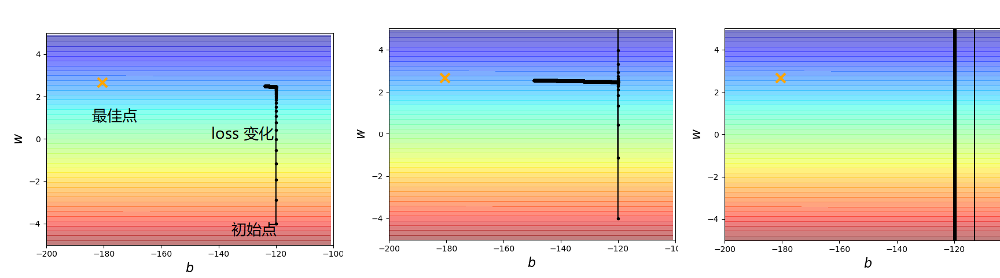
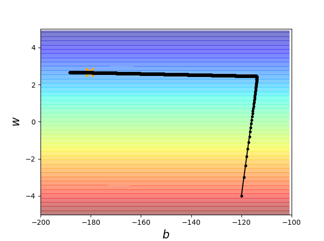

[TOC]


# P4 1-: Regression-Demo-Youtobe <!--代码 7'-->

## Regression_Gradient Descent 代码演示

```python
import matplotlib.pyplot as plt
import numpy as np
```

```python 
x_data = [338,333,328,207,226,25,179,60,208,606]
y_data = [640,633,619,393,428,27,193,66,226,1591]
# ydata = b + w * xdata,用Gradient descent把 b,w 找出来
```

```python
x = np.arange(-200,-100,1)
y = np.arange(-5,5,0.1)
Z = np.zeros((len(x),len(y)))
X,Y = np.meshgrid(x,y)
for i in range(len(x)):
    for j in range(len(y)):
        b = x[i]
        w = y[j]
        Z[j][i] = 0
        for n in range(len(x_data)):
            Z[j][i] = Z[j][i] + (y_data[n]-b-w*x_data[n]**2)
        Z[j][i] = Z[j][i]/len(x_data)
```

```python
# ydata = b + w * xdata
b = -120 # initial b
w = -4 # initial w
lr = 0.0000001 # learning rate
iteration = 100000 # 迭代次数
# store initial values for plotting
b_history = [b]
w_history = [w]
 
# iteration 每个迭代要做的事，计算b,w对loss function 的偏微分
for i in range(iteration):
    b_grad = 0.0
    w_grad = 0.0
    for n in range(len(x_data)):
        b_grad = b_grad - 2.0 * (y_data[n] - b - w * x_data[n]) * 1.0
        w_grad = w_grad - 2.0 * (y_data[n] - b - w * x_data[n]) * x_data[n]
    # update parameters
    b = b - lr * b_grad
    w = w - lr * w_grad
    # store parameters for plotting
    b_history.append(b)
    w_history.append(w)
# plot the figure
plt.contourf(x,y,Z,50,alpha=0.5,cmap = plt.get_cmap('jet'))
plt.plot([-180.4],[2.67],'x',ms=12,markeredgewidth=3,color='orange')
plt.plot(b_history,w_history,'o-',ms=3,lw=1.5,color='black')
plt.xlim(-200,-100)
plt.ylim(-5,5)
plt.xlabel(r'$b$',fontsize=16)
plt.ylabel(r'$w$',fontsize=16)
plt.show()

```

## 输出：

图中不同的颜色代表不同的参数下我们的 **loss**，纵轴是w 的变化,横轴是b的变化 ,红色大，紫色小，

1. 黄色的X为最佳点，黑色的线为我们迭代的 loss function,100000次迭代后并没有到达最佳点，
2. 调大 lr = 0.000001 ,更靠近最佳点,有剧烈的震荡发生
3. 再调大并不适用，loss function会飞出去



## 设置客制化的 lr , 给 b,w 能变化的lr ,可以顺利找到最佳点

```python
lr = 1
...

lr_b = 0
lr_w = 0
# iteration 每个迭代要做的事，计算b,w对loss function 的偏微分
for i in range(iteration):
    b_grad = 0.0
    w_grad = 0.0
    for n in range(len(x_data)):
        b_grad = b_grad - 2.0 * (y_data[n] - b - w * x_data[n]) * 1.0
        w_grad = w_grad - 2.0 * (y_data[n] - b - w * x_data[n]) * x_data[n]
    lr_b = lr_b + b_grad ** 2
    lr_w = lr_w + w_grad ** 2
    # update parameters
    b = b - lr/np.sqrt(lr_b) * b_grad
    w = w - lr/np.sqrt(lr_w) * w_grad
    # store parameters for plotting
    b_history.append(b)
    w_history.append(w)

```




