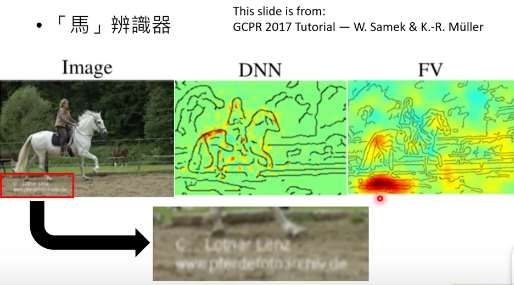

[TOC]

# P 40 The Next Step for Machine Learning  <!-- 15' -->

那接下来我们想要讲说机器学习下一步，就是刚才讲的那些技术在过去的课堂上都或多或少都已经有提到过，那其实这学期我想要讲一些过去从来没有讲过的技术，那这些技术我看作是机器学习的下一步，就是假设我们今天要把机器学习的技术真的用在日常的生活中，还有哪些技术是我们需要的，还有哪些难题是我们需要克服的

## 机器能不能知道“我不知道”

第一个问题就是 机器能不能够知道“我不知道”这件事情，这个是一个很形而上的问题，你知道你不知道这样。机器能不能知道这件事情呢，因为很多时候，你可能训练一个比如说动物的classifier ，他看到这张图片他知道是一只猫，他的正确率可能非常非常的高，但是你真正把这个系统上线的时候，你以为人家只会乖乖丢一个动物给你吗，他可能就丢一个凉宫春日给你 ，这个时候，你的机器到底是会把硬是把这个凉宫春日塞成某只一种动物，觉得他其实长得还是最像猫，还是说你的机器有能力知道这个是我不知道的怪东西。他回答说我拒答，或者是我不知道这个东西是什么，这样的技术叫做 Anomaly 的Detection。机器能不能够知道我不知道，

## 说出为什么“我知道”

再来下一步是机器能不能够说出我为什么知道，今天我们看到了各式各样机器学习非常强大的力量，感觉机器好像非常的聪明，但他看起来这么聪明，他实际上真的那么聪明吗，过去有一个例子，叫做神马汉斯的例子，这个例子是说动物很聪明，有一只马他叫做汉斯，他甚至聪明到他可以做数学。举例来说：你跟它讲根号9是什么，然后它就会敲它的马蹄，然后大家就欢呼，得到正确的答案了，这显然是一只会算数学的马，甚至可以解决开根号的问题，大家都觉得非常的惊叹。但后来有人就怀疑说，难道汉斯真的这么聪明吗，后来有人就说 不要有任何观众，在没有任何的观众的情况下，叫汉斯自己去解一个数学的题目，这个时候它就会踏他的马蹄，一直跺它的马蹄，然后永远都不停这样子。为什么呢，因为它之前是学到了，他观察旁边的人的反应，它知道他什么时候应该停下来，然后接下来他就可以有萝卜吃这样子。它可能不知道现在在干什么，它根本不知道数学是什么，但是你learn 他的时候就是你只要 踏对正确题目的数目，你就可以得到萝卜吃，但是他如何踏对正确的数目跟他有没有智慧没有关系， 它只是看了旁边人的反应得到正确的答案。

今天我们看到种种惊人的机器学习的成果，难道机器真的有那么的聪明吗，会不会它跟汉斯一样只是用了非常奇怪的方法来得到答案的。

这个东西其实是有可能发生的，举例来说，这个是来自于某一个GCPR 的2017的某一个Tutorial， 有人做了一个马的辨识器，他的马的辨识器的正确率很高，有80%+，做了两个不同的model，两个不同的model 都有80%+的辨识正确率。接下来他就想分析那两个model ，有一些机器学习的方法可以告诉我们说今天机器他知道这张图片里有马，他是根据什么标准，根据什么样的特征，根据什么样的暗号知道说图片里面有一只马 。

他得到的结果是这样，他先分析了第一个模型，这个红色的地方代表说机器是看到这些地方，这些地方跟机器判断这张图片里面有没有马是特别有关系的，所以第一个模型是一个正常的模型，显然机器看到这个马，所以他才说图片里面有马。但第二个模型是这样子的，机器看这个图片的左下角，觉得 是有一只马，为什么看左下角会发现有马呢，因为这些马的图片左下角 都有一个英文，这些马的图片都是从同一个网站上截下来的，所以他左下角都有 一串一样的英文，所以机器只是学到说看到左下角的英文 他就是一个马，他并没有真的学会马长什么样子。

所以我们不知道今天的 AI是不是有那么聪明，所以我们需要有一些技术，让AI不只是做出决定，还要告诉我们说它为什么做出这样的决定。

## 机器的错觉

我们知道说，人是有错觉的，举例来说这边 有两个圈圈，我们来问一下大家，你觉得哪一个圈圈是颜色比较深的，事实上左边的颜色比较深，这是一个计中计，你可能以为这是一个错觉的实验，但我知道你以为这是一个错觉的实验，所以左边确实是 比较深的，所以你看人是很容易被骗的。

所以机器跟人一样，也很容易被骗，这个也许就是机器的错觉，我们可以加一些noise，就让机器本来觉得这是熊猫，然后接下来就觉得他是长臂猿，这个技术叫做Adversarial Attack 我们要如何防止这种技术发生，叫做Adversarial Attack 今天甚至可以做到，一个图片，你改图片里面的一个pixel，机器的判断就完全错掉了，因为显然这个如果我们未来要把 影像辨识的模型放到真实的场域里面，如果 叫做Adversarial Attack 技术今天可以做到改一个pixel，就让机器判断错误，那显然这个会有 治安的问题，可以想象未来自驾车开在路上，路边有人拿一个旗子一挥，自驾车就撞车了，这是有可能会发生的。  所以我们要问的问题是如何防止机器发生错觉

## 终身学习

那我们也要让机器能够终身学习。我们知道人就是终身学习的，你上个学期可能修了线性代数，那这个学期你就修机器学习，那修过线性代数，可能会更容易让你了解 机器学习这门课的内容。但是机器能不能够跟人一样他也做终身学习呢，今天其实机器并没有做终身学习这件事情，因为 Alpha Go他就是下围棋，Alpha star他就是玩星海，Alpha Go 并不会玩星海，Alpha star 并不会下围棋 它们并不是同一个模型。

今天我们通常是一个机器学习的任务我们就会那个机器学习的任务去学一个模型，  但这显然最终是行不通的 ，假设我们有一个机器人，他真的要在日常的生活中运作，他要解的任务绝对不止一两个，他不止要下围棋，他不止要玩星海，他还要能够做影像辨识，还要能够做语音辨识，他要解的任务非常非常多，如果我们为每一个任务都需要学一个模型的话，那这个模型的数量无限制的增长，直到我们的 memory 没有办法存下那么多模型为止，而且如果不同的技术就需要不同的模型，那不同的技术间就没有办法互通有无，机器在某一个任务学到的技能就没有办法帮助他在另外一个任务学的更好，

但是为什么我们今天不让机器做终身学习这件事情呢，因为假设你让机器先去学下围棋，他学会下围棋，接下来你再用 同一个模型让他学习玩星海，他也会玩星海，但是 它就不会下围棋了。这个叫做Catastrophic Forgetting。今天如果你要让机器做终身学习，同一个模型他不断的学新的任务的时候， 一个还尚待解决的问题，那我们之后的课程会讲一下现在有什么样的 life-long Learning 的技术

## 学习如何学习

那我们也要让机器学习如何学习，过去我们是写一个程式，让机器具有学习的能力，接下来我们能不能够写一个程式，这个程式可以写一个具有学习能力的程式，然后让机器去做学习，我们写了一个有学习能力的，我们写了一个可以写出有学习能力的程式的程式  ，然后这个程序会写出有学习能力 的程式，然后机器具备有学习的能力，这个技术叫做Meta-Learning 或者叫做 Learn to Learn。就是学习如何学习，过去我们设定了学习的演算法，机器按照学习的演算法进行学习，今天我们能不能让机器自己出学习的演算法，再根据他自己学出来的学习的演算法去进行学习。可以做出过去根据人类设定的学习演算法没有办法做到的事情，

## 一定需要很多训练资料吗？

那我们知道说机器学习就是需要很多训练资料，但是往往有一天，比如说你毕业以后，你的老板可能说，听说你修过机器学习这门课，来帮我做个影像分类的东西吧，我要你辨识比如说什么是草泥马，这时候你可能会说那有几张资料呢，你可能期待说给我个10W张差不多，然后老板说大概就这一张差不多，然后你自己回去想办法这样子，这个时候你有两个选择，一个是把老板的头打爆，然后辞职，然后另外一个选择就是你可以考虑用一下Few-shot learning 的方法，能会让机器只看非常少量的example，接下来他就学会这个任务，

甚至有没有可能做 Zero-shot learning ，也就是不给机器任何的训练资料，你只告诉他说马来貘就是包着尿布有白色体毛，其他部位皆成黑色，机器看到一个马来貘，他从来过去从来没有看过马来貘，但是他根据马来貘的文字描述就认出说这是一只马来貘，这个是 Zero-shot learning的技术  

## 增强式学习

那Reinforcement Learning 今天大家一讲再讲，一讲再讲，感觉好像是每一个任务你不用Reinforcement Learning 解就不够潮一样，但是Reinforcement Learning真的有那么强吗，举例来说， 当你用Reinforcement Learning这个技术 去打一些 apari 的电玩，打一些简单的小游戏的时候，Reinforcement Learning 的技术也许确实可以跟人做到差不多的performance，但是你看看他玩 这个游戏所需要的时间，他需要玩900多个小时才能够得到4000分左右，而人类的能力在哪里呢，人类在2个小时以内就可以得到4000分左右。所以机器感觉就是一个勤奋不解的人，但是他很笨，所以他需要花非常非常多的时间来学习才有可能跟人做的一样好， 

或者是我们举另外一个例子，我们刚才讲了Alpha star，机器现在可以在星海上痛扁人类，就算他的手速比人慢，但他可以痛扁人类，但是 Alpha star 他花了200 年的时间在玩星海，他实际上玩的时间就是200年，只是因为你知道他玩星海是用模拟的，所以他就像是进入了精神时光坞一样，所以实际上玩星海玩了200年，如果让你进入精神时光坞，玩 200年，你不吃不睡，就只能够玩星海的话，你应该也是有 Alpha star 那么强的 ，

所以我们今天要问的问题是 Reinforcement Learning为什么这么慢，有没有办法让它学的快一点。

## 神经网络压缩

然后呢我们今天接下来如果我们要把深度学习的模型应用在日常生活中，我们知道很多 agent？？ 端的 device，他的运算的能力是很有限的，他的memory 的资源是匮乏的，所以我们接下来要问的另外一个问题是我们能不能够把Network 的架构缩小，但让它仍然有同样的能力。我们能不能够把一个大的类神经网络缩小，减掉多余没用的参数，或者是我们能不能够把一个类神经网络的参数二元化，本来类神经网络的每一个参数都是  continuous 的 number，你显然需要很大量的运算来做 continuous  number 的加减乘除， 你显然需要很大量的memory 才能存这些 continuous  number，我们能不能把所有参数都变成 +1 跟 -1 ，这样运算起来就快，储存network的时候你需要的 记忆体也会少很多，这个就是我们这学期会讲的 其中一件事情，

## 机器学习的谎言

再来要告诉大家一个机器学习的谎言就是 所有的教科书都会告诉你说，我们今天在训练和测试的时候，我们假设训练资料跟测试资料的data 他的分布是一样的，或者至少是非常类似的，但实际上在真实的应用里面，这就是一个谎言。

如果今天你在做手写数字的辨识，你的训练资料长这样，你的测试资料长这样，他们非常的像，他们有同样 的 Distribution，可以轻易的得到 99% 以上的正确率。但是今天假设你在工作的时候，你的老板可能会给你这样的任务，这是我们公司的训练资料，他的测试资料差不多就是这个样子，你给我想个办法处理一下，这个时候你有两个选择，一个是你拿出 bishop ？？那一本书，有600页 然后砸在老板脸上，跟他说这个书里面就告诉我们说训练资料和测试的 Distribution 是一样的，这个问题没有办法解，但是你想想你家里有老婆孩子，所以你含泪还是要解一下这个问题，

如果你训练在这样子的训练资料上，真的测试在这样子的测试资料上，你可能觉得说这个问题也许机器还是做的到的，因为虽然说背景我们加了一些颜色，但是假设机器可以真的认识数字的形状，忽略那些颜色的话，应该结果也不会太离谱，但实际上你自己做做看，你就会发现说，今天假设训练资料是这样，测试资料是有颜色的数字，正确率变成57.5%，整个就是烂掉了。机器不知道怎么回事，你加了些背景颜色以后，他就认不得这些数字，那怎么让机器在训练资料和测试资料 的分布不太一样的时候他还能够稍微做一些事情，这边有一些技术是可以跟大家分享的

## 机器学习的下一步

总之这是这学期想要跟大家分享的东西，

