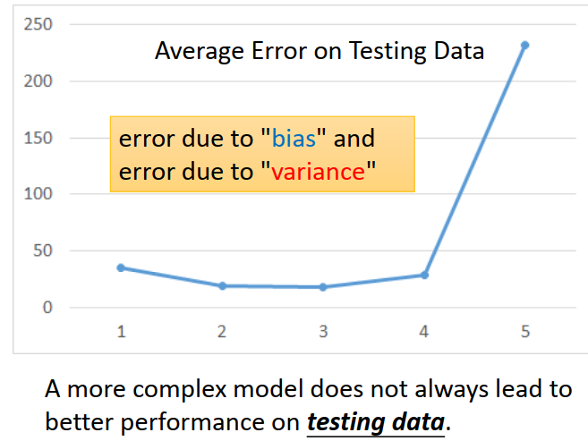
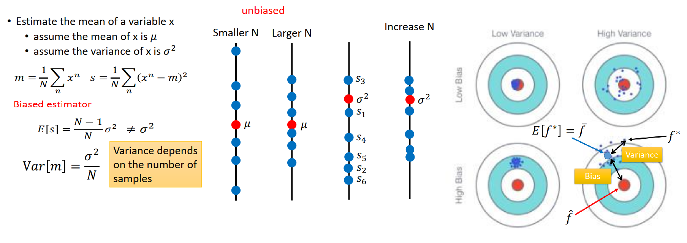

[TOC]

# P5 2: where dose the error come from <!--重要 43'-->

## Review

选择不同的function set，也就是选择不同的model，会得到不同的error

越复杂的model，不见得会得出越低的error 

- error due to **bias** 偏移

- error due to **variance**  散度/方差

如果可以诊断error的来源, **bias**/**variance**,可以挑选适当的方法来improve自己的model，

## Estimator  (估计值)

1. 要做宝可梦进化后 C P 值的估测 : 找一个function,input一只宝可梦,output就是进化以后的 C P 值
2. 理论上有一个最佳的 function :f_hat，但我们不知道,
3. 只能根据 training data (实际去抓一些宝可梦,根据进化前后的 C P 值)，找到最佳 f 的估测值f*
4. 就好像是打靶,f_hat 是靶的中心点,通过training data找到的f* ,f* 在靶纸上的另外一个位置
5. f* 和f_hat中间有一段距离,这个距离来自于两件事,可能来自于 **bias**或者**variance**

###  估计 x 的 均值

#### assume the mean of x is 𝜇  (假设x的均值为𝜇 ),如果要估测mean

- 取n个点，算n个点的均值m,m实际上不会等于𝜇 （除非n为无穷大）
- 做多次实验，得到m 1, m 2…,对m求期望，得到 𝜇
- 每个m 都不一定等于 𝜇，但是找很多m,他们的期望值等于 𝜇，这样得出的 𝜇 是unbiaesd

#### assume the variance of x is 𝜎2  (假设x的方差为𝜎2),Variance depends on the number of samples  (Variance 取决于我们取了多少samples )

- 样本散落在𝜇周围，散的多开，取决于m的variance （方差）
- 样本量n大，样本分布相对集中, 样本量n小，样本分布相对分散
- s 来估计𝜎2，s会散布在 𝜎2周围，计算s的期望值比 𝜎2小，即Biased estimator (有偏估计)
- 样本量n无穷大，E[s]无限接近𝜎2，n大，s会相对集中

### 目标：估测靶的中心 f_hat

做实验找出来的 f* 和红心之间的error发生了两件事，**bias(瞄准的位置)和variance(手抖不抖)**

- estimate(估计值)是不是bias的,计算f*的期望 f_ba，本实验中estimate 和靶中心f_hat有bias,**瞄的时候没有喵准**
- 你瞄准了中心，**但是射出去之后还会有偏移**，所以每次找出来的 f* 不一样， f* 和 f_ba 之间的距离是variance

**期望：没有bias，低 variance**(比较分散就是high  variance，比较偏 就是high bias)

#### 假设：有无数的平行宇宙，每个宇宙抓10只宝可梦，计算 f*，

在每个不同的宇宙中抓10只宝可梦,计算f *,每个宇宙的宝可梦不同, 即使使用同一个model,f * 也不同,

 **把100个不同宇宙 的 f *放在同一界面**

- 在不同的模型复杂程度下，100个f*呈现的散度variance不一样，
  - **简单的模型，散度variance更低，比较集中**
  - 复杂的model，散布很开，
  - **Simpler model is less influenced by the sampled data (简单的模型受样本影响更小)**

- Bias: 我们有很多f *,吧所有的 f * 平均起来，找他的期望值f_ba, f_ba和靶心 f_hat 有多接近?
  - large bias 就是f * 取平均和靶心有一定的距离
  - small bias f *可能分散很开，但不用管，就找他的平均值和靶心是接近的
  - 实际我们是不知道靶心是多大，没法计算Bias
  - **简单的model有较大的bias,复杂的model有较小的bias，**
  - 实验结果
    1. 黑色线是目标function ，蓝色线是期望，红色线是实验结果
    2. **简单的model**的function set比较小,**有比较大的 bias** 实验结果可能就没有包含target，红色线甚至没有包含黑色的线
    3. **复杂的model**的function set比较大,**有比较小的 bias**,（有的复杂function包含简单function,比较可能包含target，没有办法找出最佳target，每次的 train data 不一样，得到的function都不一样，如果他们散布在target附近，平均起来就得到f_ba

#### Bias v.s. Variance

回到上次课model对testing data error 所画出来的线

- **简单的model，Large bias 和 Small Variance**
- **复杂的model，Small bias 和 Large Variance**
- 图中，由左到右，model 的 bias造成的 error 逐渐下降（红线），同时Variance愈来愈大（绿线）,当bias 和 Variance同时被考虑得到蓝色这条线,**也就是说在某个地方可以找到一个平衡的点,当你同时考虑 Bias 和Variance时候,得到的error最小**,
- 如果 error 来自于  Variance 很大,这个状况就是 Overfitting(如果在 training data 得到小的error,在testing data 上得到大的error)
  - More data (增加 data )比较有效通常比较难以实现 在图像识别中可以通过翻转图片等方式来实现
  - **Regularization 正则化**，希望参数越小越好，也就是希望曲线越平滑越好，**有可能伤害bias** (抹除了不光滑的model）
- 如果 error 来自于  bias 很大,这个状况就是 Underfitting (**如果model没有办法fit  training example**) ,redesign your model  (重新设计模型)
  - Add more features as input   加入更多的特征
  - A more complex model  用一个更复杂的式子

## Model Selection 

我们有很多model和很多参数可以选择,通常我们在bias and variance中做一些平衡(trade-off),希望找一个bias + variance最小的model

**不要做用testing data 去返回来纠正training data 训练结果，testing data也不是真正的分布(有自己的bias)**

### Cross Validation 

1. 将 Training Set 分成 Training Set + Validation set
2. Training Set 用来 train model ，Validation set 用来选model
3. 把 model 1，model 2 和model 3 用Training Set 训练好后，看一下三个 model 在 Validation set 上的 error
4. 假设model 3在Validation set表现最好,确定 model 3 ,用Training Set + Validation set 在 model 3 上再 train 一次 model
5. 用 得到的 model  应用到 public set上,可能error>0.5,这样在public set 才能反应在private set的误差
6. 不建议：当看到  public set 结果太差，又回头去调整，
   - 这样就把 public set 的 bias 考虑进去了，
   - 这样public set 的表现没有办法反应 private set 的表现
   - **原则上少去碰  public set，不根据他来调整model，往往在private set得到的差距和  public set 比较小**

### N-fold Cross Validation N折交叉验证

假设分三份，做三次实验，两份训练，一份做验证,分别计算error,和 Avg Error

- 发现model1 最好，

- 用model1再train在你完整的Training Set上

- 再test 在 testing set 上

  

