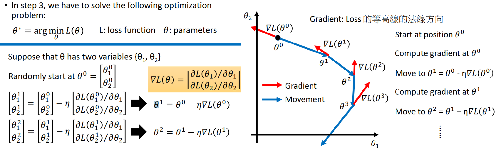
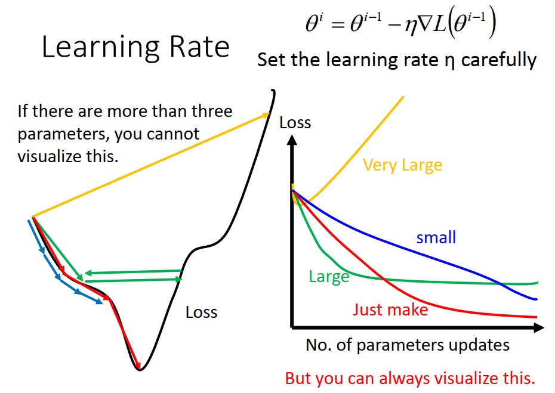
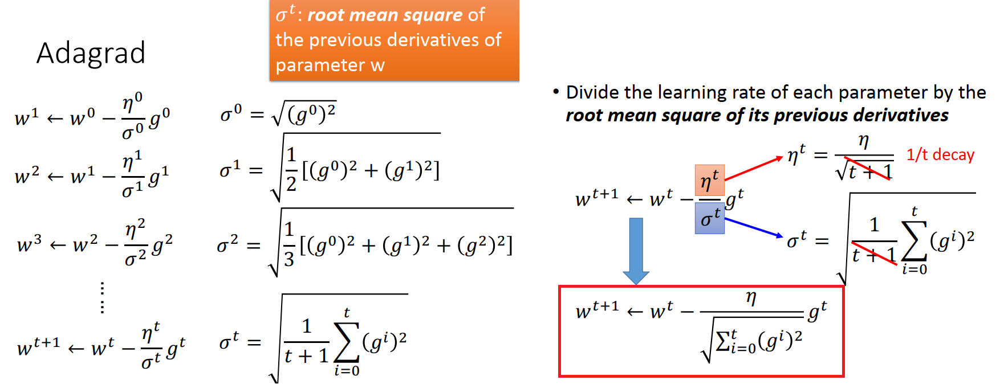
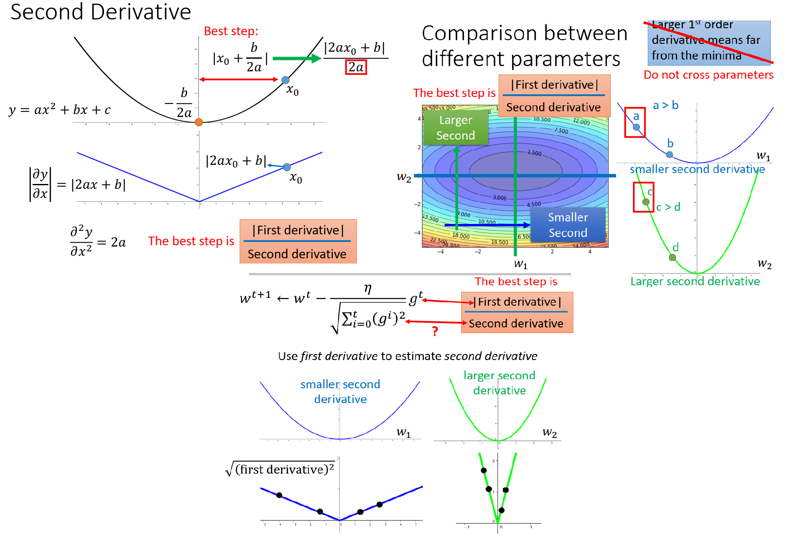
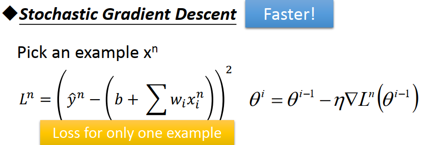
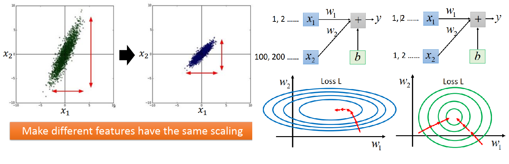
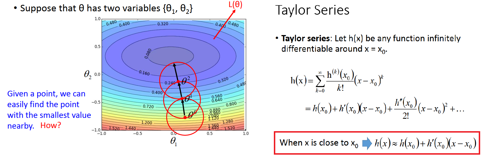
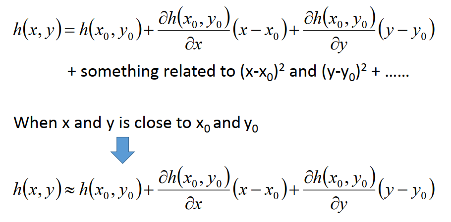
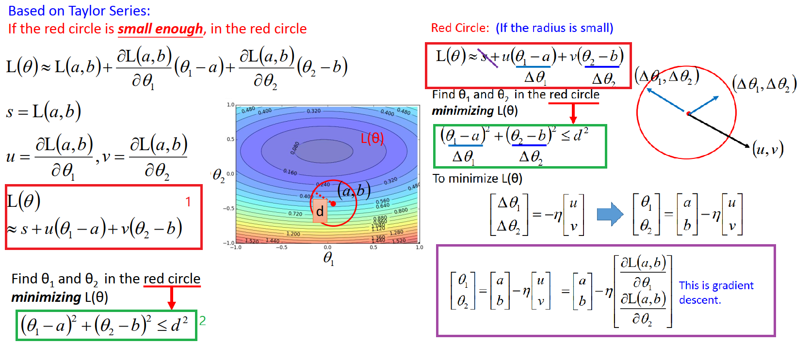
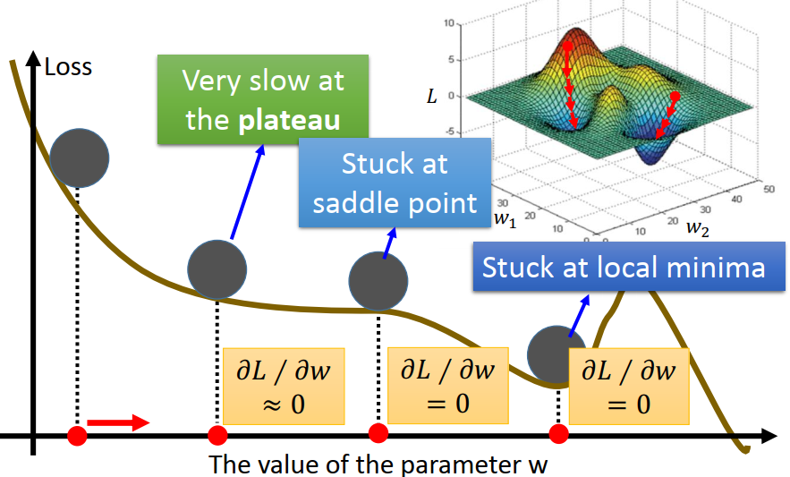

[TOC]

# P6 3-1: Gradient Descent <!--重要 61'-->

## Review: Gradient Descent  

在 Machine Learning  step 3 中，我们要找一个最好的function，解一个optimization problem（优化问题）

1. 在 step 2 我们先定了 loss function **L** ,**L**是function的function,把一组参数**𝜃** 带到 loss function里面,就会对这组参数产生评价,告诉我们这组参数有多不好
   $$
   \theta^* = \mathop {argmin}_{\theta}L(\theta)
   $$

2. 假设 **𝜃** 里面有两个参数 {**𝜃~·1~**, **𝜃~2~**},找到一组参数 **𝜃** ，使损失函数loss function最小，

3. 随机选取起始的点 **𝜃^0^** 

4. 计算偏微分，更新**𝜃^0^**到**𝜃^1^**，同样的步骤反复进行,就是 Gradient Descent

   

   

5. 上图是将gradient descent在投影到二维坐标系中可视化的样子，图上的每一个点都是(**𝜃_1,𝜃_2,loss **) 在该平面的投影

   1. 红色箭头是指在(**𝜃_1,𝜃_2**)这点的梯度，梯度方向即箭头方向(从低处指向高处)，梯度大小即箭头长度(表示在θ i 点处最陡的那条切线的导数大小，该方向也是梯度上升最快的方向)
   2. 蓝色曲线代表实际情况下参数(**𝜃_1,𝜃_2**)的更新过程图，每次更新沿着蓝色箭头方向loss会减小，蓝色箭头方向与红色箭头方向刚好相反，代表着梯度下降的方向
   3. 因此，**在整个gradient descent的过程中，梯度不一定是递减的(红色箭头的长度可以长短不一)，但是沿着梯度下降的方向，函数值loss一定是递减的**，且当gradient=0时，loss下降到了局部最小值，
   4. 总结：梯度下降法指的是函数值loss随梯度下降的方向减小

## Tip 1 :Tuning your learning rates (小心的调整learning rates)

**可以Visualize（可视化）参数的变化对loss的变化(右图)**

1. 如果learning rates 刚刚好，顺着红色的箭头，很顺利的找到最低点
2. 如果learning rates 太小，走的速度会非常慢,蓝色箭头
3. 如果learning rates 太大，可能会越过最低点,绿色箭头或者黄色箭头

### 自动调整learning rates

Popular& Simple Idea:**随着参数的update，learning rate会越来越小**

1. 最开始，离最低点比较远，步伐要大一点
2. 迭代几次之后，比较接近目标，减小learning rate,让他可以收敛在最低点的地方

**Giving different parameters different learning rates 不同的参数有不同的learning rate**

#### 普通的 Gradient descent ,w是单个参数

$$
w^{t+1} \leftarrow w^t - \eta^tg^t
$$

$$
\eta^t = {\eta\over \sqrt{t+1} \quad},  g^t ={\partial L(\theta^t)\over\partial w}
$$

#### Adagrad ，参数更新越来越慢(对学习率下手) 

每个参数的 learning rate 都除以之前算出来所有的**微分值(g)**的均方根**(root mean square)**(左图)

**𝜎^𝑡 :过去所有的微分值(g)取均方根,这个值对每个参数都是不一样的**

------

我们希望 Gradient (g) 越大,参数 update 越快.但是在 Adagrad 中 g^t 越大 , 但是同时分母也越大，使整体步伐变小，造成反差的效果.**Adagrad考虑的是Gradient有多surprise(反差)**，同样的0.1根据前面的Gradient不同看起来大小也不一样

- 考虑一个二次函数 	

$$
y = ax^2 + bx + c
$$

$$
y对x做微分 : |{\partial y \over \partial x }|= |2ax+b| ,最低点是 {-b\over 2a}
$$

​		随机选一个点 x0 做Gradient descent,踏出一步最好的步伐是|2a x0 + b|/2a，|2a x0 + b|是x0 点的一次微分.		**如果算出来的微分越大,就离原点越远,最好的步伐和微分的大小成正比(只考虑一个参数时才成立)**

- 多个参数上面结论不成立，考虑w1,w2两个不同的参数(图上的颜色是他的loss),不同参数下降速度不一样，当跨参数比较点a和点c时,c的微分比a大，但是c离最低点更近

**最好的步伐是|2ax0 + b|/2a,分母是 2 a，也就是y对x进行二次微分**

**最好的步伐不止是要正比于一次微分,同时要和二次微分的大小成反比**.如果二次微分比较大,参数的update量应该比较小;如果二次微分比较小,参数的update量应该比较大.把二次微分考虑进来,一个或者多个参数的最好步伐都是成立的

**这就是Adagrad 的思想， g^t^ 是一次微分,增加的分母就相当于二次微分.也就是让不同参数不同斜率保持在同一下降水平**

​	比较平滑的峡谷里面,一次微分斜率比较小,二次微分就比较小,相除之后,步子比较大(自己拓展)

​	比较尖的峡谷里面,一次微分斜率比较大,,二次微分就比较大,相除之后,步子比较小(自己拓展)

------

## Tip 2 :Stochastic Gradient Descent 随机梯度下降-让训练更快

原来 loss 是所有样本放在一起算一次Gradient Descent

**每次拿一个 Xn(可以随机取或者按顺序取)计算loss，loss只考虑一个样本**,只考虑现在的参数对这个样本的**y的估测值**再减掉正确答案再做平方，只算某一个example的loss，update 参数时,只考虑那一个样本.在正常情况下update一次参数的时候,SGD 已经update 20次了.

## Tip 3 : Feature Scaling 改变特征分布的范围 

假设现在要做Recognition,input features 有  x1 和 x2 ,如果他们的分布的range很不一样,建议做 Scaling,**Make different features have the same scaling (使不同特征有同样的分布范围)**
$$
y = b+w_1x_1 + w_2x_2
$$

1. 如果   x1 (取值范围为1,2,...)和 x2 (取值范围为100,200,...)的量级不同,把w1 和 w2做一样的更动,发现w1 的变化对y的变化的影响比较小,w2 的变化对y的变化的影响比较大.
2. 可视化w1 和 w2对 error 的影响,w1 对y的影响比较小,对loss的影响比较小,比较平滑; w2 对y的影响比较大,对loss的影响比较大,比较陡
3. 如果 x1 和 x2的scale 比较接近,loss就比较接近圆形,
4. 在 Gradient Descent 时,scale不同的 x1 和 x2 需要不同的learning rate,比较不好计算,而且顺着等高线并非最低点方向前进;**但是Scale之后,会变成正圆形,update参数比较容易,而且向着最低点方向前进**
5. 提问:标准化 和 Adagrad 都是 使不均匀的特征有相近的 步长 

### 如何进行 Feature Scaling(有很多种方法,这只是其中之一)

对于每一个维度i，计算平均值𝑚𝑖,标准差𝜎 𝑖，对第r个样本的第i个特征进行转换;  转化后所有特征均值为0,方差为1
$$
x_r^i  \leftarrow {x_r^i - m_i\overσ_i }
$$

## Gradient Descent Theory -Gradient Descent 理论基础

理论上:每一次用Gradient Descent ，更新参数之后，𝜃  都会使 L(𝜃)   越来越小(实际上并不一定,有可能梯度为0)
$$
𝐿(𝜃^0) > 𝐿(𝜃^1) > 𝐿(𝜃^2) > ⋯
$$

1. 找loss的最低点，给起始的点 𝜃^0^，起始点附近画一个圆圈，在圈里面找出最低点,更新中心的位置得到𝜃 ^1
2. 以𝜃 ^1^为中心再画一个圈得到最低点,更新中心的位置得到𝜃 ^2，
3. 再继续画圈更新...

### 怎么从红色圈里找最小的点，引出泰勒展式

- 泰勒展式:任何h(x),如果在x = x0这一点是光滑,就可以展开
- 当x接近x0 时 ,(x-x0)就会远大于(x-x0)^2,大于后面的高次项,后面的高次项就可以删掉

### 多元素泰勒展式

### 基于泰勒展式，如果红色圈足够小，可以把loss function 用泰勒展式做简化

1. 如果今天给我一个中心点,(a,b),画一个很小很小的红色的圆圈,**在红色圆圈的范围内,可以把loss  function 用泰勒展式做简化**
2. 偏导之后的常数项用字母s,u,v 来表示, L(𝜃) 就可以简化为红色方框1中式子.
3. 在红色圈圈内找 𝜃1 和𝜃2 ,让loss最小,红色圈圈的中心就是(a,b),范围就是绿色方框2中的式子
4. 将(𝜃1-a) 和 (𝜃2-b) 用 $\Delta𝜃_1 和 \Delta𝜃_2$  来表示,   s 不用管
5.  L(𝜃)  就可以看成是 (**$\Delta𝜃_1 , \Delta𝜃_2$**) 和(u,v) 的内积
6. 如果要让  L(𝜃)最小, 使($\Delta𝜃_1 , \Delta𝜃_2$)和(u,v)相反方向,再把它增长,长到红色圈圈的边缘,算出的内积最小
7. 整理之后紫色方框里的式子就是 Gradient Descent(画出来的红色圈圈够小,这个式子才成立)
8. 如果红色圈不够小，也就是learning rate不够小，可以考虑二次式也考虑进来

## Gradient Descent 限制

这三处都可能出作为最终输出点，但都不是global minima

1. 微分是 0 的点可能是 Local minima
2. **saddle point** (驻点) 微分也是 0
3. 很平的地方 **plateau**,微分很小的地方也会停下来

# P7 3-2: Gradient Descent（Demo by AOE） <!--不重要  2‘-->

用游戏 世纪帝国 来说明local minima 和global minima

# P8 3-3: Gradient Descent（Demo by maincraft） <!--不重要  2’-->

用游戏 我的世界 来说明local minima 和global minima